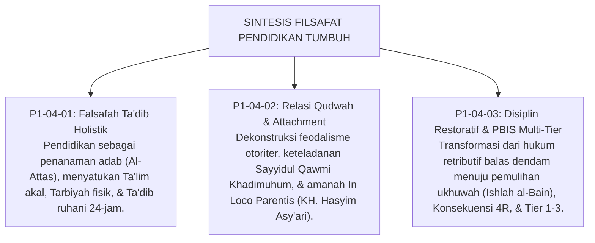

# P1-04-04: SINTESIS FILSAFAT PENDIDIKAN TUMBUH
## *Konsolidasi Paradigma Ta'dib, Qudwah, dan Disiplin Restoratif Multi-Tier Menuju Ekosistem Pembelajaran Paripurna*

**Nomor Identifikasi**: `P1-04-04/SINTESIS-EDUCATION/2026`  
**Domain**: `01 Philosophy` > `04 Education`  
**Dewan Pakar**: `pakar-filosofi-tumbuh`, `pakar-arsitektur-pbis-restoratif`, `pakar-pedagogi-master-guru`

---

## 📑 DAFTAR ISI ANALITIS

1. [1. Integrasi Tiga Pilar Filsafat Pendidikan TUMBUH](#1-integrasi-tiga-pilar-filsafat-pendidikan-tumbuh)
2. [2. Matriks Epistemologis: Domain Education TUMBUH](#2-matriks-epistemologis-domain-education-tumbuh)
3. [3. Jembatan Filosofis Menuju Sub-Domain 05 (Leadership & Qudwah)](#3-jembatan-filosofis-menuju-sub-domain-05-leadership--qudwah)
4. [4. Manifesto Pedagogi Adab Ekosistem TUMBUH](#4-manifesto-pedagogi-adab-ekosistem-tumbuh)

---

### 1. Integrasi Tiga Pilar Filsafat Pendidikan TUMBUH

Sub-Domain `04 Education` menyatukan tiga pilar praksis pendidikan ke dalam satu tarikan nafas yang harmonis:

---

### 2. Matriks Epistemologis: Domain Education TUMBUH

| Modul Analisis | Landasan Turats Klasik | Landasan Sains Kontemporer | Manifestasi Praktis di Asrama |
| :--- | :--- | :--- | :--- |
| **P1-04-01 (Ta'dib)** | HR. As-Sam'ani (*Addabani Rabbi*), Syed Muhammad Naquib al-Attas. | *Holistic Education Framework* & *Experiential Learning*. | Penilaian portofolio kelulusan adab 10 Muwashafat 24-jam. |
| **P1-04-02 (Relasi Guru-Santri)**| KH. Hasyim Asy'ari (*Adab al-'Alim*), HR. Abu Nu'aim (Sayyidul Qawm). | *Attachment Theory* (Bowlby) & *Relational Pedagogy*. | Budaya kehangatan in loco parentis dan penghapusan intimidasi. |
| **P1-04-03 (Disiplin Restoratif)**| QS. Al-Hujurat: 10 (Ishlah al-Bain), Fiqh Jinayat (Ta'widh & Daman). | *School-Wide PBIS* (Sugai & Horner) & *Restorative Justice*. | Penerapan Konsekuensi Logis 4R dan penanganan Multi-Tier 1–3. |

---

### 3. Jembatan Filosofis Menuju Sub-Domain 05 (Leadership & Qudwah)

Sistem pendidikan yang beradab dan berkeadilan ini tidak akan mampu beroperasi secara mandiri tanpa ditopang oleh **kepemimpinan pesantren yang berwibawa dan sarat keteladanan**. 

Maka dari itu, diskursus ini bermuara pada **Sub-Domain `05 Leadership`**, yang membedah kepemimpinan *Servant Qudwah*, standarisasi kompetensi musyrif, tata kelola bebas nepotisme, dan kaderisasi kepemimpinan santri pengayom.

---

### 4. Manifesto Pedagogi Adab Ekosistem TUMBUH

> *"Pendidikan pesantren bukanlah pabrik pencetak hafalan yang dingin, bukan pula penjara pendisiplinan yang bengis. Pendidikan pesantren adalah majelis Ta'dib nabawi di mana ilmu dihargai dengan adab, kesalahan diperbaiki dengan keadilan restoratif, dan setiap santri dipimpin dengan kehangatan keteladanan (*Qudwah Hasanah*) menuju keridhaan Allah SWT."*
