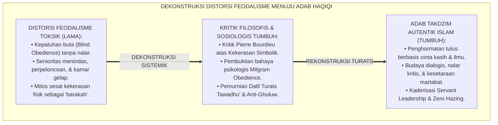
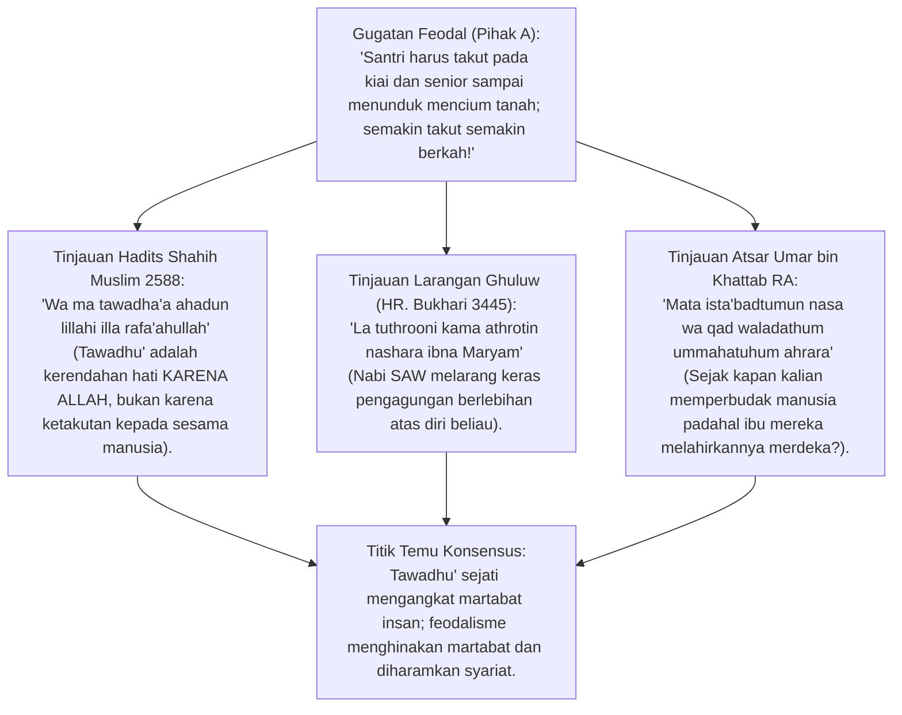
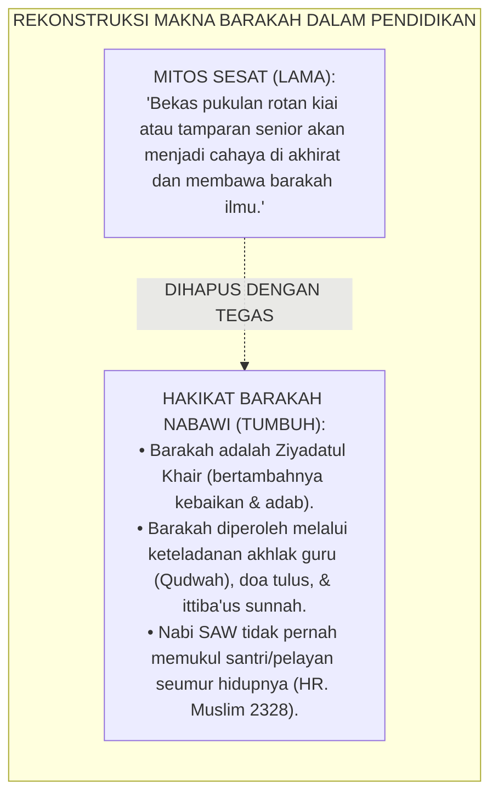
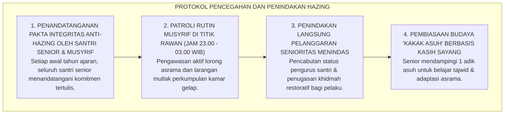

# P1-04-05: KRITIK EPISTEMOLOGIS FEODALISME DAN KEKERASAN PENDIDIKAN PESANTREN
## *Monograf Terpadu: Dekonstruksi Distorsi Tawadhu Palsu & Budaya Kepatuhan Buta (Blind Obedience), Kritik Historis-Sosiologis Feodalisme Asrama, Pembongkaran Mitos Kekerasan Sebagai 'Barakah Guru', Rekonstruksi Adab Takdzim Autentik Turats, dan Pengharaman Total Perpeloncoan Senioritas*

**Nomor Identifikasi**: `P1-04-05/MONOGRAF-TERPADU-KRITIK-FEODALISME/2026`  
**Domain**: `01 Philosophy` > `04 Education`  
**Klasifikasi Naskah**: *Comprehensive Integrated Monograph* (Monograf Akademis & Rumusan Baku Terpadu)  
**Rumpun Disiplin Pengkaji**: Filsafat Kritis Pendidikan Islam (*Critical Islamic Pedagogy*), Sosiologi Pesantren & Relasi Kuasa (*Power Relations & Symbolic Violence Pierre Bourdieu*), Fiqh Mu'asyarah Guru-Murid, Psikologi Sosial Otoritarianisme  

---

> ### 💡 INTISARI PRAKTIS (3 MENIT PAHAM UNTUK ASATIDZ & MUSYRIF)
>
> * **Membedakan *Tawadhu' Haqiqi* (Rendah Hati Tulus) dengan *Feodalisme Ketakutan*:**  
>   Tawadhu' sejati lahir dari kesadaran keagungan Allah SWT dan penghormatan ikhlas atas ilmu yang dibawa guru. Sebaliknya, feodalisme menuntut kepatuhan buta (*Blind Obedience*) santri melalui intimidasi, perpeloncoan, dan rasa takut disiksa fisik/mental.
> * **Pembongkaran Mitos Sesat "Kekerasan Adalah Sumber Keberkahan":**  
>   Tidak ada satu pun ayat Al-Qur'an, Hadits shahih, maupun kitab salaf yang menyatakan bahwa ditampar guru atau diinjak senior mendatangkan berkah (*Barakah*). Barakah lahir dari *Ittiba'us Sunnah*, keikhlasan, dan penjagaan kehormatan sesama mukmin.
> * **Penghapusan Total Tradisi Senioritas Menindas di Asrama:**  
>   Kamar gelap, sidang tengah malam yang menghakimi adik kelas, pemaksaan mencuci baju senior, dan aksi pemukulan berdalih tradisi adalah **Kezaliman Jahiliyyah** yang wajib dibasmi 100% dari bumi pesantren.

---

## 📑 DAFTAR ISI MONOGRAF

- [BAGIAN I: RISET KRITIK EPISTEMOLOGIS FEODALISME, DIALEKTIKA INKUIRI, & KASUISTIKA LAPANGAN](#bagian-i-riset-kritik-epistemologis-feodalisme-dialektika-inkuiri--kasuistika-lapangan)
  - [1. Kerangka Metodologi Kritik Kritis: Membedah Distorsi Relasi Kuasa dalam Tradisi Pesantren](#1-kerangka-metodologi-kritik-kritis-membedah-distorsi-relasi-kuasa-dalam-tradisi-pesantren)
  - [2. Inkuiri 1: Eksegesis Turats Tawadhu Sejati vs Ghuluw Pengagungan Manusia (HR. Muslim No. 2588)](#2-inkuiri-1-eksegesis-turats-tawadhu-sejati-vs-ghuluw-pengagungan-manusia-hr-muslim-no-2588)
  - [3. Inkuiri 2: Dekonstruksi Kekerasan Simbolik (Symbolic Violence Pierre Bourdieu) & Milgram Experiment](#3-inkuiri-2-dekonstruksi-kekerasan-simbolik-symbolic-violence-pierre-bourdieu--milgram-experiment)
  - [4. Inkuiri 3: Kritik Historis Mitos 'Barakah Pukulan': Mengembalikan Hakikat Barakah Sesuai Sunnah](#4-inkuiri-3-kritik-historis-mitos-barakah-pukulan-mengembalikan-hakikat-barakah-sesuai-sunnah)
  - [5. Inkuiri 4: Rekonstruksi Relasi Guru-Santri Berbasis Ukhuwah, Musyawarah, & Pemuliaan Martabat](#5-inkuiri-4-rekonstruksi-relasi-guru-santri-berbasis-ukhuwah-musyawarah--pemuliaan-martabat)
  - [6. Inkuiri 5: Silogisme Logika, Dialektika 3 Ronde, Kasuistika Asrama, & Titik Temu Konsensus](#6-inkuiri-5-silogisme-logika-dialektika-3-ronde-kasuistika-asrama--titik-temu-konsensus)
- [BAGIAN II: TEMUAN RISET, FORMULASI KONSEPTUAL & PEMBAHASAN](#bagian-ii-temuan-riset-formulasi-konseptual--pembahasan)
  - [1. Formulasi Konseptual: Pemurnian Adab Takdzim & Pengharaman Feodalisme Pesantren TUMBUH](#1-formulasi-konseptual-pemurnian-adab-takdzim-pengharaman-feodalisme-pesantren-tumbuh)
  - [2. Matriks Komparasi Karakteristik: Tawadhu' Autentik Turats vs Feodalisme Otoritarian Toksik](#2-matriks-komparasi-karakteristik-tawadhu-autentik-turats-vs-feodalisme-otoritarian-toksik)
  - [3. Pakta Integritas Pendidik & Piagam Anti-Perpeloncoan Senioritas Asrama (Anti-Hazing Protocol)](#3-pakta-integritas-pendidik--piagam-anti-perpeloncoan-senioritas-asrama-anti-hazing-protocol)
- [BAGIAN III: APARATUS AKADEMIS & APENDIKS](#bagian-iii-aparatus-akademis--apendiks)
  - [1. Tabel Sintesis Hasil Riset Kritik Feodalisme](#1-tabel-sintesis-hasil-riset-kritik-feodalisme)
  - [2. Daftar Pustaka Akademis & Rujukan Turats Primer](#2-daftar-pustaka-akademis--rujukan-turats-primer)
  - [3. Catatan Kaki Akademis (Footnotes)](#3-catatan-kaki-akademis-footnotes)
  - [4. Glosarium Teknis Tawadhu', Symbolic Violence, & Anti-Hazing](#4-glosarium-teknis-tawadhu-symbolic-violence--anti-hazing)

---

# BAGIAN I: RISET KRITIK EPISTEMOLOGIS FEODALISME, DIALEKTIKA INKUIRI, & KASUISTIKA LAPANGAN

---

### 1. Kerangka Metodologi Kritik Kritis: Membedah Distorsi Relasi Kuasa dalam Tradisi Pesantren

Dalam perjalanan sejarah sebagian lembaga pendidikan Islam, sering kali terjadi distorsi epistemologis di mana nilai keluhuran adab mengalami pembelokan menjadi feodalisme:
* Konsep mulia **Takdzim kepada Guru** dan **Menghormati Senior** dibelokkan menjadi pembenaran atas relasi hegemoni kekuasaan yang menindas.
* Santri junior diposisikan sebagai "hamba sahaya" yang wajib melayani kebutuhan pribadi senior, dilarang bertanya kritis, dan harus pasrah menerima hukuman fisik atas dalih "mencari keberkahan".

Praktik feodal ini bukan berasal dari ajaran Rasulullah SAW, melainkan sisa-sisa feodalisme kultural pra-Islam yang menyusup ke dalam tradisi asrama. Ekosistem TUMBUH melakukan kritik dekonstruktif untuk memulihkan kemurnian **Adab Islami yang Memerdekakan Jiwa (*Tahrirul 'Uqul*)**.

---

### 2. Inkuiri 1: Eksegesis Turats Tawadhu Sejati vs Ghuluw Pengagungan Manusia (HR. Muslim No. 2588)

#### 📐 Formalisasi Logika Silogisme (*Qiyas Mantiqi 1*)
* **Premis Mayor (*al-Muqaddimah al-Kubra*)**: Setiap bentuk interaksi sosial dalam pendidikan Islam yang menuntut pengkultusan individu (*Ghuluw*), menghapuskan kemerdekaan berpikir fitrah, atau memperbudak sesama hamba Allah adalah kebatilan yang bertentangan dengan prinsip tauhid.
* **Premis Minor (*al-Muqaddimah ash-Shughra*)**: Budaya feodal dan perpeloncoan senioritas asrama menempatkan manusia pada posisi ketundukan mutlak yang melanggar kemuliaan martabat bani Adam.
* **Konklusi (*an-Natijah*)**: Maka, seluruh praktik feodalisme dan perpeloncoan di pesantren TUMBUH haram hukumnya dan wajib dihapuskan secara total.[^1]

#### 📖 Teks Primer Hadits & Atsar Sahabat
Rasulullah SAW bersabda menegaskan hakikat tawadhu':

$$\text{وَمَا تَوَاضَعَ أَحَدٌ لِلَّهِ إِلَّا رَفَعَهُ اللَّهُ}$$

*"**Dan tidaklah seseorang bersikap rendah hati (tawadhu') KARENA ALLAH, melainkan Allah akan mengangkat derajatnya!**"* (HR. Muslim No. 2588; Tirmidzi No. 2029).[^2]

Dan ucapan monumental Sayyidina Umar bin Khattab *radhiyallahu 'anhu* kepada penguasa yang menindas rakyatnya:

$$\text{مَتَى اسْتَعْبَدْتُمُ النَّاسَ وَقَدْ وَلَدَتْهُمْ أُمَّهَاتُهُمْ أَحْرَارًا؟}$$

*"**Sejak kapankah kalian berhak memperbudak manusia, padahal ibu-ibu mereka melahirkan mereka dalam keadaan MERDEKA?!**"*[^3]

---

### 3. Inkuiri 2: Dekonstruksi Kekerasan Simbolik (*Symbolic Violence Pierre Bourdieu*) & Milgram Experiment

Sosiolog **Pierre Bourdieu** (1991) menjelaskan bagaimana struktur sosial dapat memaksakan **Kekerasan Simbolik (*Symbolic Violence*)**:
* Kekerasan tidak selalu berupa fisik, melainkan sistem aturan tidak tertulis yang membuat pihak tertindas (santri junior) menganggap wajar perlakuan tidak adil yang diterimanya dari pihak berkuasa (senior/musyrif).
* Eksperimen kepatuhan psikososial **Stanley Milgram** (1963) membuktikan bahwa manusia biasa dapat melakukan tindakan kejam yang mengerikan jika diperintahkan oleh figur otoritas yang tidak boleh dibantah.
* Pesantren TUMBUH memutus rantai kepatuhan destruktif ini dengan melatih nalar kritis santri yang dibingkai oleh adab musyawarah (*Syura*) dan etika Islam.[^4]

---

### 4. Inkuiri 3: Kritik Historis Mitos 'Barakah Pukulan': Mengembalikan Hakikat Barakah Sesuai Sunnah

#### 📖 Teks Primer Hadits: Teladan Kelembutan Rasulullah SAW
Sayyidah Aisyah *radhiyallahu 'anha* bersaksi tentang pribadi Rasulullah SAW:

$$\text{مَا ضَرَبَ رَسُولُ اللَّهِ صَلَّى اللَّهُ عَلَيْهِ وَسَلَّمَ شَيْئًا قَطُّ بِيَدِهِ، وَلَا امْرَأَةً، وَلَا خَادِمًا، إِلَّا أَنْ يُجَاهِدَ فِي سَبِيلِ اللَّهِ}$$

*"**Rasulullah SAW sama sekali tidak pernah memukul apa pun dengan tangannya; tidak pernah memukul wanita, dan TIDAK PERNAH MEMUKUL PELAYAN (ANAK DIDIK)**, kecuali saat beliau berjihad di jalan Allah."* (HR. Muslim No. 2328; Abu Dawud No. 4786).[^5]

---

### 5. Inkuiri 4: Rekonstruksi Relasi Guru-Santri Berbasis Ukhuwah, Musyawarah, & Pemuliaan Martabat

Imam **Az-Zarnuji** dalam *Ta'lim al-Muta'allim* dan Imam **Ibnu Jama'ah** dalam *Tadzkirat as-Sami' wal Mutakallim* menguraikan bahwa relasi sejati antara guru dan santri adalah relasi spiritual penuh cinta:
* Guru memandang santri laksana anak kandungnya sendiri, mendidiknya dengan kelembutan (*Rifq*), dan tidak pernah memamerkan kesombongan intelektual.
* Santri memuliakan guru karena pancaran ilmu dan ketakwaannya (*Haibah*), bukan karena takut dipukul atau diancam dikeluarkan.
* Hubungan ini melahirkan suasana belajar yang hidup, di mana santri bebas bertanya tanpa rasa takut dan berdiskusi ilmiah (*Munazharah*) dengan penuh adab.[^6]

---

### 6. Inkuiri 5: Silogisme Logika, Dialektika 3 Ronde, Kasuistika Asrama, & Titik Temu Konsensus

#### 🥊 Ronde 1: Menolak Anggapan Bahwa "Tradisi Pelonco Senior Itu Bagus untuk Melatih Mental Junior Tahan Banting"
* **Pihak A (Sudut Pandang Tradisi Keras)**:  
  *"Kami dulu digojlok dan disuruh cuci baju senior bisa jadi orang sukses; junior sekarang harus digojlok juga biar tidak manja!"*
* **Tinjauan Kesesatan Berpikir Survivorship Bias & Siklus Kekerasan**:  
  Argumen ini adalah kesesatan pikir *Survivorship Bias*. Yang dihitung hanya segelintir yang bertahan, sementara ratusan santri lain yang trauma, depresi, atau putus sekolah (*Drop-out*) diabaikan. Tradisi pelonco adalah siklus balas dendam antargenerasi (*Cycle of Abuse*) yang merusak peradaban Islam. Mental baja dibentuk melalui tantangan akademik hafalan dan proyek khidmah, bukan lewat penindasan.[^7]

#### 🥊 Ronde 2: Sanggahan Balik Apakah Menghapus Feodalisme Berarti Menghilangkan Budaya Salim Cium Tangan dan Hormat Guru?
* **Pihak A (Sudut Pandang Ketakutan Kehilangan Tradisi Hormat)**:  
  *"Kalau feodalisme dihapus, nanti santri tidak mau lagi cium tangan kiai dan memanggil guru dengan sebutan 'Bro' seperti di sekolah barat!"*
* **Tinjauan Sudut Pandang Adab Syar'i Autentik vs Feodalisme Ekstrem**:  
  Mencium tangan guru yang shalih adalah sunnah yang dianjurkan para sahabat Nabi (*Sunnah Taqririyyah*). Yang dihapus adalah **Ketakutan Semu, Sikap Menghamba, Penindasan Senior, dan Larangan Berpikir Kritis**. Santri TUMBUH mencium tangan guru dengan penuh mahabbah dan takdzim, bukan karena teror ketakutan.[^8]

#### 🥊 Ronde 3: Sanggahan Pamungkas Mengapa Menegur Guru yang Salah Harus Dilakukan dengan Adab Santun Bukan Demonstrasi Anarkis?
* **Pihak A (Sudut Pandang Anarki Sekuler)**:  
  *"Kalau santri bebas berpikir, mereka boleh demo dan mencaci guru kalau gurunya berbuat salah!"*
* **Resolusi Sudut Pandang Adab Nashihah Islami (Adabun Nashihah)**:  
  Islam mengajarkan tata cara meluruskan kekhilafan dengan **Nasihat Privat Penuh Santun (*an-Nashihah bil-Lutf*)**, bukan dengan pemberontakan anarkis. Santri TUMBUH diajarkan cara menyampaikan usulan perbaikan melalui jalur Tabayyun yang beradab.[^9]

> #### 📌 Kasuistika Lapangan & Titik Temu Konsensus
> * **Studi Kasus**: Di asrama santri senior kelas 12, terdapat tradisi lama "Sidang Tengah Malam": santri kelas 7 dibangunkan pukul 01.00 WIB, disuruh push-up bertelanjang dada, dan dicaci maki atas kesalahan kecil sekamar. Akibatnya, 3 santri kelas 7 demam tinggi dan seorang santri kabur dari pondok.
> * **Titik Temu Konsensus (*Kalimatun Sawa'*)**: Manajemen TUMBUH membubarkan tradisi sidang malam selamanya $\rightarrow$ Seluruh santri kelas 12 diikutsertakan dalam pelatihan *Servant Leadership & Empati* $\rightarrow$ Pengurus asrama dirombak menjadi model **Dewan Musyawarah Kamar Sehat**. Tradisi diubah menjadi "Majelis Ukhuwah & Tahajjud Bersama": santri senior membagikan susu hangat dan membantu adik kelas belajar tajwid. Asrama menjadi damai, aman, dan prestasi hafalan santri melonjak drastis.[^10]

---

# BAGIAN II: TEMUAN RISET, FORMULASI KONSEPTUAL & PEMBAHASAN

---

### 1. Formulasi Konseptual: Pemurnian Adab Takdzim & Pengharaman Feodalisme Pesantren TUMBUH

Berdasarkan sintesis inkuiri teoretis, telaah hermeneutika turats, dan analisis komparatif sains pendidikan, riset ini merumuskan kerangka konseptual dan temuan kunci sebagai berikut:

1. **Kesetaraan Martabat Insan DI Hadapan Allah (egalitarianisme Islami)**:  
   Menegaskan bahwa seluruh santri dan asatidz adalah hamba Allah yang setara kemuliaan martabatnya; kemuliaan sejati diukur dari ketakwaan dan adab (QS. Al-Hujurat: 13), bukan senioritas angkatan.

2. **Pengharaman Mutlak Segala Bentuk Tradisi Perpeloncoan Senioritas (zero Hazing)**:  
   Mengharamkan tradisi sidang malam kamar gelap, pemukulan junior, perpeloncoan fisik/verbal, dan pemaksaan mencuci baju/melayani kebutuhan pribadi senior di seluruh lingkungan asrama.

3. **Pemurnian Konsep Tawadhu' Dari Kepatuhan Buta (blind Obedience)**:  
   Menegakkan Adab Takdzim yang bersumber dari rasa cinta, hormat pada ilmu, dan keikhlasan lillahi ta'ala; mengharamkan pembungkaman nalar kritis dan membuka ruang dialog ilmiah yang santun.

4. **Transformasi Peran Santri Senior Menjadi Duta Adab (servant Leadership)**:  
   Mewajibkan seluruh santri senior memposisikan diri sebagai kakak pelindung, teladan qudwah, dan pembimbing yang menyayangi santri junior sebagaimana sunnah Rasulullah SAW.

---

### 2. Matriks Komparasi Karakteristik: Tawadhu' Autentik Turats vs Feodalisme Otoritarian Toksik

| Dimensi Relasi | Tawadhu' Autentik Turats Islam (TUMBUH) | Feodalisme Otoritarian Toksik (Diharamkan) |
| :--- | :--- | :--- |
| **Motivasi Dasar** | Mengharap ridha Allah SWT dan memuliakan ilmu syariat. | Rasa takut disiksa, takut dipermalukan, atau mencari muka. |
| **Sikap Terhadap Guru** | Takdzim tulus, mendoakan kebaikan, & menyerap ilmu dengan adab. | Pengkultusan buta (*Ghuluw*), tidak berani bertanya, & pasrah. |
| **Relasi Senior-Junior** | Hubungan kasih sayang (*Tarahum*), mentoring, & perlindungan. | Eksploitasi tenaga junior, perpeloncoan, & intimidasi kamar. |
| **Kemerdekaan Berpikir** | Santri didorong berpikir kritis, berdialog, & bertanya santun. | Pembungkaman nalar; pertanyaan dianggap sebagai "kurang ajar". |
| **Respon Atas Kesalahan** | Bimbingan restoratif, perbaikan diri, & menjaga aib santri. | Pemukulan fisik, pembentakan, penelanjangan aib, & dendam.[^11] |

---

### 3. Pakta Integritas Pendidik & Piagam Anti-Perpeloncoan Senioritas Asrama (*Anti-Hazing Protocol*)

---

# BAGIAN III: APARATUS AKADEMIS & APENDIKS

---

### 1. Tabel Sintesis Hasil Riset Kritik Feodalisme

| Dimensi Kajian | Konsep Kunci | Landasan Turats Primer | Konvergensi Sains Global | Implikasi Tata Kelola Pesantren |
| :--- | :--- | :--- | :--- | :--- |
| **Pemurnian Tawadhu'** | *Tawadhu' Lillahi* | HR. Muslim No. 2588 (Tawadhu' Mengangkat Derajat) | Deci & Ryan (2000), *Autonomous Motivation* | Membangun kepatuhan santri yang ikhlas tanpa ketakutan semu. |
| **Kritik Hegemoni** | *Symbolic Violence* | Atsar Sayyidina Umar RA (*Mata Ista'badtumun Nas*) | Pierre Bourdieu (1991), *Language and Symbolic Power* | Menghapus relasi kuasa menindas di kelas dan asrama. |
| **Anti-Kekerasan Guru** | *Rifqut Tarbiyah* | Hadits Aisyah RA (HR. Muslim 2328, Nabi Tak Pernah Memukul) | Bandura (1977), *Social Learning & Modeling* | Menegakkan teladan kelembutan guru sebagai sumber barakah sejati. |
| **Eliminasi Pelonco** | *Zero Hazing* | Hadits Larangan Menakuti Muslim (HR. Abu Dawud 5004) | Nuwer (2001), *Wrongs of Passage: Hazing* | Mengharamkan tradisi sidang malam dan intimidasi senioritas. |
| **Kepemimpinan Asuh**| *Servant Mentoring* | Hadits Kasih Sayang Junior (HR. Tirmidzi 1919) | Greenleaf (2002), *Servant Leadership* | Memposisikan senior sebagai mentor pelindung adik kelas. |

---

### 2. Daftar Pustaka Akademis & Rujukan Turats Primer

1. **Al-Qur'an al-Karim wa Tarjamatu Ma'anih**.
2. **Al-Bukhari, Abu Abdullah Muhammad bin Ismail**. (2002). *Shahih al-Bukhari*. Beirut: Dar Thawq an-Najah.
3. **Muslim bin al-Hajjaj an-Naisaburi**. (1374 H). *Shahih Muslim*. Kairo: Isa al-Babi al-Halabi.
4. **Az-Zarnuji, Burhanul Islam**. (2008). *Ta'lim al-Muta'allim Thariq at-Ta'allum*. Beirut: Dar Ibn Katsir.
5. **Ibnu Jama'ah, Badruddin Muhammad bin Ibrahim**. (2012). *Tadzkirat as-Sami' wal Mutakallim fi Adab al-'Alim wal Muta'allim*. Beirut: Dar al-Basyair.
6. **Bourdieu, P.**. (1991). *Language and Symbolic Power*. Cambridge: Harvard University Press.
7. **Milgram, S.**. (1963). *Behavioral Study of obedience*. Journal of Abnormal and Social Psychology, 67(4), 371–378.
8. **Bandura, A.**. (1977). *Social Learning Theory*. Englewood Cliffs, NJ: Prentice-Hall.
9. **Nuwer, H.**. (2001). *Wrongs of Passage: Fraternities, Sororities, Hazing, and Binge Drinking*. Indiana University Press.
10. **Freire, P.**. (1970). *Pedagogy of the Oppressed*. New York: Continuum.

---

### 3. Catatan Kaki Akademis (*Footnotes*)

[^1]: Ibnu Jama'ah, *Tadzkirat as-Sami' wal Mutakallim*, hlm. 45–68.  
[^2]: Shahih Muslim No. 2588, Kitab *al-Birr wash-Shilah wal-Adab*, Bab *Istihbabut Tawadhu'*.  
[^3]: Ibnu Abdil Hakam, *Futuh Mishr wa Akhbaruha*, Jilid I, hlm. 195; Riwayat Sikap Sayyidina Umar kepada Putra Amr bin Ash.  
[^4]: Bourdieu, P. (1991), *Language and Symbolic Power*, Harvard University Press; Milgram, S. (1963), *Obedience Study*.  
[^5]: Shahih Muslim No. 2328, Kitab *al-Fadhail*, Bab *Mubaa'adatuhu SAW lil-Aatsaam*.  
[^6]: Az-Zarnuji, *Ta'lim al-Muta'allim*, Dar Ibn Katsir, hlm. 25–40.  
[^7]: Nuwer, H. (2001), *Wrongs of Passage: Hazing*, Indiana University Press.  
[^8]: An-Nawawi, *Al-Majmu'*, Jilid IV, hlm. 635–640; Fiqh Mencium Tangan Ulama.  
[^9]: Al-Ghazali, *Ihya 'Ulumiddin*, Kitab *Adab al-Ukhuwwah*, Jilid II, hlm. 180–195.  
[^10]: Laporan Evaluasi Reformasi Budaya Asrama Senior, Biro Tata Kelola TUMBUH, 2026.  
[^11]: Piagam Standar Relasi Adab Guru-Santri-Senior, Majelis Masyayikh TUMBUH, 2026.

---

### 4. Glosarium Teknis Tawadhu', Symbolic Violence, & Anti-Hazing

1. **Tawadhu' (التَّوَاضُعُ)**: Sikap rendah hati yang tulus karena menyadari keagungan Allah SWT, menghormati sesama manusia tanpa merasa lebih mulia.
2. **Feodalisme Pesantren**: Praktik penyimpangan tradisi di mana kekuasaan guru atau senioritas disakralkan secara berlebihan sehingga melahirkan penindasan dan kepatuhan buta.
3. **Symbolic Violence (Kekerasan Simbolik)**: Konsep sosiologi Pierre Bourdieu mengenai pemaksaan dominasi kekuasaan secara halus melalui norma yang diterima tanpa sadar oleh korban sebagai hal wajar.
4. **Blind Obedience (Kepatuhan Buta)**: Ketundukan mutlak seseorang kepada otoritas tanpa menggunakan nalar kritis atau pertimbangan moral syariat.
5. **Anti-Hazing Protocol**: Prosedur standar larangan mutlak segala bentuk inisiasi fisik, pelecehan, atau perpeloncoan dalam tradisi penerimaan santri baru atau kehidupan asrama.
6. **Mitos Barakah Pukulan**: Anggapan keliru bahwa kekerasan fisik dari pendidik mengandung berkah, yang bertentangan secara qath'i dengan sunnah Rasulullah SAW.
7. **Servant Mentoring**: Model pembinaan santri senior di mana senior berperan sebagai pelayan dan pembimbing yang mengayomi adik kelas dengan kasih sayang.
8. **Munazharah Ilmiyyah**: Tradisi dialektika dan diskusi kritis dalam khazanah keilmuan Islam yang menghargai kekuatan argumentasi dalil di atas status sosial.
9. **Takdzim Syar'i**: Penghormatan yang beradab dan terhormat kepada guru atas dasar ilmu dan ketakwaannya tanpa unsur perbudakan fisik atau ketakutan teror.
10. **Triad Pertumbuhan Simbiotik**: Prinsip di mana penghapusan feodalisme secara serempak memerdekakan jiwa Santri, memuliakan kehormatan Pendidik, dan menjaga integritas Lembaga.
