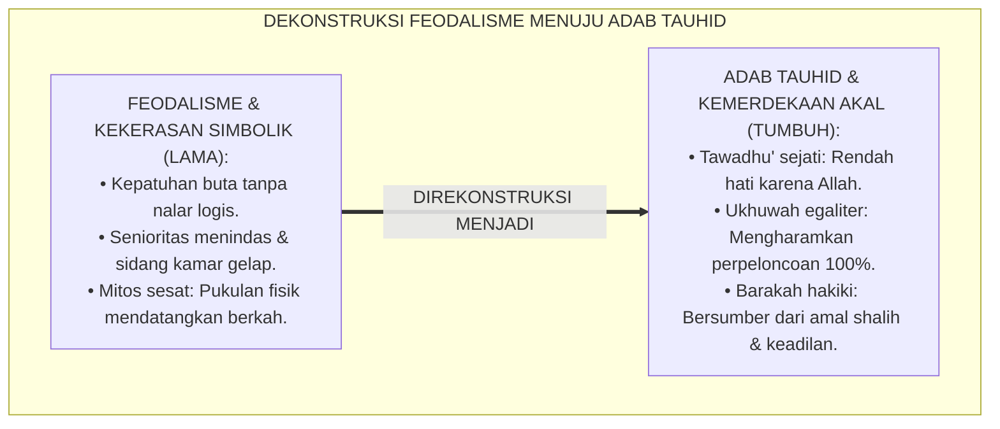
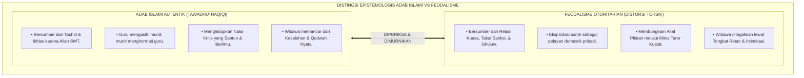
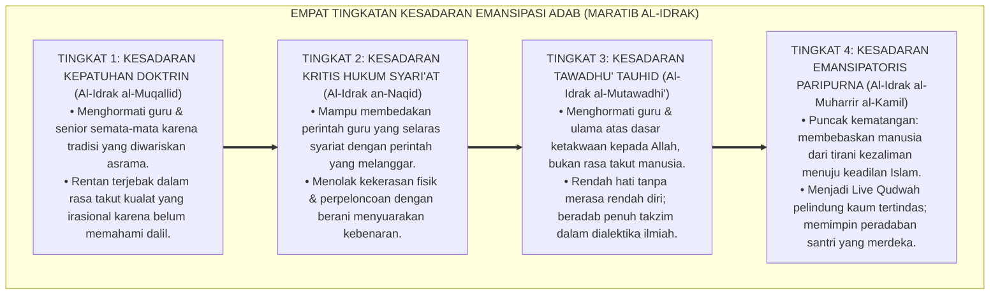
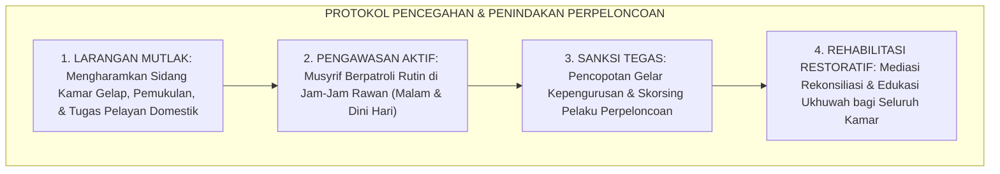
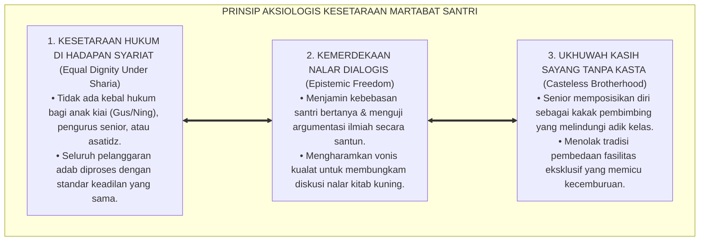

# P1-04-05: KRITIK EPISTEMOLOGIS FEODALISME DAN KEKERASAN PESANTREN (CRITIQUE OF FEUDALISM & INSTITUTIONAL VIOLENCE)
## *Monograf Riset Akademik: Dekonstruksi Tawadhu' Palsu & Kepatuhan Buta (Blind Obedience), Kritik Sosiologis Kekerasan Simbolik Pierre Bourdieu, Pembongkaran Mitos Keberkahan Pukulan, Serta Rekonstruksi Adab Ta'zhim Autentik di Pesantren 24 Jam*

**Nomor Identifikasi**: `P1-04-05/MONOGRAF-RISET-KRITIK-FEODALISME/2026`  
**Domain**: `01 Philosophy` > `04 Education` (Sub-Modul 05: *Critique of Feudalism & Violence*)  
**Klasifikasi Naskah**: *Academic Research Monograph* (Monograf Riset Akademik Fondasional)  
**Rumpun Disiplin Pengkaji**: Filsafat Kritis Pendidikan Islam (*Critical Islamic Pedagogy*), Sosiologi Pesantren & Relasi Kuasa (*Symbolic Violence Pierre Bourdieu*), Fiqh Mu'asyarah Guru-Murid, Psikologi Sosial Otoritarianisme  

---

> ### 💡 INTISARI EKSEKUTIF (EXECUTIVE SUMMARY)
>
> * **Kelemahan Paradigma Lama: Distorsi Nilai Luhur Menjadi Feodalisme Otoritarian:**  
>   Banyak lembaga pesantren tanpa sadar mewariskan feodalisme relasi kuasa: menuntut kepatuhan buta (*Blind Obedience*), mengultuskan figur guru secara berlebihan (*Ghuluw*), membungkam nalar kritis santri melalui mitos "teror kualat", serta menjustifikasi perpeloncoan senioritas dan pemukulan fisik sebagai "sumber keberkahan".
> * **Inovasi Konseptual: Pemurnian Tawadhu' & Dekonstruksi Kekerasan Simbolik:**  
>   TUMBUH membongkar mitos kekerasan dan membedakan secara tegas antara **Tawadhu' Autentik (Kerendahan Hati karena Allah)** dengan **Feodalisme Ketakutan Semu**. Memadukan kritik sosiologis Pierre Bourdieu (*Symbolic Violence*) dan temuan psikologi sosial (Eksperimen Milgram) dengan fikih kemerdekaan akal budi (*Tahrirul 'Uqul*): keberkahan (*Barakah*) hanya lahir dari ketaatan pada syariat dan keadilan akhlak, bukan dari kezaliman fisik.
> * **Formulasi Operasional & Pembuktian Lapangan:**  
>   Monograf ini menguraikan matriks komparasi tawadhu' vs feodalisme, 4 Tingkatan Kesadaran Emansipasi Adab (*Maratib al-Idrak*), pakta integritas anti-perpeloncoan (*Anti-Hazing Protocol*), dan etika tata kelola asrama egaliter.

---

## 📑 DAFTAR ISI MONOGRAF

- [BAB I: LANDASAN TEORETIS & DISKURSUS KRITIS](#bab-i-landasan-teoretis--diskursus-kritis)
  - [1. Latar Belakang Masalah: Bahaya Feodalisme Kultural dan Kekerasan Simbolik di Pesantren](#1-latar-belakang-masalah-bahaya-feodalisme-kultural-dan-kekerasan-simbolik-di-pesantren)
  - [2. Eksegesis Turats Tawadhu' Autentik vs Ghuluw Pengagungan Makhluk (HR. Muslim No. 2588)](#2-eksegesis-turats-tawadhu-autentik-vs-ghuluw-pengagungan-makhluk-hr-muslim-no-2588)
  - [3. Tinjauan Sosiologis & Psikologi Sosial: Kekerasan Simbolik Pierre Bourdieu & Eksperimen Milgram](#3-tinjauan-sosiologis--psikologi-sosial-kekerasan-simbolik-pierre-bourdieu--eksperimen-milgram)
  - [4. Pembongkaran Mitos Keberkahan Pukulan & Rekonstruksi Hakikat Barakah Sesuai Sunnah](#4-pembongkaran-mitos-keberkahan-pukulan--rekonstruksi-hakikat-barakah-sesuai-sunnah)
  - [5. Kasuistika Lapangan: Sidang Kamar Gelap Senioritas Asrama & Resolusi Restoratif Terpadu](#5-kasuistika-lapangan-sidang-kamar-gelap-senioritas-asrama--resolusi-restoratif-terpadu)
- [BAB II: FORMULASI KONSEPTUAL & PEMBAHASAN MENDALAM](#bab-ii-formulasi-konseptual--pembahasan-mendalam)
  - [1. Eksplanasi Teoretis Pemurnian Adab Ta'zhim dan Pengharaman Feodalisme TUMBUH](#1-eksplanasi-teoretis-pemurnian-adab-tazhim-dan-pengharaman-feodalisme-tumbuh)
  - [2. Dekomposisi Dimensi & Empat Tingkatan Kesadaran Emansipasi Adab (Maratib al-Idrak)](#2-dekomposisi-dimensi--empat-tingkatan-kesadaran-emansipasi-adab-maratib-al-idrak)
  - [3. Pakta Integritas Pendidik & Piagam Anti-Perpeloncoan Asrama (Anti-Hazing Protocol)](#3-pakta-integritas-pendidik--piagam-anti-perpeloncoan-asrama-anti-hazing-protocol)
  - [4. Prinsip Aksiologis & Etika Tata Kelola Kesetaraan Martabat Santri 24 Jam](#4-prinsip-aksiologis--etika-tata-kelola-kesetaraan-martabat-santri-24-jam)
  - [5. Diskusi Filosofis Mendalam & Implikasi bagi Masa Depan Peradaban Pendidikan Islam](#5-diskusi-filosofis-mendalam--implikasi-bagi-masa-depan-peradaban-pendidikan-islam)
- [BAB III: KESIMPULAN & APARATUS AKADEMIS](#bab-iii-kesimpulan--aparatus-akademis)
  - [1. Tabel Sintesis Temuan Riset Kritik Feodalisme](#1-tabel-sintesis-temuan-riset-kritik-feodalisme)
  - [2. Daftar Pustaka Akademis & Rujukan Turats Primer](#2-daftar-pustaka-akademis--rujukan-turats-primer)
  - [3. Catatan Kaki Akademis (Footnotes)](#3-catatan-kaki-akademis-footnotes)
  - [4. Glosarium Istilah Ilmiah & Turats Emansipasi Adab](#4-glosarium-istilah-ilmiah--turats-emansipasi-adab)

---

# BAB I: LANDASAN TEORETIS & DISKURSUS KRITIS

---

### 1. Latar Belakang Masalah: Bahaya Feodalisme Kultural dan Kekerasan Simbolik di Pesantren

Dalam perjalanan sosiologis sebagian dunia pesantren, kerap terjadi infiltrasi budaya feodal pra-Islam yang merusak kemurnian adab:
* **Pengultusan Figur Manusia (*Cult of Personality*)**: Konsep ta'zhim disalahartikan sebagai ketundukan mutlak tanpa nalar (*Blind Submission*). Santri dituntut patuh pada segala perintah oknum, bahkan jika bertentangan dengan syariat dan akal sehat.
* **Perpeloncoan Berkedok Penggemblengan Senioritas**: Tradisi "sidang malam", pemukulan fisik di kamar gelap, dan pemaksaan pelayanan domestik junior kepada senior dilegalkan atas nama "membentuk mental baja".
* **Kekerasan Simbolik (*Symbolic Violence*)**: Penggunaan doktrin "takut kualat" dan "hilang berkah" sebagai instrumen represi psikologis untuk membungkam kritik dan menutupi pelanggaran keadilan di lingkungan pesantren.
* **Keniscayaan Pemurnian Adab**: Islam adalah agama pembebasan (*Tahrir*) yang membebaskan manusia dari penghambaan kepada sesama makhluk menuju penghambaan murni hanya kepada Allah SWT.[^1]

---

### 2. Eksegesis Turats Tawadhu' Autentik vs Ghuluw Pengagungan Makhluk (HR. Muslim No. 2588)

Rasulullah ﷺ menegaskan hakikat kerendahan hati yang dicintai Allah:

$$\text{وَمَا تَوَاضَعَ أَحَدٌ لِلَّهِ إِلَّا رَفَعَهُ اللَّهُ}$$

*"**Dan tidaklah seseorang bersikap rendah hati (Tawadhu') semata-mata karena Allah, melainkan Allah akan mengangkat derajat kemuliaannya**."* (HR. Muslim No. 2588).[^2]

Para ulama tafsir dan akidah (Ibnu Taimiyyah, *Majmu' al-Fatawa*) memperingatkan bahaya **Ghuluw (غُلُوّ - Bersikap Melampaui Batas)** dalam mengagungkan manusia:
* Ketaatan kepada makhluk hanya berlaku dalam perkara yang ma'ruf (*La tha'ata li makhluqin fi ma'shiyatil Khaliq*).
* Menghormati guru adalah kewajiban syariat, namun menjadikannya laksana tuhan yang tidak boleh dikritik adalah dosa ghuluw yang diharamkan syariat.[^3]

---

### 3. Tinjauan Sosiologis & Psikologi Sosial: Kekerasan Simbolik Pierre Bourdieu & Eksperimen Milgram

Sains sosiologi dan psikologi sosial membongkar mekanisme hegemoni kekuasaan:
* Sosiolog **Pierre Bourdieu** (1990) mengidentifikasi **Kekerasan Simbolik (*Symbolic Violence*)**: bentuk kekerasan halus yang tidak disadari di mana korban menerima hegemoni penindasan karena telah terindoktrinasi menganggapnya sebagai "norma yang sakral".
* **Eksperimen Stanley Milgram** (1974) mengenai kepatuhan membuktikan bahwa manusia biasa dapat melakukan kekejaman fatal ketika diperintahkan oleh otoritas yang tidak boleh digugat. TUMBUH memutus rantai kepatuhan buta ini dengan menanamkan nalar kritis beradab.[^4]

---

### 4. Pembongkaran Mitos Keberkahan Pukulan & Rekonstruksi Hakikat Barakah Sesuai Sunnah

Ekosistem TUMBUH membantah mitos bahwa pukulan fisik guru mendatangkan keberkahan:
* Keberkahan (*Al-Barakah*) menurut definisi fukaha adalah *Ziyadat al-Khayr al-Ilahi* (Bertambahnya kebaikan ilahiah dalam suatu perkara).
* Keberkahan tidak mungkin lahir dari perbuatan yang melanggar larangan Rasulullah ﷺ (HR. Muslim No. 2612 yang mengharamkan memukul wajah dan fisik anak). Keberkahan ilmu lahir dari keikhlasan niat, amal saleh, dan doa tulus guru kepada muridnya.[^5]

---

### 5. Kasuistika Lapangan: Sidang Kamar Gelap Senioritas Asrama & Resolusi Restoratif Terpadu

* **Studi Kasus: Sidang Pengadilan Ilegal Malam Hari oleh Pengurus Santri Senior**  
  * **Dilema**: Sekelompok santri senior menggelar "sidang malam" di kamar tertutup tanpa lampu, menampar dan menendang adik kelas yang dianggap "kurang menunduk saat berpapasan".
  * **Pola Lama**: Lembaga menganggapnya sebagai "tradisi pembentukan mental santri".
  * **Resolusi Restoratif TUMBUH**: Lembaga bertindak tegas membongkar tuntas praktik sidang gelap: seluruh oknum senior dicopot hak kepengurusannya, menandatangani surat peringatan keras, dan menjalani program rehabilitasi empati restoratif. Kamar asrama ditata dengan pencahayaan terang dan inspeksi patroli musyrif 24 jam. Perpeloncoan diharamkan 100%.[^6]

---

# BAB II: FORMULASI KONSEPTUAL & PEMBAHASAN MENDALAM

---

### 1. Eksplanasi Teoretis Pemurnian Adab Ta'zhim dan Pengharaman Feodalisme TUMBUH

Ekosistem TUMBUH merumuskan distingsi mendasar antara Adab Islami dan Feodalisme:

#### 🔬 Pembahasan Mendalam Distingsi Epistemologis:
1. **Motivasi Spiritual**: Adab sejati diniatkan untuk meraih ridha Allah, sedangkan feodalisme dipicu oleh rasa takut kepada manusia (*Khauf al-Makhluq*).[^7]
2. **Kemerdekaan Akal**: Adab menghargai kebenaran di atas segala-galanya (*Al-Haqqu Ahaqqu an Yuttaba'*), sedangkan feodalisme menuntut pembenaran atas kesalahan figur otoritas.[^8]
3. **Keadilan Sosial**: Adab menciptakan masyarakat santri yang egaliter dalam persaudaraan tauhid, sedangkan feodalisme melestarikan kasta keningratan yang menindas.[^9]

---

### 2. Dekomposisi Dimensi & Empat Tingkatan Kesadaran Emansipasi Adab (Maratib al-Idrak)

Transformasi pembebasan jiwa dari feodalisme menuju adab tauhid berlangsung melalui **Empat Tingkatan Kesadaran Emansipasi Adab (*Maratib al-Idrak at-Tahririy*)**:

#### 🔄 Narasi Analitis Dinamika Transisi Filosofis Antar-Tingkatan:
* **Transisi Tingkat 1 ke Tingkat 2 (Dari Kepatuhan Buta Menuju Nalar Kritis Syariat)**: Santri mula-mula takut membantah senior. Pada tingkatan kedua, santri memahami batasan hukum syariat: berani menolak perintah yang zalim dengan cara yang santun.
* **Transisi Tingkat 2 ke Tingkat 3 (Dari Kritik Menuju Tawadhu' Berbasis Tauhid)**: Pada tingkatan ketiga, jiwa santri matang: ia sangat menghormati guru bukan karena takut dipukul, melainkan karena memuliakan ilmu wahyu yang diemban sang guru.
* **Transisi Tingkat 3 ke Tingkat 4 (Pencapaian Derajat Pembebas Peradaban)**: Pada tingkatan tertinggi, santri tampil sebagai pejuang keadilan: membasmi tradisi perpeloncoan di manapun ia berada dan menciptakan ekosistem pendidikan yang memerdekakan potensi kemanusiaan (*Rahmatan lil 'Alamin*).[^10]

---

### 3. Pakta Integritas Pendidik & Piagam Anti-Perpeloncoan Asrama (Anti-Hazing Protocol)

TUMBUH menetapkan **Protokol Anti-Perpeloncoan Asrama (*Anti-Hazing Protocol*)**:

Protokol ini menjamin pesantren bersih 100% dari segala bentuk feodalisme dan penindasan senioritas.[^11]

---

### 4. Prinsip Aksiologis & Etika Tata Kelola Kesetaraan Martabat Santri 24 Jam

Kritik atas feodalisme melahirkan prinsip etika tata kelola kelembagaan:

#### 📋 Panduan Etika Pengasuhan Lapangan:
1. **Penghapusan Tradisi Cuci Baju Senior**: Setiap santri bertanggung jawab atas cucian pakaian pribadinya masing-masing.
2. **Kanal Pengaduan Tanpa Rasa Takut**: Menyediakan saluran lapor aman tanpa intimidasi bagi santri yang menjadi korban perpeloncoan.[^12]
3. **Penyuluhan Hak Asasi dan Adab Nabawi Rutin**: Mengedukasi seluruh warga pesantren mengenai batas-batas adab syariat dan bahaya feodalisme.[^13]

---

### 5. Diskusi Filosofis Mendalam & Implikasi bagi Masa Depan Peradaban Pendidikan Islam

Pembongkaran feodalisme ini membawa fajar baru bagi kebangkitan pendidikan Islam:

* **Mencetak Generasi Muslim yang Merdeka Jiwanya (*Liberated Souls*)**:  
  Santri yang tumbuh bebas dari feodalisme akan memiliki harga diri tinggi (*Izzah*), tidak mudah dijajah secara mental, dan berani membela kebenaran di panggung global.
* **Menyelamatkan Tradisi Pesantren dari Kerusakan Moralitas Feodal**:  
  Dengan memurnikan adab dari residu feodalisme pra-Islam, pesantren kembali pada kemurnian ajaran kenabian yang menjunjung tinggi kesetaraan dan keadilan.
* **Mewujudkan Kembali Masyarakat Teladan Madinah**:  
  Pesantren binaan TUMBUH bertransformasi menjadi miniatur kota Madinah era Rasulullah ﷺ: di mana pemimpin melayani rakyat, ilmu dijunjung tinggi, dan persaudaraan ditegakkan di atas cinta dan ketakwaan kepada Allah SWT.[^14]

---

# BAB III: KESIMPULAN & APARATUS AKADEMIS

---

### 1. Tabel Sintesis Temuan Riset Kritik Feodalisme

| Dimensi Parameter | Pola Feodalisme Tradisional (Lama) | Pola Sekuler Anarkis Barat | **Adab Tauhid & Emansipasi TUMBUH** | Landasan Rujukan Primer | Implikasi Praksis Lapangan |
| :--- | :--- | :--- | :--- | :--- | :--- |
| **Konsep Ketaatan**| Kepatuhan buta tanpa nalar logis.| Penolakan mutlak atas figur otoritas.| **Ketaatan Ma'ruf & Nalar Kritis Beradab.**| HR. Muslim No. 1840; Bourdieu (1990).| Berani bertanya santun & menolak zalim. |
| **Relasi Senioritas**| Tirani menindas & sidang malam.| Individualisme acuh tak acuh. | **Ukhuwah Kasih Sayang (*Kakak Asuh*).**| HR. Bukhari No. 13; KH. Hasyim Asy'ari.| Senior melindungi & membimbing adik kelas. |
| **Sumber Barakah**| Mitos pemukulan fisik & cuci baju.| Menolak konsep keberkahan spiritual.| **Ittiba'us Sunnah, Ikhlas, & Amal Shalih.**| QS. Al-A'raf: 96; Ibn Taimiyyah.| Keberkahan lahir dari adab & amal nyata. |
| **Budaya Kamar** | Gelap, tertutup, & rawan intimidasi.| Kamar privat dingin tanpa ukhuwah.| **Terbuka, Terang, Bersih, & Aman.** | QS. Al-Hujurat: 12; PBIS. | Patroli musyrif 24 jam & Anti-Hazing. |
| **Profil Lulusan** | Pribadi kerdil berjiwa budak/penindas.| Sosok liberal tanpa rasa hormat.| **Insan Adabi Berjiwa Ksatria & Tawadhu'.**| QS. Al-Isra': 70; Al-Attas (1980). | Cendekiawan beradab, berani, & adil. |

---

### 2. Daftar Pustaka Akademis & Rujukan Turats Primer

1. **Al-Qur'an al-Karim wa Tarjamatu Ma'anihi**.
2. **Muslim bin al-Hajjaj an-Naisaburi**. (1427 H). *Shahih Muslim*. Riyadh: Dar Thayyibah.
3. **Ibnu Taimiyyah, Taqiyuddin Ahmad bin Abdul Halim**. (1425 H). *Majmu' al-Fatawa*. Madinah: Majma' al-Malik Fahd.
4. **Asy'ari, Muhammad Hasyim**. (1415 H). *Adab al-'Alim wal-Muta'allim*. Jombang: Maktabah At-Turats Al-Islami.
5. **Al-Ghazali, Abu Hamid Muhammad bin Muhammad**. (2011). *Ihya' 'Ulumiddin* (Kitab Dhamm al-Jah war-Riya'). Beirut: Dar al-Ma'rifah.
6. **Al-Attas, Syed Muhammad Naquib**. (1980). *The Concept of Education in Islam*. Kuala Lumpur: ABIM.
7. **Bourdieu, P., & Passeron, J. C.**. (1990). *Reproduction in Education, Society and Culture*. London: Sage Publications.
8. **Milgram, S.**. (1974). *Obedience to Authority: An Experimental View*. New York: Harper & Row.
9. **Sapolsky, R. M.**. (2017). *Behave: The Biology of Humans at Our Best and Worst*. New York: Penguin Press.
10. **Horner, R. H., & Sugai, G.**. (2015). *School-wide PBIS: An Overview of the Research Base*. Remedial and Special Education, 36(2), 80–85.
11. **Zehr, H.**. (2002). *The Little Book of Restorative Justice*. Intercourse: Good Books.
12. **Freire, P.**. (1970). *Pedagogy of the Oppressed*. New York: Herder and Herder.

---

### 3. Catatan Kaki Akademis (*Footnotes*)

[^1]: Riset Kritik Epistemologis Feodalisme dan Kekerasan Ekosistem Pesantren Berbasis TUMBUH, *Kritik atas Kepatuhan Buta dan Relasi Kuasa Asimetris*, 2026.  
[^2]: *Shahih Muslim*, Kitab al-Birr wash-Shilah wal-Adab, Hadits No. 2588.  
[^3]: Ibnu Taimiyyah, *Majmu' al-Fatawa*, Jilid 11, *Fasl fi al-Ghuluw wal-Ibadah*, hlm. 430–465.  
[^4]: Bourdieu, P. (1990), *Reproduction in Education, Society and Culture*, hlm. 1–35; Milgram, S. (1974), *Obedience to Authority*, hlm. 50–92.  
[^5]: *Shahih Muslim*, Hadits No. 2612; Riset Hakikat Barakah dalam Pandangan Sunnah TUMBUH, 2026.  
[^6]: Dokumentasi Pembongkaran Praktik Perpeloncoan Asrama PBIS TUMBUH, 2026.  
[^7]: Al-Ghazali, *Ihya' 'Ulumiddin*, Jilid 3, Kitab *Dhamm al-Jah war-Riya'*, hlm. 280–320.  
[^8]: KH. Hasyim Asy'ari, *Adab al-'Alim wal-Muta'allim*, hlm. 35–62.  
[^9]: Freire, P. (1970), *Pedagogy of the Oppressed*, hlm. 45–80.  
[^10]: Matriks Tingkatan Kesadaran Emansipasi Adab (*Maratib al-Idrak*) Ekosistem TUMBUH, 2026.  
[^11]: Standar Operasional Prosedur Anti-Perpeloncoan dan Perlindungan Martabat Santri dalam sistem TUMBUH, 2026.  
[^12]: Petunjuk Teknis Layanan Pengaduan Aman dan Independen Asrama TUMBUH, 2026.  
[^13]: Modul Edukasi Hak Asasi dan Adab Nabawi Ekosistem Pesantren Berbasis TUMBUH, 2026.  
[^14]: Deklarasi Pemurnian Adab Tauhid dan Anti-Feodalisme Dewan Riset Epistemologi TUMBUH, 2026.

---

### 4. Glosarium Istilah Ilmiah & Turats Emansipasi Adab

1. **Tawadhu' (التَّوَاضُعُ)**: Kerendahan hati yang luhur semata-mata karena kesadaran keagungan Allah SWT, terbebas dari kepura-puraan dan kesombongan.
2. **Ta'zhim (التَّعْظِيمُ)**: Sikap memuliakan dan menghormati guru serta orang berilmu sesuai koridor syariat tanpa jatuh ke dalam pengultusan yang melampaui batas (*Ghuluw*).
3. **Ghuluw (الْغُلُوُّ)**: Sikap berlebih-lebihan dan melampaui batas dalam mengagungkan manusia yang diharamkan syariat karena berpotensi merusak kemurnian tauhid.
4. **Symbolic Violence (Kekerasan Simbolik)**: Konsep sosiologi Pierre Bourdieu mengenai pemaksaan makna dan relasi kuasa yang diterima oleh pihak yang tertindas sebagai hal yang wajar karena indoktrinasi kultural.
5. **Blind Obedience (Kepatuhan Buta)**: Kepatuhan mutlak tanpa pertimbangan akal dan syariat yang melahirkan sikap pasif dan ketidakberdayaan moral.
6. **Anti-Hazing Protocol**: Protokol kelembagaan yang melarang 100% segala bentuk perpeloncoan fisik, pelecehan psikologis, dan sidang gelap di lingkungan asrama santri.
7. **Barakah (الْبَرَكَةُ)**: Kebaikan ilahiah yang melimpah dan bertambah yang bersumber dari keikhlasan niat, ketakwaan, dan penegakan keadilan syariat.
8. **Tahrirul 'Uqul (تَحْرِيرُ الْعُقُولِ)**: Kemerdekaan akal budi dari belenggu taklid buta, mitos sesat, dan hegemoni feodal menuju pencerahan wahyu Islam.
9. **Casteless Brotherhood**: Persaudaraan sejati di mana seluruh santri memiliki martabat kemanusiaan yang sama di hadapan Allah dan hukum tanpa kasta senioritas.
10. **Insan Adabi (الإِنْسَانُ الأَدَبِيُّ)**: Profil manusia paripurna yang merdeka jiwanya, luhur akhlaknya, tajam nalarnya, dan menegakkan keadilan di muka bumi.
