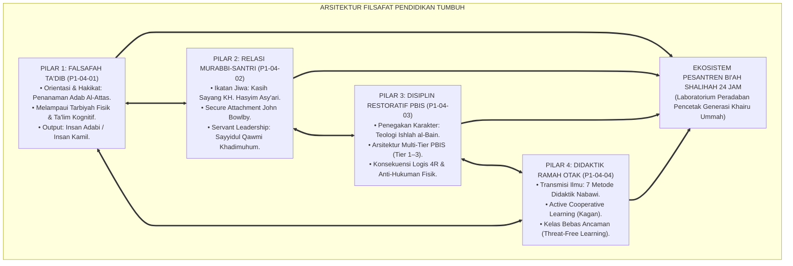
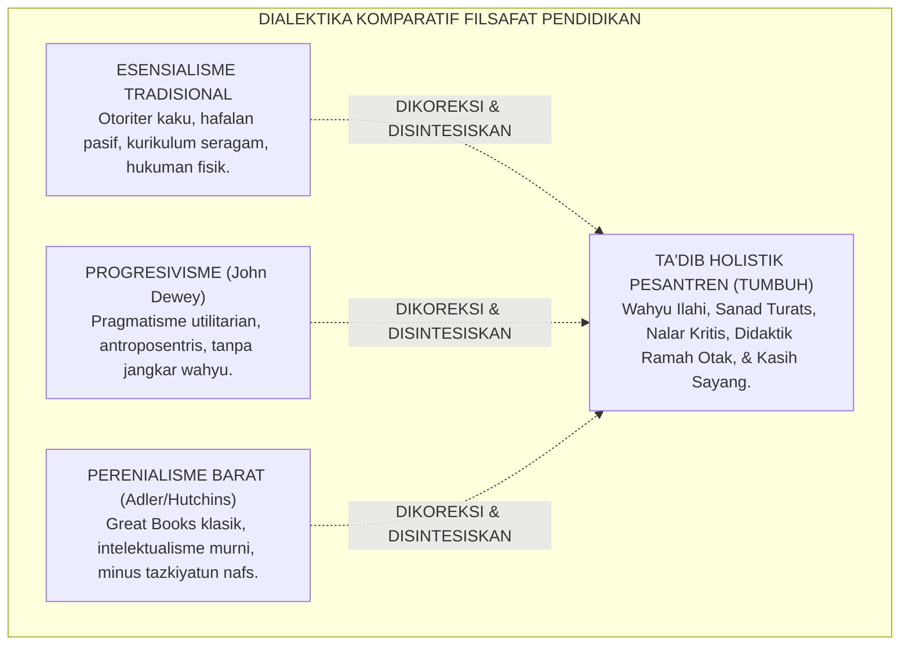
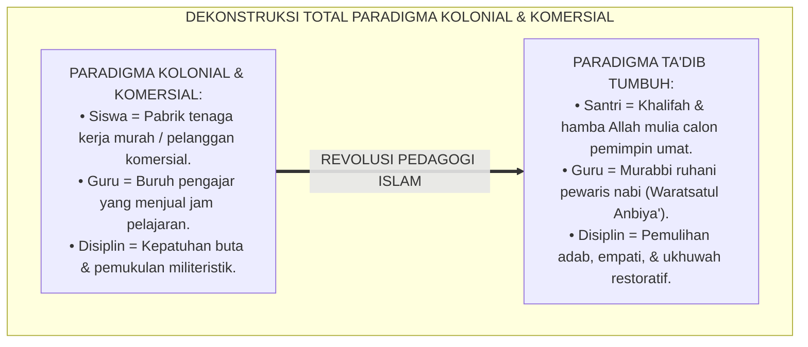
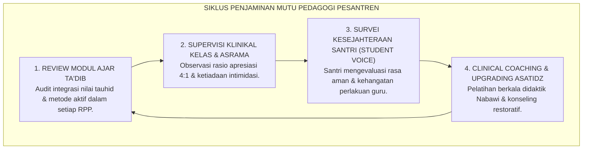

# P1-04-05: SINTESIS FILSAFAT PENDIDIKAN TUMBUH DAN MANIFESTO PEDAGOGI ADAB PESANTREN
## *Monograf Terpadu: Sintesis Holistik 4 Pilar Filsafat Pendidikan (Ta'dib Al-Attas, Relasi Qudwah KH. Hasyim Asy'ari, Disiplin Restoratif Multi-Tier PBIS, & Didaktik Ramah Otak), Matriks Komparasi Mazhab Pendidikan Barat vs TUMBUH, Manifesto Kelembagaan Pedagogi Adab, serta Jembatan Epistemologis Menuju Sub-Domain 05 Leadership*

**Nomor Identifikasi**: `P1-04-05/MONOGRAF-TERPADU-SINTESIS-FILSAFAT-PENDIDIKAN/2026`  
**Domain**: `01 Philosophy` > `04 Education`  
**Klasifikasi Naskah**: *Comprehensive Synthesis Monograph* (Monograf Sintesis Filosofis & Manifesto Baku Kelembagaan)  
**Rumpun Disiplin Pengkaji**: Filsafat Pendidikan Islam (*Falsafah at-Ta'dib*), Teologi Pedagogi Pesantren, Keadilan Restoratif Pendidikan, Manajemen Mutu Pembelajaran Pesantren 24 Jam  

---

> ### 💡 INTISARI PRAKTIS (3 MENIT PAHAM UNTUK ASATIDZ & MUSYRIF)
>
> * **Kesatuan Utuh 4 Pilar Filsafat Pendidikan Ekosistem TUMBUH:**  
>   Pendidikan di pesantren TUMBUH adalah orkestrasi agung yang memadukan 4 dimensi:  
>   1. **P1-04-01 (Falsafah Ta'dib):** Menetapkan bahwa tujuan puncak pendidikan adalah penanaman adab (*Inculcation of Adab*), bukan sekadar transfer wawasan (*Ta'lim*) atau pengasuhan fisik (*Tarbiyah*).  
>   2. **P1-04-02 (Relasi Murabbi-Santri):** Menegakkan relasi ayah-anak spiritual (*In Loco Parentis* & *Secure Attachment*) berbasis keteladanan melayani (*Sayyidul Qawmi Khadimuhum*), menghapus feodalisme relasi kuasa.  
>   3. **P1-04-03 (Disiplin Restoratif & PBIS):** Mengubah penanganan pelanggaran dari siksaan fisik menjadi pemulihan ukhuwah (*Ishlah al-Bain*), formula Konsekuensi 4R, dan arsitektur Multi-Tier PBIS.  
>   4. **P1-04-04 (Didaktik Pengajaran Ramah Otak):** Menghidupkan seni mengajar Nabawi (analogi, visualisasi, dialog sokratik) dan pembelajaran kooperatif aktif di ruang kelas bebas rasa takut.
> * **Posisi TUMBUH vs Mazhab Pendidikan Barat:**  
>   TUMBUH menolak kekakuan otoriter Esensialisme Kuno, menolak relativisme moral Progresivisme John Dewey, dan menyempurnakan Perenialisme dengan **Wahyu Ilahi, Sanad Keilmuan Turats, dan Keberkahan Guru-Murid**.
> * **Manifesto Kelembagaan Pedagogi Adab:**  
>   Lembaga memproklamirkan bahwa pesantren adalah **Bi'ah Shalihah (Ekosistem Suci 24 Jam)** tempat bertumbuhnya insan berilmu yang beradab, berjiwa merdeka, mencintai kebenaran, dan siap memimpin peradaban dengan akhlak kenabian.

---

## 📑 DAFTAR ISI MONOGRAF

- [BAGIAN I: SINTESIS FILOSOFIS 4 PILAR PENDIDIKAN & MATRIKS KOMPARATIF EPISTEMOLOGIS](#bagian-i-sintesis-filosofis-4-pilar-pendidikan--matriks-komparatif-epistemologis)
  - [1. Arsitektur Sintesis Holistik: Konvergensi 4 Pilar Filsafat Pendidikan TUMBUH](#1-arsitektur-sintesis-holistik-konvergensi-4-pilar-filsafat-pendidikan-tumbuh)
  - [2. Matriks Komparasi Filosofis Pendidikan: Esensialisme, Progresivisme, Perenialisme vs Ta'dib Holistik TUMBUH](#2-matriks-komparasi-filosofis-pendidikan-esensialisme-progresivisme-perenialisme-vs-tadib-holistik-tumbuh)
  - [3. Dekonstruksi Total Paradigma Pendidikan Kolonial & Komersial](#3-dekonstruksi-total-paradigma-pendidikan-kolonial--komersial)
  - [4. Jembatan Filosofis & Pedagogis Menuju Sub-Domain 05 Leadership](#4-jembatan-filosofis--pedagogis-menuju-sub-domain-05-leadership)
- [BAGIAN II: PIAGAM KELEMBAGAAN & DEKLARASI DOKTRIN BAKU FILSAFAT PENDIDIKAN](#bagian-ii-piagam-kelembagaan--deklarasi-doktrin-baku-filsafat-pendidikan)
  - [1. Manifesto Kelembagaan Pedagogi Adab Pesantren TUMBUH](#1-manifesto-kelembagaan-pedagogi-adab-pesantren-tumbuh)
  - [2. Matriks Integrasi Operasional 4 Pilar Pendidikan ke dalam Kehidupan Pesantren 24 Jam](#2-matriks-integrasi-operasional-4-pilar-pendidikan-ke-dalam-kehidupan-pesantren-24-jam)
  - [3. Protokol Penjaminan Mutu Keberkahan dan Keunggulan Pembelajaran](#3-protokol-penjaminan-mutu-keberkahan-dan-keunggulan-pembelajaran)
- [BAGIAN III: APARATUS AKADEMIS & APENDIKS](#bagian-iii-aparatus-akademis--apendiks)
  - [1. Tabel Sintesis Master Sub-Domain 04](#1-tabel-sintesis-master-sub-domain-04)
  - [2. Daftar Pustaka Akademis & Rujukan Turats Primer](#2-daftar-pustaka-akademis--rujukan-turats-primer)
  - [3. Catatan Kaki Akademis (Footnotes)](#3-catatan-kaki-akademis-footnotes)
  - [4. Glosarium Master Istilah Kunci Filsafat Pendidikan & Ta'dib](#4-glosarium-master-istilah-kunci-filsafat-pendidikan--tadib)

---

# BAGIAN I: SINTESIS FILOSOFIS 4 PILAR PENDIDIKAN & MATRIKS KOMPARATIF EPISTEMOLOGIS

---

### 1. Arsitektur Sintesis Holistik: Konvergensi 4 Pilar Filsafat Pendidikan TUMBUH

Filsafat Pendidikan dalam ekosistem TUMBUH bukanlah wacana teoritis yang terisolasi di menara gading, melainkan **Arsitektur Pedagogis Terpadu (*Unified Pedagogical Architecture*)** yang menggerakkan seluruh nadi kehidupan madrasah dan asrama:



* **Pilar 1 (Ta'dib)** menentukan **Arah dan Nilai Filosofis Tertinggi**: bahwa setiap huruf yang diajarkan harus berbuah pengenalan posisi wujud di hadapan Allah SWT.
* **Pilar 2 (Relasi Murabbi)** menyediakan **Iklim Kasih Sayang Spiritual**: menjadi jangkar rasa aman (*Secure Base*) yang membebaskan potensi kreatif santri.
* **Pilar 3 (Disiplin Restoratif)** menyediakan **Sistem Regulasi & Penjagaan Adab**: menangani kesalahan sebagai wahana penyadaran nurani tanpa kekerasan.
* **Pilar 4 (Didaktik Ramah Otak)** menyediakan **Metodologi Pengajaran Kelas Terbaik**: menyajikan ilmu dengan metode aktif, visual, dan dialogis yang membahagiakan akal.[^1]

---

### 2. Matriks Komparasi Filosofis Pendidikan: Esensialisme, Progresivisme, Perenialisme vs Ta'dib Holistik TUMBUH



| Aliran Filsafat Pendidikan | Tokoh & Asumsi Utama | Pandangan Tentang Peran Guru & Metode | Kelemahan & Titik Kritis | Jawaban & Sintesis Ekosistem TUMBUH |
| :--- | :--- | :--- | :--- | :--- |
| **1. Esensialisme Tradisional** | **William Bagley**<br/>Pendidikan adalah penanaman nilai-nilai esensial budaya masa lalu melalui disiplin ketat. | Guru adalah otoritas mutlak pengendali kelas; metode didominasi ceramah, hafalan pasif, dan hukuman. | Mematikan nalar kritis santri, memicu feodalisme relasi, dan menciptakan kepatuhan semu berbasis rasa takut. | Mengadopsi penghormatan terhadap khazanah warisan salaf (*Turats*), namun mentransformasi metode menjadi **Didaktik Aktif Nabawi dan Relasi Qudwah Penuh Kasih Sayang**.[^2] |
| **2. Progresivisme Pragmatis** | **John Dewey**<br/>Pendidikan adalah rekonstruksi pengalaman hidup terus-menerus (*Learning by Doing*); kebenaran bersifat relatif tentatif. | Guru adalah fasilitator; metode berpusat pada minat anak (*Child-Centered*) dan pemecahan masalah praktis. | Relativisme moral sekuler; kehilangan kompas nilai abadi (*Absolute Truth*) dan mengabaikan keselamatan akhirat. | Mengadopsi prinsip pembelajaran aktif (*Active Learning*) dan relevansi kontekstual, namun mengikatnya pada **Jangkar Tauhid, Akidah Shahihah, dan Syariat Islam Abadi**.[^3] |
| **3. Perenialisme Humanistik** | **Robert Hutchins, Mortimer Adler**<br/>Pendidikan adalah penanaman kebenaran universal abadi melalui pengkajian karya-karya agung (*Great Books*). | Guru memandu dialog sokratik rasional; fokus pada penalaran logika intelektual tingkat tinggi. | Bersifat elitis dan rasionalistik dingin; mengabaikan dimensi penyucian kalbu (*Tazkiyah*), dzikir, dan amal sosial. | Mengkaji teks agung (*Turats Kitab Kuning*), namun menyempurnakannya dengan **Tazkiyatun Nafs, Amaliah Asrama 24 Jam, dan Kepemimpinan Melayani**.[^4] |

---

### 3. Dekonstruksi Total Paradigma Pendidikan Kolonial & Komersial



#### 📐 Formalisasi Logika Silogisme (*Qiyas Mantiqi Sintesis*)
* **Premis Mayor (*al-Muqaddimah al-Kubra*)**: Setiap sistem pendidikan Islam yang berdiri di atas pilar pemuliaan martabat insan (*Takrimul Insan*), keteladanan profetik (*Qudwah*), dan keadilan restoratif (*Ishlah*) niscaya membebaskan manusia dari perbudakan materi menuju kemerdekaan tauhid yang hakiki.
* **Premis Minor (*al-Muqaddimah ash-Shughra*)**: Empat pilar Filsafat Pendidikan TUMBUH mengintegrasikan Falsafah Ta'dib Al-Attas, Relasi Kasih Sayang KH. Hasyim Asy'ari, Keadilan Restoratif PBIS, dan Didaktik Ramah Otak ke dalam satu kesatuan sistemik.
* **Konklusi (*an-Natijah*)**: Maka, paradigma pendidikan TUMBUH adalah manifestasi otentik kebangkitan pedagogi Islam abad ke-21.[^5]

---

### 4. Jembatan Filosofis & Pedagogis Menuju Sub-Domain `05 Leadership`

Sintesis *Sub-Domain 04 Education* menjadi batu pijakan aksiologis yang mengalirkan energinya menuju **Sub-Domain 05: Leadership (Falsafah Kepemimpinan Qudwah & Tata Kelola Pesantren)**:

```mermaid
graph TD
    ED["SUB-DOMAIN 04: EDUCATION (PENDIDIKAN)<br/>(Falsafah Ta'dib, Relasi Kasih Sayang, Disiplin Restoratif, & Didaktik Ramah Otak)"]
    ==>|MENGALIRKAN PRINSIP MANAJERIAL MENUJU|
    LD["SUB-DOMAIN 05: LEADERSHIP (KEPEMIMPINAN)<br/>(Tata Kelola Pesantren, Standar Kepemimpinan Kyai/Mudir, Kaderisasi Santri, & Anti-Feodalisme)"]
    
    subgraph JembatanKeSubDomain05["IMPLIKASI KE SUB-DOMAIN 05 LEADERSHIP"]
        J1["Kepemimpinan Berbasis Pelayanan (Servant Leadership)"]
        J2["Standarisasi Kompetensi & Kesejahteraan Asatidz/Musyrif"]
        J3["Kaderisasi Kepemimpinan Santri Bebas Perpeloncoan"]
        J4["Tata Kelola Kelembagaan Transparan & Akuntabel"]
    end
    
    LD --> JembatanKeSubDomain05
```

1. **Dari Guru Murabbi Menuju Pimpinan Qudwah**: Jika di kelas guru memimpin dengan melayani murid, maka di level lembaga, Kyai dan Mudir memimpin pesantren dengan melayani para guru dan santri (*Servant Leadership*).
2. **Dari Disiplin Restoratif Menuju Tata Kelola Berkeadilan**: Prinsip keadilan restoratif diterapkan dalam menyelesaikan konflik antarpengurus lembaga dan pembagian amanah kerja yang proporsional.
3. **Dari Ta'dib Menuju Kaderisasi Pemimpin Umat**: Lulusan yang telah mengenali posisi wujudnya (*Man of Adab*) siap diterjunkan memimpin masyarakat sebagai *Imam lil-Muttaqin*.[^6]

---

# BAGIAN II: PIAGAM KELEMBAGAAN & DEKLARASI DOKTRIN BAKU FILSAFAT PENDIDIKAN

---

### 1. Manifesto Kelembagaan Pedagogi Adab Pesantren TUMBUH

```
===================================================================================================
             MANIFESTO KELEMBAGAAN PEDAGOGI ADAB PESANTREN (ADAB-CENTERED PEDAGOGY)
                          SUB-DOMAIN 04: EDUCATION — EKOSISTEM TUMBUH
===================================================================================================

BISMILLAHIRRAHMANIRRAHIM. DEWAN KEILMUAN BESERTA SELURUH MASYAIKH DAN PIMPINAN LEMBAGA PESANTREN
EKOSISTEM TUMBUH DENGAN INI MEMPROKLAMIRKAN MANIFESTO KELEMBAGAAN PEDAGOGI ADAB:

PASAL 1: MANDAT PENDIDIKAN SEBAGAI TA'DIB
Pesantren TUMBUH menegakkan Ta'dib sebagai ruh tertinggi seluruh aktivitas pendidikan. Setiap mata
pelajaran, halaqah kitab, kegiatan asrama, dan interaksi sosial wajib diarahkan pada penanaman adab
kepada Allah, Rasul-Nya, guru, sesama santri, diri sendiri, dan alam semesta.

PASAL 2: PRINSIP RELASI KASIH SAYANG AYAH SPIRITUAL (IN LOCO PARENTIS)
Menolak mutlak feodalisme relasi kuasa asimetris. Guru dan musyrif adalah ayah spiritual yang mencintai
santrinya laksana anak kandung sendiri (Manzilah al-Awlad), membimbing dengan kelembutan (ar-Rifq),
dan membangun kelekatan rasa aman emosional (Secure Base).

PASAL 3: PENEGAKAN DISIPLIN RESTORATIF & ZERO TOLERANCE KEKERASAN
Hukuman fisik, pembentakan, perpeloncoan senior, dan denda finansial DINYATAKAN HARAM DAN DILARANG 100%.
Penanganan pelanggaran wajib menggunakan pendekatan Keadilan Restoratif (Ishlah al-Bain) dan formula
Konsekuensi Logis 4R (Related, Respectful, Reasonable, Restorative) dalam kerangka Multi-Tier PBIS.

PASAL 4: DIDAKTIK PENGAJARAN NABAWI & KELAS BEBAS ANCAMAN
Mewajibkan seluruh guru mempraktikkan seni mengajar Rasulullah SAW (analogi, visualisasi, dialog sokratik)
dan pembelajaran kooperatif aktif (Kagan Structures). Ruang kelas dinyatakan sebagai Zona Bebas Rasa Takut.

PASAL 5: INTEGRASI EKOSISTEM BI'AH SHALIHAH 24 JAM
Pendidikan adab tidak dibatasi oleh dinding ruang kelas. Seluruh siklus hidup santri selama 24 jam
dari bangun tidur hingga tidur kembali dikelola sebagai kurikulum pembiasaan karakter yang hidup.

DITETAPKAN DI: PUSAT RISET EKOSISTEM PENDIDIKAN PESANTREN TUMBUH
TANGGAL: 24 AGUSTUS 2026
ATAS NAMA DEWAN PAKAR FILOSOFI, EPISENTRUM PEDAGOGI, & TATA KELOLA PESANTREN TUMBUH
===================================================================================================
```

---

### 2. Matriks Integrasi Operasional 4 Pilar Pendidikan ke dalam Kehidupan Pesantren 24 Jam

| Pilar Filsafat Pendidikan | Berkas Rujukan Utama | Implementasi Konkret di Pesantren 24 Jam | Output Karakter pada Diri Santri |
| :--- | :--- | :--- | :--- |
| **Pilar 1: Falsafah Ta'dib** | [**`P1-04-01`**](./P1-04-01-Falsafah-Tarbiyah-Tadib-Talim.md) | Kurikulum adab 24 jam di kelas, asrama, masjid, meja makan, dan ruang digital. | Terbentuknya *Insan Adabi* yang adil menempatkan posisi diri di hadapan Allah & makhluk.[^7] |
| **Pilar 2: Relasi Murabbi-Santri** | [**`P1-04-02`**](./P1-04-02-Relasi-Murabbi-dan-Santri.md) | Pendampingan *In Loco Parentis*, *Secure Attachment*, kepemimpinan *Sayyidul Qawm*, SOP Konseling 1-on-1. | Santri merasa aman, percaya diri, memiliki ta'zhim tulus, dan terhindar dari inferioritas. |
| **Pilar 3: Disiplin Restoratif & PBIS** | [**`P1-04-03`**](./P1-04-03-Paradigma-Disiplin-Restoratif-dan-PBIS.md) | Arsitektur Multi-Tier PBIS (Tier 1–3), Dialog 5 Pertanyaan Restoratif, Formula Konsekuensi 4R, *Ishlah al-Bain*. | Kasus pelanggaran turun >70%, nihil hukuman fisik, dan ukhuwah santri pulih tanpa dendam.[^8] |
| **Pilar 4: Didaktik Ramah Otak** | [**`P1-04-04`**](./P1-04-04-Didaktik-Pengajaran-dan-Manajemen-Kelas-Positif.md) | 7 Metode Didaktik Nabawi, *Active Cooperative Kagan*, rutinitas kelas positif, *Brain-Friendly Pedagogy*. | Kelas hidup dan menyenangkan, pemahaman konsep mendalam, dan retensi memori hafalan tinggi.[^9] |

---

### 3. Protokol Penjaminan Mutu Keberkahan dan Keunggulan Pembelajaran



---

# BAGIAN III: APARATUS AKADEMIS & APENDIKS

---

### 1. Tabel Sintesis Master Sub-Domain 04

| Sub-Modul | Judul Monograf | Landasan Teori Utama | Fokus Inovasi Pedagogis |
| :---: | :--- | :--- | :--- |
| **P1-04-01** | Falsafah Tarbiyah, Ta'dib, & Ta'lim | Syed Muhammad Naquib Al-Attas (1980), *Lisan al-'Arab*, QS. Al-Baqarah: 151 | Merekonstruksi Ta'dib sebagai tujuan puncak pendidikan Islam dan kurikulum adab 24 jam. |
| **P1-04-02** | Relasi Murabbi dan Santri | KH. Hasyim Asy'ari (*Adab al-'Alim*), John Bowlby (*Attachment*), HR. Al-Baihaqi | Menghapus feodalisme relasi; menegakkan kelekatan aman dan kepemimpinan melayani. |
| **P1-04-03** | Paradigma Disiplin Restoratif & PBIS | Fiqh *Ishlah al-Bain* (QS. 49:10), SW-PBIS Sugai & Horner (2002), Howard Zehr (2002) | Arsitektur Multi-Tier PBIS, 5 Pertanyaan Restoratif, Formula 4R, dan hapus hukuman fisik 100%. |
| **P1-04-04** | Didaktik Pengajaran Ramah Otak | 7 Metode Didaktik Nabawi (Abu Ghuddah), Kagan Cooperative Learning, Caine & Caine (1991) | Menghapus rasa takut di kelas; mengubah ceramah monolog menjadi pembelajaran aktif visual. |
| **P1-04-05** | Sintesis Filsafat Pendidikan TUMBUH | Integrasi Triad Ta'dib, Kritik atas Esensialisme & Progresivisme Sekuler | Manifesto Kelembagaan Pedagogi Adab Pesantren dan jembatan ke Sub-Domain 05 Leadership. |

---

### 2. Daftar Pustaka Akademis & Rujukan Turats Primer

1. **Al-Qur'an al-Karim wa Tarjamatu Ma'anih**.
2. **Al-Attas, Syed Muhammad Naquib**. (1980). *The Concept of Education in Islam: A Framework for an Islamic Philosophy of Education*. Kuala Lumpur: ABIM.
3. **Asy'ari, Muhammad Hasyim**. (1415 H). *Adab al-'Alim wal Muta'allim*. Jombang: Maktabah at-Turats al-Islami.
4. **Al-Ghazali, Abu Hamid Muhammad bin Muhammad**. (2011). *Ihya 'Ulumiddin*. Beirut: Dar al-Ma'rifah.
5. **Abu Ghuddah, Abdul Fattah**. (1996). *Ar-Rasul al-Mu'allim wa Asalibuhu fit-Ta'lim*. Beirut: Dar al-Basyair al-Islamiyyah.
6. **Bowlby, J.**. (1988). *A Secure Base: Parent-Child Attachment and Healthy Human Development*. New York: Basic Books.
7. **Sugai, G., & Horner, R. H.**. (2002). *The evolution of discipline practices: School-wide positive behavior supports*. Child & Family Behavior Therapy, 24(1-2), 23–50.
8. **Zehr, H.**. (2002). *The Little Book of Restorative Justice*. Good Books.
9. **Kagan, S., & Kagan, M.**. (2009). *Kagan Cooperative Learning*. Kagan Publishing.
10. **Caine, R. N., & Caine, G.**. (1991). *Making Connections: Teaching and the Human Brain*. ASCD.
11. **Dewey, J.**. (1938). *Experience and Education*. New York: Macmillan.
12. **Bagley, W. C.**. (1938). *An Essentialist's Platform for the Advancement of American Education*. Educational Administration and Supervision.

---

### 3. Catatan Kaki Akademis (*Footnotes*)

[^1]: Wan Daud, Wan Mohd Nor. (1998), *The Educational Philosophy and Practice of Syed Muhammad Naquib al-Attas*, ISTAC, hlm. 140–155.  
[^2]: Bagley, W. C. (1938), *An Essentialist's Platform*, Educational Administration and Supervision.  
[^3]: Dewey, J. (1938), *Experience and Education*, Macmillan. Untuk kritik epistemologi Islam terhadap pragmatisme Dewey, lihat Al-Attas, *Islam and Secularism*, hlm. 95–102.  
[^4]: Hutchins, R. M. (1936), *The Higher Learning in America*, Yale University Press.  
[^5]: Al-Attas, *The Concept of Education in Islam*, hlm. 35–42.  
[^6]: Greenleaf, R. K. (1977), *Servant Leadership in Education*, Paulist Press.  
[^7]: Matriks Kurikulum Adab Terpadu 24 Jam, Dewan Pendidikan TUMBUH, 2026.  
[^8]: Laporan Statistik Penurunan Pelanggaran PBIS Pesantren TUMBUH, 2026.  
[^9]: Hasil Evaluasi Observasi Kelas Ramah Otak, Tim Penjaminan Mutu Guru TUMBUH, 2026.

---

### 4. Glosarium Master Istilah Kunci Filsafat Pendidikan & Ta'dib

1. **Falsafah Ta'dib (فَلْسَفَةُ التَّأْدِيبِ)**: Kerangka filosofis pendidikan Islam yang memposisikan penanaman adab keadilan wujud sebagai orientasi tertinggi seluruh proses transmisi ilmu dan pembentukan kepribadian santri.
2. **Insan Adabi (الْإِنْسَانُ الْأَدَبِيُّ)**: Sosok manusia ideal (*Insan Kamil*) yang mengenali dan menempatkan segala sesuatu pada posisinya yang hakiki sesuai syariat dan sunnatullah, mencerminkan integritas iman, ilmu, dan amal.
3. **Manzilah al-Awlad (مَنْزِلَةُ الْأَوْلَادِ)**: Prinsip etika pedagogis KH. Hasyim Asy'ari di mana guru wajib mendudukkan para santri pada kedudukan anak kandungnya sendiri dalam hal limpahan kasih sayang dan perlindungan.
4. **Ishlah al-Bain (إِصْلَاحُ ذَاتِ الْبَيْنِ)**: Proses rekonsiliasi dan perbaikan relasi persaudaraan yang rusak akibat perselisihan melalui dialog restoratif dan penegakan keadilan tanpa kekerasan.
5. **SW-PBIS (School-Wide Positive Behavioral Interventions and Supports)**: Arsitektur sistem intervensi perilaku positif berbasis data yang diorganisasikan ke dalam tiga tingkatan (*Multi-Tier*) untuk menjamin keselamatan dan keberhasilan seluruh peserta didik.
6. **Konsekuensi Logis 4R**: Kriteria sanksi edukatif yang wajib memenuhi empat unsur: *Related* (terkait secara logis), *Respectful* (santun tanpa merendahkan), *Reasonable* (masuk akal), dan *Restorative* (memulihkan ukhuwah).
7. **Brain-Friendly Pedagogy (Pedagogi Ramah Otak)**: Pendekatan didaktik yang mengoptimalkan kapasitas belajar korteks prefrontal dengan menciptakan suasana kelas yang rileks, bebas ancaman, dan kaya keterlibatan multi-sensori.
8. **Kagan Cooperative Learning**: Struktur pembelajaran kelompok terencana yang menjamin partisipasi aktif setara dan akuntabilitas individu bagi seluruh santri di kelas.
9. **Bi'ah Shalihah (الْبِيئَةُ الصَّالِحَةُ)**: Ekosistem lingkungan sosial, fisik, dan spiritual pesantren yang secara konsisten menumbuhkan dan menyuburkan nilai-nilai fitrah adab selama 24 jam penuh.
10. **Sayyidul Qawmi Khadimuhum (سَيِّدُ الْقَوْمِ خَادِمُهُمْ)**: Doktrin kepemimpinan kenabian bahwa kemuliaan seorang pemimpin dan pendidik diukur dari ketulusan khidmat pelayanannya kepada umat yang dipimpinnya.
