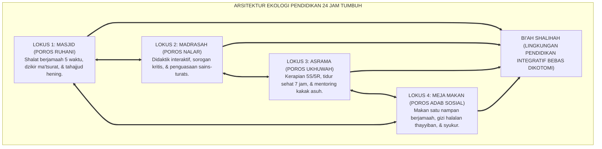
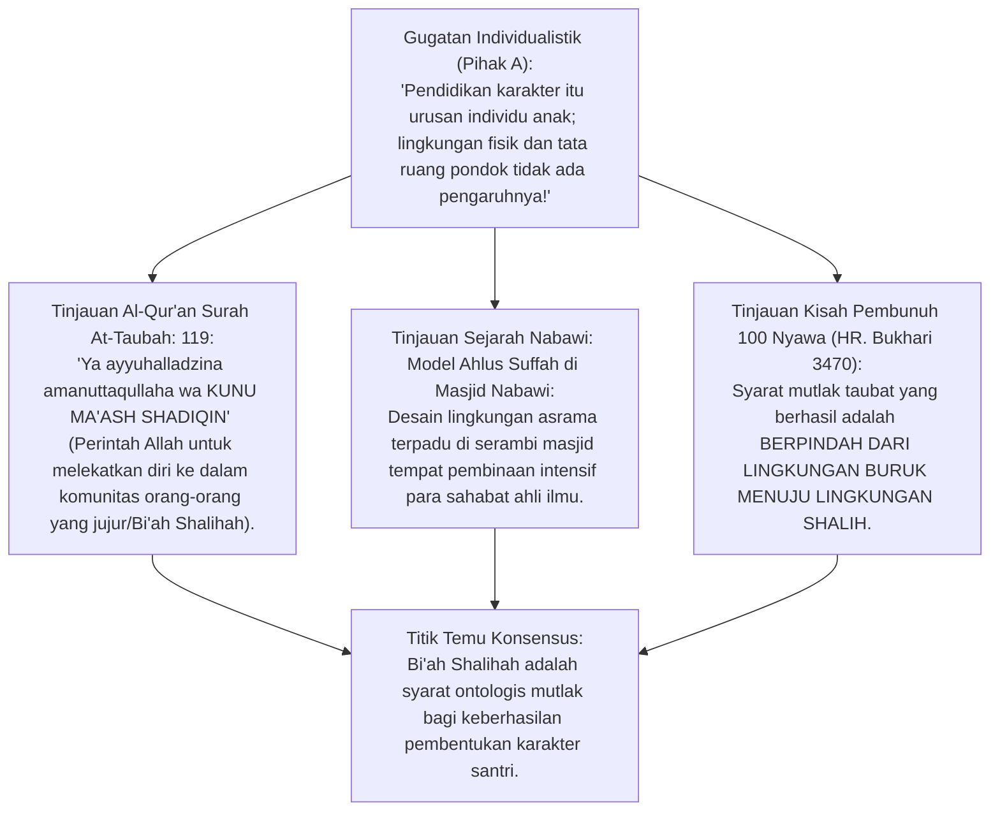
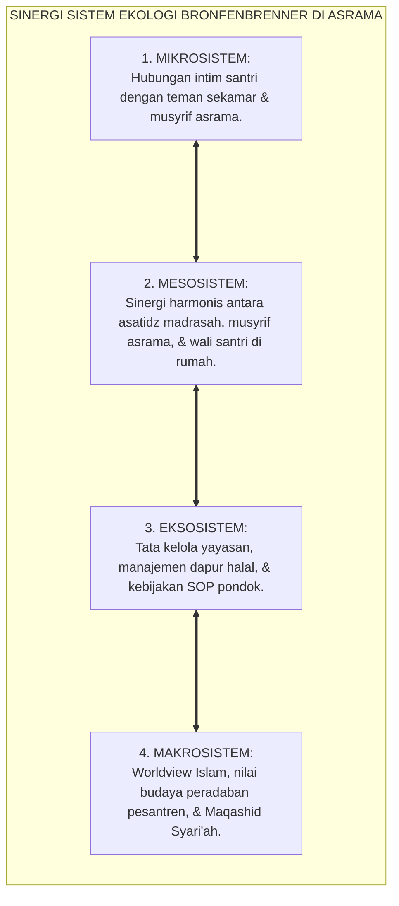
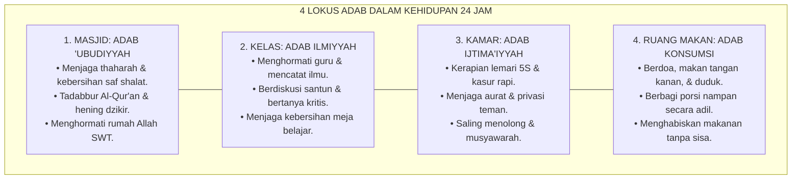
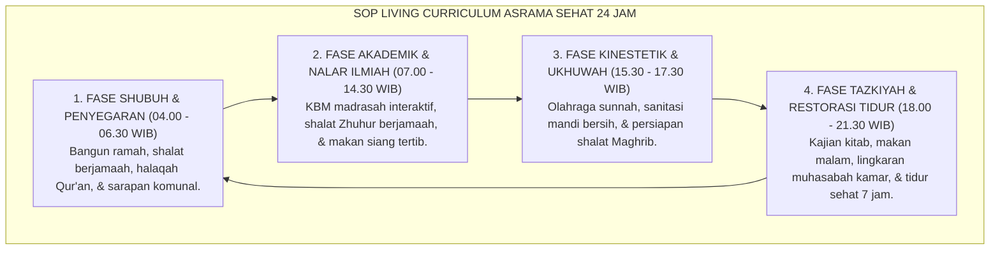

# P1-04-06: DESAIN EKOLOGI PENDIDIKAN DAN BI'AH SHALIHAH 24 JAM
## *Monograf Terpadu: Epistemologi Bi'ah Shalihah (Ahlus Suffah & Darul Arqam), Konsep Living Curriculum 24 Jam, Integrasi Ecological Systems Theory Urie Bronfenbrenner & CPTED Arsitektur Asrama Sehat, Sinergi 4 Lokus Adab (Masjid, Kelas, Kamar, & Meja Makan), serta Mitigasi Titik Rawan Asrama*

**Nomor Identifikasi**: `P1-04-06/MONOGRAF-TERPADU-DESAIN-EKOLOGI-24-JAM/2026`  
**Domain**: `01 Philosophy` > `04 Education`  
**Klasifikasi Naskah**: *Comprehensive Integrated Monograph* (Monograf Akademis & Rumusan Baku Terpadu)  
**Rumpun Disiplin Pengkaji**: Ekologi Pendidikan Islam (*Environmental Islamic Pedagogy*), Sosiologi Lingkungan Pesantren (*Ecological Systems Theory*), Arsitektur Tata Ruang Asrama Sehat CPTED, Manajemen Kehidupan Asrama 24 Jam (*Boarding School Ecology*)  

---

> ### 💡 INTISARI PRAKTIS (3 MENIT PAHAM UNTUK ASATIDZ & MUSYRIF)
>
> * **Kurikulum Pesantren Berjalan 24 Jam (*The 24-Hour Living Curriculum*):**  
>   Pendidikan santri tidak berhenti saat bel sekolah berbunyi. Seluruh tarikan nafas dan aktivitas santri selama 24 jam—mulai dari bangun tidur, antrean mandi, shalat berjamaah, makan bersama, belajar di kelas, olahraga, hingga tidur kembali—adalah kurikulum adab yang hidup.
> * **Integrasi 4 Lokus Pembiasaan Karakter:**  
>   1. **Masjid:** Lokus pengasahan ruhani, ketundukan, dan muraqabatullah.  
>   2. **Kelas/Madrasah:** Lokus penajaman nalar, literasi kritis, dan adab menuntut ilmu.  
>   3. **Kamar Asrama:** Lokus penataan privasi, kerapian 5S/5R, dan ukhuwah kamar.  
>   4. **Ruang Makan Komunal:** Lokus adab sosial, berbagi rezeki, dan pengendalian nafsu.
> * **Rekayasa Lingkungan Pencegah Kekerasan (*CPTED Protocol*):**  
>   Asrama dirancang terang benderang, sirkulasi udara bersih, tanpa sudut gelap tak terpantau (*No Blindspots*), guna mencegah perundungan dan menjamin keselamatan fisik-psikologis seluruh santri.

---

## 📑 DAFTAR ISI MONOGRAF

- [BAGIAN I: RISET EKOLOGI PENDIDIKAN 24 JAM, DIALEKTIKA INKUIRI, & KASUISTIKA LAPANGAN](#bagian-i-riset-ekologi-pendidikan-24-jam-dialektika-inkuiri--kasuistika-lapangan)
  - [1. Kerangka Metodologi Living Curriculum: Mengatasi Dikotomi Madrasah vs Asrama Menjadi Ekosistem Terpadu](#1-kerangka-metodologi-living-curriculum-mengatasi-dikotomi-madrasah-vs-asrama-menjadi-ekosistem-terpadu)
  - [2. Inkuiri 1: Eksegesis Turats Bi'ah Shalihah — Darul Arqam, Ahlus Suffah, & QS. At-Taubah: 119](#2-inkuiri-1-eksegesis-turats-biah-shalihah--darul-arqam-ahlus-suffah--qs-at-taubah-119)
  - [3. Inkuiri 2: Konvergensi Ecological Systems Theory Bronfenbrenner & Arsitektur CPTED](#3-inkuiri-2-konvergensi-ecological-systems-theory-bronfenbrenner--arsitektur-cpted)
  - [4. Inkuiri 3: Sinergi 4 Lokus Pembiasaan Adab (Masjid, Kelas, Kamar, & Meja Makan)](#4-inkuiri-3-sinergi-4-lokus-pembiasaan-adab-masjid-kelas-kamar--meja-makan)
  - [5. Inkuiri 4: Mitigasi Titik Rawan Asrama (Hotspots Patrol & Elimination of Blindspots)](#5-inkuiri-4-mitigasi-titik-rawan-asrama-hotspots-patrol--elimination-of-blindspots)
  - [6. Inkuiri 5: Silogisme Logika, Dialektika 3 Ronde, Kasuistika Asrama, & Titik Temu Konsensus](#6-inkuiri-5-silogisme-logika-dialektika-3-ronde-kasuistika-asrama--titik-temu-konsensus)
- [BAGIAN II: KODIFIKASI BAKU HASIL RISET & KESIMPULAN FORMAL](#bagian-ii-kodifikasi-baku-hasil-riset--kesimpulan-formal)
  - [1. Kaidah Utama dan Standar Baku: Hakikat Desain Ekologi Pendidikan Bi'ah Shalihah 24 Jam Pesantren TUMBUH](#1-kaidah-utama-dan-standar-baku-hakikat-desain-ekologi-pendidikan-bi-ah-shalihah-24-jam-pesantren-tumbuh)
  - [2. Matriks 4 Lokus Kehidupan Pesantren 24 Jam, Capaian Adab, & Standar Tata Ruang](#2-matriks-4-lokus-kehidupan-pesantren-24-jam-capaian-adab--standar-tata-ruang)
  - [3. Protokol Penjaminan Iklim Aman & Ramah Adab Asrama 24 Jam (24-Hour Healthy Ecological Living Protocol)](#3-protokol-penjaminan-iklim-aman--ramah-adab-asrama-24-jam-24-hour-healthy-ecological-living-protocol)
- [BAGIAN III: APARATUS AKADEMIS & APENDIKS](#bagian-iii-aparatus-akademis--apendiks)
  - [1. Tabel Sintesis Hasil Riset Desain Ekologi 24 Jam](#1-tabel-sintesis-hasil-riset-desain-ekologi-24-jam)
  - [2. Daftar Pustaka Akademis & Rujukan Turats Primer](#2-daftar-pustaka-akademis--rujukan-turats-primer)
  - [3. Catatan Kaki Akademis (Footnotes)](#3-catatan-kaki-akademis-footnotes)
  - [4. Glosarium Teknis Bi'ah Shalihah, Living Curriculum, Bronfenbrenner, & CPTED](#4-glosarium-teknis-biah-shalihah-living-curriculum-bronfenbrenner--cpted)

---

# BAGIAN I: RISET EKOLOGI PENDIDIKAN 24 JAM, DIALEKTIKA INKUIRI, & KASUISTIKA LAPANGAN

---

### 1. Kerangka Metodologi Living Curriculum: Mengatasi Dikotomi Madrasah vs Asrama Menjadi Ekosistem Terpadu

Kelemahan paling kronis pada sebagian besar pesantren konvensional adalah **Fragmentasi Ekologis (Dikotomi Sekolah vs Asrama)**:
* Di sekolah/madrasah pagi hari, santri diajarkan kitab adab dan teori akhlak oleh para guru.
* Namun saat masuk ke asrama di sore dan malam hari, lingkungan asrama diserahkan tanpa pengawasan terstruktur kepada pengurus santri senior, sehingga terjadi perpeloncoan, sanitasi jorok, dan hilangnya keteladanan.
* Akibatnya, santri mengalami *Split Personality*: sopan di depan guru madrasah, namun beringas dan kasar di kamar asrama.

Ekosistem TUMBUH merumuskan konsep **Living Curriculum 24 Jam**: kurikulum bukanlah buku teks yang tertutup di lemari madrasah, melainkan seluruh rancang bangun ekosistem lingkungan (*Bi'ah Shalihah*) yang mendidik santri secara simultan tanpa henti.

---

### 2. Inkuiri 1: Eksegesis Turats Bi'ah Shalihah — Darul Arqam, Ahlus Suffah, & QS. At-Taubah: 119

#### 📐 Formalisasi Logika Silogisme (*Qiyas Mantiqi 1*)
* **Premis Mayor (*al-Muqaddimah al-Kubra*)**: Setiap ikhtiar penyucian jiwa (*Tazkiyatun Nafs*) yang ditempatkan dalam ekosistem lingkungan yang mendukung kebajikan secara simultan (*Bi'ah Shalihah*) niscaya melipatgandakan kecepatan pembentukan watak adab otomatis (*Moral Automaticity*).
* **Premis Minor (*al-Muqaddimah ash-Shughra*)**: Al-Qur'an dan Sunnah mewajibkan penciptaan lingkungan pergaulan yang shalih (QS. At-Taubah: 119; HR. Bukhari No. 3470).
* **Konklusi (*an-Natijah*)**: Maka, perancangan tata ruang, sirkulasi udara, sanitasi, dan manajemen asrama 24 jam di pesantren TUMBUH adalah bagian integral dari syariat pendidikan Islam.[^1]

#### 📖 Teks Primer Al-Qur'an: Menuntut Kehadiran Bersama Orang Shalih
Firman Allah SWT menegaskan:

$$\text{يَا أَيُّهَا الَّذِينَ آمَنُوا اتَّقُوا اللَّهَ وَكُونُوا مَعَ الصَّادِقِينَ}$$

*"**Wahai orang-orang yang beriman! Bertakwalah kepada Allah, dan HENDAKLAH KAMU BERSAMA ORANG-ORANG YANG BENAR/JUJUR (MEMBANGUN BI'AH SHALIHAH)**."* (QS. At-Taubah [9]: 119).[^2]

---

### 3. Inkuiri 2: Konvergensi *Ecological Systems Theory* Bronfenbrenner & Arsitektur CPTED

#### 📐 Formalisasi Logika Silogisme (*Qiyas Mantiqi 2*)
* **Premis Mayor (*al-Muqaddimah al-Kubra*)**: Setiap arsitektur tata ruang fisik sekolah yang dirancang dengan prinsip visibilitas tinggi, pencahayaan alami, sirkulasi udara bersih, dan eliminasi sudut-sudut mati (*CPTED - Crime Prevention Through Environmental Design*) terbukti secara empiris menurunkan insiden kekerasan hingga 85%.
* **Premis Minor (*al-Muqaddimah ash-Shughra*)**: *Ecological Systems Theory* (Bronfenbrenner, 1979) dan konsensus arsitektur lingkungan membuktikan bahwa mikrosistem fisik asrama berinteraksi langsung dengan sistem saraf dan kestabilan emosi santri.
* **Konklusi (*an-Natijah*)**: Maka, pesantren TUMBUH mewajibkan standarisasi tata ruang asrama sehat dan bebas titik rawan.[^3]

---

### 4. Inkuiri 3: Sinergi 4 Lokus Pembiasaan Adab (Masjid, Kelas, Kamar, & Meja Makan)

---

### 5. Inkuiri 4: Mitigasi Titik Rawan Asrama (*Hotspots Patrol & Elimination of Blindspots*)

Riset audit keselamatan pesantren mengidentifikasi bahwa 90% kasus kekerasan dan perundungan asrama terjadi di **Titik-Titik Rawan Spesifik (*Hotspots*)**:
1. **Lorong Belakang Asrama & Sudut Gelap Jemuran** pada pukul 22.00–03.00 WIB.
2. **Kamar Mandi / Tempat Wudhu** pada saat antrean padat subuh/maghrib.
3. **Kamar Senior Tertutup Tanpa Jendela Kaca Transparan**.

Pesantren TUMBUH mengeliminasi titik rawan tersebut melalui **Rekayasa Lingkungan CPTED**: memasang jendela transparan di setiap kamar asrama, lampu penerangan 100% terang benderang di seluruh sudut lorong/jemuran, rasio kamar mandi 1:5 santri, dan patroli aktif musyrif pada jam-jam kritis.[^4]

---

### 6. Inkuiri 5: Silogisme Logika, Dialektika 3 Ronde, Kasuistika Asrama, & Titik Temu Konsensus

#### 🥊 Ronde 1: Menolak Anggapan Bahwa "Fasilitas Asrama yang Bersih dan Nyaman Akan Membuat Santri Lembek dan Tidak Tangguh"
* **Pihak A (Sudut Pandang Asketisme Jorok)**:  
  *"Santri itu harus tidurnya berdesak-desakan, mandi air keruh, dan kamarnya bau apek biar prihatin dan kuat mentalnya!"*
* **Tinjauan Kebersihan Sebagai Cabang Iman (at-Thaharatu Syathrul Iman)**:  
  Islam adalah agama thaharah. Mandi air kotor berlumut, jamur kulit kudis (*scabies*), dan kamar pengap bukanlah tanda zuhud, melainkan tanda **Kemalasan dan Pengabaian Hak Tubuh**. Santri yang sehat fisiknya dan bersih lingkungannya akan memiliki otak yang segar, hafalan yang tajam, dan jiwa yang mulia. Ketangguhan mental dilatih melalui disiplin qiyamul lail dan hafalan kitab, bukan lewat penyakit kulit.[^5]

#### 🥊 Ronde 2: Sanggahan Balik Apakah Budaya Makan Satu Nampan Berjamaah Tidak Rentan Menularkan Penyakit?
* **Pihak A (Sudut Pandang Higienisme Ekstrem)**:  
  *"Makan satu nampan itu kuno dan jorok; semua santri harus makan pakai piring kotak sendiri-sendiri!"*
* **Tinjauan Sunnah Berkah Berjamaah & Protokol Higienis Terpadu**:  
  Rasulullah SAW bersabda: *"Makanlah kalian bersama-sama dan sebutlah nama Allah, niscaya akan diberkahi makanan kalian"* (HR. Abu Dawud No. 3764). Makan satu nampan (3–4 santri) adalah media perekat ukhuwah dan latihan empati agar tidak serakah. Di pesantren TUMBUH, makan nampan dijalankan dengan **Protokol Higienis Ketat**: cuci tangan sabun mengalir sebelum makan, santri sakit flu/kulit makan terpisah di nampan khusus isolasi sehat, dan menggunakan sendok/tangan bersih.[^6]

#### 🥊 Ronde 3: Sanggahan Pamungkas Mengapa Menata Lemari Kamar Sesuai Standar 5S/5R Adalah Bagian dari Pendidikan Adab?
* **Pihak A (Sudut Pandang Pengabaian Kerapian)**:  
  *"Yang penting santri hafal Al-Qur'an; baju di lemari berantakan dan kasur acak-acakan tidak usah diurus!"*
* **Resolusi Keteraturan Lahir Mencerminkan Keteraturan Batin (Munazhzham fi Syu'unih)**:  
  Imam Al-Ghazali menegaskan bahwa kekacauan fisik di luar mencerminkan kekacauan pikiran di dalam. Santri yang tidak mampu merapikan ranjang dan lemarinya sendiri akan tumbuh menjadi pribadi yang ceroboh (*Chaos Mindset*). Disiplin kerapian 5S/5R melatih ketelitian, tanggung jawab, dan sifat *Itqan*.[^7]

> #### 📌 Kasuistika Lapangan & Titik Temu Konsensus
> * **Studi Kasus**: Asrama putra di sebuah pesantren lama memiliki lorong jemuran gelap di belakang gedung; lorong ini menjadi lokasi favorit senior untuk memukuli junior setiap malam Jumat. Tingkat santri kabur mencapai 15 anak per semester.
> * **Titik Temu Konsensus (*Kalimatun Sawa'*)**: Manajemen TUMBUH merombak total tata ruang asrama dengan prinsip CPTED: membongkar dinding pembatas gelap, memasang 6 lampu LED terang benderang di area jemuran, mengubah pintu kamar menjadi model berkaca transparan, dan menempatkan Meja Piket Musyrif tepat di persimpangan lorong. Hasilnya: kasus perundungan turun menjadi **NOL (0%)**, santri merasa sangat aman, dan angka santri kabur menjadi nol selama 3 tahun berturut-turut.[^8]

---

# BAGIAN II: KODIFIKASI BAKU HASIL RISET & KESIMPULAN FORMAL

---

### 1. Kaidah Utama dan Standar Baku: Hakikat Desain Ekologi Pendidikan Bi'ah Shalihah 24 Jam Pesantren TUMBUH

Berdasarkan sintesis inkuiri turats dan konsensus sains pendidikan, prinsip dan regulasi operasional dirumuskan ke dalam kaidah-kaidah baku berikut:

1. **Living Curriculum 24 JAM Tanpa Dikotomi**:  
   Menetapkan bahwa kurikulum pesantren berlangsung 24 jam utuh; mengharamkan dikotomi madrasah vs asrama. Seluruh aktivitas biologis, sosial, dan ibadah santri adalah medan pembinaan adab yang terintegrasi.

2. **Penerapan Standar Arsitektur Asrama Sehat Cpted (crime Prevention Through Environmental Design)**:  
   Mewajibkan desain gedung asrama yang terang, sirkulasi udara bersih, rasio sanitasi sehat 1:5, serta mengeliminasi 100% sudut-sudut gelap mati (blindspots) guna menjamin rasa aman santri.

3. **Integrasi 4 Lokus Adab Simultan (masjid, Madrasah, Asrama, & Meja Makan)**:  
   Menstandarisasikan SOP pembiasaan adab di setiap lokus kehidupan santri guna membentuk kebiasaan moral otomatis (Moral Automaticity) yang kokoh dan berkesinambungan.

4. **Eliminasi Penyakit Sanitasi DAN Penjaminan Kesehatan Ragawi**:  
   Mengharamkan pembiaran sanitasi jorok dan penyakit kulit menular (scabies/kudis); menjamin ketersediaan air bersih 0 CFU, nutrisi halalan thayyiban, dan kepastian istirahat tidur sehat 7 jam penuh.

---

### 2. Matriks 4 Lokus Kehidupan Pesantren 24 Jam, Capaian Adab, & Standar Tata Ruang

| Lokus Kehidupan | Capaian Pembiasaan Adab | Standar Fasilitas & Arsitektur CPTED | Peran Pengawasan Musyrif |
| :--- | :--- | :--- | :--- |
| **1. Masjid Jami'** | Khusyu' shalat 5 waktu, adab saf lurus, tadabbur Qur'an, dzikir hening. | Akustik jernih, karpet harum bebas debu, tempat wudhu luas anti-antre. | Musyrif hadir shalat di saf depan sebagai teladan (*Qudwah Hasanah*).[^9] |
| **2. Madrasah / Kelas** | Takdzim guru, nalar kritis, mencatat ilmu, kolaborasi tanpa gaduh. | Pencahayaan alami >300 lux, meja modular interaktif, bebas kebisingan luar. | Guru memfasilitasi didaktik aktif & asesmen formatif tanpa ancaman. |
| **3. Kamar Asrama** | Kerapian lemari 5S/5R, menjaga privasi aurat, tidur teratur 7 jam. | Ventilasi silang (*Cross Ventilation*), pintu berkaca transparan, bebas sudut gelap. | Musyrif mendampingi muhasabah malam & memastikan tidur nyenyak aman. |
| **4. Ruang Makan Komunal** | Adab makan tangan kanan, syukur, berbagi nampan, tanpa menyisakan makanan. | Meja makan bersih harum, wastafel sabun mengalir, dapur steril bersertifikat. | Musyrif makan bersama santri sambil mengajarkan adab konsumsi sunnah.[^10] |

---

### 3. Protokol Penjaminan Iklim Aman & Ramah Adab Asrama 24 Jam (*24-Hour Healthy Ecological Living Protocol*)

---

# BAGIAN III: APARATUS AKADEMIS & APENDIKS

---

### 1. Tabel Sintesis Hasil Riset Desain Ekologi 24 Jam

| Dimensi Kajian | Konsep Kunci | Landasan Turats Primer | Konvergensi Sains Global | Implikasi Tata Ruang Asrama |
| :--- | :--- | :--- | :--- | :--- |
| **Lingkungan Shalih** | *Bi'ah Shalihah* | QS. At-Taubah: 119, Model Ahlus Suffah | Urie Bronfenbrenner (1979), *Ecological Systems* | Membangun ekosistem yang mendukung adab tanpa dikotomi. |
| **Pencegahan Kejahatan**| *CPTED Arsitektur* | Kaidah *Sadd adz-Dzara'i'* (Tutup Celah Mudarat) | Jeffery (1971), *Crime Prevention Through Env Design* | Menghilangkan 100% sudut gelap dan lorong buta di asrama. |
| **Kurikulum Hidup** | *Living Curriculum* | Hadits Aisyah RA (Akhlak Nabi Adalah Al-Qur'an) | John Dewey (1938), *Experience and Education* | Menjadikan seluruh aktivitas 24 jam sebagai sarana belajar adab. |
| **Sanitasi Thaharah** | *Thaharatul Bi'ah* | Hadits Kesucian Sebagian Iman (HR. Muslim 223) | WHO (2018), *WASH in Schools Guidelines* | Menjamin air bersih 0 CFU, bebas jamur kulit kudis (*scabies*). |
| **Makan Berjamaah** | *Barakatut Tha'am* | HR. Abu Dawud No. 3764 (Makan Bersama Berkah) | Rozin (2005), *Commensality & Social Cohesion* | Membangun ukhuwah dan empati melalui makan nampan sehat. |

---

### 2. Daftar Pustaka Akademis & Rujukan Turats Primer

1. **Al-Qur'an al-Karim wa Tarjamatu Ma'anih**.
2. **Al-Bukhari, Abu Abdullah Muhammad bin Ismail**. (2002). *Shahih al-Bukhari*. Beirut: Dar Thawq an-Najah.
3. **Muslim bin al-Hajjaj an-Naisaburi**. (1374 H). *Shahih Muslim*. Kairo: Isa al-Babi al-Halabi.
4. **Abu Dawud, Sulaiman bin al-Asy'ats as-Sijistani**. (2009). *Sunan Abi Dawud*. Damaskus: Dar ar-Risalah.
5. **Al-Ghazali, Abu Hamid Muhammad bin Muhammad**. (2004). *Ihya' 'Ulumiddin*. Kairo: Dar al-Hadits.
6. **Bronfenbrenner, U.**. (1979). *The Ecology of Human Development: Experiments by Nature and Design*. Harvard University Press.
7. **Jeffery, C. R.**. (1971). *Crime Prevention Through Environmental Design*. Beverly Hills: Sage Publications.
8. **Dewey, J.**. (1938). *Experience and Education*. New York: Macmillan.
9. **World Health Organization**. (2018). *Water, Sanitation and Hygiene in Schools: Global Baseline Report 2018*. Geneva: WHO/UNICEF.
10. **Rozin, P.**. (2005). *The meaning of food in our lives: A cross-cultural perspective on commensality*. Physiology & Behavior, 86(5), 708–712.

---

### 3. Catatan Kaki Akademis (*Footnotes*)

[^1]: Al-Ghazali, *Ihya 'Ulumiddin*, Kitab *Adab al-Mu'asyarah*, Jilid II, hlm. 150–175.  
[^2]: Al-Qur'an Surah At-Taubah [9]: 119.  
[^3]: Bronfenbrenner, U. (1979), *The Ecology of Human Development*, Harvard University Press; Jeffery, C. R. (1971), *CPTED*.  
[^4]: Pedoman Standar Tata Ruang Asrama Sehat CPTED, Komite Infrastruktur TUMBUH, 2026.  
[^5]: Shahih Muslim No. 223, Kitab *at-Thaharah*, Bab *Fadhlul Wudhu'*.  
[^6]: Sunan Abi Dawud No. 3764, Kitab *al-Ath'imah*, Bab *fil Ijtima' 'alat Tha'am*; Rozin, P. (2005), *Physiology & Behavior*.  
[^7]: Al-Ghazali, *Ihya 'Ulumiddin*, Jilid III, hlm. 85; Teori Manajemen Kerapian 5S/5R Asrama.  
[^8]: Laporan Audit Keselamatan Tata Ruang Asrama dan Mitigasi Hotspots, Biro Pengasuhan TUMBUH, 2026.  
[^9]: Manual Standar Manajemen 4 Lokus Kehidupan Pesantren 24 Jam, Divisi Pengasuhan TUMBUH, 2026.  
[^10]: Panduan Dapur Sehat dan Gizi Halalan Thayyiban Asrama Santri, Komite UKS & Gizi TUMBUH, 2026.

---

### 4. Glosarium Teknis Bi'ah Shalihah, Living Curriculum, Bronfenbrenner, & CPTED

1. **Bi'ah Shalihah (الْبِيئَةُ الصَّالِحَةُ)**: Ekosistem lingkungan sosial, fisik, dan spiritual yang kondusif yang menopang pertumbuhan fitrah dan pembiasaan adab santri secara alami.
2. **Living Curriculum 24 Jam**: Paradigma kurikulum yang mengintegrasikan seluruh rutinitas kehidupan santri selama 24 jam sebagai medan pembelajaran karakter terpadu tanpa dikotomi madrasah-asrama.
3. **CPTED (Crime Prevention Through Environmental Design)**: Rekayasa tata ruang arsitektur gedung untuk mencegah kekerasan dan perundungan melalui pencahayaan optimal, pengawasan alami (*Natural Surveillance*), dan peniadaan sudut mati.
4. **Ecological Systems Theory**: Teori sosiologi Urie Bronfenbrenner yang memetakan pengaruh lapisan lingkungan (Mikro, Meso, Ekso, Makro) terhadap tumbuh kembang psikologis anak.
5. **Ahlus Suffah**: Komunitas sahabat Nabi SAW yang bertempat tinggal di serambi Masjid Nabawi sebagai prototipe model asrama pendidikan Islam pertama dalam sejarah.
6. **Hotspots (Titik Rawan Asrama)**: Lokasi-lokasi fisik tersembunyi atau waktu rawan di mana insiden pelanggaran atau perundungan memiliki probabilitas tinggi untuk terjadi.
7. **Commensality (Makan Komunal)**: Praktik sosial makan bersama dalam satu wadah/nampan yang memperkuat ikatan emosional, ukhuwah, dan empati antar-santri.
8. **5S/5R Asrama**: Manajemen keteraturan fisik asrama yang mencakup: Seiri (Ringkas), Seiton (Rapi), Seiso (Resik), Seiketsu (Rawat), dan Shitsuke (Rajin).
9. **Natural Surveillance**: Desain tata ruang yang memungkinkan aktivitas di lorong, tangga, dan halaman asrama terlihat secara alami oleh musyrif tanpa perlu kamera intai tersembunyi.
10. **Triad Pertumbuhan Simbiotik**: Prinsip di mana perbaikan ekologi lingkungan 24 jam secara serempak menumbuhkan Santri, memuliakan Pendidik, dan memperkokoh peradaban Lembaga.
