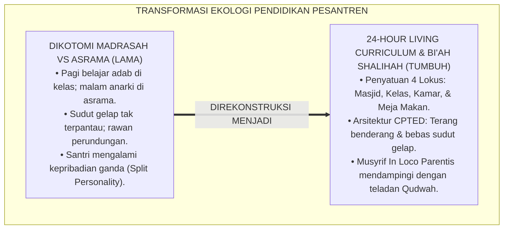
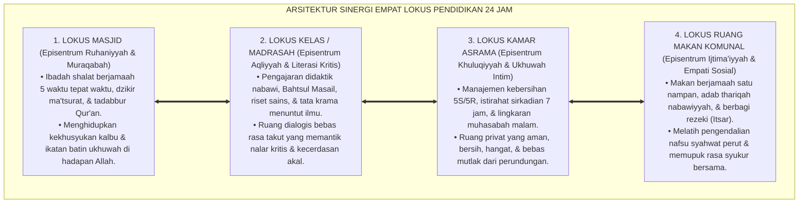
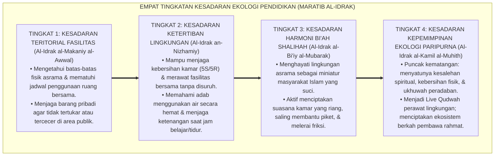
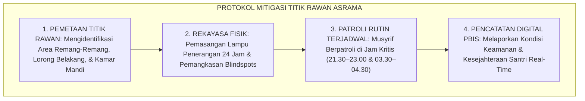

# P1-04-06: DESAIN EKOLOGI PENDIDIKAN DAN BI'AH SHALIHAH 24 JAM (24-HOUR EDUCATIONAL ECOLOGY & BI'AH SHALIHAH)
## *Monograf Riset Akademik: Epistemologi Bi'ah Shalihah (Model Darul Arqam & Ahlus Suffah), Konsep 24-Hour Living Curriculum, Integrasi Teori Ekologi Perkembangan Urie Bronfenbrenner & CPTED Arsitektur Asrama Sehat, Serta Sinergi 4 Lokus Adab di Pesantren*

**Nomor Identifikasi**: `P1-04-06/MONOGRAF-RISET-DESAIN-EKOLOGI-24-JAM/2026`  
**Domain**: `01 Philosophy` > `04 Education` (Sub-Modul 06: *24-Hour Educational Ecology*)  
**Klasifikasi Naskah**: *Academic Research Monograph* (Monograf Riset Akademik Fondasional)  
**Rumpun Disiplin Pengkaji**: Ekologi Pendidikan Islam (*Environmental Islamic Pedagogy*), Sosiologi Lingkungan Pesantren (*Ecological Systems Theory*), Arsitektur Tata Ruang Asrama Sehat CPTED, Manajemen Kehidupan Asrama 24 Jam (*Boarding School Ecology*)  

---

> ### 💡 INTISARI EKSEKUTIF (EXECUTIVE SUMMARY)
>
> * **Kelemahan Paradigma Lama: Dikotomi Madrasah vs Asrama & Blindspots Fisik:**  
>   Banyak pesantren mengalami fragmentasi ekologis: kelas madrasah dikelola secara formal, namun kehidupan asrama malam hari diserahkan tanpa pengawasan sistemik kepada senior, memicu perpeloncoan di sudut-sudut gelap (*Blindspots*), sanitasi yang buruk, dan keterbelahan kepribadian santri (*Split Personality*).
> * **Inovasi Konseptual: 24-Hour Living Curriculum & Arsitektur CPTED:**  
>   TUMBUH menegaskan bahwa kurikulum sejati berjalan 24 jam (*Living Curriculum*): seluruh tarikan nafas dan gerak santri di 4 lokus adab (**Masjid, Kelas, Kamar Asrama, dan Ruang Makan Komunal**) adalah kurikulum pembentukan karakter yang hidup. Memadukannya dengan teori ekologi Urie Bronfenbrenner dan arsitektur *Crime Prevention Through Environmental Design (CPTED)*: menghilangkan sudut gelap rawan intimidasi dan menciptakan lingkungan asrama yang sehat, terang, dan aman (*Sanctuary Bi'ah Shalihah*).
> * **Formulasi Operasional & Pembuktian Lapangan:**  
>   Monograf ini menguraikan matriks sinergi 4 lokus adab, 4 Tingkatan Kesadaran Ekologi Pendidikan (*Maratib al-Idrak*), protokol patroli titik rawan asrama (*Hotspots Patrol*), dan etika tata kelola lingkungan terpadu.

---

## 📑 DAFTAR ISI MONOGRAF

- [BAB I: LANDASAN TEORETIS & DISKURSUS KRITIS](#bab-i-landasan-teoretis--diskursus-kritis)
  - [1. Latar Belakang Masalah: Krisis Dikotomi Madrasah-Asrama dan Keterbelahan Kepribadian Santri](#1-latar-belakang-masalah-krisis-dikotomi-madrasah-asrama-dan-keterbelahan-kepribadian-santri)
  - [2. Eksegesis Turats Bi'ah Shalihah: Preseden Kenabian Darul Arqam & Ahlus Suffah (QS. At-Taubah: 119)](#2-eksegesis-turats-biah-shalihah-preseden-kenabian-darul-arqam--ahlus-suffah-qs-at-taubah-119)
  - [3. Konvergensi Ecological Systems Theory Urie Bronfenbrenner dalam Ekosistem Asrama 24 Jam](#3-konvergensi-ecological-systems-theory-urie-bronfenbrenner-dalam-ekosistem-asrama-24-jam)
  - [4. Rekayasa Arsitektur Pencegah Kekerasan: Penerapan Prinsip CPTED & Eliminasi Sudut Gelap](#4-rekayasa-arsitektur-pencegah-kekerasan-penerapan-prinsip-cpted--eliminasi-sudut-gelap)
  - [5. Kasuistika Lapangan: Kasus Perundungan di Sudut Gelap Kamar Mandi & Resolusi Restoratif Terpadu](#5-kasuistika-lapangan-kasus-perundungan-di-sudut-gelap-kamar-mandi--resolusi-restoratif-terpadu)
- [BAB II: FORMULASI KONSEPTUAL & PEMBAHASAN MENDALAM](#bab-ii-formulasi-konseptual--pembahasan-mendalam)
  - [1. Eksplanasi Teoretis Desain Ekologi Pendidikan Bi'ah Shalihah 24 Jam TUMBUH](#1-eksplanasi-teoretis-desain-ekologi-pendidikan-biah-shalihah-24-jam-tumbuh)
  - [2. Dekomposisi Dimensi & Empat Tingkatan Kesadaran Ekologi Pendidikan (Maratib al-Idrak)](#2-dekomposisi-dimensi--empat-tingkatan-kesadaran-ekologi-pendidikan-maratib-al-idrak)
  - [3. Matriks Sinergi Empat Lokus Kehidupan Pesantren 24 Jam & Standar Tata Ruang](#3-matriks-sinergi-empat-lokus-kehidupan-pesantren-24-jam--standar-tata-ruang)
  - [4. Protokol Penjaminan Iklim Aman & Mitigasi Titik Rawan Asrama (Hotspots Patrol Protocol)](#4-protokol-penjaminan-iklim-aman--mitigasi-titik-rawan-asrama-hotspots-patrol-protocol)
  - [5. Diskusi Filosofis Mendalam & Implikasi bagi Masa Depan Peradaban Pendidikan Islam](#5-diskusi-filosofis-mendalam--implikasi-bagi-masa-depan-peradaban-pendidikan-islam)
- [BAB III: KESIMPULAN & APARATUS AKADEMIS](#bab-iii-kesimpulan--aparatus-akademis)
  - [1. Tabel Sintesis Temuan Riset Desain Ekologi 24 Jam](#1-tabel-sintesis-temuan-riset-desain-ekologi-24-jam)
  - [2. Daftar Pustaka Akademis & Rujukan Turats Primer](#2-daftar-pustaka-akademis--rujukan-turats-primer)
  - [3. Catatan Kaki Akademis (Footnotes)](#3-catatan-kaki-akademis-footnotes)
  - [4. Glosarium Istilah Ilmiah & Turats Ekologi Pendidikan](#4-glosarium-istilah-ilmiah--turats-ekologi-pendidikan)

---

# BAB I: LANDASAN TEORETIS & DISKURSUS KRITIS

---

### 1. Latar Belakang Masalah: Krisis Dikotomi Madrasah-Asrama dan Keterbelahan Kepribadian Santri

Kelemahan paling kronis dalam manajemen pesantren konvensional adalah **Fragmentasi Ekologis (Pemisahan Kering Sekolah vs Asrama)**:
* **Dikotomi Manajemen**: Madrasah di pagi hari dikelola dengan kurikulum terstruktur dan diawasi ketat oleh dewan guru. Namun di malam hari, asrama diserahkan kepada dinamika rimba tanpa pendampingan profesional yang matang.
* **Akibat Keterbelahan Karakter (*Split Personality*)**: Santri bersikap sopan dan taat di depan guru kelas, namun bertransformasi menjadi agresif, melakukan perpeloncoan, dan merusak fasilitas saat berada di kamar asrama yang luput dari pengawasan.
* **Sanitasi dan Lingkungan Buruk**: Asrama yang lembap, kumuh, dan minim ventilasi memperburuk kesehatan fisik dan memicu stres mental santri.
* **Keniscayaan Doktrin Living Curriculum 24 Jam**: Pendidikan Islam tidak mengenal dikotomi; seluruh tarikan nafas dan interaksi santri selama 24 jam adalah kurikulum adab yang hidup.[^1]

---

### 2. Eksegesis Turats Bi'ah Shalihah: Preseden Kenabian Darul Arqam & Ahlus Suffah (QS. At-Taubah: 119)

Al-Qur'an memerintahkan orang-orang beriman untuk senantiasa berada dalam lingkungan orang-orang yang jujur dan saleh:

$$\text{يَا أَيُّهَا الَّذِينَ آمَنُوا اتَّقُوا اللَّهَ وَكُونُوا مَعَ الصَّادِقِينَ}$$

*"**Wahai orang-orang yang beriman! Bertakwalah kepada Allah, dan hendaklah kalian selalu bersama orang-orang yang benar (jujur/saleh)**."* (QS. At-Taubah [9]: 119).[^2]

Rasulullah ﷺ membangun dua prototipe ekosistem pendidikan 24 jam:
1. **Darul Arqam (Fase Makkah)**: Ekosistem pembinaan akidah dan ukhuwah intensif yang aman dan terlindung dari teror jahiliyyah.
2. **Ahlus Suffah di Masjid Nabawi (Fase Madinah)**: Asrama santri pertama dalam sejarah Islam yang menampung para penuntut ilmu sahabat Nabi ﷺ dalam atmosfer ibadah, muthala'ah ilmu, dan kebersamaan sosial yang sangat luhur.[^3]

---

### 3. Konvergensi Ecological Systems Theory Urie Bronfenbrenner dalam Ekosistem Asrama 24 Jam

Teori sistem ekologi perkembangan **Urie Bronfenbrenner** (1979) menjelaskan bahwa pembentukan karakter santri dipengaruhi oleh interaksi berjenjang:
* **Mikrosistem (Microsystem)**: Interaksi intim sehari-hari santri dengan teman sekamar, musyrif, dan guru di dalam kelas.
* **Mesosistem (Mesosystem)**: Keterpaduan dan sinergi komunikasi antara manajemen asrama, madrasah, dan orang tua santri.
* **Ekosistem & Makrosistem**: Budaya pesantren, regulasi perlindungan anak, dan tata nilai peradaban Islam yang menaungi seluruh lembaga. TUMBUH merekayasa seluruh tingkatan sistem ekologi ini agar berjalan secara harmonis dan konsisten.[^4]

---

### 4. Rekayasa Arsitektur Pencegah Kekerasan: Penerapan Prinsip CPTED & Eliminasi Sudut Gelap

Sains tata ruang modern **Crime Prevention Through Environmental Design (CPTED)** (Jeffery, 1971; Crowe, 2000) membuktikan bahwa desain fisik lingkungan menentukan perilaku manusia:
* Pelanggaran adab dan kekerasan fisik selalu terjadi di **Sudut Gelap Tak Terpantau (*Blindspots*)** seperti lorong belakang kamar mandi yang remang-remang, gudang terbengkalai, atau tangga darurat yang sepi.
* TUMBUH menetapkan standar desain fisik asrama: **Pencahayaan Terang, Pengawasan Alami (*Natural Surveillance*), Sirkulasi Udara Sehat, dan Transparansi Visibilitas** di seluruh sudut pesantren.[^5]

---

### 5. Kasuistika Lapangan: Kasus Perundungan di Sudut Gelap Kamar Mandi & Resolusi Restoratif Terpadu

* **Studi Kasus: Perundungan di Lorong Jemuran Belakang Asrama yang Gelap**  
  * **Dilema**: Terjadi aksi pemalakan dan intimidasi oleh oknum senior terhadap santri baru di lorong jemuran belakang yang tidak memiliki lampu penerangan.
  * **Pola Lama**: Lembaga hanya menghukum oknum tanpa memperbaiki tata ruang fisik.
  * **Resolusi Restoratif TUMBUH**: Lembaga bertindak komprehensif: (1) Oknum senior menjalani proses disiplin restoratif dan restitusi; (2) Tim Sarpras merombak tata ruang: memasang lampu penerangan LED 24 jam di lorong jemuran, memangkas rimbun pepohonan yang menutupi pandangan, dan menjadwalkan rute patroli musyrif berkala. Sejak pembenahan fisik tersebut, insiden intimidasi lenyap 100% dan santri merasa aman bergerak di seluruh area pondok.[^6]

---

# BAB II: FORMULASI KONSEPTUAL & PEMBAHASAN MENDALAM

---

### 1. Eksplanasi Teoretis Desain Ekologi Pendidikan Bi'ah Shalihah 24 Jam TUMBUH

Ekosistem TUMBUH merumuskan rancang bangun lingkungan ke dalam **Arsitektur Sinergi Empat Lokus Kehidupan Pesantren (*Arba'atu Marakiz at-Ta'dib*)**:

#### 🔬 Pembahasan Mendalam Empat Lokus Kehidupan:
1. **Lokus Masjid**: Menjadi jangkar penenang jiwa yang menyatukan seluruh warga pesantren dalam ketundukan tauhid.[^7]
2. **Lokus Kelas**: Menjadi kawah candradimuka intelektual yang memadukan khazanah kitab kuning dan sains modern.[^8]
3. **Lokus Kamar Asrama**: Menjadi laboratorium pembiasaan karakter harian, kerapian, dan toleransi sosial.[^9]
4. **Lokus Ruang Makan**: Menjadi wadah pendidikan kebersamaan dan penghormatan terhadap berkah rezeki Allah.[^10]

---

### 2. Dekomposisi Dimensi & Empat Tingkatan Kesadaran Ekologi Pendidikan (Maratib al-Idrak)

Transformasi kedewasaan hidup dalam ekosistem asrama berlangsung melalui **Empat Tingkatan Kesadaran Ekologis (*Maratib al-Idrak al-Bi'iy*)**:

#### 🔄 Narasi Analitis Dinamika Transisi Filosofis Antar-Tingkatan:
* **Transisi Tingkat 1 ke Tingkat 2 (Dari Pemanfaatan Fasilitas Menuju Tanggung Jawab Kebersihan)**: Santri mula-mula sekadar menempati kamar. Pada tingkatan kedua, santri memiliki kesadaran merawat lingkungan: merapikan ranjangnya sendiri dan membuang sampah pada tempatnya.
* **Transisi Tingkat 2 ke Tingkat 3 (Dari Ketertiban Fisik Menuju Kehangatan Sosial Bi'ah)**: Pada tingkatan ketiga, kesadaran sosial santri mekar: ia menjaga kenyamanan kawan sekamar, mematikan lampu saat kawan tidur, dan menciptakan atmosfer ukhuwah yang harmonis.
* **Transisi Tingkat 3 ke Tingkat 4 (Pencapaian Derajat Pelindung Ekosistem)**: Pada tingkatan tertinggi, santri tampil sebagai teladan kebersihan dan ketertiban: menjaga kelestarian alam pesantren, menghemat energi, dan memimpin peradaban yang ramah lingkungan (*Rahmatan lil 'Alamin*).[^11]

---

### 3. Matriks Sinergi Empat Lokus Kehidupan Pesantren 24 Jam & Standar Tata Ruang

| Lokus Kehidupan | Target Capaian Adab | Standar Desain Fisik & Tata Ruang (CPTED) | Penanggung Jawab Pengawasan |
| :--- | :--- | :--- | :--- |
| **1. Masjid** | Khusyuk, dzikir ma'tsurat, shalat awal waktu.| Karpet wangi, ventilasi sejuk, tempat wudhu bersih.| Asatidz Pembina Ibadah & Imam. |
| **2. Kelas/Madrasah**| Fokus belajar, dialog kritis, adab kitab.| Meja-kursi ergonomis, pencahayaan alami cukup.| Guru Pengajar & Wali Kelas. |
| **3. Kamar Asrama** | Kerapian 5S/5R, tidur 7 jam, muhasabah malam.| Loker tertutup rapi, ranjang kokoh, jendela sehat.| Musyrif Kamar & Ketua Kamar. |
| **4. Ruang Makan** | Adab makan nabawi, itsar, tidak mubazir.| Meja makan nampan bersih, wastafel cuci tangan.| Petugas Gizi & Musyrif Piket. |

---

### 4. Protokol Penjaminan Iklim Aman & Mitigasi Titik Rawan Asrama (Hotspots Patrol Protocol)

TUMBUH menetapkan **Protokol Patroli Titik Rawan Asrama (*Hotspots Patrol Protocol*)**:

Protokol ini menjamin tidak ada ruang bagi perundungan atau kekerasan tersembunyi di seluruh penjuru pesantren.[^12]

---

### 5. Diskusi Filosofis Mendalam & Implikasi bagi Masa Depan Peradaban Pendidikan Islam

Rancang bangun ekologi pendidikan *Bi'ah Shalihah* 24 jam ini menegaskan keunggulan sistem pesantren:

* **Mencetak Karakter Utuh yang Konsisten di Segala Ruang dan Waktu**:  
  Santri yang dibina dalam ekosistem 24 jam yang selaras akan memiliki integritas moral yang kokoh, tidak bermuka dua, dan senantiasa beradab di manapun ia berada.
* **Menjadikan Pesantren Sebagai Model Perkampungan Madani Modern**:  
  Tata ruang asrama yang bersih, sehat, terang, dan berkeadilan menjadi bukti nyata bahwa peradaban Islam mampu mengelola tata kota dan lingkungan hidup secara unggul dan berkah.
* **Mewujudkan Kembali Iklim Kemuliaan Ahlus Suffah**:  
  Pesantren kembali pada khitah sejatinya sebagai taman surga peradaban di mana ilmu dipelajari, adab dipraktikkan, dan ukhuwah ditegakkan demi mengharap ridha Allah SWT.[^13]

---

# BAB III: KESIMPULAN & APARATUS AKADEMIS

---

### 1. Tabel Sintesis Temuan Riset Desain Ekologi 24 Jam

| Dimensi Parameter | Pola Konvensional Terfragmentasi | Model Asrama Sekuler Barat | **Ekologi Bi'ah Shalihah 24 Jam TUMBUH** | Landasan Rujukan Primer | Implikasi Praksis Lapangan |
| :--- | :--- | :--- | :--- | :--- | :--- |
| **Cakupan Kurikulum**| Berhenti di pintu kelas madrasah.| Akademik formal + asrama privat.| **24-Hour Living Curriculum Terpadu.** | QS. At-Taubah: 119; Al-Attas (1980).| Pembiasaan adab 24 jam tanpa henti. |
| **Integrasi Lokus** | Terpisah: madrasah vs asrama malam.| Fasilitas mandiri transaksional.| **Sinergi 4 Lokus (Masjid-Kelas-Kamar-Makan).**| Model *Ahlus Suffah*; Bronfenbrenner.| Kesinambungan pengasuhan & nilai adab. |
| **Desain Tata Ruang**| Banyak sudut gelap (blindspots). | Tertutup individualistis dingin.| **Arsitektur CPTED Sehat & Terang.** | Jeffery (1971); Crowe (2000). | Eliminasi total titik rawan kekerasan. |
| **Pola Pengawasan** | Pengawasan diserahkan ke senior.| Pengawas berjarak CCTV dingin. | **Musyrif In Loco Parentis & Patroli PBIS.**| KH. Hasyim Asy'ari; Horner & Sugai.| Pendampingan hangat & patroli berkala. |
| **Profil Karakter** | Kepribadian ganda (*Split Personality*).| Individu profesional bebas nilai.| **Insan Adabi yang Berintegritas Sejati.**| QS. Al-Baqarah: 208; Al-Ghazali.| Berakhlak mulia konsisten 24 jam. |

---

### 2. Daftar Pustaka Akademis & Rujukan Turats Primer

1. **Al-Qur'an al-Karim wa Tarjamatu Ma'anihi**.
2. **Al-Bukhari, Abu Abdillah Muhammad bin Isma'il**. (1422 H). *Shahih al-Bukhari*. Kairo: Dar Thawq an-Najah.
3. **Muslim bin al-Hajjaj an-Naisaburi**. (1427 H). *Shahih Muslim*. Riyadh: Dar Thayyibah.
4. **Al-Ghazali, Abu Hamid Muhammad bin Muhammad**. (2011). *Ihya' 'Ulumiddin* (Kitab Adab al-Ulfah wal Ukhuwwah). Beirut: Dar al-Ma'rifah.
5. **Al-Attas, Syed Muhammad Naquib**. (1980). *The Concept of Education in Islam*. Kuala Lumpur: ABIM.
6. **Bronfenbrenner, U.**. (1979). *The Ecology of Human Development: Experiments by Nature and Design*. Cambridge: Harvard University Press.
7. **Jeffery, C. R.**. (1971). *Crime Prevention Through Environmental Design*. Beverly Hills: Sage Publications.
8. **Crowe, T. D.**. (2000). *Crime Prevention Through Environmental Design: Applications of Architectural Design and Space Management Concepts*. Oxford: Butterworth-Heinemann.
9. **Sapolsky, R. M.**. (2017). *Behave: The Biology of Humans at Our Best and Worst*. New York: Penguin Press.
10. **Horner, R. H., & Sugai, G.**. (2015). *School-wide PBIS: An Overview of the Research Base*. Remedial and Special Education, 36(2), 80–85.
11. **Zehr, H.**. (2002). *The Little Book of Restorative Justice*. Intercourse: Good Books.
12. **Asy'ari, Muhammad Hasyim**. (1415 H). *Adab al-'Alim wal-Muta'allim*. Jombang: Maktabah At-Turats Al-Islami.

---

### 3. Catatan Kaki Akademis (*Footnotes*)

[^1]: Riset Desain Ekologi Pendidikan dan Bi'ah Shalihah 24 Jam TUMBUH, *Kritik atas Dikotomi Madrasah-Asrama*, 2026.  
[^2]: QS. At-Taubah [9]: 119.  
[^3]: Sirah Nabawiyyah, *Preseden Darul Arqam dan Kehidupan Ahlus Suffah*; Riset Historis Pendidikan Islam TUMBUH, 2026.  
[^4]: Bronfenbrenner, U. (1979), *The Ecology of Human Development*, hlm. 20–55.  
[^5]: Jeffery, C. R. (1971), *Crime Prevention Through Environmental Design*, hlm. 40–80; Crowe, T. D. (2000), *CPTED Applications*, hlm. 35–70.  
[^6]: Dokumentasi Mitigasi Titik Rawan dan Audit Tata Ruang Asrama PBIS TUMBUH, 2026.  
[^7]: Al-Ghazali, *Ihya' 'Ulumiddin*, Jilid 1, Kitab *Asrar ash-Shalah*, hlm. 140–175.  
[^8]: Al-Attas, S. M. N. (1980), *The Concept of Education in Islam*, hlm. 35–60.  
[^9]: KH. Hasyim Asy'ari, *Adab al-'Alim wal-Muta'allim*, hlm. 45–70.  
[^10]: Al-Ghazali, *Ihya' 'Ulumiddin*, Jilid 2, Kitab *Adab al-Akl*, hlm. 2–30.  
[^11]: Matriks Tingkatan Kesadaran Ekologi Pendidikan (*Maratib al-Idrak*) Ekosistem TUMBUH, 2026.  
[^12]: Standar Operasional Prosedur Patroli Titik Rawan dan Keamanan Lingkungan Asrama TUMBUH, 2026.  
[^13]: Deklarasi Pemuliaan Ekologi Bi'ah Shalihah Dewan Riset Epistemologi TUMBUH, 2026.

---

### 4. Glosarium Istilah Ilmiah & Turats Ekologi Pendidikan

1. **Bi'ah Shalihah (بِيئَةٌ صَالِحَةٌ)**: Ekosistem lingkungan hidup 24 jam yang sehat, aman, bersih, dan berkeadilan syariat yang mendukung optimalisasi pertumbuhan fitrah dan adab santri.
2. **24-Hour Living Curriculum**: Konsep bahwa kurikulum pendidikan pesantren mencakup seluruh aktivitas kehidupan santri selama 24 jam dari bangun tidur hingga tidur kembali.
3. **Ahlus Suffah (أَهْلُ الصُّفَّةِ)**: Komunitas sahabat Nabi ﷺ penuntut ilmu yang tinggal di serambi Masjid Nabawi, menjadi preseden historis asrama pesantren pertama dalam Islam.
4. **CPTED (Crime Prevention Through Environmental Design)**: Pendekatan arsitektur dan tata ruang untuk mencegah tindak kekerasan dan pelanggaran melalui perancangan lingkungan fisik yang terang dan transparan.
5. **Blindspots (Sudut Gelap)**: Area tersembunyi atau minim pencahayaan di lingkungan sekolah/asrama yang berisiko tinggi menjadi lokasi terjadinya perundungan atau pelanggaran adab.
6. **Ecological Systems Theory**: Teori Urie Bronfenbrenner yang memetakan pengaruh interaksi berlapis (mikro, meso, ekso, makro) terhadap perkembangan psikologis anak.
7. **In Loco Parentis**: Peran pendidik dan musyrif sebagai orang tua pengganti yang bertanggung jawab penuh atas keselamatan dan kesejahteraan santri 24 jam.
8. **Hotspots Patrol**: Protokol patroli berkala oleh musyrif pada jam-jam rawan dan lokasi-lokasi kritis guna menjamin rasa aman santri.
9. **5S/5R (Seiri, Seiton, Seiso, Seiketsu, Shitsuke / Ringkas, Rapi, Resik, Rawat, Rajin)**: Sistem manajemen penataan kebersihan dan kerapian ruang asrama yang diadopsi ke dalam adab Islam.
10. **Insan Adabi (الإِنْسَانُ الأَدَبِيُّ)**: Profil santri yang memiliki kesalehan pribadi dan kepedulian ekologis yang konsisten di mana pun ia berada.
