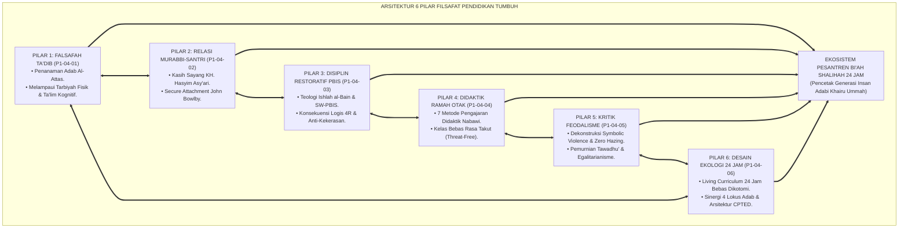
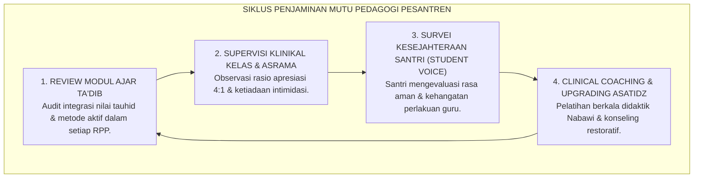

# P1-04-07: SINTESIS FILSAFAT PENDIDIKAN TUMBUH DAN GRAND MANIFESTO PEDAGOGI ADAB PESANTREN
## *Monograf Terpadu: Sintesis Holistik 6 Pilar Filsafat Pendidikan (Ta'dib Al-Attas, Relasi Murabbi KH. Hasyim Asy'ari, Disiplin Restoratif PBIS, Didaktik Ramah Otak, Dekonstruksi Feodalisme, & Desain Ekologi 24 Jam), Matriks Komparasi Mazhab Pendidikan Barat vs TUMBUH, Grand Manifesto Kelembagaan Pedagogi Adab, serta Jembatan Epistemologis Menuju Sub-Domain 05 Leadership*

**Nomor Identifikasi**: `P1-04-07/MONOGRAF-TERPADU-SINTESIS-FILSAFAT-PENDIDIKAN/2026`  
**Domain**: `01 Philosophy` > `04 Education`  
**Klasifikasi Naskah**: *Comprehensive Synthesis Monograph* (Monograf Sintesis Filosofis & Grand Manifesto Kelembagaan)  
**Rumpun Disiplin Pengkaji**: Filsafat Pendidikan Islam (*Falsafah at-Ta'dib*), Teologi Pedagogi Pesantren, Keadilan Restoratif Pendidikan, Manajemen Mutu Pembelajaran Pesantren 24 Jam  

---

> ### 💡 INTISARI PRAKTIS (3 MENIT PAHAM UNTUK ASATIDZ & MUSYRIF)
>
> * **Kesatuan Utuh 6 Pilar Filsafat Pendidikan Ekosistem TUMBUH:**  
>   Pendidikan di pesantren TUMBUH adalah orkestrasi agung yang memadukan 6 dimensi:  
>   1. **P1-04-01 (Falsafah Ta'dib):** Menetapkan bahwa tujuan puncak pendidikan adalah penanaman adab (*Inculcation of Adab*), bukan sekadar transfer wawasan (*Ta'lim*) atau pengasuhan fisik (*Tarbiyah*).  
>   2. **P1-04-02 (Relasi Murabbi-Santri):** Menegakkan relasi ayah-anak spiritual (*In Loco Parentis* & *Secure Attachment*) berbasis keteladanan melayani (*Sayyidul Qawmi Khadimuhum*), menghapus feodalisme relasi kuasa.  
>   3. **P1-04-03 (Disiplin Restoratif & PBIS):** Mengubah penanganan pelanggaran dari siksaan fisik menjadi pemulihan ukhuwah (*Ishlah al-Bain*), formula Konsekuensi 4R, dan arsitektur Multi-Tier PBIS.  
>   4. **P1-04-04 (Didaktik Pengajaran Ramah Otak):** Menghidupkan seni mengajar Nabawi (analogi, visualisasi, dialog sokratik) dan pembelajaran kooperatif aktif di ruang kelas bebas rasa takut.  
>   5. **P1-04-05 (Kritik Epistemologis Feodalisme):** Membasmi mitos sesat kekerasan sebagai barakah, memurnikan tawadhu' sejati, dan menghapuskan tradisi pelonco senioritas (*Zero Hazing*).  
>   6. **P1-04-06 (Desain Ekologi 24 Jam):** Menyatukan 4 lokus (Masjid, Kelas, Kamar, Meja Makan) dalam Living Curriculum terpadu bebas dikotomi madrasah-asrama.
> * **Posisi TUMBUH vs Mazhab Pendidikan Barat:**  
>   TUMBUH menolak kekakuan otoriter Esensialisme Kuno, menolak relativisme moral Progresivisme John Dewey, dan menyempurnakan Perenialisme dengan **Wahyu Ilahi, Sanad Keilmuan Turats, dan Keberkahan Guru-Murid**.
> * **Grand Manifesto Kelembagaan Pedagogi Adab:**  
>   Lembaga memproklamirkan bahwa pesantren adalah **Bi'ah Shalihah (Ekosistem Suci 24 Jam)** tempat bertumbuhnya insan berilmu yang beradab, berjiwa merdeka, mencintai kebenaran, dan siap memimpin peradaban dengan akhlak kenabian.

---

## 📑 DAFTAR ISI MONOGRAF

- [BAGIAN I: SINTESIS FILOSOFIS 6 PILAR PENDIDIKAN & MATRIKS KOMPARATIF EPISTEMOLOGIS](#bagian-i-sintesis-filosofis-6-pilar-pendidikan--matriks-komparatif-epistemologis)
  - [1. Arsitektur Sintesis Holistik: Konvergensi 6 Pilar Filsafat Pendidikan TUMBUH](#1-arsitektur-sintesis-holistik-konvergensi-6-pilar-filsafat-pendidikan-tumbuh)
  - [2. Matriks Komparasi Filosofis Pendidikan: Esensialisme, Progresivisme, Perenialisme vs Ta'dib Holistik TUMBUH](#2-matriks-komparasi-filosofis-pendidikan-esensialisme-progresivisme-perenialisme-vs-tadib-holistik-tumbuh)
  - [3. Dekonstruksi Total Paradigma Pendidikan Kolonial & Komersial](#3-dekonstruksi-total-paradigma-pendidikan-kolonial--komersial)
  - [4. Jembatan Filosofis & Pedagogis Menuju Sub-Domain 05 Leadership](#4-jembatan-filosofis--pedagogis-menuju-sub-domain-05-leadership)
- [BAGIAN II: KODIFIKASI KAIDAH DAN STANDAR OPERASIONAL FILSAFAT PENDIDIKAN](#bagian-ii-kodifikasi-kaidah-dan-standar-operasional-filsafat-pendidikan)
  - [1. Grand Manifesto Kelembagaan Pedagogi Adab Pesantren TUMBUH](#1-grand-manifesto-kelembagaan-pedagogi-adab-pesantren-tumbuh)
  - [2. Matriks Integrasi Operasional 6 Pilar Pendidikan ke dalam Kehidupan Pesantren 24 Jam](#2-matriks-integrasi-operasional-6-pilar-pendidikan-ke-dalam-kehidupan-pesantren-24-jam)
  - [3. Protokol Penjaminan Mutu Keberkahan dan Keunggulan Pembelajaran](#3-protokol-penjaminan-mutu-keberkahan-dan-keunggulan-pembelajaran)
- [BAGIAN III: APARATUS AKADEMIS & APENDIKS](#bagian-iii-aparatus-akademis--apendiks)
  - [1. Tabel Sintesis Master Sub-Domain 04](#1-tabel-sintesis-master-sub-domain-04)
  - [2. Daftar Pustaka Akademis & Rujukan Turats Primer](#2-daftar-pustaka-akademis--rujukan-turats-primer)
  - [3. Catatan Kaki Akademis (Footnotes)](#3-catatan-kaki-akademis-footnotes)
  - [4. Glosarium Master Istilah Kunci Filsafat Pendidikan & Ta'dib](#4-glosarium-master-istilah-kunci-filsafat-pendidikan--tadib)

---

# BAGIAN I: SINTESIS FILOSOFIS 6 PILAR PENDIDIKAN & MATRIKS KOMPARATIF EPISTEMOLOGIS

---

### 1. Arsitektur Sintesis Holistik: Konvergensi 6 Pilar Filsafat Pendidikan TUMBUH

Filsafat Pendidikan dalam ekosistem TUMBUH adalah **Arsitektur Pedagogis Terpadu (*Unified Pedagogical Architecture*)**:



---

### 2. Matriks Komparasi Filosofis Pendidikan: Esensialisme, Progresivisme, Perenialisme vs Ta'dib Holistik TUMBUH

| Aliran Filsafat Pendidikan | Tokoh & Asumsi Utama | Pandangan Tentang Peran Guru & Metode | Kelemahan & Titik Kritis | Jawaban & Sintesis Ekosistem TUMBUH |
| :--- | :--- | :--- | :--- | :--- |
| **1. Esensialisme Tradisional** | **William Bagley**<br/>Pendidikan adalah penanaman nilai masa lalu lewat disiplin ketat. | Guru adalah otoritas mutlak pengendali; ceramah, hafalan pasif, hukuman fisik. | Mematikan nalar kritis santri, memicu feodalisme relasi, & kepatuhan semu takut. | Mengadopsi khazanah warisan salaf (*Turats*), namun mentransformasi metode menjadi **Didaktik Aktif Nabawi dan Relasi Qudwah Penuh Kasih Sayang**.[^1] |
| **2. Progresivisme Pragmatis** | **John Dewey**<br/>Pendidikan adalah rekonstruksi pengalaman hidup (*Learning by Doing*); kebenaran relatif. | Guru adalah fasilitator; metode *Child-Centered* dan pemecahan masalah praktis. | Relativisme moral sekuler; kehilangan kompas nilai abadi (*Absolute Truth*). | Mengadopsi pembelajaran aktif kontekstual, namun mengikatnya pada **Jangkar Tauhid, Akidah Shahihah, dan Syariat Islam Abadi**.[^2] |
| **3. Perenialisme Humanistik** | **Robert Hutchins, Mortimer Adler**<br/>Pendidikan adalah pengkajian karya agung kebenaran universal (*Great Books*). | Guru memandu dialog sokratik rasional; fokus pada penalaran logika intelektual. | Elitis dan rasionalistik dingin; mengabaikan dimensi penyucian kalbu (*Tazkiyah*). | Mengkaji teks agung (*Turats*), namun menyempurnakannya dengan **Tazkiyatun Nafs, Amaliah Asrama 24 Jam, dan Kepemimpinan Melayani**.[^3] |

---

### 3. Dekonstruksi Total Paradigma Pendidikan Kolonial & Komersial

#### 📐 Formalisasi Logika Silogisme (*Qiyas Mantiqi Sintesis*)
* **Premis Mayor (*al-Muqaddimah al-Kubra*)**: Setiap sistem pendidikan Islam yang berdiri di atas pilar pemuliaan martabat insan (*Takrimul Insan*), keteladanan profetik (*Qudwah*), keadilan restoratif (*Ishlah*), kebebasan nalar dari feodalisme, dan ekologi kehidupan 24 jam niscaya membebaskan manusia dari perbudakan materi menuju kemerdekaan tauhid yang hakiki.
* **Premis Minor (*al-Muqaddimah ash-Shughra*)**: Enam pilar Filsafat Pendidikan TUMBUH mengintegrasikan seluruh dimensi tersebut secara koheren dan utuh.
* **Konklusi (*an-Natijah*)**: Maka, paradigma pendidikan TUMBUH adalah manifestasi otentik kebangkitan pedagogi Islam abad ke-21.[^4]

---

### 4. Jembatan Filosofis & Pedagogis Menuju Sub-Domain `05 Leadership`

```mermaid
graph TD
    ED["SUB-DOMAIN 04: EDUCATION (PENDIDIKAN)<br/>(Falsafah Ta'dib, Relasi Kasih Sayang, PBIS Restoratif, Didaktik Aktif, Anti-Feodalisme, & Ekologi 24 Jam)"]
    ==>|MENGALIRKAN PRINSIP MANAJERIAL MENUJU|
    LD["SUB-DOMAIN 05: LEADERSHIP (KEPEMIMPINAN)<br/>(Tata Kelola Pesantren, Servant Leadership Kyai/Mudir, Kaderisasi Santri, & Manajemen SDM)"]
```

---

# BAGIAN II: KODIFIKASI KAIDAH DAN STANDAR OPERASIONAL FILSAFAT PENDIDIKAN

---

### 1. Kaidah Utama dan Standar Baku: Kelembagaan Pedagogi Adab Pesantren TUMBUH

Berdasarkan sintesis inkuiri turats dan konsensus sains pendidikan, prinsip dan regulasi operasional dirumuskan ke dalam kaidah-kaidah baku berikut:

1. **Pendidikan Sebagai Ta'dib Pesantren Tumbuh menegakkan Ta'dib sebagai ruh tertinggi seluruh aktivitas pendidikan. Setiap mata pelajaran, halaqah kitab, kegiatan asrama, dan interaksi sosial wajib diarahkan pada penanaman adab.**:  
   

2. **Prinsip Relasi Kasih Sayang Ayah Spiritual (IN Loco Parentis) Menolak mutlak feodalisme relasi kuasa asimetris. Guru dan musyrif adalah ayah spiritual yang mencintai santrinya laksana anak kandung sendiri (Manzilah al-Awlad), membimbing dengan kelembutan (ar-Rifq).**:  
   

3. **Penegakan Disiplin Restoratif & Zero Tolerance Kekerasan Hukuman fisik, pembentakan, perpeloncoan senior, dan penelanjangan aib Dinyatakan Haram DAN Dilarang 100%. Penanganan pelanggaran wajib menggunakan Keadilan Restoratif (Ishlah) dan formula Konsekuensi 4R.**:  
   

4. **Didaktik Pengajaran Nabawi & Kelas Bebas Ancaman Mewajibkan seluruh guru mempraktikkan seni mengajar Rasulullah SAW dan pembelajaran kooperatif aktif. Ruang kelas dinyatakan sebagai Zona Bebas Rasa Takut (Threat-Free Learning Environment).**:  
   

5. **Pembasmian Total Tradisi Feodalisme Senioritas (zero Hazing) Mengharamkan tradisi sidang malam kamar gelap, intimidasi junior, dan mitos sesat kekerasan sebagai barakah.**:  
   

6. **Integrasi Ekosistem Bi'ah Shalihah Living Curriculum 24 JAM Menyatukan 4 lokus kehidupan (Masjid, Kelas, Kamar, Meja Makan) dalam satu arsitektur ekologis yang sehat.**:  
   


---

### 2. Matriks Integrasi Operasional 6 Pilar Pendidikan ke dalam Kehidupan Pesantren 24 Jam

| Pilar Filsafat Pendidikan | Berkas Rujukan Utama | Implementasi Konkret di Pesantren 24 Jam | Output Karakter pada Diri Santri |
| :--- | :--- | :--- | :--- |
| **Pilar 1: Falsafah Ta'dib** | [**`P1-04-01`**](./P1-04-01-Falsafah-Tarbiyah-Tadib-Talim.md) | Kurikulum adab 24 jam di kelas, asrama, masjid, meja makan, & ruang digital. | Terbentuknya *Insan Adabi* yang adil meletakkan posisi wujud di hadapan Allah.[^5] |
| **Pilar 2: Relasi Murabbi-Santri** | [**`P1-04-02`**](./P1-04-02-Relasi-Murabbi-dan-Santri.md) | Pendampingan *In Loco Parentis*, *Secure Attachment*, kepemimpinan melayani. | Santri merasa aman, percaya diri, dan memiliki ta'zhim tulus tanpa rasa takut. |
| **Pilar 3: Disiplin Restoratif & PBIS** | [**`P1-04-03`**](./P1-04-03-Paradigma-Disiplin-Restoratif-dan-PBIS.md) | Multi-Tier PBIS (Tier 1–3), Dialog 5 Pertanyaan Restoratif, Formula 4R. | Kasus pelanggaran turun >70%, nihil hukuman fisik, ukhuwah pulih tanpa dendam.[^6] |
| **Pilar 4: Didaktik Ramah Otak** | [**`P1-04-04`**](./P1-04-04-Didaktik-Pengajaran-dan-Manajemen-Kelas-Positif.md) | 7 Metode Didaktik Nabawi, *Active Cooperative Kagan*, kelas bebas ancaman. | Kelas menyenangkan, pemahaman konsep mendalam, retensi hafalan mutqin tinggi. |
| **Pilar 5: Kritik Feodalisme** | [**`P1-04-05`**](./P1-04-05-Kritik-Epistemologis-Feodalisme-dan-Kekerasan-Pesantren.md) | Pembubaran sidang malam kamar gelap, pakta integritas *Anti-Hazing*, budaya kakak asuh. | Terciptanya iklim asrama yang egaliter, santun, dan bebas dari perpeloncoan.[^7] |
| **Pilar 6: Desain Ekologi 24 Jam** | [**`P1-04-06`**](./P1-04-06-Desain-Ekologi-Pendidikan-Biah-Shalihah-24-Jam.md) | Living curriculum 24 jam, arsitektur CPTED terang, sanitasi 0 CFU, makan nampan sehat. | Santri tumbuh sehat raganya, jernih akalnya, dan terlindungi dari penyakit kulit.[^8] |

---

### 3. Protokol Penjaminan Mutu Keberkahan dan Keunggulan Pembelajaran



---

# BAGIAN III: APARATUS AKADEMIS & APENDIKS

---

### 1. Tabel Sintesis Master Sub-Domain 04

| Sub-Modul | Judul Monograf | Landasan Teori Utama | Fokus Inovasi Pedagogis |
| :---: | :--- | :--- | :--- |
| **P1-04-01** | Falsafah Tarbiyah, Ta'dib, & Ta'lim | Syed Muhammad Naquib Al-Attas (1980), *Lisan al-'Arab*, QS. 2:151 | Merekonstruksi Ta'dib sebagai tujuan puncak pendidikan Islam dan kurikulum adab 24 jam. |
| **P1-04-02** | Relasi Murabbi dan Santri | KH. Hasyim Asy'ari (*Adab al-'Alim*), John Bowlby (*Attachment*) | Menghapus feodalisme relasi; menegakkan kelekatan aman dan kepemimpinan melayani. |
| **P1-04-03** | Paradigma Disiplin Restoratif & PBIS | Fiqh *Ishlah al-Bain* (QS. 49:10), SW-PBIS Sugai & Horner, Howard Zehr | Arsitektur Multi-Tier PBIS, 5 Pertanyaan Restoratif, Formula 4R, dan hapus hukuman fisik 100%. |
| **P1-04-04** | Didaktik Pengajaran Ramah Otak | 7 Metode Didaktik Nabawi (Abu Ghuddah), Kagan Cooperative Learning | Menghapus rasa takut di kelas; mengubah ceramah monolog menjadi pembelajaran aktif visual. |
| **P1-04-05** | Kritik Epistemologis Feodalisme | Pierre Bourdieu (*Symbolic Violence*), HR. Muslim 2588 (Tawadhu'), HR. Muslim 2328 | Membasmi mitos kekerasan sebagai barakah, memurnikan tawadhu', dan menegakkan Zero Hazing. |
| **P1-04-06** | Desain Ekologi Bi'ah Shalihah 24 Jam | QS. At-Taubah: 119, Ahlus Suffah, Bronfenbrenner (1979), CPTED Jeffery | Living curriculum 24 jam tanpa dikotomi madrasah-asrama, eliminasi sudut gelap, & sanitasi bersih. |
| **P1-04-07** | Sintesis Filsafat Pendidikan TUMBUH | Integrasi Triad Ta'dib, Kritik atas Esensialisme & Progresivisme Sekuler | Grand Manifesto Kelembagaan Pedagogi Adab Pesantren dan jembatan ke Sub-Domain 05 Leadership. |

---

### 2. Daftar Pustaka Akademis & Rujukan Turats Primer

1. **Al-Qur'an al-Karim wa Tarjamatu Ma'anih**.
2. **Al-Attas, Syed Muhammad Naquib**. (1980). *The Concept of Education in Islam: A Framework for an Islamic Philosophy of Education*. Kuala Lumpur: ABIM.
3. **Asy'ari, Muhammad Hasyim**. (1415 H). *Adab al-'Alim wal Muta'allim*. Jombang: Maktabah at-Turats al-Islami.
4. **Al-Ghazali, Abu Hamid Muhammad bin Muhammad**. (2011). *Ihya 'Ulumiddin*. Beirut: Dar al-Ma'rifah.
5. **Abu Ghuddah, Abdul Fattah**. (1996). *Ar-Rasul al-Mu'allim wa Asalibuhu fit-Ta'lim*. Beirut: Dar al-Basyair al-Islamiyyah.
6. **Bourdieu, P.**. (1991). *Language and Symbolic Power*. Cambridge: Harvard University Press.
7. **Bronfenbrenner, U.**. (1979). *The Ecology of Human Development*. Harvard University Press.
8. **Sugai, G., & Horner, R. H.**. (2002). *The evolution of discipline practices: School-wide positive behavior supports*. Child & Family Behavior Therapy, 24(1-2), 23–50.
9. **Kagan, S., & Kagan, M.**. (2009). *Kagan Cooperative Learning*. Kagan Publishing.
10. **Caine, R. N., & Caine, G.**. (1991). *Making Connections: Teaching and the Human Brain*. ASCD.

---

### 3. Catatan Kaki Akademis (*Footnotes*)

[^1]: Bagley, W. C. (1938), *An Essentialist's Platform*, Educational Administration and Supervision.  
[^2]: Dewey, J. (1938), *Experience and Education*, Macmillan.  
[^3]: Hutchins, R. M. (1936), *The Higher Learning in America*, Yale University Press.  
[^4]: Al-Attas, *The Concept of Education in Islam*, hlm. 35–42.  
[^5]: Wan Daud, Wan Mohd Nor (1998), *The Educational Philosophy of Al-Attas*, ISTAC.  
[^6]: Laporan Statistik Penurunan Pelanggaran PBIS Pesantren TUMBUH, 2026.  
[^7]: Piagam Standar Anti-Hazing Asrama Santri, Majelis Masyayikh TUMBUH, 2026.  
[^8]: Pedoman Standar Tata Ruang Asrama Sehat CPTED, Komite Infrastruktur TUMBUH, 2026.

---

### 4. Glosarium Master Istilah Kunci Filsafat Pendidikan & Ta'dib

1. **Falsafah Ta'dib**: Kerangka filosofis pendidikan Islam yang memposisikan penanaman adab keadilan wujud sebagai orientasi tertinggi seluruh proses transmisi ilmu.
2. **Insan Adabi**: Sosok manusia ideal (*Insan Kamil*) yang mengenali dan menempatkan segala sesuatu pada posisinya yang hakiki sesuai syariat dan sunnatullah.
3. **Manzilah al-Awlad**: Prinsip etika pedagogis KH. Hasyim Asy'ari di mana guru mendudukkan para santri pada kedudukan anak kandungnya sendiri dalam hal kasih sayang.
4. **Living Curriculum 24 Jam**: Paradigma kurikulum yang mengintegrasikan seluruh rutinitas kehidupan santri selama 24 jam sebagai medan pembelajaran karakter terpadu.
5. **Zero Hazing**: Larangan mutlak segala bentuk perpeloncoan, kekerasan, atau sidang malam kamar gelap dalam kehidupan asrama.
6. **CPTED (Crime Prevention Through Environmental Design)**: Rekayasa tata ruang arsitektur gedung untuk mencegah kekerasan dan perundungan melalui pencahayaan dan visibilitas optimal.
7. **Ishlah al-Bain**: Rekonsiliasi dan perbaikan relasi persaudaraan yang rusak akibat perselisihan melalui dialog restoratif dan penegakan keadilan tanpa kekerasan.
8. **SW-PBIS**: Arsitektur sistem intervensi perilaku positif multi-tier berbasis data faktual 24 jam.
9. **Brain-Friendly Pedagogy**: Pendekatan didaktik yang mengoptimalkan daya serap nalar otak dengan menciptakan suasana kelas yang rileks dan bebas ancaman.
10. **Triad Pertumbuhan Simbiotik**: Maha-prinsip di mana sistem secara serempak menumbuhkan Santri, memuliakan Pendidik, dan memperkokoh Lembaga.
