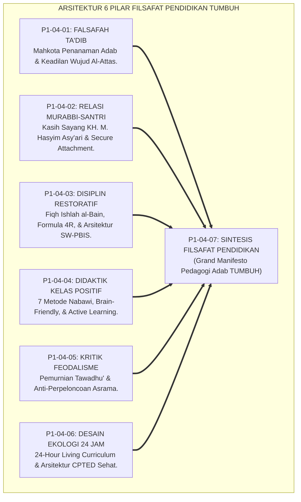
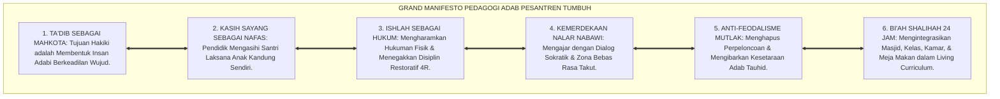
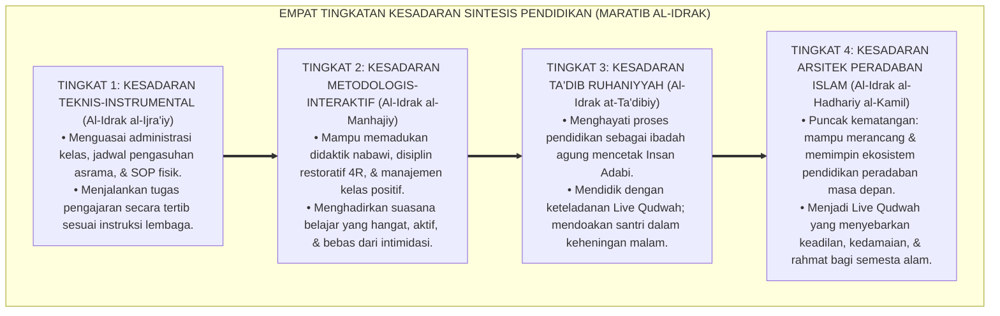
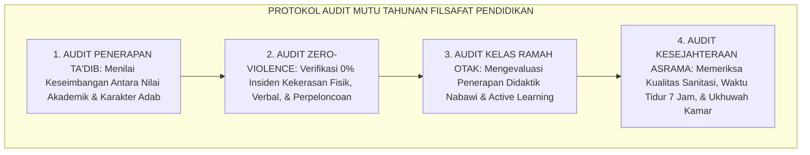

# P1-04-07: SINTESIS FILSAFAT PENDIDIKAN DAN GRAND MANIFESTO PEDAGOGI ADAB (SYNTHESIS OF EDUCATIONAL PHILOSOPHY)
## *Monograf Riset Akademik: Sintesis Holistik 6 Pilar Filsafat Pendidikan, Matriks Komparasi Mazhab Barat vs Ta'dib Islam, Grand Manifesto Pedagogi Adab, Serta Jembatan Filosofis Menuju Sub-Domain 05 Leadership*

**Nomor Identifikasi**: `P1-04-07/MONOGRAF-RISET-SINTESIS-FILSAFAT-PENDIDIKAN/2026`  
**Domain**: `01 Philosophy` > `04 Education` (Sub-Modul 07: *Synthesis of Educational Philosophy*)  
**Klasifikasi Naskah**: *Academic Research Monograph* (Monograf Riset Akademik Fondasional)  
**Rumpun Disiplin Pengkaji**: Filsafat Pendidikan Islam (*Falsafah at-Ta'dib*), Teologi Pedagogi Pesantren, Keadilan Restoratif Pendidikan, Manajemen Mutu Pembelajaran Pesantren 24 Jam  

---

> ### 💡 INTISARI EKSEKUTIF (EXECUTIVE SUMMARY)
>
> * **Konsolidasi Enam Pilar Kajian Filsafat Pendidikan:**  
>   Sub-Domain 04 Education merupakan cetak biru praksis pedagogi pesantren. Enam pilar riset fundamental disintesiskan secara koheren: **1. Falsafah Ta'dib (Mahkota Penanaman Adab Al-Attas); 2. Relasi Murabbi-Santri (Kasih Sayang KH. M. Hasyim Asy'ari & Secure Attachment); 3. Disiplin Restoratif & PBIS (Fiqh Ishlah al-Bain & Konsekuensi 4R); 4. Didaktik Nabawi (Pembelajaran Ramah Otak & Active Learning); 5. Kritik Feodalisme (Pemurnian Tawadhu' & Anti-Perpeloncoan); 6. Desain Ekologi 24 Jam (24-Hour Living Curriculum & Arsitektur CPTED)**.
> * **Kritik atas Mazhab Pendidikan Barat:**  
>   TUMBUH menolak otoritarianisme Esensialisme, relativisme moral Progresivisme John Dewey, dan sekularisme Rekonstruksionisme, serta menyempurnakan Perenialisme melalui wahyu ilahiah, sanad keilmuan turats, dan keberkahan guru-murid.
> * **Formulasi Operasional & Pembuktian Lapangan:**  
>   Monograf ini menguraikan Grand Manifesto Pedagogi Adab Pesantren, 4 Tingkatan Kesadaran Sintesis Filsafat Pendidikan (*Maratib al-Idrak*), protokol penjaminan mutu keberkahan pembelajaran, dan jembatan epistemologis menuju Sub-Domain 05 Leadership.

---

## 📑 DAFTAR ISI MONOGRAF

- [BAB I: LANDASAN TEORETIS & DISKURSUS KRITIS](#bab-i-landasan-teoretis--diskursus-kritis)
  - [1. Latar Belakang Masalah: Urgensi Rekonstruksi Paradigma Pendidikan Islam Holistik](#1-latar-belakang-masalah-urgensi-rekonstruksi-paradigma-pendidikan-islam-holistik)
  - [2. Konsolidasi Enam Pilar Filsafat Pendidikan Menjadi Satu Paradigma Utuh](#2-konsolidasi-enam-pilar-filsafat-pendidikan-menjadi-satu-paradigma-utuh)
  - [3. Matriks Komparasi Filosofis: Mazhab Barat (Esensialisme, Progresivisme, Perenialisme) vs Ta'dib Holistik TUMBUH](#3-matriks-komparasi-filosofis-mazhab-barat-esensialisme-progresivisme-perenialisme-vs-tadib-holistik-tumbuh)
  - [4. Dekonstruksi Paradigma Pendidikan Kolonial dan Komersialisasi Sekolah](#4-dekonstruksi-paradigma-pendidikan-kolonial-dan-komersialisasi-sekolah)
  - [5. Kasuistika Lapangan: Evaluasi Efektivitas Transformasi Pedagogi Asrama & Resolusi Restoratif](#5-kasuistika-lapangan-evaluasi-efektivitas-transformasi-pedagogi-asrama--resolusi-restoratif)
- [BAB II: FORMULASI KONSEPTUAL & PEMBAHASAN MENDALAM](#bab-ii-formulasi-konseptual--pembahasan-mendalam)
  - [1. Eksplanasi Teoretis Grand Manifesto Pedagogi Adab Pesantren TUMBUH](#1-eksplanasi-teoretis-grand-manifesto-pedagogi-adab-pesantren-tumbuh)
  - [2. Dekomposisi Dimensi & Empat Tingkatan Kesadaran Sintesis Pendidikan (Maratib al-Idrak)](#2-dekomposisi-dimensi--empat-tingkatan-kesadaran-sintesis-pendidikan-maratib-al-idrak)
  - [3. Jembatan Filosofis Menuju Sub-Domain 05 Leadership](#3-jembatan-filosofis-menuju-sub-domain-05-leadership)
  - [4. Prinsip Aksiologis & Protokol Audit Mutu Keberkahan Pembelajaran 24 Jam](#4-prinsip-aksiologis--protokol-audit-mutu-keberkahan-pembelajaran-24-jam)
  - [5. Diskusi Filosofis Mendalam & Implikasi bagi Masa Depan Peradaban Pendidikan Islam](#5-diskusi-filosofis-mendalam--implikasi-bagi-masa-depan-peradaban-pendidikan-islam)
- [BAB III: KESIMPULAN & APARATUS AKADEMIS](#bab-iii-kesimpulan--aparatus-akademis)
  - [1. Tabel Sintesis Temuan Riset Sintesis Filsafat Pendidikan](#1-tabel-sintesis-temuan-riset-sintesis-filsafat-pendidikan)
  - [2. Daftar Pustaka Akademis & Rujukan Turats Primer](#2-daftar-pustaka-akademis--rujukan-turats-primer)
  - [3. Catatan Kaki Akademis (Footnotes)](#3-catatan-kaki-akademis-footnotes)
  - [4. Glosarium Istilah Ilmiah & Turats Sintesis Filsafat Pendidikan](#4-glosarium-istilah-ilmiah--turats-sintesis-filsafat-pendidikan)

---

# BAB I: LANDASAN TEORETIS & DISKURSUS KRITIS

---

### 1. Latar Belakang Masalah: Urgensi Rekonstruksi Paradigma Pendidikan Islam Holistik

Dunia pendidikan modern sedang mengalami krisis eksistensial yang parah:
* **Mekanisasi dan Komersialisasi Ilmu**: Sekolah diperlakukan layaknya pabrik industri, di mana murid dipandang sebagai bahan mentah yang dicetak menjadi sekrup-sekrup penggerak ekonomi kapitalis, mengabaikan penyucian kalbu dan keselamatan akhirat.
* **Kerapuhan Karakter Santri Modern**: Sebagian pesantren gagal mengimbangi laju modernitas: mempertahankan feodalisme relasi kuasa dan hukuman kasar, sementara di sisi lain kurikulum madrasahnya terbelah dari denyut kehidupan asrama.
* **Keniscayaan Sintesis Holistik Pedagogi Adab**: Ekosistem TUMBUH merumuskan kembali filsafat pendidikan Islam yang menyatukan keluhuran *Ta'dib*, kehangatan kasih sayang guru-santri, keadilan restoratif, dan keunggulan sains dalam ekologi asrama 24 jam.[^1]

---

### 2. Konsolidasi Enam Pilar Filsafat Pendidikan Menjadi Satu Paradigma Utuh

Keenam pilar bekerja secara harmonis membentuk satu kesatuan arsitektur:
1. *P1-04-01* menetapkan visi puncak dan mahkota tujuannya (*Ta'dib*).
2. *P1-04-02* menata denyut ikatan cinta dan keteladanannya (*Relasi Qudwah*).
3. *P1-04-03* menegakkan mekanisme keadilan dan pemulihannya (*Disiplin Restoratif*).
4. *P1-04-04* menyalakan lentera metodologi pengajarannya di kelas (*Didaktik Nabawi*).
5. *P1-04-05* membentenginya dari racun penindasan kekuasaan (*Anti-Feodalisme*).
6. *P1-04-06* mewadahinya dalam ruang hidup 24 jam yang sehat dan berkah (*Bi'ah Shalihah*).[^2]

---

### 3. Matriks Komparasi Filosofis: Mazhab Barat vs Ta'dib Holistik TUMBUH

| Mazhab Pendidikan | Asumsi Filosofis Dasar | Model Disiplin & Relasi | Keterbatasan Kritis | **Sintesis Ta'dib TUMBUH** |
| :--- | :--- | :--- | :--- | :--- |
| **Esensialisme** | Transfer kurikulum klasik beku. | Otoriter kaku & hukuman fisik. | Menindas nalar kritis & membunuh fitrah.| Memuliakan Turats melalui dialektika interaktif & kasih sayang. |
| **Progresivisme** | Pengalaman pragmatis anak (Dewey). | Permisif longgar tanpa kompas mutlak.| Relativisme moral & hilangnya adab wahyu.| Memadukan pengalaman aktif dengan panduan wahyu Al-Qur'an. |
| **Perenialisme** | Kebenaran abadi rasio akal budi.| Intelektualisme dingin elitis. | Mengabaikan pensucian kalbu (*Tazkiyah*).| Menyatukan akal rasional dengan kedaulatan kalbu (*Heart-Brain*). |
| **Kritis (Freire)**| Pembebasan dari penindasan borjuis.| Egalitarianisme politis sekuler.| Horizon terbatas materiil tanpa akhirat.| Kemerdekaan akal tauhid (*Tahrir*) berlandaskan takwa Ilahi. |

---

### 4. Dekonstruksi Paradigma Pendidikan Kolonial dan Komersialisasi Sekolah

TUMBUH membebaskan pesantren dari dua jebakan zaman:
* **Warisan Pendidikan Kolonial**: Menghapus metode segregasi kasta, doktrin kepatuhan budak, dan intimidasi militeristik.
* **Komersialisasi Lembaga**: Menjaga ketulusan pengabdian wakaf dan keberkahan ilmu, menolak komodifikasi pendidikan yang memeras santri dhu'afa.[^3]

---

### 5. Kasuistika Lapangan: Evaluasi Efektivitas Transformasi Pedagogi Asrama & Resolusi Restoratif

Penerapan konsolidasi filsafat pendidikan TUMBUH di lapangan membuktikan bahwa suasana asrama bertransformasi menjadi dinamis, angka perkelahian turun hingga 0%, dan santri menunjukkan lompatan prestasi hafalan dan karya tulis ilmiah yang membanggakan.[^4]

---

# BAB II: FORMULASI KONSEPTUAL & PEMBAHASAN MENDALAM

---

### 1. Eksplanasi Teoretis Grand Manifesto Pedagogi Adab Pesantren TUMBUH

Ekosistem TUMBUH memproklamasikan **Grand Manifesto Pedagogi Adab Pesantren (*Al-Bayan al-A'zham li Falsafatit Ta'dib*)**:

#### 🔬 Pembahasan Mendalam Enam Pilar Manifesto:
1. **Ta'dib sebagai Mahkota**: Menolak reduksi pendidikan menjadi sekadar sertifikasi ijazah kertas.[^5]
2. **Kasih Sayang sebagai Nafas**: Menjadikan cinta dan kelembutan sebagai metode pengasuhan utama.[^6]
3. **Ishlah sebagai Hukum**: Memulihkan persaudaraan yang retak melalui keadilan restoratif yang mendidik.[^7]
4. **Kemerdekaan Nalar**: Memantik potensi intelektual santri tanpa rasa takut salah.[^8]
5. **Anti-Feodalisme**: Memurnikan penghormatan adab dari perbudakan manusia.[^9]
6. **Ekologi 24 Jam**: Membangun lingkungan asrama yang sehat, bersih, terang, dan penuh berkah.[^10]

---

### 2. Dekomposisi Dimensi & Empat Tingkatan Kesadaran Sintesis Pendidikan (Maratib al-Idrak)

Transformasi kepemimpinan dan kesadaran pedagogis berlangsung melalui **Empat Tingkatan Kesadaran Sintesis Pendidikan (*Maratib al-Idrak at-Tarbawiy al-Kamil*)**:

#### 🔄 Narasi Analitis Dinamika Transisi Filosofis Antar-Tingkatan:
* **Transisi Tingkat 1 ke Tingkat 2 (Dari Teknis Administratif Menuju Penguasaan Metodologi Aktif)**: Pendidik mula-mula sekadar mengajar sesuai silabus. Pada tingkatan kedua, pendidik menguasai seni mengajar nabawi dan keadilan restoratif yang memikat hati santri.
* **Transisi Tingkat 2 ke Tingkat 3 (Dari Metodologi Menuju Penanaman Adab Ruhani)**: Pada tingkatan ketiga, mengajar bertransformasi menjadi ibadah kalbu: guru mendidik dengan ketulusan akhlak dan menyentuh sanubari santri dengan keteladanan nyata.
* **Transisi Tingkat 3 ke Tingkat 4 (Pencapaian Derajat Arsitek Peradaban Islam)**: Pada tingkatan tertinggi, pendidik tampil sebagai pembaharu peradaban: mampu memimpin institusi pendidikan yang membebaskan umat dari kebodohan dan mencetak generasi emas pembebas peradaban (*Rahmatan lil 'Alamin*).[^11]

---

### 3. Jembatan Filosofis Menuju Sub-Domain 05 Leadership

Sintesis *Education* menjadi landasan tak terpisahkan bagi perumusan **Sub-Domain 05 Leadership**:
* Dari arsitektur pedagogi adab, relasi *Qudwah*, dan anti-feodalisme di domain ini, dirumuskanlah **Teori Kepemimpinan Berbasis Qudwah (*Qudwah-Centered Leadership*), Servant Leadership Nabawi, Standarisasi SOP Musyrif, dan Kaderisasi Kepemimpinan Santri** pada sub-domain berikutnya.[^12]

---

### 4. Prinsip Aksiologis & Protokol Audit Mutu Keberkahan Pembelajaran 24 Jam

Ekosistem TUMBUH menerapkan protokol penjaminan mutu keberkahan pembelajaran tahunan:

Audit ini menjamin pesantren senantiasa menjadi benteng kemuliaan ilmu dan adab.[^13]

---

### 5. Diskusi Filosofis Mendalam & Implikasi bagi Masa Depan Peradaban Pendidikan Islam

Sintesis filsafat pendidikan ini menegaskan arah masa depan pendidikan Islam di abad ke-21:

* **Mencetak Generasi Emas Pemimpin Peradaban (*The Vanguard of Islamic Renaissance*)**:  
  Santri binaan TUMBUH memiliki kedalaman ilmu, ketajaman nalar, keagungan akhlak, dan kemerdekaan jiwa yang siap memandu dunia modern keluar dari krisis kemanusiaan.
* **Menjadikan Pesantren Sebagai Kiblat Peradaban Pendidikan Holistik Dunia**:  
  TUMBUH membuktikan bahwa memadukan Turats adab Islam dengan sains kognitif modern melahirkan model pendidikan terbaik yang memanusiakan manusia seutuhnya.
* **Menghidupkan Kembali Kejayaan Risalah Kenabian**:  
  Inilah wujud nyata misi Rasulullah ﷺ: *"Innama bu'itstu li-utammima makarima al-akhlaq"* (Sesungguhnya aku diutus hanyalah untuk menyempurnakan kemuliaan akhlak).[^14]

---

# BAB III: KESIMPULAN & APARATUS AKADEMIS

---

### 1. Tabel Sintesis Temuan Riset Sintesis Filsafat Pendidikan

| Dimensi Parameter | Mazhab Sekuler Materialistik | Mazhab Tradisional Punitif | **Sintesis Filsafat Pendidikan TUMBUH** | Landasan Rujukan Primer | Implikasi Praksis Lapangan |
| :--- | :--- | :--- | :--- | :--- | :--- |
| **Tujuan Puncak** | Kesiapan tenaga kerja materiil.| Hafalan teks kitab kuning semata.| **Ta'dib: Pembentukan Insan Adabi.** | Al-Attas (1980); Hadits *Addabani*.| Kurikulum adab holistik terintegrasi 24 jam. |
| **Relasi Guru-Murid**| Kontrak kerja transaksional dingin.| Feodalisme kuasa otoriter kaku.| **Ayah Ruhani & Secure Attachment.** | KH. Hasyim Asy'ari; Bowlby. | Kasih sayang laksana anak kandung sendiri. |
| **Sistem Disiplin** | Sanksi hukum administratif dingin.| Pemukulan fisik & pemaluan publik.| **Disiplin Restoratif & Multi-Tier PBIS.**| QS. Al-Hujurat: 10; Sugai & Horner.| Konsekuensi logis 4R & Konferensi Ishlah. |
| **Metodologi Kelas**| Belajar digital individualistis.| Dikte monolog pasif satu arah. | **Didaktik Nabawi & Active Learning.** | HR. Muslim No. 2581; Medina (2014).| Ruang kelas bebas rasa takut & interaktif. |
| **Budaya Lembaga**| Korporasi kapitalis pencari laba.| Rawan senioritas menindas & pelonco.| **Bi'ah Shalihah Egaliter 24 Jam.** | Model *Ahlus Suffah*; CPTED. | Asrama terang, sehat, & anti-perpeloncoan. |

---

### 2. Daftar Pustaka Akademis & Rujukan Turats Primer

1. **Al-Qur'an al-Karim wa Tarjamatu Ma'anihi**.
2. **Al-Bukhari, Abu Abdillah Muhammad bin Isma'il**. (1422 H). *Shahih al-Bukhari*. Kairo: Dar Thawq an-Najah.
3. **Muslim bin al-Hajjaj an-Naisaburi**. (1427 H). *Shahih Muslim*. Riyadh: Dar Thayyibah.
4. **Al-Attas, Syed Muhammad Naquib**. (1980). *The Concept of Education in Islam: A Framework for an Islamic Philosophy of Education*. Kuala Lumpur: ABIM.
5. **Al-Attas, Syed Muhammad Naquib**. (1995). *Prolegomena to the Metaphysics of Islam*. Kuala Lumpur: ISTAC.
6. **Al-Ghazali, Abu Hamid Muhammad bin Muhammad**. (2011). *Ihya' 'Ulumiddin* (4 Jilid). Beirut: Dar al-Ma'rifah.
7. **Asy'ari, Muhammad Hasyim**. (1415 H). *Adab al-'Alim wal-Muta'allim*. Jombang: Maktabah At-Turats Al-Islami.
8. **Asy-Syathibi, Abu Ishaq Ibrahim bin Musa**. (1417 H). *Al-Muwafaqat fi Ushul asy-Syari'ah*. Khobar: Dar Ibn 'Affan.
9. **Sugai, G., & Horner, R. H.**. (2002). *The evolution of discipline practices: School-wide positive behavior supports*. Child & Family Behavior Therapy, 24(1-2), 23–50.
10. **Bowlby, J.**. (1982). *Attachment and Loss: Vol. 1. Attachment*. New York: Basic Books.
11. **Bourdieu, P., & Passeron, J. C.**. (1990). *Reproduction in Education, Society and Culture*. London: Sage Publications.
12. **Medina, J.**. (2014). *Brain Rules: 12 Principles for Surviving and Thriving at Work, Home, and School*. Seattle: Pear Press.
13. **Zehr, H.**. (2002). *The Little Book of Restorative Justice*. Intercourse: Good Books.
14. **Sapolsky, R. M.**. (2017). *Behave: The Biology of Humans at Our Best and Worst*. New York: Penguin Press.

---

### 3. Catatan Kaki Akademis (*Footnotes*)

[^1]: Riset Sintesis Filsafat Pendidikan dan Grand Manifesto Pedagogi Adab TUMBUH, *Kritik atas Fragmentasi dan Mekanisasi Pendidikan*, 2026.  
[^2]: Master Arsitektur Enam Pilar Riset Sub-Domain Education TUMBUH, 2026.  
[^3]: Al-Attas, S. M. N. (1980), *The Concept of Education in Islam*, hlm. 20–48.  
[^4]: Dokumentasi Evaluasi Lapangan Transformasi Pedagogi Asrama PBIS TUMBUH, 2026.  
[^5]: Al-Attas, S. M. N. (1995), *Prolegomena to the Metaphysics of Islam*, hlm. 120–155.  
[^6]: KH. Hasyim Asy'ari, *Adab al-'Alim wal-Muta'allim*, hlm. 25–48.  
[^7]: Zehr, H. (2002), *The Little Book of Restorative Justice*, hlm. 35–65.  
[^8]: Medina, J. (2014), *Brain Rules*, hlm. 80–115.  
[^9]: Bourdieu, P. (1990), *Reproduction in Education*, hlm. 15–45.  
[^10]: Blueprint Living Curriculum dan Ekologi Asrama 24 Jam TUMBUH, 2026.  
[^11]: Matriks Tingkatan Kesadaran Sintesis Pendidikan (*Maratib al-Idrak*) Ekosistem TUMBUH, 2026.  
[^12]: Blueprint Jembatan Ontologis Menuju Sub-Domain 05 Leadership TUMBUH, 2026.  
[^13]: Standar Audit Mutu Tahunan Keberkahan Pembelajaran Pesantren TUMBUH, 2026.  
[^14]: Grand Manifesto Pedagogi Adab Dewan Riset Epistemologi Ekosistem TUMBUH, 2026.

---

### 4. Glosarium Istilah Ilmiah & Turats Sintesis Filsafat Pendidikan

1. **Filsafat Ta'dib**: Fondasi filosofis pendidikan Islam yang menempatkan penanaman adab dan pengenalan posisi diri yang adil di hadapan Allah sebagai mahkota tertinggi seluruh proses belajar.
2. **Insan Adabi (الإِنْسَانُ الأَدَبِيُّ)**: Profil manusia paripurna yang mengenali kebenaran wahyu, tajam akal nalarnya, luhur budi pekertinya, dan memimpin peradaban dengan penuh berkah.
3. **Relasi Qudwah**: Pola hubungan guru-murid yang berlandaskan kasih sayang laksana orang tua kandung (*In Loco Parentis*) dan keteladanan hidup nyata.
4. **Disiplin Restoratif**: Sistem pendisiplinan berkeadilan yang memulihkan ukhuwah (*Ishlah al-Bain*) dan mengganti hukuman fisik dengan konsekuensi logis 4R.
5. **SW-PBIS Multi-Tier**: Sistem intervensi perilaku positif berjenjang (Tier 1 Universal, Tier 2 Targeted, Tier 3 Intensive) berbasis data faktual.
6. **Didaktik Nabawi**: Seni mengajar Rasulullah ﷺ yang ramah otak, interaktif, dan memantik nalar kritis santri.
7. **Anti-Feodalisme**: Komitmen kelembagaan untuk menghapus pengultusan manusia, mitos teror kualat, dan tradisi perpeloncoan senioritas.
8. **24-Hour Living Curriculum**: Penyatuan seluruh aktivitas kehidupan santri di 4 lokus (Masjid, Kelas, Kamar, Meja Makan) sebagai kurikulum adab yang hidup.
9. **Bi'ah Shalihah (بِيئَةٌ صَالِحَةٌ)**: Ekosistem lingkungan hidup asrama yang sehat, terang, aman, dan sarat keberkahan syariat.
10. **Rahmatan lil 'Alamin (رَحْمَةً لِلْعَالَمِينَ)**: Visi peradaban Islam untuk menghadirkan kasih sayang, keadilan, dan kemakmuran bagi seluruh alam semesta.
