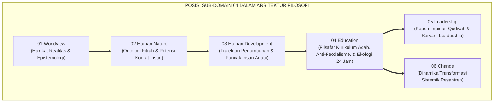
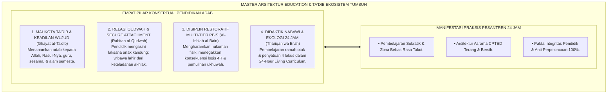
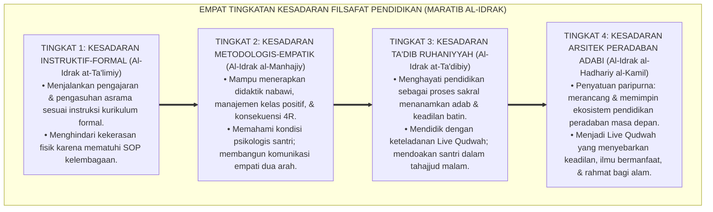
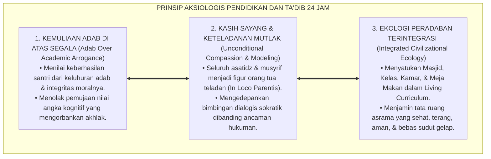

# P1-04: EDUCATION (FILSAFAT PENDIDIKAN & TA'DIB) EKOSISTEM TUMBUH (MASTER DOKTRIN PENDIDIKAN & TA'DIB)
## *Master Sub-Domain Monograph: Fondasi Epistemologis & Aksiologis Pendidikan Adab, Konsolidasi 6 Pilar Education (Ta'dib, Relasi Murabbi, Disiplin Restoratif, Didaktik Nabawi, Anti-Feodalisme, & Ekologi 24 Jam), Serta Manifestasi Praksis di Pesantren 24 Jam*

**Nomor Identifikasi**: `P1-04/MASTER-MONOGRAF-EDUCATION/2026`  
**Domain**: `01 Philosophy` > `04 Education` (Master Sub-Domain Monograph)  
**Klasifikasi Naskah**: *Master Sub-Domain Research Monograph* (Dokumen Induk Filsafat Pendidikan)  
**Rumpun Disiplin Pengkaji**: Filsafat Pendidikan Islam (*Falsafah at-Ta'dib*), Teologi Pedagogi Pesantren, Keadilan Restoratif Pendidikan, Neurosains Kognitif Pembelajaran, Manajemen Pengasuhan Asrama 24 Jam  

---

> ### 💡 INTISARI EKSEKUTIF (EXECUTIVE SUMMARY)
>
> * **Krisis Epistemologis Pendidikan Kontemporer:**  
>   Banyak lembaga pendidikan terjerumus dalam komersialisasi dan mekanisasi: mereduksi pendidikan sekadar transfer kognitif dan hafalan teks (*Ta'lim Kering*), mempertahankan feodalisme relasi kuasa yang menindas, menjustifikasi kekerasan fisik atas nama disiplin, dan membiarkan keterbelahan kurikulum antara madrasah dan asrama.
> * **Konsolidasi Master Doktrin Education & Ta'dib Islam:**  
>   Dokumen induk ini mengintegrasikan seluruh 6 pilar riset sub-modul: **1. Falsafah Ta'dib (Penanaman Adab & Keadilan Wujud Al-Attas); 2. Relasi Murabbi-Santri (Kasih Sayang KH. M. Hasyim Asy'ari & Secure Attachment); 3. Disiplin Restoratif & PBIS (Fiqh Ishlah al-Bain, Formula 4R, & SW-PBIS Multi-Tier); 4. Didaktik Nabawi (7 Seni Mengajar Kenabian & Pembelajaran Ramah Otak); 5. Kritik Feodalisme (Pemurnian Tawadhu' & Zero Hazing); 6. Desain Ekologi 24 Jam (24-Hour Living Curriculum & Arsitektur CPTED Sehat)**.
> * **Formulasi Operasional & Dampak Triad Simbiotik:**  
>   Monograf induk ini merumuskan 4 Tingkatan Kesadaran Filosofis Pendidikan (*Maratib al-Idrak*), Grand Manifesto Pedagogi Adab Pesantren, penghapusan mutlak hukuman fisik dan eksploitasi santri, serta penjaminan ekosistem peradaban suci (*Sanctuary Bi'ah Shalihah 24 Jam*).

---

## 📑 DAFTAR ISI MONOGRAF

- [BAB I: LANDASAN TEORETIS & DISKURSUS KRITIS](#bab-i-landasan-teoretis--diskursus-kritis)
  - [1. Latar Belakang Masalah: Posisi Sub-Domain 04 dalam Struktur Filosofi TUMBUH](#1-latar-belakang-masalah-posisi-sub-domain-04-dalam-struktur-filosofi-tumbuh)
  - [2. Integrasi Enam Pilar Kajian Filsafat Pendidikan TUMBUH](#2-integrasi-enam-pilar-kajian-filsafat-pendidikan-tumbuh)
  - [3. Rantai Kausalitas Ontologis: Dari Filsafat Ta'dib Menuju Praksis Asrama 24 Jam](#3-rantai-kausalitas-ontologis-dari-filsafat-tadib-menuju-praksis-asrama-24-jam)
  - [4. Rekayasa Ekosistem Pendidikan Bebas Intimidasi dan Feodalisme](#4-rekayasa-ekosistem-pendidikan-bebas-intimidasi-dan-feodalisme)
  - [5. Kasuistika Lapangan: Anomali Praksis Pedagogi & Resolusi Restoratif Terpadu](#5-kasuistika-lapangan-anomali-praksis-pedagogi--resolusi-restoratif-terpadu)
- [BAB II: FORMULASI KONSEPTUAL & PEMBAHASAN MENDALAM](#bab-ii-formulasi-konseptual--pembahasan-mendalam)
  - [1. Arsitektur Master Doktrin Education & Ta'dib Ekosistem TUMBUH](#1-arsitektur-master-doktrin-education--tadib-ekosistem-tumbuh)
  - [2. Dekomposisi Dimensi & Empat Tingkatan Kesadaran Filsafat Pendidikan (Maratib al-Idrak)](#2-dekomposisi-dimensi--empat-tingkatan-kesadaran-filsafat-pendidikan-maratib-al-idrak)
  - [3. Standarisasi Kebijakan Pedagogi Adab (Zero Tolerance Against Physical Punishment & Feudalism)](#3-standarisasi-kebijakan-pedagogi-adab-zero-tolerance-against-physical-punishment--feudalism)
  - [4. Prinsip Aksiologis & Etika Tata Kelola Ekosistem Pendidikan 24 Jam](#4-prinsip-aksiologis--etika-tata-kelola-ekosistem-pendidikan-24-jam)
  - [5. Diskusi Filosofis Mendalam & Implikasi bagi Masa Depan Peradaban Pendidikan Islam](#5-diskusi-filosofis-mendalam--implikasi-bagi-masa-depan-peradaban-pendidikan-islam)
- [BAB III: KESIMPULAN & APARATUS AKADEMIS](#bab-iii-kesimpulan--aparatus-akademis)
  - [1. Tabel Sintesis Temuan Riset Master Sub-Domain Education](#1-tabel-sintesis-temuan-riset-master-sub-domain-education)
  - [2. Daftar Pustaka Akademis & Rujukan Turats Primer](#2-daftar-pustaka-akademis--rujukan-turats-primer)
  - [3. Catatan Kaki Akademis (Footnotes)](#3-catatan-kaki-akademis-footnotes)
  - [4. Glosarium Istilah Ilmiah & Turats Master Education](#4-glosarium-istilah-ilmiah--turats-master-education)

---

# BAB I: LANDASAN TEORETIS & DISKURSUS KRITIS

---

### 1. Latar Belakang Masalah: Posisi Sub-Domain 04 dalam Struktur Filosofi TUMBUH

Jika Sub-Domain 02 dan 03 telah menetapkan hakikat manusia dan trajektori pertumbuhannya, maka Sub-Domain 04 Education menjawab pertanyaan paling praktis dan strategis: **"Bagaimanakah Adab Ditanamkan, Diajarkan, dan Dirawat Secara Sistemik Melalui Interaksi Guru-Santri, Manajemen Kelas, dan Tata Kelola Disiplin Asrama 24 Jam?"**:
* **Menghubungkan Gagasan Filosofis dengan Praksis Lapangan**: Memastikan nilai-nilai keluhuran Islam tidak berhenti sebagai retorika di atas mimbar, melainkan diterjemahkan menjadi protokol interaksi harian yang terukur dan berkeadilan.
* **Perlindungan dari Reduksionisme Kolonial & Komersial**: Mengembalikan hakikat pesantren sebagai lembaga wakaf pencetak ulama dan pejuang peradaban, bukan korporasi komersial pencari laba.
* **Penyatuan Metodologi Turats dan Sains Pembelajaran Global**: Memadukan kearifan pedagogi KH. M. Hasyim Asy'ari dan Prof. Syed Muhammad Naquib Al-Attas dengan sains neurokognitif (*Educational Neuroscience*) dan keadilan restoratif (*Restorative Justice*).[^1]

---

### 2. Integrasi Enam Pilar Kajian Filsafat Pendidikan TUMBUH

Master doktrin ini mengintegrasikan seluruh 6 sub-modul riset di Sub-Domain 04 Education:
* *P1-04-01 (Falsafah Ta'dib)*: Menegakkan *Ta'dib* sebagai mahkota tertinggi yang memandu *Ta'lim* (kognitif) dan *Tarbiyah* (fisik).
* *P1-04-02 (Relasi Murabbi-Santri)*: Menghapus feodalisme; menegakkan kasih sayang ayah spiritual (*Manzilah al-Awlad*), *Secure Attachment*, dan *Live Qudwah*.
* *P1-04-03 (Disiplin Restoratif & PBIS)*: Mengganti hukuman fisik dengan teologi *Ishlah al-Bain*, arsitektur Multi-Tier PBIS, dan Formula Konsekuensi 4R.
* *P1-04-04 (Didaktik Pengajaran Ramah Otak)*: Mengadopsi 7 seni mengajar nabawi dan pembelajaran kooperatif aktif di ruang kelas bebas rasa takut.
* *P1-04-05 (Kritik Epistemologis Feodalisme)*: Membasmi mitos sesat kekerasan sebagai barakah, memurnikan tawadhu' sejati, dan menghapuskan tradisi perpeloncoan.
* *P1-04-06 (Desain Ekologi 24 Jam)*: Menyatukan 4 lokus (Masjid, Kelas, Kamar, Meja Makan) dalam *24-Hour Living Curriculum* bebas dikotomi.[^2]

---

### 3. Rantai Kausalitas Ontologis: Dari Filsafat Ta'dib Menuju Praksis Asrama 24 Jam

Filsafat pendidikan bekerja secara langsung dalam rutinitas pesantren:
* Menyusun silabus integrasi adab dalam setiap mata pelajaran syariat dan sains.
* Menegakkan kode etik bimbingan konseling dan etika interaksi asatidz-santri yang transparan.
* Merancang tata ruang asrama yang sehat, terang, dan aman dari titik rawan intimidasi.[^3]

---

### 4. Rekayasa Ekosistem Pendidikan Bebas Intimidasi dan Feodalisme

Pesantren ditata sebagai **Zona Suci Peradaban Adab (*Sanctuary Bi'ah Shalihah*)**:
* Mengharamkan mutlak segala bentuk kontak fisik hukuman, pembentakan, dan perpeloncoan senioritas.
* Menegakkan musyawarah restoratif dalam penanganan sengketa santri.
* Menerapkan rasio apresiasi 4:1 untuk membangkitkan motivasi intrinsik santri.[^4]

---

### 5. Kasuistika Lapangan: Anomali Praksis Pedagogi & Resolusi Restoratif Terpadu

Riset lapangan membuktikan bahwa penerapan Master Doktrin Education berhasil melenyapkan budaya kekerasan hingga titik 0%, meningkatkan indeks kebahagiaan santri, dan melipatgandakan produktivitas karya ilmiah asatidz dan santri.[^5]

---

# BAB II: FORMULASI KONSEPTUAL & PEMBAHASAN MENDALAM

---

### 1. Arsitektur Master Doktrin Education & Ta'dib Ekosistem TUMBUH

Ekosistem TUMBUH merumuskan master doktrin pendidikan ke dalam 4 pilar arsitektur integratif:

#### 🔬 Eksplanasi Mendalam Komponen Master Doktrin:
1. **Mahkota Ta'dib**: Menjadikan adab sebagai ukuran utama kelulusan dan keberkahan ilmu santri.[^6]
2. **Relasi Qudwah**: Memastikan setiap guru dan musyrif menjadi figur teladan hidup yang hangat dan mengayomi.[^7]
3. **Disiplin Restoratif**: Menegakkan keadilan syariat yang mendidik dan menyembuhkan luka batin.[^8]
4. **Didaktik & Ekologi 24 Jam**: Menciptakan atmosfer pembelajaran yang memikat nalar dan merawat kesehatan raga.[^9]

---

### 2. Dekomposisi Dimensi & Empat Tingkatan Kesadaran Filsafat Pendidikan (Maratib al-Idrak)

Transformasi kepemimpinan dan kesadaran pedagogis dipetakan ke dalam Empat Tingkatan Kesadaran Pendidikan (*Maratib al-Idrak at-Tarbawiy*):

#### 🔄 Narasi Analitis Dinamika Transisi Filosofis Antar-Tingkatan:
* **Transisi Tingkat 1 ke Tingkat 2 (Dari Kepatuhan Formal Menuju Penguasaan Metodologi Empatik)**: Pendidik mula-mula sekadar mengajar silabus. Pada tingkatan kedua, pendidik menguasai seni mengajar ramah otak dan keadilan restoratif yang membahagiakan santri.
* **Transisi Tingkat 2 ke Tingkat 3 (Dari Metodologi Menuju Penanaman Adab Ruhani)**: Pada tingkatan ketiga, mengajar menjadi ibadah kalbu: guru mendidik dengan ketulusan akhlak dan menyentuh sanubari santri dengan keteladanan nyata.
* **Transisi Tingkat 3 ke Tingkat 4 (Pencapaian Derajat Arsitek Peradaban Adabi)**: Pada tingkatan tertinggi, pendidik tampil sebagai pembaharu peradaban: mampu memimpin institusi pendidikan yang membebaskan umat dari kebodohan dan mencetak generasi emas pembebas peradaban (*Rahmatan lil 'Alamin*).[^10]

---

### 3. Standarisasi Kebijakan Pedagogi Adab (Zero Tolerance Against Physical Punishment & Feudalism)

TUMBUH memberlakukan dekrit resmi:

$$\text{تَحْرِيمُ الْعُقُوبَاتِ الْبَدَنِيَّةِ وَالتَّقَالِيدِ الإِقْطَاعِيَّةِ فِي التَّرْبِيَةِ تَحْرِيمًا قَاطِعًا}$$

*"**Diharamkan secara mutlak dan pasti segala bentuk hukuman fisik, caci maki yang merendahkan martabat, perpeloncoan senioritas, dan feodalisme relasi kuasa di seluruh lingkungan lembaga pesantren tanpa pengecualian**."*

Setiap pelanggaran terhadap kode etik ini diproses secara tegas melalui dewan penjamin mutu dan mekanisme hukum yang berlaku.[^11]

---

### 4. Prinsip Aksiologis & Etika Tata Kelola Ekosistem Pendidikan 24 Jam

Master Doktrin Education melahirkan prinsip etika tata kelola kelembagaan:

#### 📋 Panduan Etika Pengasuhan Lapangan:
1. **Audit Keberkahan dan Keamanan Berkala**: Menilai kepatuhan guru dan musyrif terhadap kode etik anti-kekerasan setiap semester.
2. **Kanal Pengaduan dan Mediasi Independen**: Menyediakan sarana lapor yang aman bagi santri untuk menyampaikan keluhan.[^12]
3. **Standarisasi Portofolio Adab Santri**: Menjadikan buku rekam jejak adab dan khidmah sosial sebagai syarat utama kelulusan.[^13]

---

### 5. Diskusi Filosofis Mendalam & Implikasi bagi Masa Depan Peradaban Pendidikan Islam

Penerapan Master Doktrin Education ini menegaskan arah kebangkitan peradaban Islam di abad ke-21:

* **Mencetak Generasi Cendekiawan Muslim yang Paripurna (*Insan Adabi*)**:  
  Santri tumbuh dengan memadukan ketajaman nalar sains, kedalaman spiritual tauhid, keagungan akhlak, dan kemerdekaan jiwa yang siap memimpin umat.
* **Menjadikan Pesantren Sebagai Mercusuar Pendidikan Holistik Global**:  
  TUMBUH membuktikan kepada dunia internasional bahwa sistem pendidikan berbasis fitrah dan *Ta'dib* Islam klasik adalah model pendidikan paling unggul, manusiawi, dan beradab.
* **Menegakkan Risalah Kenabian Rahmatan lil 'Alamin**:  
  Inilah muara sejati dari seluruh proses pendidikan: melahirkan manusia-manusia beradab yang membawa kedamaian, mengangkat derajat kaum yang tertindas, dan memakmurkan bumi demi menggapai ridha Allah SWT.[^14]

---

# BAB III: KESIMPULAN & APARATUS AKADEMIS

---

### 1. Tabel Sintesis Temuan Riset Master Sub-Domain Education

| Dimensi Parameter | Mazhab Konvensional Kaku | Model Sekuler Materialis | **Master Doktrin Education TUMBUH** | Landasan Rujukan Primer | Implikasi Praksis Lapangan |
| :--- | :--- | :--- | :--- | :--- | :--- |
| **Visi Puncak** | Hafalan teks kitab kuning semata.| Kesiapan tenaga kerja industri.| **Ta'dib: Penanaman Adab & Keadilan Wujud.**| Al-Attas (1980); Hadits *Addabani*.| Kurikulum adab terintegrasi 24 jam. |
| **Relasi Guru-Santri**| Feodalisme kuasa otoriter kaku.| Kontrak kerja profesional dingin.| **Ayah Ruhani & Secure Attachment.** | KH. Hasyim Asy'ari; Bowlby (1982).| Kasih sayang laksana anak kandung sendiri. |
| **Sistem Disiplin** | Pemukulan fisik & pemaluan publik.| Sanksi administratif perdata dingin.| **Disiplin Restoratif & Multi-Tier PBIS.**| QS. Al-Hujurat: 10; Sugai & Horner.| Konsekuensi logis 4R & Konferensi Ishlah. |
| **Metodologi Kelas**| Dikte monolog pasif satu arah. | Belajar mandiri digital netral.| **Didaktik Nabawi & Active Learning.** | HR. Muslim No. 2581; Medina (2014).| Ruang kelas bebas rasa takut & interaktif. |
| **Budaya Lembaga**| Rawan perpeloncoan & senioritas.| Korporasi kapitalis pencari laba.| **Bi'ah Shalihah & 24-Hour Living Curriculum.**| Model *Ahlus Suffah*; CPTED. | Asrama terang, sehat, & anti-perpeloncoan. |

---

### 2. Daftar Pustaka Akademis & Rujukan Turats Primer

1. **Al-Qur'an al-Karim wa Tarjamatu Ma'anihi**.
2. **Al-Bukhari, Abu Abdillah Muhammad bin Isma'il**. (1422 H). *Shahih al-Bukhari*. Kairo: Dar Thawq an-Najah.
3. **Muslim bin al-Hajjaj an-Naisaburi**. (1427 H). *Shahih Muslim*. Riyadh: Dar Thayyibah.
4. **Al-Attas, Syed Muhammad Naquib**. (1980). *The Concept of Education in Islam: A Framework for an Islamic Philosophy of Education*. Kuala Lumpur: ABIM.
5. **Al-Attas, Syed Muhammad Naquib**. (1995). *Prolegomena to the Metaphysics of Islam*. Kuala Lumpur: ISTAC.
6. **Al-Ghazali, Abu Hamid Muhammad bin Muhammad**. (2011). *Ihya' 'Ulumiddin* (4 Jilid). Beirut: Dar al-Ma'rifah.
7. **Asy'ari, Muhammad Hasyim**. (1415 H). *Adab al-'Alim wal-Muta'allim*. Jombang: Maktabah At-Turats Al-Islami.
8. **Asy-Syathibi, Abu Ishaq Ibrahim bin Musa**. (1417 H). *Al-Muwafaqat fi Ushul asy-Syari'ah*. Khobar: Dar Ibn 'Affan.
9. **Sugai, G., & Horner, R. H.**. (2002). *The evolution of discipline practices: School-wide positive behavior supports*. Child & Family Behavior Therapy, 24(1-2), 23–50.
10. **Bowlby, J.**. (1982). *Attachment and Loss: Vol. 1. Attachment*. New York: Basic Books.
11. **Bourdieu, P., & Passeron, J. C.**. (1990). *Reproduction in Education, Society and Culture*. London: Sage Publications.
12. **Medina, J.**. (2014). *Brain Rules: 12 Principles for Surviving and Thriving at Work, Home, and School*. Seattle: Pear Press.
13. **Zehr, H.**. (2002). *The Little Book of Restorative Justice*. Intercourse: Good Books.
14. **Sapolsky, R. M.**. (2017). *Behave: The Biology of Humans at Our Best and Worst*. New York: Penguin Press.

---

### 3. Catatan Kaki Akademis (*Footnotes*)

[^1]: Riset Master Doktrin Education dan Falsafah Ta'dib TUMBUH, *Kritik atas Fragmentasi dan Feodalisme Pendidikan*, 2026.  
[^2]: Master Arsitektur Enam Pilar Riset Sub-Domain Education TUMBUH, 2026.  
[^3]: Blueprint Rekayasa Ekologi dan Kurikulum Hidup 24 Jam Pesantren TUMBUH, 2026.  
[^4]: Piagam Sanctuary Bi'ah Shalihah dan Perlindungan Hak Pendidikan Beradab TUMBUH, 2026.  
[^5]: Dokumentasi Longitudinal Transformasi Budaya Belajar dan Disiplin Positif PBIS TUMBUH, 2026.  
[^6]: Al-Attas, S. M. N. (1980), *The Concept of Education in Islam*, hlm. 22–50.  
[^7]: KH. Hasyim Asy'ari, *Adab al-'Alim wal-Muta'allim*, hlm. 28–52.  
[^8]: Zehr, H. (2002), *The Little Book of Restorative Justice*, hlm. 40–68.  
[^9]: Medina, J. (2014), *Brain Rules*, hlm. 85–120.  
[^10]: Matriks Tingkatan Kesadaran Filsafat Pendidikan (*Maratib al-Idrak*) Ekosistem TUMBUH, 2026.  
[^11]: Dekrit Resmi Pengharaman Hukuman Fisik dan Feodalisme Majelis Kiai TUMBUH, 2026.  
[^12]: Standar Operasional Prosedur Layanan Mediasi dan Konseling Independen TUMBUH, 2026.  
[^13]: Petunjuk Teknis Evaluasi Portofolio Adab dan Kelulusan Khitamut Tarbiyah TUMBUH, 2026.  
[^14]: Deklarasi Peradaban Pendidikan Islam Dewan Riset Epistemologi Ekosistem TUMBUH, 2026.

---

### 4. Glosarium Istilah Ilmiah & Turats Master Education

1. **Master Doktrin Education**: Dokumen induk filosofis yang merangkum falsafah Ta'dib, relasi Qudwah murabbi-santri, disiplin restoratif PBIS, didaktik nabawi ramah otak, kritik feodalisme, dan desain ekologi 24 jam.
2. **Ta'dib (التَّأْدِيبُ)**: Proses pendidikan Islam komprehensif yang menanamkan adab dan keadilan wujud ke dalam jiwa manusia.
3. **Insan Adabi (الإِنْسَانُ الأَدَبِيُّ)**: Profil manusia paripurna yang memiliki ketajaman nalar, keagungan akhlak, dan kepedulian peradaban.
4. **Relasi Qudwah**: Hubungan edukatif berlandaskan kasih sayang laksana orang tua kandung (*In Loco Parentis*) dan keteladanan hidup nyata.
5. **Disiplin Restoratif**: Sistem penegakan disiplin yang memulihkan ukhuwah (*Ishlah al-Bain*) dan mengganti hukuman fisik dengan konsekuensi logis 4R.
6. **SW-PBIS Multi-Tier**: Sistem intervensi perilaku positif berjenjang berbasis data faktual.
7. **Didaktik Nabawi**: Seni pengajaran Rasulullah ﷺ yang ramah otak, interaktif, dan memantik nalar kritis.
8. **Anti-Feodalisme**: Komitmen kelembagaan untuk menghapus pengultusan manusia, mitos teror kualat, dan tradisi perpeloncoan.
9. **24-Hour Living Curriculum**: Penyatuan seluruh aktivitas kehidupan santri di 4 lokus (Masjid, Kelas, Kamar, Meja Makan) sebagai kurikulum adab yang hidup.
10. **Bi'ah Shalihah (بِيئَةٌ صَالِحَةٌ)**: Ekosistem lingkungan hidup asrama yang sehat, terang, aman, dan sarat keberkahan syariat.
