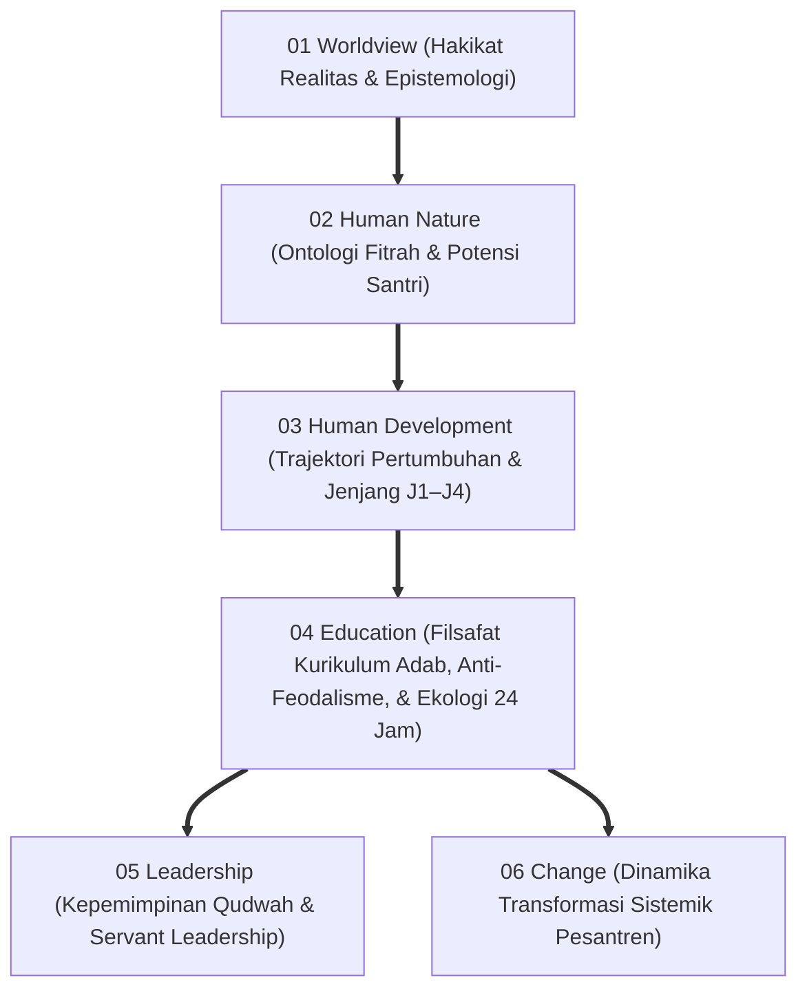
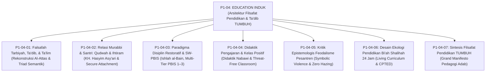
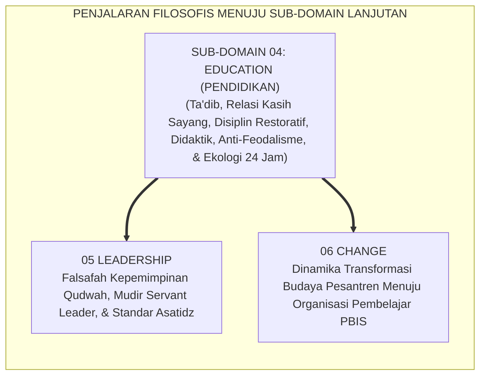

# P1-04: EDUCATION (FILSAFAT PENDIDIKAN & TA'DIB) EKOSISTEM TUMBUH
## *Monograf Induk Sub-Domain 04: Fondasi Epistemologis & Aksiologis Pendidikan Adab, Rekapitulasi 6 Pilar Education (Ta'dib, Relasi Murabbi, Disiplin Restoratif, Didaktik Ramah Otak, Kritik Feodalisme, & Ekologi 24 Jam), Matriks Kurikulum 24 Jam, & Piagam Kelembagaan Pedagogi Adab Pesantren*

**Nomor Identifikasi**: `P1-04/MONOGRAF-INDUK-EDUCATION/2026`  
**Domain**: `01 Philosophy` > `04 Education`  
**Klasifikasi Naskah**: *Master Sub-Domain Monograph* (Monograf Induk Sub-Domain Filsafat Pendidikan)  
**Rumpun Disiplin Pengkaji**: Filsafat Pendidikan Islam (*Falsafah at-Ta'dib*), Teologi Pedagogi Pesantren, Keadilan Restoratif Pendidikan, Neurosains Kognitif Pembelajaran, Manajemen Pengasuhan Asrama 24 Jam  

---

> ### 💡 INTISARI PRAKTIS (3 MENIT PAHAM UNTUK ASATIDZ & MUSYRIF)
>
> * **Posisi Sub-Domain 04 Education:**  
>   Menjawab pertanyaan mendasar ketiga dalam pendidikan: *"Bagaimanakah adab ditanamkan, diajarkan, dan dirawat secara sistemik melalui interaksi guru-santri, manajemen kelas, dan tata kelola disiplin asrama 24 jam?"*
> * **Enam Pilar Filsafat Pendidikan yang Terintegrasi 100%:**  
>   1. **P1-04-01 (Falsafah Ta'dib):** Menegakkan *Ta'dib* (penanaman adab keadilan wujud Al-Attas) sebagai mahkota tertinggi yang membawahi *Ta'lim* (kognitif) dan *Tarbiyah* (fisik).  
>   2. **P1-04-02 (Relasi Murabbi-Santri):** Menghapus feodalisme relasi kuasa; menegakkan ikatan kasih sayang ayah spiritual (*Manzilah al-Awlad* KH. Hasyim Asy'ari), *Secure Attachment* John Bowlby, dan kepemimpinan melayani (*Sayyidul Qawmi Khadimuhum*).  
>   3. **P1-04-03 (Disiplin Restoratif & PBIS):** Mengganti siksaan fisik dan denda uang dengan teologi pemulihan ukhuwah (*Ishlah al-Bain*), arsitektur Multi-Tier PBIS (Tier 1–3), dan syarat baku Konsekuensi Logis 4R.  
>   4. **P1-04-04 (Didaktik Pengajaran Ramah Otak):** Mengadopsi 7 seni mengajar Rasulullah SAW (analogi, visualisasi, dialog sokratik) dan pembelajaran kooperatif aktif (Kagan Structures) di kelas bebas rasa takut.  
>   5. **P1-04-05 (Kritik Epistemologis Feodalisme):** Membasmi mitos sesat kekerasan sebagai barakah, memurnikan tawadhu' sejati, dan menghapuskan tradisi pelonco senioritas (*Zero Hazing*).  
>   6. **P1-04-06 (Desain Ekologi 24 Jam):** Menyatukan 4 lokus (Masjid, Kelas, Kamar, Meja Makan) dalam Living Curriculum terpadu bebas dikotomi madrasah-asrama.
> * **Komitmen Kelembagaan Zero Tolerance:**  
>   Segala bentuk pemukulan fisik, pembentakan kasar, perpeloncoan feodal, pelecehan martabat di depan umum, dan komersialisasi denda finansial dinyatakan **HARAM DAN DILARANG KERAS** di seluruh jaringan pesantren TUMBUH.

---

## 📑 DAFTAR ISI MONOGRAF INDUK

- [BAGIAN I: ARSITEKTUR ONTOLOGIS & POHON HUBUNGAN SUB-DOMAIN 04](#bagian-i-arsitektur-ontologis--pohon-hubungan-sub-domain-04)
  - [1. Posisi Dokumen dalam Taksonomi 11 Domain TUMBUH](#1-posisi-dokumen-dalam-taksonomi-11-domain-tumbuh)
  - [2. Pohon Hubungan Antar-Monograf Sub-Domain 04 Education](#2-pohon-hubungan-antar-monograf-sub-domain-04-education)
  - [3. Rangkuman 6 Pilar Filsafat Pendidikan & Ta'dib Ekosistem TUMBUH](#3-rangkuman-6-pilar-filsafat-pendidikan--tadib-ekosistem-tumbuh)
  - [4. Matriks Komitmen Perlindungan Hak Pendidikan Beradab (Zero Tolerance Policy 100%)](#4-matriks-komitmen-perlindungan-hak-pendidikan-beradab-zero-tolerance-policy-100)
- [BAGIAN II: KODIFIKASI MATRIKS RESMI & DIREKTORI MONOGRAF TERPADU](#bagian-ii-kodifikasi-matriks-resmi--direktori-monograf-terpadu)
  - [1. Matriks Rujukan Lengkap 7 Berkas Monograf Sub-Domain 04](#1-matriks-rujukan-lengkap-7-berkas-monograf-sub-domain-04)
  - [2. Alur Penjalaran Filosofis Menuju 2 Sub-Domain Lanjutan (P1-05 s/d P1-06)](#2-alur-penjalaran-filosofis-menuju-2-sub-domain-lanjutan-p1-05-sd-p1-06)
- [BAGIAN III: APARATUS AKADEMIS & APENDIKS](#bagian-iii-aparatus-akademis--apendiks)
  - [1. Daftar Pustaka Otoritatif Turats & Sains Global](#1-daftar-pustaka-otoritatif-turats--sains-global)
  - [2. Catatan Kaki Akademis (Footnotes)](#2-catatan-kaki-akademis-footnotes)
  - [3. Glosarium Istilah Kunci Filsafat Pendidikan Induk](#3-glosarium-istilah-kunci-filsafat-pendidikan-induk)

---

# BAGIAN I: ARSITEKTUR ONTOLOGIS & POHON HUBUNGAN SUB-DOMAIN 04

---

### 1. Posisi Dokumen dalam Taksonomi 11 Domain TUMBUH

---

### 2. Pohon Hubungan Antar-Monograf Sub-Domain 04 Education

Sub-Domain `04 Education` memuat 1 Monograf Induk dan 7 Monograf Riset Khusus yang saling menopang secara utuh:

---

### 3. Rangkuman 6 Pilar Filsafat Pendidikan & Ta'dib Ekosistem TUMBUH

1. **Pilar 1: Falsafah Ta'dib & Keadilan Wujud (P1-04-01)**:  
   Menegakkan *Ta'dib* sebagai hakikat sejati pendidikan Islam yang memadukan ilmu, pengajaran (*Ta'lim*), dan pengasuhan fisik (*Tarbiyah*). Adab adalah pengenalan posisi wujud yang menuntun santri bersikap adil kepada Allah, guru, sesama manusia, dan alam semesta.
2. **Pilar 2: Relasi Qudwah & Kelekatan Aman (P1-04-02)**:  
   Memadukan wasiat Hadhratusy Syaikh KH. M. Hasyim Asy'ari (*Adab al-'Alim wal Muta'allim*) dengan teori *Secure Attachment* John Bowlby. Guru memposisikan diri sebagai ayah spiritual (*In Loco Parentis*) yang memimpin dengan melayani (*Sayyidul Qawmi Khadimuhum*), menghapus mutlak feodalisme relasi kuasa.
3. **Pilar 3: Disiplin Restoratif & Multi-Tier PBIS (P1-04-03)**:  
   Menegakkan teologi perdamaian *Ishlah al-Bain* (QS. Al-Hujurat: 10) dan arsitektur *SW-PBIS Multi-Tier* (Tier 1 Universal, Tier 2 Targeted, Tier 3 Intensive). Menghapus hukuman fisik dan denda uang, menggantinya dengan dialog 5 pertanyaan restoratif dan formula Konsekuensi Logis 4R (*Related, Respectful, Reasonable, Restorative*).
4. **Pilar 4: Didaktik Nabawi & Kelas Ramah Otak (P1-04-04)**:  
   Menghidupkan 7 seni mengajar Rasulullah SAW (analogi *amtsal*, visualisasi sketsa grafis, dialog sokratik) dan struktur pembelajaran kooperatif aktif (*Kagan Structures*). Menjadikan ruang kelas sebagai zona bebas rasa takut (*Threat-Free Learning Environment*).
5. **Pilar 5: Kritik Epistemologis Feodalisme (P1-04-05)**:  
   Membongkar kekerasan simbolik (*Symbolic Violence Pierre Bourdieu*) dan mitos sesat kekerasan sebagai barakah. Memurnikan konsep tawadhu' autentik, menegakkan egalitarianisme Islam, dan mengharamkan total tradisi perpeloncoan senioritas (*Zero Hazing*).
6. **Pilar 6: Desain Ekologi Living Curriculum 24 Jam (P1-04-06)**:  
   Mengintegrasikan 4 lokus adab (Masjid, Kelas, Kamar, Meja Makan) ke dalam satu kurikulum hidup 24 jam tanpa dikotomi madrasah-asrama, didukung arsitektur asrama sehat CPTED bebas sudut gelap dan sanitasi 0 CFU.[^1]

---

### 4. Matriks Komitmen Perlindungan Hak Pendidikan Beradab (*Zero Tolerance Policy 100%*)

| Larangan Terhadap Hak Pendidikan | Praktik Konvensional yang Dihapus 100% | Alternatif Beradab dalam Ekosistem TUMBUH |
| :--- | :--- | :--- |
| **1. Feodalisme & Eksploitasi Tenaga** | Menyuruh santri mencuci baju, mobil, atau memijat guru secara paksa. | **Khidmat Sukarela untuk Kemaslahatan Umum**: Guru meneladankan mandiri; santri merawat fasilitas asrama.[^2] |
| **2. Hukuman Fisik & Teror Emosi** | Menampar, memukul dengan kayu, menyiram air malam hari, mencukur botak paksa. | **Disiplin Restoratif Firm & Kind**: Dialog pemulihan ukhuwah (*Ishlah*) dan Konsekuensi Logis 4R.[^3] |
| **3. Denda Finansial Pelanggaran** | Menarik denda uang ratusan ribu bagi santri yang melanggar tata tertib. | **Restitusi Karya & Tanggung Jawab Nyata**: Memperbaiki fasilitas yang rusak dan khidmat sosial asrama. |
| **4. Kultur Kelas Intimidatif** | Membentak santri yang salah menjawab; melempar penghapus papan tulis. | **Didaktik Nabawi Ramah Otak**: Merayakan kesalahan sebagai bahan belajar (*Teachable Moments*).[^4] |
| **5. Pengusiran / Drop-Out Sepihak** | Langsung mengeluarkan santri bermasalah tanpa ikhtiar pembinaan intensif. | **Protokol Rehabilitasi Tier 3 PBIS 90 Hari**: Konseling mendalam terpadu bersama tim ahli & keluarga. |

---

# BAGIAN II: KODIFIKASI MATRIKS RESMI & DIREKTORI MONOGRAF TERPADU

---

### 1. Matriks Rujukan Lengkap 7 Berkas Monograf Sub-Domain 04

| Kode Berkas | Judul Naskah Monograf | Dewan Keilmuan Pengkaji | Tautan Berkas Markdown |
| :---: | :--- | :--- | :---: |
| **P1-04-01** | **Falsafah Tarbiyah, Ta'dib, dan Ta'lim** | `pakar-filosofi-tumbuh` `pakar-epistemologi-turats` `pakar-desain-kurikulum-adab` | [**`Buka Naskah P1-04-01`**](./P1-04-01-Falsafah-Tarbiyah-Tadib-Talim.md) |
| **P1-04-02** | **Relasi Murabbi dan Santri: Qudwah & Ihtiram** | `pakar-pedagogi-master-guru` `pakar-filosofi-tumbuh` `pakar-tata-kelola-qudwah` | [**`Buka Naskah P1-04-02`**](./P1-04-02-Relasi-Murabbi-dan-Santri.md) |
| **P1-04-03** | **Paradigma Disiplin Restoratif dan PBIS** | `pakar-arsitektur-pbis-restoratif` `pakar-disiplin-positif` `pakar-kuratif-restoratif` | [**`Buka Naskah P1-04-03`**](./P1-04-03-Paradigma-Disiplin-Restoratif-dan-PBIS.md) |
| **P1-04-04** | **Didaktik Pengajaran dan Manajemen Kelas Positif** | `pakar-pedagogi-master-guru` `pakar-psikologi-belajar` `pakar-neurosains-perkembangan` | [**`Buka Naskah P1-04-04`**](./P1-04-04-Didaktik-Pengajaran-dan-Manajemen-Kelas-Positif.md) |
| **P1-04-05** | **Kritik Epistemologis Feodalisme & Kekerasan** | `pakar-filosofi-tumbuh` `pakar-psikologi-sosial-santri` `pakar-perlindungan-anak-dan-advokasi-santri` | [**`Buka Naskah P1-04-05`**](./P1-04-05-Kritik-Epistemologis-Feodalisme-dan-Kekerasan-Pesantren.md) |
| **P1-04-06** | **Desain Ekologi Pendidikan Bi'ah Shalihah 24 Jam** | `pakar-pengasuhan-asrama` `pakar-arsitektur-digital-pesantren` `pakar-intervensi-preventif` | [**`Buka Naskah P1-04-06`**](./P1-04-06-Desain-Ekologi-Pendidikan-Biah-Shalihah-24-Jam.md) |
| **P1-04-07** | **Sintesis Filsafat Pendidikan TUMBUH** | `pakar-filosofi-tumbuh` `pakar-metodologi-riset-tumbuh` `pakar-tata-kelola-qudwah` | [**`Buka Naskah P1-04-07`**](./P1-04-07-Sintesis-Filsafat-Pendidikan-TUMBUH.md) |

---

### 2. Alur Penjalaran Filosofis Menuju 2 Sub-Domain Lanjutan (P1-05 s/d P1-06)

---

# BAGIAN III: APARATUS AKADEMIS & APENDIKS

---

### 1. Daftar Pustaka Otoritatif Turats & Sains Global

1. **Al-Qur'an al-Karim wa Tarjamatu Ma'anih**.
2. **Al-Bukhari, Muhammad bin Isma'il**. (1422 H). *Shahih al-Bukhari*. Beirut: Dar Thawq an-Najah.
3. **Muslim bin al-Hajjaj an-Naisaburi**. (1374 H). *Shahih Muslim*. Kairo: Isa al-Babi al-Halabi.
4. **Al-Attas, Syed Muhammad Naquib**. (1980). *The Concept of Education in Islam*. Kuala Lumpur: ABIM.
5. **Asy'ari, Muhammad Hasyim**. (1415 H). *Adab al-'Alim wal Muta'allim*. Jombang: Maktabah at-Turats al-Islami.
6. **Abu Ghuddah, Abdul Fattah**. (1996). *Ar-Rasul al-Mu'allim wa Asalibuhu fit-Ta'lim*. Beirut: Dar al-Basyair al-Islamiyyah.
7. **Bourdieu, P.**. (1991). *Language and Symbolic Power*. Cambridge: Harvard University Press.
8. **Bronfenbrenner, U.**. (1979). *The Ecology of Human Development*. Harvard University Press.
9. **Bowlby, J.**. (1988). *A Secure Base: Parent-Child Attachment and Healthy Human Development*. New York: Basic Books.
10. **Sugai, G., & Horner, R. H.**. (2002). *The evolution of discipline practices: School-wide positive behavior supports*. Child & Family Behavior Therapy, 24(1-2), 23–50.

---

### 2. Catatan Kaki Akademis (*Footnotes*)

[^1]: Al-Attas, *The Concept of Education in Islam*, hlm. 21–25.  
[^2]: Hasyim Asy'ari, *Adab al-'Alim wal Muta'allim*, hlm. 24–28.  
[^3]: Zehr, H. (2002), *The Little Book of Restorative Justice*, Good Books.  
[^4]: Caine & Caine (1991), *Making Connections: Teaching and the Human Brain*, ASCD.

---

### 3. Glosarium Istilah Kunci Filsafat Pendidikan Induk

1. **Ta'dib**: Inti hakiki pendidikan Islam yang berfokus pada penanaman adab keadilan wujud ke dalam totalitas jiwa insan pembelajar.
2. **Insan Adabi**: Sosok manusia beradab hasil didikan ta'dib yang bertindak proporsional dan adil kepada Allah, sesama makhluk, dan dirinya sendiri.
3. **Manzilah al-Awlad**: Kaidah adab guru KH. Hasyim Asy'ari yang memperlakukan santri laksana anak kandung dalam kasih sayang dan perlindungan.
4. **Living Curriculum 24 Jam**: Paradigma kurikulum yang mengintegrasikan seluruh rutinitas kehidupan santri selama 24 jam sebagai medan pembelajaran karakter terpadu.
5. **Zero Hazing**: Larangan mutlak segala bentuk perpeloncoan, kekerasan, atau sidang malam kamar gelap dalam kehidupan asrama.
6. **CPTED (Crime Prevention Through Environmental Design)**: Rekayasa tata ruang arsitektur gedung untuk mencegah kekerasan dan perundungan melalui pencahayaan dan visibilitas optimal.
7. **Ishlah al-Bain**: Rekonsiliasi perdamaian berkeadilan antarsesama muslim yang berselisih demi menjaga kesucian ukhuwah.
8. **SW-PBIS Multi-Tier**: Arsitektur sistem intervensi perilaku positif berjenjang 3 tingkat (Tier 1 Universal, Tier 2 Targeted, Tier 3 Intensive).
9. **Brain-Friendly Pedagogy**: Pendekatan didaktik yang mengoptimalkan daya serap nalar otak dengan menciptakan suasana kelas yang rileks dan bebas ancaman.
10. **Triad Pertumbuhan Simbiotik**: Maha-prinsip di mana sistem secara serempak menumbuhkan Santri, memuliakan Pendidik, dan memperkokoh Lembaga.
