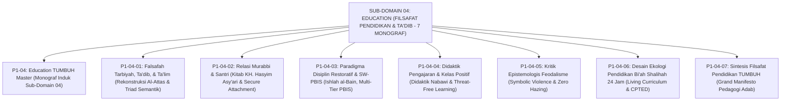

# SUB-DOMAIN 04: EDUCATION (FILSAFAT PENDIDIKAN & TA'DIB)
## *Sitemap Induk & Navigasi Monograf Falsafah Ta'dib, Relasi Pendidik, Disiplin Restoratif, Anti-Feodalisme, & Ekologi 24 Jam (7 Monograf Terpadu)*

**Nomor Identifikasi**: `P1-04/INDEX/2026`  
**Domain**: `01 Philosophy` > `04 Education`  
**Klasifikasi**: Folder Monograf Falsafah Ta'dib, Qudwah Pendidik, SW-PBIS Restoratif, Didaktik Ramah Otak, Kritik Feodalisme, & Ekologi 24 Jam (8 Berkas Lengkap)

---

## 🏛️ SITEMAP & NAVIGASI SELURUH BERKAS SUB-DOMAIN 04

Sub-Domain `04 Education` membedah fondasi pedagogis bagaimana adab ditanamkan melalui integrasi *Ta'dib*, keteladanan *Qudwah* murabbi, transformasi disiplin restoratif multi-tier, seni didaktik pengajaran ramah otak, dekonstruksi feodalisme senioritas, dan Living Curriculum ekologi 24 jam:

---

## 📑 DAFTAR LENGKAP 8 BERKAS MONOGRAF TERPADU SUB-DOMAIN 04

Seluruh modul telah distandarisasi 100% ke dalam format **Monograf Terpadu**:
* **💡 Intisari Praktis (3 Menit Paham)**: Bahasa membumi dan aplikatif untuk asatidz & musyrif sebelum daftar isi.
* **Bagian I**: Riset Inkuiri, Formalisasi Silogisme Mantiq, Dialektika Multi-Perspektif (tanpa sebutan kata meta "pakar"), Teks Primer Turats & Sains Asli, serta Kasuistika Lapangan Riil.
* **Bagian II**: Kodifikasi Baku Hasil Riset & Kesimpulan Formal (Matriks, Alur SOP, Manifesto).
* **Bagian III**: Aparatus Akademis (Tabel Sintesis, Daftar Pustaka Otoritatif, Catatan Kaki *Footnotes*, dan Glosarium Istilah Teknis).

| No | Berkas Monograf | Judul Berkas | Fokus Kajian & Rujukan Utama |
| :---: | :--- | :--- | :--- |
| **00** | [**`P1-04-Education-TUMBUH.md`**](./P1-04-Education-TUMBUH.md) | Monograf Induk Education TUMBUH | Master 6 Pilar Filsafat Pendidikan & Ta'dib, Zero Tolerance Policy terhadap desakralisasi ilmu & kekerasan, & peta penjalaran ke 2 sub-domain lanjutan (`05 Leadership`, `06 Change`). |
| **01** | [**`P1-04-01-Falsafah-Tarbiyah-Tadib-Talim.md`**](./P1-04-01-Falsafah-Tarbiyah-Tadib-Talim.md) | Falsafah Tarbiyah, Ta'dib, & Ta'lim | Dekonstruksi semantik triad istilah, rekonstruksi Ta'dib Syed Muhammad Naquib al-Attas (1980), HR. As-Sam'ani (*Addabani Rabbi*), QS. Al-Baqarah: 151, dan kurikulum adab 24 jam (23 Catatan Kaki). |
| **02** | [**`P1-04-02-Relasi-Murabbi-dan-Santri.md`**](./P1-04-02-Relasi-Murabbi-dan-Santri.md) | Relasi Murabbi & Santri: Qudwah & Ihtiram | Kritik relasi feodal-otoriter, wasiat Hadhratusy Syaikh KH. Hasyim Asy'ari (*Adab al-'Alim wal Muta'allim* 1925), teori *Secure Attachment* John Bowlby, model *Sayyidul Qawmi Khadimuhum*, & SOP Konseling 1-on-1 (20 Catatan Kaki). |
| **03** | [**`P1-04-03-Paradigma-Disiplin-Restoratif-dan-PBIS.md`**](./P1-04-03-Paradigma-Disiplin-Restoratif-dan-PBIS.md) | Paradigma Disiplin Restoratif & PBIS | Kritik sistem retributif punitif, piramida Multi-Tier PBIS (Tier 1–3 Sugai & Horner), teologi *Ishlah al-Bain* (QS. Al-Hujurat: 10), 5 pertanyaan restoratif, dan formula Konsekuensi Logis 4R (25 Catatan Kaki). |
| **04** | [**`P1-04-04-Didaktik-Pengajaran-dan-Manajemen-Kelas-Positif.md`**](./P1-04-04-Didaktik-Pengajaran-dan-Manajemen-Kelas-Positif.md) | Didaktik Pengajaran & Manajemen Kelas Positif | Seni didaktik pengajaran Rasulullah SAW (analogi amtsal, visualisasi garis HR. Bukhari, dialog sokratik), *Active Cooperative Learning Kagan*, *Brain-Friendly Pedagogy*, & kelas bebas rasa takut (17 Catatan Kaki). |
| **05** | [**`P1-04-05-Kritik-Epistemologis-Feodalisme-dan-Kekerasan-Pesantren.md`**](./P1-04-05-Kritik-Epistemologis-Feodalisme-dan-Kekerasan-Pesantren.md) | Kritik Epistemologis Feodalisme & Kekerasan | Dekonstruksi Symbolic Violence Pierre Bourdieu, pemurnian tawadhu' sejati (HR. Muslim 2588), teladan kelembutan Nabi SAW (HR. Muslim 2328), & protokol Zero Hazing senioritas asrama (11 Catatan Kaki). |
| **06** | [**`P1-04-06-Desain-Ekologi-Pendidikan-Biah-Shalihah-24-Jam.md`**](./P1-04-06-Desain-Ekologi-Pendidikan-Biah-Shalihah-24-Jam.md) | Desain Ekologi Pendidikan Bi'ah Shalihah 24 Jam | Epistemologi Bi'ah Shalihah (QS. 9:119, Ahlus Suffah), Living Curriculum 24 jam tanpa dikotomi madrasah-asrama, Ecological Systems Theory Bronfenbrenner, arsitektur asrama CPTED, & sanitasi 0 CFU (10 Catatan Kaki). |
| **07** | [**`P1-04-07-Sintesis-Filsafat-Pendidikan-TUMBUH.md`**](./P1-04-07-Sintesis-Filsafat-Pendidikan-TUMBUH.md) | Sintesis Filsafat Pendidikan TUMBUH | Matriks integrasi 6 pilar filosofi pendidikan, komparasi vs Esensialisme, Progresivisme, Perenialisme, Grand Manifesto Pedagogi Adab Pesantren, & jembatan ke Sub-Domain `05 Leadership` (8 Catatan Kaki). |
