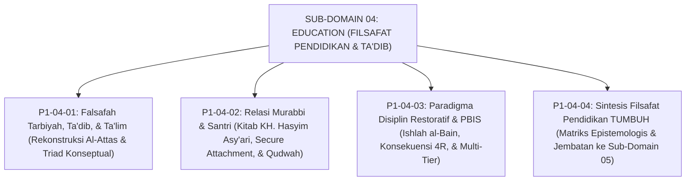

# SUB-DOMAIN 04: EDUCATION (FILSAFAT PENDIDIKAN & TA'DIB)
## *Sitemap Induk & Navigasi Monograf Falsafah Ta'dib, Relasi Pendidik, & Disiplin Restoratif*

**Nomor Identifikasi**: `P1-04/INDEX/2026`  
**Domain**: `01 Philosophy` > `04 Education`  
**Klasifikasi**: Folder Monograf Falsafah Ta'dib, Qudwah Pendidik, & SW-PBIS Restoratif

---

## 🏛️ SITEMAP & NAVIGASI SELURUH BERKAS SUB-DOMAIN 04

Sub-Domain `04 Education` membedah fondasi pedagogis bagaimana adab ditanamkan melalui integrasi ta'dib, keteladanan qudwah murabbi, dan transformasi disiplin restoratif multi-tier:

---

## 📑 DAFTAR BERKAS MODULAR SUB-DOMAIN 04

| No | Berkas Monograf | Judul Berkas | Fokus Kajian & Rujukan Utama |
| :---: | :--- | :--- | :--- |
| **01** | [**`P1-04-01-Falsafah-Tarbiyah-Tadib-Talim.md`**](./P1-04-01-Falsafah-Tarbiyah-Tadib-Talim.md) | Falsafah Tarbiyah, Ta'dib, & Ta'lim | Dekonstruksi semantik triad istilah, rekonstruksi Ta'dib Syed Muhammad Naquib al-Attas (1980), HR. As-Sam'ani (*Addabani Rabbi*), dan kurikulum adab 24 jam. |
| **02** | [**`P1-04-02-Relasi-Murabbi-dan-Santri.md`**](./P1-04-02-Relasi-Murabbi-dan-Santri.md) | Relasi Murabbi & Santri: Qudwah & Ihtiram | Kritik relasi feodal-otoriter, wasiat Hadhratusy Syaikh KH. Hasyim Asy'ari (*Adab al-'Alim wal Muta'allim*), teori *Secure Attachment* John Bowlby, & model *Sayyidul Qawm*. |
| **03** | [**`P1-04-03-Paradigma-Disiplin-Restoratif-dan-PBIS.md`**](./P1-04-03-Paradigma-Disiplin-Restoratif-dan-PBIS.md) | Paradigma Disiplin Restoratif & PBIS | Kritik retributif, piramida Multi-Tier PBIS (Tier 1–3 Sugai & Horner), fiqh *Ishlah al-Bain* (QS. Al-Hujurat: 10), 5 pertanyaan restoratif, dan syarat Konsekuensi 4R. |
| **04** | [**`P1-04-04-Sintesis-Filsafat-Pendidikan-TUMBUH.md`**](./P1-04-04-Sintesis-Filsafat-Pendidikan-TUMBUH.md) | Sintesis Filsafat Pendidikan TUMBUH | Matriks integrasi 3 pilar filosofi pendidikan, manifesto pedagogi adab pesantren, dan jembatan menuju Sub-Domain `05 Leadership`. |
