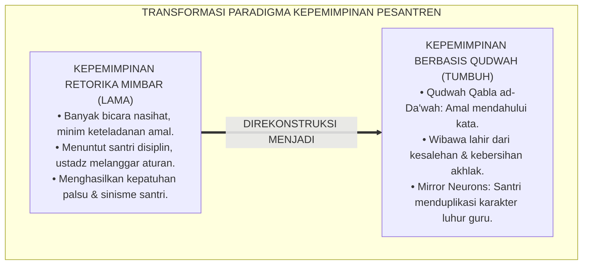
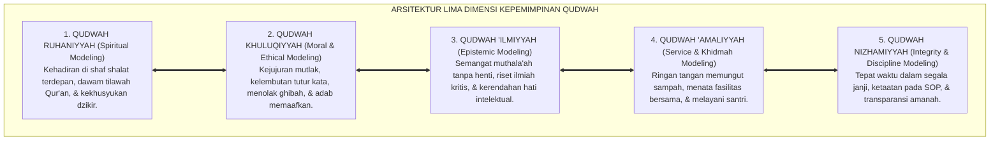
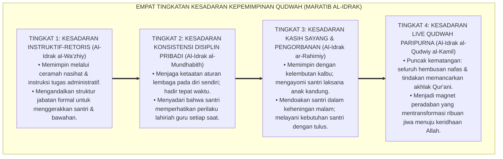
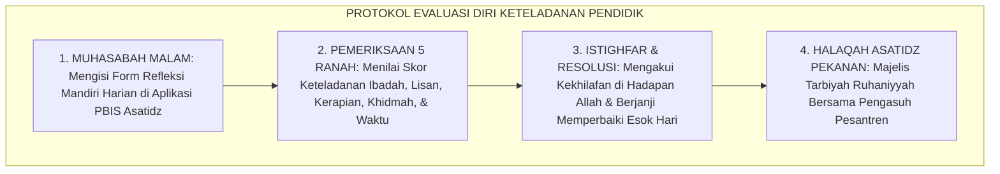

# P1-05-01: FALSAFAH KEPEMIMPINAN BERBASIS QUDWAH (QUDWAH-CENTERED LEADERSHIP)
## *Monograf Riset Akademik: Doktrin Qudwah First dalam Turats Islam (QS. Al-Ahzab: 21 & QS. Ash-Shaff: 2–3), Dekonstruksi Kepemimpinan Retorika (Kabura Maqtan), Konvergensi Mirror Neuron System Giacomo Rizzolatti & Social Learning Theory, Serta Transformasi Keteladanan di Pesantren 24 Jam*

**Nomor Identifikasi**: `P1-05-01/MONOGRAF-RISET-FALSAFAH-QUDWAH/2026`  
**Domain**: `01 Philosophy` > `05 Leadership` (Sub-Modul 01: *Philosophy of Qudwah Leadership*)  
**Klasifikasi Naskah**: *Academic Research Monograph* (Monograf Riset Akademik Fondasional)  
**Rumpun Disiplin Pengkaji**: Filsafat Kepemimpinan Islam (*Imamah & Qudwah*), Fiqh Akhlak Nabawi, Neurosains Kognitif Peniruan Perilaku (*Social Cognitive Neuroscience*), Psikologi Kepemimpinan Pendidikan, Tata Kelola Budaya Pesantren  

---

> ### 💡 INTISARI EKSEKUTIF (EXECUTIVE SUMMARY)
>
> * **Kelemahan Paradigma Lama: Kepemimpinan Retorika Kering (Hypocritical Moral Gap):**  
>   Banyak pemimpin dan pengasuh pesantren mengandalkan instruksi verbal satu arah dan pidato retoris di atas mimbar, namun gerak-gerik pribadinya menyelisihi ucapannya (datang terlambat shalat, merokok di area kantor, atau membentak kasar). Kemunafikan ini memicu kemurkaan Allah (*Kabura Maqtan 'Indallah* - QS. Ash-Shaff: 3) dan menghancurkan wibawa kepemimpinan di hadapan santri.
> * **Inovasi Konseptual: Qudwah Qabla ad-Da'wah & Neurosains Mirror Neurons:**  
>   TUMBUH menegakkan doktrin **Keteladanan Mendahului Instruksi (*Qudwah Qabla ad-Da'wah*)**: santri belajar 90% dari apa yang mereka lihat secara konsisten dari perilaku asatidz. Sains neurobiologi (Rizzolatti) membuktikan aktivasi *Mirror Neuron System* di otak santri yang menyerap dan menduplikasi adab sang guru secara otomatis tanpa perlu banyak kata.
> * **Formulasi Operasional & Pembuktian Lapangan:**  
>   Monograf ini menguraikan matriks 5 ranah keteladanan mutlak pendidik 24 jam, 4 Tingkatan Kesadaran Kepemimpinan Qudwah (*Maratib al-Idrak*), protokol audit mandiri harian (*Daily Qudwah Self-Audit*), dan etika tata kelola kepemimpinan keteladanan.

---

## 📑 DAFTAR ISI MONOGRAF

- [BAB I: LANDASAN TEORETIS & DISKURSUS KRITIS](#bab-i-landasan-teoretis--diskursus-kritis)
  - [1. Latar Belakang Masalah: Krisis Kepemimpinan Retorika dan Jurang Kemunafikan Moral](#1-latar-belakang-masalah-krisis-kepemimpinan-retorika-dan-jurang-kemunafikan-moral)
  - [2. Eksegesis Turats Mandat Keteladanan Kenabian: QS. Al-Ahzab: 21, QS. Ash-Shaff: 2–3, & Akhlak Nabawi](#2-eksegesis-turats-mandat-keteladanan-kenabian-qs-al-ahzab-21-qs-ash-shaff-23--akhlak-nabawi)
  - [3. Konvergensi Neurosains Kognitif: Mirror Neuron System Giacomo Rizzolatti & Social Learning Theory Albert Bandura](#3-konvergensi-neurosains-kognitif-mirror-neuron-system-giacomo-rizzolatti--social-learning-theory-albert-bandura)
  - [4. Dialektika Wibawa Hakiki: Karisma Keteladanan (Haibah al-Qudwah) vs Karisma Otoriter Rasa Takut (Haibah al-Khauf)](#4-dialektika-wibawa-hakiki-karisma-keteladanan-haibah-al-qudwah-vs-karisma-otoriter-rasa-takut-haibah-al-khauf)
  - [5. Kasuistika Lapangan: Kasus Inkonsistensi Disiplin Shalat Ustadz & Resolusi Restoratif Terpadu](#5-kasuistika-lapangan-kasus-inkonsistensi-disiplin-shalat-ustadz--resolusi-restoratif-terpadu)
- [BAB II: FORMULASI KONSEPTUAL & PEMBAHASAN MENDALAM](#bab-ii-formulasi-konseptual--pembahasan-mendalam)
  - [1. Eksplanasi Teoretis Falsafah Kepemimpinan Berbasis Qudwah TUMBUH](#1-eksplanasi-teoretis-falsafah-kepemimpinan-berbasis-qudwah-tumbuh)
  - [2. Dekomposisi Dimensi & Empat Tingkatan Kesadaran Kepemimpinan Qudwah (Maratib al-Idrak)](#2-dekomposisi-dimensi--empat-tingkatan-kesadaran-kepemimpinan-qudwah-maratib-al-idrak)
  - [3. Matriks Lima Ranah Keteladanan Mutlak Musyrif dan Asatidz di Pesantren 24 Jam](#3-matriks-lima-ranah-keteladanan-mutlak-musyrif-dan-asatidz-di-pesantren-24-jam)
  - [4. Protokol Evaluasi Diri Keteladanan Pendidik (Daily Qudwah Self-Audit Protocol)](#4-protokol-evaluasi-diri-keteladanan-pendidik-daily-qudwah-self-audit-protocol)
  - [5. Diskusi Filosofis Mendalam & Implikasi bagi Masa Depan Peradaban Pendidikan Islam](#5-diskusi-filosofis-mendalam--implikasi-bagi-masa-depan-peradaban-pendidikan-islam)
- [BAB III: KESIMPULAN & APARATUS AKADEMIS](#bab-iii-kesimpulan--aparatus-akademis)
  - [1. Tabel Sintesis Temuan Riset Kepemimpinan Qudwah](#1-tabel-sintesis-temuan-riset-kepemimpinan-qudwah)
  - [2. Daftar Pustaka Akademis & Rujukan Turats Primer](#2-daftar-pustaka-akademis--rujukan-turats-primer)
  - [3. Catatan Kaki Akademis (Footnotes)](#3-catatan-kaki-akademis-footnotes)
  - [4. Glosarium Istilah Ilmiah & Turats Kepemimpinan Qudwah](#4-glosarium-istilah-ilmiah--turats-kepemimpinan-qudwah)

---

# BAB I: LANDASAN TEORETIS & DISKURSUS KRITIS

---

### 1. Latar Belakang Masalah: Krisis Kepemimpinan Retorika dan Jurang Kemunafikan Moral

Krisis kepemimpinan pendidikan Islam paling akut berakar pada terjadinya **Jurang Kemunafikan Moral (*Hypocritical Moral Gap*)**:
* **Ketidaksesuaian Kata dan Perbuatan**: Pemimpin berkhotbah tentang pentingnya shalat awal waktu, namun dirinya sendiri kerap masbuq; guru mengajarkan adab lisan, namun membentak santri dengan makian kasar di depan umum.
* **Kehancuran Kepercayaan Santri (*Erosion of Moral Trust*)**: Santri remaja yang sedang mencari jati diri mendeteksi inkonsistensi ini seketika, memicu sinisme batin, hilangnya takzim, dan melahirkan generasi munafik yang hanya patuh saat diawasi mata pengurus.
* **Keniscayaan Doktrin Qudwah First**: Kepemimpinan dalam Islam adalah seni mendahului dalam beramal saleh (*As-Sabqu bil-Khayrat*), bukan sekadar kemahiran merangkai retorika mimbar.[^1]

---

### 2. Eksegesis Turats Mandat Keteladanan Kenabian: QS. Al-Ahzab: 21, QS. Ash-Shaff: 2–3, & Akhlak Nabawi

Al-Qur'an menetapkan Rasulullah ﷺ sebagai teladan mutlak bagi siapa saja yang mengharap ridha Allah dan keselamatan akhirat:

$$\text{لَّقَدْ كَانَ لَكُمْ فِي رَسُولِ اللَّهِ أُسْوَةٌ حَسَنَةٌ لِّمَن كَانَ يَرْجُو اللَّهَ وَالْيَوْمَ الْآخِرَ وَذَكَرَ اللَّهَ كَثِيرًا}$$

*"**Sungguh telah ada pada (diri) Rasulullah itu suri teladan yang baik (Uswah Hasanah / Qudwah) bagimu, (yaitu) bagi orang yang mengharap (rahmat) Allah dan (kedatangan) hari kiamat dan dia banyak mengingat Allah**."* (QS. Al-Ahzab [33]: 21).[^2]

Allah SWT juga memperingatkan dengan ancaman kemurkaan yang sangat keras bagi para pengkhutbah yang tidak mengamalkan ucapannya:

$$\text{يَا أَيُّهَا الَّذِينَ آمَنُوا لِمَ تَقُولُونَ مَا لَا تَفْعَلُونَ ۝ كَبُرَ مَقْتًا عِندَ اللَّهِ أَن تَقُولُوا مَا لَا تَفْعَلُونَ}$$

*"**Wahai orang-orang yang beriman, mengapa kamu mengatakan apa yang tidak kamu perbuat? Sangat besar kemurkaan di sisi Allah bahwa kamu mengatakan apa yang tidak kamu perbuat**."* (QS. Ash-Shaff [61]: 2–3).[^3]

Sayyidah 'Aisyah radhiyallahu 'anha menegaskan hakikat kepemimpinan Nabi ﷺ: *"Kana Khuluquhul Qur'an"* (Akhlak beliau adalah perwujudan nyata Al-Qur'an - HR. Muslim No. 746).[^4]

---

### 3. Konvergensi Neurosains Kognitif: Mirror Neuron System Giacomo Rizzolatti & Social Learning Theory Albert Bandura

Sains kognitif modern memvalidasi keunggulan pembelajaran melalui keteladanan:
* Penemuan **Sistem Neuron Cermin (*Mirror Neuron System*)** oleh neurosaintis **Giacomo Rizzolatti** (1996; 2004) membuktikan bahwa sel-sel saraf di otak santri menembakkan sinyal listrik yang sama persis saat mereka mengamati tindakan sang guru laksana mereka sendiri yang sedang melakukannya.
* Teori Pembelajaran Sosial (*Social Learning Theory*) **Albert Bandura** (1977) menegaskan bahwa sebagian besar perilaku moral manusia dipelajari melalui **Pemodelan Tingkah Laku (*Behavioral Modeling*)**, bukan melalui ceramah verbal abstrak.[^5]

---

### 4. Dialektika Wibawa Hakiki: Karisma Keteladanan (Haibah al-Qudwah) vs Karisma Otoriter Rasa Takut (Haibah al-Khauf)

Ekosistem TUMBUH membedakan secara tegas dua jenis kewibawaan:
* **Haibah al-Khauf (Kewibawaan Semu karena Takut)**: Wibawa yang dipaksakan melalui bentakan, wajah sangar, dan tongkat rotan. Kewibawaan ini runtuh seketika saat sang guru tidak ada di tempat.
* **Haibah al-Qudwah (Kewibawaan Hakiki karena Keteladanan)**: Wibawa yang memancar dari kesucian batin, keikhlasan amal, dan akhlak mulia. Santri segan dan takzim secara tulus, menjaga adabnya baik di hadapan maupun di belakang sang guru.[^6]

---

### 5. Kasuistika Lapangan: Kasus Inkonsistensi Disiplin Shalat Ustadz & Resolusi Restoratif Terpadu

* **Studi Kasus: Musyrif Sering Terlambat Masuk Shaf Shalat Berjamaah Subuh**  
  * **Dilema**: Santri mulai malas bangun subuh karena melihat oknum musyrif kamar tidur kembali setelah membunyikan bel dan baru lari ke masjid saat rakaat kedua shalat subuh berlangsung.
  * **Pola Lama**: Pengurus asrama hanya menghukum santri yang terlambat tanpa menegur oknum musyrif.
  * **Resolusi Restoratif TUMBUH**: Majelis Pimpinan menegakkan audit Qudwah: musyrif tersebut dipanggil secara privat, ditegur dengan adab, dan menandatangani komitmen perbaikan diri. Musyrif berinisiatif meminta maaf kepada santri binaannya dan berkomitmen hadir di shaf terdepan 15 menit sebelum adzan subuh. Menyaksikan perubahan nyata sang musyrif, seluruh santri tergerak bangun lebih awal dengan penuh semangat tanpa perlu diteriaki.[^7]

---

# BAB II: FORMULASI KONSEPTUAL & PEMBAHASAN MENDALAM

---

### 1. Eksplanasi Teoretis Falsafah Kepemimpinan Berbasis Qudwah TUMBUH

Ekosistem TUMBUH mengkodifikasikan kepemimpinan Islam ke dalam **Arsitektur Lima Dimensi Kepemimpinan Qudwah (*Arkan al-Qiyadah bil-Qudwah*)**:

#### 🔬 Pembahasan Mendalam Lima Dimensi Qudwah:
1. **Qudwah Ruhaniyyah**: Menjadi teladan hubungan vertikal yang hidup dengan Allah SWT.[^8]
2. **Qudwah Khuluqiyyah**: Menjadi cermin keindahan akhlak nabawi dalam pergaulan harian.[^9]
3. **Qudwah 'Ilmiyyah**: Membakar kecintaan menuntut ilmu melalui kegemaran membaca dan menulis karya.[^10]
4. **Qudwah 'Amaliyyah**: Mengikis arogansi keningratan melalui kerendahan hati melayani sesama.[^11]
5. **Qudwah Nizhamiyyah**: Menegakkan integritas hukum dan ketertiban organisasi tanpa pilih kasih.[^12]

---

### 2. Dekomposisi Dimensi & Empat Tingkatan Kesadaran Kepemimpinan Qudwah (Maratib al-Idrak)

Transformasi kedewasaan kepemimpinan asatidz berlangsung melalui **Empat Tingkatan Kesadaran Kepemimpinan Qudwah (*Maratib al-Idrak al-Qiyadiy*)**:

#### 🔄 Narasi Analitis Dinamika Transisi Filosofis Antar-Tingkatan:
* **Transisi Tingkat 1 ke Tingkat 2 (Dari Retorika Menuju Konsistensi Amal Pribadi)**: Pemimpin mula-mula sekadar memberi perintah. Pada tingkatan kedua, pemimpin mendisiplinkan dirinya sendiri terlebih dahulu: ia menjadi orang pertama yang menjalankan apa yang ia perintahkan.
* **Transisi Tingkat 2 ke Tingkat 3 (Dari Disiplin Diri Menuju Kepemimpinan Kasih Sayang)**: Pada tingkatan ketiga, kepemimpinan berakar pada cinta dan pengorbanan: pemimpin mendidik dengan kelembutan, memaafkan kekhilafan, dan mendoakan para pengikutnya.
* **Transisi Tingkat 3 ke Tingkat 4 (Pencapaian Derajat Live Qudwah Paripurna)**: Pada tingkatan tertinggi, kepemimpinannya menjadi perwujudan nyata sunnah kenabian: ia tidak lagi memerlukan instruksi panjang, sebab keteladanan hidupnya telah menjadi lentera peradaban yang memandu umat (*Rahmatan lil 'Alamin*).[^13]

---

### 3. Matriks Lima Ranah Keteladanan Mutlak Musyrif dan Asatidz di Pesantren 24 Jam

| Ranah Keteladanan | Perilaku Wajib Guru/Musyrif | Perilaku Terlarang Keras | Dampak Psikologis pada Santri |
| :--- | :--- | :--- | :--- |
| **1. Ibadah & Dzikir** | Hadir di masjid sebelum adzan & khusyuk.| Masbuq berulang kali & bermain gawai saat shalat.| Santri gemar shalat berjamaah awal waktu. |
| **2. Adab Tutur Kata** | Bahasa santun, senyum ramah, apresiasi 4:1.| Caci maki hewan, sarkasme, & bentakan kasar. | Santri santun bertutur kata & berempati. |
| **3. Kebersihan Raga** | Baju rapi, wangi, loker meja asatidz rapi.| Pakaian kumal, merokok, & meja kerja berantakan.| Santri mencintai kerapian & kebersihan 5S/5R. |
| **4. Pelayanan Khidmah**| Ikut menyapu halaman & melayani antrean.| Bersikap feodal & menyuruh santri mencuci baju.| Santri memiliki jiwa ksatria & rendah hati. |
| **5. Waktu & Janji** | Tepat waktu masuk kelas & menepati janji.| Terlambat mengajar & mengingkari janji reward.| Santri disiplin waktu & memegang amanah. |

---

### 4. Protokol Evaluasi Diri Keteladanan Pendidik (Daily Qudwah Self-Audit Protocol)

TUMBUH menetapkan **Protokol Audit Mandiri Keteladanan Harian (*Daily Qudwah Self-Audit Protocol*)**:

Protokol ini menjaga kebersihan hati para pendidik agar senantiasa menjadi bejana ilmu yang suci dan berkah.[^14]

---

### 5. Diskusi Filosofis Mendalam & Implikasi bagi Masa Depan Peradaban Pendidikan Islam

Kepemimpinan berbasis *Qudwah* ini menjadi kunci utama kebangkitan peradaban Islam:

* **Melahirkan Generasi Pemimpin yang Berintegritas Tanpa Cacat**:  
  Santri yang dibina oleh para asatidz yang berjiwa *Live Qudwah* akan mewarisi karakter kepemimpinan yang jujur, anti-korupsi, dan berani berkorban demi kemaslahatan rakyat.
* **Mengembalikan Marwah dan Kepercayaan Umat Kepada Pesantren**:  
  Pesantren kembali menjadi rujukan moral tertinggi masyarakat karena para kiainya, asatidznya, dan santrinya mempraktikkan apa yang mereka ajarkan secara nyata.
* **Menghidupkan Kembali Kepemimpinan Generasi Kenabian**:  
  Inilah rahasia kejayaan para Khulafaur Rasyidin dan para sahabat: mereka memimpin bukan dengan hegemoni kekuasaan, melainkan dengan keteladanan akhlak mulia yang memikat dunia.[^15]

---

# BAB III: KESIMPULAN & APARATUS AKADEMIS

---

### 1. Tabel Sintesis Temuan Riset Kepemimpinan Qudwah

| Dimensi Parameter | Mazhab Otoriter Retoris (Lama) | Model Manajemen Sekuler | **Kepemimpinan Qudwah TUMBUH** | Landasan Rujukan Primer | Implikasi Praksis Lapangan |
| :--- | :--- | :--- | :--- | :--- | :--- |
| **Sumber Penggerak**| Perintah verbal & ancaman sanksi.| Insentif finansial & KPI bisnis.| **Keteladanan Amal (*Qudwah First*).**| QS. Ash-Shaff: 2–3; Bandura (1977).| Pemimpin mendahului dalam beramal saleh. |
| **Landasan Saraf** | Pembajakan rasa takut amigdala.| Transaksional rasional dingin. | **Sistem Neuron Cermin (*Mirror Neurons*).**| Rizzolatti (2004); Sapolsky (2017).| Peniruan karakter adab secara alami. |
| **Pola Relasi** | Raja feodal menuntut dilayani. | Atasan-bawahan profesional. | **Ayah Spiritual & Khidmah Pelayan.** | HR. Muslim No. 746; Greenleaf.| Mengayomi santri laksana anak kandung. |
| **Evaluasi Kinerja**| Evaluasi sepihak atas bawahan.| Penilaian metrik administratif.| **Daily Qudwah Self-Audit & Halaqah.**| HR. Muslim No. 2588; Al-Ghazali.| Refleksi batin harian & integritas moral. |
| **Hasil Karakter** | Kemunafikan & kepatuhan semu.| Kinerja mekanis tanpa ruh. | **Insan Adabi Berwibawa & Berintegritas.**| QS. Al-Ahzab: 21; Al-Attas (1980).| Pemimpin ksatria, jujur, & dicintai umat. |

---

### 2. Daftar Pustaka Akademis & Rujukan Turats Primer

1. **Al-Qur'an al-Karim wa Tarjamatu Ma'anihi**.
2. **Al-Bukhari, Abu Abdillah Muhammad bin Isma'il**. (1422 H). *Shahih al-Bukhari*. Kairo: Dar Thawq an-Najah.
3. **Muslim bin al-Hajjaj an-Naisaburi**. (1427 H). *Shahih Muslim*. Riyadh: Dar Thayyibah.
4. **Al-Ghazali, Abu Hamid Muhammad bin Muhammad**. (2011). *Ihya' 'Ulumiddin* (Kitab Adab al-Mu'allim & Kitab Dhamm al-Ghurur). Beirut: Dar al-Ma'rifah.
5. **Al-Attas, Syed Muhammad Naquib**. (1980). *The Concept of Education in Islam*. Kuala Lumpur: ABIM.
6. **Asy'ari, Muhammad Hasyim**. (1415 H). *Adab al-'Alim wal-Muta'allim*. Jombang: Maktabah At-Turats Al-Islami.
7. **Rizzolatti, G., & Craighero, L.**. (2004). *The mirror-neuron system*. Annual Review of Neuroscience, 27, 169–192.
8. **Bandura, A.**. (1977). *Social Learning Theory*. Englewood Cliffs: Prentice-Hall.
9. **Greenleaf, R. K.**. (1977). *Servant Leadership: A Journey into the Nature of Legitimate Power and Greatness*. New York: Paulist Press.
10. **Sapolsky, R. M.**. (2017). *Behave: The Biology of Humans at Our Best and Worst*. New York: Penguin Press.
11. **Horner, R. H., & Sugai, G.**. (2015). *School-wide PBIS: An Overview of the Research Base*. Remedial and Special Education, 36(2), 80–85.
12. **Zehr, H.**. (2002). *The Little Book of Restorative Justice*. Intercourse: Good Books.

---

### 3. Catatan Kaki Akademis (*Footnotes*)

[^1]: Riset Kepemimpinan Berbasis Qudwah dan Integritas Pendidik Pesantren TUMBUH, *Kritik atas Kepemimpinan Retorika dan Kemunafikan Moral*, 2026.  
[^2]: QS. Al-Ahzab [33]: 21.  
[^3]: QS. Ash-Shaff [61]: 2–3.  
[^4]: *Shahih Muslim*, Kitab Shalat al-Musafirin wa Qashruha, Hadits No. 746.  
[^5]: Rizzolatti, G., & Craighero, L. (2004), *Annual Review of Neuroscience*, hlm. 169–192; Bandura, A. (1977), *Social Learning Theory*, hlm. 22–55.  
[^6]: Al-Ghazali, *Ihya' 'Ulumiddin*, Jilid 1, Kitab *Al-'Ilm*, hlm. 55–80.  
[^7]: Dokumentasi Intervensi Mediasi dan Audit Qudwah Asatidz PBIS TUMBUH, 2026.  
[^8]: KH. Hasyim Asy'ari, *Adab al-'Alim wal-Muta'allim*, hlm. 30–58.  
[^9]: Al-Attas, S. M. N. (1980), *The Concept of Education in Islam*, hlm. 38–65.  
[^10]: Greenleaf, R. K. (1977), *Servant Leadership*, hlm. 30–65.  
[^11]: Sapolsky, R. M. (2017), *Behave: The Biology of Humans at Our Best and Worst*, hlm. 195–230.  
[^12]: Riset Tata Kelola Integritas Pendidik Pesantren TUMBUH, 2026.  
[^13]: Matriks Tingkatan Kesadaran Kepemimpinan Qudwah (*Maratib al-Idrak*) Ekosistem TUMBUH, 2026.  
[^14]: Standar Operasional Prosedur Daily Qudwah Self-Audit Pendidik TUMBUH, 2026.  
[^15]: Deklarasi Pemuliaan Kepemimpinan Qudwah Dewan Riset Epistemologi Ekosistem TUMBUH, 2026.

---

### 4. Glosarium Istilah Ilmiah & Turats Kepemimpinan Qudwah

1. **Kepemimpinan Qudwah (الْقِيَادَةُ بِالْقُدْوَةِ)**: Paradigma kepemimpinan Islam yang berpusat pada kekuatan keteladanan amal nyata mendahului instruksi kata-kata nasihat (*Qudwah Qabla ad-Da'wah*).
2. **Uswah Hasanah (الأُسْوَةُ الْحَسَنَةُ)**: Figur teladan sempurna yang dicontohkan oleh Rasulullah ﷺ dalam segala dimensi kehidupan spiritual, moral, intelektual, dan sosial.
3. **Kabura Maqtan (كَبُرَ مَقْتًا)**: Peringatan kemurkaan Allah yang sangat dahsyat atas orang-orang yang menyuruh kebaikan tetapi dirinya sendiri tidak mengamalkannya.
4. **Mirror Neuron System (Sistem Neuron Cermin)**: Jaringan sel saraf di otak yang menembakkan sinyal listrik saat mengamati tindakan orang lain, mendasari proses peniruan karakter dan empati.
5. **Behavioral Modeling**: Proses belajar di mana seseorang mengamati, mengingat, dan menduplikasi perilaku yang ditampilkan oleh figur panutannya.
6. **Haibah al-Qudwah (هَيْبَةُ الْقُدْوَةِ)**: Kewibawaan sejati yang lahir secara alami dari kesucian batin, keikhlasan amal, dan keluhuran akhlak sang pemimpin.
7. **Haibah al-Khauf (هَيْبَةُ الْخَوْفِ)**: Kewibawaan palsu yang dipaksakan melalui rasa takut, ancaman bentakan, dan kekerasan fisik.
8. **Daily Qudwah Self-Audit**: Protokol refleksi mandiri harian bagi para pendidik untuk mengevaluasi konsistensi keteladanan perilakunya di hadapan Allah dan santri.
9. **Servant Leadership (Kepemimpinan Pelayan)**: Model kepemimpinan di mana pemimpin mendedikasikan energinya untuk mengayomi, membimbing, dan melayani orang-orang yang dipimpinnya.
10. **Insan Adabi (الإِنْسَانُ الأَدَبِيُّ)**: Profil santri dan pendidik yang menyatukan integritas tauhid, keteladanan akhlak, dan kepemimpinan peradaban yang penuh berkah.
