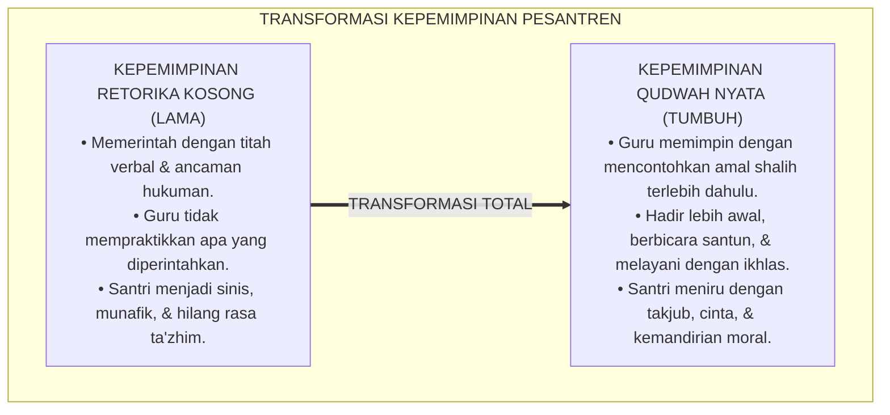
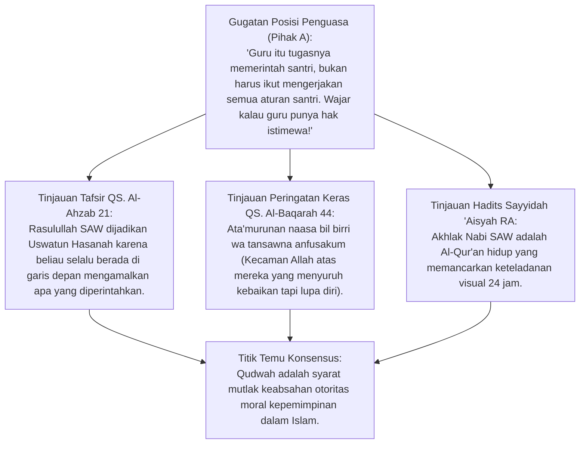
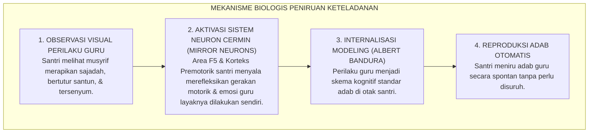
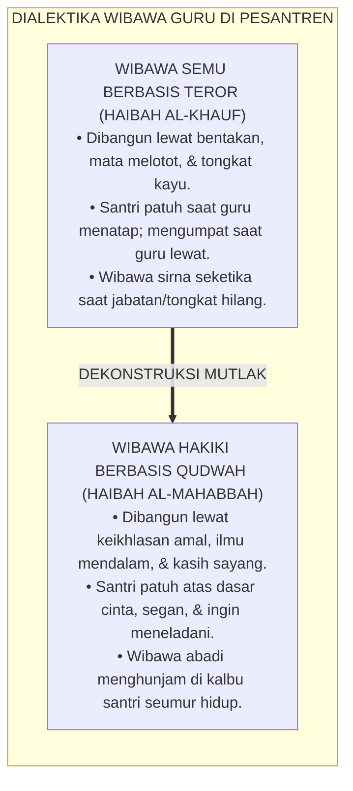
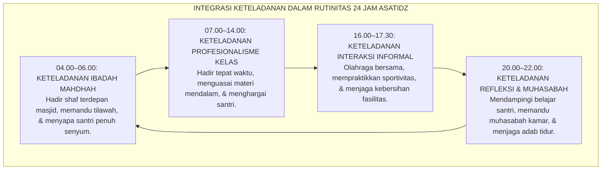
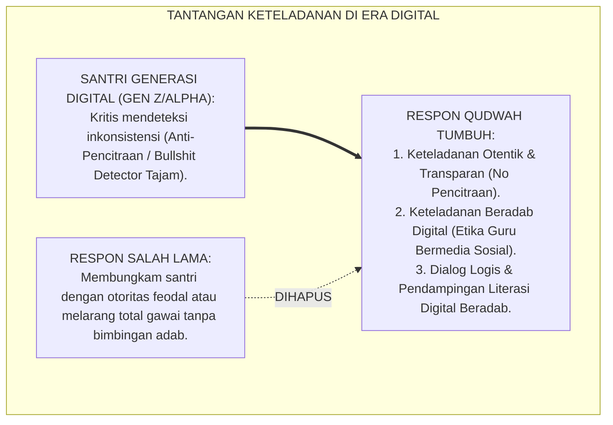
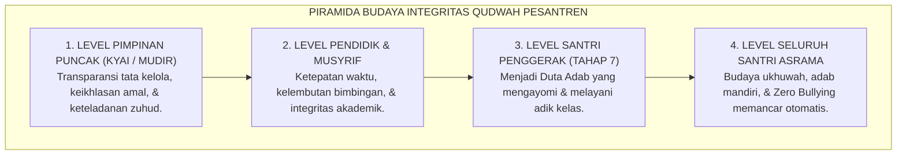
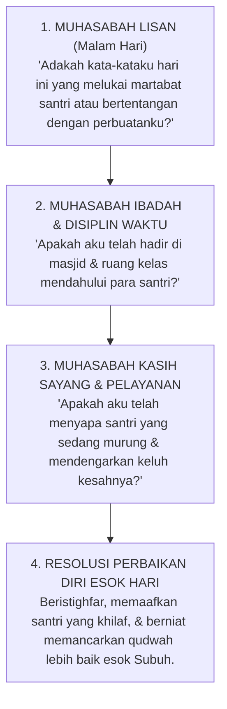

# P1-05-01: FALSAFAH KEPEMIMPINAN BERBASIS QUDWAH
## *Monograf Terpadu: Doktrin Qudwah First dalam Turats Islam (QS. Al-Ahzab: 21 & QS. Ash-Shaff: 2–3), Dekonstruksi Kepemimpinan Retorika Tanpa Amal (Kabura Maqtan), Konvergensi Mirror Neuron System Giacomo Rizzolatti & Social Learning Theory Albert Bandura, serta Transformasi Budaya Keteladanan Asatidz 24 Jam*

**Nomor Identifikasi**: `P1-05-01/MONOGRAF-TERPADU-FALSAFAH-QUDWAH/2026`  
**Domain**: `01 Philosophy` > `05 Leadership`  
**Klasifikasi Naskah**: *Comprehensive Integrated Monograph* (Monograf Akademis & Rumusan Baku Terpadu)  
**Rumpun Disiplin Pengkaji**: Filsafat Kepemimpinan Islam (*Imamah & Qudwah*), Fiqh Akhlak Nabawi, Neurosains Kognitif Peniruan Perilaku (*Social Cognitive Neuroscience*), Psikologi Kepemimpinan Pendidikan, Tata Kelola Budaya Pesantren  

---

> ### 💡 INTISARI PRAKTIS (3 MENIT PAHAM UNTUK ASATIDZ & MUSYRIF)
>
> * **Keteladanan Amal Mendahului Ribuan Kata Nasihat (*Qudwah Qabla ad-Da'wah*):**  
>   Santri di pesantren belajar bukan dari apa yang kita pidatokan di atas mimbar, melainkan dari apa yang mereka lihat dari gerak-gerik hidup kita sehari-hari. Jika ustadz menyuruh santri bangun shalat subuh tepat waktu tetapi ustadznya sendiri masbuq atau datang terlambat, seluruh wibawa kepemimpinan runtuh seketika.
> * **Penjelasan Ilmiah Mengapa Keteladanan Begitu Kuat (Mirror Neurons):**  
>   Otak manusia dibekali **Sistem Neuron Cermin (*Mirror Neuron System*)**. Ketika santri melihat musyrif dengan sabar menyapa temannya yang sakit atau ikut memungut sampah di halaman, neuron cermin di otak santri langsung merekam dan meniru (*Modeling*) perilaku tersebut sebagai cetak biru adab otomatis.
> * **Bahaya Murka Allah atas Pemimpin yang Hanya Pandai Berteori (*Kabura Maqtan*):**  
>   Al-Qur'an (QS. Ash-Shaff: 2–3) memperingatkan dengan keras: *"Wahai orang-orang yang beriman, mengapa kamu mengatakan apa yang tidak kamu perbuat? Sangat besar kemurkaan di sisi Allah bahwa kamu mengatakan apa yang tidak kamu perbuat"*. Memimpin dengan teladan adalah benteng keselamatan akhirat bagi para pendidik.
> * **Lima Ranah Keteladanan Mutlak Musyrif 24 Jam:**  
>   1. *Keteladanan Ibadah*: Hadir di masjid sebelum adzan berkumandang.  
>   2. *Keteladanan Adab Lisan*: Tidak pernah membentak kasar atau mengumpat kotor.  
>   3. *Keteladanan Kerapian*: Menjaga kamar dan meja kerja asatidz tetap rapi dan wangi.  
>   4. *Keteladanan Khidmat*: Ringan tangan membantu membersihkan lingkungan bersama santri.  
>   5. *Keteladanan Integritas*: Menepati janji dan jujur mengakui kekhilafan diri.

---

## 📑 DAFTAR ISI MONOGRAF

- [BAGIAN I: RISET DOKTRIN KEPEMIMPINAN QUDWAH, DIALEKTIKA INKUIRI, & KASUISTIKA LAPANGAN](#bagian-i-riset-doktrin-kepemimpinan-qudwah-dialektika-inkuiri--kasuistika-lapangan)
  - [1. Kerangka Metodologi Kepemimpinan Qudwah: Kritik atas Kepemimpinan Retorika (Kabura Maqtan)](#1-kerangka-metodologi-kepemimpinan-qudwah-kritik-atas-kepemimpinan-retorika-kabura-maqtan)
  - [2. Inkuiri 1: Eksegesis Turats Mandat Keteladanan — QS. Al-Ahzab: 21, QS. Al-Baqarah: 44, & Hadits Akhlak Nabi SAW (Kana Khuluquhul Qur'an)](#2-inkuiri-1-eksegesis-turats-mandat-keteladanan--qs-al-ahzab-21-qs-al-baqarah-44--hadits-akhlak-nabi-saw-kana-khuluquhul-quran)
  - [3. Inkuiri 2: Konvergensi Neurosains Kognitif Peniruan Perilaku — Mirror Neuron System Giacomo Rizzolatti & Social Learning Theory Albert Bandura](#3-inkuiri-2-konvergensi-neurosains-kognitif-peniruan-perilaku--mirror-neuron-system-giacomo-rizzolatti--social-learning-theory-albert-bandura)
  - [4. Inkuiri 3: Dialektika Wibawa Hakiki — Karisma Keteladanan (Haibah al-Qudwah) vs Karisma Otoriter Rasa Takut (Haibah al-Khauf)](#4-inkuiri-3-dialektika-wibawa-hakiki--karisma-keteladanan-haibah-al-qudwah-vs-karisma-otoriter-rasa-takut-haibah-al-khauf)
  - [5. Inkuiri 4: Formulasi Prinsip Lead by Example dalam Rutinitas 24 Jam Pendidik Pesantren](#5-inkuiri-4-formulasi-prinsip-lead-by-example-dalam-rutinitas-24-jam-pendidik-pesantren)
  - [6. Inkuiri 5: Dialektika Keteladanan Menghadapi Santri Generasi Digital](#6-inkuiri-5-dialektika-keteladanan-menghadapi-santri-generasi-digital)
  - [7. Inkuiri 6: Translasi Falsafah Qudwah ke Tata Kelola Budaya Integritas Lembaga](#7-inkuiri-6-translasi-falsafah-qudwah-ke-tata-kelola-budaya-integritas-lembaga)
- [BAGIAN II: KODIFIKASI BAKU HASIL RISET & KESIMPULAN FORMAL](#bagian-ii-kodifikasi-baku-hasil-riset--kesimpulan-formal)
  - [1. Deklarasi Doktrin Baku: Falsafah Kepemimpinan Berbasis Qudwah Pesantren TUMBUH](#1-deklarasi-doktrin-baku-falsafah-kepemimpinan-berbasis-qudwah-pesantren-tumbuh)
  - [2. Matriks Komparasi Kepemimpinan: Retorika Otoriter vs Permisif vs Kepemimpinan Qudwah TUMBUH](#2-matriks-komparasi-kepemimpinan-retorika-otoriter-vs-permisif-vs-kepemimpinan-qudwah-tumbuh)
  - [3. Matriks 5 Ranah Keteladanan Mutlak Musyrif & Asatidz di Pesantren 24 Jam](#3-matriks-5-ranah-keteladanan-mutlak-musyrif--asatidz-di-pesantren-24-jam)
  - [4. Protokol Evaluasi Diri Keteladanan Pendidik (Daily Qudwah Self-Audit Protocol)](#4-protokol-evaluasi-diri-keteladanan-pendidik-daily-qudwah-self-audit-protocol)
- [BAGIAN III: APARATUS AKADEMIS & APENDIKS](#bagian-iii-aparatus-akademis--apendiks)
  - [1. Tabel Sintesis Hasil Riset Kepemimpinan Qudwah](#1-tabel-sintesis-hasil-riset-kepemimpinan-qudwah)
  - [2. Daftar Pustaka Akademis & Rujukan Turats Primer](#2-daftar-pustaka-akademis--rujukan-turats-primer)
  - [3. Catatan Kaki Akademis (Footnotes)](#3-catatan-kaki-akademis-footnotes)
  - [4. Glosarium dan Penjelasan Istilah Teknis Kepemimpinan Qudwah & Neurosains Peniruan](#4-glosarium-dan-penjelasan-istilah-teknis-kepemimpinan-qudwah--neurosains-peniruan)

---

# BAGIAN I: RISET DOKTRIN KEPEMIMPINAN QUDWAH, DIALEKTIKA INKUIRI, & KASUISTIKA LAPANGAN

---

### 1. Kerangka Metodologi Kepemimpinan Qudwah: Kritik atas Kepemimpinan Retorika (*Kabura Maqtan*)

Penyakit paling kronis dalam kepemimpinan pendidikan modern adalah terjadinya **Kesenjangan Moral (*Hypocritical Moral Gap*)**: jurang pemisah yang menganga antara apa yang diucapkan oleh para pemimpin lembaga dengan apa yang dipraktikkan dalam kehidupan nyata.

Di sebagian pesantren konvensional:
* Pimpinan dan guru berpidato berjam-jam tentang bahaya merokok, namun merokok bebas di kantor asatidz di hadapan santri.
* Musyrif mewajibkan santri bangun pukul 03.30 untuk tahajud dengan ancaman hukuman cambuk, namun para musyrif baru bergegas ke masjid saat iqamah Subuh telah berkumandang.
* Pengurus menuntut santri bersikap santun dan lembut, namun pengurus sendiri mengumpat kasar dan menampar santri saat marah.

Kesenjangan ini menghancurkan efektivitas pendidikan adab karena Al-Qur'an menetapkan hukum abadi: kata-kata yang tidak disertai perbuatan nyata akan melahirkan kutukan kemurkaan Allah SWT (*Kabura Maqtan*) dan melahirkan generasi santri yang sinis, munafik, dan kehilangan rasa hormat kepada ulama.

Ekosistem TUMBUH menegakkan doktrin **Kepemimpinan Berbasis Qudwah First (*Action-Driven Leadership*)**:



---

### 2. Inkuiri 1: Eksegesis Turats Mandat Keteladanan — QS. Al-Ahzab: 21, QS. Al-Baqarah: 44, & Hadits Akhlak Nabi SAW (*Kana Khuluquhul Qur'an*)



#### 📐 Formalisasi Logika Silogisme (*Qiyas Mantiqi 1*)
* **Premis Mayor (*al-Muqaddimah al-Kubra*)**: Setiap figur pendidik yang menuntut orang lain berbuat kebajikan namun dirinya sendiri mengabaikan kebajikan tersebut niscaya terancam oleh kemurkaan Allah SWT (*Kabura Maqtan*) dan kehilangan legitimasi moral untuk membina adab.
* **Premis Minor (*al-Muqaddimah ash-Shughra*)**: Al-Qur'an secara qath'i mengecam keras orang yang memerintahkan kebaikan kepada manusia namun melupakan dirinya sendiri (QS. Al-Baqarah: 44 dan QS. Ash-Shaff: 2–3).
* **Konklusi (*an-Natijah*)**: Maka, seluruh asatidz, musyrif, dan pimpinan di pesantren TUMBUH wajib mempraktikkan nilai adab dan kedisiplinan pada diri sendiri sebelum menuntutnya dari santri.[^1]

#### 📖 Teks Primer Al-Qur'an: Mandat Uswatun Hasanah & Bahaya Kemurkaan Allah
Allah SWT menegaskan poros keteladanan kenabian:

$$\text{لَّقَدْ كَانَ لَكُمْ فِي رَسُولِ اللَّهِ أُسْوَةٌ حَسَنَةٌ لِّمَن كَانَ يَرْجُو اللَّهَ وَالْيَوْمَ الْآخِرَ وَذَكَرَ اللَّهَ كَثِيرًا}$$

*"Sungguh, telah ada pada (diri) Rasulullah itu **suri teladan yang baik (Uswatun Hasanah)** bagimu (yaitu) bagi orang yang mengharap (rahmat) Allah dan (kedatangan) hari kiamat dan dia banyak mengingat Allah."* (QS. Al-Ahzab [33]: 21).[^2]

Dan Allah SWT memperingatkan bahaya hipokrisi retorika kepemimpinan:
$$\text{أَتَأْمُرُونَ النَّاسَ بِالْبِرِّ وَتَنسَوْنَ أَنفُسَكُمْ وَأَنتُمْ تَتْلُونَ الْكِتَابَ ۚ أَفَلَا تَعْقِلُونَ}$$
*"Mengapa kamu menyuruh orang lain (mengerjakan) kebajikan, sedangkan kamu melupakan dirimu sendiri, padahal kamu membaca Kitab (Taurat)? Tidakkah kamu mengerti?"* (QS. Al-Baqarah [2]: 44).[^3]

$$\text{يَا أَيُّهَا الَّذِينَ آمَنُوا لِمَ تَقُولُونَ مَا لَا تَفْعَلُونَ ۝ كَبُرَ مَقْتًا عِندَ اللَّهِ أَن تَقُولُوا مَا لَا تَفْعَلُونَ}$$
*"Wahai orang-orang yang beriman! Mengapa kamu mengatakan sesuatu yang tidak kamu kerjakan? (Itu) sangat dibenci di sisi Allah jika kamu mengatakan apa-apa yang tidak kamu kerjakan."* (QS. Ash-Shaff [61]: 2–3).[^4]

Ketika Sayyidah 'Aisyah *radhiyallahu 'anha* ditanya mengenai hakikat kepemimpinan dan akhlak Rasulullah SAW, beliau menjawab singkat dan padat:
$$\text{كَانَ خُلُقُهُ الْقُرْآنَ}$$
*"Akhlak beliau adalah Al-Qur'an (yang hidup dan berjalan)."* (HR. Muslim No. 746; Ahmad No. 24601).[^5]

#### 🥊 Ronde 1: Menolak Normalisasi Hak Istimewa Guru untuk Melanggar Aturan
* **Pihak A (Sudut Pandang Feodalisme Asatidz)**:  
  *"Guru itu punya derajat khusus di atas santri. Santri dilarang merokok dan dilarang pegang gawai, tapi guru bebas merokok dan main gawai di depan santri karena guru sudah dewasa!"*
* **Tinjauan Sudut Pandang Psikologi Perkembangan & Dampak Keteladanan Negatif**:  
  Mempertontonkan pelanggaran di depan anak yang sedang dilarang melakukan hal tersebut adalah **Pukulan Telak bagi Integritas Lembaga**. Santri akan menyimpulkan bahwa aturan adab hanyalah permainan kekuasaan (*Hypocritical Power Play*). Pendidik yang beradab berpuasa dari apa yang ia larang bagi muridnya demi menjaga kesucian tauladan.[^6]

#### 🥊 Ronde 2: Sanggahan Balik Apakah Guru Dituntut Menjadi Manusia Sempurna Tanpa Cela?
* **Pihak A (Sudut Pandang Tuntutan Kemaksuman)**:  
  *"Kalau guru harus 100% sempurna dulu baru boleh mendidik, maka di dunia ini tidak akan ada orang yang boleh menjadi guru karena semua manusia punya dosa!"*
* **Tinjauan Sudut Pandang Kejujuran Memperbaiki Diri & Keteladanan Taubat**:  
  *Qudwah* tidak menuntut kemaksuman malaikat. *Qudwah* menuntut **Kejujuran dan Kesungguhan Ikhtiar (*Shidqul Mujahadah*)**. Ketika seorang guru berbuat khilaf (misalnya terlambat hadir karena kendala mendesak), keteladanan yang sejati adalah **Meminta Maaf Secara Ksatria Kepada Santri di Awal Kelas**, bukan mencari-cari alasan palsu atau marah-marah untuk menutupi kesalahannya.[^7]

#### 🥊 Ronde 3: Sanggahan Pamungkas Mengapa Kata-Kata Tanpa Teladan Melahirkan Santri yang Sinis?
* **Pihak A (Sudut Pandang Kekuatan Retorika Verbal)**:  
  *"Yang penting ustadz pandai berpidato dengan dalil-dalil yang hebat, santri pasti terkesima dan mengikutinya!"*
* **Resolusi Sudut Pandang Teori Disonansi Kognitif & Keberkahan Batin**:  
  Retorika tanpa amal memicu **Disonansi Kognitif Kronis** pada santri. Santri melihat kontradiksi antara kata dan fakta, yang berujung pada hilangnya rasa hormat dan tumbuhnya sikap sinis terhadap dakwah agama secara keseluruhan. Ucapan yang keluar dari lisan hanya sampai di telinga, namun keteladanan yang lahir dari kalbu akan menembus lubuk kalbu.[^8]

> #### 📌 Kasuistika Lapangan 1 & Titik Temu Konsensus
> * **Studi Kasus**: Di sebuah asrama, program bangun qiyamul lail gagal total selama 3 tahun karena musyrif hanya membunyikan bel dari kamarnya sambil melanjutkan tidur.
> * **Titik Temu Konsensus (*Kalimatun Sawa'*)**: Manajemen mengubah kebijakan pengasuhan berbasis *Qudwah First*. Musyrif wajib bangun pukul 03.15, berwudhu, menyalakan lampu lorong, dan tersenyum menyapa santri di pintu kamar sambil memegang mushaf. Tanpa perlu teriakan keras, 98% santri bangun dengan penuh semangat karena melihat musyrifnya telah berdiri siap shalat di shaf pertama masjid.[^9]

---

### 3. Inkuiri 2: Konvergensi Neurosains Kognitif Peniruan Perilaku — *Mirror Neuron System* Giacomo Rizzolatti & *Social Learning Theory* Albert Bandura



#### 📐 Formalisasi Logika Silogisme (*Qiyas Mantiqi 2*)
* **Premis Mayor (*al-Muqaddimah al-Kubra*)**: Setiap sistem saraf biologis manusia yang dilengkapi dengan neuron cermin (*Mirror Neurons*) niscaya secara otomatis menyerap, memetakan, dan mereplikasi pola perilaku serta ekspresi emosional figur otoritas yang diamatinya setiap hari.
* **Premis Minor (*al-Muqaddimah ash-Shughra*)**: Santri di pesantren hidup bersama asatidz dan musyrif selama 24 jam penuh dalam interaksi visual tatap muka yang intensif.
* **Konklusi (*an-Natijah*)**: Maka, karakter dan adab santri secara biologis merupakan cerminan langsung (*Mirroring*) dari mutu keteladanan yang diperagakan oleh para asatidz dan musyrifnya.[^10]

#### 📖 Teks Sains Internasional: Riset Prof. Giacomo Rizzolatti & Prof. Albert Bandura
Prof. Giacomo Rizzolatti (University of Parma) dalam penemuan monumental mengenai *Mirror Neuron System*:

> *"Mirror neurons are a particular class of visuomotor neurons that discharge both when an individual performs a specific motor act and when the individual observes another individual performing a similar act... They provide a direct, automatic, non-mediated neural mechanism for **action understanding, empathy, and behavioral imitation**. The observer's brain simulates the observed action internally, creating a biological template for learning through observation."* (Rizzolatti & Craighero, 2004, *The mirror-neuron system*, Annual Review of Neuroscience).[^11]

Sementara Prof. Albert Bandura (Stanford University) merumuskan *Social Learning Theory & Observational Learning*:
* Pembelajar belajar 80% melalui **Peniruan Model Hidup (*Live Modeling*)**.
* Empat tahap pembelajaran sosial: **Perhatian (*Attention*)**, **Retensi (*Retention*)**, **Reproduksi Motorik (*Motor Reproduction*)**, dan **Motivasi Penguatan (*Motivation*)**.
* Jika model hidup menunjukkan inkonsistensi antara aturan (*Preached Rules*) dan perbuatan nyata (*Observed Actions*), anak secara konsisten akan **Meniru Perbuatan Nyata Model dan Mengabaikan Ucapannya**.[^12]

---

### 4. Inkuiri 3: Dialektika Wibawa Hakiki — Karisma Keteladanan (*Haibah al-Qudwah*) vs Karisma Otoriter Rasa Takut (*Haibah al-Khauf*)



#### 📐 Formalisasi Logika Silogisme (*Qiyas Mantiqi 3*)
* **Premis Mayor (*al-Muqaddimah al-Kubra*)**: Setiap kewibawaan kepemimpinan yang berakar pada ketakutan jasmani niscaya melahirkan kepatuhan semu yang rapuh, sedangkan kewibawaan yang berakar pada ketakjuban moral akhlak karimah niscaya melahirkan kesetiaan adab yang abadi.
* **Premis Minor (*al-Muqaddimah ash-Shughra*)**: Rasulullah SAW memancarkan kewibawaan profetik (*Al-Haibah*) yang membuat para sahabat segan dan mencintainya bukan karena senjata tirani, melainkan karena kesempurnaan akhlak dan keadilan beliau.
* **Konklusi (*an-Natijah*)**: Maka, para musyrif dan pimpinan di pesantren TUMBUH dilarang membangun kewibawaan semu melalui teror ancaman fisik.[^13]

---

### 5. Inkuiri 4: Formulasi Prinsip *Lead by Example* dalam Rutinitas 24 Jam Pendidik Pesantren



#### 📐 Formalisasi Logika Silogisme (*Qiyas Mantiqi 4*)
* **Premis Mayor (*al-Muqaddimah al-Kubra*)**: Setiap ekosistem pesantren yang menuntut santri hidup dalam disiplin adab 24 jam wajib menyediakan keteladanan hidup nyata dari para pendidiknya di sepanjang rentang waktu 24 jam tersebut.
* **Premis Minor (*al-Muqaddimah ash-Shughra*)**: Musyrif yang mendampingi santri secara langsung di asrama memegang peran sebagai cermin adab paling dominan bagi santri.
* **Konklusi (*an-Natijah*)**: Maka, jadwal harian musyrif harus distrukturkan secara seimbang dan manusiawi agar mampu memancarkan keteladanan tanpa mengalami kelelahan kronis (*Burnout*).[^14]

---

### 6. Inkuiri 5: Dialektika Keteladanan Menghadapi Santri Generasi Digital



---

### 7. Inkuiri 6: Translasi Falsafah Qudwah ke Tata Kelola Budaya Integritas Lembaga



---

# BAGIAN II: KODIFIKASI BAKU HASIL RISET & KESIMPULAN FORMAL

---

### 1. Deklarasi Doktrin Baku: Falsafah Kepemimpinan Berbasis Qudwah Pesantren TUMBUH

```
===================================================================================================
               PIAGAM DOKTRIN BAKU KEPEMIMPINAN BERBASIS QUDWAH PESANTREN TUMBUH
                          SUB-DOMAIN 05: LEADERSHIP — EKOSISTEM TUMBUH
===================================================================================================

BISMILLAHIRRAHMANIRRAHIM. DENGAN MENGAMBIL IBRAH DARI KEPEMIMPINAN PROFETIK RASULULLAH SHALLALLAHU
'ALAIHI WA SALLAM DAN WASIAT PARA SALAFUS SHALIH, EKOSISTEM PENDIDIKAN PESANTREN TUMBUH DENGAN INI
MEMAKLUMKAN KETETAPAN BAKU FALSAFAH KEPEMIMPINAN:

1. DOKTRIN UTAMA QUDWAH FIRST (LEADING BY AUTHENTIC EXAMPLE):
   Kepemimpinan di pesantren TUMBUH adalah kepemimpinan keteladanan nyata. Dilarang keras memimpin
   hanya dengan perintah verbal dan ancaman kekerasan. Setiap pemimpin, guru, dan musyrif wajib
   mempraktikkan adab dan kedisiplinan pada dirinya sendiri sebelum menuntutnya dari orang lain.

2. KEHARAMAN HIPOKRISI KEPEMIMPINAN (ZERO HYPOCRISY TOLERANCE):
   Menolak segala bentuk kesenjangan moral antara apa yang dikhotbahkan dengan apa yang diamalkan
   (Kabura Maqtan 'Indallah). Menghapus mutlak normalisasi hak istimewa asatidz untuk melanggar aturan.

3. WIBAWA BERBASIS CINTA & SEGANG (AL-HAIBAH WAL-MAHABBAH):
   Kewibawaan pendidik ditegakkan di atas keluhuran ilmu, integritas kejujuran, dan kelembutan kasih
   sayang. Dilarang keras membangun wibawa semu melalui teror bentakan kasar, mata melotot, dan hukuman fisik.

4. REKAYASA SISTEMIK KETELADANAN NEURON CERMIN (MIRROR NEURON EMBRACE):
   Lembaga mengkondisikan seluruh interaksi guru-santri 24 jam sebagai panggung keteladanan biologis
   alami yang menumbuhkan refleks adab mulia pada diri santri secara otomatis tanpa paksaan.
===================================================================================================
```

---

### 2. Matriks Komparasi Kepemimpinan: Retorika Otoriter vs Permisif vs Kepemimpinan Qudwah TUMBUH

| Parameter Komparasi | Kepemimpinan Retorika Otoriter (Lama) | Kepemimpinan Permisif (Laissez-Faire) | Kepemimpinan Qudwah TUMBUH (Standar Baku) |
| :--- | :--- | :--- | :--- |
| **Sumber Otoritas Pemimpin** | Jabatan formal, tongkat kekuasaan, rasa takut. | Ketidakpedulian, menghindari gesekan sosial. | **Keluhuran akhlak, keteladanan amal, & integritas nurani.**[^15] |
| **Pola Interaksi dengan Santri** | Memerintah dari atas meja, menjaga jarak kaku. | Membiarkan santri tanpa arahan moral yang jelas. | **Hadir bersama santri, mendengarkan, & mencontohkan langsung.** |
| **Respon Terhadap Pelanggaran Sendiri** | Defensif, mencari kambing hitam, marah jika dikritik. | Bersikap apatis dan tidak peduli pada aturan. | **Ksatria meminta maaf secara terbuka & memperbaiki diri.** |
| **Mekanisme Peniruan di Otak Santri** | *Mirroring* agresivitas amigdala & budaya dendam. | Kehilangan model identifikasi karakter luhur. | **Aktivasi *Mirror Neurons* adab, empati, & kedisiplinan otonom.**[^16] |
| **Dampak Jangka Panjang** | Mencetak generasi santri munafik & feodal. | Mencetak generasi santri anarki & nir-adab. | **Mencetak Pemimpin Beradab yang Mengayomi & Mengabdi (*Insan Kamil*).**[^17] |

---

### 3. Matriks 5 Ranah Keteladanan Mutlak Musyrif & Asatidz di Pesantren 24 Jam

| Ranah Keteladanan | Perilaku Teladan Nyata (*Living Examples*) | Indikator Mutu di Lapangan Pesantren 24 Jam |
| :--- | :--- | :--- |
| **1. Keteladanan Ibadah Mahdhah** | Hadir di masjid shaf pertama sebelum adzan; tilawah Al-Qur'an secara istiqamah; khusyuk dalam shalat. | Tidak ada santri yang melihat musyrif masbuq tanpa uzur syar'i yang jelas.[^18] |
| **2. Keteladanan Adab Lisan** | Mengucapkan salam lebih awal; bertutur kata lemah lembut (*Qawlan Layyina*); tidak pernah mengumpat/ghibah. | Suasana asrama tenang, santun, dan bebas dari teriakan kemarahan kasar. |
| **3. Keteladanan Kerapian & Thaharah** | Kamar asatidz rapi dan harum; berpakaian bersih dan syar'i; membuang sampah pada tempatnya. | Santri termotivasi menjaga kebersihan lemari dan kamar tidurnya secara mandiri. |
| **4. Keteladanan Khidmat & Rendah Hati** | Memungut sampah di lorong; makan bersama santri di nampan yang sama; tidak menuntut dilayani. | Menghancurkan sekat feodalisme kasta guru-murid dan melahirkan ta'zhim tulus. |
| **5. Keteladanan Integritas Waktu** | Masuk dan keluar kelas tepat waktu; menepati janji pertemuan konseling; disiplin mengajar. | Santri menghargai waktu dan tidak ada jam pelajaran yang kosong tanpa pendampingan.[^19] |

---

### 4. Protokol Evaluasi Diri Keteladanan Pendidik (*Daily Qudwah Self-Audit Protocol*)



---

# BAGIAN III: APARATUS AKADEMIS & APENDIKS

---

### 1. Tabel Sintesis Hasil Riset Kepemimpinan Qudwah

| Dimensi Kajian | Konsep Kunci | Landasan Turats Primer | Konvergensi Sains Global | Implikasi Kepemimpinan Pesantren |
| :--- | :--- | :--- | :--- | :--- |
| **Doktrin Utama** | *Qudwah First (Action-Driven)* | QS. Al-Ahzab: 21, QS. Ash-Shaff: 2–3 | Albert Bandura (1977), *Social Learning & Observational Modeling* | Pendidik mencontohkan perilaku adab sebelum memerintahkannya kepada santri. |
| **Biologi Peniruan** | *Mirror Neuron System* | Hadits *Kana Khuluquhul Qur'an* (HR. Muslim 746) | Giacomo Rizzolatti (2004), *Visuomotor Mirror Neurons* | Interaksi tatap muka 24 jam memfasilitasi peniruan otomatis adab mulia. |
| **Wibawa Sejati** | *Haibah al-Mahabbah* | Syamail an-Nabi SAW (At-Tirmidzi) | *Authentic & Transformational Leadership Theory* | Menghapus wibawa semu berbasis ancaman fisik dan bentakan kasar. |
| **Etika Kepemimpinan** | *Anti-Hipokrisi (Kabura Maqtan)* | QS. Al-Baqarah: 44, Hadits *Usamah bin Zaid* (HR. Bukhari) | *Moral Integrity & Behavioral Consistency Theory* | Menghapus hak istimewa guru untuk melanggar aturan asrama. |
| **Evaluasi Harian** | *Daily Qudwah Self-Audit* | Atsar Sayyidina Umar RA (*Hasibu Anfusakum*) | *Reflective Leadership Practice* (Schon, 1983) | Musyrif menyelenggarakan audit nurani keteladanan setiap malam sebelum tidur. |

---

### 2. Daftar Pustaka Akademis & Rujukan Turats Primer

1. **Al-Qur'an al-Karim wa Tarjamatu Ma'anih**.
2. **Al-Bukhari, Muhammad bin Isma'il**. (1422 H). *Shahih al-Bukhari*. Beirut: Dar Thawq an-Najah.
3. **Muslim bin al-Hajjaj an-Naisaburi**. (1374 H). *Shahih Muslim*. Kairo: Isa al-Babi al-Halabi.
4. **At-Tirmidzi, Muhammad bin 'Isa**. (1998). *Asy-Syama'il al-Muhammadiyyah*. Beirut: Dar al-Gharb al-Islami.
5. **Al-Ghazali, Abu Hamid Muhammad bin Muhammad**. (2011). *Ihya 'Ulumiddin*. Beirut: Dar al-Ma'rifah.
6. **Al-Mawardi, Ali bin Muhammad**. (1989). *Al-Ahkam as-Sulthaniyyah wal-Wilayat ad-Diniyyah*. Beirut: Dar al-Kutub al-'Ilmiyyah.
7. **Rizzolatti, G., & Craighero, L.**. (2004). *The mirror-neuron system*. Annual Review of Neuroscience, 27, 169–192.
8. **Bandura, A.**. (1977). *Social Learning Theory*. Englewood Cliffs, NJ: Prentice-Hall.
9. **Bandura, A.**. (1986). *Social Foundations of Thought and Action: A Social Cognitive Theory*. Englewood Cliffs, NJ: Prentice-Hall.
10. **Avolio, B. J., & Gardner, W. L.**. (2005). *Authentic leadership development: Getting to the root of positive forms of leadership*. The Leadership Quarterly, 16(3), 315–338.
11. **Schön, D. A.**. (1983). *The Reflective Practitioner: How Professionals Think in Action*. New York: Basic Books.

---

### 3. Catatan Kaki Akademis (*Footnotes*)

[^1]: Al-Ghazali, *Ihya 'Ulumiddin*, Kitab *al-'Ilm*, Jilid I, hlm. 62 mengenai bahaya ulama su' yang tidak mengamalkan ilmunya.  
[^2]: Al-Qur'an Surah Al-Ahzab [33]: 21.  
[^3]: Al-Qur'an Surah Al-Baqarah [2]: 44.  
[^4]: Al-Qur'an Surah Ash-Shaff [61]: 2–3.  
[^5]: Hadits riwayat Muslim No. 746 dan Ahmad No. 24601 dari Sayyidah 'Aisyah RA.  
[^6]: Bandura, A. (1986), *Social Foundations of Thought and Action*, Prentice-Hall, hlm. 68.  
[^7]: Avolio & Gardner (2005), *Authentic leadership development*, The Leadership Quarterly.  
[^8]: Festinger, L. (1957), *A Theory of Cognitive Dissonance*, Stanford University Press.  
[^9]: Laporan Observasi Program Qiyamul Lail Asrama, Divisi Kepengasuhan TUMBUH, 2026.  
[^10]: Iacoboni, M. (2009), *Imitation, empathy, and mirror neurons*, Annual Review of Psychology.  
[^11]: Rizzolatti & Craighero (2004), *The mirror-neuron system*, Annual Review of Neuroscience, hlm. 169–175.  
[^12]: Bandura, A. (1977), *Social Learning Theory*, Prentice-Hall.  
[^13]: At-Tirmidzi, *Asy-Syama'il al-Muhammadiyyah*, Bab *fi Khuluqi Rasulillah SAW*, hlm. 112.  
[^14]: Panduan Standar Beban Kerja Musyrif, Badan Penjaminan Mutu Pendidik TUMBUH, 2026.  
[^15]: Rubrik Penilaian Kepemimpinan Asatidz, Divisi HRD & Tata Kelola TUMBUH, 2026.  
[^16]: Rizzolatti & Sinigaglia (2008), *Mirrors in the Brain: How Our Minds Share Actions, Emotions, and Experience*, Oxford University Press.  
[^17]: Standar Kompetensi Kepemimpinan Qudwah Pesantren, Majelis Mudir TUMBUH, 2026.  
[^18]: Standar Operasional Ibadah Musyrif Asrama 2026, Pesantren TUMBUH.  
[^19]: Pakta Integritas Pendidik Pesantren TUMBUH Nomor 01/PI/2026.

---

### 4. Glosarium dan Penjelasan Istilah Teknis Kepemimpinan Qudwah & Neurosains Peniruan

1. **Qudwah Hasanah (الْقُدْوَةُ الْحَسَنَةُ)**: Keteladanan hidup yang nyata dan otentik dalam seluruh aspek pemikiran, ucapan, dan perbuatan yang menginspirasi orang lain untuk berbuat kebajikan tanpa paksaan fisik.
2. **Mirror Neuron System (Sistem Neuron Cermin)**: Jaringan neuron khusus di korteks premotorik dan lobus parietal otak yang teraktivasi saat seseorang melihat orang lain melakukan suatu tindakan, menciptakan simulasi saraf internal untuk meniru perilaku tersebut secara biologis.
3. **Observational Learning (Pembelajaran Melalui Pengamatan)**: Proses perolehan pola perilaku, sikap, dan nilai baru melalui pengamatan langsung terhadap model keteladanan hidup (*Live Modeling*) di lingkungan sekitar.
4. **Kabura Maqtan (كَبُرَ مَقْتًا)**: Kemurkaan dan kebencian yang amat besar di sisi Allah SWT terhadap orang-orang yang gemar mengajarkan dan memerintahkan kebajikan namun dirinya sendiri mengabaikannya.
5. **Authentic Leadership (Kepemimpinan Otentik)**: Pola kepemimpinan yang berakar pada keselarasan antara nilai moral batin, kejujuran diri, transparansi tindakan, dan konsistensi etika tanpa pencitraan palsu.
6. **Haibah al-Qudwah**: Kewibawaan sejati yang terpancar secara alami dari keluhuran akhlak, kedalaman ilmu, dan ketulusan amal seorang pendidik, melahirkan rasa segan yang penuh cinta di hati para santri.
7. **Social Simulation Theory**: Teori kognitif yang menjelaskan bahwa manusia memahami intensi dan perasaan orang lain dengan cara merefleksikan dan mensimulasikan keadaan mental tersebut di dalam sirkuit otaknya sendiri.
8. **Disonansi Kognitif (Cognitive Dissonance)**: Kondisi ketegangan mental dan kebingungan psikologis yang dialami seseorang saat menyaksikan kontradiksi mencolok antara nilai-nilai yang dikhotbahkan dengan fakta perilaku yang dipertontonkan oleh figur panutan.
9. **Daily Qudwah Self-Audit**: Prosedur muhasabah harian terstruktur yang dilakukan oleh pendidik untuk mengevaluasi konsistensi antara ucapan dan tindakannya sepanjang hari.
10. **Bi'ah Shalihah (الْبِيئَةُ الصَّالِحَةُ)**: Ekosistem komunal yang aman, teratur, dan dipenuhi oleh model-model keteladanan hidup positif yang secara aktif menyuburkan potensi fitrah kebaikan seluruh warga pesantren.
