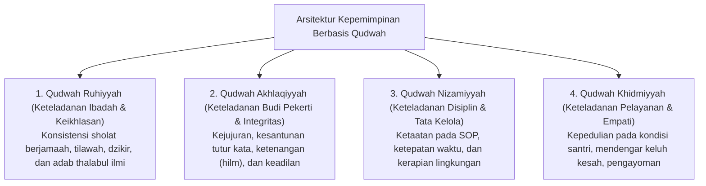

# P1-05-01-Falsafah-Kepemimpinan-Berbasis-Qudwah

## Tujuan
Merumuskan falsafah kepemimpinan di dunia pesantren yang berakar pada konsep **Qudwah** (Keteladanan Utama), menempatkan figur pimpinan, asatidz, musyrif, dan pengurus santri sebagai model hidup bagi seluruh proses pembinaan.

---

## Makna Filosofis Qudwah

Secara etimologi dan terminologi syariat, **Qudwah** adalah pribadi yang dijadikan panutan, teladan, dan rujukan perilaku karena integritas batin dan lahiriahnya yang selaras.

> *"Sungguh, telah ada pada (diri) Rasulullah itu suri teladan yang baik (Qudwah Hasanah) bagimu (yaitu) bagi orang yang mengharap (rahmat) Allah dan (kedatangan) hari kiamat dan yang banyak mengingat Allah."*  
> **(QS. Al-Ahzab [33]: 21)**

## Landasan Sains Global: Teori Kepemimpinan & Observational Learning

Konsep **Qudwah** divalidasi secara kuat oleh riset perilaku dan organisasi global:
* **Social Learning Theory & Observational Learning (Albert Bandura, 1977)**: Manusia belajar perilaku baru terutama melalui pengamatan terhadap model yang memiliki status dan kedekatan (*role models*), bukan dari ceramah instruksional semata.
* **The Leadership Challenge (James Kouzes & Barry Posner, 2017)**: Menetapkan hukum utama kepemimpinan: *"Model the Way"* (Menjadi Teladan Nyata)—keselarasan antara nilai yang diucapkan dengan perilaku yang ditunjukkan adalah prediktor nomor satu kredibilitas pemimpin.
* **Psychological Safety in Leadership (Amy Edmondson, 2018)**: Lingkungan asrama yang bebas dari intimidasi dan rasa takut (*fear-free culture*) melahirkan kepemimpinan santri yang jujur, proaktif, dan berani mengakui kesalahan untuk belajar.
* **Servant Leadership (Robert K. Greenleaf, 1977)**: Kepemimpinan sejati berakar pada dorongan melayani kebutuhan mereka yang dipimpin (*Sayyidul Qaumi Khaadimuhum*).

---

## 4 Dimensi Kepemimpinan Berbasis Qudwah

---

## Implikasi bagi Struktur Pengasuhan Pesantren

1. **Musyrif dan Asatidz Sebagai Poros Qudwah Harian**:
   - Musyrif tidak boleh menuntut santri bangun subuh jika musyrif sendiri terlambat ke masjid.
   - Musyrif tidak boleh melarang santri berkata kasar jika musyrif masih membentak atau mempermalukan santri.
2. **Kesesuaian Kata dan Tindakan (*Shidq al-Amal*)**:
   - Kepemimpinan diukur dari konsistensi nilai yang dipraktikkan, bukan dari tingginya volume suara atau beratnya sanksi yang dijatuhkan.
3. **Qudwah Bertingkat (*Tiered Role Modeling*)**:
   - Pimpinan pondok menjadi Qudwah bagi asatidz dan musyrif.
   - Musyrif dan asatidz menjadi Qudwah bagi seluruh santri.
   - Santri senior (T4 / OSIS) menjadi Qudwah bagi santri junior (T1-T2).
