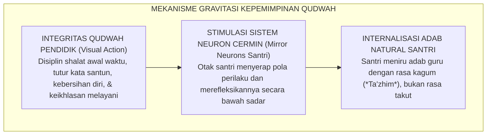

# P1-05-01: FALSAFAH KEPEMIMPINAN BERBASIS QUDWAH
## *Prinsip Keteladanan Mutlak (Leading by Example), Rekonstruksi Wibawa Pendidik Tanpa Otoritarianisme, dan Kaidah Uswah Hasanah*

**Nomor Identifikasi**: `P1-05-01/FALSAFAH-QUDWAH/2026`  
**Domain**: `01 Philosophy` > `05 Leadership`  
**Dewan Pakar**: `pakar-tata-kelola-qudwah`, `pakar-filosofi-tumbuh`, `pakar-pedagogi-master-guru`

---

## 📑 DAFTAR ISI ANALITIS

1. [1. Prolegomena: Keteladanan sebagai Inti Gravitasi Kepemimpinan Pesantren](#1-prolegomena-keteladanan-sebagai-inti-gravitasi-kepemimpinan-pesantren)
2. [2. Landasan Teologis Uswah/Qudwah Hasanah dalam Al-Qur'an & Sunnah](#2-landasan-teologis-uswahqudwah-hasanah-dalam-al-quran--sunnah)
3. [3. Kritik Tajam Al-Qur'an terhadap Pendidik yang Tuna-Keteladanan](#3-kritik-tajam-al-quran-terhadap-pendidik-yang-tuna-keteladanan)
4. [4. Neurosains Keteladanan: Sistem Neuron Cermin (Mirror Neurons)](#4-neurosains-keteladanan-sistem-neuron-cermin-mirror-neurons)
5. [5. Implikasi bagi Standar Integritas Pimpinan & Musyrif TUMBUH](#5-implikasi-bagi-standar-integritas-pimpinan--musyrif-tumbuh)

---

### 1. Prolegomena: Keteladanan sebagai Inti Gravitasi Kepemimpinan Pesantren

Dalam ekosistem pesantren, kepemimpinan bukanlah urusan posisi struktural di atas bagan organisasi, bukan pula ditentukan oleh tingginya suara bentakan di mikrofon aula. Kepemimpinan hakiki adalah **daya gravitasi moral (*moral gravitational power*)** yang terpancar dari integritas pribadi sang pemimpin. 

Santri adalah pengamat yang paling jujur dan jeli: mereka tidak mendengarkan apa yang dikatakan oleh gurunya melalui ribuan bait ceramah, melainkan **merekam dan meniru apa yang dilakukan oleh gurunya dalam kehidupan sehari-hari**.

Ekosistem TUMBUH menegakkan prinsip **Qudwah First (Keteladanan Lebih Dahulu Sebelum Menuntut)** sebagai hukum besi kepemimpinan pengasuhan pesantren.

---

### 2. Landasan Teologis Uswah/Qudwah Hasanah

Rasulullah SAW diutus oleh Allah SWT bukan sekadar membawa mushaf wahyu untuk dibaca, melainkan menjadi perwujudan hidup (*living embodiment*) dari seluruh ajaran wahyu tersebut:

> $$\text{لَّقَدْ كَانَ لَكُمْ فِي رَسُولِ اللَّهِ أُسْوَةٌ حَسَنَةٌ لِّمَن كَانَ يَرْجُو اللَّهَ وَالْيَوْمَ الْآخِرَ وَذَكَرَ اللَّهَ كَثِيرًا}$$
> 
> *"Sungguh telah ada pada (diri) Rasulullah itu suri teladan yang baik bagimu (yaitu) bagi orang yang mengharap (rahmat) Allah dan (kedatangan) hari kiamat dan dia banyak mengingat Allah."* (QS. Al-Ahzab [33]: 21).

Sayyidah Aisyah RA Ketika ditanya mengenai akhlak Rasulullah SAW menjawab dengan kalimat yang padat dan abadi:
$$\text{كَانَ خُلُقُهُ الْقُرْآنَ}$$
*"Akhlak beliau adalah Al-Qur'an yang hidup."* (HR. Muslim no. 746).

Dalam dunia pesantren, kiai, ustadz, dan musyrif adalah pewaris para nabi (*Waratsatul Anbiya'*). Maka warisan terbesar yang wajib diwariskan kepada santri bukanlah tumpukan diktat, melainkan **keteladanan akhlak nabawi yang berjalan di tengah-tengah asrama**.

---

### 3. Kritik Tajam Al-Qur'an terhadap Pendidik Tuna-Keteladanan

Al-Qur'an melayangkan peringatan yang amat keras terhadap mereka yang gemar memerintahkan kebajikan kepada orang lain namun mengabaikan pengamalan dalam dirinya sendiri:

> $$\text{أَتَأْمُرُونَ النَّاسَ بِالْبِرِّ وَتَنسَوْنَ أَنفُسَكُمْ وَأَنتُمْ تَتْلُونَ الْكِتَابَ ۚ أَفَلَا تَعْقِلُونَ}$$
> 
> *"Mengapa kamu menyuruh orang lain (mengerjakan) kebajikan, sedangkan kamu melupakan diri kamu sendiri, padahal kamu membaca Al-Kitab? Tidakkah kamu berakal?"* (QS. Al-Baqarah [2]: 44).

> $$\text{يَا أَيُّهَا الَّذِينَ آمَنُوا لِمَ تَقُولُونَ مَا لَا تَفْعَلُونَ ۝ كَبُرَ مَقْتًا عِندَ اللَّهِ أَن تَقُولُوا مَا لَا تَفْعَلُونَ}$$
> 
> *"Wahai orang-orang yang beriman! Mengapa kamu mengatakan sesuatu yang tidak kamu kerjakan? Amat besar kemurkaan di sisi Allah bahwa kamu mengatakan apa-apa yang tidak kamu kerjakan."* (QS. Ash-Shaff [61]: 2–3).

Pendidik yang membentak santri karena terlambat shalat subuh, namun ia sendiri sering masbuq; atau musyrif yang merazia rokok santri, namun ia merokok di ruang kantor—hakikatnya sedang menghancurkan wibawa pesantren dan mengajarkan kemunafikan secara terang-terangan kepada para santri.

---

### 4. Neurosains Keteladanan: Sistem Neuron Cermin (Mirror Neurons)

Keajaiban konsep Qudwah Hasanah menemukan pembuktian neurobiologisnya melalui penemuan **Sistem Neuron Cermin (*Mirror Neuron System*)** oleh Giacomo Rizzolatti dkk. (1996; 2004) di Universitas Parma:

Neuron cermin membuktikan bahwa otak manusia secara biologis diprogram untuk menyerap dan meniru perilaku yang diamati secara visual jauh lebih cepat dan kuat daripada mencerna perintah audio verbal. **Satu perbuatan teladan bernilai seribu kali lebih efektif daripada seribu kali khutbah nasihat**.

---

### 5. Implikasi bagi Standar Integritas Pimpinan & Musyrif TUMBUH

1. **Pakta Keteladanan Pendidik**: Seluruh pengasuh, guru, dan staf menandatangani komitmen bahwa mereka tidak akan menuntut santri melakukan suatu adab sebelum mereka sendiri mengamalkannya secara istiqamah.
2. **Budaya Qudwah di Segala Lini**:
   - Ketepatan waktu shalat dan halaqah dimulai dari kehadiran pimpinan pesantren.
   - Kebersihan lingkungan dimulai dari inisiatif para asatidz memungut sampah.
   - Kesantunan bahasa di asrama ditegakkan melalui ucapan para musyrif yang lembut dan bermartabat.
3. **Audit Keteladanan Berkala (*360-Degree Qudwah Feedback*)**: Evaluasi kinerja musyrif mengintegrasikan persepsi kenyamanan dan teladan yang dirasakan oleh santri di kamarnya.
