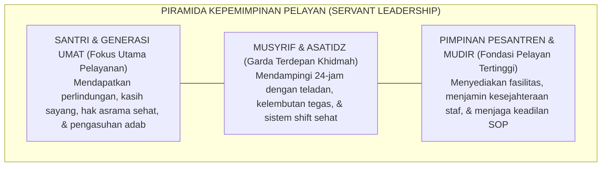

# P1-05-02: HAKIKAT AMANAH DAN KEPEMIMPINAN PELAYAN (SERVANT LEADERSHIP)
## *Doktrin Sayyidul Qawmi Khadimuhum, Pencegahan Otoritarianisme Feodal, dan Tata Kelola Pesantren Berbasis Khidmah*

**Nomor Identifikasi**: `P1-05-02/SERVANT-LEADERSHIP/2026`  
**Domain**: `01 Philosophy` > `05 Leadership`  
**Dewan Pakar**: `pakar-tata-kelola-qudwah`, `pakar-filosofi-tumbuh`, `pakar-pengasuhan-asrama`

---

## 📑 DAFTAR ISI ANALITIS

1. [1. Hakikat Kepemimpinan Islam: Amanah Pertanggungjawaban (Bukan Hak Istimewa)](#1-hakikat-kepemimpinan-islam-amanah-pertanggungjawaban-bukan-hak-istimewa)
2. [2. Doktrin Sayyidul Qawmi Khadimuhum: Kepemimpinan Berbasis Khidmah](#2-doktrin-sayyidul-qawmi-khadimuhum-kepemimpinan-berbasis-khidmah)
3. [3. Konvergensi Teori Kepemimpinan Pelayan Modern (Robert K. Greenleaf)](#3-konvergensi-teori-kepemimpinan-pelayan-modern-robert-k-greenleaf)
4. [4. Pencegahan Otoritarianisme Feodal & Budaya Burnout Musyrif](#4-pencegahan-otoritarianisme-feodal--budaya-burnout-musyrif)
5. [5. Implikasi bagi Struktur Manajemen Kepengasuhan TUMBUH](#5-implikasi-bagi-struktur-manajemen-kepengasuhan-tumbuh)

---

### 1. Hakikat Kepemimpinan Islam: Amanah Pertanggungjawaban

Dalam peradaban Islam, jabatan kepemimpinan (*Imarah / Ri'asah*) dipandang bukan sebagai kehormatan (*Tasyreef*) yang diperebutkan untuk meraup fasilitas duniawi, melainkan sebagai **Amanah Beban Pertanggungjawaban (*Takleef*)** yang menuntut pertanggungjawaban mutlak di hadapan Mahkamah Allah SWT.

Rasulullah SAW memperingatkan sahabat mulia Abu Dzarr Al-Ghifari RA tatkala meminta jabatan:

> $$\text{يَا أَبَا ذَرٍّ، إِنَّكَ ضَعِيفٌ، وَإِنَّهَا أَمَانَةٌ، وَإِنَّهَا يَوْمَ الْقِيَامَةِ خِزْيٌ وَنَدَامَةٌ، إِلَّا مَنْ أَخَذَهَا بِحَقِّهَا وَأَدَّى الَّذِي عَلَيْهِ فِيهَا}$$
> 
> *"Wahai Abu Dzarr! Sesungguhnya engkau adalah orang yang lemah, dan sesungguhnya jabatan kepemimpinan itu adalah **Amanah**; dan sesungguhnya pada hari kiamat kelak ia akan menjadi **kehinaan dan penyesalan**, kecuali bagi orang yang mengambilnya dengan haknya dan menunaikan kewajiban yang ada di dalamnya!"* (HR. Muslim no. 1825).

Hadits monumental ini adalah fondasi etika bagi seluruh pimpinan pondok, kepala madrasah, kepala kepengasuhan, dan musyrif asrama: jabatan mengasuh santri adalah amanah berat menyelamatkan generasi umat, bukan arena kekuasaan feodal.

---

### 2. Doktrin Sayyidul Qawmi Khadimuhum: Kepemimpinan Khidmah

Tradisi kepemimpinan Islam menegakkan paradigma **Khidmah (Pelayanan Tulus)**:

$$\text{سَيِّدُ الْقَوْمِ خَادِمُهُمْ}$$
*"Pemimpin suatu kaum adalah pelayan bagi mereka."* (HR. Abu Nu'aim).

Khadimul Ummah (pelayan umat) yang sejati termanifestasi dalam kepemimpinan Khalifah Umar bin Khattab RA yang memanggul sendiri karung gandum di keheningan malam demi memberi makan rakyatnya yang kelaparan; atau Khalifah Umar bin Abdul Aziz yang mematikan lilin fasilitas negara saat berdiskusi urusan pribadi.

Di pesantren TUMBUH, kiai dan musyrif memandang santri bukan sebagai "bawahannya", melainkan sebagai **tamu-tamu Rasulullah SAW (*Thullabul 'Ilm / Dhuyufur Rahman*)** yang wajib dilayani kebutuhan spiritual, kognitif, fisik, dan keamanannya dengan penuh rasa takzim dan kasih sayang.

---

### 3. Konvergensi Teori Servant Leadership Robert K. Greenleaf

Kearifan Islam ini bersinergi secara sempurna dengan teori kepemimpinan modern **Servant Leadership** yang dirumuskan oleh Robert K. Greenleaf (1970; 1977):
* Ciri utama pemimpin pelayan adalah: ia mengutamakan kebutuhan orang-orang yang dipimpinnya di atas kepentingan pribadinya (*prioritizing other's needs*).
* Ukuran keberhasilan pemimpin pelayan adalah: **apakah orang-orang yang dipimpinnya bertumbuh sebagai manusia (*do those served grow as persons?*)**; apakah mereka menjadi lebih sehat, lebih bijak, lebih mandiri, dan lebih terdorong untuk menjadi pelayan bagi sesamanya?

---

### 4. Pencegahan Otoritarianisme Feodal & Burnout Musyrif

Penerapan *Servant Leadership* di pesantren TUMBUH sekaligus memecahkan dua patologi kronis:
1. **Pencegahan Feodalisme Asrama**: Menghapus tradisi pemanfaatan santri yunior untuk melayani kebutuhan pribadi santri senior atau ustadz tanpa kompensasi adil.
2. **Mitigasi Burnout Musyrif**: Kepemimpinan pelayan memastikan bahwa musyrif tidak dieksploitasi tenaganya 24 jam tanpa henti. Manajemen menerapkan **Sistem Shift Kerja Sehat (Dual-Pillar)** dan menjamin hak istirahat musyrif, sehingga musyrif dapat mengasuh dengan jiwa yang tenang dan bahagia (*Anti-Burnout Protocol*).

---

### 5. Implikasi bagi Struktur Manajemen Kepengasuhan TUMBUH

1. **Evaluasi Berbasis Kepuasan Layanan Santri**: Pimpinan mengukur efektivitas kepengasuhan dari tingkat keamanan psikologis dan kebahagiaan santri di asrama.
2. **Budaya Turun ke Bawah (*Tafaqqud*)**: Pimpinan pesantren secara rutin berkeliling asrama di malam hari, memeriksa kelayakan makanan di dapur santri, dan mendengarkan aspirasi para musyrif muda.
3. **Standarisasi Kesejahteraan Pendidik**: Memberikan hak upah yang bermartabat, pelatihan pedagogi berkelanjutan, dan jaminan kesehatan bagi seluruh pejuang asrama.
