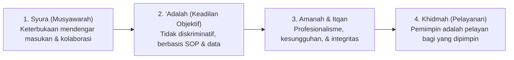

# P1-05-02-Hakikat-Amanah-dan-Kepemimpinan-Pelayan

## Tujuan
Menjelaskan landasan teologis mengenai kepemimpinan (*Qiyadah*), tanggung jawab pengasuhan (*Mas'uliyyah*), dan pelayanan umat (*Khidmah*) sebagai amanah yang wajib dipertanggungjawabkan di hadapan Allah dan manusia.

---

## Hakikat Qiyadah dalam Khazanah Islam

Kepemimpinan dalam Islam adalah beban amanah (*Mas'uliyyah*), bukan kebanggaan status atau sarana eksploitasi.

> *"Setiap kalian adalah pemimpin (ra'in) dan setiap kalian akan dimintai pertanggungjawaban atas apa yang dipimpinnya..."*  
> **(HR. Bukhari no. 893 & Muslim no. 1829)**

> *"Kepemimpinan itu awalnya adalah celaan, pertengahannya adalah penyesalan, dan akhirnya adalah kehinaan pada hari kiamat, kecuali bagi orang yang mengambilnya dengan benar dan menunaikan kewajiban di dalamnya."*  
> **(HR. Muslim)**

---

## Prinsip Kepemimpinan Pengasuhan TUMBUH

1. **Sayyidul Qaumi Khaadimuhum (Pemimpin Adalah Pelayan Kaumnya)**:
   - Wakamad, Kepala Pengasuhan, dan Musyrif memandang tugas kepemimpinannya sebagai pelayanan untuk memfasilitasi santri agar bertumbuh dengan baik.
2. **Keadilan Berbasis Objektivitas & SOP**:
   - Keputusan penegakan aturan dan apresiasi tidak didasarkan pada *like and dislike*, melainkan pada standar baku dan data kejadian yang akurat.
3. **Syura dan Kolaborasi Antar Unit**:
   - Menghilangkan sekat ego sektoral antara Kurikulum, Kesiswaan, Musyrif, dan BK melalui pertemuan koordinasi rutin berkala.
