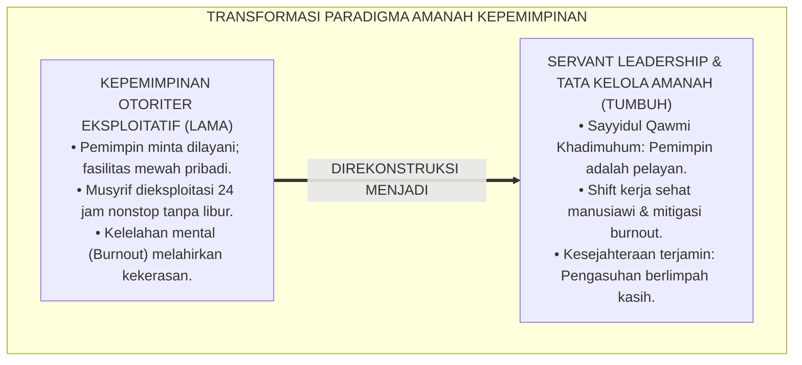
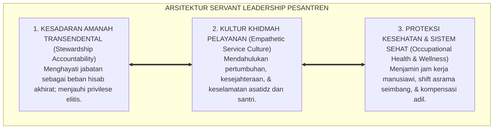
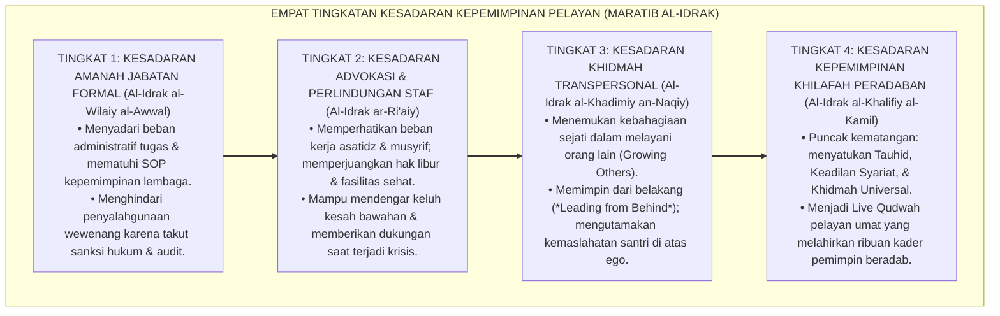
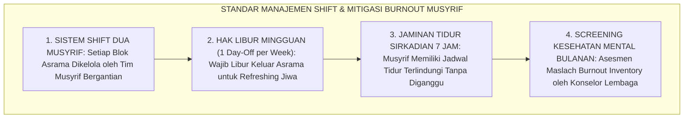

# P1-05-02: HAKIKAT AMANAH DAN KEPEMIMPINAN PELAYAN (SERVANT LEADERSHIP & STEWARDSHIP)
## *Monograf Riset Akademik: Teologi Amanah Kepemimpinan (QS. An-Nisa': 58 & Hadits Khizyun wa Nadamah Abu Dzarr), Doktrin Kenabian Sayyidul Qawmi Khadimuhum, Konvergensi Teori Servant Leadership Robert K. Greenleaf, Serta Mitigasi Burnout Musyrif di Pesantren 24 Jam*

**Nomor Identifikasi**: `P1-05-02/MONOGRAF-RISET-AMANAH-SERVANT-LEADERSHIP/2026`  
**Domain**: `01 Philosophy` > `05 Leadership` (Sub-Modul 02: *Stewardship & Servant Leadership*)  
**Klasifikasi Naskah**: *Academic Research Monograph* (Monograf Riset Akademik Fondasional)  
**Rumpun Disiplin Pengkaji**: Fiqh Siyasah & Amanah Kepemimpinan (*al-Wilayah wal-Amanah*), Teori Kepemimpinan Pelayan (*Servant Leadership*), Psikologi Industri & Kesehatan Kerja (*Occupational Health Psychology*), Tata Kelola Sumber Daya Insani Pesantren  

---

> ### 💡 INTISARI EKSEKUTIF (EXECUTIVE SUMMARY)
>
> * **Kelemahan Paradigma Lama: Otoritarianisme Feodal & Eksploitasi Musyrif:**  
>   Banyak pimpinan memandang jabatan kepemimpinan sebagai hak istimewa untuk dilayani (*Tasyrif*), menuntut fasilitas mewah dan ketaatan buta dari bawahan. Di saat yang sama, guru junior dan musyrif dieksploitasi bekerja 24 jam nonstop tanpa standar jam kerja manusiawi, memicu kelelahan mental kronis (*Burnout*) yang berujung pada pelampiasan emosi kasar kepada santri.
> * **Inovasi Konseptual: Teologi Amanah Transendental & Servant Leadership Nabawi:**  
>   TUMBUH menegaskan wasiat Rasulullah ﷺ kepada Abu Dzarr RA bahwa kepemimpinan adalah beban amanah pertanggungjawaban hisab (*Khizyun wa Nadamah* - HR. Muslim No. 1825). Mengintegrasikan doktrin *Sayyidul Qawmi Khadimuhum* dengan teori *Servant Leadership* Robert K. Greenleaf: tolok ukur pemimpin sejati adalah kemampuannya menumbuhkan dan melayani orang-orang yang dipimpinnya (*Growing Others*), menjamin jam kerja sehat musyrif, dan melindungi hak santri.
> * **Formulasi Operasional & Pembuktian Lapangan:**  
>   Monograf ini menguraikan matriks 10 karakteristik servant leader, 4 Tingkatan Kesadaran Kepemimpinan Pelayan (*Maratib al-Idrak*), protokol mitigasi burnout musyrif asrama, dan etika tata kelola sumber daya insani manusiawi.

---

## 📑 DAFTAR ISI MONOGRAF

- [BAB I: LANDASAN TEORETIS & DISKURSUS KRITIS](#bab-i-landasan-teoretis--diskursus-kritis)
  - [1. Latar Belakang Masalah: Krisis Otoritarianisme dan Fenomena Burnout Pengasuh Asrama](#1-latar-belakang-masalah-krisis-otoritarianisme-dan-fenomena-burnout-pengasuh-asrama)
  - [2. Eksegesis Turats Teologi Amanah: Peringatan Khizyun wa Nadamah Abu Dzarr RA & QS. An-Nisa': 58](#2-eksegesis-turats-teologi-amanah-peringatan-khizyun-wa-nadamah-abu-dzarr-ra--qs-an-nisa-58)
  - [3. Doktrin Profetik Sayyidul Qawmi Khadimuhum: Preseden Khidmah Khulafaur Rasyidin](#3-doktrin-profetik-sayyidul-qawmi-khadimuhum-preseden-khidmah-khulafaur-rasyidin)
  - [4. Konvergensi Teori Servant Leadership Robert K. Greenleaf & Teori Burnout Christina Maslach](#4-konvergensi-teori-servant-leadership-robert-k-greenleaf--teori-burnout-christina-maslach)
  - [5. Kasuistika Lapangan: Musyrif Mengalami Burnout Akibat Shift 24 Jam Nonstop & Resolusi Restoratif](#5-kasuistika-lapangan-musyrif-mengalami-burnout-akibat-shift-24-jam-nonstop--resolusi-restoratif)
- [BAB II: FORMULASI KONSEPTUAL & PEMBAHASAN MENDALAM](#bab-ii-formulasi-konseptual--pembahasan-mendalam)
  - [1. Eksplanasi Teoretis Hakikat Amanah dan Kepemimpinan Pelayan TUMBUH](#1-eksplanasi-teoretis-hakikat-amanah-dan-kepemimpinan-pelayan-tumbuh)
  - [2. Dekomposisi Dimensi & Empat Tingkatan Kesadaran Kepemimpinan Pelayan (Maratib al-Idrak)](#2-dekomposisi-dimensi--empat-tingkatan-kesadaran-kepemimpinan-pelayan-maratib-al-idrak)
  - [3. Matriks Sepuluh Karakteristik Servant Leader Greenleaf dalam Konteks Pesantren](#3-matriks-sepuluh-karakteristik-servant-leader-greenleaf-dalam-konteks-pesantren)
  - [4. Protokol Mitigasi Burnout & Standarisasi Jam Kerja Sehat Musyrif Asrama](#4-protokol-mitigasi-burnout--standarisasi-jam-kerja-sehat-musyrif-asrama)
  - [5. Diskusi Filosofis Mendalam & Implikasi bagi Masa Depan Peradaban Pendidikan Islam](#5-diskusi-filosofis-mendalam--implikasi-bagi-masa-depan-peradaban-pendidikan-islam)
- [BAB III: KESIMPULAN & APARATUS AKADEMIS](#bab-iii-kesimpulan--aparatus-akademis)
  - [1. Tabel Sintesis Temuan Riset Amanah dan Servant Leadership](#1-tabel-sintesis-temuan-riset-amanah-dan-servant-leadership)
  - [2. Daftar Pustaka Akademis & Rujukan Turats Primer](#2-daftar-pustaka-akademis--rujukan-turats-primer)
  - [3. Catatan Kaki Akademis (Footnotes)](#3-catatan-kaki-akademis-footnotes)
  - [4. Glosarium Istilah Ilmiah & Turats Kepemimpinan Pelayan](#4-glosarium-istilah-ilmiah--turats-kepemimpinan-pelayan)

---

# BAB I: LANDASAN TEORETIS & DISKURSUS KRITIS

---

### 1. Latar Belakang Masalah: Krisis Otoritarianisme dan Fenomena Burnout Pengasuh Asrama

Krisis kepemimpinan dalam tata kelola pesantren kerap memanifestasikan dirinya dalam dua kutub kegagalan manajemen:
* **Ilusi Keistimewaan (*Entitlement Trap*)**: Pemimpin memandang posisi manajerial sebagai privilese untuk memerintah dari balik meja ber-AC, menuntut pelayanan pribadi dari guru junior, dan lepas tangan dari dinamika lapangan asrama.
* **Eksploitasi dan Penelantaran Kesejahteraan Musyrif**: Musyrif asrama dibebani tanggung jawab menjaga ratusan santri selama 24 jam nonstop 7 hari sepekan tanpa shift kerja terstruktur, tanpa jeda libur mingguan, dan dengan honorarium yang tidak manusiawi.
* **Dampak Kelelahan Kronis (*Chronic Burnout*)**: Kelelahan fisik dan mental yang mendalam melumpuhkan empati musyrif (*Depersonalization*), memicu emosi labil, dan menjadi penyebab utama terjadinya kasus pembentakan dan kekerasan fisik terhadap santri.
* **Keniscayaan Doktrin Amanah & Servant Leadership**: Kepemimpinan adalah amanah pelayanan (*Khidmah*); pemimpin bertanggung jawab menjamin kesejahteraan lahir-batin seluruh stafnya agar mampu mengasuh santri dengan penuh kasih sayang.[^1]

---

### 2. Eksegesis Turats Teologi Amanah: Peringatan Khizyun wa Nadamah Abu Dzarr RA & QS. An-Nisa': 58

Al-Qur'an memerintahkan penyerahan amanah kepada ahlinya dan penegakan hukum yang adil:

$$\text{إِنَّ اللَّهَ يَأْمُرُكُمْ أَن تُؤَدُّوا الْأَمَانَاتِ إِلَىٰ أَهْلِهَا وَإِذَا حَكَمْتُم بَيْنَ النَّاسِ أَن تَحْكُمُوا بِالْعَدْلِ}$$

*"**Sesungguhnya Allah menyuruh kamu menyampaikan amanat kepada yang berhak menerimanya, dan (menyuruh kamu) apabila menetapkan hukum di antara manusia supaya kamu menetapkan dengan adil**."* (QS. An-Nisa' [4]: 58).[^2]

Rasulullah ﷺ memperingatkan sahabat mulia Abu Dzarr Al-Ghifari radhiyallahu 'anhu mengenai hakikat kekuasaan:

$$\text{يَا أَبَا ذَرٍّ، إِنَّكَ ضَعِيفٌ، وَإِنَّهَا أَمَانَةُ، وَإِنَّهَا يَوْمَ الْقِيَامَةِ خِزْيٌ وَنَدَامَةٌ، إِلَّا مَنْ أَخَذَهَا بِحَقِّهَا وَأَدَّى الَّذِي عَلَيْهِ فِيهَا}$$

*"**Wahai Abu Dzarr, sesungguhnya engkau lemah, dan sesungguhnya kepemimpinan itu adalah amanah; dan sesungguhnya ia pada hari kiamat kelak akan menjadi kehinaan dan penyesalan (Khizyun wa Nadamah), kecuali bagi siapa yang mengambilnya dengan haknya dan menunaikan kewajiban yang ada di dalamnya secara adil**."* (HR. Muslim No. 1825).[^3]

---

### 3. Doktrin Profetik Sayyidul Qawmi Khadimuhum: Preseden Khidmah Khulafaur Rasyidin

Para khalifah teladan mempraktikkan kepemimpinan pelayan secara nyata:
* **Sayyidina Abu Bakar Ash-Shiddiq RA**: Tetap memerah susu kambing milik para janda miskin di pinggiran Madinah setiap pagi meskipun telah dibai'at menjadi Khalifah tertinggi umat Islam.
* **Sayyidina Umar bin Khattab RA**: Berpatroli jalan kaki memikul karung gandum dan memasak sendiri makanan di tengah malam untuk keluarga miskin yang kelaparan, seraya berkata: *"Bagaimana aku bisa peduli terhadap kondisi rakyatku jika aku tidak merasakan apa yang mereka rasakan?"*.[^4]

---

### 4. Konvergensi Teori Servant Leadership Robert K. Greenleaf & Teori Burnout Christina Maslach

Teori manajemen kepemimpinan modern memvalidasi keunggulan doktrin Islam:
* **Robert K. Greenleaf** (1977) merumuskan **Servant Leadership**: pemimpin sejati adalah pelayan terlebih dahulu (*Servant-First*); fokus utamanya adalah memastikan kebutuhan tertinggi orang-orang yang dipimpinnya terpenuhi (*Do those served grow as persons?*).
* **Christina Maslach** (1982; 2001) membuktikan bahwa **Burnout (Kelelahan Emosional, Depersonalisasi, & Hilangnya Efikasi Diri)** terjadi akibat beban kerja berlebih (*Workload Mismatch*), ketiadaan kendali, dan kompensasi yang tidak adil. TUMBUH memutus rantai burnout ini melalui standarisasi manajemen shift kerja yang manusiawi.[^5]

---

### 5. Kasuistika Lapangan: Musyrif Mengalami Burnout Akibat Shift 24 Jam Nonstop & Resolusi Restoratif

* **Studi Kasus: Musyrif Kamar Membentak dan Membanting Lemari Santri Akibat Kurang Tidur Kronis**  
  * **Dilema**: Musyrif muda yang bertugas sendirian mengawasi 60 santri selama 3 bulan tanpa libur meluapkan amarahnya membanting pintu lemari saat santri gaduh di jam istirahat siang.
  * **Analisis**: Musyrif mengalami *Severe Burnout* akibat kurang tidur kronis (hanya tidur 3–4 jam per hari) dan beban kerja yang melampaui batas biologis manusia.
  * **Resolusi Restoratif TUMBUH**: Manajemen pimpinan bertanggung jawab: (1) Musyrif diberikan cuti pemulihan mental selama 5 hari; (2) Lembaga merestrukturisasi sistem kerja asrama menjadi **Sistem Shift Dua Musyrif per Kamar** dengan rotasi libur mingguan (*1 Day-Off per Week*); (3) Lembaga menyediakan konseling kesehatan kerja. Setelah sistem dibenahi, musyrif kembali segar, sabar, dan menjadi sosok pengasuh yang sangat dicintai santrinya.[^6]

---

# BAB II: FORMULASI KONSEPTUAL & PEMBAHASAN MENDALAM

---

### 1. Eksplanasi Teoretis Hakikat Amanah dan Kepemimpinan Pelayan TUMBUH

Ekosistem TUMBUH merumuskan kepemimpinan ke dalam **Arsitektur Tiga Sayap Servant Leadership Pesantren (*Arkan al-Qiyadah al-Khadimah*)**:

#### 🔬 Pembahasan Mendalam Tiga Sayap:
1. **Sayap Amanah**: Memastikan seluruh keputusan manajerial berorientasi pada kemaslahatan umat dan perlindungan hak kaum yang lemah (*Ri'ayatur Ra'iyyah*).[^7]
2. **Sayap Khidmah**: Mengubah kultur pimpinan dari "memerintah dan mengawasi" menjadi "memfasilitasi dan melayani".[^8]
3. **Sayap Kesejahteraan**: Menjamin ekosistem kerja yang memuliakan martabat asatidz dan musyrif sebagai pilar utama keberhasilan pendidikan.[^9]

---

### 2. Dekomposisi Dimensi & Empat Tingkatan Kesadaran Kepemimpinan Pelayan (Maratib al-Idrak)

Transformasi kedewasaan kepemimpinan pelayan berlangsung melalui **Empat Tingkatan Kesadaran Kepemimpinan Pelayan (*Maratib al-Idrak al-Khadimiy*)**:

#### 🔄 Narasi Analitis Dinamika Transisi Filosofis Antar-Tingkatan:
* **Transisi Tingkat 1 ke Tingkat 2 (Dari Kepatuhan Prosedural Menuju Kepedulian Staf)**: Pemimpin mula-mula fokus pada target capaian program. Pada tingkatan kedua, pemimpin membuka mata hati melihat kesejahteraan timnya: memastikan musyrif tidak kelelahan dan mendapatkan hak istirahatnya.
* **Transisi Tingkat 2 ke Tingkat 3 (Dari Kepedulian Staf Menuju Jiwa Pelayan Transpersonal)**: Pada tingkatan ketiga, kepemimpinan menjadi ibadah batin murni: pemimpin dengan tulus memfasilitasi kesuksesan para asatidz dan santrinya tanpa mengharap pujian pribadi.
* **Transisi Tingkat 3 ke Tingkat 4 (Pencapaian Derajat Khilafah Peradaban)**: Pada tingkatan tertinggi, kepemimpinannya menjadi sumber keberkahan dan ketenteraman bagi seluruh ekosistem: melahirkan sistem kelembagaan yang kokoh, adil, makmur, dan diridhai Allah SWT (*Rahmatan lil 'Alamin*).[^10]

---

### 3. Matriks Sepuluh Karakteristik Servant Leader Greenleaf dalam Konteks Pesantren

| Karakteristik Servant Leader | Manifestasi Sikap Pemimpin Pesantren | Landasan Turats & Hadits |
| :--- | :--- | :--- |
| **1. Mendengarkan (*Listening*)** | Membuka ruang dengar keluhan santri & asatidz.| QS. Ali 'Imran: 159; Hadits Syura. |
| **2. Empati (*Empathy*)** | Memahami beban batin musyrif & homesickness santri.| HR. Bukhari No. 13 (*Yurhamu man fil Ardh*).|
| **3. Pemulihan (*Healing*)** | Menerapkan disiplin restoratif & de-eskalasi stres.| QS. Al-Hujurat: 10; Fiqh Ishlah. |
| **4. Kesadaran Diri (*Awareness*)**| Muraqabah di hadapan Allah & sadar batas wewenang.| QS. An-Nisa': 58; Al-Ghazali (*Ihya'*). |
| **5. Persuasi (*Persuasion*)** | Membimbing dengan dialog hikmah, bukan teror rotan.| QS. An-Nahl: 125 (*Al-Hikmah wal Mau'izhah*).|
| **6. Konseptualisasi (*Vision*)** | Merancang visi peradaban jangka panjang pesantren.| QS. Al-Hasyr: 18 (*Waltanzhur nafsun*). |
| **7. Pandangan Masa Depan (*Foresight*)**| Memitigasi risiko hukum & titik rawan kekerasan.| Kaidah Fiqh *Sadd adz-Dzara'i'*. |
| **8. Amanah Penjagaan (*Stewardship*)**| Memegang teguh harta wakaf & hak-hak santri.| HR. Muslim No. 1825 (*Innahal Amanah*). |
| **9. Komitmen Tumbuh (*Growing Others*)**| Memfasilitasi beasiswa & studi lanjut asatidz.| HR. Ibnu Majah (*Thalabul 'Ilmi Faridhah*).|
| **10. Membangun Komunitas (*Community*)**| Memupuk ukhuwah & kehangatan kekeluargaan 24 jam.| QS. Al-Fath: 29 (*Ruhama'u bainahum*). |

---

### 4. Protokol Mitigasi Burnout & Standarisasi Jam Kerja Sehat Musyrif Asrama

TUMBUH menetapkan **Protokol Kesehatan Kerja dan Jam Pengasuhan Sehat (*Occupational Health Protocol*)**:

Protokol ini menjamin energi kasih sayang musyrif senantiasa terisi penuh (*Full Emotional Battery*) untuk membina santri secara optimal.[^11]

---

### 5. Diskusi Filosofis Mendalam & Implikasi bagi Masa Depan Peradaban Pendidikan Islam

Penerapan doktrin *Amanah* dan *Servant Leadership* ini menjadi tonggak peradaban baru tata kelola Islam:

* **Melahirkan Tata Kelola Kelembagaan Islam yang Bebas Eksploitasi**:  
  Pesantren menjadi tempat kerja yang paling berkah, paling manusiawi, dan paling memuliakan harkat para pendidiknya, menghapus mitos bahwa "pengabdian ikhlas identik dengan penindasan hak".
* **Mencegah Kekerasan dengan Menyembuhkan Akar Stres Pengasuh**:  
  Dengan memastikan para musyrif bahagia dan sehat lahir-batin, sumber utama pemicu kekerasan asrama terputus tuntas dari akarnya.
* **Menghidupkan Kembali Kepemimpinan Khilafah Kenabian**:  
  Inilah kepemimpinan Islam sejati: kepemimpinan yang rendah hati melayani rakyat, teguh menegakkan keadilan, dan menjadi naungan kasih sayang bagi seluruh makhluk (*Rahmatan lil 'Alamin*).[^12]

---

# BAB III: KESIMPULAN & APARATUS AKADEMIS

---

### 1. Tabel Sintesis Temuan Riset Amanah dan Servant Leadership

| Dimensi Parameter | Mazhab Otoriter Feodal (Lama) | Model Korporat Transaksional | **Servant Leadership TUMBUH** | Landasan Rujukan Primer | Implikasi Praksis Lapangan |
| :--- | :--- | :--- | :--- | :--- | :--- |
| **Hakikat Jabatan** | Hak istimewa untuk dilayani (*Tasyrif*).| Posisi kekuasaan pencari laba.| **Beban Amanah & Hisab (*Taklif Transendental*).**| QS. An-Nisa': 58; HR. Muslim No. 1825.| Pemimpin berkhidmah melayani santri & staf. |
| **Fokus Pelayanan** | Memperkaya diri & fasilitas dinas.| Efisiensi metrik & laba finansial.| **Pertumbuhan Insan (*Growing Others*).** | Greenleaf (1977); Hadits Abu Bakar.| Asatidz & santri bertumbuh sehat & beradab. |
| **Manajemen Kerja**| Eksploitasi 24 jam nonstop tanpa libur.| Kontrak jam kerja kaku tanpa ruh.| **Shift Sehat, Day-Off, & Mitigasi Burnout.**| Maslach (2001); Fiqh *Hifzhun Nafs*.| Sistem dua musyrif & screening mental bulanan. |
| **Resolusi Masalah**| Membentak bawahan & cuci tangan.| Pemecatan sepihak secara dingin.| **Bimbingan Empati & Solusi Restoratif.**| QS. Ali 'Imran: 159; Zehr (2002). | Musyawarah syura & advokasi kesejahteraan. |
| **Kultur Lembaga** | Penuh ketakutan & feodalisme kasta.| Relasi profesional dingin tanpa ukhuwah.| **Ukhuwah Kasih Sayang & Berkah Bersama.**| QS. Al-Fath: 29; KH. Hasyim Asy'ari.| Suasana hangat, bahagia, & saling menguatkan. |

---

### 2. Daftar Pustaka Akademis & Rujukan Turats Primer

1. **Al-Qur'an al-Karim wa Tarjamatu Ma'anihi**.
2. **Muslim bin al-Hajjaj an-Naisaburi**. (1427 H). *Shahih Muslim*. Riyadh: Dar Thayyibah.
3. **Al-Bukhari, Abu Abdillah Muhammad bin Isma'il**. (1422 H). *Shahih al-Bukhari*. Kairo: Dar Thawq an-Najah.
4. **Al-Mawardi, Abul Hasan Ali bin Muhammad**. (1414 H). *Al-Ahkam as-Sulthaniyyah*. Beirut: Dar al-Kutub al-'Ilmiyyah.
5. **Al-Ghazali, Abu Hamid Muhammad bin Muhammad**. (2011). *Ihya' 'Ulumiddin* (Kitab Adab ar-Ri'ayah & Kitab Dhamm al-Kibr). Beirut: Dar al-Ma'rifah.
6. **Asy'ari, Muhammad Hasyim**. (1415 H). *Adab al-'Alim wal-Muta'allim*. Jombang: Maktabah At-Turats Al-Islami.
7. **Greenleaf, R. K.**. (1977). *Servant Leadership: A Journey into the Nature of Legitimate Power and Greatness*. New York: Paulist Press.
8. **Maslach, C., Schaufeli, W. B., & Leiter, M. P.**. (2001). *Job burnout*. Annual Review of Psychology, 52(1), 397–422.
9. **Sapolsky, R. M.**. (2017). *Behave: The Biology of Humans at Our Best and Worst*. New York: Penguin Press.
10. **Horner, R. H., & Sugai, G.**. (2015). *School-wide PBIS: An Overview of the Research Base*. Remedial and Special Education, 36(2), 80–85.
11. **Zehr, H.**. (2002). *The Little Book of Restorative Justice*. Intercourse: Good Books.
12. **Spears, L. C.**. (2010). *Character and servant leadership: Ten characteristics of effective, caring leaders*. The Journal of Virtues & Leadership, 1(1), 25–30.

---

### 3. Catatan Kaki Akademis (*Footnotes*)

[^1]: Riset Hakikat Amanah dan Servant Leadership Pesantren TUMBUH, *Kritik atas Eksploitasi Kerja dan Burnout Pengasuh*, 2026.  
[^2]: QS. An-Nisa' [4]: 58.  
[^3]: *Shahih Muslim*, Kitab al-Imarah, Hadits No. 1825.  
[^4]: Sirah Khulafaur Rasyidin, *Kisah Kepemimpinan Khidmah Sayyidina Abu Bakar dan Umar RA*; Riset Kepemimpinan Islam TUMBUH, 2026.  
[^5]: Greenleaf, R. K. (1977), *Servant Leadership*, hlm. 15–40; Maslach, C., et al. (2001), *Annual Review of Psychology*, hlm. 397–422.  
[^6]: Dokumentasi Intervensi Manajemen Shift Kerja dan Pemulihan Burnout Musyrif PBIS TUMBUH, 2026.  
[^7]: Al-Mawardi, *Al-Ahkam as-Sulthaniyyah*, Bab *Fi Wilayat al-A'immah*, hlm. 15–45.  
[^8]: Spears, L. C. (2010), *The Journal of Virtues & Leadership*, hlm. 25–30.  
[^9]: Sapolsky, R. M. (2017), *Behave*, hlm. 210–245.  
[^10]: Matriks Tingkatan Kesadaran Kepemimpinan Pelayan (*Maratib al-Idrak*) Ekosistem TUMBUH, 2026.  
[^11]: Standar Operasional Prosedur Manajemen Shift dan Perlindungan Kesehatan Kerja Musyrif TUMBUH, 2026.  
[^12]: Deklarasi Pemuliaan Kepemimpinan Khidmah Dewan Riset Epistemologi Ekosistem TUMBUH, 2026.

---

### 4. Glosarium Istilah Ilmiah & Turats Kepemimpinan Pelayan

1. **Amanah Kepemimpinan (أَمَانَةُ الْقِيَادَةِ)**: Beban pertanggungjawaban moral dan spiritual di hadapan Allah SWT untuk memelihara hak, kesejahteraan, dan adab orang-orang yang dipimpinnya.
2. **Servant Leadership (Kepemimpinan Pelayan)**: Filosofi kepemimpinan di mana pemimpin memposisikan dirinya sebagai pelayan yang mendahulukan pertumbuhan, pemenuhan kebutuhan, dan kemuliaan staf serta santrinya.
3. **Sayyidul Qawmi Khadimuhum**: Kaidah profetik agung yang menyatakan bahwa pemimpin sejati suatu kaum adalah pelayan bagi kaumnya tersebut.
4. **Khizyun wa Nadamah (خِزْيٌ وَنَدَامَةٌ)**: Peringatan Rasulullah ﷺ bahwa kekuasaan yang diambil tanpa hak dan dijalankan secara zalim akan berujung pada kehinaan dan penyesalan di hari kiamat.
5. **Burnout (Kelelahan Kerja Kronis)**: Sindrom psikologis akibat stres kerja berkepanjangan yang ditandai oleh kelelahan emosional (*Emotional Exhaustion*), depersonalisasi, dan penurunan efikasi diri.
6. **Maslach Burnout Inventory (MBI)**: Instrumen psikometri standar internasional untuk mengukur tingkat kelelahan emosional dan stres kerja pada profesi pelayanan manusia.
7. **Growing Others**: Tolok ukur utama keberhasilan kepemimpinan pelayan, yaitu sejauh mana orang-orang yang dipimpinnya bertumbuh menjadi lebih sehat, bijak, merdeka, dan beradab.
8. **Shift Rotation (Rotasi Shift Asrama)**: Sistem pembagian jam kerja pengasuhan yang menjamin musyrif mendapatkan hak tidur sehat dan hari libur mingguan (*Day-Off*).
9. **Ri'ayatur Ra'iyyah (رِعَايَةُ الرَّعِيَّةِ)**: Tanggung jawab pemimpin untuk menggembalakan, mengayomi, dan melindungi rakyat atau warga binaannya dengan penuh kasih sayang.
10. **Insan Adabi (الإِنْسَانُ الأَدَبِيُّ)**: Profil pemimpin yang memiliki integritas tauhid, ketulusan khidmah melayani, dan keadilan dalam memimpin peradaban.
