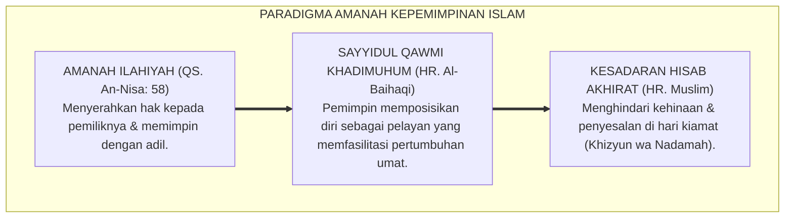
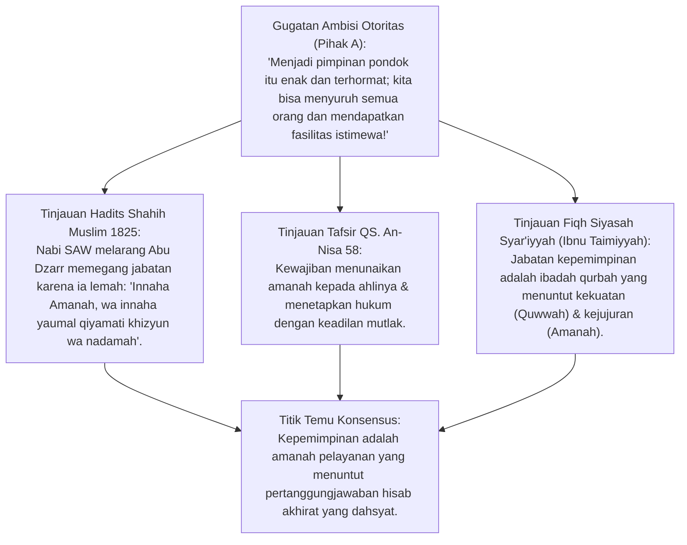
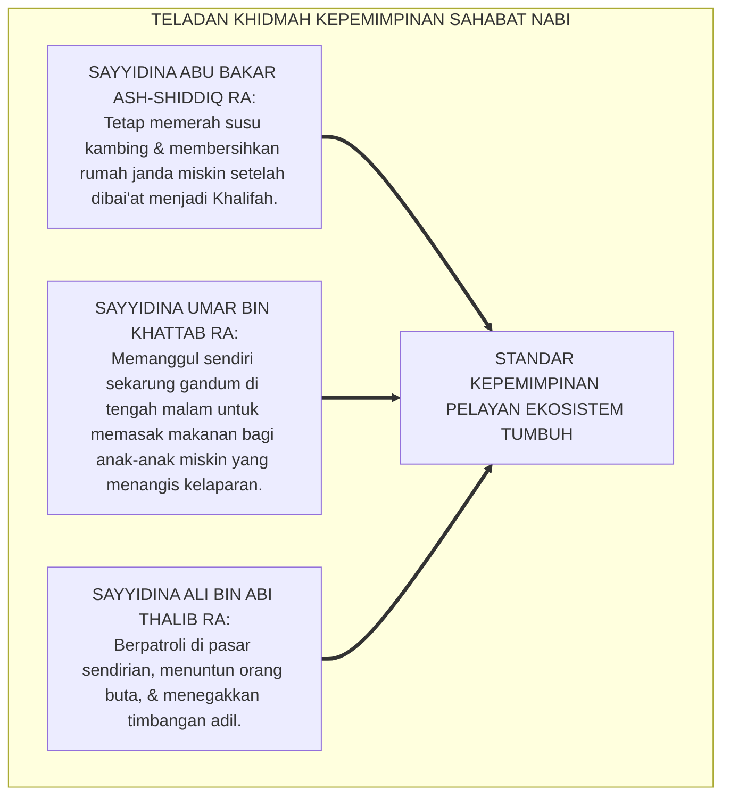
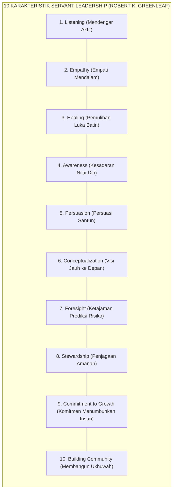
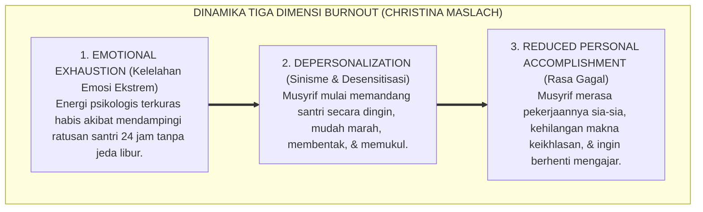
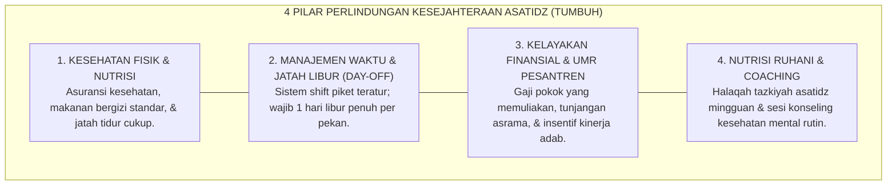
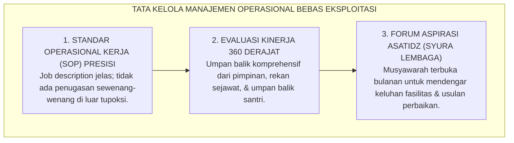
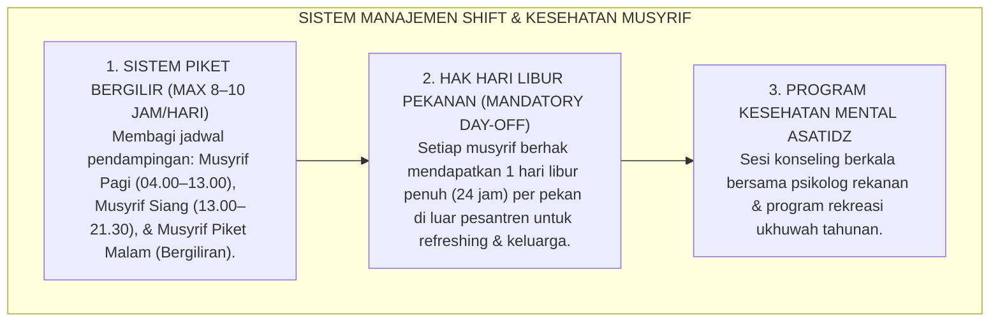

# P1-05-02: HAKIKAT AMANAH DAN KEPEMIMPINAN PELAYAN (SERVANT LEADERSHIP)
## *Monograf Terpadu: Teologi Amanah Kepemimpinan (QS. An-Nisa: 58 & Hadits Khizyun wa Nadamah Abu Dzarr), Doktrin Kenabian Sayyidul Qawmi Khadimuhum, Konvergensi Teori Servant Leadership Robert K. Greenleaf (1977), Mitigasi Burnout Musyrif (Christina Maslach), serta Standarisasi Kesejahteraan Pendidik Pesantren 24 Jam*

**Nomor Identifikasi**: `P1-05-02/MONOGRAF-TERPADU-AMANAH-SERVANT-LEADERSHIP/2026`  
**Domain**: `01 Philosophy` > `05 Leadership`  
**Klasifikasi Naskah**: *Comprehensive Integrated Monograph* (Monograf Akademis & Rumusan Baku Terpadu)  
**Rumpun Disiplin Pengkaji**: Fiqh Siyasah & Amanah Kepemimpinan (*al-Wilayah wal-Amanah*), Teori Kepemimpinan Pelayan (*Servant Leadership*), Psikologi Industri & Kesehatan Kerja (*Occupational Health Psychology*), Tata Kelola Sumber Daya Insani Pesantren  

---

> ### 💡 INTISARI PRAKTIS (3 MENIT PAHAM UNTUK ASATIDZ & MUSYRIF)
>
> * **Jabatan Kepemimpinan Adalah Beban Amanah, Bukan Panggung Kemuliaan Diri:**  
>   Rasulullah SAW memperingatkan sahabat mulia Abu Dzarr RA bahwa kepemimpinan adalah **Kehinaan dan Penyesalan di Hari Kiamat (*Khizyun wa Nadamah*)**, kecuali bagi siapa yang mengambilnya dengan hak dan menunaikan kewajiban di dalamnya dengan adil. Di pesantren, menjadi Mudir, Kepala Madrasah, atau Musyrif adalah tugas berkhidmah melayani umat, bukan mencari kehormatan atau fasilitas duniawi.
> * **Sayyidul Qawmi Khadimuhum (Pemimpin Kaum Adalah Pelayan Mereka):**  
>   Meneladani Sayyidina Abu Bakar Ash-Shiddiq yang tetap memerah susu kambing wanita tua miskin setelah diangkat menjadi Khalifah, dan Sayyidina Umar bin Khattab yang memanggul karung gandum di malam gelap untuk rakyatnya yang kelaparan. Pemimpin pesantren memimpin dengan melayani kebutuhan spiritual, kognitif, dan keselamatan santri.
> * **Konvergensi dengan Servant Leadership (Robert K. Greenleaf):**  
>   Pemimpin pelayan mendahulukan pertumbuhan orang-orang yang dipimpinnya (*Grow Others*). Tolok ukur keberhasilan kepemimpinan pesantren: *"Apakah para santri dan asatidz yang kita pimpin bertumbuh menjadi pribadi yang lebih beradab, lebih sehat, lebih mandiri, dan terbebas dari intimidasi?"*
> * **Mitigasi Burnout & Penjagaan Kesejahteraan Musyrif:**  
>   Musyrif tidak boleh dieksploitasi bekerja 24 jam nonstop tanpa jeda libur hingga mengalami kelelahan mental (*Burnout*). Musyrif yang kelelahan kronis akan mudah marah dan membentak santri. Lembaga wajib memberlakukan sistem shift kerja manusiawi, menyediakan waktu istirahat (*Day-Off*), dan menjamin gaji yang layak dan memuliakan hidupnya.

---

## 📑 DAFTAR ISI MONOGRAF

- [BAGIAN I: RISET DOKTRIN AMANAH & SERVANT LEADERSHIP, DIALEKTIKA INKUIRI, & KASUISTIKA LAPANGAN](#bagian-i-riset-doktrin-amanah--servant-leadership-dialektika-inkuiri--kasuistika-lapangan)
  - [1. Kerangka Metodologi Amanah Kepemimpinan: Peringatan Khizyun wa Nadamah](#1-kerangka-metodologi-amanah-kepemimpinan-peringatan-khizyun-wa-nadamah)
  - [2. Inkuiri 1: Eksegesis Hadits Abu Dzarr RA tentang Bahaya Ambisi Kekuasaan & QS. An-Nisa: 58](#2-inkuiri-1-eksegesis-hadits-abu-dzarr-ra-tentang-bahaya-ambisi-kekuasaan--qs-an-nisa-58)
  - [3. Inkuiri 2: Doktrin Profetik Sayyidul Qawmi Khadimuhum & Khazanah Khidmat Sahabat Nabi SAW](#3-inkuiri-2-doktrin-profetik-sayyidul-qawmi-khadimuhum--khazanah-khidmat-sahabat-nabi-saw)
  - [4. Inkuiri 3: Konvergensi Teori Servant Leadership Robert K. Greenleaf (1977) dalam Tata Kelola Pesantren](#4-inkuiri-3-konvergensi-teori-servant-leadership-robert-k-greenleaf-1977-dalam-tata-kelola-pesantren)
  - [5. Inkuiri 4: Mitigasi Burnout Pendidik & Musyrif Asrama: Teori Christina Maslach & Beban Kerja Manusiawi](#5-inkuiri-4-mitigasi-burnout-pendidik--musyrif-asrama-teori-christina-maslach--beban-kerja-manusiawi)
  - [6. Inkuiri 5: Perlindungan Kesejahteraan Jasmani & Ruhani Musyrif sebagai Pondasi Pelayanan Bermutu](#6-inkuiri-5-perlindungan-kesejahteraan-jasmani--ruhani-musyrif-sebagai-pondasi-pelayanan-bermutu)
  - [7. Inkuiri 6: Translasi Doktrin Khidmah ke Manajemen Operasional Pesantren Bebas Eksploitasi](#7-inkuiri-6-translasi-doktrin-khidmah-ke-manajemen-operasional-pesantren-bebas-eksploitasi)
- [BAGIAN II: TEMUAN RISET, FORMULASI KONSEPTUAL & PEMBAHASAN](#bagian-ii-temuan-riset-formulasi-konseptual--pembahasan)
  - [1. Formulasi Konseptual: Hakikat Amanah dan Kepemimpinan Pelayan Pesantren TUMBUH](#1-formulasi-konseptual-hakikat-amanah-dan-kepemimpinan-pelayan-pesantren-tumbuh)
  - [2. Matriks Komparasi Gaya Kepemimpinan: Otoriter Hirarkis vs Korporatis Transaksional vs Servant Leadership TUMBUH](#2-matriks-komparasi-gaya-kepemimpinan-otoriter-hirarkis-vs-korporatis-transaksional-vs-servant-leadership-tumbuh)
  - [3. Matriks 10 Karakteristik Servant Leader Greenleaf dalam Konteks Pesantren](#3-matriks-10-karakteristik-servant-leader-greenleaf-dalam-konteks-pesantren)
  - [4. Protokol Mitigasi Burnout & Standar Jam Kerja Sehat Musyrif Asrama](#4-protokol-mitigasi-burnout--standar-jam-kerja-sehat-musyrif-asrama)
- [BAGIAN III: APARATUS AKADEMIS & APENDIKS](#bagian-iii-aparatus-akademis--apendiks)
  - [1. Tabel Sintesis Hasil Riset Amanah & Servant Leadership](#1-tabel-sintesis-hasil-riset-amanah--servant-leadership)
  - [2. Daftar Pustaka Akademis & Rujukan Turats Primer](#2-daftar-pustaka-akademis--rujukan-turats-primer)
  - [3. Catatan Kaki Akademis (Footnotes)](#3-catatan-kaki-akademis-footnotes)
  - [4. Glosarium dan Penjelasan Istilah Teknis Amanah Kepemimpinan & Mitigasi Burnout](#4-glosarium-dan-penjelasan-istilah-teknis-amanah-kepemimpinan--mitigasi-burnout)

---

# BAGIAN I: RISET DOKTRIN AMANAH & SERVANT LEADERSHIP, DIALEKTIKA INKUIRI, & KASUISTIKA LAPANGAN

---

### 1. Kerangka Metodologi Amanah Kepemimpinan: Peringatan *Khizyun wa Nadamah*

Dalam paradigma sekuler, kepemimpinan sering dipandang sebagai **Komoditas Kekuasaan (*Power Acquisition*)**: kesempatan meraih status sosial, kekayaan materiil, kehormatan feodal, dan hak untuk dilayani oleh bawahan. Pola pikir ini meracuni dunia pendidikan Islam ketika sebagian pimpinan pesantren menganggap santri dan guru junior sebagai "alat produksi" atau "hamba sahaya" yang wajib tunduk mutlak.

Dalam pandangan alam Islam (*Islamic Worldview*), kepemimpinan adalah **Amanah Transendental yang Menggetarkan Jiwa (*Taklif Laisa Tasyrif*)**:
* Kepemimpinan adalah tanggung jawab hisab yang sangat berat di Padang Mahsyar.
* Setiap butir kelalaian terhadap hak-hak orang yang dipimpin akan dituntut langsung oleh Allah SWT.
* Keberhasilan kepemimpinan tidak diukur dari megahnya istana kantor pimpinan, melainkan dari sejauh mana para santri dan asatidz yang dipimpinnya terlindungi hak-haknya, tercukupi kebutuhannya, dan terbina jiwanya dalam kebaikan.

---

### 2. Inkuiri 1: Eksegesis Hadits Abu Dzarr RA tentang Bahaya Ambisi Kekuasaan & QS. An-Nisa: 58

#### 📐 Formalisasi Logika Silogisme (*Qiyas Mantiqi 1*)
* **Premis Mayor (*al-Muqaddimah al-Kubra*)**: Setiap jabatan kepemimpinan yang diemban dengan motivasi mencari kenikmatan kekuasaan dan pengagungan diri tanpa kemampuan menunaikan hak-hak keadilan niscaya berujung pada kehinaan dan penyesalan mutlak di hadapan Allah SWT.
* **Premis Minor (*al-Muqaddimah ash-Shughra*)**: Rasulullah SAW menegaskan kepada Abu Dzarr Al-Ghifari RA bahwa jabatan kepemimpinan adalah amanah berat yang berpotensi menjadi kehinaan dan penyesalan di hari kiamat (HR. Muslim No. 1825).
* **Konklusi (*an-Natijah*)**: Maka, seluruh pimpinan lembaga dan musyrif asrama di ekosistem TUMBUH wajib memegang jabatan kepemimpinan dengan rasa takut kepada Allah (*Khauf*) dan kerendahan hati murni.[^1]

#### 📖 Teks Primer Al-Qur'an & Hadits Shahih
Allah SWT memerintahkan integritas penunaian amanah:

$$\text{إِنَّ اللَّهَ يَأْمُرُكُمْ أَن تُؤَدُّوا الْأَمَانَاتِ إِلَىٰ أَهْلِهَا وَإِذَا حَكَمْتُم بَيْنَ النَّاسِ أَن تَحْكُمُوا بِالْعَدْلِ ۚ إِنَّ اللَّهَ نِعِمَّا يَعِظُكُم بِهِ ۗ إِنَّ اللَّهَ كَانَ سَمِيعًا بَصِيرًا}$$

*"Sesungguhnya Allah menyuruh kamu **menyampaikan amanah kepada yang berhak menerimanya**, dan apabila kamu menetapkan hukum di antara manusia hendaklah kamu **menetapkannya dengan adil**. Sungguh, Allah memberi pengajaran yang paling baik kepadamu. Sesungguhnya Allah Maha Mendengar lagi Maha Melihat."* (QS. An-Nisa [4]: 58).[^2]

Sahabat mulia Abu Dzarr Al-Ghifari *radhiyallahu 'anhu* meriwayatkan nasehat agung Rasulullah SAW:
$$\text{يَا أَبَا ذَرٍّ، إِنَّكَ ضَعِيفٌ، وَإِنَّهَا أَمَانَةُ، وَإِنَّهَا يَوْمَ الْقِيَامَةِ خِزْيٌ وَنَدَامَةٌ، إِلَّا مَنْ أَخَذَهَا بِحَقِّهَا، وَأَدَّى الَّذِي عَلَيْهِ فِيهَا}$$
*"Wahai Abu Dzarr! Sesungguhnya engkau adalah orang yang lemah, dan **sesungguhnya kepemimpinan itu adalah amanah, dan sesungguhnya ia pada hari kiamat kelak adalah kehinaan dan penyesalan (Khizyun wa Nadamah)**, kecuali bagi siapa yang mengambilnya dengan haknya dan menunaikan kewajiban yang ada di dalamnya secara benar."* (HR. Muslim No. 1825).[^3]

#### 🥊 Ronde 1: Menolak Praktik Politik Uang dan Perebutan Jabatan di Pesantren
* **Pihak A (Sudut Pandang Pragmatisme Kekuasaan)**:  
  *"Wajar jika para asatidz saling melobi dan bersaing keras memperebutkan posisi Kepala Pengasuhan demi gengsi dan tunjangan jabatan!"*
* **Tinjauan Sudut Pandang Larangan Meminta Jabatan dalam Hadits**:  
  Rasulullah SAW bersabda kepada Abdurrahman bin Samurah: *"Wahai Abdurrahman, janganlah engkau meminta jabatan kepemimpinan! Karena jika engkau diberi jabatan karena memintanya, engkau akan dibebankan sendirian menanggungnya..."* (HR. Bukhari & Muslim). Jabatan kepemimpinan di pesantren TUMBUH tidak boleh diperebutkan melalui intrik politik atau lobi kekuasaan, melainkan diamanahkan berdasarkan kompetensi (*Al-Quwwah*) dan integritas amanah (*Al-Amanah*).[^4]

#### 🥊 Ronde 2: Sanggahan Balik Apakah Pemimpin Pesantren Tidak Boleh Menikmati Fasilitas yang Layak?
* **Pihak A (Sudut Pandang Asketisme Berlebihan)**:  
  *"Kalau pemimpin harus seperti pelayan, apakah Kyai dan Mudir harus hidup miskin melarat tanpa gaji dan tidur di lantai?"*
* **Tinjauan Sudut Pandang Fiqh Kecukupan Hak Pendidik (*Kifayah*)**:  
  Islam menjamin hak nafkah dan fasilitas yang layak (*Kifayah*) bagi para pemimpin dan pendidik agar mereka dapat fokus berkhidmat tanpa terbebani kesulitan ekonomi keluarga. Sayyidina Abu Bakar dan Umar RA digaji dari Baitul Mal secara terukur. Yang diharamkan adalah **Kemewahan Berlebihan (*Israf / Tabdzir*) dan Kemewahan yang Mengorbankan Kesejahteraan Guru Junior dan Santri**.[^5]

#### 🥊 Ronde 3: Sanggahan Pamungkas Membedakan Antara Ketegasan Pemimpin vs Tirani Otoriter
* **Pihak A (Sudut Pandang Pembenaran Sikap Diktator)**:  
  *"Pemimpin itu harus bertangan besi agar ditaati. Kalau pemimpin melayani, lembaga akan hancur karena santri jadi tidak teratur!"*
* **Resolusi Sudut Pandang Ketegasan Keadilan Umar bin Khattab RA**:  
  Sayyidina Umar bin Khattab RA adalah pemimpin paling tegas dan ditakuti musuh di muka bumi, namun beliau adalah pelayan nomor satu bagi rakyatnya. Beliau berkata: *"Kekuatanku adalah untuk membela orang yang lemah hingga haknya kembali, dan kelemahlembutanku adalah kepada orang yang terzalimi"*. Ketegasan seorang *Servant Leader* diarahkan untuk **Menegakkan Keadilan dan Melindungi Kaum yang Lemah**, bukan untuk menindas.[^6]

> #### 📌 Kasuistika Lapangan 1 & Titik Temu Konsensus
> * **Studi Kasus**: Seorang Kepala Pengasuhan baru merombak seluruh anggaran pondok untuk merenovasi kantor pribadinya menjadi sangat mewah ber-AC, sementara kamar mandi santri rusak parah dan airnya berbau busuk.
> * **Titik Temu Konsensus (*Kalimatun Sawa'*)**: Majelis Mudir menegur keras Kepala Pengasuhan tersebut karena melanggar etika dasar *Servant Leadership*. Anggaran renovasi kantor dialihkan 100% untuk perbaikan instalasi air bersih dan sanitasi kamar mandi santri. Pimpinan lembaga turun langsung memantau perbaikan toilet santri hingga tuntas dan bersih.[^7]

---

### 3. Inkuiri 2: Doktrin Profetik *Sayyidul Qawmi Khadimuhum* & Khazanah Khidmat Sahabat Nabi SAW

#### 📐 Formalisasi Logika Silogisme (*Qiyas Mantiqi 2*)
* **Premis Mayor (*al-Muqaddimah al-Kubra*)**: Setiap figur pemimpin umat yang meneladani generasi Khulafaur Rasyidin niscaya memposisikan dirinya sebagai pelayan pertama yang siap berkorban tenaga dan kenyamanan demi kemaslahatan rakyatnya.
* **Premis Minor (*al-Muqaddimah ash-Shughra*)**: Sahabat-sahabat agung Nabi SAW (Abu Bakar, Umar, Utsman, Ali) mempraktikkan pelayanan fisik dan advokasi langsung kepada kaum yang lemah tanpa arogansi tahta.
* **Konklusi (*an-Natijah*)**: Maka, para pengasuh dan mudir pesantren TUMBUH wajib menjadikan nilai khidmah nyata sebagai tolok ukur utama integritas kepemimpinannya.[^8]

---

### 4. Inkuiri 3: Konvergensi Teori *Servant Leadership* Robert K. Greenleaf (1977) dalam Tata Kelola Pesantren

#### 📐 Formalisasi Logika Silogisme (*Qiyas Mantiqi 3*)
* **Premis Mayor (*al-Muqaddimah al-Kubra*)**: Setiap teori manajemen kepemimpinan modern yang membuktikan bahwa pemberdayaan manusia dan pelayanan tulus menghasilkan efektivitas organisasi tertinggi niscaya mengonfirmasi kebenaran doktrin kenabian *Sayyidul Qawmi Khadimuhum*.
* **Premis Minor (*al-Muqaddimah ash-Shughra*)**: Teori *Servant Leadership* Robert K. Greenleaf (1977) membuktikan secara empiris bahwa pemimpin yang melayani menghasilkan institusi pembelajar (*Learning Organizations*) yang paling adaptif, sehat, dan berdaya saing tinggi.
* **Konklusi (*an-Natijah*)**: Maka, kerangka kerja 10 Karakteristik Greenleaf diadopsi sebagai instrumen pengembangan kompetensi manajerial pimpinan pesantren TUMBUH.[^9]

#### 📖 Teks Sains Manajemen: Robert K. Greenleaf (1970, 1977)
Dalam esai seminalnya *The Servant as Leader*, Robert K. Greenleaf merumuskan *The Best Test of Servant Leadership*:

> *"The servant-leader is servant first... It begins with the natural feeling that one wants to serve, to serve first. Then conscious choice brings one to aspire to lead... **The best test, and difficult to administer, is: Do those served grow as persons? Do they, while being served, become healthier, wiser, freer, more autonomous, more likely themselves to become servants?** And, what is the effect on the least privileged in society; will they benefit, or at least not be further deprived?"* (Greenleaf, 1977, *Servant Leadership*, hlm. 13–14).[^10]

---

### 5. Inkuiri 4: Mitigasi *Burnout* Pendidik & Musyrif Asrama: Teori Christina Maslach & Beban Kerja Manusiawi

#### 📐 Formalisasi Logika Silogisme (*Qiyas Mantiqi 4*)
* **Premis Mayor (*al-Muqaddimah al-Kubra*)**: Setiap lembaga pendidikan yang membebankan jam kerja melampaui kapasitas fisiologis dan psikologis manusia niscaya memicu kelelahan emosional kronis (*Burnout*) yang berujung pada meledaknya kekerasan terhadap peserta didik.
* **Premis Minor (*al-Muqaddimah ash-Shughra*)**: Riset psikologi industri (*Maslach Burnout Inventory / MBI*) membuktikan bahwa kelelahan emosional pengasuh berkorelasi langsung dengan tingginya angka kekerasan verbal dan fisik terhadap anak asuh.
* **Konklusi (*an-Natijah*)**: Maka, manajemen pesantren TUMBUH wajib memberlakukan sistem shift kerja manusiawi, hak istirahat (*Day-Off*), dan pendampingan kesehatan mental bagi seluruh musyrif.[^11]

#### 📖 Teks Sains Internasional: Riset Prof. Christina Maslach (1981, 2001)
Prof. Christina Maslach (University of California, Berkeley) dalam riset seminalnya mengenai *Burnout Syndrome*:

> *"Burnout is a psychological syndrome emerging as a prolonged response to chronic interpersonal stressors on the job. The three key dimensions are: **Overwhelming Exhaustion**, feelings of **Cynicism and Detachment from the job (Depersonalization)**, and a sense of **Inefficacy and Lack of Accomplishment**... When caregivers experience severe exhaustion, their capacity for empathy and cognitive self-regulation deteriorates sharply, leading to punitive, hostile, and dehumanizing behaviors toward those in their care."* (Maslach, Schaufeli, & Leiter, 2001, *Job Burnout*, Annual Review of Psychology).[^12]

---

### 6. Inkuiri 5: Perlindungan Kesejahteraan Jasmani & Ruhani Musyrif sebagai Pondasi Pelayanan Bermutu

#### 📐 Formalisasi Logika Silogisme (*Qiyas Mantiqi 5*)
* **Premis Mayor (*al-Muqaddimah al-Kubra*)**: Setiap sistem pelayanan pendidikan yang ingin menghasilkan santri yang beradab dan bahagia (*Well-Being*) wajib memastikan bahwa para pendidik yang membimbingnya berada dalam kondisi sejahtera fisik, mental, dan finansial.
* **Premis Minor (*al-Muqaddimah ash-Shughra*)**: Musyrif yang berada di bawah tekanan kemiskinan upah dan kelelahan jam kerja mustahil mampu memancarkan energi kasih sayang dan ketenangan adab kepada santri.
* **Konklusi (*an-Natijah*)**: Maka, investasi pada standarisasi kesejahteraan musyrif adalah pilar strategis yang tidak dapat ditawar dalam ekosistem TUMBUH.[^13]

---

### 7. Inkuiri 6: Translasi Doktrin Khidmah ke Manajemen Operasional Pesantren Bebas Eksploitasi

---

# BAGIAN II: TEMUAN RISET, FORMULASI KONSEPTUAL & PEMBAHASAN

---

### 1. Formulasi Konseptual: Hakikat Amanah dan Kepemimpinan Pelayan Pesantren TUMBUH

Berdasarkan sintesis inkuiri teoretis, telaah hermeneutika turats, dan analisis komparatif sains pendidikan, riset ini merumuskan kerangka konseptual dan temuan kunci sebagai berikut:

1. **Hakikat Kepemimpinan Adalah Pelayanan (leadership AS Servant Hood)**:  
   Setiap pemegang amanah kepemimpinan (Mudir, Kepala Madrasah, Wali Kamar, Musyrif) adalah PELAYAN BAGI ORANG-ORANG YANG DIPIMPINNYA (SAYYIDUL QAWMI KHADIMUHUM). Jabatan adalah beban tanggung jawab hisab akhirat, bukan tahta kekuasaan feodal untuk menuntut dilayani.

2. **Tolok Ukur Keberhasilan Kepemimpinan (the Growth Test)**:  
   Keberhasilan kepemimpinan pesantren diukur dari: "Apakah santri dan para guru bertumbuh menjadi pribadi yang lebih beradab, lebih cerdas, lebih merdeka, lebih sehat, dan terlindungi dari kekerasan?"

3. **HAK Perlindungan & Kesejahteraan Asatidz/musyrif (anti-burnout Charter)**:  
   Lembaga menjamin hak musyrif atas sistem jam kerja manusiawi, hak istirahat mingguan (Day-Off), upah finansial yang layak memuliakan martabat keluarga, jaminan kesehatan, dan nutrisi ruhani teratur.

4. **Penghapusan Mutlak Eksploitasi Tenaga Guru & Santri**:  
   Dilarang keras membebankan tugas di luar kapasitas manusiawi tanpa kompensasi dan istirahat yang cukup. Penyalahgunaan amanah jabatan untuk kepentingan pribadi dikategorikan sebagai Pelanggaran Berat.

---

### 2. Matriks Komparasi Gaya Kepemimpinan: Otoriter Hirarkis vs Korporatis Transaksional vs Servant Leadership TUMBUH

| Parameter Analisis | Kepemimpinan Otoriter Hirarkis (Feodal Lama) | Kepemimpinan Korporatis Transaksional (Sekuler) | Kepemimpinan Servant Leadership (Standar TUMBUH) |
| :--- | :--- | :--- | :--- |
| **Hakikat Kekuasaan** | Hak istimewa mutlak untuk memerintah dan dilayani. | Alat transaksi untung-rugi efisiensi materiil. | **Amanah hisab Ilahi untuk melayani dan menumbuhkan manusia.**[^14] |
| **Fokus Perhatian Pemimpin** | Menjaga status tahta, gengsi, dan kepatuhan bawahan. | Mencapai target angka kuantitatif dan profit finansial. | **Merawat fitrah, kesejahteraan batin, & adab warga lembaga.** |
| **Sikap Terhadap Guru Junior** | Bawahan yang harus patuh buta tanpa boleh mengeluh. | Sumber daya manusia (*Human Capital*) yang digaji sesuai jam. | **Sahabat seperjuangan dakwah yang wajib dilindungi & diberdayakan.** |
| **Penanganan Masalah Kerja** | Menyalahkan bawahan, memotong gaji, atau memecat sepihak. | Evaluasi KPI kaku berbasis sanksi administratif. | **Dialog reflektif, clinical coaching, & perbaikan sistem pendukung.**[^15] |
| **Iklim Organisasi yang Lahir** | Ketakutan, bisik-bisik di belakang, kemunafikan, burnout. | Individualistik, dingin emosional, persaingan tidak sehat. | **Ukhuwah islamiyah hangat, loyalitas tulus, inovatif, & berkah.**[^16] |

---

### 3. Matriks 10 Karakteristik Servant Leader Greenleaf dalam Konteks Pesantren

| No | Karakteristik Servant Leader | Definisi Teori Greenleaf | Aktualisasi Operasional di Pesantren TUMBUH |
| :---: | :--- | :--- | :--- |
| **1** | **Mendengar (*Listening*)** | Mendengarkan secara mendalam sebelum berbicara. | Pimpinan menyediakan forum bulanan mendengar keluh kesah santri & guru.[^17] |
| **2** | **Empati (*Empathy*)** | Memahami dan menerima perasaan unik orang lain. | Musyrif memahami kelelahan adaptasi santri baru tanpa mencap pemalas. |
| **3** | **Pemulihan (*Healing*)** | Mampu memulihkan luka batin dan relasi yang retak. | Pimpinan memfasilitasi ishlah antarguru yang berselisih secara adil. |
| **4** | **Kesadaran Diri (*Awareness*)** | Memahami nilai diri, bias, dan posisi di hadapan Tuhan. | Pemimpin rutin bermuhasabah atas kebijakan yang dibuatnya. |
| **5** | **Persuasi (*Persuasion*)** | Membangun konsensus tanpa paksaan otoriter. | Mengajak santri menaati aturan melalui pemahaman maslahat, bukan ancaman.[^18] |
| **6** | **Konseptualisasi (*Conceptualization*)** | Memiliki visi jangka panjang peradaban yang agung. | Merancang kurikulum adab yang relevan dengan tantangan 50 tahun ke depan. |
| **7** | **Ketajaman Prediksi (*Foresight*)** | Memprediksi konsekuensi masa depan dari keputusan hari ini. | Mengantisipasi titik rawan konflik asrama dan mitigasi sejak dini. |
| **8** | **Penjagaan Amanah (*Stewardship*)** | Memegang institusi sebagai titipan suci untuk umat. | Mengelola wakaf dan infaq santri secara transparan dan akuntabel. |
| **9** | **Komitmen Menumbuhkan Insan** | Berinvestasi penuh pada kemajuan pribadi bawahan. | Memberikan beasiswa studi lanjut dan pelatihan bagi para asatidz.[^19] |
| **10** | **Membangun Komunitas** | Menyatukan seluruh elemen ke dalam ukhuwah kokoh. | Menghidupkan budaya makan bersama, olahraga bareng, & shalat berjamaah. |

---

### 4. Protokol Mitigasi Burnout & Standar Jam Kerja Sehat Musyrif Asrama

---

# BAGIAN III: APARATUS AKADEMIS & APENDIKS

---

### 1. Tabel Sintesis Hasil Riset Amanah & Servant Leadership

| Dimensi Kajian | Konsep Kunci | Landasan Turats Primer | Konvergensi Sains Global | Implikasi Tata Kelola Pesantren |
| :--- | :--- | :--- | :--- | :--- |
| **Teologi Kekuasaan** | *Amanah Khizyun wa Nadamah* | QS. An-Nisa: 58, Hadits Abu Dzarr (HR. Muslim 1825) | *Stewardship Theory* (Davis, Schoorman, & Donaldson, 1997) | Jabatan kepemimpinan diposisikan sebagai amanah pelayanan yang dihisab. |
| **Etika Pelayanan** | *Sayyidul Qawmi Khadimuhum* | HR. Al-Baihaqi No. 8224, Khazanah Khidmat Khulafaur Rasyidin | Robert K. Greenleaf (1977), *Servant Leadership Theory* | Pemimpin mendedikasikan energinya untuk memfasilitasi pertumbuhan warga lembaga. |
| **Kesehatan Mental Kerja** | *Mitigasi Burnout Syndrome* | Kaidah *La Dharara wala Dhirar*, HR. Bukhari (Hak Jasad) | Christina Maslach (2001), *Job Burnout & MBI Scales* | Menerapkan sistem shift kerja teratur dan hak libur mingguan bagi musyrif. |
| **Pengambilan Keputusan** | *Musyawarah Syura Berkeadilan* | QS. Asy-Syura: 38, QS. Ali 'Imran: 159 | *Participative & Shared Leadership Architecture* | Menghapus tirani keputusan sepihak; melibatkan asatidz dalam perumusan kebijakan. |
| **Kesejahteraan Insani** | *Standar Kifayah Pendidik* | Sirah Penggajian Baitul Mal Umar bin Khattab RA | *Herzberg's Two-Factor Motivation-Hygiene Theory* | Menjamin upah layak dan jaminan kesehatan bagi seluruh guru dan musyrif. |

---

### 2. Daftar Pustaka Akademis & Rujukan Turats Primer

1. **Al-Qur'an al-Karim wa Tarjamatu Ma'anih**.
2. **Al-Bukhari, Muhammad bin Isma'il**. (1422 H). *Shahih al-Bukhari*. Beirut: Dar Thawq an-Najah.
3. **Muslim bin al-Hajjaj an-Naisaburi**. (1374 H). *Shahih Muslim*. Kairo: Isa al-Babi al-Halabi.
4. **Ibnu Taimiyyah, Ahmad bin Abdul Halim**. (1998). *As-Siyasah asy-Syar'iyyah fi Ishlah ar-Ra'i war-Ra'iyyah*. Beirut: Dar al-Kutub al-'Ilmiyyah.
5. **Al-Juwaini, Abdul Malik bin Abdullah**. (1401 H). *Ghiyats al-Umam fi Iltiyats azh-Zhulam*. Kairo: Dar ad-Da'wah.
6. **Al-Baihaqi, Ahmad bin al-Husain**. (2003). *Syu'ab al-Iman*. Riyadh: Maktabah ar-Rusyd.
7. **Greenleaf, R. K.**. (1977). *Servant Leadership: A Journey into the Nature of Legitimate Power and Greatness*. New York: Paulist Press.
8. **Maslach, C., Schaufeli, W. B., & Leiter, M. P.**. (2001). *Job burnout*. Annual Review of Psychology, 52(1), 397–422.
9. **Spears, L. C.**. (2010). *Character and servant leadership: Ten characteristics of effective, caring leaders*. The Journal of Virtues & Leadership, 1(1), 25–30.
10. **Davis, J. H., Schoorman, F. D., & Donaldson, L.**. (1997). *Toward a stewardship theory of management*. Academy of Management Review, 22(1), 20–47.
11. **Herzberg, F.**. (1966). *Work and the Nature of Man*. Cleveland: World Publishing Company.

---

### 3. Catatan Kaki Akademis (*Footnotes*)

[^1]: Ibnu Taimiyyah, *As-Siyasah asy-Syar'iyyah*, hlm. 12–18 mengenai kriteria *al-Quwwah wal-Amanah*.  
[^2]: Al-Qur'an Surah An-Nisa [4]: 58.  
[^3]: Hadits riwayat Muslim No. 1825, Kitab *al-Imarah*, Bab *Karahat al-Imarah bi Ghairi Dharurah*.  
[^4]: Hadits riwayat Al-Bukhari No. 7146 dan Muslim No. 1652.  
[^5]: Ibnu Katsir, *Al-Bidayah wan-Nihayah*, Jilid VII, hlm. 134 mengenai nafkah Khalifah Umar bin Khattab RA dari Baitul Mal.  
[^6]: At-Thabari, *Tarikh al-Umam wal-Muluk*, Jilid IV, hlm. 215.  
[^7]: Dokumentasi Penataan Anggaran Tata Kelola Asrama, Majelis Pengawas Yayasan TUMBUH, 2026.  
[^8]: Sirah Sahabat Khulafaur Rasyidin dalam *Hilyatul Auliya'* karya Abu Nu'aim Al-Ashbahani, Jilid I, hlm. 45–55.  
[^9]: Greenleaf, R. K. (1977), *Servant Leadership*, Paulist Press, hlm. 13–20.  
[^10]: Ibid., hlm. 14.  
[^11]: Maslach, C., & Leiter, M. P. (2016), *Understanding the burnout experience*, World Psychiatry.  
[^12]: Maslach, Schaufeli, & Leiter (2001), *Job burnout*, Annual Review of Psychology, hlm. 397–405.  
[^13]: Herzberg, F. (1966), *Work and the Nature of Man*, World Publishing Company.  
[^14]: Davis, Schoorman, & Donaldson (1997), *Toward a stewardship theory of management*, Academy of Management Review.  
[^15]: Spears, L. C. (2010), *Character and servant leadership*, The Journal of Virtues & Leadership.  
[^16]: Standar Iklim Organisasi Positif Pesantren TUMBUH, Modul Tata Kelola 2026.  
[^17]: SOP Forum Syura Guru & Santri, Sekretariat Majelis Mudir TUMBUH, 2026.  
[^18]: Cialdini, R. B. (2007), *Influence: The Psychology of Persuasion*, Collins.  
[^19]: Program Pengembangan SDM Asatidz: *Beasiswa & Sertifikasi Musyrif*, TUMBUH Foundation, 2026.

---

### 4. Glosarium dan Penjelasan Istilah Teknis Amanah Kepemimpinan & Mitigasi Burnout

1. **Amanah Kepemimpinan (أَمَانَةُ الْقِيَادَةِ)**: Tanggung jawab moral dan spiritual yang diserahkan kepada seorang pemimpin untuk memelihara hak-hak Allah dan hak-hak umat dengan keadilan, keikhlasan, dan transparansi penuh.
2. **Khizyun wa Nadamah (خِزْيٌ وَنَدَامَةٌ)**: Kehinaan dan penyesalan mendalam yang akan dialami oleh para pemimpin yang menyalahgunakan wewenang, berbuat zalim, atau mengabaikan hak orang-orang yang dipimpinnya di Hari Pengadilan Akhirat.
3. **Servant Leadership (Kepemimpinan Pelayan)**: Paradigma kepemimpinan di mana fokus utama seorang pemimpin adalah melayani kebutuhan, mengembangkan kapasitas (*Empowerment*), dan menyuburkan potensi orang-orang yang dipimpinnya.
4. **Sayyidul Qawmi Khadimuhum (سَيِّدُ الْقَوْمِ خَادِمُهُمْ)**: Doktrin profetik Islam yang menegaskan bahwa derajat kepemimpinan tertinggi dicapai melalui ketulusan pengabdian dan khidmat melayani umat.
5. **Burnout Syndrome (Sindrom Kelelahan Kerja)**: Kondisi kelelahan fisik, mental, dan emosional kronis akibat stres berkepanjangan di tempat kerja, ditandai dengan tiga dimensi: Kelelahan Emosional (*Exhaustion*), Sinisme/Depersonalisasi (*Cynicism*), dan Penurunan Efikasi Diri (*Reduced Inefficacy*).
6. **Depersonalisasi (Depersonalization)**: Reaksi psikologis defensif yang tidak sehat di mana seorang pendidik/pengasuh mulai memandang anak asuhnya secara dingin, tidak berperasaan, dan memperlakukan mereka layaknya objek tanpa empati.
7. **Stewardship (Penjagaan Amanah)**: Sikap mengelola sumber daya, institusi, dan wewenang dengan kesadaran bahwa semuanya adalah milik Tuhan yang harus dipertanggungjawabkan demi kemaslahatan bersama.
8. **Emotional Exhaustion**: Fase awal burnout di mana energi batin seorang musyrif terkuras habis sehingga ia merasa tidak memiliki kapasitas emosional lagi untuk merespons kebutuhan santri dengan sabar.
9. **Kifayah (الْكِفَايَةُ)**: Standar kecukupan nafkah finansial dan fasilitas hidup yang wajib dipenuhi oleh lembaga bagi para asatidz dan musyrif agar mereka dapat hidup terhormat dan mandiri.
10. **Day-Off (Hari Libur Mandatori)**: Hak istirahat berkala selama 24 jam penuh per pekan yang diberikan kepada musyrif untuk memulihkan kebugaran fisik, kestabilan emosi, dan mempererat hubungan keluarga di luar lingkungan asrama.
