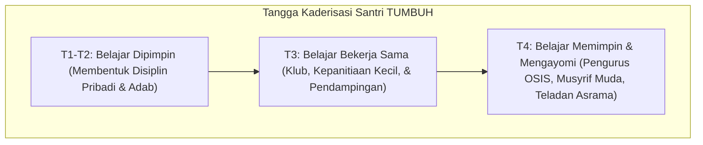

# P1-05-03-Kaderisasi-dan-Kepemimpinan-Santri

## Tujuan
Merumuskan strategi dan falsafah kaderisasi kepemimpinan santri melalui wadah organisasi santri (OSIS/OPPM), kepengurusan asrama, kepanitiaan, dan klub minat-bakat dalam kerangka Tangga TUMBUH (T3 & T4).

---

## Falsafah Kaderisasi Santri: Belajar Memimpin Melalui Khidmah

Kaderisasi kepemimpinan santri bukanlah proses melahirkan "senioritas opresif" (feodalisme santri lama terhadap santri baru), melainkan proses melatih tanggung jawab, empati, manajemen amanah, dan **Qudwah** nyata.

---

## Peran Strategis Organisasi Santri & Sekbid OSIS

Mengacu pada arsitektur pembinaan santri:
* **Sekbid Keagamaan & Ibadah**: Motor penggerak kedisiplinan sholat berjamaah dan keteladanan ibadah.
* **Sekbid Bahasa & Literasi**: Penggerak budaya literasi dan bi'ah lughawiyyah (Arab-Inggris).
* **Sekbid Kedisiplinan & Tata Tertib**: Menjalankan pendampingan dengan prinsip **Disiplin Positif** (tidak diperkenankan melakukan hukuman fisik atau kekerasan pada rekan/adik kelas).
* **Sekbid Bakat, Olahraga & Media**: Wadah aktualisasi kreativitas, sportivitas, dan keterampilan teknologi santri.
* **Sekbid Kepemimpinan & Kaderisasi (Sekbid 5)**: Penyelenggara Latihan Dasar Kepemimpinan Santri (LDKS) dan pemantau regenerasi kepengurusan.

---

## Larangan Mutlak Feodalisme & Kekerasan Senioritas

Ekosistem TUMBUH melarang keras segala bentuk perpeloncoan, kontak fisik tidak beradab, dan penindasan atas nama senioritas.
1. Santri pengurus bertindak sebagai **Kakak Pendamping (*Peer Mentor*)**, bukan algojo.
2. Penanganan pelanggaran santri junior tetap berada di bawah kendali dan supervisi Musyrif/Wali Asrama dan Tim BK, bukan diserahkan liar kepada santri senior tanpa kontrol.
3. Keberhasilan pengurus diukur dari seberapa banyak adik kelas yang bertumbuh secara nyaman, mandiri, dan berakhlak mulia.
