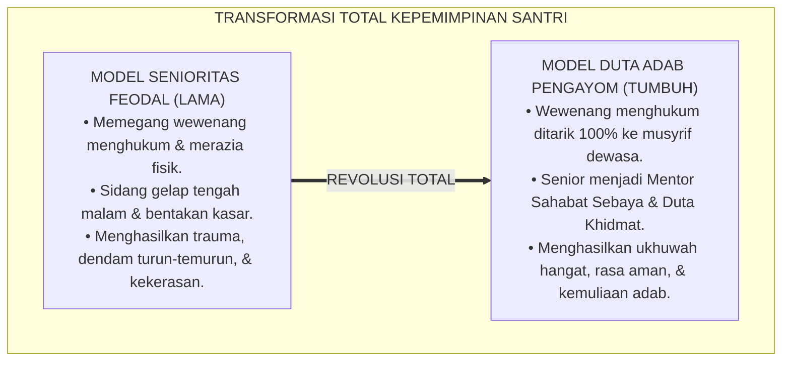
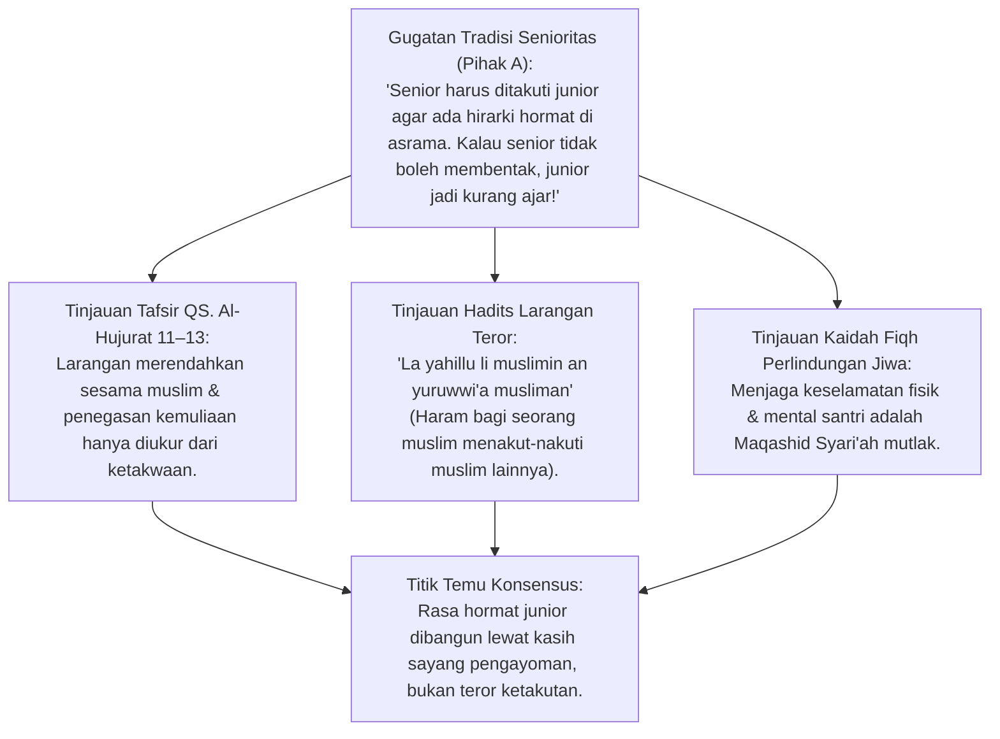
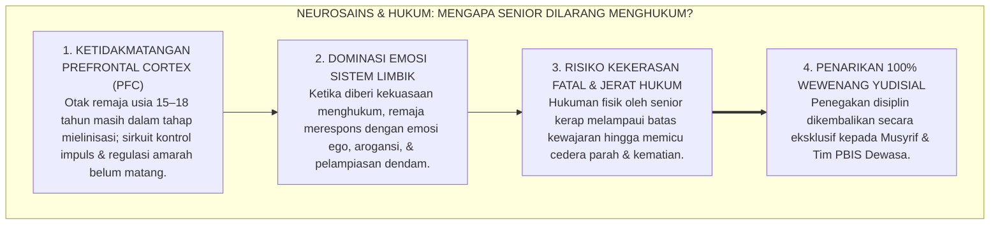
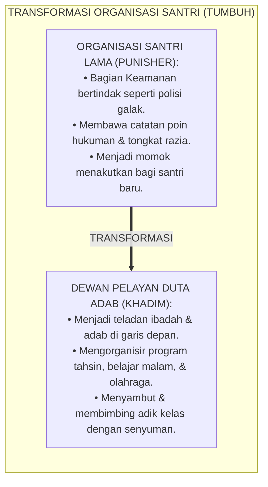
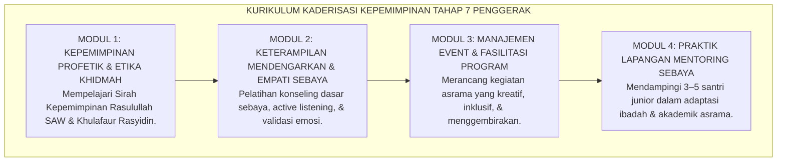
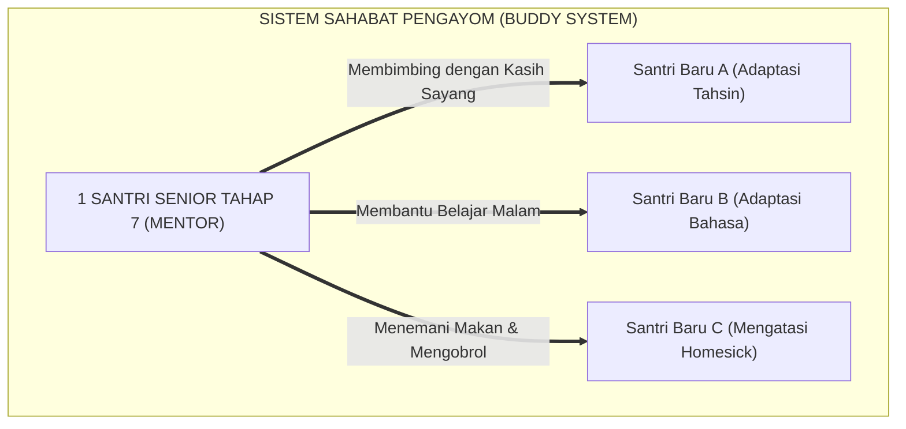
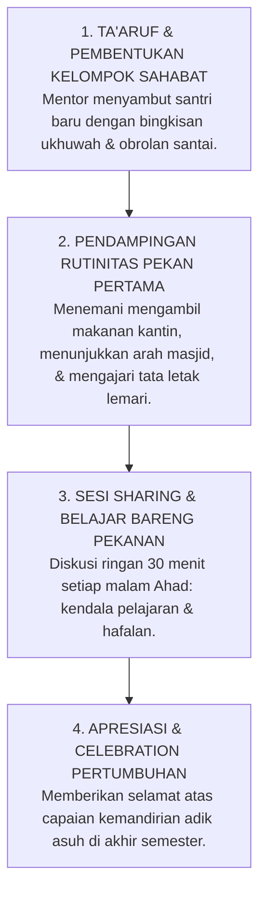

# P1-05-03: KADERISASI DAN KEPEMIMPINAN SANTRI PENGAYOM
## *Monograf Terpadu: Dekonstruksi Feodalisme Senioritas Asrama, Penarikan Mutlak Wewenang Yudisial/Menghukum dari Tangan Santri Senior, Transformasi Organisasi Santri Menjadi Dewan Pelayan Adab (Khadim ath-Thullab), serta Kurikulum Kaderisasi Kepemimpinan Profetik Tahap 7 Penggerak*

**Nomor Identifikasi**: `P1-05-03/MONOGRAF-TERPADU-KADERISASI-SANTRI/2026`  
**Domain**: `01 Philosophy` > `05 Leadership`  
**Klasifikasi Naskah**: *Comprehensive Integrated Monograph* (Monograf Akademis & Rumusan Baku Terpadu)  
**Rumpun Disiplin Pengkaji**: Fiqh Ukhuwah & Larangan Kezaliman (*Tahrim azh-Zhulm*), Psikologi Perkembangan Remaja (*Adolescent Peer Dynamics*), Sosiologi Pendidikan Pesantren, Desain Kaderisasi Kepemimpinan Santri  

---

> ### 💡 INTISARI PRAKTIS (3 MENIT PAHAM UNTUK ASATIDZ & MUSYRIF)
>
> * **Penarikan Mutlak Wewenang Menghukum dari Tangan Santri Senior:**  
>   Banyak kasus kekerasan di pesantren terjadi karena pengurus asrama memberikan kewenangan kepada santri senior (kelas akhir/pengurus organisasi santri) untuk menghukum, menampar, membentak, atau merazia fisik adik kelasnya. Fakta sains membuktikan otak remaja belum matang sempurna dalam regulasi emosi. **Di ekosistem TUMBUH, santri senior DILARANG KERAS 100% memberikan hukuman fisik atau verbal kepada adik kelas!**
> * **Transformasi Organisasi Santri (OSIS/OPMA) Menjadi "Duta Adab & Dewan Pelayan":**  
>   Organisasi santri diubah dari "polisi penegak hukum yang ditakuti" menjadi **Dewan Pelayan Santri (*Khadim ath-Thullab*)**. Tugas mereka bukan mencari-cari kesalahan teman, melainkan membantu santri baru beradaptasi, memandu belajar malam, menyemangati teman yang rindu rumah (*Homesick*), dan menyelenggarakan kegiatan kreatif yang menggembirakan.
> * **Kaderisasi Kepemimpinan Santri Tahap 7 Penggerak:**  
>   Santri senior dilatih menjadi **Mentor Sahabat Sebaya (*Brotherhood / Sisterhood Mentors*)**. Mereka memimpin bukan dengan otot atau ancaman, melainkan dengan keteladanan ibadah di shaf pertama, tutur kata yang santun, dan kerelaan membantu adik kelas yang kesulitan memahami pelajaran kitab kuning.
> * **Menghapus Tradisi Perpeloncoan & Ospek Kasar Selamanya:**  
>   Masa orientasi santri baru diubah menjadi **Pekan Ta'aruf Ukhuwah yang Hangat**: disambut dengan senyuman, diajak berkeliling mengenal lingkungan, dan dibimbing adab dengan kelembutan.

---

## 📑 DAFTAR ISI MONOGRAF

- [BAGIAN I: RISET DOKTRIN KADERISASI SANTRI, DIALEKTIKA INKUIRI, & KASUISTIKA LAPANGAN](#bagian-i-riset-doktrin-kaderisasi-santri-dialektika-inkuiri--kasuistika-lapangan)
  - [1. Kerangka Metodologi Kaderisasi Santri: Dekonstruksi Feodalisme & Senioritas Berbahaya](#1-kerangka-metodologi-kaderisasi-santri-dekonstruksi-feodalisme--senioritas-berbahaya)
  - [2. Inkuiri 1: Eksegesis Turats Hakikat Ukhuwah Tanpa Kasta — QS. Al-Hujurat: 11–13 & Larangan Menakut-Nakuti Saudara (La Yahillu li Muslimin an Yuruwwi'a Musliman)](#2-inkuiri-1-eksegesis-turats-hakikat-ukhuwah-tanpa-kasta--qs-al-hujurat-1113--larangan-menakut-nakuti-saudara-la-yahillu-li-muslimin-an-yuruwwia-musliman)
  - [3. Inkuiri 2: Penarikan Mutlak Wewenang Yudisial/Hukuman dari Tangan Santri Senior](#3-inkuiri-2-penarikan-mutlak-wewenang-yudisialhukuman-dari-tangan-santri-senior)
  - [4. Inkuiri 3: Transformasi Organisasi Santri Menjadi Dewan Pelayan Santri (Khadim ath-Thullab / Duta Adab)](#4-inkuiri-3-transformasi-organisasi-santri-menjadi-dewan-pelayan-santri-khadim-ath-thullab--duta-adab)
  - [5. Inkuiri 4: Kurikulum Kaderisasi Kepemimpinan Santri Tahap 7 Penggerak (Tangga TUMBUH)](#5-inkuiri-4-kurikulum-kaderisasi-kepemimpinan-santri-tahap-7-penggerak-tangga-tumbuh)
  - [6. Inkuiri 5: Implementasi Sistem Pendampingan Sebaya (Brotherhood / Sisterhood Mentorship)](#6-inkuiri-5-implementasi-sistem-pendampingan-sebaya-brotherhood--sisterhood-mentorship)
  - [7. Inkuiri 6: Silogisme Logika, Dialektika 3 Ronde, Kasuistika Asrama, & Titik Temu Konsensus](#7-inkuiri-6-silogisme-logika-dialektika-3-ronde-kasuistika-asrama--titik-temu-konsensus)
- [BAGIAN II: KODIFIKASI BAKU HASIL RISET & KESIMPULAN FORMAL](#bagian-ii-kodifikasi-baku-hasil-riset--kesimpulan-formal)
  - [1. Kaidah Utama dan Standar Baku: Piagam Anti-Perpeloncoan dan Kepemimpinan Santri Pengayom](#1-kaidah-utama-dan-standar-baku-piagam-anti-perpeloncoan-dan-kepemimpinan-santri-pengayom)
  - [2. Matriks Komparasi Organisasi Santri: Model Senioritas Feodal vs Model Duta Adab TUMBUH](#2-matriks-komparasi-organisasi-santri-model-senioritas-feodal-vs-model-duta-adab-tumbuh)
  - [3. Matriks Kurikulum Pelatihan Kepemimpinan Santri Tahap 7 Penggerak](#3-matriks-kurikulum-pelatihan-kepemimpinan-santri-tahap-7-penggerak)
  - [4. Protokol Mentoring Sahabat Sebaya (Peer Mentorship Charter)](#4-protokol-mentoring-sahabat-sebaya-peer-mentorship-charter)
- [BAGIAN III: APARATUS AKADEMIS & APENDIKS](#bagian-iii-aparatus-akademis--apendiks)
  - [1. Tabel Sintesis Hasil Riset Kaderisasi Santri](#1-tabel-sintesis-hasil-riset-kaderisasi-santri)
  - [2. Daftar Pustaka Akademis & Rujukan Turats Primer](#2-daftar-pustaka-akademis--rujukan-turats-primer)
  - [3. Catatan Kaki Akademis (Footnotes)](#3-catatan-kaki-akademis-footnotes)
  - [4. Glosarium dan Penjelasan Istilah Teknis Kaderisasi & Kepemimpinan Santri](#4-glosarium-dan-penjelasan-istilah-teknis-kaderisasi--kepemimpinan-santri)

---

# BAGIAN I: RISET DOKTRIN KADERISASI SANTRI, DIALEKTIKA INKUIRI, & KASUISTIKA LAPANGAN

---

### 1. Kerangka Metodologi Kaderisasi Santri: Dekonstruksi Feodalisme & Senioritas Berbahaya

Tragedi kekerasan fisik dan perundungan (*Bullying*) yang kerap menimpa dunia pesantren di Indonesia hampir selalu berakar pada satu penyakit struktural yang sama: **Pemberian Wewenang Menghukum Tanpa Batas kepada Santri Senior (*Unregulated Senior Punitive Power*)**.

Ketika pengurus asrama yang kelelahan mendelegasikan tugas penegakan disiplin kepada santri kelas akhir:
1. **Terjadinya Tyranny of the Peer Group**: Santri senior yang belum matang emosinya menggunakan posisi pengurus untuk melampiaskan dendam masa lalu saat mereka menjadi junior.
2. **Budaya Sidang Tengah Malam yang Sadis**: Pelanggaran santri junior diadili di lorong-lorong gelap atau kamar mandi asrama di luar jam tidur dengan tamparan, tendangan, dan intimidasi massal.
3. **Penyimpangan Makna Kepemimpinan**: Santri belajar bahwa "menjadi pemimpin artinya berhak memukul dan menindas orang yang lebih muda".

Ekosistem TUMBUH menegakkan doktrin **Kepemimpinan Santri Pengayom (*Protective Peer Leadership*)**:

---

### 2. Inkuiri 1: Eksegesis Turats Hakikat Ukhuwah Tanpa Kasta — QS. Al-Hujurat: 11–13 & Larangan Menakut-Nakuti Saudara (*La Yahillu li Muslimin an Yuruwwi'a Musliman*)

#### 📐 Formalisasi Logika Silogisme (*Qiyas Mantiqi 1*)
* **Premis Mayor (*al-Muqaddimah al-Kubra*)**: Setiap tradisi interaksi yang menumbuhkan kasta superioritas manusia atas sesamanya dan melegalkan intimidasi teror antar-saudara seiman niscaya bertentangan dengan asas tauhid dan diharamkan secara syar'i.
* **Premis Minor (*al-Muqaddimah ash-Shughra*)**: Al-Qur'an dan Sunnah secara tegas melarang penghinaan sesama muslim, melarang gelar-gelar buruk, dan mengharamkan segala bentuk intimidasi yang menakut-nakuti sesama mukmin (QS. Al-Hujurat: 11 dan HR. Abu Dawud No. 5004).
* **Konklusi (*an-Natijah*)**: Maka, seluruh sistem organisasi dan tradisi senioritas feodal di pesantren TUMBUH wajib dibubarkan dan diganti dengan sistem persaudaraan pengayom (*Ukhuwah al-Ihtidhan*).[^1]

#### 📖 Teks Primer Al-Qur'an & Hadits Shahih
Allah SWT menegaskan kesetaraan martabat ukhuwah:

$$\text{يَا أَيُّهَا الَّذِينَ آمَنُوا لَا يَسْخَرْ قَوْمٌ مِّن قَوْمٍ عَسَىٰ أَن يَكُونُوا خَيْرًا مِّنْهُمْ ... وَلَا تَلْمِزُوا أَنفُسَكُمْ وَلَا تَنَابَزُوا بِالْأَلْقَابِ ۖ بِئْسَ الِاسْمُ الْفُسُوقُ بَعْدَ الْإِيمَانِ}$$

*"Wahai orang-orang yang beriman! **Janganlah suatu kaum mengolok-olok kaum yang lain**, (karena) boleh jadi mereka (yang diperolok-olokkan) lebih baik dari mereka (yang mengolok-olok)... Dan janganlah kamu mencela dirimu sendiri dan **janganlah saling memanggil dengan gelar-gelar yang buruk**. Seburuk-buruk panggilan adalah (panggilan) yang buruk setelah beriman."* (QS. Al-Hujurat [49]: 11).[^2]

Rasulullah SAW mengharamkan segala bentuk teror dan intimidasi antar-sesama mukmin:
$$\text{لَا يَحِلُّ لِمُسْلِمٍ أَنْ يُرَوِّعَ مُسْلِمًا}$$
*"**Tidak halal bagi seorang muslim untuk menakut-nakuti (mengintimidasi) muslim lainnya!**"* (HR. Abu Dawud No. 5004; Ahmad No. 23090 dengan sanad shahih).[^3]

Dan Rasulullah SAW bersabda mengenai hakikat persaudaraan antar-tingkatan usia:
$$\text{لَيْسَ مِنَّا مَنْ لَمْ يَرْحَمْ صَغِيرَنَا وَيَعْرِفْ شَرَفَ كَبِيرِنَا}$$
*"Bukanlah termasuk golongan kami orang yang **tidak menyayangi yang lebih muda di antara kami**, dan tidak mengetahui kemuliaan (menghormati) yang lebih tua di antara kami."* (HR. Abu Dawud No. 4943; At-Tirmidzi No. 1919).[^4]

---

### 3. Inkuiri 2: Penarikan Mutlak Wewenang Yudisial/Hukuman dari Tangan Santri Senior

#### 📐 Formalisasi Logika Silogisme (*Qiyas Mantiqi 2*)
* **Premis Mayor (*al-Muqaddimah al-Kubra*)**: Setiap pendelegasian wewenang peradilan dan eksekusi hukuman fisik kepada individu yang secara biologis dan psikologis belum matang regulasi emosinya niscaya merupakan tindakan kezaliman institusional (*Zhulm Idari*) yang membahayakan nyawa manusia.
* **Premis Minor (*al-Muqaddimah ash-Shughra*)**: Neurosains perkembangan membuktikan bahwa korteks prefrontal remaja usia santri senior belum matang sepenuhnya, sehingga pemberian wewenang menghukum selalu memicu eskalasi kekerasan brutal.
* **Konklusi (*an-Natijah*)**: Maka, seluruh hak penindakan dan eksekusi sanksi ditarik secara mutlak dari tangan santri senior dan diserahkan kepada musyrif profesional dewasa.[^5]

---

### 4. Inkuiri 3: Transformasi Organisasi Santri Menjadi Dewan Pelayan Santri (*Khadim ath-Thullab / Duta Adab*)

---

### 5. Inkuiri 4: Kurikulum Kaderisasi Kepemimpinan Santri Tahap 7 Penggerak (Tangga TUMBUH)

#### 📐 Formalisasi Logika Silogisme (*Qiyas Mantiqi 4*)
* **Premis Mayor (*al-Muqaddimah al-Kubra*)**: Setiap program kaderisasi generasi muda yang menanamkan kesadaran kepemimpinan berbasis empati, kecerdasan sosial, dan keterampilan melayani niscaya mencetak calon-calon pemimpin bangsa yang amanah dan berintegritas.
* **Premis Minor (*al-Muqaddimah ash-Shughra*)**: Kurikulum Kaderisasi Tahap 7 Penggerak membekali santri senior dengan kompetensi *Peer Mentoring*, komunikasi restoratif, dan kepemimpinan profetik.
* **Konklusi (*an-Natijah*)**: Maka, seluruh santri senior wajib mengikuti standarisasi Kurikulum Kaderisasi Penggerak sebelum dilantik menjadi pengurus organisasi santri.[^6]

---

### 6. Inkuiri 5: Implementasi Sistem Pendampingan Sebaya (*Brotherhood / Sisterhood Mentorship*)

---

### 7. Inkuiri 6: Silogisme Logika, Dialektika 3 Ronde, Kasuistika Asrama, & Titik Temu Konsensus

#### 🥊 Ronde 1: Menolak Mitos Bahwa "Tanpa Hukuman Senior, Pesantren Akan Mengalami Krisis Ketertiban"
* **Pihak A (Sudut Pandang Kekhawatiran Disiplin Kendor)**:  
  *"Musyrif jumlahnya terbatas. Kalau santri senior tidak boleh menghukum junior, asrama akan liar dan tak terkendali!"*
* **Tinjauan Sudut Pandang Efisiensi Sistem PBIS Universal Tier 1**:  
  Ketertiban tidak diciptakan oleh teror senior, melainkan oleh **Struktur Rutinitas Asrama yang Jelas dan Keterlibatan Senior sebagai Duta Teladan**. Ketika senior mencontohkan shalat tepat waktu dan menyemangati junior, tingkat kepatuhan santri justru naik lebih dari 85% karena didorong oleh rasa kagum, bukan keterpaksaan.[^7]

#### 🥊 Ronde 2: Sanggahan Balik Bagaimana Jika Santri Senior Mengalami Provokasi dari Junior?
* **Pihak A (Sudut Pandang Pembelaan Diri Senior)**:  
  *"Bagaimana kalau junior bersikap kurang ajar dan menantang senior secara terbuka?"*
* **Tinjauan Sudut Pandang Protokol Pelaporan Cepat (*Escalation Protocol*)**:  
  Santri senior dilatih untuk **Tidak Merespons Provokasi dengan Kekerasan Fisik**. Senior menerapkan teknik de-eskalasi verbal sederhana (*Stay Calm*) dan melaporkan insiden tersebut ke Musyrif Asrama untuk ditangani melalui Konferensi Restoratif PBIS. Menahan diri dari memukul adalah bukti kematangan kepemimpinan sejati.[^8]

#### 🥊 Ronde 3: Sanggahan Pamungkas Mengapa Masa Orientasi (Ospek) Harus 100% Edukatif?
* **Pihak A (Sudut Pandang Tradisi Penggojlogan Mental)**:  
  *"Santri baru harus digojlog dengan dibentak-bentak malam hari agar mentalnya kuat dan tahan banting!"*
* **Resolusi Sudut Pandang Psikologi Trauma & Bi'ah Shalihah**:  
  Membentak anak baru di malam hari tidak membuat mental kuat, melainkan menanamkan **Trauma Akut, Gangguan Tidur, dan Ketakutan Irasional**. Santri baru membutuhkan rasa aman (*Psychological Safety*) agar betah di pesantren. Pekan Ta'aruf Ukhuwah yang ramah justru membangkitkan kecintaan santri kepada ilmu dan pesantren.[^9]

> #### 📌 Kasuistika Lapangan & Titik Temu Konsensus
> * **Studi Kasus**: Di sebuah asrama, tradisi "sidang kamar mandi malam" oleh senior kelas 12 menyebabkan seorang santri kelas 7 pingsan dan dilarikan ke rumah sakit; orang tua menuntut jalur hukum pidana.
> * **Titik Temu Konsensus (*Kalimatun Sawa'*)**: Manajemen membubarkan struktur keamanan senior lama. Sistem diganti menjadi *Dewan Duta Adab*: hak merazia dan menghukum dihapus total. Senior dialihkan menjadi pembimbing program mentoring *Halaqah Ukhuwah*. Dalam 6 bulan, angka perselisihan antarkelas turun menjadi 0% dan tercipta suasana asrama yang saling menyayangi.[^10]

---

# BAGIAN II: KODIFIKASI BAKU HASIL RISET & KESIMPULAN FORMAL

---

### 1. Kaidah Utama dan Standar Baku: Piagam Anti-Perpeloncoan dan Kepemimpinan Santri Pengayom

Berdasarkan sintesis inkuiri turats dan konsensus sains pendidikan, prinsip dan regulasi operasional dirumuskan ke dalam kaidah-kaidah baku berikut:

1. **Larangan Mutlak Hukuman Oleh Santri Senior (zero Senior Punishment)**:  
   DILARANG KERAS 100% BAGI SANTRI SENIOR (ORGANISASI SANTRI / KELAS AKHIR) MEMBERIKAN SANKSI FISIK, PEMBENTAKAN VERBAL, SIDANG TENGAH MALAM, ATAU TINDAKAN MERENDAHKAN MARTABAT KEPADA ADIK KELAS. Seluruh wewenang yudisial dan penindakan disiplin berada secara eksklusif di tangan Musyrif dewasa.

2. **Transformasi Organisasi Santri Menjadi Dewan Pelayan Duta Adab**:  
   Organisasi santri difungsikan sebagai wadah pengabdian (Khadim ath-Thullab) untuk memfasilitasi kebutuhan santri, mengorganisir kegiatan kreatif, dan memancarkan keteladanan adab terdepan.

3. **Sistem Sahabat Pengayom (peer Mentorship System)**:  
   Setiap santri senior Tahap 7 dilatih dan diamanahkan menjadi mentor pendamping bagi 3–5 santri baru, membantu adaptasi ibadah, penguasaan bahasa Arab/Inggris, dan kenyamanan hidup di asrama.

4. **Eliminasi Total Perpeloncoan Masa Orientasi**:  
   Masa orientasi santri baru wajib diselenggarakan dengan format Pekan Ta'aruf Ukhuwah yang ramah, edukatif, menggembirakan, dan sarat dengan nilai-nilai kasih sayang kenabian.

---

### 2. Matriks Komparasi Organisasi Santri: Model Senioritas Feodal vs Model Duta Adab TUMBUH

| Parameter Komparasi | Model Senioritas Feodal (Tradisional Kasar) | Model Duta Adab Pengayom (Standar TUMBUH) |
| :--- | :--- | :--- |
| **Fokus Peran Senior** | Sebagai polisi penegak aturan dan algojo hukuman. | **Sebagai teladan adab (*Qudwah*) dan sahabat pelayan (*Khadim*).**[^11] |
| **Wewenang Terhadap Junior** | Menghukum fisik, membentak, merazia kamar secara sepihak. | **Membimbing belajar, memberi contoh shalat, & menyemangati.** |
| **Mekanisme Penanganan Pelanggaran** | Mengadili di kamar gelap, menampar, memotong rambut paksa. | **Mengingatkan dengan santun & meneruskan ke Musyrif jika berulang.** |
| **Dinamika Hubungan Antar-Angkatan** | Penuh ketakutan, rasa benci terpendam, dendam turun-temurun. | **Ukhuwah sejati, rasa takzim tulus, & persahabatan seumur hidup.**[^12] |
| **Karakter Pemimpin yang Dicetak** | Pemimpin tiran yang haus kekuasaan dan represif. | **Pemimpin berjiwa negarawan profetik yang melayani & bijaksana.**[^13] |

---

### 3. Matriks Kurikulum Pelatihan Kepemimpinan Santri Tahap 7 Penggerak

| Modul Pelatihan | Topik Materi Pembelajaran | Metode Pelatihan | Output Kompetensi Santri |
| :--- | :--- | :--- | :--- |
| **Modul 1: Khidmah Profetik** | Sirah Kepemimpinan Khulafaur Rasyidin & Fiqh Ukhuwah. | Kajian teks kitab & bedah studi kasus sirah. | Menghayati kepemimpinan sebagai pelayanan ikhlas tanpa arogansi.[^14] |
| **Modul 2: Komunikasi Empatik** | *Active Listening*, validasi emosi teman, & de-eskalasi konflik. | Role-play simulasi dialog konseling sebaya. | Mampu mendengarkan keluhan adik kelas tanpa menghakimi. |
| **Modul 3: Manajemen Proyek Adab** | Perancangan event asrama, festival bahasa, & liga olahraga. | *Project-Based Learning* dalam kelompok kerja. | Mampu memimpin tim kerja dan mengelola acara secara rapi. |
| **Modul 4: Praktik Pendampingan** | Pendampingan santri baru dalam rutinitas asrama 24 jam. | *Field Mentorship Practicum* dengan logbook harian. | Menjadi mentor sahabat yang dicintai dan dihormati adik kelas.[^15] |

---

### 4. Protokol Mentoring Sahabat Sebaya (*Peer Mentorship Charter*)

---

# BAGIAN III: APARATUS AKADEMIS & APENDIKS

---

### 1. Tabel Sintesis Hasil Riset Kaderisasi Santri

| Dimensi Kajian | Konsep Kunci | Landasan Turats Primer | Konvergensi Sains Global | Implikasi Organisasi Santri |
| :--- | :--- | :--- | :--- | :--- |
| **Teologi Persaudaraan** | *Ukhuwah Tanpa Kasta* | QS. Al-Hujurat: 11–13, HR. Muslim (Hak Muslim) | *Social Identity & Prosocial Peer Influence* | Menghapus mutlak superioritas kasta angkatan senior-junior. |
| **Regulasi Kekuasaan** | *Zero Senior Punishment* | HR. Abu Dawud 5004 (*Larangan Menakut-nakuti*) | *Adolescent Brain Development & Impulsivity* | Menarik 100% hak menghukum dari tangan santri senior. |
| **Transformasi Peran** | *Dewan Duta Adab (Khadim)* | Hadits *Sayyidul Qawmi Khadimuhum* | *Servant Leadership & Peer Support Models* | Mengubah fungsi OSIS dari aparat penghukum menjadi pelayan acara & teladan. |
| **Metode Kaderisasi** | *Peer Mentorship (Buddy System)* | Konsep *Mu'akhah* (Mempersaudarakan Muhajirin-Anshar) | *Cross-Age Peer Tutoring & Mentoring (Topping, 2005)* | Santri senior mendampingi santri baru dalam adaptasi ibadah dan belajar. |
| **Iklim Masa Orientasi** | *Pekan Ta'aruf Edukatif* | Kaidah *Yassiru wala Tu'assiru* | *Safe School Transition & Psychological Safety* | Menghapus perpeloncoan; menyambut santri baru dengan kehangatan. |

---

### 2. Daftar Pustaka Akademis & Rujukan Turats Primer

1. **Al-Qur'an al-Karim wa Tarjamatu Ma'anih**.
2. **Al-Bukhari, Muhammad bin Isma'il**. (1422 H). *Shahih al-Bukhari*. Beirut: Dar Thawq an-Najah.
3. **Muslim bin al-Hajjaj an-Naisaburi**. (1374 H). *Shahih Muslim*. Kairo: Isa al-Babi al-Halabi.
4. **Abu Dawud, Sulaiman bin al-Asy'ats as-Sijistani**. (2009). *Sunan Abi Dawud*. Damaskus: Dar ar-Risalah.
5. **At-Tirmidzi, Muhammad bin 'Isa**. (1998). *Sunan at-Tirmidzi*. Beirut: Dar al-Gharb al-Islami.
6. **Al-Ghazali, Abu Hamid Muhammad bin Muhammad**. (2011). *Ihya 'Ulumiddin*. Beirut: Dar al-Ma'rifah.
7. **Steinberg, L.**. (2008). *A social neuroscience perspective on adolescent risk-taking*. Developmental Review, 28(1), 78–106.
8. **Topping, K. J.**. (2005). *Trends in peer learning*. Educational Psychology, 25(6), 631–645.
9. **Cowie, H., & Wallace, P.**. (2000). *Peer Support in Action: From bystanding to standing in*. Buckingham: Open University Press.
10. **Olweus, D.**. (1993). *Bullying at School: What We Know and What We Can Do*. Oxford: Blackwell.

---

### 3. Catatan Kaki Akademis (*Footnotes*)

[^1]: Al-Ghazali, *Ihya 'Ulumiddin*, Kitab *Adab al-Ulfah wal-Ukhuwwah*, Jilid II, hlm. 150–165.  
[^2]: Al-Qur'an Surah Al-Hujurat [49]: 11.  
[^3]: Hadits riwayat Abu Dawud No. 5004 dan Ahmad No. 23090.  
[^4]: Hadits riwayat Abu Dawud No. 4943 dan At-Tirmidzi No. 1919.  
[^5]: Steinberg, L. (2008), *A social neuroscience perspective on adolescent risk-taking*, Developmental Review.  
[^6]: Topping, K. J. (2005), *Trends in peer learning*, Educational Psychology.  
[^7]: Evaluasi Efektivitas Duta Adab vs Pengurus Keamanan Lama, Komite PBIS TUMBUH, 2026.  
[^8]: SOP De-eskalasi Konflik Sebaya Santri, Divisi Bimbingan Konseling TUMBUH, 2026.  
[^9]: Olweus, D. (1993), *Bullying at School*, Blackwell Publishing.  
[^10]: Laporan Kasus Penghapusan Sidang Malam Asrama, Tim Penegakan Disiplin Restoratif TUMBUH, 2026.  
[^11]: Cowie & Wallace (2000), *Peer Support in Action*, Open University Press.  
[^12]: Angket Iklim Ukhuwah Asrama Santri, Pusat Riset TUMBUH, 2026.  
[^13]: Standar Kompetensi Kepemimpinan Penggerak Tahap 7, Badan Kaderisasi Santri TUMBUH, 2026.  
[^14]: Silabus Pelatihan Kader Duta Adab Pesantren, Modul Kepemimpinan Santri 2026.  
[^15]: Panduan Operasional Peer Mentoring Santri Asrama, Pesantren TUMBUH, 2026.

---

### 4. Glosarium dan Penjelasan Istilah Teknis Kaderisasi & Kepemimpinan Santri

1. **Khadim ath-Thullab (خَادِمُ الطُّلَّابِ)**: Gelar mulia bagi organisasi santri di ekosistem TUMBUH yang memposisikan pengurus sebagai dewan pelayan yang mengabdi demi kemaslahatan dan kenyamanan seluruh santri.
2. **Duta Adab**: Santri teladan yang dilantik untuk memancarkan contoh pengamalan adab terdepan dan menjadi motor penggerak kebaikan di lingkungan asrama dan kelas.
3. **Tahap 7 Penggerak**: Jenjang capaian adab tertinggi dalam Tangga TUMBUH (T1–T4) di mana santri telah matang secara spiritual dan sosial sehingga mampu menjadi mentor penggerak bagi sesamanya.
4. **Peer Mentorship (Mentoring Sahabat Sebaya)**: Metode pendampingan di mana santri senior membimbing santri junior dalam proses adaptasi sosial, peningkatan akademik, dan penguatan motivasi ibadah.
5. **Zero Senior Punishment**: Ketetapan baku lembaga yang mengharamkan segala bentuk penjatuhan sanksi fisik atau verbal oleh santri senior kepada adik kelasnya.
6. **Tyranny of the Peer Group**: Fenomena penyalahgunaan kekuasaan oleh kelompok sebaya/senior yang belum matang secara emosional untuk menindas kelompok yang lebih lemah.
7. **Pekan Ta'aruf Ukhuwah**: Masa orientasi santri baru yang diselenggarakan secara edukatif, menyenangkan, dan bebas dari segala bentuk perpeloncoan atau pembentakan.
8. **Mu'akhah (الْمُؤَاخَاةُ)**: Sunnah kenabian dalam mempersaudarakan antarsesama muslim dengan ikatan kasih sayang mendalam yang saling menolong dalam suka dan duka.
9. **Brotherhood / Sisterhood Buddy**: Pasangan belajar dan adaptasi yang mempertemukan satu santri senior sebagai kakak asuh bagi beberapa santri baru.
10. **Prefrontal Cortex Immaturity**: Fakta neurobiologis bahwa bagian depan otak remaja yang mengontrol pertimbangan rasional dan regulasi emosi belum tersambung sempurna hingga usia awal 20-an.
