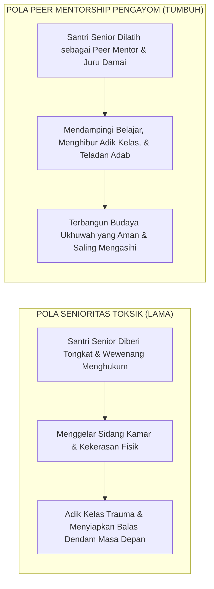
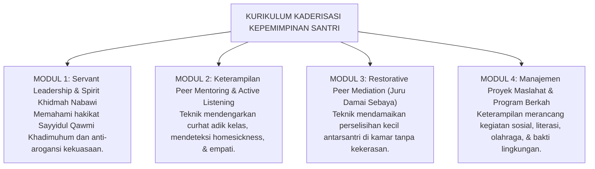

# P1-05-03: KADERISASI DAN KEPEMIMPINAN SANTRI: TRANSFORMASI ORGANISASI ASRAMA
## *Rekonstruksi Peran Santri Senior: Dari Algoritma Penindas Menuju Duta Adab dan Peer Mentors Berjiwa Pengayom*

**Nomor Identifikasi**: `P1-05-03/KADERISASI-SANTRI/2026`  
**Domain**: `01 Philosophy` > `05 Leadership`  
**Dewan Pakar**: `pakar-tata-kelola-qudwah`, `pakar-psikologi-sosial-santri`, `pakar-kuratif-restoratif`

---

## 📑 DAFTAR ISI ANALITIS

1. [1. Problem Struktural: Peran Toksik Organisasi Santri Senior Konvensional](#1-problem-struktural-peran-toksik-organisasi-santri-senior-konvensional)
2. [2. Transformasi Paradigma: Santri Senior sebagai Duta Adab & Pengayom](#2-transformasi-paradigma-santri-senior-sebagai-duta-adab--pengayom)
3. [3. Model Kaderisasi Kepemimpinan Berbasis Khidmah & Peer Mentorship](#3-model-kaderisasi-kepemimpinan-berbasis-khidmah--peer-mentorship)
4. [4. Matriks Komparasi: Organisasi Senior Otoriter vs Organisasi TUMBUH](#4-matriks-komparasi-organisasi-senior-otoriter-vs-organisasi-tumbuh)
5. [5. Implikasi Operasional bagi Struktur Organisasi Santri (OSIS/ISMI)](#5-implikasi-operasional-bagi-struktur-organisasi-santri-osisismi)

---

### 1. Problem Struktural: Peran Toksik Organisasi Santri Senior Konvensional

Di banyak pesantren, pendelegasian wewenang ketertiban asrama kepada organisasi santri senior (kelas 11–12 / pengurus santri) sering kali menjadi bumerang yang memicu krisis kemanusiaan. Santri senior yang belum matang secara emosional dan kognitif diberikan kewenangan yudisial: boleh menghukum fisik, menggelar mahkamah malam, dan membentak adik kelas.

Akibatnya:
* **Lahirnya tirani senioritas (*feudalistic tyranny*)**: Pengurus santri memanfaatkan posisi untuk balas dendam atas perlakuan keras yang mereka terima di masa lalu.
* **Kerapuhan integritas organisasi**: Fokus organisasi santri tereduksi menjadi urusan razia, sidak, dan pemberian hukuman, bukan pelayanan program dan pengayoman ukhuwah.
* **Kerusakan karakter santri senior**: Para pengurus senior tumbuh menjadi pribadi arogan yang terbiasa menggunakan kekuasaan untuk menindas yang lemah (*authoritarian personality disorder*).

---

### 2. Transformasi Paradigma: Santri Senior sebagai Duta Adab & Pengayom

Ekosistem TUMBUH melakukan **penataan ulang radikal (*radical paradigm shift*)** terhadap posisi dan fungsi santri senior:

1. **Penarikan Mutlak Wewenang Yudisial**: Organisasi santri dilarang keras membuat aturan sanksi sendiri, dilarang menghukum fisik, dan dilarang membentak adik kelas. Wewenang kedisiplinan murni berada di tangan Musyrif dan Dewan Asatidz profesional.
2. **Rekonstruksi sebagai Duta Adab (*Safir al-Adab*)**: Santri senior diposisikan sebagai **Duta Adab dan Teladan Hidup**. Ukuran kehormatan dan prestasi seorang pengurus santri dinilai dari seberapa besar keteladanan yang ia tunjukkan dan seberapa hangat perlindungan yang ia berikan kepada santri yang paling lemah di asrama.

---

### 3. Model Kaderisasi Kepemimpinan Berbasis Khidmah & Peer Mentorship

Kaderisasi kepemimpinan santri dalam TUMBUH diarahkan untuk melahirkan **Santri Penggerak (Tahap 7 Kontinuum TUMBUH)** melalui kurikulum kepemimpinan terstruktur:

---

### 4. Matriks Komparasi Organisasi Santri

| Parameter | Organisasi Santri Otoriter Konvensional | Organisasi Santri Pengayom TUMBUH |
| :--- | :--- | :--- |
| **Fungsi Utama** | Lembaga pengawasan & penegakan hukuman fisik/verbal. | **Lembaga pelayanan ukhuwah, teladan adab, & pengayoman.** |
| **Hubungan dengan Yunior** | Atasan ke bawahan (*superior-inferior relationship*). | **Kakak asuh ke adik asuh (*Big Brother/Sister Mentorship*).** |
| **Respon atas Pelanggaran** | Menggelar sidang kamar malam & menjatuhkan sanksi fisik. | **Mendengarkan dengan empati & melaporkan ke musyrif secara objektif.** |
| **Kriteria Keberhasilan** | Banyaknya santri yang dihukum dan takut pada pengurus. | **Tingginya rasa aman, ukhuwah, dan kemandirian santri asuhan.** |

---

### 5. Implikasi Operasional bagi Struktur Organisasi Santri (OSIS/ISMI)

1. **Departemen Duta Adab & Konseling Sebaya**: Mengganti "Bagian Keamanan/Disiplin yang menyeramkan" dengan **Departemen Duta Adab & Juru Damai Sebaya (*Restorative Mediators*)**.
2. **Program Kakak Asuh Kamar (*Brotherhood Mentoring Program*)**: Setiap santri senior MA bertanggung jawab mengayomi 2–3 santri yunior MTs, membantu mereka belajar, dan memastikan mereka tidak mengalami perundungan.
3. **Sumpah Integritas Pengurus Anti-Kekerasan**: Seluruh pengurus santri dilantik dengan ikrar bai'at di hadapan seluruh sivitas pesantren untuk tidak pernah melakukan kekerasan fisik atau intimidasi kepada adik kelas.
