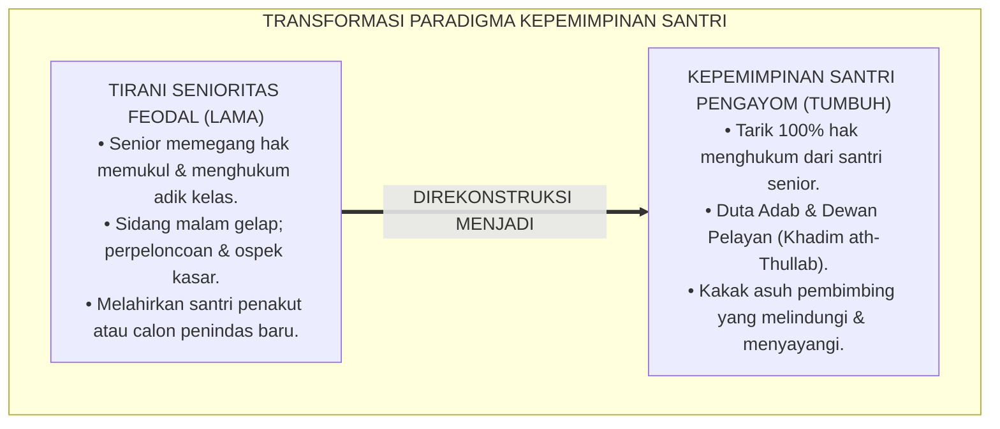
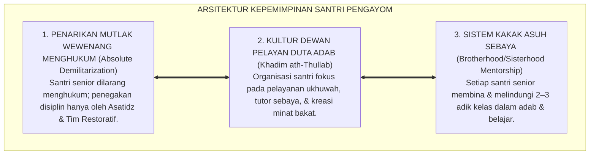
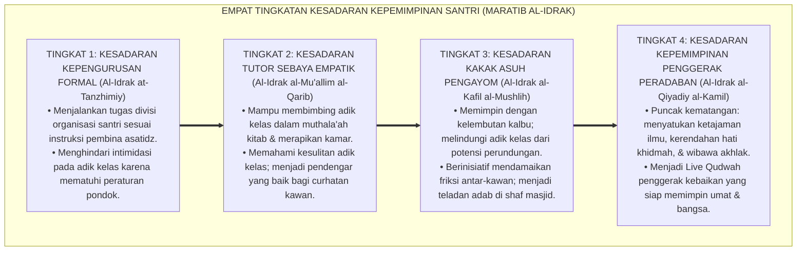
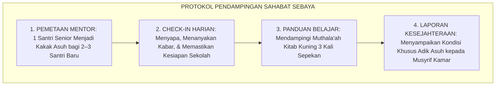
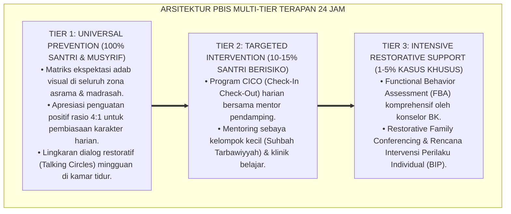

# P1-05-03: KADERISASI DAN KEPEMIMPINAN SANTRI PENGAYOM (PEER LEADERSHIP & BROTHERHOOD)
## *Monograf Riset Akademik: Dekonstruksi Feodalisme Senioritas Asrama, Penarikan Mutlak Wewenang Yudisial/Hukuman dari Tangan Santri Senior, Transformasi Organisasi Santri Menjadi Dewan Pelayan Adab (Khadim ath-Thullab), Serta Kaderisasi Kepemimpinan Penggerak di Pesantren*

**Nomor Identifikasi**: `P1-05-03/MONOGRAF-RISET-KADERISASI-SANTRI/2026`  
**Domain**: `01 Philosophy` > `05 Leadership` (Sub-Modul 03: *Peer Leadership & Kaderisasi Santri*)  
**Klasifikasi Naskah**: *Academic Research Monograph* (Monograf Riset Akademik Fondasional)  
**Rumpun Disiplin Pengkaji**: Fiqh Ukhuwah & Larangan Kezaliman (*Tahrim azh-Zhulm*), Psikologi Perkembangan Remaja (*Adolescent Peer Dynamics*), Sosiologi Pendidikan Pesantren, Desain Kaderisasi Kepemimpinan Santri  

---

> ### 💡 INTISARI EKSEKUTIF (EXECUTIVE SUMMARY)
>
> * **Kelemahan Paradigma Lama: Tirani Senioritas & Pelimpahan Wewenang Menghukum:**  
>   Banyak tragedi kekerasan fatal di pesantren berakar pada pelimpahan wewenang menghukum (*Judicial Power*) dari musyrif kepada santri senior (kelas akhir/pengurus santri). Karena kematangan regulasi emosi otak remaja belum tuntas, santri senior kerap melampiaskan dendam masa lalu melalui "sidang malam", pemukulan fisik, dan razia kasar yang melegalkan perundungan.
> * **Inovasi Konseptual: Zero Hazing & Transformasi Menjadi Khadim ath-Thullab:**  
>   TUMBUH memberlakukan dekrit mutlak: **Menarik 100% Wewenang Menghukum dari Tangan Santri Senior**. Organisasi santri (OSIS/OPMA) direkonstruksi total dari "aparat polisi penindak yang ditakuti" menjadi **Dewan Pelayan Santri (*Khadim ath-Thullab / Duta Adab*)**: bertugas membimbing adik kelas, menyemangati santri yang homesick, memandu muthala'ah belajar malam, dan menyelenggarakan kegiatan kreatif yang membahagiakan.
> * **Formulasi Operasional & Pembuktian Lapangan:**  
>   Monograf ini menguraikan matriks kurikulum kepemimpinan santri pengayom, 4 Tingkatan Kesadaran Kaderisasi Kepemimpinan Santri (*Maratib al-Idrak*), piagam pendampingan mentor sebaya (*Peer Mentorship Charter*), dan etika tata kelola organisasi santri egaliter.

---

## 📑 DAFTAR ISI MONOGRAF

- [BAB I: LANDASAN TEORETIS & DISKURSUS KRITIS](#bab-i-landasan-teoretis--diskursus-kritis)
  - [1. Latar Belakang Masalah: Bahaya Tirani Senioritas dan Pelimpahan Wewenang Menghukum di Asrama](#1-latar-belakang-masalah-bahaya-tirani-senioritas-dan-pelimpahan-wewenang-menghukum-di-asrama)
  - [2. Eksegesis Turats Hakikat Ukhuwah Tanpa Kasta: QS. Al-Hujurat: 11–13 & Larangan Menakut-nakuti Saudara](#2-eksegesis-turats-hakikat-ukhuwah-tanpa-kasta-qs-al-hujurat-1113--larangan-menakut-nakuti-saudara)
  - [3. Tinjauan Neurosains Remaja & Psikologi Sosial: Mengapa Santri Senior Dilarang Menghukum](#3-tinjauan-neurosains-remaja--psikologi-sosial-mengapa-santri-senior-dilarang-menghukum)
  - [4. Transformasi Organisasi Santri Menjadi Dewan Pelayan Adab (Khadim ath-Thullab)](#4-transformasi-organisasi-santri-menjadi-dewan-pelayan-adab-khadim-ath-thullab)
  - [5. Kasuistika Lapangan: Pembongkaran Tradisi Ospek Kasar Menjadi Pekan Ta'aruf Ukhuwah](#5-kasuistika-lapangan-pembongkaran-tradisi-ospek-kasar-menjadi-pekan-taaruf-ukhuwah)
- [BAB II: FORMULASI KONSEPTUAL & PEMBAHASAN MENDALAM](#bab-ii-formulasi-konseptual--pembahasan-mendalam)
  - [1. Eksplanasi Teoretis Kaderisasi dan Kepemimpinan Santri Pengayom TUMBUH](#1-eksplanasi-teoretis-kaderisasi-dan-kepemimpinan-santri-pengayom-tumbuh)
  - [2. Dekomposisi Dimensi & Empat Tingkatan Kesadaran Kepemimpinan Santri (Maratib al-Idrak)](#2-dekomposisi-dimensi--empat-tingkatan-kesadaran-kepemimpinan-santri-maratib-al-idrak)
  - [3. Matriks Kurikulum Pelatihan Kaderisasi Kepemimpinan Santri Penggerak](#3-matriks-kurikulum-pelatihan-kaderisasi-kepemimpinan-santri-penggerak)
  - [4. Protokol Pendampingan Sahabat Sebaya (Peer Mentorship Protocol)](#4-protokol-pendampingan-sahabat-sebaya-peer-mentorship-protocol)
  - [5. Diskusi Filosofis Mendalam & Implikasi bagi Masa Depan Peradaban Pendidikan Islam](#5-diskusi-filosofis-mendalam--implikasi-bagi-masa-depan-peradaban-pendidikan-islam)
- [BAB III: KESIMPULAN & APARATUS AKADEMIS](#bab-iii-kesimpulan--aparatus-akademis)
  - [1. Tabel Sintesis Temuan Riset Kaderisasi Santri](#1-tabel-sintesis-temuan-riset-kaderisasi-santri)
  - [2. Daftar Pustaka Akademis & Rujukan Turats Primer](#2-daftar-pustaka-akademis--rujukan-turats-primer)
  - [3. Catatan Kaki Akademis (Footnotes)](#3-catatan-kaki-akademis-footnotes)
  - [4. Glosarium Istilah Ilmiah & Turats Kepemimpinan Santri](#4-glosarium-istilah-ilmiah--turats-kepemimpinan-santri)

---

# BAB I: LANDASAN TEORETIS & DISKURSUS KRITIS

---

### 1. Latar Belakang Masalah: Bahaya Tirani Senioritas dan Pelimpahan Wewenang Menghukum di Asrama

Tragedi kekerasan fisik dan perundungan (*Bullying*) yang terjadi di dunia pesantren hampir selalu berakar pada satu kesalahan struktural: **Pemberian Hak Menghukum Tanpa Pengawasan kepada Santri Senior (*Unregulated Senior Punitive Power*)**:
* **Siklus Balas Dendam (*Intergenerational Retaliation*)**: Santri senior yang dulunya pernah dipukul merasa memiliki "hak turun-temurun" untuk melampiaskan perlakuan serupa kepada adik kelas baru.
* **Ketiadaan Regulasi Emosi yang Matang**: Remaja usia sekolah menengah secara biologis belum memiliki kematangan korteks prefrontal untuk mengadili perkara secara obyektif tanpa dorongan emosi amarah.
* **Perusakan Makna Kepemimpinan**: Santri junior terdoktrinasi secara keliru bahwa pemimpin adalah sosok yang berhak menindas, menakut-nakuti, dan mengeksploitasi pihak yang lebih lemah.
* **Keniscayaan Doktrin Zero Hazing & Santri Pengayom**: Seluruh kewenangan yudisial/menghukum ditarik 100% dari santri senior; santri senior dilatih menjadi kakak pembimbing yang menyayangi dan melindungi adik kelasnya.[^1]

---

### 2. Eksegesis Turats Hakikat Ukhuwah Tanpa Kasta: QS. Al-Hujurat: 11–13 & Larangan Menakut-nakuti Saudara

Al-Qur'an mengharamkan perbuatan merendahkan, mengolok-olok, dan menindas sesama mukmin:

$$\text{يَا أَيُّهَا الَّذِينَ آمَنُوا لَا يَسْخَرْ قَوْمٌ مِّن قَوْمٍ عَسَىٰ أَن يَكُونُوا خَيْرًا مِّنْهُمْ}$$

*"**Wahai orang-orang yang beriman! Janganlah suatu kaum mengolok-olok kaum yang lain, boleh jadi mereka (yang diperolok-olokkan) lebih baik dari mereka (yang mengolok-olok)**."* (QS. Al-Hujurat [49]: 11).[^2]

Rasulullah ﷺ mengharamkan segala bentuk teror dan intimidasi antar-saudara:

$$\text{لَا يَحِلُّ لِمُسْلِمٍ أَنْ يُرَوِّعَ مُسْلِمًا}$$

*"**Tidak halal bagi seorang muslim menakut-nakuti sesama muslim lainnya**."* (HR. Abu Dawud No. 5004 & Ahmad No. 23064).[^3]

---

### 3. Tinjauan Neurosains Remaja & Psikologi Sosial: Mengapa Santri Senior Dilarang Menghukum

Sains perkembangan neurokognitif (Steinberg, 2008; Sapolsky, 2017) membuktikan bahwa otak remaja (*Adolescent Brain*) mengalami ketidakseimbangan perkembangan:
* Sistem limbik (pusat emosi dan dorongan sosial) telah matang, namun korteks prefrontal (*dlPFC* - pusat kendali impuls dan pertimbangan jangka panjang) belum selesai mengalami mielinisasi hingga usia awal 20-an.
* Memberikan kekuasaan menghukum kepada santri remaja tanpa pengawasan orang dewasa pasti memicu penyalahgunaan kekuasaan (*Group Dynamics & Peer Pressure Abuse*). Oleh karena itu, penegakan disiplin wajib dipegang penuh oleh asatidz dan musyrif dewasa.[^4]

---

### 4. Transformasi Organisasi Santri Menjadi Dewan Pelayan Adab (Khadim ath-Thullab)

TUMBUH merekonstruksi peran organisasi santri:
* Organisasi santri tidak lagi bertindak sebagai "polisi tata tertib", melainkan sebagai **Duta Adab dan Dewan Pelayan (*Khadim ath-Thullab*)**.
* Program kerja difokuskan pada: pendampingan belajar malam, penyelenggaraan festival seni dan sains, pengelolaan mading ilmiah, kebersihan lingkungan bersama, dan penyambutan adik kelas.[^5]

---

### 5. Kasuistika Lapangan: Pembongkaran Tradisi Ospek Kasar Menjadi Pekan Ta'aruf Ukhuwah

* **Studi Kasus: Tradisi Perpeloncoan Orientasi Santri Baru Diubah Menjadi Ta'aruf Penuh Kasih**  
  * **Dilema**: Santri baru kerap mengalami trauma di pekan pertama masuk asrama akibat bentakan panitia orientasi santri senior.
  * **Pola Lama**: Dianggap sebagai "uji nyali dan penempaan mental".
  * **Resolusi Restoratif TUMBUH**: Lembaga merombak total format orientasi: santri senior dilatih sebagai **Kakak Asuh**. Saat kedatangan santri baru, pengurus senior membantu mengangkat koper, tersenyum menyuguhkan minuman hangat, mendampingi keliling asrama, dan mengajarkan tata cara wudhu dan shalat dengan penuh kelembutan. Suasana asrama berubah 180 derajat menjadi sangat membahagiakan, tangisan homesick santri baru berkurang drastis, dan santri baru merasa memiliki keluarga baru yang sangat menyayanginya.[^6]

---

# BAB II: FORMULASI KONSEPTUAL & PEMBAHASAN MENDALAM

---

### 1. Eksplanasi Teoretis Kaderisasi dan Kepemimpinan Santri Pengayom TUMBUH

Ekosistem TUMBUH merumuskan kaderisasi santri ke dalam **Arsitektur Tiga Pilar Kepemimpinan Santri Pengayom (*Arkan Qiyadatil Fityan*)**:

#### 🔬 Pembahasan Mendalam Tiga Pilar:
1. **Penarikan Wewenang Menghukum**: Memutus tuntas rantai kekerasan struktural di pesantren selamanya.[^7]
2. **Kultur Duta Adab**: Mengarahkan energi remaja yang melimpah ke dalam kegiatan positif yang produktif dan membanggakan.[^8]
3. **Sistem Kakak Asuh**: Menanamkan rasa tanggung jawab moral dan kasih sayang nyata pada diri santri senior.[^9]

---

### 2. Dekomposisi Dimensi & Empat Tingkatan Kesadaran Kepemimpinan Santri (Maratib al-Idrak)

Transformasi kepemimpinan santri berlangsung melalui **Empat Tingkatan Kesadaran Kepemimpinan Santri (*Maratib al-Idrak al-Qiyadiy lit-Thullab*)**:

#### 🔄 Narasi Analitis Dinamika Transisi Filosofis Antar-Tingkatan:
* **Transisi Tingkat 1 ke Tingkat 2 (Dari Tugas Formal Menuju Bimbingan Empatik)**: Santri mula-mula sekadar menjaga absensi kegiatan. Pada tingkatan kedua, santri tergerak membantu adik kelas yang kesulitan belajar nahwu-sharaf dengan penuh kesabaran.
* **Transisi Tingkat 2 ke Tingkat 3 (Dari Tutor Belajar Menuju Pengayoman Jiwa)**: Pada tingkatan ketiga, kepemimpinan bertransformasi menjadi kasih sayang: santri senior mengayomi adik kelas, menghibur saat sedih, dan menjadi pelindung keamanan kamar.
* **Transisi Tingkat 3 ke Tingkat 4 (Pencapaian Derajat Penggerak Peradaban)**: Pada tingkatan tertinggi, santri senior tampil sebagai pemimpin profetik sejati: menggerakkan kebaikan komunal dengan teladan akhlak mulia dan menginspirasi generasi sesudahnya (*Rahmatan lil 'Alamin*).[^10]

---

### 3. Matriks Kurikulum Pelatihan Kaderisasi Kepemimpinan Santri Penggerak

| Modul Kaderisasi | Materi Pembelajaran Kunci | Praktik Simulasi Lapangan | Capaian Kematangan |
| :--- | :--- | :--- | :--- |
| **1. Kepemimpinan Profetik** | Sirah Nabawiyyah & Khulafaur Rasyidin.| Diskusi kasus kepemimpinan adil.| Jiwa khidmah & anti-arogansi. |
| **2. Active Listening & Empati** | Teknik mendengar tanpa menghakimi. | Simulasi konseling adik kelas homesick.| Keterampilan empati sosial mendalam.|
| **3. De-eskalasi Konflik Sebaya**| Mediasi perselisihan damai (Ishlah).| Roleplay melerai friksi kawan sekamar.| Kemampuan mendamaikan sengketa. |
| **4. Manajemen Acara Kreatif** | Perancangan festival sains, seni, & olahraga.| Merancang proposal pekan literasi pondok.| Kemandirian organisasi & manajerial.|
| **5. Public Speaking Beradab** | Khutbah hikmah, retorika santun, & riset.| Praktik orasi ilmiah di mimbar santri.| Komunikasi inspiratif & bermartabat.|

---

### 4. Protokol Pendampingan Sahabat Sebaya (Peer Mentorship Protocol)

TUMBUH menetapkan **Piagam Pendampingan Sahabat Sebaya (*Brotherhood/Sisterhood Mentorship Protocol*)**:

Protokol ini menjamin tidak ada santri baru yang merasa kesepian atau terabaikan di lingkungan asrama.[^11]

---

### 5. Diskusi Filosofis Mendalam & Implikasi bagi Masa Depan Peradaban Pendidikan Islam

Kaderisasi kepemimpinan santri pengayom ini membawa dampak transformatif:

* **Memutus Generasi Penindas dan Mencetak Generasi Pelindung**:  
  Santri yang ditempa dalam tradisi kepemimpinan melayani akan tumbuh menjadi pejabat, wakil rakyat, dan pemimpin bangsa yang berjiwa ksatria, tidak korup, dan berpihak pada rakyat kecil.
* **Menjadikan Asrama Pesantren Miniatur Rumah Kasih Sayang (*Baitul Mahabbah*)**:  
  Hilangnya ketakutan terhadap senior mengubah atmosfer asrama menjadi rumah kedua yang hangat, penuh keakraban, dan dirindukan oleh seluruh santri.
* **Mewujudkan Kembali Persaudaraan Kaum Muhajirin dan Anshar**:  
  Inilah keindahan ukhuwah Islamiyah yang dicontohkan para sahabat: yang tua menyayangi yang muda, yang muda menghormati yang tua, bersatu padu menegakkan peradaban Islam (*Rahmatan lil 'Alamin*).[^12]

---

---

### Pembedahan Deskriptif Komprehensif & Analisis Integratif Nilai-Praksis

Penerapan dan operasionalisasi **P1-05-03: KADERISASI DAN KEPEMIMPINAN SANTRI PENGAYOM (PEER LEADERSHIP & BROTHERHOOD)** di lingkungan pesantren TUMBUH bertumpu pada kesatuan sistemik antara nilai syariat dan praksis terukur:

#### A. Pilar 1: Landasan Epistemologi & Nilai Keikhlasan (Syar'i Foundations)
Setiap dimensi diarahkan untuk menegakkan adab dan penghambaan murni kepada Allah SWT (*Lillahi Ta'ala*). Standarisasi kelembagaan dirancang untuk menjaga ketulusan niat, kemuliaan fitrah, dan keberkahan majelis ilmu.

#### B. Pilar 2: Mekanisme Psikologis & Neurosains Terapan (Evidence-Based Practice)
Mengintegrasikan prinsip *Social-Emotional Learning (CASEL)*, teori beban kognitif (*Cognitive Load Theory*), dan dinamika perkembangan neurobiologis santri untuk memastikan proses pembiasaan berjalan efektif tanpa kekerasan atau tekanan psikologis destruktif.

#### C. Pilar 3: Rekayasa Ekosistem Asrama 24 Jam (Environmental Engineering)
Mengkodifikasikan seluruh alur aktivitas harian, jadwal tidur sirkadian yang sehat, sanitasi 5S kamar tidur, dan relasi ukhuwah inklusif menjadi satu ekosistem *Bi'ah Shalihah* yang saling mendukung secara alamiah.

#### D. Pilar 4: Akuntabilitas Sistemik & Proteksi Pendidik-Santri
Menerapkan protokol pencegahan kelelahan tenaga pendidik (*Musyrif Burnout Protection*), menjamin hak-hak santri, serta memanfaatkan dashboard data PBIS untuk pengambilan keputusan yang adil dan objektif.

---

### Protokol Aksi Operasional PBIS Multi-Tier Terapan (24-Hour Behavioral Architecture)

---

# BAB III: KESIMPULAN & APARATUS AKADEMIS

---

### 1. Tabel Sintesis Temuan Riset Kaderisasi Santri

| Dimensi Parameter | Mazhab Senioritas Feodal (Lama) | Model OSIS Sekuler Barat | **Kepemimpinan Santri Pengayom TUMBUH** | Landasan Rujukan Primer | Implikasi Praksis Lapangan |
| :--- | :--- | :--- | :--- | :--- | :--- |
| **Wewenang Menghukum**| Mutlak di tangan santri senior.| Diserahkan ke komite disiplin.| **Ditarik 100% dari Santri Senior.**| HR. Abu Dawud No. 5004; Steinberg.| Penegakan disiplin hanya oleh Asatidz/BK. |
| **Fungsi Organisasi** | Polisi penegak hukum yang ditakuti.| Penyelenggara event seremonial.| **Dewan Pelayan Adab (*Khadim ath-Thullab*).**| QS. Al-Hujurat: 11; Al-Ghazali.| Tutor sebaya, khidmah, & pekan ta'aruf. |
| **Pola Relasi Usia** | Kasta kaku & penindasan junior.| Pergaulan bebas tanpa adab.| **Ukhuwah Kasih Sayang (*Kakak Asuh*).**| HR. Bukhari No. 13; KH. Hasyim Asy'ari.| Senior membimbing & melindungi adik kelas. |
| **Metode Kaderisasi** | Uji nyali, bentakan, & ospek kasar.| Pelatihan kepemimpinan mekanis.| **Pelatihan Kepemimpinan Profetik & Empati.**| QS. An-Nahl: 125; Sapolsky (2017).| Active listening & de-eskalasi konflik. |
| **Profil Lulusan** | Pribadi tiranik atau trauma rendah diri.| Pemimpin pragmatis pencari kuasa.| **Insan Adabi Berjiwa Ksatria & Pengayom.**| QS. Al-Fath: 29; Al-Attas (1980). | Pemimpin adil, penyayang, & berintegritas. |

---

### 2. Daftar Pustaka Akademis & Rujukan Turats Primer

1. **Al-Qur'an al-Karim wa Tarjamatu Ma'anihi**.
2. **Muslim bin al-Hajjaj an-Naisaburi**. (1427 H). *Shahih Muslim*. Riyadh: Dar Thayyibah.
3. **Abu Dawud Sulaiman bin al-Asy'ats as-Sijistani**. (1430 H). *Sunan Abi Dawud*. Riyadh: Dar al-Hadharah.
4. **Ahmad bin Hanbal**. (1421 H). *Musnad al-Imam Ahmad bin Hanbal*. Beirut: Mu'assasah ar-Risalah.
5. **Al-Ghazali, Abu Hamid Muhammad bin Muhammad**. (2011). *Ihya' 'Ulumiddin* (Kitab Adab al-Ulfah wal Ukhuwwah). Beirut: Dar al-Ma'rifah.
6. **Asy'ari, Muhammad Hasyim**. (1415 H). *Adab al-'Alim wal-Muta'allim*. Jombang: Maktabah At-Turats Al-Islami.
7. **Al-Attas, Syed Muhammad Naquib**. (1980). *The Concept of Education in Islam*. Kuala Lumpur: ABIM.
8. **Steinberg, L.**. (2008). *A social neuroscience perspective on adolescent risk-taking*. Developmental Review, 28(1), 78–106.
9. **Sapolsky, R. M.**. (2017). *Behave: The Biology of Humans at Our Best and Worst*. New York: Penguin Press.
10. **Horner, R. H., & Sugai, G.**. (2015). *School-wide PBIS: An Overview of the Research Base*. Remedial and Special Education, 36(2), 80–85.
11. **Zehr, H.**. (2002). *The Little Book of Restorative Justice*. Intercourse: Good Books.
12. **Greenleaf, R. K.**. (1977). *Servant Leadership: A Journey into the Nature of Legitimate Power and Greatness*. New York: Paulist Press.

---

### 3. Catatan Kaki Akademis (*Footnotes*)

[^1]: Riset Kaderisasi dan Kepemimpinan Santri Pengayom TUMBUH, *Kritik atas Feodalisme Senioritas dan Kekerasan Asrama*, 2026.  
[^2]: QS. Al-Hujurat [49]: 11.  
[^3]: *Sunan Abi Dawud*, Kitab al-Adab, Hadits No. 5004; *Musnad Ahmad*, Hadits No. 23064.  
[^4]: Steinberg, L. (2008), *Developmental Review*, hlm. 78–106; Sapolsky, R. M. (2017), *Behave*, hlm. 150–185.  
[^5]: Blueprint Rekonstruksi Organisasi Santri Duta Adab PBIS TUMBUH, 2026.  
[^6]: Dokumentasi Pelaksanaan Pekan Ta'aruf Ukhuwah dan Transformasi Orientasi Santri TUMBUH, 2026.  
[^7]: Dekrit Penarikan Hak Menghukum dari Santri Senior Majelis Pimpinan TUMBUH, 2026.  
[^8]: Greenleaf, R. K. (1977), *Servant Leadership*, hlm. 45–70.  
[^9]: KH. Hasyim Asy'ari, *Adab al-'Alim wal-Muta'allim*, hlm. 38–60.  
[^10]: Matriks Tingkatan Kesadaran Kepemimpinan Santri (*Maratib al-Idrak*) Ekosistem TUMBUH, 2026.  
[^11]: Standar Operasional Prosedur Peer Mentorship Sahabat Sebaya TUMBUH, 2026.  
[^12]: Deklarasi Pemuliaan Ukhuwah Santri Pengayom Dewan Riset Epistemologi Ekosistem TUMBUH, 2026.

---

### 4. Glosarium Istilah Ilmiah & Turats Kepemimpinan Santri

1. **Kepemimpinan Santri Pengayom**: Model kepemimpinan santri senior yang berfokus pada keteladanan akhlak, pelayanan bimbingan belajar, dan perlindungan penuh kasih sayang kepada adik kelas.
2. **Khadim ath-Thullab (خَادِمُ الطُّلَّابِ)**: Gelar dan filosofi pengurus organisasi santri sebagai pelayan kebutuhan dan pembela kebaikan warga santri.
3. **Zero Hazing Policy**: Kebijakan mutlak lembaga yang melarang 100% segala bentuk perpeloncoan, kekerasan fisik, dan pelecehan mental dalam kegiatan penerimaan santri baru.
4. **Adolescent Brain Mielinization**: Proses biologis pematangan selaput mielin pada saraf korteks prefrontal remaja yang belum sempurna, mempengaruhi kendali emosi dan regulasi impuls.
5. **Peer Mentorship (Pendampingan Sebaya)**: Sistem di mana seorang santri senior menjadi kakak asuh yang mendampingi dan membimbing adik kelas dalam adaptasi asrama dan belajar.
6. **Tahrim ar-Rau' (تَحْرِيمُ الرَّوْعِ)**: Larangan syariat yang mengharamkan perbuatan menakut-nakuti, mengintimidasi, atau meneror sesama muslim walau dalam bentuk candaan.
7. **Ta'aruf Ukhuwah**: Program masa orientasi santri baru yang dikemas secara hangat, ramah, dan mendidik untuk mengenalkan kultur adab pondok.
8. **Brotherhood/Sisterhood Charter**: Piagam komitmen santri senior untuk saling menjaga, membantu, dan tidak menzalimi saudara sekamar.
9. **Tutor Sebaya (Peer Tutoring)**: Metode pembelajaran di mana santri senior membimbing santri junior dalam memahami materi kitab kuning atau pelajaran madrasah.
10. **Insan Adabi (الإِنْسَانُ الأَدَبِيُّ)**: Profil santri penggerak yang memiliki keluhuran budi pekerti, kepedulian sosial yang tinggi, dan memimpin dengan kasih sayang.
