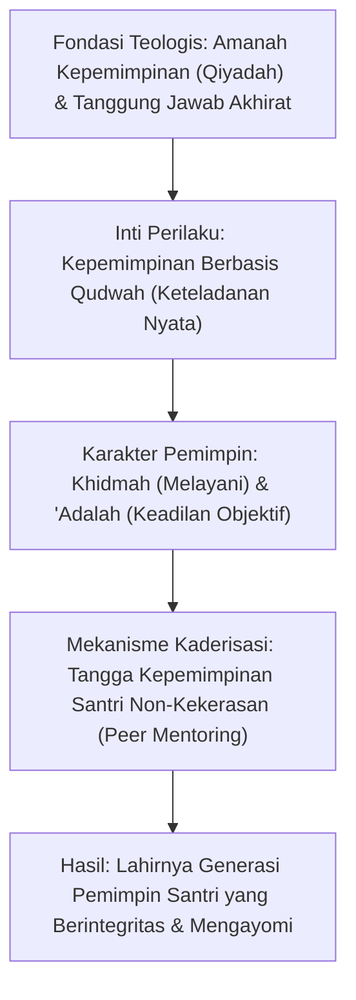

# P1-05-04-Sintesis-Leadership-TUMBUH

## Rangkuman Integratif: Falsafah Kepemimpinan TUMBUH

Dokumen ini menyintesiskan pilar-pilar filosofis kepemimpinan (*Leadership*) dalam ekosistem TUMBUH:

---

## 3 Pilar Utama Kepemimpinan TUMBUH

1. **Qudwah Sebagai Mata Uang Utama (*Qudwah-First Leadership*)**:
   - Wibawa pemimpin pesantren (Pimpinan, Musyrif, Ustadz, hingga Pengurus Santri) lahir dari keselarasan antara ilmu dan amal (*qudwah hasanah*), bukan dari intimidasi atau kekerasan.
2. **Kepemimpinan Pelayan (*Servant Leadership / Sayyidul Qaumi Khaadimuhum*)**:
   - Posisi kepengurusan adalah sarana beramal sholeh untuk memfasilitasi kebutuhan dan pertumbuhan santri, bukan hak istimewa untuk bersikap sewenang-wenang.
3. **Kaderisasi Anti-Opresi & Berkelanjutan (*Isti'dad al-Qiyadah*)**:
   - Organisasi santri adalah laboratorium pembentukan karakter. Regenerasi kepemimpinan dilakukan melalui pembinaan kompetensi manajerial, empati relasional, dan etika kepengurusan yang bebas dari budaya perpeloncoan.
