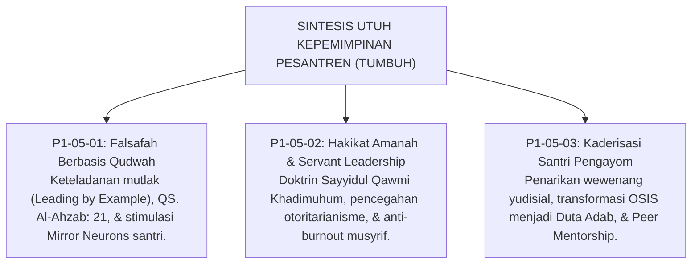

# P1-05-04: SINTESIS FILOSOFIS KEPEMIMPINAN PESANTREN
## *Konsolidasi Paradigma Kepemimpinan Berbasis Qudwah, Khidmah Pelayan, dan Kaderisasi Santri Pengayom*

**Nomor Identifikasi**: `P1-05-04/SINTESIS-LEADERSHIP/2026`  
**Domain**: `01 Philosophy` > `05 Leadership`  
**Dewan Pakar**: `pakar-tata-kelola-qudwah`, `pakar-filosofi-tumbuh`, `pakar-pedagogi-master-guru`

---

## 📑 DAFTAR ISI ANALITIS

1. [1. Integrasi Tiga Pilar Kepemimpinan TUMBUH](#1-integrasi-tiga-pilar-kepemimpinan-tumbuh)
2. [2. Matriks Epistemologis: Domain Leadership TUMBUH](#2-matriks-epistemologis-domain-leadership-tumbuh)
3. [3. Jembatan Filosofis Menuju Sub-Domain 06 (Change & Dinamika Perubahan)](#3-jembatan-filosofis-menuju-sub-domain-06-change--dinamika-perubahan)
4. [4. Piagam Kepemimpinan Qudwah Ekosistem TUMBUH](#4-piagam-kepemimpinan-qudwah-ekosistem-tumbuh)

---

### 1. Integrasi Tiga Pilar Kepemimpinan TUMBUH

Sub-Domain `05 Leadership` mengokohkan arsitektur kepemimpinan pesantren di atas tiga pilar transformatif:

---

### 2. Matriks Epistemologis: Domain Leadership TUMBUH

| Modul Analisis | Landasan Turats Klasik | Landasan Sains Kontemporer | Manifestasi Praktis di Asrama |
| :--- | :--- | :--- | :--- |
| **P1-05-01 (Qudwah First)** | QS. Al-Ahzab: 21, QS. Al-Baqarah: 44, Hadits Akhlak Nabawi. | *Mirror Neuron System* (Rizzolatti) & *Observational Modeling* (Bandura). | Pendidik mengamalkan adab lebih dahulu; ketepatan waktu & kebersihan asrama. |
| **P1-05-02 (Servant Leadership)**| HR. Muslim (Amanah Kepemimpinan), Riwayat Khalifah Umar RA. | *Servant Leadership Model* (Robert Greenleaf) & *Burnout Mitigation*. | Pimpinan melayani kebutuhan santri; sistem shift sehat musyrif. |
| **P1-05-03 (Kaderisasi Santri)**| Hadits Sayyidul Qawm, Ukhuwah Imani (QS. Al-Hujurat: 10). | *Peer Mentoring Theory* & *Restorative Peer Mediation* (Johnson). | Organisasi santri sebagai Duta Adab pengayom, bukan algojo penindas. |

---

### 3. Jembatan Filosofis Menuju Sub-Domain 06 (Change & Dinamika Perubahan)

Kepemimpinan yang berwibawa dan penuh keteladanan adalah motor utama penggerak **transformasi kelembagaan pesantren (*Institutional Transformation*)**. 

Peta jalan bagaimana merancang, mengelola, dan menavigasi dinamika perubahan budaya pesantren dari paradigma lama menuju ekosistem baru akan dibedah secara komprehensif pada **Sub-Domain `06 Change`**, yang membahas *Sunnatullah Taghyir*, manajemen resistensi, dan pembentukan budaya *Bi'ah Shalihah* yang berkelanjutan.

---

### 4. Piagam Kepemimpinan Qudwah Ekosistem TUMBUH

> *"Pemimpin di pesantren TUMBUH bukanlah mereka yang paling ditakuti langkah kakinya atau paling keras suaranya, melainkan mereka yang paling awal hadir di shaf terdepan, paling tulus memeluk santri yang sedang berduka, paling adil dalam menegakkan kebenaran, dan paling ikhlas melayani kemaslahatan umat demi mengharap ridha Allah SWT."*
