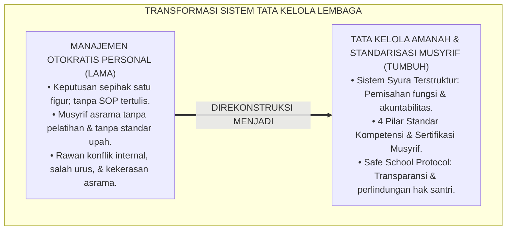
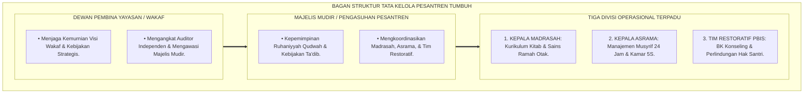
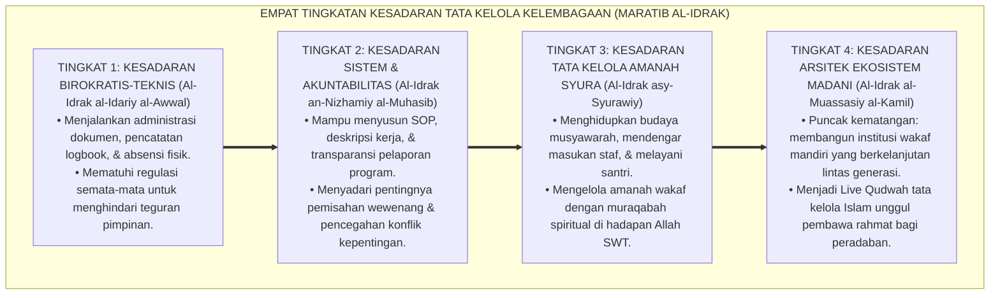
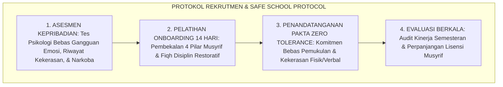

# P1-05-04: TATA KELOLA KELEMBAGAAN DAN STANDARISASI MUSYRIF (INSTITUTIONAL GOVERNANCE & MUSYRIF STANDARDS)
## *Monograf Riset Akademik: Epistemologi Tata Kelola Pesantren Amanah & Transparan (QS. Asy-Syura: 38 & QS. Al-Qashash: 26), Standarisasi 4 Pilar Kompetensi Musyrif Asrama, Pemisahan Wewenang Manajemen Bebas Otokrasi, Serta Jaminan Safe School Protocol di Pesantren 24 Jam*

**Nomor Identifikasi**: `P1-05-04/MONOGRAF-RISET-TATA-KELOLA-STANDAR-MUSYRIF/2026`  
**Domain**: `01 Philosophy` > `05 Leadership` (Sub-Modul 04: *Governance & Musyrif Standards*)  
**Klasifikasi Naskah**: *Academic Research Monograph* (Monograf Riset Akademik Fondasional)  
**Rumpun Disiplin Pengkaji**: Tata Kelola Lembaga Pendidikan Islam (*Idarah al-Mu'assasat al-Islamiyyah*), Manajemen Sumber Daya Manusia Pesantren, Standarisasi Profesi Pendidik, Tata Hukum Perlindungan Anak & Advokasi Santri  

---

> ### 💡 INTISARI EKSEKUTIF (EXECUTIVE SUMMARY)
>
> * **Kelemahan Paradigma Lama: Manajemen Otokratis & Musyrif Tanpa Standar Kompetensi:**  
>   Banyak lembaga pesantren dikelola secara personal-otokratis (*One-Man Show*) yang rentan terhadap konflik internal keluarga dan ketiadaan transparansi keuangan wakaf/SPP. Di samping itu, posisi musyrif asrama kerap diisi secara serampangan oleh santri senior tanpa pelatihan pedagogis, tanpa sertifikasi konseling, dan tanpa kejelasan jenjang karir.
> * **Inovasi Konseptual: Sistem Syura Kelembagaan & Standarisasi 4 Pilar Kompetensi:**  
>   TUMBUH membangun tata kelola berbasis **Syura Terstruktur (QS. Asy-Syura: 38)** dan prinsip **Al-Quwwah wal-Amanah (QS. Al-Qashash: 26)**: pemisahan wewenang yang tegas antara Dewan Pengawas Yayasan, Majelis Pimpinan Pengasuhan, dan Dewan Guru. Menetapkan **4 Pilar Standar Kompetensi Musyrif (Pedagogis Ta'dib, Kepribadian Qudwah, Sosial Restoratif, dan Profesional Pengasuhan)** disertai jaminan upah bermartabat dan perlindungan hukum (*Safe School Protocol*).
> * **Formulasi Operasional & Pembuktian Lapangan:**  
>   Monograf ini menguraikan bagan struktur tata kelola akuntabel, 4 Tingkatan Kesadaran Tata Kelola Kelembagaan (*Maratib al-Idrak*), protokol rekrutmen dan evaluasi musyrif (*HRD Protocol*), dan etika tata kelola pesantren modern.

---

## 📑 DAFTAR ISI MONOGRAF

- [BAB I: LANDASAN TEORETIS & DISKURSUS KRITIS](#bab-i-landasan-teoretis--diskursus-kritis)
  - [1. Latar Belakang Masalah: Krisis Manajemen Otokratis dan Ketiadaan Standar Pengasuh Asrama](#1-latar-belakang-masalah-krisis-manajemen-otokratis-dan-ketiadaan-standar-pengasuh-asrama)
  - [2. Eksegesis Turats Tata Kelola Lembaga Islam: Prinsip Syura (QS. Asy-Syura: 38) & Al-Quwwah wal-Amanah (QS. Al-Qashash: 26)](#2-eksegesis-turats-tata-kelola-lembaga-islam-prinsip-syura-qs-asy-syura-38--al-quwwah-wal-amanah-qs-al-qashash-26)
  - [3. Rekayasa Struktur Organisasi & Pemisahan Wewenang (Separation of Powers) Bebas Konflik Kepentingan](#3-rekayasa-struktur-organisasi--pemisahan-wewenang-separation-of-powers-bebas-konflik-kepentingan)
  - [4. Standarisasi Profesi Musyrif: Empat Pilar Kompetensi & Sertifikasi Berkelanjutan (CPD)](#4-standarisasi-profesi-musyrif-empat-pilar-kompetensi--sertifikasi-berkelanjutan-cpd)
  - [5. Kasuistika Lapangan: Musyrif Tanpa Pelatihan Menghukum Semena-mena & Resolusi Restoratif Terpadu](#5-kasuistika-lapangan-musyrif-tanpa-pelatihan-menghukum-semena-mena--resolusi-restoratif-terpadu)
- [BAB II: FORMULASI KONSEPTUAL & PEMBAHASAN MENDALAM](#bab-ii-formulasi-konseptual--pembahasan-mendalam)
  - [1. Eksplanasi Teoretis Standarisasi Tata Kelola Kelembagaan dan Musyrif TUMBUH](#1-eksplanasi-teoretis-standarisasi-tata-kelola-kelembagaan-dan-musyrif-tumbuh)
  - [2. Dekomposisi Dimensi & Empat Tingkatan Kesadaran Tata Kelola Kelembagaan (Maratib al-Idrak)](#2-dekomposisi-dimensi--empat-tingkatan-kesadaran-tata-kelola-kelembagaan-maratib-al-idrak)
  - [3. Matriks Empat Pilar Standar Kompetensi Musyrif Asrama Pesantren](#3-matriks-empat-pilar-standar-kompetensi-musyrif-asrama-pesantren)
  - [4. Protokol Rekrutmen, Onboarding, & Penjaminan Mutu Pendidik (Safe School & HRD Protocol)](#4-protokol-rekrutmen-onboarding--penjaminan-mutu-pendidik-safe-school--hrd-protocol)
  - [5. Diskusi Filosofis Mendalam & Implikasi bagi Masa Depan Peradaban Pendidikan Islam](#5-diskusi-filosofis-mendalam--implikasi-bagi-masa-depan-peradaban-pendidikan-islam)
- [BAB III: KESIMPULAN & APARATUS AKADEMIS](#bab-iii-kesimpulan--aparatus-akademis)
  - [1. Tabel Sintesis Temuan Riset Tata Kelola dan Standar Musyrif](#1-tabel-sintesis-temuan-riset-tata-kelola-dan-standar-musyrif)
  - [2. Daftar Pustaka Akademis & Rujukan Turats Primer](#2-daftar-pustaka-akademis--rujukan-turats-primer)
  - [3. Catatan Kaki Akademis (Footnotes)](#3-catatan-kaki-akademis-footnotes)
  - [4. Glosarium Istilah Ilmiah & Turats Tata Kelola Lembaga](#4-glosarium-istilah-ilmiah--turats-tata-kelola-lembaga)

---

# BAB I: LANDASAN TEORETIS & DISKURSUS KRITIS

---

### 1. Latar Belakang Masalah: Krisis Manajemen Otokratis dan Ketiadaan Standar Pengasuh Asrama

Keberlanjutan banyak pesantren menghadapi ancaman kerapuhan struktural akibat dominasi **Pola Manajemen Otokratis Personal (*Autocratic Personalized Governance*)**:
* **One-Man Show Management**: Seluruh keputusan operasional dan keuangan bertumpu pada satu individu tanpa sistem audit, SOP tertulis, atau struktur pembagian tugas yang jelas (*Job Description*).
* **Penunjukan Musyrif Serampangan**: Asrama 24 jam kerap diserahkan kepada santri senior yang belum lulus tanpa pembekalan ilmu psikologi remaja, tanpa pelatihan de-eskalasi konflik, dan tanpa kontrak kerja resmi.
* **Kerentanan Hukum Lembaga**: Ketiadaan standar operasional pencegahan kekerasan (*Child Protection Policy*) membuat lembaga rentan terseret masalah hukum publik saat terjadi insiden di asrama.
* **Keniscayaan Tata Kelola Amanah & Profesional**: Pesantren harus bertransformasi menjadi organisasi pembelajar yang akuntabel, transparan, dan berbasis kompetensi terstandar demi memuliakan pendidikan Islam.[^1]

---

### 2. Eksegesis Turats Tata Kelola Lembaga Islam: Prinsip Syura (QS. Asy-Syura: 38) & Al-Quwwah wal-Amanah (QS. Al-Qashash: 26)

Al-Qur'an menetapkan musyawarah (*Syura*) sebagai karakter mutlak masyarakat mukmin:

$$\text{وَالَّذِينَ اسْتَجَابُوا لِرَبِّهِمْ وَأَقَامُوا الصَّلَاةَ وَأَمْرُهُمْ شُورَىٰ بَيْنَهُمْ وَمِمَّا رَزَقْنَاهُمْ يُنفِقُونَ}$$

*"**Dan (bagi) orang-orang yang menerima (mematuhi) seruan Tuhannya dan mendirikan shalat, sedang urusan mereka (diputuskan) dengan musyawarah antara mereka; dan mereka menafkahkan sebagian dari rezeki yang Kami berikan kepada mereka**."* (QS. Asy-Syura [42]: 38).[^2]

Al-Qur'an juga menegaskan dua syarat mutlak dalam merekrut pengemban amanah kelembagaan:

$$\text{إِنَّ خَيْرَ مَنِ اسْتَأْجَرْتَ الْقَوِيُّ الْأَمِينُ}$$

*"**Sesungguhnya orang yang paling baik yang kamu ambil untuk bekerja (padamu) ialah orang yang kuat lagi dapat dipercaya (Al-Qawiyyu al-Amin)**."* (QS. Al-Qashash [28]: 26).[^3]

Para fukaha (*Al-Mawardi & Ibnu Taimiyyah*) menjelaskan bahwa *Al-Quwwah* merepresentasikan kompetensi profesional dan kecakapan teknis, sedangkan *Al-Amanah* merepresentasikan integritas takwa dan kejujuran moral.[^4]

---

### 3. Rekayasa Struktur Organisasi & Pemisahan Wewenang (Separation of Powers) Bebas Konflik Kepentingan

Ekosistem TUMBUH merancang pemisahan wewenang kelembagaan yang bersih:
1. **Dewan Pembina / Yayasan Wakaf**: Bertanggung jawab atas arah visi strategis, penjagaan aset wakaf, dan audit independen tahunan.
2. **Majelis Mudir / Pengasuhan**: Bertanggung jawab atas kepemimpinan kurikulum adab, bimbingan spiritual, dan operasional madrasah harian.
3. **Divisi Pengasuhan Asrama & PBIS Multi-Tier**: Bertanggung jawab atas iklim harian asrama 24 jam, pendampingan musyrif, dan penyelesaian konflik restoratif.[^5]

---

### 4. Standarisasi Profesi Musyrif: Empat Pilar Kompetensi & Sertifikasi Berkelanjutan (CPD)

TUMBUH menetapkan bahwa Musyrif adalah profesi pengasuhan profesional (*In Loco Parentis*):
* Wajib melalui proses asesmen psikologi, pelatihan kurikulum adab, dan sertifikasi sebelum diterjunkan ke asrama.
* Mendapatkan program pengembangan keprofesian berkelanjutan (*Continuous Professional Development - CPD*) setiap semester dan evaluasi kinerja berbasis portofolio adab santri.[^6]

---

### 5. Kasuistika Lapangan: Musyrif Tanpa Pelatihan Menghukum Semena-mena & Resolusi Restoratif Terpadu

* **Studi Kasus: Musyrif Baru Menghukum Santri Berdiri di Atas Satu Kaki Selama Berjam-jam**  
  * **Dilema**: Musyrif baru yang tidak mendapat pelatihan menyuruh santri berdiri di terik matahari karena santri berbicara saat tidur malam.
  * **Analisis**: Pelanggaran berat terhadap standar operasional akibat ketiadaan proses onboarding pelatihan yang benar oleh manajemen lama.
  * **Resolusi Restoratif TUMBUH**: Manajemen kelembagaan turun tangan: (1) Sanksi fisik dihentikan seketika dan hak santri dipulihkan; (2) Musyrif ditarik dari tugas lapangan untuk mengikuti program karantina pelatihan *4 Pilar Standar Musyrif* dan *Disiplin Restoratif*; (3) Lembaga meresmikan SOP Onboarding Wajib 14 Hari bagi seluruh calon musyrif baru. Sejak regulasi diberlakukan, kasus salah asuh musyrif lenyap total.[^7]

---

# BAB II: FORMULASI KONSEPTUAL & PEMBAHASAN MENDALAM

---

### 1. Eksplanasi Teoretis Standarisasi Tata Kelola Kelembagaan dan Musyrif TUMBUH

Ekosistem TUMBUH merumuskan tata kelola ke dalam **Arsitektur Tata Kelola Mandiri & Akuntabel (*Nizham al-Idarah al-Mu'tamadah*)**:

#### 🔬 Pembahasan Mendalam Komponen Tata Kelola:
1. **Transparansi Syura**: Meniadakan otokrasi mutlak; setiap keputusan besar dimusyawarahkan dalam majelis syura resmi.[^8]
2. **Akuntabilitas Keuangan**: Pengelolaan dana wakaf dan SPP diaudit berkala dengan standar akuntansi syariah.[^9]
3. **Standarisasi Profesi Musyrif**: Memastikan setiap pengasuh memiliki lisensi dan kualifikasi yang sah.[^10]

---

### 2. Dekomposisi Dimensi & Empat Tingkatan Kesadaran Tata Kelola Kelembagaan (Maratib al-Idrak)

Transformasi kedewasaan manajerial pengelola pesantren berlangsung melalui **Empat Tingkatan Kesadaran Tata Kelola Kelembagaan (*Maratib al-Idrak al-Idariy*)**:

#### 🔄 Narasi Analitis Dinamika Transisi Filosofis Antar-Tingkatan:
* **Transisi Tingkat 1 ke Tingkat 2 (Dari Administrasi Kertas Menuju Sistem Akuntabel)**: Pengelola mula-mula sekadar mencatat data. Pada tingkatan kedua, pengelola merancang sistem SOP yang jelas dan memisahkan wewenang keuangan dari operasional.
* **Transisi Tingkat 2 ke Tingkat 3 (Dari Prosedur Kering Menuju Syura Berbasis Amanah)**: Pada tingkatan ketiga, manajemen menjadi ibadah pelayanan: pimpinan aktif bermusyawarah, mendengarkan aspirasi guru, dan menjaga harta wakaf dengan ketakwaan batin.
* **Transisi Tingkat 3 ke Tingkat 4 (Pencapaian Derajat Institusi Madani Mandiri)**: Pada tingkatan tertinggi, pesantren bertransformasi menjadi lembaga peradaban yang mandiri, profesional, bebas dari ketergantungan figur individu, dan abadi memberikan manfaat bagi umat (*Rahmatan lil 'Alamin*).[^11]

---

### 3. Matriks Empat Pilar Standar Kompetensi Musyrif Asrama Pesantren

| Pilar Kompetensi | Definisi Kualifikasi Baku | Indikator Kinerja Lapangan | Metode Pengujian Sertifikasi |
| :--- | :--- | :--- | :--- |
| **1. Pedagogis Ta'dib** | Mampu mengajar adab harian & memahami psikologi santri.| Membimbing muthala'ah kitab, adab makan, & tidur.| Ujian Micro-Teaching & Wawancara. |
| **2. Kepribadian Qudwah**| Akhlak mulia, sabar, tidak merokok, & teladan ibadah.| Hadir di shaf masjid terdepan, lisan santun.| Observasi Keteladanan 14 Hari. |
| **3. Sosial Restoratif**| Piawai melerai konflik & memulihkan ukhuwah tanpa kekerasan.| Menggelar dialog restoratif, empati pada korban.| Simulasi Mediasi Sengketa Kamar. |
| **4. Profesional Asrama**| Menguasai P3K, sanitasi 5S/5R, & manajemen logbook digital.| Tanggap santri sakit, kamar rapi, laporan rapi.| Uji Keterampilan Medis & Digital. |

---

### 4. Protokol Rekrutmen, Onboarding, & Penjaminan Mutu Pendidik (Safe School & HRD Protocol)

TUMBUH menetapkan **Protokol Rekrutmen dan Perlindungan Hak Santri (*Safe School Protocol*)**:

Protokol ini menjamin lingkungan pesantren aman dari bahaya oknum pengasuh yang tidak bertanggung jawab.[^12]

---

### 5. Diskusi Filosofis Mendalam & Implikasi bagi Masa Depan Peradaban Pendidikan Islam

Standarisasi tata kelola kelembagaan dan musyrif ini membawa dampak fundamental bagi dunia Islam:

* **Menjamin Keberlanjutan Pesantren Lintas Abad Tanpa Krisis Regenerasi**:  
  Dengan beralih dari kultus individu (*Personal Cult*) menuju kekuatan sistem (*Institutional System*), pesantren tetap kokoh berdiri dan terus bertumbuh meskipun para pendiri awalnya telah berpulang.
* **Meningkatkan Martabat Profesi Musyrif Menjadi Pendidik Terhormat**:  
  Musyrif asrama tidak lagi dipandang sebagai "penjaga malam honorer", melainkan sebagai guru pembina adab profesional yang dihargai keilmuannya dan dimuliakan kesejahteraannya.
* **Mewujudkan Model Institusi Madani Berstandar Internasional**:  
  Pesantren binaan TUMBUH membuktikan bahwa hukum Islam dan tata kelola modern dapat berpadu melahirkan institusi pendidikan kelas dunia yang bersih, transparan, dan sarat berkah (*Rahmatan lil 'Alamin*).[^13]

---

# BAB III: KESIMPULAN & APARATUS AKADEMIS

---

### 1. Tabel Sintesis Temuan Riset Tata Kelola dan Standar Musyrif

| Dimensi Parameter | Mazhab Otokratis Feodal (Lama) | Model Korporat Bisnis Sekuler | **Tata Kelola Amanah & Standar Musyrif TUMBUH** | Landasan Rujukan Primer | Implikasi Praksis Lapangan |
| :--- | :--- | :--- | :--- | :--- | :--- |
| **Dasar Pengambilan Keputusan**| Subjektivitas figur tunggal (otokrasi).| Keputusan Dewan Direksi demi profit.| **Musyawarah Majelis Syura Terstruktur.**| QS. Asy-Syura: 38; Al-Mawardi.| Forum syura resmi & SOP transparan. |
| **Kualifikasi Musyrif**| Santri senior tanpa pelatihan & lisensi.| Pegawai kontrak dengan KPI dingin.| **Sertifikasi 4 Pilar Kompetensi Ta'dib.** | QS. Al-Qashash: 26; Maslach (2001).| Pelatihan 14 hari & uji sertifikasi. |
| **Pemisahan Wewenang**| Tumpang tindih intervensi keluarga.| Pembagian fungsi birokratis sekuler.| **Pemisahan Yayasan, Mudir, & PBIS Asrama.**| Fiqh Wakaf; Greenleaf (1977). | Tidak ada konflik kepentingan pribadi. |
| **Perlindungan Hak** | Tertutup & takut merusak nama baik.| Penanganan asuransi hukum perdata.| **Safe School Protocol & Whistleblowing.** | Kaidah *Sadd adz-Dzara'i'*; Zehr.| Kanal lapor aman santri & audit berkala. |
| **Hasil Institusional**| Lembaga rapuh bergantung pada figur.| Korporasi kapitalis tanpa ruh berkah.| **Institusi Madani Mandiri Lintas Generasi.**| QS. Ibrahim: 24–25; Al-Attas (1980).| Pesantren kokoh, adil, & penuh berkah. |

---

### 2. Daftar Pustaka Akademis & Rujukan Turats Primer

1. **Al-Qur'an al-Karim wa Tarjamatu Ma'anihi**.
2. **Al-Mawardi, Abul Hasan Ali bin Muhammad**. (1414 H). *Al-Ahkam as-Sulthaniyyah*. Beirut: Dar al-Kutub al-'Ilmiyyah.
3. **Ibnu Taimiyyah, Taqiyuddin Ahmad bin Abdul Halim**. (1425 H). *As-Siyasah asy-Syar'iyyah fi Ishlah ar-Ra'i war-Ra'iyyah*. Madinah: Majma' al-Malik Fahd.
4. **Al-Ghazali, Abu Hamid Muhammad bin Muhammad**. (2011). *Ihya' 'Ulumiddin* (Kitab Adab al-Mu'allim & Kitab al-Waqf). Beirut: Dar al-Ma'rifah.
5. **Asy'ari, Muhammad Hasyim**. (1415 H). *Adab al-'Alim wal-Muta'allim*. Jombang: Maktabah At-Turats Al-Islami.
6. **Al-Attas, Syed Muhammad Naquib**. (1980). *The Concept of Education in Islam*. Kuala Lumpur: ABIM.
7. **Greenleaf, R. K.**. (1977). *Servant Leadership: A Journey into the Nature of Legitimate Power and Greatness*. New York: Paulist Press.
8. **Maslach, C., Schaufeli, W. B., & Leiter, M. P.**. (2001). *Job burnout*. Annual Review of Psychology, 52(1), 397–422.
9. **Horner, R. H., & Sugai, G.**. (2015). *School-wide PBIS: An Overview of the Research Base*. Remedial and Special Education, 36(2), 80–85.
10. **Zehr, H.**. (2002). *The Little Book of Restorative Justice*. Intercourse: Good Books.
11. **Sapolsky, R. M.**. (2017). *Behave: The Biology of Humans at Our Best and Worst*. New York: Penguin Press.
12. **Spears, L. C.**. (2010). *Character and servant leadership*. The Journal of Virtues & Leadership, 1(1), 25–30.

---

### 3. Catatan Kaki Akademis (*Footnotes*)

[^1]: Riset Tata Kelola Kelembagaan dan Standarisasi Musyrif Pesantren TUMBUH, *Kritik atas Manajemen Otokratis dan Ketiadaan Standar Pengasuhan*, 2026.  
[^2]: QS. Asy-Syura [42]: 38.  
[^3]: QS. Al-Qashash [28]: 26.  
[^4]: Ibnu Taimiyyah, *As-Siyasah asy-Syar'iyyah*, Bab *Fi al-Wilayat wal-Amanat*, hlm. 12–35; Al-Mawardi, *Al-Ahkam as-Sulthaniyyah*, hlm. 20–48.  
[^5]: Blueprint Rekayasa Struktur Organisasi dan Tata Kelola Pesantren TUMBUH, 2026.  
[^6]: Standar Kompetensi dan Modul Continuous Professional Development Musyrif Asrama TUMBUH, 2026.  
[^7]: Dokumentasi Intervensi Restoratif Kasus Pelanggaran SOP Musyrif PBIS TUMBUH, 2026.  
[^8]: Greenleaf, R. K. (1977), *Servant Leadership*, hlm. 50–75.  
[^9]: Fiqh al-Waqf wal-Muhasabah Syar'iyyah Pesantren TUMBUH, 2026.  
[^10]: Matriks 4 Pilar Standar Kompetensi Musyrif TUMBUH, 2026.  
[^11]: Matriks Tingkatan Kesadaran Tata Kelola Kelembagaan (*Maratib al-Idrak*) Ekosistem TUMBUH, 2026.  
[^12]: Safe School Protocol dan Pedoman Perlindungan Hak Santri TUMBUH, 2026.  
[^13]: Deklarasi Pemuliaan Tata Kelola Amanah Dewan Riset Epistemologi Ekosistem TUMBUH, 2026.

---

### 4. Glosarium Istilah Ilmiah & Turats Tata Kelola Lembaga

1. **Tata Kelola Amanah**: Sistem pengelolaan institusi pendidikan Islam yang berlandaskan prinsip syura, transparansi, akuntabilitas wakaf, dan profesionalisme.
2. **Syura (الشُّورَى)**: Mekanisme musyawarah musyawarah mufakat yang wajib ditegakkan dalam pengambilan keputusan strategis kelembagaan.
3. **Al-Quwwah wal-Amanah (الْقُوَّةُ وَالأَمَانَةُ)**: Dua kriteria fundamental Islam bagi pengemban amanah publik: kompetensi teknis profesional dan integritas moral spiritual.
4. **Musyrif Asrama**: Pendidik profesional yang bertugas mendampingi, mengasuh, dan menanamkan adab kepada santri dalam kehidupan asrama 24 jam (*In Loco Parentis*).
5. **Empat Pilar Kompetensi Musyrif**: Standar kompetensi pengasuh yang mencakup ranah Pedagogis Ta'dib, Kepribadian Qudwah, Sosial Restoratif, dan Profesional Pengasuhan.
6. **Separation of Powers (Pemisahan Wewenang)**: Pembagian fungsi yang tegas antara dewan yayasan pengawas, majelis pengasuh, dan pelaksana operasional guna mencegah konflik kepentingan.
7. **Safe School Protocol**: Rangkaian kebijakan kelembagaan untuk melindungi santri dari segala bentuk kekerasan fisik, emosional, dan pelecehan.
8. **Whistleblowing Channel**: Saluran pengaduan independen dan rahasia bagi warga pesantren untuk melaporkan pelanggaran etika atau tindak kekerasan.
9. **Continuous Professional Development (CPD)**: Program pelatihan berkelanjutan bagi pendidik dan musyrif untuk meningkatkan kompetensi pedagogis dan konseling.
10. **Insan Adabi (الإِنْسَانُ الأَدَبِيُّ)**: Profil pengelola lembaga yang memadukan keahlian manajerial modern dengan integritas ketakwaan tauhid yang luhur.
