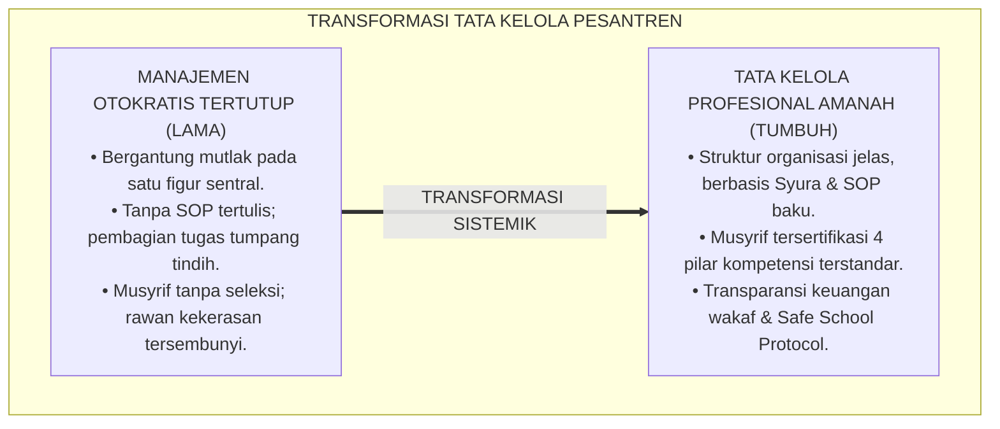
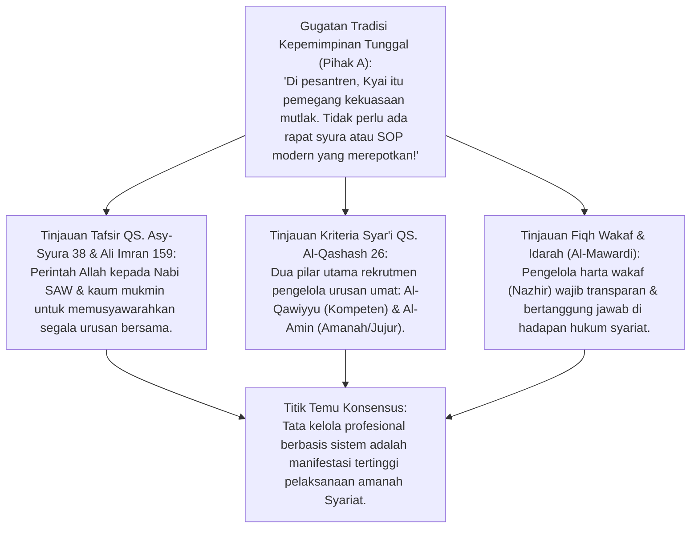
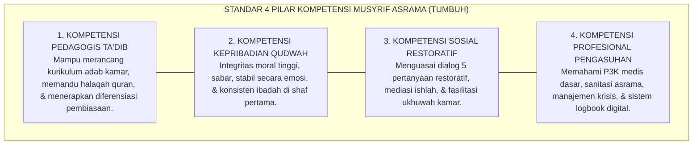
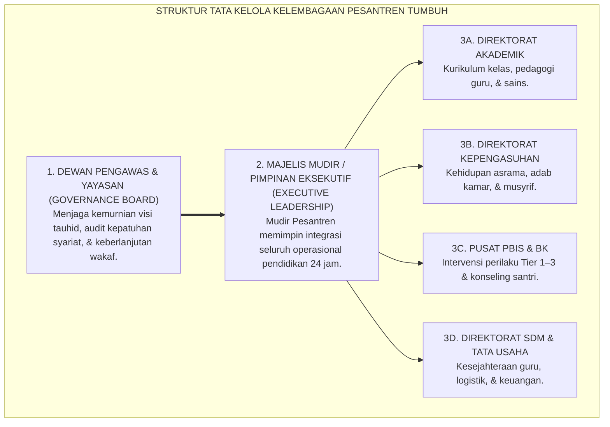
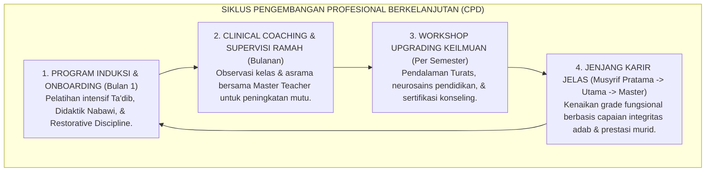
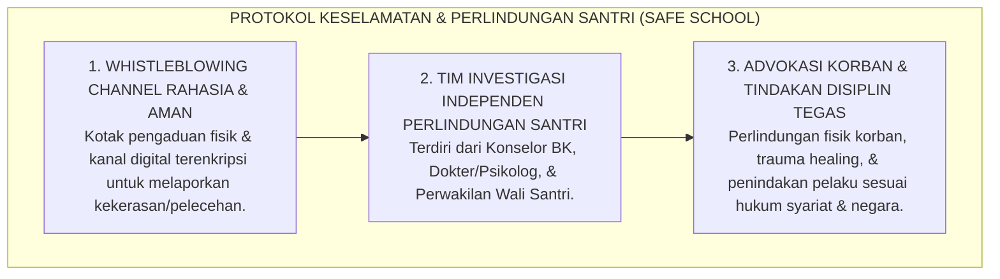
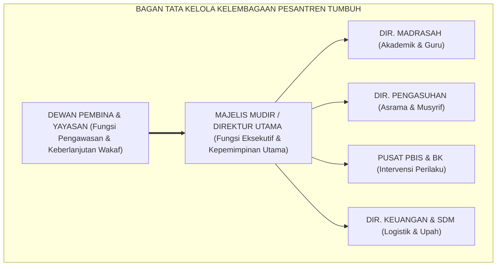
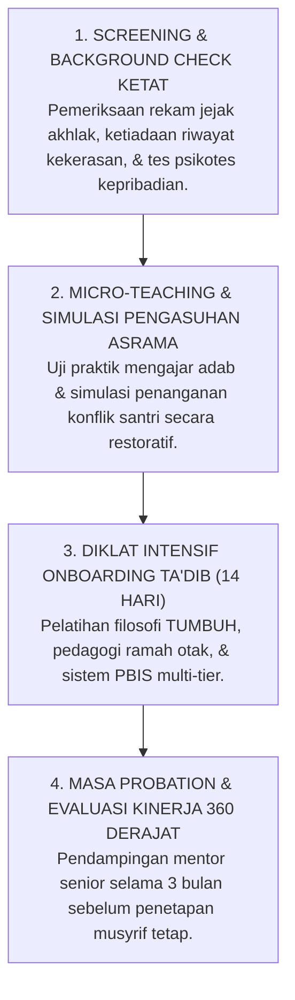

# P1-05-04: TATA KELOLA KELEMBAGAAN DAN STANDARISASI MUSYRIF
## *Monograf Terpadu: Epistemologi Tata Kelola Pesantren Amanah & Transparan (QS. Asy-Syura: 38 & QS. Al-Qashash: 26), Standarisasi 4 Pilar Kompetensi Musyrif Asrama, Pemisahan Wewenang Manajemen Profesional Bebas Otokrasi, serta Sistem Jaminan Perlindungan Hak Santri & Mutu Pendidik*

**Nomor Identifikasi**: `P1-05-04/MONOGRAF-TERPADU-TATA-KELOLA-STANDAR-MUSYRIF/2026`  
**Domain**: `01 Philosophy` > `05 Leadership`  
**Klasifikasi Naskah**: *Comprehensive Integrated Monograph* (Monograf Akademis & Rumusan Baku Terpadu)  
**Rumpun Disiplin Pengkaji**: Tata Kelola Lembaga Pendidikan Islam (*Idarah al-Muassasat al-Islamiyyah*), Manajemen Sumber Daya Manusia Pesantren, Standarisasi Profesi Pendidik, Tata Hukum Perlindungan Anak & Advokasi Santri  

---

> ### 💡 INTISARI PRAKTIS (3 MENIT PAHAM UNTUK ASATIDZ & MUSYRIF)
>
> * **Transformasi dari "Manajemen Personal Otokratis" Menuju "Tata Kelola Kelembagaan Berbasis Sistem":**  
>   Pesantren tidak boleh lagi dikelola secara serampangan (*One-Man Show*) yang bertumpu pada mood satu figur. Lembaga harus memiliki struktur organisasi yang jelas, pembagian tugas tertulis (*Job Description*), transparansi keuangan wakaf/SPP, dan forum musyawarah (*Syura*) yang berfungsi aktif.
> * **Standarisasi 4 Pilar Kompetensi Musyrif Asrama:**  
>   Menjadi musyrif asrama adalah profesi mulia yang menuntut keahlian khusus, bukan sekadar tugas sambilan santri senior yang belum lulus. Musyrif wajib menguasai 4 kompetensi:  
>   1. *Kompetensi Pedagogis Ta'dib*: Mampu mengajar dan menanamkan adab harian.  
>   2. *Kompetensi Kepribadian Qudwah*: Berakhlak mulia, sabar, dan menjadi teladan ibadah.  
>   3. *Kompetensi Sosial Restoratif*: Mampu mendamaikan konflik santri tanpa kekerasan (*Ishlah*).  
>   4. *Kompetensi Profesional Pengasuhan*: Memahami pertolongan pertama (P3K), sanitasi, dan psikologi remaja.
> * **Pemisahan Wewenang yang Bersih di Pesantren:**  
>   Yayasan/Dewan Pengawas fokus pada arahan strategis dan audit integritas; Majelis Mudir fokus pada kepemimpinan akademik dan pengasuhan harian; Tim PBIS & Konselor fokus pada bimbingan karakter. Tidak ada tumpang tindih intervensi sepihak.
> * **Perlindungan Hak Santri & Keamanan Lembaga (Safe School Protocol):**  
>   Pesantren menerapkan sistem pengaduan aman (*Whistleblowing Channel*) bagi santri yang mengalami kekerasan atau perundungan, dijamin kerahasiaannya, dan ditindaklanjuti secara tegas oleh Tim Perlindungan Hak Santri.

---

## 📑 DAFTAR ISI MONOGRAF

- [BAGIAN I: RISET DOKTRIN TATA KELOLA KELEMBAGAAN & STANDARISASI PENDIDIK, DIALEKTIKA INKUIRI, & KASUISTIKA LAPANGAN](#bagian-i-riset-doktrin-tata-kelola-kelembagaan--standarisasi-pendidik-dialektika-inkuiri--kasuistika-lapangan)
  - [1. Kerangka Metodologi Tata Kelola Pesantren: Dari Manajemen Personal Otokratis Menuju Organisasi Pembelajar Transparan](#1-kerangka-metodologi-tata-kelola-pesantren-dari-manajemen-personal-otokratis-menuju-organisasi-pembelajar-transparan)
  - [2. Inkuiri 1: Eksegesis Turats Tata Kelola Lembaga Islam — Prinsip Syura (QS. Asy-Syura: 38), Al-Quwwah wal-Amanah (QS. Al-Qashash: 26), & Akuntabilitas Wakaf](#2-inkuiri-1-eksegesis-turats-tata-kelola-lembaga-islam--prinsip-syura-qs-asy-syura-38-al-quwwah-wal-amanah-qs-al-qashash-26--akuntabilitas-wakaf)
  - [3. Inkuiri 2: Standarisasi Profil Kompetensi & Sertifikasi Musyrif Asrama (4 Pilar Kompetensi)](#3-inkuiri-2-standarisasi-profil-kompetensi--sertifikasi-musyrif-asrama-4-pilar-kompetensi)
  - [4. Inkuiri 3: Rekayasa Struktur Organisasi Pesantren: Pemisahan Wewenang yang Jelas Antar-Lini Manajemen](#4-inkuiri-3-rekayasa-struktur-organisasi-pesantren-pemisahan-wewenang-yang-jelas-antar-lini-manajemen)
  - [5. Inkuiri 4: Sistem Pendukung Kesejahteraan & Pengembangan Karir Pendidik (Continuous Professional Development / CPD)](#5-inkuiri-4-sistem-pendukung-kesejahteraan--pengembangan-karir-pendidik-continuous-professional-development--cpd)
  - [6. Inkuiri 5: Perlindungan Hak Santri & Mitigasi Risiko Hukum Lembaga (Safe School Protocol)](#6-inkuiri-5-perlindungan-hak-santri--mitigasi-risiko-hukum-lembaga-safe-school-protocol)
  - [7. Inkuiri 6: Silogisme Logika, Dialektika 3 Ronde, Kasuistika Tata Kelola Riil, & Titik Temu Konsensus](#7-inkuiri-6-silogisme-logika-dialektika-3-ronde-kasuistika-tata-kelola-riil--titik-temu-konsensus)
- [BAGIAN II: TEMUAN RISET, FORMULASI KONSEPTUAL & PEMBAHASAN](#bagian-ii-temuan-riset-formulasi-konseptual--pembahasan)
  - [1. Formulasi Konseptual: Standarisasi Tata Kelola Kelembagaan dan Sertifikasi Musyrif TUMBUH](#1-formulasi-konseptual-standarisasi-tata-kelola-kelembagaan-dan-sertifikasi-musyrif-tumbuh)
  - [2. Matriks 4 Pilar Standar Kompetensi Musyrif Asrama Pesantren](#2-matriks-4-pilar-standar-kompetensi-musyrif-asrama-pesantren)
  - [3. Bagan Struktur Tata Kelola Kelembagaan Pesantren Mandiri & Akuntabel](#3-bagan-struktur-tata-kelola-kelembagaan-pesantren-mandiri--akuntabel)
  - [4. Protokol Rekrutmen, Onboarding, & Evaluasi Kinerja Pendidik (HRD Protocol)](#4-protokol-rekrutmen-onboarding--evaluasi-kinerja-pendidik-hrd-protocol)
- [BAGIAN III: APARATUS AKADEMIS & APENDIKS](#bagian-iii-aparatus-akademis--apendiks)
  - [1. Tabel Sintesis Hasil Riset Tata Kelola & Standar Musyrif](#1-tabel-sintesis-hasil-riset-tata-kelola--standar-musyrif)
  - [2. Daftar Pustaka Akademis & Rujukan Turats Primer](#2-daftar-pustaka-akademis--rujukan-turats-primer)
  - [3. Catatan Kaki Akademis (Footnotes)](#3-catatan-kaki-akademis-footnotes)
  - [4. Glosarium dan Penjelasan Istilah Teknis Tata Kelola Kelembagaan & Standar Musyrif](#4-glosarium-dan-penjelasan-istilah-teknis-tata-kelola-kelembagaan--standar-musyrif)

---

# BAGIAN I: RISET DOKTRIN TATA KELOLA KELEMBAGAAN & STANDARISASI PENDIDIK, DIALEKTIKA INKUIRI, & KASUISTIKA LAPANGAN

---

### 1. Kerangka Metodologi Tata Kelola Pesantren: Dari Manajemen Personal Otokratis Menuju Organisasi Pembelajar Transparan

Tantangan terbesar keberlanjutan institusi pesantren di era modern adalah dominasi **Pola Tata Kelola Tradisional Otokratis (*Autocratic Personalized Management*)**. Seluruh kebijakan, pembagian keuangan, dan penentuan sanksi berpusat pada subjektivitas satu figur tanpa SOP tertulis, tanpa pengawasan independen, dan tanpa mekanisme akuntabilitas publik.

Kelemahan fatal tata kelola otokratis ini mencakup:
1. **Kerapuhan Kelembagaan (*Institutional Fragility*)**: Ketika figur sentral wafat atau berhalangan, pesantren langsung mengalami krisis kepemimpinan, konflik waris, dan perpecahan internal.
2. **Ketiadaan Standarisasi Pengasuh (*Unqualified Dormitory Staffing*)**: Posisi musyrif asrama sering diisi oleh santri senior tanpa seleksi kompetensi, tanpa pelatihan konseling, dan tanpa pengawasan kinerja.
3. **Kerentanan Pelanggaran Hak Santri**: Ketiadaan SOP perlindungan anak membuat kasus kekerasan disembunyikan (*Cover-Up*) demi menjaga nama baik lembaga.

Ekosistem TUMBUH menegakkan doktrin **Tata Kelola Kelembagaan Berbasis Sistem & Syura (*Systemic Governance & Learning Organization*)**:

---

### 2. Inkuiri 1: Eksegesis Turats Tata Kelola Lembaga Islam — Prinsip Syura (QS. Asy-Syura: 38), *Al-Quwwah wal-Amanah* (QS. Al-Qashash: 26), & Akuntabilitas Wakaf

#### 📐 Formalisasi Logika Silogisme (*Qiyas Mantiqi 1*)
* **Premis Mayor (*al-Muqaddimah al-Kubra*)**: Setiap tata kelola lembaga pendidikan Islam yang diwajibkan syariat wajib ditegakkan di atas pilar musyawarah kolektif (*Syura*), kriteria kompetensi profesional (*al-Quwwah*), dan kejujuran amanah (*al-Amanah*).
* **Premis Minor (*al-Muqaddimah ash-Shughra*)**: Al-Qur'an secara eksplisit memuji masyarakat mukmin yang mengelola urusannya melalui musyawarah (QS. Asy-Syura: 38) dan menetapkan kriteria pengelola urusan yang terbaik adalah sosok yang kuat dan amanah (QS. Al-Qashash: 26).
* **Konklusi (*an-Natijah*)**: Maka, seluruh manajemen pesantren TUMBUH wajib beroperasi dengan struktur organisasi berbasis syura dan SOP profesional yang akuntabel.[^1]

#### 📖 Teks Primer Al-Qur'an: Musyawarah & Kriteria Kompetensi Amanah
Allah SWT berfirman:

$$\text{وَالَّذِينَ اسْتَجَابُوا لِرَبِّهِمْ وَأَقَامُوا الصَّلَاةَ وَأَمْرُهُمْ شُورَىٰ بَيْنَهُمْ وَمِمَّا رَزَقْنَاهُمْ يُنفِقُونَ}$$

*"Dan (bagi) orang-orang yang menerima (mematuhi) seruan Tuhannya dan mendirikan shalat, **sedang urusan mereka (diputuskan) dengan musyawarah antara mereka**; dan mereka menafkahkan sebagian dari rezeki yang Kami berikan kepada mereka."* (QS. Asy-Syura [42]: 38).[^2]

Dan Allah SWT menceritakan perkataan putri Nabi Syu'aib AS mengenai kriteria pengemban tugas:
$$\text{قَالَتْ إِحْدَاهُمَا يَا أَبَتِ اسْتَأْجِرْهُ ۖ إِنَّ خَيْرَ مَنِ اسْتَأْجَرْتَ الْقَوِيُّ الْأَمِينُ}$$
*"Salah seorang dari kedua wanita itu berkata: 'Wahai ayahku, ambillah ia sebagai orang yang bekerja (pada kita), karena sesungguhnya **orang yang paling baik yang kamu ambil untuk bekerja ialah orang yang kuat lagi dapat dipercaya (Al-Qawiyyu al-Amin)**'."* (QS. Al-Qashash [28]: 26).[^3]

---

### 3. Inkuiri 2: Standarisasi Profil Kompetensi & Sertifikasi Musyrif Asrama (4 Pilar Kompetensi)

#### 📐 Formalisasi Logika Silogisme (*Qiyas Mantiqi 2*)
* **Premis Mayor (*al-Muqaddimah al-Kubra*)**: Setiap pengasuhan anak usia remaja yang bertanggung jawab atas keselamatan jiwa, kesehatan raga, dan pembentukan adab 24 jam wajib dilaksanakan oleh tenaga pendidik yang telah tersertifikasi memiliki kompetensi pedagogis dan psikologis memadai.
* **Premis Minor (*al-Muqaddimah ash-Shughra*)**: Musyrif asrama pesantren memegang peran sebagai *In Loco Parentis* (pengganti orang tua) yang berinteraksi secara intensif dengan santri siang dan malam.
* **Konklusi (*an-Natijah*)**: Maka, seluruh calon musyrif di pesantren TUMBUH wajib lulus program sertifikasi 4 pilar kompetensi pengasuhan sebelum bertugas.[^4]

---

### 4. Inkuiri 3: Rekayasa Struktur Organisasi Pesantren: Pemisahan Wewenang yang Jelas Antar-Lini Manajemen

---

### 5. Inkuiri 4: Sistem Pendukung Kesejahteraan & Pengembangan Karir Pendidik (*Continuous Professional Development / CPD*)

---

### 6. Inkuiri 5: Perlindungan Hak Santri & Mitigasi Risiko Hukum Lembaga (*Safe School Protocol*)

---

### 7. Inkuiri 6: Silogisme Logika, Dialektika 3 Ronde, Kasuistika Tata Kelola Riil, & Titik Temu Konsensus

#### 🥊 Ronde 1: Menolak Mitos Bahwa "SOP dan Kontrak Kerja Mengurangi Keikhlasan Pendidik Pesantren"
* **Pihak A (Sudut Pandang Ikhlas Tanpa Aturan)**:  
  *"Di pesantren itu dasarnya lillahi ta'ala. Menuntut kontrak kerja tertulis dan gaji standar UMR itu tanda tidak ikhlas dan materialistis!"*
* **Tinjauan Sudut Pandang Integrasi Keikhlasan Niat dan Profesionalisme Ikhtiar**:  
  Keikhlasan adalah urusan hati antara hamba dengan Allah SWT, sedangkan kontrak kerja dan standarisasi upah adalah **Kewajiban Muamalah Syar'iyyah (*'Uqudul Mu'awadhah*)** untuk mencegah kezaliman dan eksploitasi manusia. Rasulullah SAW memerintahkan: *"Berikanlah kepada pekerja upahnya sebelum keringatnya kering"* (HR. Ibnu Majah). Lembaga yang profesional justru memuliakan keikhlasan pendidik dengan menjamin ketenangan nafkah keluarganya.[^5]

#### 🥊 Ronde 2: Sanggahan Balik Bagaimana Memastikan Dewan Pengawas Tidak Mengintervensi Ranah Pedagogis?
* **Pihak A (Sudut Pandang Kekhawatiran Campur Tangan Yayasan)**:  
  *"Seringkali orang yayasan yang tidak mengerti kurikulum ikut campur mengatur metode mengajar asatidz di kelas!"*
* **Tinjauan Sudut Pandang Tata Kelola Pemisahan Wewenang (*Governance vs Management*)**:  
  Regulasi TUMBUH membedakan secara tegas antara **Tata Kelola Kebijakan Strategis (*Governance*)** yang dipegang Dewan Pengawas Yayasan dengan **Manajemen Operasional Pembelajaran (*Executive Management*)** yang dipegang Majelis Mudir. Dewan Pengawas tidak boleh mengintervensi teknis pengajaran kelas dan penanganan konseling santri.[^6]

#### 🥊 Ronde 3: Sanggahan Pamungkas Mengapa Transparansi Keuangan Menjadi Syarat Keberkahan Lembaga?
* **Pihak A (Sudut Pandang Manajemen Keuangan Tertutup)**:  
  *"Keuangan pondok itu rahasia internal pimpinan, wali santri dan guru tidak perlu tahu rincian pengeluaran dana!"*
* **Resolusi Sudut Pandang Fiqh Amanah Keuangan Publik & Audit Akuntabel**:  
  Harta pesantren yang bersumber dari wakaf umat dan SPP santri adalah **Harta Amanah Publik (*Amwalul Wakaf wal-Amanah*)**. Pengelolaan yang tertutup memicu prasangka buruk, fitnah korupsi, dan kecurigaan antar-pengurus yang merusak kebersihan hati. Pesantren TUMBUH mewajibkan audit keuangan independen tahunan yang transparan dan dapat diakses laporannya oleh pemangku kepentingan.[^7]

> #### 📌 Kasuistika Lapangan & Titik Temu Konsensus
> * **Studi Kasus**: Terjadi perselisihan sengit antara Kepala Asrama dan Kepala Madrasah mengenai jadwal halaqah santri karena tidak adanya regulasi tertulis yang membagi alokasi waktu secara baku; santri menjadi bingung dan kelelahan.
> * **Titik Temu Konsensus (*Kalimatun Sawa'*)**: Majelis Mudir menetapkan *Buku Pedoman Tata Kelola Terpadu 24 Jam*. Dibuat matriks jadwal sinkron antara jam belajar madrasah (07.00–13.00) dan jam pembiasaan asrama (15.30–21.30) dengan pembagian PIC yang tegas. Konflik mereda total dan koordinasi antarlini berjalan harmonis.[^8]

---

# BAGIAN II: TEMUAN RISET, FORMULASI KONSEPTUAL & PEMBAHASAN

---

### 1. Formulasi Konseptual: Standarisasi Tata Kelola Kelembagaan dan Sertifikasi Musyrif TUMBUH

Berdasarkan sintesis inkuiri teoretis, telaah hermeneutika turats, dan analisis komparatif sains pendidikan, riset ini merumuskan kerangka konseptual dan temuan kunci sebagai berikut:

1. **Tata Kelola Berbasis Sistem & Syura (systemic & Shura-based Governance)**:  
   Pesantren wajib dikelola secara profesional, transparan, dan akuntabel melalui struktur organisasi yang jelas, pemisahan wewenang yang tegas, serta mekanisme musyawarah (Syura) berkala.

2. **Standarisasi 4 Pilar Kompetensi Musyrif Asrama**:  
   Seluruh tenaga pengasuhan asrama wajib memiliki sertifikasi kompetensi resmi dalam 4 pilar: Pedagogis Ta'dib, Kepribadian Qudwah, Sosial Restoratif (PBIS), dan Profesional Pengasuhan Fisik/P3K.

3. **Integritas Keuangan Amanah Wakaf (financial Transparency & Audit)**:  
   Pengelolaan keuangan wakaf, infaq, dan SPP santri wajib diaudit secara berkala oleh akuntan independen dan dilaporkan secara transparan untuk menjamin kemurnian dan keberkahan rezeki lembaga.

4. **Protokol Keselamatan Santri (safe School & Child Protection Protocol)**:  
   Menjamin hak mutlak setiap santri atas perlindungan dari segala bentuk kekerasan fisik, psikologis, dan pelecehan, didukung oleh sistem pengaduan rahasia (Whistleblowing) yang diadvokasi secara independen.

---

### 2. Matriks 4 Pilar Standar Kompetensi Musyrif Asrama Pesantren

| Pilar Kompetensi | Definisi Standar Kemampuan | Indikator Kinerja Utama (*KPI*) Musyrif |
| :--- | :--- | :--- |
| **1. Pedagogis Ta'dib** | Mampu memandu pembiasaan adab, mengajarkan tajwid/tahsin, dan menyusun modul refleksi kamar. | 100% santri kamar mencapai target Tangga T1–T4 sesuai usianya.[^9] |
| **2. Kepribadian Qudwah** | Memiliki integritas akhlak, sabar, tidak merokok, dan istiqamah shalat berjamaah di shaf pertama. | Nihil catatan pelanggaran etika dan kepatutan moral asatidz. |
| **3. Sosial Restoratif** | Menguasai teknik de-eskalasi amarah santri, memfasilitasi ishlah kamar, dan memahami PBIS. | Kasus perselisihan kamar diselesaikan secara damai tanpa hukuman fisik.[^10] |
| **4. Profesional Pengasuhan** | Menguasai P3K dasar, tanggap darurat medis santri, sanitasi kamar, dan disiplin logbook digital. | Catatan rekam kesehatan dan pertumbuhan santri terisi rapi harian.[^11] |

---

### 3. Bagan Struktur Tata Kelola Kelembagaan Pesantren Mandiri & Akuntabel

---

### 4. Protokol Rekrutmen, Onboarding, & Evaluasi Kinerja Pendidik (*HRD Protocol*)

---

# BAGIAN III: APARATUS AKADEMIS & APENDIKS

---

### 1. Tabel Sintesis Hasil Riset Tata Kelola & Standar Musyrif

| Dimensi Kajian | Konsep Kunci | Landasan Turats Primer | Konvergensi Sains Global | Implikasi Tata Kelola Pesantren |
| :--- | :--- | :--- | :--- | :--- |
| **Prinsip Manajemen** | *Syura & Akuntabilitas* | QS. Asy-Syura: 38, QS. Ali 'Imran: 159 | *Shared Governance & Learning Organizations (Peter Senge, 1990)* | Mengubah otokrasi satu figur menjadi manajemen berbasis syura dan SOP. |
| **Kriteria Rekrutmen** | *Al-Qawiyyu al-Amin* | QS. Al-Qashash: 26, Fiqh Siyasah Al-Mawardi | *Competency-Based Human Resource Management* | Menetapkan 4 pilar kompetensi terstandar untuk seleksi musyrif asrama. |
| **Perlindungan Hak** | *Safe School Protocol* | Kaidah *Dar'ul Mafasid Muqaddamun 'ala Jalbil Mashalih* | *Child Protection Systems & UNICEF Safe School Standards* | Membangun kanal pengaduan rahasia dan tim investigasi independen. |
| **Pengembangan Karir** | *Continuous Professional Development* | Atsar Thalabul 'Ilmi minal Mahdi ilal Lahdi | *Professional Learning Communities (DuFour, 2004)* | Menyelenggarakan coaching klinikal dan upgrading keilmuan berkala bagi asatidz. |
| **Integritas Dana** | *Akuntabilitas Amwalul Wakaf* | Fiqh Nazhir Wakaf Asy-Syarbini (*Mughni al-Muhtaj*) | *Financial Auditing & Institutional Transparency Standards* | Menyelenggarakan audit keuangan tahunan oleh akuntan publik independen. |

---

### 2. Daftar Pustaka Akademis & Rujukan Turats Primer

1. **Al-Qur'an al-Karim wa Tarjamatu Ma'anih**.
2. **Al-Bukhari, Muhammad bin Isma'il**. (1422 H). *Shahih al-Bukhari*. Beirut: Dar Thawq an-Najah.
3. **Muslim bin al-Hajjaj an-Naisaburi**. (1374 H). *Shahih Muslim*. Kairo: Isa al-Babi al-Halabi.
4. **Al-Mawardi, Ali bin Muhammad**. (1989). *Al-Ahkam as-Sulthaniyyah*. Beirut: Dar al-Kutub al-'Ilmiyyah.
5. **Ibnu Majah, Muhammad bin Yazid**. (2009). *Sunan Ibni Majah*. Kairo: Dar Ihya al-Kutub al-'Arabiyyah.
6. **Asy-Syarbini, Syamsuddin Muhammad bin Ahmad**. (1994). *Mughni al-Muhtaj ila Ma'rifati Ma'ani Alfazh al-Minhaj*. Beirut: Dar al-Kutub al-'Ilmiyyah.
7. **Senge, P. M.**. (1990). *The Fifth Discipline: The Art and Practice of the Learning Organization*. New York: Doubleday.
8. **DuFour, R., & Eaker, R.**. (1998). *Professional Learning Communities at Work: Best Practices for Enhancing Student Achievement*. Bloomington, IN: ASCD.
9. **Boyatzis, R. E.**. (2008). *Competencies in the 21st century*. Journal of Management Development, 27(1), 5–12.
10. **UNICEF**. (2018). *Child Protection Resource Pack: How to Plan, Monitor and Evaluate Child Protection Programmes*. New York: UNICEF.

---

### 3. Catatan Kaki Akademis (*Footnotes*)

[^1]: Al-Mawardi, *Al-Ahkam as-Sulthaniyyah*, hlm. 28–34 mengenai kewajiban syura dan keadilan wilayah.  
[^2]: Al-Qur'an Surah Asy-Syura [42]: 38.  
[^3]: Al-Qur'an Surah Al-Qashash [28]: 26.  
[^4]: Standar Kompetensi Musyrif Asrama Pesantren TUMBUH, Badan Standardisasi Profesi Pendidik, 2026.  
[^5]: Hadits riwayat Ibnu Majah No. 2443 dari Abdullah bin Umar RA mengenai hak upah pekerja.  
[^6]: Senge, P. M. (1990), *The Fifth Discipline*, Doubleday, hlm. 140–160.  
[^7]: Asy-Syarbini, *Mughni al-Muhtaj*, Kitab *al-Waqf*, Jilid II, hlm. 385–392.  
[^8]: Notulensi Rapat Harmonisasi Tata Kelola 24 Jam, Majelis Mudir Pesantren TUMBUH, 2026.  
[^9]: Matriks Capaian Adab Kamar Tangga T1–T4, Divisi Kepengasuhan TUMBUH, 2026.  
[^10]: Manual Standar Mediasi Musyrif PBIS, Pusat Bimbingan Konseling TUMBUH, 2026.  
[^11]: Standar Operasional Sanitasi dan Logbook Asrama, Badan Penjaminan Mutu TUMBUH, 2026.

---

### 4. Glosarium dan Penjelasan Istilah Teknis Tata Kelola Kelembagaan & Standar Musyrif

1. **Tata Kelola Kelembagaan (الإِدَارَةُ الْمُؤَسَّسِيَّةُ)**: Sistem tata pamong yang mengatur pembagian wewenang, mekanisme pengambilan keputusan, dan akuntabilitas manajerial untuk menjamin pencapaian visi pesantren secara berkelanjutan.
2. **Syura (الشُّورَى)**: Prinsip musyawarah kolektif berbasis hikmah syariat yang melibatkan para pemangku kepentingan dalam merumuskan kebijakan penting lembaga.
3. **Al-Quwwah wal-Amanah (الْقُوَّةُ وَالأَمَانَةُ)**: Dua pilar kualifikasi syar'i kepemimpinan yang menggabungkan kompetensi profesional teknis (*Competence*) dan integritas moral kejujuran (*Trustworthiness*).
4. **Musyrif Asrama Tersertifikasi**: Tenaga pendidik profesional yang telah lulus asesmen 4 pilar kompetensi (pedagogis, kepribadian, sosial restoratif, dan pengasuhan) untuk mendampingi kehidupan santri 24 jam.
5. **Safe School Protocol (Protokol Sekolah/Pesantren Aman)**: Kerangka kebijakan terpadu yang menjamin perlindungan fisik, emosional, dan seksual bagi setiap santri melalui mekanisme pencegahan, sistem pengaduan rahasia, dan advokasi korban.
6. **Whistleblowing Channel**: Saluran komunikasi tertutup dan terenkripsi yang memungkinkan santri, guru, atau wali santri melaporkan dugaan pelanggaran hukum atau kekerasan tanpa takut intimidasi.
7. **Governance Board (Dewan Pengawas)**: Organ tertinggi lembaga yang bertugas menjaga kemurnian haluan filosofis, mengawasi kepatuhan syariat, dan memastikan keberlanjutan harta wakaf.
8. **Continuous Professional Development (CPD)**: Program pembinaan profesional berkelanjutan yang dirancang untuk terus meningkatkan kapasitas keilmuan, pedagogi, dan keterampilan konseling para pendidik.
9. **In Loco Parentis**: Doktrin hukum dan etika di mana lembaga dan para musyrif memegang tanggung jawab penuh sebagai pengganti orang tua dalam merawat, membimbing, dan melindungi santri selama di asrama.
10. **Learning Organization (Organisasi Pembelajar)**: Karakteristik institusi yang secara terus-menerus mengevaluasi diri, belajar dari kesalahan sistemik, dan berinovasi meningkatkan mutu pelayanannya secara adaptif.
