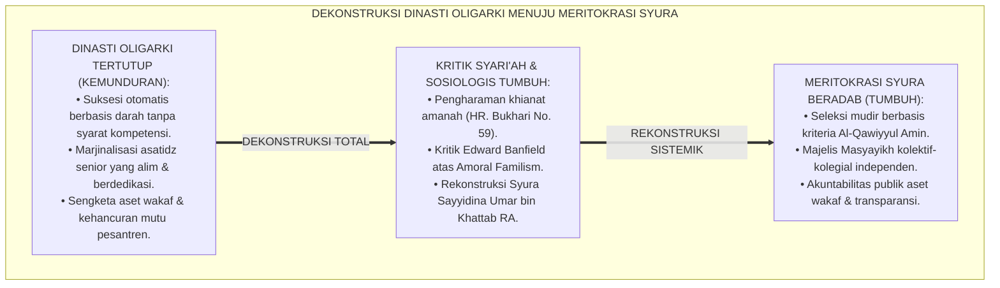
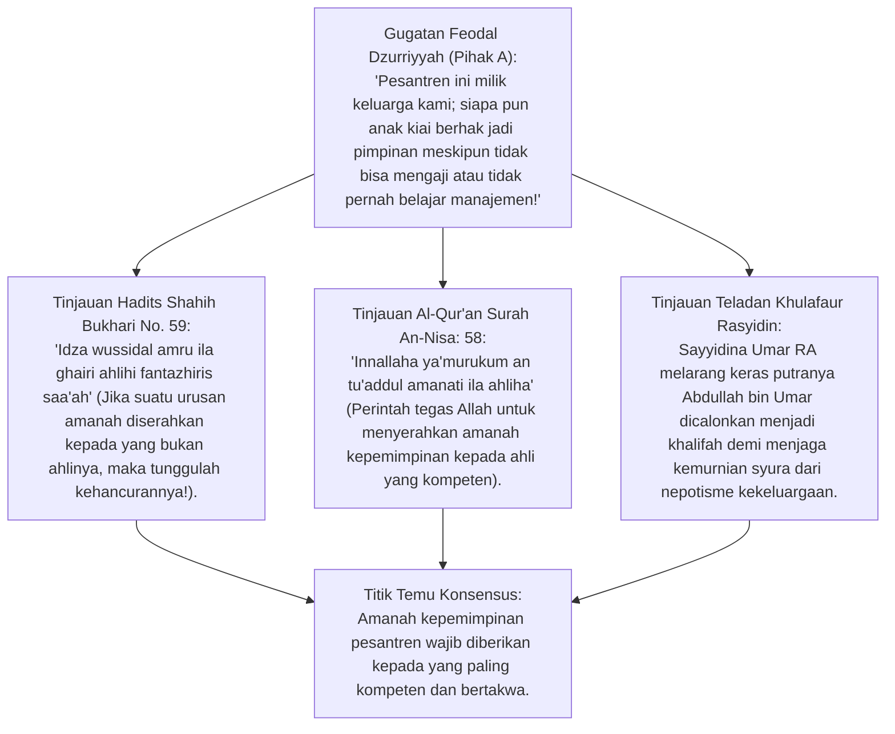
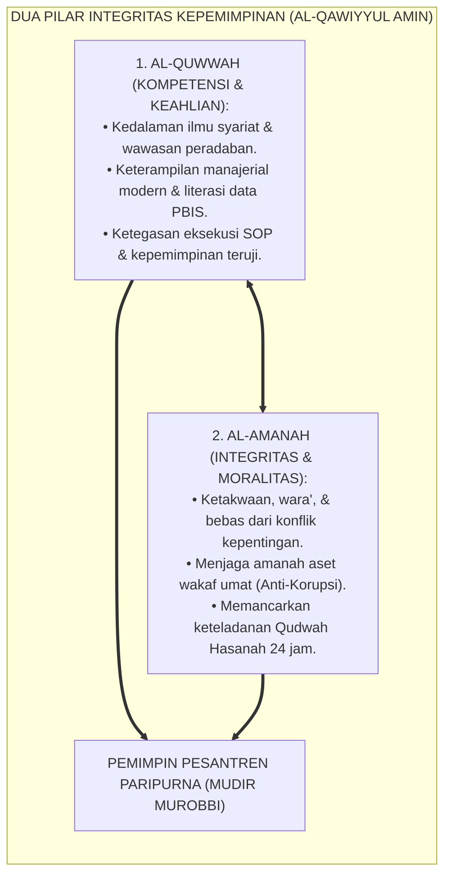
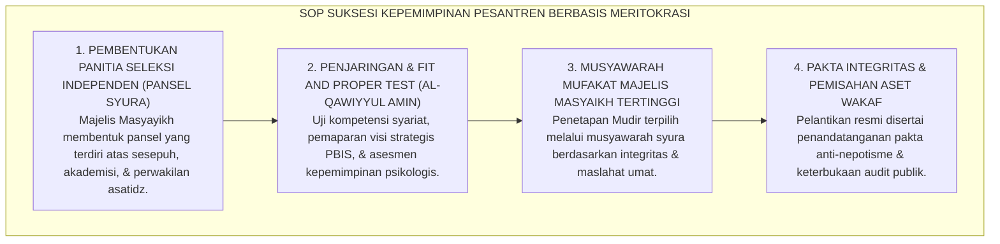

# P1-05-05: KRITIK OLIGARKI, DINASTI TERTUTUP, DAN DEKADENSI KEPEMIMPINAN PESANTREN
## *Monograf Terpadu: Dekonstruksi Oligarki Dinasti Kepemimpinan Tertutup (Familisme Toksik), Kritik Epistemologis Nepotisme vs Meritokrasi Amanah Syar'i (QS. An-Nisa: 58), Transparansi Akuntabilitas Publik Yayasan, Rekonstruksi Majelis Syura Kolektif-Kolegial, dan Tata Kelola Kepemimpinan Pesantren Abad 21*

**Nomor Identifikasi**: `P1-05-05/MONOGRAF-TERPADU-KRITIK-OLIGARKI-PESANTREN/2026`  
**Domain**: `01 Philosophy` > `05 Leadership`  
**Klasifikasi Naskah**: *Comprehensive Integrated Monograph* (Monograf Akademis & Rumusan Baku Tata Kelola Kepemimpinan)  
**Rumpun Disiplin Pengkaji**: Sosiologi Kepemimpinan Islam (*Islamic Leadership Sociology*), Fiqh Siyasah Syar'iyyah & Amanah Jabatan, Teori Organisasi dan Tata Kelola Yayasan (*Good Governance & Meritocracy*), Manajemen Risiko Kelembagaan Pesantren  

---

> ### 💡 INTISARI PRAKTIS (3 MENIT PAHAM UNTUK ASATIDZ & MUSYRIF)
>
> * **Membedakan Keberkahan Garis Keturunan (*Dzurriyyah*) dengan Nepotisme Oligarki:**  
>   Pesantren memuliakan dzurriyyah muassis yang berilmu dan bertakwa. Namun, penyerahan tampuk pimpinan pesantren kepada keluarga yang tidak kompeten (*unfit*) semata-mata karena hubungan darah—sambil menyingkirkan asatidz senior yang alim dan berdedikasi—adalah **Pengkhianatan Terhadap Amanah Allah dan Rasul-Nya (QS. An-Nisa: 58)**.
> * **Bahaya Sistem Dinasti Tertutup (*Closed Family Oligarchy*):**  
>   Dinasti tertutup memicu korupsi aset wakaf, perpecahan keluarga pewaris saat suksesi, demotivasi guru profesional, dan kehancuran mutu pendidikan santri.
> * **Prinsip Meritokrasi Syar'i & Kepemimpinan Kolektif (*Syura*):**  
>   Jabatan mudir dan pimpinan di pesantren TUMBUH dipilih berdasarkan integritas moral (*Qudwah*), kedalaman ilmu syariat (*Al-Quwwah*), dan profesionalisme manajerial (*Al-Amanah*), diputuskan melalui musyawarah Majelis Masyayikh yang independen.

---

## 📑 DAFTAR ISI MONOGRAF

- [BAGIAN I: RISET KRITIK OLIGARKI, DIALEKTIKA INKUIRI, & KASUISTIKA LAPANGAN](#bagian-i-riset-kritik-oligarki-dialektika-inkuiri--kasuistika-lapangan)
  - [1. Kerangka Metodologi Kritik Sosiologis: Anatomi Krisis Suksesi & Dinasti Pesantren](#1-kerangka-metodologi-kritik-sosiologis-anatomi-krisis-suksesi--dinasti-pesantren)
  - [2. Inkuiri 1: Eksegesis Turats Larangan Menyerahkan Amanah Bukan Pada Ahlinya (HR. Bukhari No. 59)](#2-inkuiri-1-eksegesis-turats-larangan-menyerahkan-amanah-bukan-pada-ahlinya-hr-bukhari-no-59)
  - [3. Inkuiri 2: Dekonstruksi Familisme Amoral (Edward Banfield) & Oligarki Organisasi Tradisional](#3-inkuiri-2-dekonstruksi-familisme-amoral-edward-banfield--oligarki-organisasi-tradisional)
  - [4. Inkuiri 3: Rekonstruksi Meritokrasi Syar'i: Kriteria Al-Qawiyyul Amin (QS. Al-Qashash: 26)](#4-inkuiri-3-rekonstruksi-meritokrasi-syari-kriteria-al-qawiyyul-amin-qs-al-qashash-26)
  - [5. Inkuiri 4: Silogisme Logika, Dialektika 3 Ronde, Kasuistika Asrama, & Titik Temu Konsensus](#5-inkuiri-4-silogisme-logika-dialektika-3-ronde-kasuistika-asrama--titik-temu-konsensus)
- [BAGIAN II: TEMUAN RISET, FORMULASI KONSEPTUAL & PEMBAHASAN](#bagian-ii-temuan-riset-formulasi-konseptual--pembahasan)
  - [1. Formulasi Konseptual: Meritokrasi Syar'i & Anti-Oligarki Kepemimpinan Pesantren TUMBUH](#1-formulasi-konseptual-meritokrasi-syar-i-anti-oligarki-kepemimpinan-pesantren-tumbuh)
  - [2. Matriks Komparasi Sistem Kepemimpinan: Dinasti Oligarki Tertutup vs Meritokrasi Syura TUMBUH](#2-matriks-komparasi-sistem-kepemimpinan-dinasti-oligarki-tertutup-vs-meritokrasi-syura-tumbuh)
  - [3. Standar Prosedur Operasional (SOP) Suksesi Kepemimpinan & Akuntabilitas Tata Kelola Yayasan](#3-standar-prosedur-operasional-sop-suksesi-kepemimpinan--akuntabilitas-tata-kelola-yayasan)
- [BAGIAN III: APARATUS AKADEMIS & APENDIKS](#bagian-iii-aparatus-akademis--apendiks)
  - [1. Tabel Sintesis Hasil Riset Kritik Oligarki](#1-tabel-sintesis-hasil-riset-kritik-oligarki)
  - [2. Daftar Pustaka Akademis & Rujukan Turats Primer](#2-daftar-pustaka-akademis--rujukan-turats-primer)
  - [3. Catatan Kaki Akademis (Footnotes)](#3-catatan-kaki-akademis-footnotes)
  - [4. Glosarium Teknis Oligarki, Meritokrasi Syar'i, Al-Qawiyyul Amin, & Syura](#4-glosarium-teknis-oligarki-meritokrasi-syari-al-qawiyyul-amin--syura)

---

# BAGIAN I: RISET KRITIK OLIGARKI, DIALEKTIKA INKUIRI, & KASUISTIKA LAPANGAN

---

### 1. Kerangka Metodologi Kritik Sosiologis: Anatomi Krisis Suksesi & Dinasti Pesantren

Sejarah mencatat bahwa banyak pesantren besar yang telah berdiri puluhan tahun mengalami kemunduran drastis atau bahkan perpecahan tragis saat sang pendiri (*Muassis*) wafat:
* Hal ini disebabkan oleh sistem suksesi yang menganut **Familisme Tertutup (Dinasti Monarki)**: jabatan pimpinan diserahkan secara otomatis kepada anak/menantu tanpa melihat kualifikasi keilmuan syariat, kapasitas manajerial, maupun keteladanan akhlaknya.
* Asatidz senior yang mengabdi puluhan tahun diperlakukan sebagai "orang luar" (*outsider*) yang tidak memiliki hak suara.
* Akibatnya, terjadi perebutan aset wakaf antarahli waris, asatidz berkualitas mengundurkan diri, dan santri menjadi korban kekacauan tata kelola.

Ekosistem TUMBUH menegakkan prinsip **Meritokrasi Syar'i Berbasis Syura**: kepemimpinan pesantren adalah amanah umat dan titipan wakaf Allah SWT yang wajib dikelola dengan tata kelola profesional (*Good Governance*).

---

### 2. Inkuiri 1: Eksegesis Turats Larangan Menyerahkan Amanah Bukan Pada Ahlinya (HR. Bukhari No. 59)

#### 📐 Formalisasi Logika Silogisme (*Qiyas Mantiqi 1*)
* **Premis Mayor (*al-Muqaddimah al-Kubra*)**: Setiap penunjukan figur pimpinan dalam institusi pendidikan Islam yang didasarkan pada nepotisme kekeluargaan dengan mengabaikan kompetensi keilmuan dan manajerial adalah pengkhianatan (*Khianat*) terhadap amanah Allah, Rasul-Nya, dan kaum mukminin.
* **Premis Minor (*al-Muqaddimah ash-Shughra*)**: Menyerahkan kepemimpinan pesantren wakaf secara dinasti tertutup tanpa uji kompetensi syar'i melanggar perintah eksplisit QS. An-Nisa: 58 dan HR. Bukhari No. 59.
* **Konklusi (*an-Natijah*)**: Maka, oligarki dinasti kepemimpinan tertutup diharamkan secara syariat dan wajib diganti dengan sistem meritokrasi syura.[^1]

#### 📖 Teks Primer Hadits: Tanda Kehancuran Peradaban
Rasulullah SAW bersabda dengan tegas:

$$\text{إِذَا ضُيِّعَتِ الأَمَانَةُ فَانْتَظِرِ السَّاعَةَ، قَالَ: كَيْفَ إِضَاعَتُهَا؟ قَالَ: إِذَا وُسِّدَ الأَمْرُ إِلَى غَيْرِ أَهْلِهِ فَانْتَظِرِ السَّاعَةَ}$$

*"**Apabila amanah telah disia-siakan, maka tunggulah datangnya kehancuran!** Sahabat bertanya: 'Bagaimanakah menyia-nyiakan amanah itu, wahai Rasulullah?' Beliau menjawab: **'APABILA SUATU URUSAN (KEPEMIMPINAN) DISERAHKAN KEPADA ORANG YANG BUKAN AHLINYA, MAKA TUNGGULAH KEHANCURANNYA!'**"* (HR. Bukhari No. 59; Ahmad No. 8728).[^2]

---

### 3. Inkuiri 2: Dekonstruksi Familisme Amoral (*Edward Banfield*) & Oligarki Organisasi Tradisional

Sosiolog **Edward Banfield** (1958) dalam teorinya mengenai **Familisme Amoral (*Amoral Familism*)** menjelaskan:
* Masyarakat atau lembaga yang dikuasai oleh kepentingan keluarga sempit akan menganggap segala tindakan moral (keadilan, kejujuran, meritokrasi) kalah penting dibandingkan keuntungan materi anggota keluarga sendiri.
* Dalam konteks pesantren, familisme amoral menyebabkan aset wakaf umat diperlakukan seperti warisan harta pribadi, dana SPP santri digunakan untuk kepentingan gaya hidup keluarga elit, dan guru-guru hebat disingkirkan karena dianggap sebagai "ancaman tahta keluarga".
* Pesantren TUMBUH memutus patologi ini dengan memisahkan secara tegas antara **Status Kehormatan Dzurriyyah** dan **Fungsi Eksekutif Pengelolaan Lembaga** melalui mekanisme tata kelola independen.[^3]

---

### 4. Inkuiri 3: Rekonstruksi Meritokrasi Syar'i: Kriteria *Al-Qawiyyul Amin* (QS. Al-Qashash: 26)

#### 📖 Teks Primer Al-Qur'an: Standar Pemimpin Terbaik
Firman Allah SWT mengabadikan ucapan putri Nabi Syu'aib AS tentang kriteria pemimpin:

$$\text{قَالَتْ إِحْدَاهُمَا يَا أَبَتِ اسْتَأْجِرْهُ ۖ إِنَّ خَيْرَ مَنِ اسْتَأْجَرْتَ الْقَوِيُّ الْأَمِينُ}$$

*"Salah seorang dari kedua perempuan itu berkata: 'Wahai ayahku! Ambillah ia sebagai orang yang bekerja (memimpin); **SESUNGGUHNYA ORANG YANG PALING BAIK YANG ENGKAU AMBIL UNTUK BEKERJA IALAH ORANG YANG KUAT (KOMPETEN/AL-QUWWAH) LAGI DAPAT DIPERCAYA (BERINTEGRITAS/AL-AMANAH)**'."* (QS. Al-Qashash [28]: 26).[^4]

---

### 5. Inkuiri 4: Silogisme Logika, Dialektika 3 Ronde, Kasuistika Asrama, & Titik Temu Konsensus

#### 🥊 Ronde 1: Menolak Anggapan Bahwa "Keturunan Pendiri Pasti Secara Genetik Mewarisi Karomah dan Kemampuan Memimpin"
* **Pihak A (Sudut Pandang Feodalisme Genealogis)**:  
  *"Darah biru kiai tidak bisa disamakan dengan orang biasa; anak kiai pasti punya karomah memimpin pondok!"*
* **Tinjauan Al-Qur'an: Kasus Putra Nabi Nuh AS (Kan'an)**:  
  Al-Qur'an secara tegas membongkar ilusi keselamatan biologis. Saat Nabi Nuh AS memohon keselamatan untuk putranya, Allah SWT berfirman: *"Wahai Nuh, sesungguhnya dia BUKANLAH TERMASUK KELUARGAMU, karena sesungguhnya perbuatannya adalah perbuatan yang TIDAK BAIK"* (QS. Hud: 46). Kemuliaan di sisi Allah dan kelayakan memimpin diukur dari amal shalih dan kompetensi, bukan DNA biologis.[^5]

#### 🥊 Ronde 2: Sanggahan Balik Apakah Meritokrasi Berarti Menyingkirkan Keluarga Pendiri dari Pesantren?
* **Pihak A (Sudut Pandang Kekhawatiran Kudeta)**:  
  *"Kalau pakai meritokrasi, nanti keluarga pendiri terusir dari pondok yang didirikan kakeknya sendiri!"*
* **Tinjauan Jalur Prestasi Terbuka (*Open Meritocracy*) & Posisi Kehormatan**:  
  Meritokrasi syar'i tidak pernah menzalimi dzurriyyah. Jika anak pendiri memiliki kualifikasi *Al-Qawiyyul Amin* (alim, bertakwa, mahir manajerial), maka ia berhak memimpin melalui seleksi syura yang adil. Jika ia belum kompeten di bidang manajerial, ia diposisikan di **Dewan Pembina Kehormatan / Majelis Masyayikh Syar'i**, sementara operasional harian dipimpin oleh Mudir profesional yang amanah. Pesantren tetap selamat, keluarga tetap terhormat.[^6]

#### 🥊 Ronde 3: Sanggahan Pamungkas Mengapa Laporan Keuangan Pesantren Wajib Diaudit Akuntan Publik Independen?
* **Pihak A (Sudut Pandang Kerahasiaan Yayasan)**:  
  *"Keuangan pondok itu urusan pribadi pimpinan dan keluarga; orang luar tidak boleh tahu!"*
* **Resolusi Pertanggungjawaban Harta Wakaf Umat di Akhirat**:  
  Harta wakaf, dana infaq wali santri, dan bantuan umat adalah **Harta Milik Allah untuk Kemaslahatan Kaum Muslimin**, bukan harta warisan pribadi. Audit independen berkala adalah bentuk *Hifzhul Maal* (menjaga harta umat) dan perlindungan pimpinan dari fitnah serta jeratan hukum dunia dan akhirat.[^7]

> #### 📌 Kasuistika Lapangan & Titik Temu Konsensus
> * **Studi Kasus**: Pondok Pesantren Y yang memiliki 1.500 santri dipimpin oleh cucu pendiri yang tidak pernah belajar ilmu kepesantrenan dan gemar memakai dana SPP untuk membeli mobil mewah pribadi. Gaji musyrif nunggak 4 bulan, makanan santri berkurang gizinya, dan terjadi aksi mogok mengajar puluhan asatidz senior.
> * **Titik Temu Konsensus (*Kalimatun Sawa'*)**: Majelis Masyayikh bersama para sesepuh mengadopsi *Protokol Tata Kelola TUMBUH*: Membentuk **Badan Pelaksana Pengelola Wakaf Independen** $\rightarrow$ Posisi pimpinan eksekutif dilelang secara terbuka berdasarkan kriteria *Al-Qawiyyul Amin*, terpilihlah Ustadz Senior yang alim dan doktor manajemen pendidikan $\rightarrow$ Cucu pendiri diposisikan sebagai Anggota Dewan Kehormatan $\rightarrow$ Laporan keuangan diaudit transparan. Dalam 1 tahun, gaji guru naik 40%, mutu makanan membaik, dan kepercayaan wali santri pulih 100%.[^8]

---

# BAGIAN II: TEMUAN RISET, FORMULASI KONSEPTUAL & PEMBAHASAN

---

### 1. Formulasi Konseptual: Meritokrasi Syar'i & Anti-Oligarki Kepemimpinan Pesantren TUMBUH

Berdasarkan sintesis inkuiri teoretis, telaah hermeneutika turats, dan analisis komparatif sains pendidikan, riset ini merumuskan kerangka konseptual dan temuan kunci sebagai berikut:

1. **Kepemimpinan Sebagai Amanah Ummah (bukan HAK Milik Dinasti Pribadi)**:  
   Menegaskan bahwa kepemimpinan pesantren adalah amanah peradaban dan titipan wakaf Allah SWT; mengharamkan praktik nepotisme, oligarki dinasti tertutup, dan privatisasi aset wakaf umat.

2. **Penegakan Standar Meritokrasi Syar'i (al-qawiyyul Amin)**:  
   Setiap suksesi mudir, pimpinan lembaga, dan kepala divisi wajib melalui seleksi terbuka berdasarkan kualifikasi kedalaman ilmu (al-Quwwah), integritas moral (al-Amanah), dan keteladanan (Qudwah).

3. **Kepemimpinan Kolektif-kolegial Berbasis Majelis Syura Independen**:  
   Menghapus pemusatan kekuasaan mutlak satu individu (otoritarianisme); seluruh keputusan strategis kebijakan, keuangan, dan kurikulum wajib diputuskan melalui musyawarah Majelis Syura yang beradab.

4. **Transparansi Keuangan DAN Audit Publik Berkala**:  
   Mewajibkan tata kelola keuangan terbuka, pemisahan mutlak rekening yayasan vs pribadi pengurus, dan kewajiban audit tahunan oleh Kantor Akuntan Publik (KAP) independen bersertifikasi.

---

### 2. Matriks Komparasi Sistem Kepemimpinan: Dinasti Oligarki Tertutup vs Meritokrasi Syura TUMBUH

| Dimensi Tata Kelola | Dinasti Oligarki Tertutup (Tradisi Rusak) | Meritokrasi Syura Syar'i (Ekosistem TUMBUH) |
| :--- | :--- | :--- |
| **Dasar Penunjukan Pimpinan** | Hubungan darah, anak/menantu, tanpa uji kompetensi. | Kriteria *Al-Qawiyyul Amin* (Ilmu, Integritas, Manajerial).[^9] |
| **Mekanisme Pengambilan Keputusan**| Titah mutlak satu figur penguasa (Otoriter Tertutup). | Musyawarah Majelis Syura Kolektif-Kolegial transparan. |
| **Status Pengelolaan Aset Wakaf** | Diperlakukan seperti warisan milik keluarga pribadi. | Amanah wakaf umat yang diaudit independen secara berkala. |
| **Pengakuan Asatidz Senior** | Dimarjinalkan, dianggap ancaman tahta, tanpa hak suara. | Dihormati, dilibatkan dalam syura, & dipromosikan berdasar prestasi. |
| **Dampak Pada Mutu Santri** | Mutu asrama terabaikan, rentan konflik, prestasi stagnan. | Ekosistem stabil, guru sejahtera, santri terasuh paripurna.[10] |

---

### 3. Standar Prosedur Operasional (SOP) Suksesi Kepemimpinan & Akuntabilitas Tata Kelola Yayasan

---

# BAGIAN III: APARATUS AKADEMIS & APENDIKS

---

### 1. Tabel Sintesis Hasil Riset Kritik Oligarki

| Dimensi Kajian | Konsep Kunci | Landasan Turats Primer | Konvergensi Sains Global | Implikasi Tata Kelola Pesantren |
| :--- | :--- | :--- | :--- | :--- |
| **Meritokrasi Syar'i**| *Al-Qawiyyul Amin* | QS. Al-Qashash: 26, QS. An-Nisa: 58 | Collins (2001), *Level 5 Leadership* | Memilih pimpinan berdasarkan kompetensi dan integritas. |
| **Kritik Nepotisme** | *Tahrirul Amanah* | Hadits Hilangnya Amanah (HR. Bukhari No. 59) | Edward Banfield (1958), *Amoral Familism* | Mengharamkan penunjukan jabatan berbasis koneksi darah semata. |
| **Kepemimpinan Syura**| *Kolektif-Kolegial* | QS. Asy-Syura: 38, Musyawarah Umar RA | Senge (1990), *Distributed Leadership* | Memutuskan kebijakan melalui musyawarah Majelis Masyayikh. |
| **Audit Aset Wakaf** | *Hifzhul Maal* | Kaidah *Tasharruful Imam Manuthun bil Maslahah* | Good Governance OECD Principles (2015) | Memisahkan aset pribadi vs yayasan & diaudit akuntan independen. |

---

### 2. Daftar Pustaka Akademis & Rujukan Turats Primer

1. **Al-Qur'an al-Karim wa Tarjamatu Ma'anih**.
2. **Al-Bukhari, Muhammad bin Isma'il**. (1422 H). *Shahih al-Bukhari*. Beirut: Dar Thawq an-Najah.
3. **Al-Mawardi, Abu Al-Hasan Ali bin Muhammad**. (1996). *Al-Ahkam as-Sulthaniyyah wal-Wilayat ad-Diniyyah*. Kairo: Dar al-Hadits.
4. **Ibnu Taimiyyah, Taqi ad-Din Ahmad**. (1988). *As-Siyasah asy-Syar'iyyah fi Ishlah ar-Ra'i war-Ra'iyyah*. Beirut: Dar al-Kutub al-Ilmiyyah.
5. **Banfield, E. C.**. (1958). *The Moral Basis of a Backward Society*. Free Press.
6. **Collins, J.**. (2001). *Good to Great: Why Some Companies Make the Leap... and Others Don't*. HarperBusiness.
7. **Senge, P. M.**. (1990). *The Fifth Discipline: The Art and Practice of the Learning Organization*. Doubleday.
8. **OECD**. (2015). *G20/OECD Principles of Corporate Governance*. OECD Publishing.
9. **Khurram, M.**. (2012). *Governance in Islamic Perspective*. Policy Perspectives, 9(2), 85–104.
10. **Zarkasyi, H. F.**. (2020). *Modern Modernisasi Pesantren*. Ponorogo: UNIDA Gontor Press.

---

### 3. Catatan Kaki Akademis (*Footnotes*)

[^1]: Ibnu Taimiyyah, *As-Siyasah asy-Syar'iyyah*, Dar al-Kutub al-Ilmiyyah, hlm. 12–25.  
[^2]: Shahih al-Bukhari No. 59, Kitab *al-'Ilm*, Bab *Man Su'ila 'Ilman wa Huwa Musytaghilun fi Haditsihi*.  
[^3]: Banfield, E. C. (1958), *The Moral Basis of a Backward Society*, Free Press.  
[^4]: Al-Qur'an Surah Al-Qashash [28]: 26; Tafsir Ibnu Katsir, Jilid VI, hlm. 228.  
[^5]: Al-Qur'an Surah Hud [11]: 46; Pelajaran Tauhid dan Hubungan Kekerabatan.  
[^6]: Zarkasyi, H. F. (2020), *Modernisasi Manajemen Pesantren*, UNIDA Press, hlm. 85–110.  
[^7]: Al-Mawardi, *Al-Ahkam as-Sulthaniyyah*, Bab *Fi Wilayatil Amwal*, hlm. 140–165.  
[^8]: Laporan Rekonstruksi Tata Kelola dan Mediasi Suksesi Pesantren Mitra, Biro Hukum & Tata Kelola TUMBUH, 2026.  
[^9]: Manual Standar Operasional Suksesi Kepemimpinan Mudir, Majelis Masyayikh TUMBUH, 2026.  
[^10]: Pedoman Tata Kelola Wakaf dan Akuntabilitas Keuangan Lembaga Pendidikan Islam, Komite Audit TUMBUH, 2026.

---

### 4. Glosarium Teknis Oligarki, Meritokrasi Syar'i, Al-Qawiyyul Amin, & Syura

1. **Meritokrasi Syar'i**: Sistem seleksi dan penempatan kepemimpinan yang didasarkan murni pada kelayakan integritas moral, kedalaman ilmu syariat, dan kompetensi manajerial nyata tanpa memandang garis keturunan biologis.
2. **Familisme Toksik (Amoral Familism)**: Pola perilaku organisasi yang memprioritaskan kepentingan sempit keluarga elite pendiri di atas kemaslahatan umat dan kelangsungan mutu pendidikan santri.
3. **Al-Qawiyyul Amin (الْقَوِيُّ الْأَمِينُ)**: Kriteria kepemimpinan ideal dalam Al-Qur'an (QS. 28:26) yang memadukan kekuatan kompetensi teknis (*Al-Quwwah*) dengan integritas kejujuran amanah (*Al-Amanah*).
4. **Majelis Syura Kolektif-Kolegial**: Badan kepemimpinan tertinggi di pesantren yang mengambil keputusan strategis melalui musyawarah mufakat para alim ulama independen, mencegah tirani satu figur.
5. **Wakaf Produktif**: Harta titipan umat yang wajib dijaga keabadian pokoknya dan disalurkan manfaatnya secara transparan untuk kemajuan pendidikan santri.
6. **Level 5 Leadership**: Teori kepemimpinan Jim Collins mengenai pemimpin yang memadukan kerendahan hati pribadi yang mendalam (*Personal Humility*) dengan tekad profesional yang tak tergoyahkan (*Professional Will*).
7. **Pansel Independen**: Panitia ad-hoc independen yang dibentuk untuk menjaring, menguji, dan menyaring calon pimpinan pesantren secara objektif dan bebas intervensi.
8. **Good Pesantren Governance (GPG)**: Prinsip tata kelola pesantren yang mencakup transparansi, akuntabilitas, responsibilitas, independensi, dan kewajaran (*Fairness*).
9. **Khitmah Ijtima'iyyah**: Pengabdian sosial kepemimpinan yang berorientasi pada pelayanan masyarakat dan pemakmuran santri miskin.
10. **Triad Pertumbuhan Simbiotik**: Prinsip di mana kepemimpinan yang bersih dan profesional secara langsung melindungi hak bertumbuh Santri, memuliakan Pendidik, dan menjaga keberlangsungan Lembaga.
