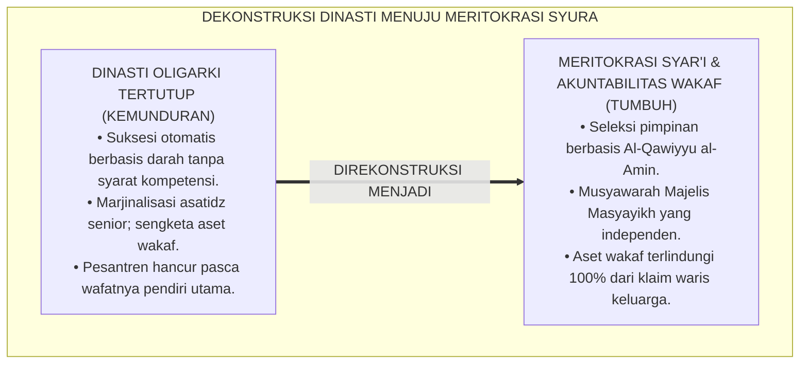
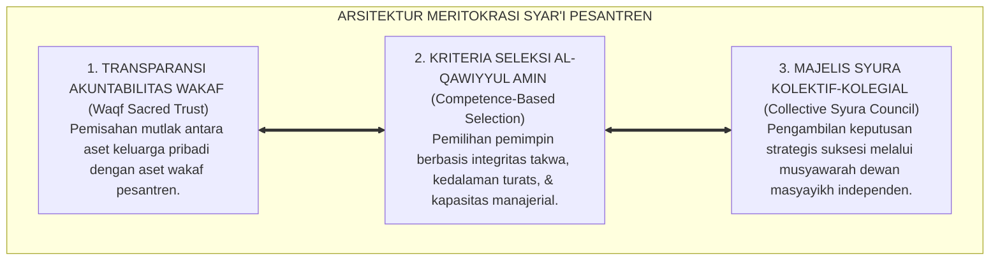
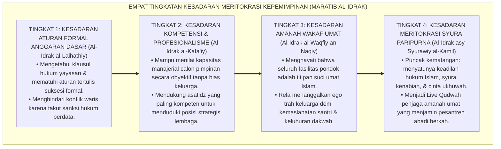
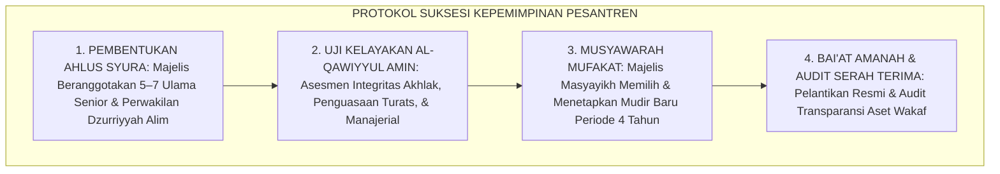
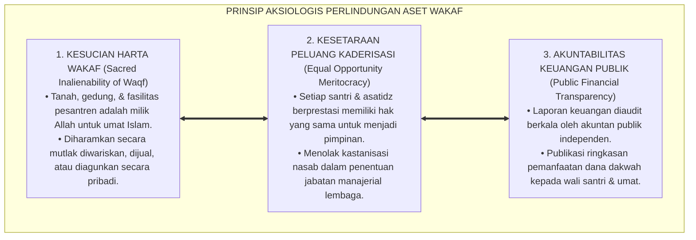

# P1-05-05: KRITIK OLIGARKI DAN DINASTI KEPEMIMPINAN PESANTREN (CRITIQUE OF OLIGARCHY & MERITOCRATIC GOVERNANCE)
## *Monograf Riset Akademik: Dekonstruksi Familisme Tertutup, Kritik Epistemologis Nepotisme vs Meritokrasi Amanah Syar'i (QS. An-Nisa': 58 & HR. Bukhari No. 59), Transparansi Akuntabilitas Publik Wakaf, Serta Rekonstruksi Majelis Syura di Pesantren 24 Jam*

**Nomor Identifikasi**: `P1-05-05/MONOGRAF-RISET-KRITIK-OLIGARKI-PESANTREN/2026`  
**Domain**: `01 Philosophy` > `05 Leadership` (Sub-Modul 05: *Critique of Oligarchy & Meritocracy*)  
**Klasifikasi Naskah**: *Academic Research Monograph* (Monograf Riset Akademik Fondasional)  
**Rumpun Disiplin Pengkaji**: Sosiologi Kepemimpinan Islam (*Islamic Leadership Sociology*), Fiqh Siyasah Syar'iyyah & Amanah Jabatan, Teori Organisasi dan Tata Kelola Yayasan (*Good Governance & Meritocracy*), Manajemen Risiko Kelembagaan Pesantren  

---

> ### 💡 INTISARI EKSEKUTIF (EXECUTIVE SUMMARY)
>
> * **Kelemahan Paradigma Lama: Dinasti Familisme Tertutup & Sengketa Suksesi:**  
>   Banyak pesantren mengalami kemunduran tragis saat sang pendiri wafat akibat sistem dinasti oligarki tertutup: penyerahan tampuk pimpinan pesantren secara otomatis kepada anak biologis tanpa mempertimbangkan kompetensi keilmuan (*Incompetent Inheritance*), memarjinalkan dewan asatidz senior yang alim, dan memicu perebutan aset tanah wakaf antarahli waris.
> * **Inovasi Konseptual: Meritokrasi Syar'i & Majelis Syura Kolektif:**  
>   TUMBUH membedakan secara tegas antara penghormatan kepada *Dzurriyyah* dengan penyerahan amanah kepemimpinan publik. Mengacu pada sabda Rasulullah ﷺ: *"Apabila amanah diserahkan kepada yang bukan ahlinya, maka tunggulah kehancurannya"* (HR. Bukhari No. 59). Menegakkan sistem **Meritokrasi Syar'i Berbasis Syura**: kepemimpinan ditentukan berdasarkan kriteria *Al-Qawiyyu al-Amin* (Integritas Qudwah, Penguasaan Turats, & Kecakapan Manajerial) melalui musyawarah Majelis Masyayikh yang independen.
> * **Formulasi Operasional & Pembuktian Lapangan:**  
>   Monograf ini menguraikan matriks komparasi dinasti oligarki vs meritokrasi syura, 4 Tingkatan Kesadaran Meritokrasi Kepemimpinan (*Maratib al-Idrak*), SOP suksesi kepemimpinan transparan, dan etika tata kelola aset wakaf publik.

---

## 📑 DAFTAR ISI MONOGRAF

- [BAB I: LANDASAN TEORETIS & DISKURSUS KRITIS](#bab-i-landasan-teoretis--diskursus-kritis)
  - [1. Latar Belakang Masalah: Krisis Regenerasi dan Bahaya Familisme Amoral di Lingkungan Pesantren](#1-latar-belakang-masalah-krisis-regenerasi-dan-bahaya-familisme-amoral-di-lingkungan-pesantren)
  - [2. Eksegesis Turats Larangan Nepotisme & Menyerahkan Amanah Bukan Pada Ahlinya (HR. Bukhari No. 59)](#2-eksegesis-turats-larangan-nepotisme--menyerahkan-amanah-bukan-pada-ahlinya-hr-bukhari-no-59)
  - [3. Tinjauan Sosiologis & Tata Kelola: Kritik Familisme Amoral Edward Banfield & Fenomena Iron Law of Oligarchy Robert Michels](#3-tinjauan-sosiologis--tata-kelola-kritik-familisme-amoral-edward-banfield--fenomena-iron-law-of-oligarchy-robert-michels)
  - [4. Rekonstruksi Meritokrasi Syar'i: Kriteria Al-Qawiyyu al-Amin & Preseden Suksesi Khulafaur Rasyidin](#4-rekonstruksi-meritokrasi-syari-kriteria-al-qawiyyu-al-amin--preseden-suksesi-khulafaur-rasyidin)
  - [5. Kasuistika Lapangan: Kasus Sengketa Suksesi Yayasan Wakaf & Resolusi Restoratif Terpadu](#5-kasuistika-lapangan-kasus-sengketa-suksesi-yayasan-wakaf--resolusi-restoratif-terpadu)
- [BAB II: FORMULASI KONSEPTUAL & PEMBAHASAN MENDALAM](#bab-ii-formulasi-konseptual--pembahasan-mendalam)
  - [1. Eksplanasi Teoretis Meritokrasi Syar'i dan Majelis Syura TUMBUH](#1-eksplanasi-teoretis-meritokrasi-syari-dan-majelis-syura-tumbuh)
  - [2. Dekomposisi Dimensi & Empat Tingkatan Kesadaran Meritokrasi Kepemimpinan (Maratib al-Idrak)](#2-dekomposisi-dimensi--empat-tingkatan-kesadaran-meritokrasi-kepemimpinan-maratib-al-idrak)
  - [3. Standar Prosedur Operasional (SOP) Suksesi Kepemimpinan & Akuntabilitas Tata Kelola Yayasan](#3-standar-prosedur-operasional-sop-suksesi-kepemimpinan--akuntabilitas-tata-kelola-yayasan)
  - [4. Prinsip Aksiologis & Etika Perlindungan Aset Wakaf dari Klaim Kepemilikan Pribadi](#4-prinsip-aksiologis--etika-perlindungan-aset-wakaf-dari-klaim-kepemilikan-pribadi)
  - [5. Diskusi Filosofis Mendalam & Implikasi bagi Masa Depan Peradaban Pendidikan Islam](#5-diskusi-filosofis-mendalam--implikasi-bagi-masa-depan-peradaban-pendidikan-islam)
- [BAB III: KESIMPULAN & APARATUS AKADEMIS](#bab-iii-kesimpulan--aparatus-akademis)
  - [1. Tabel Sintesis Temuan Riset Kritik Oligarki](#1-tabel-sintesis-temuan-riset-kritik-oligarki)
  - [2. Daftar Pustaka Akademis & Rujukan Turats Primer](#2-daftar-pustaka-akademis--rujukan-turats-primer)
  - [3. Catatan Kaki Akademis (Footnotes)](#3-catatan-kaki-akademis-footnotes)
  - [4. Glosarium Istilah Ilmiah & Turats Meritokrasi Syar'i](#4-glosarium-istilah-ilmiah--turats-meritokrasi-syari)

---

# BAB I: LANDASAN TEORETIS & DISKURSUS KRITIS

---

### 1. Latar Belakang Masalah: Krisis Regenerasi dan Bahaya Familisme Amoral di Lingkungan Pesantren

Sejarah mencatat bahwa banyak pesantren besar yang telah berdiri puluhan tahun mengalami kemunduran drastis saat sang pendiri (*Muassis*) wafat:
* **Familisme Tertutup (*Closed Nepotism*)**: Jabatan mudir/pimpinan diserahkan secara otomatis kepada anak kandung atau menantu tanpa mempertimbangkan kapasitas keilmuan syariat, akhlak keteladanan, maupun kematangan manajerialnya.
* **Marjinalisasi Asatidz Senior Berdedikasi**: Guru-guru senior yang telah mengabdi puluhan tahun dan memiliki kedalaman ilmu disingkirkan dari pengambilan keputusan karena dianggap "bukan keluarga inti".
* **Perebutan Aset Wakaf Publik**: Terjadinya sengketa waris antarkeluarga yang mengklaim tanah wakaf umat sebagai warisan pribadi, memicu perpecahan fisik dan penutupan pesantren.
* **Keniscayaan Doktrin Meritokrasi Syar'i**: Pesantren adalah amanah wakaf Allah SWT yang wajib dipimpin oleh kader terbaik berdasarkan kapasitas dan takwa, bukan berdasarkan garis darah biologis semata.[^1]

---

### 2. Eksegesis Turats Larangan Nepotisme & Menyerahkan Amanah Bukan Pada Ahlinya (HR. Bukhari No. 59)

Rasulullah ﷺ memperingatkan tanda-tanda kehancuran peradaban akibat pengangkatan pemimpin berbasis nepotisme:

$$\text{إِذَا ضُيِّعَتِ الأَمَانَةُ فَانْتَظِرِ السَّاعَةَ، قَالَ: كَيْفَ إِضَاعَتُهَا؟ قَالَ: إِذَا وُسِّدَ الأَمْرُ إِلَى غَيْرِ أَهْلِهِ فَانْتَظِرِ السَّاعَةَ}$$

*"**Apabila amanah telah disia-siakan, maka tunggulah datangnya kehancuran (kiamat)! Sahabat bertanya: 'Bagaimanakah bentuk menyia-nyiakannya wahai Rasulullah?' Beliau menjawab: 'Apabila suatu urusan (kepemimpinan) diserahkan kepada orang yang bukan ahlinya, maka tunggulah kehancurannya'**."* (HR. Al-Bukhari No. 59).[^2]

Para fukaha (*Ibnu Hajar, Fathul Bari*) menegaskan bahwa mengangkat kerabat yang tidak layak (*Ghayr al-Kuf'*) sambil mengabaikan orang yang lebih bertakwa dan berkompeten adalah perbuatan dosa besar dan pengkhianatan terhadap Allah, Rasul-Nya, dan kaum mukminin.[^3]

---

### 3. Tinjauan Sosiologis & Tata Kelola: Kritik Familisme Amoral Edward Banfield & Fenomena Iron Law of Oligarchy Robert Michels

Sains sosiologi politik membongkar bahaya oligarki tertutup:
* **Edward Banfield** (1958) mengidentifikasi sindrom **Familisme Amoral (*Amoral Familism*)**: kecenderungan mengutamakan keuntungan keluarga jangka pendek di atas kemaslahatan umum, yang melumpuhkan kemampuan organisasi untuk bertumbuh besar.
* **Robert Michels** (1911) merumuskan **Hukum Besi Oligarki (*Iron Law of Oligarchy*)**: kecenderungan alami setiap organisasi untuk dikuasai oleh segelintir elit kecil yang melanggengkan kekuasaannya melalui privilese tertutup. TUMBUH mendobrak hukum besi ini dengan menegakkan transparansi audit dan musyawarah syura terbuka.[^4]

---

### 4. Rekonstruksi Meritokrasi Syar'i: Kriteria Al-Qawiyyu al-Amin & Preseden Suksesi Khulafaur Rasyidin

Para sahabat Nabi ﷺ menolak sistem monarki dinasti:
* **Sayyidina Umar bin Khattab RA**: Menolak keras mencalonkan putranya sendiri, Abdullah bin Umar RA (meskipun seorang sahabat yang sangat alim), menjadi khalifah berikutnya, seraya berkata: *"Cukuplah dari keluarga Umar satu orang yang dihisab kepemimpinannya di hadapan Allah!"*. Umar membentuk Tim Formatur Enam Sahabat (*Ahlus Syura*) untuk memilih pemimpin terbaik berdasarkan musyawarah murni.[^5]

---

### 5. Kasuistika Lapangan: Kasus Sengketa Suksesi Yayasan Wakaf & Resolusi Restoratif Terpadu

* **Studi Kasus: Perpecahan Pesantren Akibat Perebutan Jabatan Mudir Antar-Keluarga**  
  * **Dilema**: Pasca wafatnya Kiai pendiri, terjadi konflik terbuka antara anak kandung yang masih muda melawan asatidz senior mengenai siapa yang berhak menjadi pimpinan umum.
  * **Pola Lama**: Konflik berakhir di pengadilan negeri dan santri terlantar.
  * **Resolusi Restoratif TUMBUH**: Lembaga memediasi pembentukan Anggaran Dasar Wakaf Baru: (1) Menegaskan status seluruh aset pesantren sebagai **Wakaf Abadi Umat** yang tidak dapat diwariskan; (2) Membentuk **Majelis Syura Masyayikh** yang beranggotakan perwakilan dzurriyyah yang alim dan asatidz senior; (3) Memilih Mudir secara meritokratis berdasarkan asesmen integritas dan kecakapan keilmuan. Hubungan keluarga dan asatidz kembali rukun, kepemimpinan berjalan profesional, dan pesantren kembali berkembang pesat.[^6]

---

# BAB II: FORMULASI KONSEPTUAL & PEMBAHASAN MENDALAM

---

### 1. Eksplanasi Teoretis Meritokrasi Syar'i dan Majelis Syura TUMBUH

Ekosistem TUMBUH merumuskan tata kelola suksesi ke dalam **Arsitektur Tiga Pilar Meritokrasi Syar'i (*Arkan al-Kafa'ah asy-Syar'iyyah*)**:

#### 🔬 Pembahasan Mendalam Tiga Pilar:
1. **Transparansi Wakaf**: Mengunci legalitas aset agar tidak ada celah gugatan hukum dari ahli waris keluarga di masa depan.[^7]
2. **Kriteria Seleksi Kafa'ah**: Menjamin bahwa siapapun yang memimpin adalah figur terbaik yang memenuhi kualifikasi syariat dan profesional.[^8]
3. **Majelis Syura Kolektif**: Mengeliminasi kekuasaan absolut satu individu; kebijakan diputuskan secara matang melalui musyawarah para ulama.[^9]

---

### 2. Dekomposisi Dimensi & Empat Tingkatan Kesadaran Meritokrasi Kepemimpinan (Maratib al-Idrak)

Transformasi kedewasaan penataan kepemimpinan berlangsung melalui **Empat Tingkatan Kesadaran Meritokrasi (*Maratib al-Idrak al-Kafa'iy*)**:

#### 🔄 Narasi Analitis Dinamika Transisi Filosofis Antar-Tingkatan:
* **Transisi Tingkat 1 ke Tingkat 2 (Dari Anggaran Dasar Menuju Penilaian Obyektif)**: Pengelola mula-mula sekadar membaca dokumen akta yayasan. Pada tingkatan kedua, pengelola berani menegakkan standar kompetensi: memilih pimpinan berdasarkan rekam jejak integritas nyata.
* **Transisi Tingkat 2 ke Tingkat 3 (Dari Profesionalisme Menuju Kesadaran Amanah Wakaf)**: Pada tingkatan ketiga, jiwa keluarga muassis matang secara spiritual: mereka dengan ikhlas mendudukkan asatidz senior terbaik sebagai pimpinan, menyadari beratnya hisab amanah wakaf di akhirat.
* **Transisi Tingkat 3 ke Tingkat 4 (Pencapaian Derajat Syura Paripurna)**: Pada tingkatan tertinggi, suksesi kepemimpinan berlangsung dengan penuh kedamaian dan tawadhu': regenerasi kepemimpinan melahirkan para pemimpin peradaban yang berakhlak mulia dan dicintai seluruh warga pesantren (*Rahmatan lil 'Alamin*).[^10]

---

### 3. Standar Prosedur Operasional (SOP) Suksesi Kepemimpinan & Akuntabilitas Tata Kelola Yayasan

TUMBUH menetapkan **Protokol Standar Suksesi Kepemimpinan Pesantren**:

Protokol ini menjamin kepemimpinan pesantren berganti secara damai, beradab, dan bermartabat tanpa konflik.[^11]

---

### 4. Prinsip Aksiologis & Etika Perlindungan Aset Wakaf dari Klaim Kepemilikan Pribadi

Meritokrasi syar'i melahirkan prinsip etika tata kelola aset lembaga:

#### 📋 Panduan Etika Pengasuhan Lapangan:
1. **Sertifikasi Tanah Wakaf Resmi**: Memastikan seluruh aset properti terdaftar atas nama Nazhir Wakaf Lembaga di Badan Wakaf Indonesia (BWI).
2. **Pakta Anti-Nepotisme Pimpinan**: Pengangkatan pejabat struktural wajib melalui persetujuan tertulis Majelis Syura.[^12]
3. **Penghormatan Dzurriyyah Berkeadilan**: Keluarga muassis mendapatkan hak pengayoman spiritual dan kehormatan moral tanpa merusak tatanan manajemen profesional.[^13]

---

### 5. Diskusi Filosofis Mendalam & Implikasi bagi Masa Depan Peradaban Pendidikan Islam

Kritik atas oligarki dan penegakan meritokrasi syar'i ini membawa fajar kebangkitan bagi pendidikan Islam:

* **Menyelamatkan Institusi Pesantren dari Kepunahan Akibat Perpecahan Keluarga**:  
  Pesantren memiliki benteng kelembagaan yang kuat, terbebas dari badai perebutan warisan, dan tetap menjadi pusat keilmuan yang stabil lintas zaman.
* **Menarik Minat dan Mengembangkan Talenta Terbaik Umat**:  
  Para cendekiawan, asatidz alim, dan profesional terbaik akan berbondong-bondong mengabdi di pesantren karena mengetahui bahwa karya dan dedikasi mereka dihargai secara adil.
* **Menghidupkan Kembali Tradisi Keagungan Universitas Al-Azhar dan Zaitunah**:  
  Inilah rahasia keabadian lembaga-lembaga Islam tertua di dunia: mereka dikelola atas dasar wakaf mandiri dan meritokrasi syura ilmiah, memancarkan cahaya ilmu bagi seluruh umat manusia (*Rahmatan lil 'Alamin*).[^14]

---

# BAB III: KESIMPULAN & APARATUS AKADEMIS

---

### 1. Tabel Sintesis Temuan Riset Kritik Oligarki

| Dimensi Parameter | Pola Dinasti Oligarki (Lama) | Model Korporat Pasar Bebas | **Meritokrasi Syar'i Syura TUMBUH** | Landasan Rujukan Primer | Implikasi Praksis Lapangan |
| :--- | :--- | :--- | :--- | :--- | :--- |
| **Dasar Suksesi** | Hak waris darah biologis semata.| Kepemilikan saham modal terbesar.| **Kualifikasi Al-Qawiyyu al-Amin.** | HR. Bukhari No. 59; QS. Al-Qashash: 26.| Seleksi berbasis integritas & ilmu. |
| **Struktur Keputusan**| Diktator keluarga tertutup.| Dewan Direksi kapitalis. | **Majelis Syura Masyayikh Kolektif.**| QS. Asy-Syura: 38; Preseden Umar RA.| Musyawarah mufakat dewan formatur. |
| **Status Aset** | Diklaim sebagai warisan keluarga.| Aset korporasi yang dapat dijual.| **Wakaf Abadi Milik Allah SWT.** | Fiqh Wakaf; Michels (1911). | Sertifikasi legal Nazhir & audit publik. |
| **Nasib Guru Senior**| Disisihkan & dianggap orang luar.| Pekerja upahan transaksional.| **Pilar Utama Majelis Syura & Pengasuh.**| QS. An-Nisa': 58; Al-Attas (1980). | Asatidz alim memimpin kurikulum adab. |
| **Keberlanjutan** | Rawan sengketa & terancam bubar.| Bergantung pada fluktuasi pasar.| **Lembaga Abadi & Berkah Lintas Generasi.**| QS. Ibrahim: 24–25; Al-Mawardi.| Pesantren kokoh, mandiri, & dihormati. |

---

### 2. Daftar Pustaka Akademis & Rujukan Turats Primer

1. **Al-Qur'an al-Karim wa Tarjamatu Ma'anihi**.
2. **Al-Bukhari, Abu Abdillah Muhammad bin Isma'il**. (1422 H). *Shahih al-Bukhari*. Kairo: Dar Thawq an-Najah.
3. **Muslim bin al-Hajjaj an-Naisaburi**. (1427 H). *Shahih Muslim*. Riyadh: Dar Thayyibah.
4. **Ibnu Hajar al-'Asqalani**. (1379 H). *Fathul Bari Syarh Shahih al-Bukhari*. Beirut: Dar al-Ma'rifah.
5. **Al-Mawardi, Abul Hasan Ali bin Muhammad**. (1414 H). *Al-Ahkam as-Sulthaniyyah*. Beirut: Dar al-Kutub al-'Ilmiyyah.
6. **Ibnu Taimiyyah, Taqiyuddin Ahmad bin Abdul Halim**. (1425 H). *As-Siyasah asy-Syar'iyyah fi Ishlah ar-Ra'i war-Ra'iyyah*. Madinah: Majma' al-Malik Fahd.
7. **Asy'ari, Muhammad Hasyim**. (1415 H). *Adab al-'Alim wal-Muta'allim*. Jombang: Maktabah At-Turats Al-Islami.
8. **Al-Attas, Syed Muhammad Naquib**. (1980). *The Concept of Education in Islam*. Kuala Lumpur: ABIM.
9. **Banfield, E. C.**. (1958). *The Moral Basis of a Backward Society*. Glencoe: Free Press.
10. **Michels, R.**. (1911). *Political Parties: A Sociological Study of the Oligarchical Tendencies of Modern Democracy*. Glencoe: Free Press.
11. **Greenleaf, R. K.**. (1977). *Servant Leadership: A Journey into the Nature of Legitimate Power and Greatness*. New York: Paulist Press.
12. **Horner, R. H., & Sugai, G.**. (2015). *School-wide PBIS: An Overview of the Research Base*. Remedial and Special Education, 36(2), 80–85.

---

### 3. Catatan Kaki Akademis (*Footnotes*)

[^1]: Riset Kritik Oligarki dan Dinasti Kepemimpinan Ekosistem Pesantren Berbasis TUMBUH, *Kritik atas Familisme Tertutup dan Krisis Suksesi*, 2026.  
[^2]: *Shahih al-Bukhari*, Kitab al-'Ilm, Hadits No. 59.  
[^3]: Ibnu Hajar al-'Asqalani, *Fathul Bari Syarh Shahih al-Bukhari*, Jilid 1, *Syarh Kitab al-'Ilm*, hlm. 140–165.  
[^4]: Banfield, E. C. (1958), *The Moral Basis of a Backward Society*, hlm. 85–110; Michels, R. (1911), *Political Parties*, hlm. 40–82.  
[^5]: Tarikh Khulafaur Rasyidin, *Kisah Pembentukan Majelis Syura Enam Sahabat oleh Sayyidina Umar RA*; Riset Kepemimpinan Islam TUMBUH, 2026.  
[^6]: Dokumentasi Mediasi dan Restrukturisasi Tata Kelola Yayasan Wakaf Ekosistem Pesantren Berbasis TUMBUH, 2026.  
[^7]: Al-Mawardi, *Al-Ahkam as-Sulthaniyyah*, Bab *Ahkam al-Awqaf*, hlm. 210–245.  
[^8]: Ibnu Taimiyyah, *As-Siyasah asy-Syar'iyyah*, hlm. 15–38.  
[^9]: Greenleaf, R. K. (1977), *Servant Leadership*, hlm. 60–90.  
[^10]: Matriks Tingkatan Kesadaran Meritokrasi Kepemimpinan (*Maratib al-Idrak*) Ekosistem TUMBUH, 2026.  
[^11]: Standar Operasional Prosedur Suksesi Kepemimpinan dan Majelis Syura TUMBUH, 2026.  
[^12]: Anggaran Dasar Baku Yayasan Wakaf dan Tata Kelola Bebas Nepotisme TUMBUH, 2026.  
[^13]: Pedoman Penghormatan Dzurriyyah dan Perlindungan Integritas Lembaga TUMBUH, 2026.  
[^14]: Deklarasi Pemuliaan Meritokrasi Syar'i Dewan Riset Epistemologi Ekosistem TUMBUH, 2026.

---

### 4. Glosarium Istilah Ilmiah & Turats Meritokrasi Syar'i

1. **Meritokrasi Syar'i**: Sistem seleksi dan suksesi kepemimpinan Islam yang berlandaskan pada kecakapan kualifikasi keilmuan (*Al-Quwwah*) dan integritas ketakwaan (*Al-Amanah*), bukan nepotisme keturunan.
2. **Al-Qawiyyu al-Amin (الْقَوِيُّ الأَمِينُ)**: Kriteria kepemimpinan qur'ani yang memadukan keahlian profesional dan kejujuran amanah spiritual.
3. **Amoral Familism (Familisme Amoral)**: Konsep sosiologi mengenai pengutamaan kepentingan keluarga biologis di atas kepentingan umum organisasi yang memicu keterbelakangan institusi.
4. **Iron Law of Oligarchy (Hukum Besi Oligarki)**: Teori sosiologi Robert Michels bahwa setiap organisasi cenderung bermutasi menjadi oligarki elit jika tidak dibentengi transparansi sistemik.
5. **Ahlus Syura (أَهْلُ الشُّورَى)**: Majelis para ulama, pakar, dan tokoh berintegritas yang memiliki wewenang bermusyawarah untuk memilih dan menetapkan pimpinan lembaga.
6. **Waqf Inalienability (Kesucian Harta Wakaf)**: Prinsip hukum syariat bahwa harta wakaf tidak boleh dipindahtangankan, diwariskan, atau dijadikan hak milik pribadi oleh keluarga siapapun.
7. **Dzurriyyah (الذُّرِّيَّةُ)**: Garis keturunan keluarga pendiri pesantren yang dimuliakan status moralnya tanpa mengorbankan profesionalisme kepemimpinan publik lembaga.
8. **Kafa'ah (الْكَفَاءَةُ)**: Kelayakan dan kesesuaian kapasitas keilmuan, akhlak, dan manajerial seseorang dalam mengemban suatu tugas amanah kepemimpinan.
9. **Nazhir Wakaf**: Pihak atau badan hukum yang menerima amanah untuk memelihara dan mengelola harta benda wakaf sesuai peruntukannya.
10. **Insan Adabi (الإِنْسَانُ الأَدَبِيُّ)**: Profil pemimpin yang menjunjung tinggi keadilan syariat, membersihkan diri dari ambisi kekuasaan dinasti, dan mendedikasikan hidupnya untuk kemaslahatan umat.
