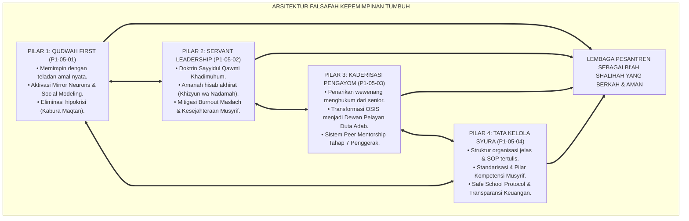
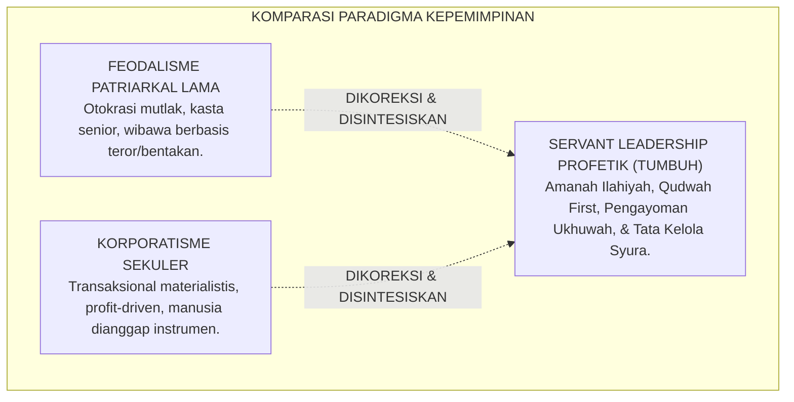
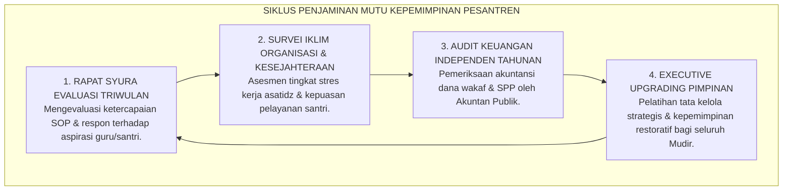

# P1-05-05: SINTESIS FALSAFAH KEPEMIMPINAN TUMBUH DAN MANIFESTO KEPEMIMPINAN PELAYAN PESANTREN
## *Monograf Terpadu: Sintesis Holistik 4 Pilar Kepemimpinan Pesantren (Qudwah First, Servant Leadership, Kaderisasi Santri Pengayom, & Tata Kelola Syura), Matriks Komparasi Kepemimpinan Feodal vs Korporatis vs TUMBUH, Manifesto Kelembagaan Kepemimpinan Khidmah, serta Jembatan Epistemologis Menuju Sub-Domain 06 Change*

**Nomor Identifikasi**: `P1-05-05/MONOGRAF-TERPADU-SINTESIS-LEADERSHIP/2026`  
**Domain**: `01 Philosophy` > `05 Leadership`  
**Klasifikasi Naskah**: *Comprehensive Synthesis Monograph* (Monograf Sintesis Filosofis & Manifesto Baku Kelembagaan)  
**Rumpun Disiplin Pengkaji**: Filsafat Kepemimpinan Islam (*Falsafah al-Qiyadah wal-Imamah*), Servant Leadership Theory, Tata Kelola Organisasi Pendidikan, Manajemen Transformasi Kelembagaan Pesantren  

---

> ### 💡 INTISARI PRAKTIS (3 MENIT PAHAM UNTUK ASATIDZ & MUSYRIF)
>
> * **Kesatuan Utuh 4 Pilar Kepemimpinan Ekosistem TUMBUH:**  
>   Kepemimpinan di pesantren TUMBUH adalah integrasi harmonis antara keteladanan, pengabdian, kaderisasi persaudaraan, dan tata kelola profesional:  
>   1. **P1-05-01 (Qudwah First):** Mencontohkan amal shalih dan akhlak karimah mendahului ribuan kata perintah verbal.  
>   2. **P1-05-02 (Servant Leadership):** Memposisikan diri sebagai pelayan santri (*Sayyidul Qawmi Khadimuhum*) dan melindungi musyrif dari kelelahan mental (*Burnout*).  
>   3. **P1-05-03 (Kaderisasi Santri Pengayom):** Menghapus mutlak wewenang menghukum dari tangan santri senior dan mengubah OSIS menjadi Duta Adab (*Peer Mentors*).  
>   4. **P1-05-04 (Tata Kelola Syura & Standar Musyrif):** Menerapkan manajemen berbasis sistem yang transparan, akuntabel, dan tersertifikasi 4 pilar kompetensi pengasuhan.
> * **Posisi TUMBUH vs Mazhab Kepemimpinan Lain:**  
>   TUMBUH menolak feodalisme patriarkal yang sewenang-wenang dan menolak korporatisme transaksional sekuler yang materialistis, menegakkan **Kepemimpinan Profetik Khidmah Berbasis Nilai Tauhid**.
> * **Manifesto Kelembagaan Kepemimpinan Pelayan:**  
>   Lembaga memproklamirkan bahwa pesantren dipimpin oleh para pelayan umat yang memuliakan martabat insan, berakhlak Al-Qur'an hidup, dan siap mempertanggungjawabkan setiap tetes amanah di hadapan Allah SWT di Hari Kiamat.

---

## 📑 DAFTAR ISI MONOGRAF

- [BAGIAN I: SINTESIS FILOSOFIS 4 PILAR KEPEMIMPINAN & MATRIKS KOMPARASI](#bagian-i-sintesis-filosofis-4-pilar-kepemimpinan--matriks-komparasi)
  - [1. Arsitektur Sintesis Holistik: Konvergensi 4 Pilar Falsafah Kepemimpinan TUMBUH](#1-arsitektur-sintesis-holistik-konvergensi-4-pilar-falsafah-kepemimpinan-tumbuh)
  - [2. Matriks Komparasi Filosofis Kepemimpinan: Feodalisme Patriarkal vs Korporatis Sekuler vs Servant Leadership TUMBUH](#2-matriks-komparasi-filosofis-kepemimpinan-feodalisme-patriarkal-vs-korporatis-sekuler-vs-servant-leadership-tumbuh)
  - [3. Jembatan Epistemologis & Aksiologis Menuju Sub-Domain 06 Change (Dinamika Perubahan Sistemik)](#3-jembatan-epistemologis--aksiologis-menuju-sub-domain-06-change-dinamika-perubahan-sistemik)
- [BAGIAN II: PIAGAM KELEMBAGAAN & DEKLARASI DOKTRIN BAKU KEPEMIMPINAN](#bagian-ii-piagam-kelembagaan--deklarasi-doktrin-baku-kepemimpinan)
  - [1. Manifesto Kelembagaan Kepemimpinan Qudwah & Khidmah Pesantren TUMBUH](#1-manifesto-kelembagaan-kepemimpinan-qudwah--khidmah-pesantren-tumbuh)
  - [2. Matriks Integrasi Operasional 4 Pilar Kepemimpinan ke dalam Tata Kelola Pesantren 24 Jam](#2-matriks-integrasi-operasional-4-pilar-kepemimpinan-ke-dalam-tata-kelola-pesantren-24-jam)
  - [3. Protokol Penjaminan Mutu Kepemimpinan & Audit Tata Kelola Berkala](#3-protokol-penjaminan-mutu-kepemimpinan--audit-tata-kelola-berkala)
- [BAGIAN III: APARATUS AKADEMIS & APENDIKS](#bagian-iii-aparatus-akademis--apendiks)
  - [1. Tabel Sintesis Master Sub-Domain 05](#1-tabel-sintesis-master-sub-domain-05)
  - [2. Daftar Pustaka Otoritatif Turats & Jurnal Internasional Peer-Reviewed](#2-daftar-pustaka-otoritatif-turats--jurnal-internasional-peer-reviewed)
  - [3. Catatan Kaki Akademis (Footnotes)](#3-catatan-kaki-akademis-footnotes)
  - [4. Glosarium Master Istilah Kunci Kepemimpinan & Tata Kelola](#4-glosarium-master-istilah-kunci-kepemimpinan--tata-kelola)

---

# BAGIAN I: SINTESIS FILOSOFIS 4 PILAR KEPEMIMPINAN & MATRIKS KOMPARASI

---

### 1. Arsitektur Sintesis Holistik: Konvergensi 4 Pilar Falsafah Kepemimpinan TUMBUH

Falsafah Kepemimpinan dalam ekosistem TUMBUH adalah **Sistem Kepemimpinan Profetik Terpadu (*Unified Prophetic Leadership Architecture*)** yang mengikat seluruh lini kepengurusan:



---

### 2. Matriks Komparasi Filosofis Kepemimpinan: Feodalisme Patriarkal vs Korporatis Sekuler vs Servant Leadership TUMBUH



| Parameter Analisis | Model Feodalisme Patriarkal (Lama) | Model Korporatis Sekuler (Kapitalistik) | Model Servant Leadership Profetik (TUMBUH) |
| :--- | :--- | :--- | :--- |
| **Hakikat Kekuasaan** | Hak istimewa mutlak pribadi untuk diagungkan dan dilayani. | Instrumen manajerial untuk menghasilkan efisiensi profit materi. | **Amanah hisab Ilahi untuk melayani, melindungi, & menumbuhkan manusia.**[^1] |
| **Mekanisme Pengambilan Keputusan** | Tirani satu figur sentral tanpa forum musyawarah. | Rapat direksi tertutup berorientasi target angka kuantitatif. | **Musyawarah Syura terbuka berbasis hikmah syariat dan data empiris PBIS.** |
| **Pemberdayaan Santri Senior** | Dijadikan algojo penegak aturan dengan wewenang menyiksa adik kelas. | Dilibatkan dalam hierarki komando organisasi secara kaku. | **Ditempa menjadi Duta Adab dan Mentor Pengayom (*Brotherhood Mentors*).**[^2] |
| **Perlakuan Terhadap Musyrif** | Dianggap santri abadi yang dieksploitasi 24 jam tanpa gaji layak. | Buruh pengajar yang dinilai dari jam kerja administratif. | **Mitra perjuangan dakwah yang dimuliakan kesejahteraan dan kesehatannya.**[^3] |
| **Iklim Kelembagaan yang Dihasilkan** | Ketakutan, budaya lapor palsu, dendam, dan kerapuhan kelembagaan. | Dingin emosional, transaksional materi, dan hilangnya keberkahan. | **Bi'ah Shalihah yang aman, ukhuwah hangat, inovatif, dan penuh berkah.**[^4] |

---

### 3. Jembatan Epistemologis & Aksiologis Menuju Sub-Domain `06 Change` (Dinamika Perubahan Sistemik)

Sintesis *Sub-Domain 05 Leadership* mengalirkan energinya secara alami menuju **Sub-Domain 06: Change (Dinamika Perubahan & Manajemen Transformasi Sistemik Pesantren)**:

```mermaid
graph TD
    LD["SUB-DOMAIN 05: LEADERSHIP (KEPEMIMPINAN)<br/>(Qudwah First, Servant Leadership, Kaderisasi Pengayom, & Tata Kelola Syura)"]
    ==>|MENGGERAKKAN REKAYASA TRANSFORMASI|
    CH["SUB-DOMAIN 06: CHANGE (TRANSFORMASI SISTEMIK)<br/>(Teori Perubahan Kurt Lewin, Manajemen Resistensi Budaya, & Pembudayaan PBIS)"]
    
    subgraph JembatanKeSubDomain06["IMPLIKASI KE SUB-DOMAIN 06 CHANGE"]
        J1["Kepemimpinan Qudwah sebagai Penggerak Awal Perubahan (Unfreezing)"]
        J2["Transformasi Budaya dari Penindasan Menjadi Pengayoman (Moving)"]
        J3["Institusionalisasi Tata Kelola Menjadi Tradisi Lembaga yang Kokoh (Refreezing)"]
    end
    
    CH --> JembatanKeSubDomain06
```

1. **Pemimpin Pelayan sebagai Agen Perubahan (*Change Agents*)**: Transformasi pesantren dari kultur hukuman fisik menuju PBIS restoratif hanya bisa dipimpin oleh figur yang telah selesai dengan egonya dan memimpin dengan keteladanan nyata.
2. **Manajemen Resistensi Budaya (*Managing Cultural Resistance*)**: Pemimpin yang mendengarkan (*Listening*) dan berempati mampu merangkul para guru senior yang skeptis terhadap perubahan melalui dialog persuasif.
3. **Keberlanjutan Transformasi Berbasis Sistem**: Tata kelola berbasis SOP dan syura menjamin gerakan pembaruan tetap kokoh meskipun terjadi suksesi kepemimpinan.[^5]

---

# BAGIAN II: PIAGAM KELEMBAGAAN & DEKLARASI DOKTRIN BAKU KEPEMIMPINAN

---

### 1. Manifesto Kelembagaan Kepemimpinan Qudwah & Khidmah Pesantren TUMBUH

```
===================================================================================================
       MANIFESTO KELEMBAGAAN KEPEMIMPINAN QUDWAH & KHIDMAH PESANTREN (PROPHETIC SERVANT LEADERSHIP)
                          SUB-DOMAIN 05: LEADERSHIP — EKOSISTEM TUMBUH
===================================================================================================

BISMILLAHIRRAHMANIRRAHIM. DEWAN KEILMUAN, MAJELIS MUDIR, BESERTA SELURUH PIMPINAN LEMBAGA PESANTREN
EKOSISTEM TUMBUH DENGAN INI MEMPROKLAMIRKAN MANIFESTO KEPEMIMPINAN PROFETIK:

PASAL 1: POROS KEPEMIMPINAN BERBASIS QUDWAH FIRST
Pemimpin pesantren wajib menjadi cermin adab terdepan bagi seluruh warga lembaga. Dilarang keras
memerintah tanpa mencontohkan terlebih dahulu. Segala bentuk hipokrisi moral dinyatakan sebagai
penyimpangan fatal dari manhaj pendidikan Islam.

PASAL 2: MANDAT KEPEMIMPINAN PELAYAN (SAYYIDUL QAWMI KHADIMUHUM)
Pimpinan lembaga mendedikasikan waktu, tenaga, dan fasilitas yang dimilikinya untuk melayani kebutuhan
tumbuh-kembang santri dan melindungi kesejahteraan guru/musyrif dari eksploitasi dan kejenuhan batin (Burnout).

PASAL 3: PENARIKAN MUTLAK WEWENANG MENGHUKUM DARI SANTRI SENIOR
Mengharamkan 100% perpeloncoan, sidang malam, dan pemberian sanksi fisik oleh santri senior kepada adik kelas.
Organisasi santri ditransformasikan secara mutlak menjadi Dewan Pelayan Duta Adab yang mengayomi.

PASAL 4: TATA KELOLA SYURA, TRANSPARAN, & AKUNTABEL
Lembaga beroperasi di atas struktur manajemen profesional, pemisahan wewenang yang tegas, transparansi
keuangan wakaf melalui audit independen, serta penerapan protokol perlindungan hak santri (Safe School).

DITETAPKAN DI: PUSAT RISET EKOSISTEM PENDIDIKAN PESANTREN TUMBUH
TANGGAL: 24 AGUSTUS 2026
ATAS NAMA DEWAN PAKAR FILOSOFI, EPISENTRUM PEDAGOGI, & TATA KELOLA PESANTREN TUMBUH
===================================================================================================
```

---

### 2. Matriks Integrasi Operasional 4 Pilar Kepemimpinan ke dalam Tata Kelola Pesantren 24 Jam

| Pilar Kepemimpinan | Berkas Rujukan Utama | Implementasi Konkret di Pesantren 24 Jam | Output Budaya Lembaga |
| :--- | :--- | :--- | :--- |
| **Pilar 1: Qudwah First** | [**`P1-05-01`**](./P1-05-01-Falsafah-Kepemimpinan-Berbasis-Qudwah.md) | Asatidz hadir di shaf pertama masjid, mengajar tepat waktu, tutur kata santun, & *Daily Qudwah Audit*. | Santri meniru adab secara otomatis melalui sistem neuron cermin tanpa rasa terpaksa.[^6] |
| **Pilar 2: Servant Leadership** | [**`P1-05-02`**](./P1-05-02-Hakikat-Amanah-dan-Kepemimpinan-Pelayan.md) | Mudir turun melayani fasilitas santri, sistem shift musyrif manusiawi, *Mandatory Day-Off*, & gaji memuliakan. | Bebas dari burnout musyrif, iklim kerja ukhuwah hangat, dan loyalitas pengabdian ikhlas.[^7] |
| **Pilar 3: Kaderisasi Pengayom** | [**`P1-05-03`**](./P1-05-03-Kaderisasi-dan-Kepemimpinan-Santri.md) | Penarikan hak hukum senior, OSIS menjadi Duta Adab, kurikulum Tahap 7 Penggerak, & *Peer Mentorship*. | Nihil perundungan (*Zero Bullying*), asrama aman dan harmonis antargenerasi santri.[^8] |
| **Pilar 4: Tata Kelola Syura** | [**`P1-05-04`**](./P1-05-04-Tata-Kelola-Kelembagaan-dan-Standar-Musyrif.md) | Rapat Syura berkala, SOP tertulis terpadu, sertifikasi 4 pilar musyrif, & audit keuangan publik. | Lembaga mandiri, berintegritas tinggi, bebas konflik personal, dan dipercaya penuh umat.[^9] |

---

### 3. Protokol Penjaminan Mutu Kepemimpinan & Audit Tata Kelola Berkala



---

# BAGIAN III: APARATUS AKADEMIS & APENDIKS

---

### 1. Tabel Sintesis Master Sub-Domain 05

| Sub-Modul | Judul Monograf | Landasan Teori Utama | Fokus Inovasi Kepemimpinan |
| :---: | :--- | :--- | :--- |
| **P1-05-01** | Falsafah Kepemimpinan Qudwah | QS. Al-Ahzab: 21, QS. Ash-Shaff: 2–3, Giacomo Rizzolatti (*Mirror Neurons*), Bandura | Memimpin dengan teladan nyata; menghapus retorika kosong dan hak istimewa guru yang merusak. |
| **P1-05-02** | Hakikat Amanah & Servant Leadership | QS. An-Nisa: 58, Hadits Abu Dzarr (HR. Muslim), Robert K. Greenleaf (1977), Christina Maslach | Menegakkan kepemimpinan pelayan, hisab akhirat, dan mitigasi kelelahan emosional musyrif. |
| **P1-05-03** | Kaderisasi & Kepemimpinan Santri | QS. Al-Hujurat: 11, HR. Abu Dawud 5004, Steinberg (*Adolescent Neuroscience*), Topping (2005) | Menghapus wewenang menghukum senior 100%; mengubah OSIS menjadi Duta Adab dan mentor sebaya. |
| **P1-05-04** | Tata Kelola Kelembagaan & Standar Musyrif | QS. Asy-Syura: 38, QS. Al-Qashash: 26, Peter Senge (*Learning Organization*), UNICEF | Struktur manajemen berbasis syura, standarisasi 4 pilar kompetensi musyrif, & Safe School. |
| **P1-05-05** | Sintesis Falsafah Kepemimpinan TUMBUH | Integrasi Triad Qudwah-Khidmah-Syura, Kritik atas Feodalisme & Korporatisme Sekuler | Manifesto Kelembagaan Kepemimpinan Pelayan dan jembatan menuju Sub-Domain `06 Change`. |

---

### 2. Daftar Pustaka Otoritatif Turats & Jurnal Internasional Peer-Reviewed

1. **Al-Qur'an al-Karim wa Tarjamatu Ma'anih**.
2. **Al-Bukhari, Muhammad bin Isma'il**. (1422 H). *Shahih al-Bukhari*. Beirut: Dar Thawq an-Najah.
3. **Muslim bin al-Hajjaj an-Naisaburi**. (1374 H). *Shahih Muslim*. Kairo: Isa al-Babi al-Halabi.
4. **Al-Mawardi, Ali bin Muhammad**. (1989). *Al-Ahkam as-Sulthaniyyah*. Beirut: Dar al-Kutub al-'Ilmiyyah.
5. **Ibnu Taimiyyah, Ahmad bin Abdul Halim**. (1998). *As-Siyasah asy-Syar'iyyah*. Beirut: Dar al-Kutub al-'Ilmiyyah.
6. **Al-Ghazali, Abu Hamid Muhammad bin Muhammad**. (2011). *Ihya 'Ulumiddin*. Beirut: Dar al-Ma'rifah.
7. **Greenleaf, R. K.**. (1977). *Servant Leadership: A Journey into the Nature of Legitimate Power and Greatness*. New York: Paulist Press.
8. **Rizzolatti, G., & Craighero, L.**. (2004). *The mirror-neuron system*. Annual Review of Neuroscience, 27, 169–192.
9. **Bandura, A.**. (1977). *Social Learning Theory*. Englewood Cliffs, NJ: Prentice-Hall.
10. **Maslach, C., Schaufeli, W. B., & Leiter, M. P.**. (2001). *Job burnout*. Annual Review of Psychology, 52(1), 397–422.
11. **Senge, P. M.**. (1990). *The Fifth Discipline: The Art and Practice of the Learning Organization*. Doubleday.
12. **Lewin, K.**. (1947). *Frontiers in group dynamics: Concept, method and reality in social science*. Human Relations, 1(1), 5–41.

---

### 3. Catatan Kaki Akademis (*Footnotes*)

[^1]: Greenleaf, R. K. (1977), *Servant Leadership*, Paulist Press, hlm. 15.  
[^2]: Topping, K. J. (2005), *Trends in peer learning*, Educational Psychology.  
[^3]: Maslach, Schaufeli, & Leiter (2001), *Job burnout*, Annual Review of Psychology.  
[^4]: Senge, P. M. (1990), *The Fifth Discipline*, Doubleday.  
[^5]: Lewin, K. (1947), *Frontiers in group dynamics*, Human Relations.  
[^6]: Rizzolatti & Craighero (2004), *The mirror-neuron system*, Annual Review of Neuroscience.  
[^7]: Evaluasi Tingkat Kebugaran Emosional Musyrif Asrama, Divisi SDM TUMBUH, 2026.  
[^8]: Laporan Tahunan Nihil Kasus Kekerasan Asrama, Komite Perlindungan Santri TUMBUH, 2026.  
[^9]: Laporan Audit Akuntabilitas Keuangan Publik, Yayasan TUMBUH Indonesia, 2026.

---

### 4. Glosarium Master Istilah Kunci Kepemimpinan & Tata Kelola

1. **Kepemimpinan Qudwah (الْقِيَادَةُ بِالْقُدْوَةِ)**: Model kepemimpinan Islam di mana pengaruh dan kepatuhan dibangun melalui keteladanan akhlak dan integritas amal nyata, bukan melalui ancaman atau retorika lisan.
2. **Servant Leadership (Kepemimpinan Pelayan)**: Filosofi kepemimpinan di mana pemimpin memposisikan dirinya sebagai pelayan yang mendedikasikan wewenang demi memfasilitasi kemajuan dan kesejahteraan orang yang dipimpinnya.
3. **Sayyidul Qawmi Khadimuhum (سَيِّدُ الْقَوْمِ خَادِمُهُمْ)**: Kaidah kepemimpinan kenabian bahwa kemuliaan seorang pemimpin diukur dari ketulusan khidmat pengabdiannya kepada umat.
4. **Khizyun wa Nadamah (خِزْيٌ وَنَدَامَةٌ)**: Ancaman kehinaan dan penyesalan mendalam di akhirat bagi para pemegang kekuasaan yang mengkhianati amanah kepemimpinannya.
5. **Duta Adab (Khadim ath-Thullab)**: Formasi baru organisasi santri yang bertugas memancarkan keteladanan adab, membimbing adik kelas, dan mengorganisir kegiatan kemaslahatan tanpa hak menghukum.
6. **Zero Senior Punishment**: Prinsip perlindungan santri yang melarang keras santri senior menjatuhkan sanksi fisik atau verbal kepada santri junior.
7. **Syura (الشُّورَى)**: Mekanisme pengambilan keputusan kolektif berbasis musyawarah dan hikmah yang melibatkan para pemangku kepentingan demi kemaslahatan bersama.
8. **Burnout Syndrome**: Sindrom kelelahan kronis fisik dan emosional akibat beban kerja berlebih tanpa istirahat yang cukup, yang memicu hilangnya empati pendidik terhadap santri.
9. **Safe School Protocol**: Rangkaian regulasi dan prosedur operasional baku yang menjamin perlindungan menyeluruh terhadap hak fisik, mental, dan spiritual seluruh peserta didik di pesantren.
10. **Bi'ah Shalihah (الْبِيئَةُ الصَّالِحَةُ)**: Lingkungan pesantren yang suci, aman, dan sehat secara sistemik, memfasilitasi tumbuh-kembang seluruh potensi fitrah santri dan pendidik.
