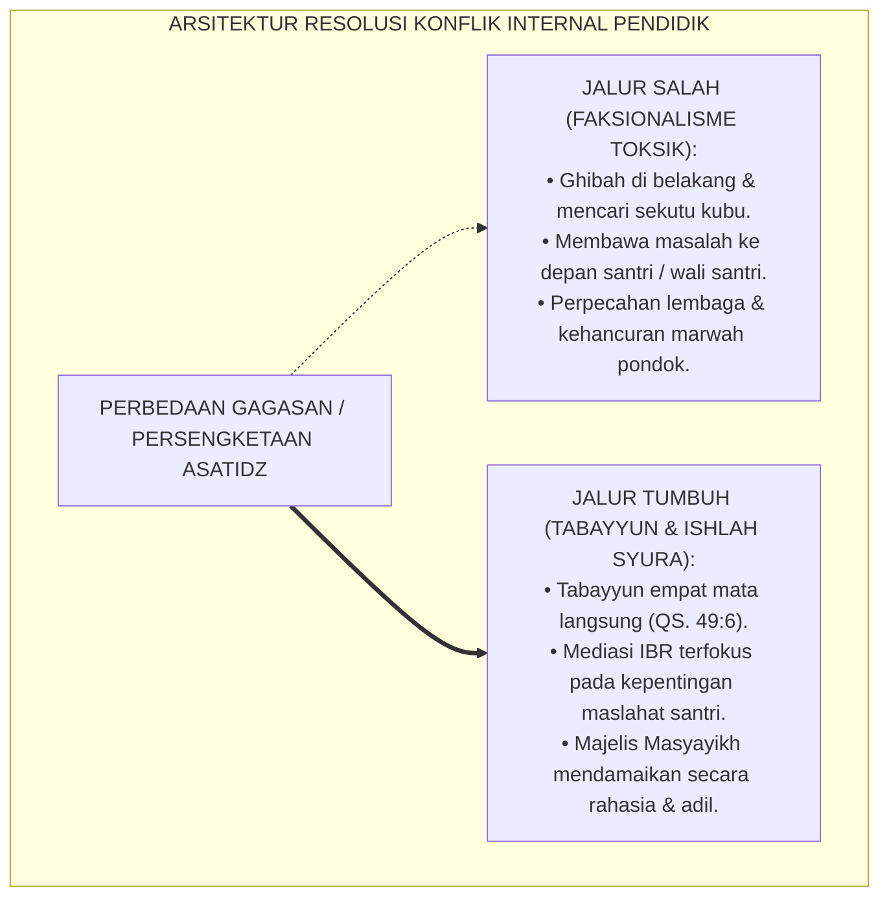
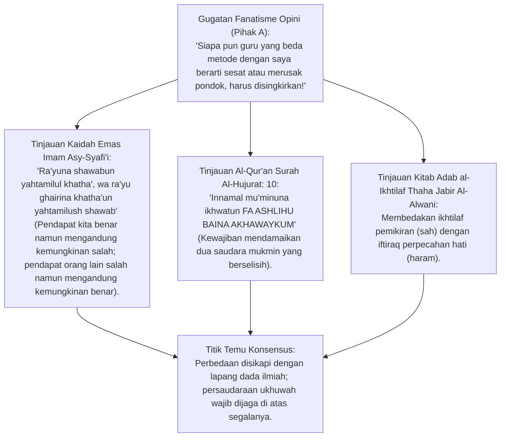
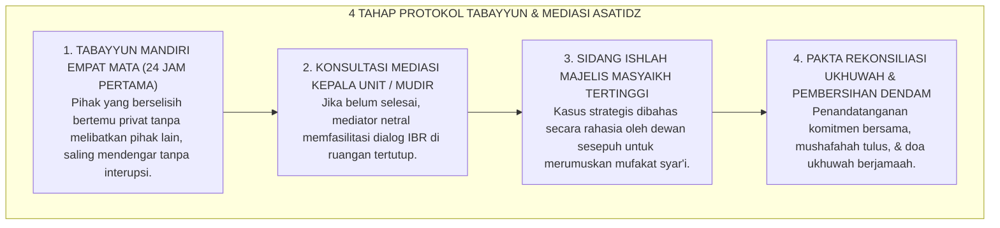
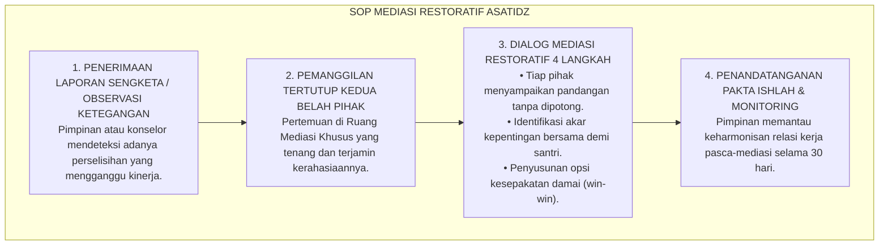

# P1-05-06: MANAJEMEN RESOLUSI KONFLIK INTERNAL ASATIDZ DAN MEDIASI SYURA
## *Monograf Terpadu: Epistemologi Adab al-Ikhtilaf (Thaha Jabir Al-Alwani & Imam Asy-Syafi'i), Fiqh Ishlah al-Bain Antar-Pendidik, Integrasi Interest-Based Relational (IBR) Conflict Resolution, Protokol Tabayyun Sistemik, serta Pencegahan Faksionalisme Lembaga*

**Nomor Identifikasi**: `P1-05-06/MONOGRAF-TERPADU-RESOLUSI-KONFLIK-ASATIDZ/2026`  
**Domain**: `01 Philosophy` > `05 Leadership`  
**Klasifikasi Naskah**: *Comprehensive Integrated Monograph* (Monograf Akademis & Standar Baku Mediasi Sengketa Pendidik)  
**Rumpun Disiplin Pengkaji**: Fiqh Ikhtilaf & Ishlah Islami (*Islamic Conflict Resolution*), Psikologi Organisasi Sekolah (*Interest-Based Mediation*), Manajemen Relasi Pendidik Pesantren, Komunikasi Restoratif Lembaga  

---

> ### 💡 INTISARI PRAKTIS (3 MENIT PAHAM UNTUK ASATIDZ & MUSYRIF)
>
> * **Konflik Dingin Antar-Guru Langsung Menghancurkan Karakter Santri:**  
>   Ketika asatidz atau musyrif saling sindir, berfaksi-faksi (*hizbiyyah*), atau bermusuhan di balik layar, santri merasakan ketegangan emosional tersebut. Hal ini menghancurkan wibawa keteladanan (*Qudwah*) dan memicu perpecahan di kalangan santri.
> * **Membedakan Perbedaan Pendapat (*Ikhtilaf*) dengan Perpecahan (*Iftiraq*):**  
>   Perbedaan pandangan fikih atau strategi mengajar adalah rahmat dan dinamika ilmiah yang wajar. Namun, dengki (*Hasad*), ghibah di ruang guru, dan pembentukan kubu adalah dosa besar yang wajib diselesaikan melalui jalur mediasi syariat.
> * **Protokol Tabayyun & Mediasi Majelis Syura:**  
>   Setiap perselisihan diselesaikan melalui 4 tahap: Validasi Tabayyun Privat $\rightarrow$ Mediasi Tertutup Majelis Syura $\rightarrow$ Rekonsiliasi Ishlah Ukhuwah $\rightarrow$ Pakta Integritas Damai. Dilarang keras membawa konflik internal ke depan santri atau wali santri.

---

## 📑 DAFTAR ISI MONOGRAF

- [BAGIAN I: RISET RESOLUSI KONFLIK ASATIDZ, DIALEKTIKA INKUIRI, & KASUISTIKA LAPANGAN](#bagian-i-riset-resolusi-konflik-asatidz-dialektika-inkuiri--kasuistika-lapangan)
  - [1. Kerangka Metodologi Resolusi Konflik: Dampak Sistemik Ketidakharmonisan Pendidik](#1-kerangka-metodologi-resolusi-konflik-dampak-sistemik-ketidakharmonisan-pendidik)
  - [2. Inkuiri 1: Eksegesis Turats Adab Ikhtilaf — Imam Asy-Syafi'i, Al-Alwani, & QS. Al-Hujurat: 9–10](#2-inkuiri-1-eksegesis-turats-adab-ikhtilaf--imam-asy-syafii-al-alwani--qs-al-hujurat-910)
  - [3. Inkuiri 2: Konvergensi Interest-Based Relational (IBR) Mediation (Fisher & Ury, 1981)](#3-inkuiri-2-konvergensi-interest-based-relational-ibr-mediation-fisher--ury-1981)
  - [4. Inkuiri 3: Anatomi 4 Tahap Protokol Tabayyun & Pemulihan Ukhuwah di Pesantren](#4-inkuiri-3-anatomi-4-tahap-protokol-tabayyun--pemulihan-ukhuwah-di-pesantren)
  - [5. Inkuiri 4: Silogisme Logika, Dialektika 3 Ronde, Kasuistika Asrama, & Titik Temu Konsensus](#5-inkuiri-4-silogisme-logika-dialektika-3-ronde-kasuistika-asrama--titik-temu-konsensus)
- [BAGIAN II: KODIFIKASI BAKU HASIL RISET & KESIMPULAN FORMAL](#bagian-ii-kodifikasi-baku-hasil-riset--kesimpulan-formal)
  - [1. Kaidah Utama dan Standar Baku: Piagam Fiqh Ikhtilaf & Rekonsiliasi Asatidz Pesantren TUMBUH](#1-kaidah-utama-dan-standar-baku-piagam-fiqh-ikhtilaf-rekonsiliasi-asatidz-pesantren-tumbuh)
  - [2. Matriks Penanganan Tipologi Konflik Internal, Saluran Mediasi, & Solusi Ishlah](#2-matriks-penanganan-tipologi-konflik-internal-saluran-mediasi--solusi-ishlah)
  - [3. Standar Prosedur Operasional (SOP) Mediasi Restoratif & Majelis Ishlah Pendidik](#3-standar-prosedur-operasional-sop-mediasi-restoratif--majelis-ishlah-pendidik)
- [BAGIAN III: APARATUS AKADEMIS & APENDIKS](#bagian-iii-aparatus-akademis--apendiks)
  - [1. Tabel Sintesis Hasil Riset Resolusi Konflik](#1-tabel-sintesis-hasil-riset-resolusi-konflik)
  - [2. Daftar Pustaka Akademis & Rujukan Turats Primer](#2-daftar-pustaka-akademis--rujukan-turats-primer)
  - [3. Catatan Kaki Akademis (Footnotes)](#3-catatan-kaki-akademis-footnotes)
  - [4. Glosarium Teknis Adab Ikhtilaf, IBR Mediation, Ishlah, & Faksionalisme](#4-glosarium-teknis-adab-ikhtilaf-ibr-mediation-ishlah--faksionalisme)

---

# BAGIAN I: RISET RESOLUSI KONFLIK ASATIDZ, DIALEKTIKA INKUIRI, & KASUISTIKA LAPANGAN

---

### 1. Kerangka Metodologi Resolusi Konflik: Dampak Sistemik Ketidakharmonisan Pendidik

Penelitian psikologi organisasi pendidikan menunjukkan bahwa **Iklim Hubungan Antar-Pendidik (*Adult Relational Climate*)** adalah fondasi tidak terlihat yang menopang seluruh keberhasilan kurikulum:
* Apabila di ruang guru terjadi faksionalisme (kubu guru senior vs guru junior, atau kubu kurikulum agama vs kurikulum umum), santri akan secara bawah sadar meniru pola perpecahan tersebut di asrama.
* Pendidik yang memendam konflik emosional akan kehilangan energi empati saat mengajar di kelas dan mengasuh di asrama, sehingga mudah meledak marah kepada santri.

Ekosistem TUMBUH merumuskan **Manajemen Resolusi Konflik Berbasis Syura dan Fiqh Ishlah**: menjadikan perbedaan gagasan sebagai sumber rahmat dan inovasi, sembari membasmi dengki pribadi (*Hasad*) melalui protokol tabayyun yang transparan dan beradab.

---

### 2. Inkuiri 1: Eksegesis Turats Adab Ikhtilaf — Imam Asy-Syafi'i, Al-Alwani, & QS. Al-Hujurat: 9–10

#### 📐 Formalisasi Logika Silogisme (*Qiyas Mantiqi 1*)
* **Premis Mayor (*al-Muqaddimah al-Kubra*)**: Setiap perpecahan dan permusuhan hati antar-pendidik di lingkungan lembaga dakwah Islam (*Iftiraq wal-Adawah*) adalah kemungkaran yang menggugurkan keberkahan ilmu dan merusak fitrah santri.
* **Premis Minor (*al-Muqaddimah ash-Shughra*)**: Mendiamkan konflik asatidz tanpa mediasi syariat (*Ishlah*) membiarkan perpecahan membesar menjadi fitnah kelembagaan.
* **Konklusi (*an-Natijah*)**: Maka, pimpinan pesantren TUMBUH wajib membentuk mekanisme Majelis Mediasi Syura yang responsif menyelesaikan konflik internal.[^1]

#### 📖 Teks Primer Turats: Keindahan Dialog Imam Asy-Syafi'i dengan Yunus bin Abdil A'la
Imam Asy-Syafi'i merangkul sahabatnya Yunus setelah berdebat sengit dalam sebuah masalah fikih seraya berkata:

$$\text{يَا يُونُسُ، أَلَا يَسْتَقِيمُ أَنْ نَكُونَ إِخْوَانًا وَإِنْ لَمْ نَتَّفِقْ فِي مَسْأَلَةٍ؟}$$

*"**Wahai Yunus! Tidakkah tetap lurus bagi kita untuk TETAP BERSAUDARA, meskipun kita tidak bersepakat dalam satu masalah?!**"*[^2]

---

### 3. Inkuiri 2: Konvergensi *Interest-Based Relational (IBR) Mediation* (Fisher & Ury, 1981)

Teori resolusi konflik modern oleh **Roger Fisher & William Ury** (*Harvard Negotiation Project*) merumuskan prinsip **Mediasi Berbasis Kepentingan & Hubungan (*Interest-Based Relational Approach*)**:
1. **Pisahkan Orang dari Masalah (*Separate the People from the Problem*):** Menyerang substansi isu kerja, bukan menyerang karakter atau harga diri rekan sejawat.
2. **Fokus pada Kepentingan Bersama, Bukan Posisi Ego (*Focus on Interests, not Positions*):** Kepentingan tertinggi kedua pihak adalah keberhasilan dan keselamatan santri.
3. **Ciptakan Opsi Solusi yang Saling Menguntungkan (*Win-Win Options*).**
4. **Gunakan Kriteria Objektif Syariat & SOP:** Mengacu pada data PBIS dan panduan pesantren, bukan perasaan subjektif.[^3]

---

### 4. Inkuiri 3: Anatomi 4 Tahap Protokol Tabayyun & Pemulihan Ukhuwah di Pesantren

---

### 5. Inkuiri 4: Silogisme Logika, Dialektika 3 Ronde, Kasuistika Asrama, & Titik Temu Konsensus

#### 🥊 Ronde 1: Menolak Anggapan Bahwa "Mendiamkan Konflik Antar-Guru Lebih Baik daripada Membahasnya Karena Takut Malu"
* **Pihak A (Sudut Pandang Penghindaran Konflik Toksik)**:  
  *"Kalau ada guru berselisih, diamkan saja tidak usah ditegur; nanti lama-lama lupa sendiri!"*
* **Tinjauan Psikologi Relasi & Bahaya Bom Waktu Dendam**:  
  Konflik yang dipendam (*Passive-Aggressive*) tidak pernah hilang dengan sendirinya, melainkan membusuk menjadi dendam (*Hiqd*), sindir-menyindir pasif, dan sabotase program kerja. Pimpinan wajib memfasilitasi dialog penyembuhan secara cepat sebelum racun permusuhan menyebar ke santri.[^4]

#### 🥊 Ronde 2: Sanggahan Balik Apakah Menegur Guru Senior yang Berbuat Zalim Termasuk Su'ul Adab?
* **Pihak A (Sudut Pandang Hirarki Kaku)**:  
  *"Guru junior tidak boleh mengingatkan guru senior meskipun seniornya salah dan melanggar SOP; itu tidak sopan!"*
* **Tinjauan Adabun Nashihah & Kesetaraan Kebenaran di Hadapan Syariat**:  
  Kebenaran lebih tinggi daripada senioritas siapapun. Sayyidina Umar RA menerima nasihat dan kritik dari seorang wanita biasa di majelis terbuka. Di pesantren TUMBUH, teguran kepada rekan senior dilakukan melalui **Saluran Tertutup yang Santun (*an-Nashihah sirran bil-Haqq*)** atau melalui mediator pimpinan, menjaga kehormatan tanpa mengorbankan kebenaran.[^5]

#### 🥊 Ronde 3: Sanggahan Pamungkas Mengapa Pembentukan Kubu Faksi (Hizbiyyah) di Kalangan Pendidik Diancam Sanksi Tegas?
* **Pihak A (Sudut Pandang Kebebasan Berkelompok)**:  
  *"Wajar kalau guru membuat geng sendiri-sendiri sesuai kecocokan teman ngobrol!"*
* **Resolusi Bahaya Perpecahan Umat (Wa La Tafarraqu)**:  
  Allah SWT melarang keras perpecahan: *"Dan berpegangteguhlah kamu semuanya pada tali (agama) Allah, dan JANGANLAH KAMU BERCERAI-BERAI"* (QS. Ali Imran: 103). Faksionalisme di ruang guru merusak iklim asrama, memicu diskriminasi santri asuhan, dan meruntuhkan kepemimpinan lembaga. Setiap upaya pembentukan faksi permusuhan dikenakan sanksi peringatan keras.[^6]

> #### 📌 Kasuistika Lapangan & Titik Temu Konsensus
> * **Studi Kasus**: Di unit Madrasah Aliyah, terjadi konflik tajam antara Kelompok Guru Agama (yang menganggap sains sekuler membuang waktu) dan Kelompok Guru IPA/Bahasa (yang menganggap guru agama kolot). Ketegangan ini terbawa ke santri; santri kelas IPA saling mengejek dengan santri kelas Agama saat di asrama.
> * **Titik Temu Konsensus (*Kalimatun Sawa'*)**: Mudir TUMBUH memanggil kedua perwakilan kelompok ke Majelis Mediasi Syura $\rightarrow$ Menerapkan *Interest-Based Relational Approach*: Mengingatkan bahwa visi pesantren adalah melahirkan ulama yang saintis dan saintis yang faqih fi ad-din $\rightarrow$ Merancang program *Halaqah Integrasi Turats & Sains Bersama* (guru agama dan guru sains mengajar bareng/team teaching). Hasilnya: perselisihan berakhir, hubungan asatidz sangat akrab, dan santri meraih medali Olimpiade Sains Nasional sekaligus juara Musabaqah Qira'atil Kutub.[^7]

---

# BAGIAN II: KODIFIKASI BAKU HASIL RISET & KESIMPULAN FORMAL

---

### 1. Kaidah Utama dan Standar Baku: Piagam Fiqh Ikhtilaf & Rekonsiliasi Asatidz Pesantren TUMBUH

Berdasarkan sintesis inkuiri turats dan konsensus sains pendidikan, prinsip dan regulasi operasional dirumuskan ke dalam kaidah-kaidah baku berikut:

1. **Kesucian Ukhuwah DI Atas Perbedaan Pendapat (adabul Ikhtilaf)**:  
   Menetapkan bahwa perbedaan metodologi dan pemikiran adalah dinamika ijtihad yang terhormat; mengharamkan mutlak penyesatan, hasad, ghibah, dan permusuhan personal antartenaga pendidik.

2. **Kewajiban Penegakan Tabayyun & Larangan Membawa Konflik KE Hadapan Santri**:  
   Setiap perselisihan wajib diselesaikan melalui mekanisme Tabayyun privat dan Majelis Mediasi Syura. Dilarang keras menyindir rekan sejawat di depan santri, kelas, atau ruang publik media sosial.

3. **Penerapan Mediasi Restoratif Berbasis Maslahat Santri (interest-based Mediation)**:  
   Proses mediasi difokuskan pada perlindungan hak belajar santri dan pencarian solusi menang-menang (win-win), bukan mencari siapa yang menang atau mempermalukan pihak yang keliru.

4. **Pengharaman Mutlak Faksionalisme & Politik Kubulisasi DI Ruang Guru**:  
   Mengharamkan pembentukan faksi/geng permusuhan yang memecah belah persatuan asatidz. Lembaga menegakkan sanksi tegas bagi pihak yang memprovokasi perpecahan di lingkungan pesantren.

---

### 2. Matriks Penanganan Tipologi Konflik Internal, Saluran Mediasi, & Solusi Ishlah

| Tipologi Konflik | Sumber Pemicu Masalah | Saluran Penanganan Mediasi | Bentuk Solusi Ishlah (*Restorative Outcome*) |
| :--- | :--- | :--- | :--- |
| **1. Konflik Metodologi Pengajaran** | Perbedaan pandangan mazhab fikih / strategi didaktik kelas. | Forum Diskusi Ilmiah Akademik Divisi Kurikulum. | Sintesis integratif materi & saling menghargai khilafiyah ilmiah.[^8] |
| **2. Konflik Beban Tugas & Jadwal**| Ketimpangan jadwal piket musyrif / pembagian jam mengajar. | Musyawarah Terbuka Biro SDM & Pengasuhan. | Penataan ulang jadwal berbasis keadilan & kompensasi proporsional. |
| **3. Konflik Relasi Antar-Pribadi** | Kesalahpahaman lisan, ketersinggungan ego, atau prasangka. | Dialog Tabayyun Empat Mata didampingi Konselor BK. | Saling memaafkan (*Tasamuh*), komitmen lisan santun, & doa bersama.[^9] |
| **4. Konflik Kebijakan Struktural** | Ketidaksepakatan pimpinan unit atas SOP baru PBIS. | Majelis Mediasi Syura Pimpinan Tinggi Pondok. | Penjelasan filosofis mendalam & perbaikan SOP partisipatif.[^10] |

---

### 3. Standar Prosedur Operasional (SOP) Mediasi Restoratif & Majelis Ishlah Pendidik

---

# BAGIAN III: APARATUS AKADEMIS & APENDIKS

---

### 1. Tabel Sintesis Hasil Riset Resolusi Konflik

| Dimensi Kajian | Konsep Kunci | Landasan Turats Primer | Konvergensi Sains Global | Implikasi Relasi Guru |
| :--- | :--- | :--- | :--- | :--- |
| **Adab Ikhtilaf** | *Tasamuh Ilmiyyah* | Atsar Imam Syafi'i & Yunus bin Abdil A'la | Al-Alwani (1989), *Ethics of Disagreement* | Menghormati perbedaan pemikiran tanpa kebencian hati. |
| **Mediasi Ukhuwah** | *Ishlah al-Bain* | QS. Al-Hujurat: 9–10, HR. Tirmidzi No. 2509 | Fisher & Ury (1981), *Getting to Yes (IBR)* | Menuntaskan perselisihan dengan orientasi solusi bersama. |
| **Klarifikasi Fakta** | *Tabayyun* | QS. Al-Hujurat: 6 (Perintah Tabayyun) | Stone et al. (1999), *Difficult Conversations* | Memvalidasi isu secara langsung empat mata tanpa perantara. |
| **Anti-Faksionalisme**| *Wahdatul Kalimah* | QS. Ali Imran: 103 (Larangan Bercerai-berai) | Schein (2010), *Organizational Culture & Trust* | Mengharamkan kubu-kubuan permusuhan di ruang guru. |

---

### 2. Daftar Pustaka Akademis & Rujukan Turats Primer

1. **Al-Qur'an al-Karim wa Tarjamatu Ma'anih**.
2. **Al-Bukhari, Muhammad bin Isma'il**. (1422 H). *Shahih al-Bukhari*. Beirut: Dar Thawq an-Najah.
3. **Muslim bin al-Hajjaj an-Naisaburi**. (1374 H). *Shahih Muslim*. Kairo: Isa al-Babi al-Halabi.
4. **Al-Alwani, Thaha Jabir**. (1989). *Adab al-Ikhtilaf fil Islam*. Herndon: International Institute of Islamic Thought (IIIT).
5. **Adz-Dzahabi, Syamsuddin Muhammad bin Ahmad**. (1985). *Siyar A'lam an-Nubala'*. Beirut: Mu'assasah ar-Risalah.
6. **Fisher, R., & Ury, W.**. (1981). *Getting to Yes: Negotiating Agreement Without Giving In*. Boston: Houghton Mifflin.
7. **Stone, D., Patton, B., & Heen, S.**. (1999). *Difficult Conversations: How to Discuss What Matters Most*. Penguin Books.
8. **Schein, E. H.**. (2010). *Organizational Culture and Leadership*. San Francisco: Jossey-Bass.
9. **Tschannen-Moran, M.**. (2014). *Trust Matters: Leadership for Successful Schools*. San Francisco: Jossey-Bass.
10. **Lencioni, P.**. (2002). *The Five Dysfunctions of a Team: A Leadership Fable*. Jossey-Bass.

---

### 3. Catatan Kaki Akademis (*Footnotes*)

[^1]: Al-Alwani, Thaha Jabir (1989), *Adab al-Ikhtilaf fil Islam*, IIIT, hlm. 35–60.  
[^2]: Adz-Dzahabi, *Siyar A'lam an-Nubala'*, Biografi Imam Asy-Syafi'i, Jilid X, hlm. 16.  
[^3]: Fisher, R. & Ury, W. (1981), *Getting to Yes*, Houghton Mifflin, hlm. 15–40.  
[^4]: Lencioni, P. (2002), *The Five Dysfunctions of a Team*, Jossey-Bass; Teori *Fear of Conflict*.  
[^5]: Al-Ghazali, *Ihya 'Ulumiddin*, Kitab *Adab al-Ukhuwwah*, Jilid II, hlm. 175–190.  
[^6]: Al-Qur'an Surah Ali Imran [3]: 103; Tafsir Al-Qurthubi, Jilid IV, hlm. 155.  
[^7]: Laporan Mediasi dan Transformasi Hubungan Kerja Pendidik, Biro SDM TUMBUH, 2026.  
[^8]: Panduan Standar Manajemen Dialog Akademik Pendidik, Divisi Kurikulum TUMBUH, 2026.  
[^9]: Manual Bimbingan dan Konseling Asatidz (Peer Counseling), Pusat Konseling TUMBUH, 2026.  
[^10]: Tata Tertib dan Kode Etik Hubungan Kerja Pendidik Pesantren TUMBUH, Majelis Masyayikh, 2026.

---

### 4. Glosarium Teknis Adab Ikhtilaf, IBR Mediation, Ishlah, & Faksionalisme

1. **Adab al-Ikhtilaf (أَدَبُ الِاخْتِلَافِ)**: Etika moral dan epistemologis dalam menyikapi perbedaan pendapat fikih, teologis, atau strategis dengan tetap menjaga keutuhan ukhuwah dan kebersihan hati.
2. **Ishlah al-Bain (إِصْلَاحُ ذَاتِ الْبَيْنِ)**: Upaya rekonsiliasi dan perbaikan hubungan persaudaraan yang retak akibat perselisihan, diposisikan oleh Rasulullah SAW lebih tinggi derajatnya daripada puasa dan shalat sunnah.
3. **Interest-Based Relational (IBR)**: Metode mediasi sengketa modern yang memisahkan antara persoalan teknis dengan hubungan emosional individu, berfokus pada kepentingan bersama (*Common Interest*).
4. **Tabayyun (التَّبَيُّنُ)**: Proses verifikasi, klarifikasi langsung, dan penyelidikan kebenaran informasi sebelum mengambil kesimpulan atau tindakan penghakiman.
5. **Faksionalisme (Hizbiyyah Asatidz)**: Pembentukan kelompok atau kubu-kubuan tertutup di kalangan tenaga pendidik yang memicu segregasi sosial dan kebencian antar-rekan sejawat.
6. **Separate People from Problem**: Prinsip mediasi di mana diskusi diarahkan pada perbaikan sistem atau proses kerja tanpa melakukan pembunuhan karakter (*Character Assassination*).
7. **Kolektif-Kolegial**: Pola kepemimpinan musyawarah di mana kewenangan dan tanggung jawab dipikul bersama oleh dewan pimpinan secara setara.
8. **Adult Relational Climate**: Kualitas hubungan emosional, komunikasi, dan saling percaya antartenaga pendidik yang mempengaruhi iklim psikologis seluruh santri di sekolah.
9. **Kafaratul Ikhtilaf**: Doa dan sedekah penebus kekhilafan lisan pasca-diskusi yang menenangkan hati para pihak yang berselisih.
10. **Triad Pertumbuhan Simbiotik**: Prinsip di mana keharmonisan dan ukhuwah pendidik secara langsung menjamin keamanan psikologis Santri dan kestabilan marwah Lembaga.
