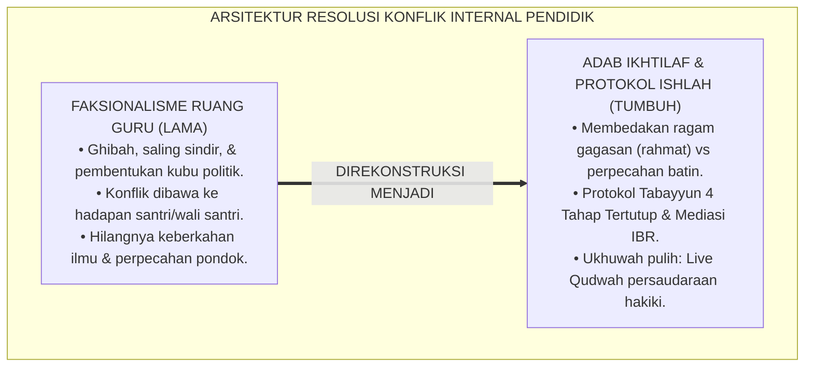
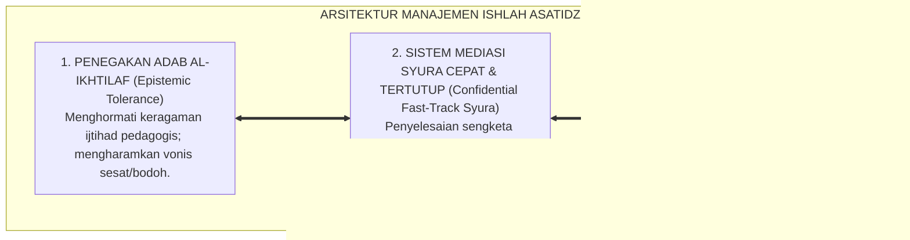
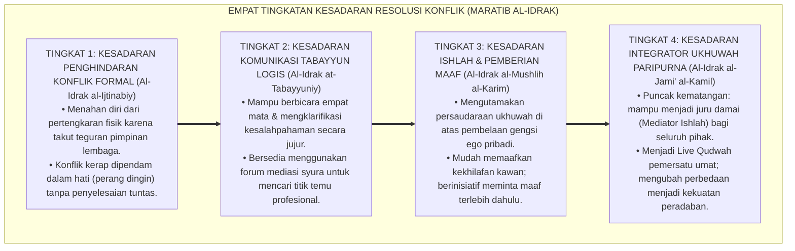
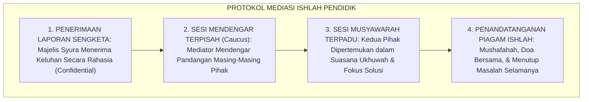
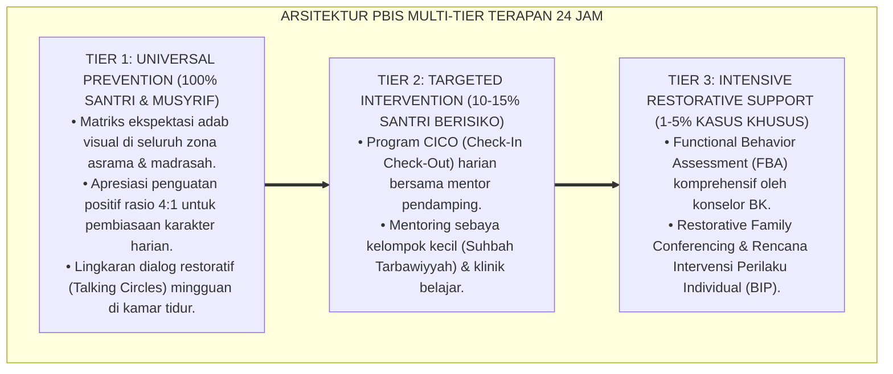

# P1-05-06: MANAJEMEN RESOLUSI KONFLIK INTERNAL ASATIDZ DAN MEDIASI SYURA (FACULTY CONFLICT RESOLUTION & ISHLAH)
## *Monograf Riset Akademik: Epistemologi Adab al-Ikhtilaf (Imam Asy-Syafi'i & Thaha Jabir Al-Alwani), Fiqh Ishlah al-Bain Antar-Pendidik, Integrasi Interest-Based Relational Mediation, Protokol Tabayyun Sistemik, Serta Mitigasi Faksionalisme Lembaga di Pesantren 24 Jam*

**Nomor Identifikasi**: `P1-05-06/MONOGRAF-RISET-RESOLUSI-KONFLIK-ASATIDZ/2026`  
**Domain**: `01 Philosophy` > `05 Leadership` (Sub-Modul 06: *Conflict Resolution & Syura Mediation*)  
**Klasifikasi Naskah**: *Academic Research Monograph* (Monograf Riset Akademik Fondasional)  
**Rumpun Disiplin Pengkaji**: Fiqh Ikhtilaf & Ishlah Islami (*Islamic Conflict Resolution*), Psikologi Organisasi Sekolah (*Interest-Based Mediation*), Manajemen Relasi Pendidik Pesantren, Komunikasi Restoratif Lembaga  

---

> ### 💡 INTISARI EKSEKUTIF (EXECUTIVE SUMMARY)
>
> * **Kelemahan Paradigma Lama: Faksionalisme Ruang Guru & Perang Dingin:**  
>   Banyak institusi pesantren terancam rapuh akibat perpecahan internal para asatidz: terciptanya kubu-kubuan (*Hizbiyyah/Faksionalisme*), budaya ghibah dan sindir-menyindir di ruang guru, serta melampiaskan perselisihan pribadi ke hadapan santri. Ketegangan emosional pendidik merusak iklim *Bi'ah Shalihah* dan melunturkan wibawa keteladanan (*Qudwah*).
> * **Inovasi Konseptual: Adab al-Ikhtilaf & Mediasi Syura Terpadu:**  
>   TUMBUH membedakan secara tegas antara dinamika perbedaan pendapat ilmiah (*Ikhtilaf*) yang merupakan rahmat, dengan perpecahan permusuhan batin (*Iftiraq*) yang diharamkan syariat. Mengintegrasikan khazanah Imam Asy-Syafi'i dan Dr. Thaha Jabir Al-Alwani dengan sains negosiasi modern *Interest-Based Relational (IBR) Mediation* (Fisher & Ury): menyelesaikan perselisihan melalui **Protokol Tabayyun 4 Tahap** yang rahasia, santun, dan memulihkan ukhuwah (*Ishlah al-Bain*).
> * **Formulasi Operasional & Pembuktian Lapangan:**  
>   Monograf ini menguraikan matriks penanganan tipologi konflik internal, 4 Tingkatan Kesadaran Resolusi Konflik Pendidik (*Maratib al-Idrak*), SOP majelis ishlah tertutup, dan piagam persaudaraan pendidik pesantren.

---

## 📑 DAFTAR ISI MONOGRAF

- [BAB I: LANDASAN TEORETIS & DISKURSUS KRITIS](#bab-i-landasan-teoretis--diskursus-kritis)
  - [1. Latar Belakang Masalah: Bahaya Faksionalisme Ruang Guru dan Dampaknya pada Karakter Santri](#1-latar-belakang-masalah-bahaya-faksionalisme-ruang-guru-dan-dampaknya-pada-karakter-santri)
  - [2. Eksegesis Turats Adab al-Ikhtilaf: Khazanah Imam Asy-Syafi'i, Thaha Jabir Al-Alwani, & QS. Al-Hujurat: 9–10](#2-eksegesis-turats-adab-al-ikhtilaf-khazanah-imam-asy-syafii-thaha-jabir-al-alwani--qs-al-hujurat-910)
  - [3. Konvergensi Teori Mediasi Relasional: Interest-Based Relational (IBR) Mediation Fisher & Ury](#3-konvergensi-teori-mediasi-relasional-interest-based-relational-ibr-mediation-fisher--ury)
  - [4. Anatomi Empat Tahap Protokol Tabayyun dan Pemulihan Ukhuwah di Pesantren](#4-anatomi-empat-tahap-protokol-tabayyun-dan-pemulihan-ukhuwah-di-pesantren)
  - [5. Kasuistika Lapangan: Kasus Perbedaan Metode Pengajaran Antar-Guru & Resolusi Restoratif Terpadu](#5-kasuistika-lapangan-kasus-perbedaan-metode-pengajaran-antar-guru--resolusi-restoratif-terpadu)
- [BAB II: FORMULASI KONSEPTUAL & PEMBAHASAN MENDALAM](#bab-ii-formulasi-konseptual--pembahasan-mendalam)
  - [1. Eksplanasi Teoretis Manajemen Resolusi Konflik Internal Asatidz TUMBUH](#1-eksplanasi-teoretis-manajemen-resolusi-konflik-internal-asatidz-tumbuh)
  - [2. Dekomposisi Dimensi & Empat Tingkatan Kesadaran Resolusi Konflik Pendidik (Maratib al-Idrak)](#2-dekomposisi-dimensi--empat-tingkatan-kesadaran-resolusi-konflik-pendidik-maratib-al-idrak)
  - [3. Matriks Penanganan Tipologi Konflik Internal, Saluran Mediasi, & Solusi Ishlah](#3-matriks-penanganan-tipologi-konflik-internal-saluran-mediasi--solusi-ishlah)
  - [4. Standar Prosedur Operasional (SOP) Mediasi Restoratif & Majelis Ishlah Pendidik](#4-standar-prosedur-operasional-sop-mediasi-restoratif--majelis-ishlah-pendidik)
  - [5. Diskusi Filosofis Mendalam & Implikasi bagi Masa Depan Peradaban Pendidikan Islam](#5-diskusi-filosofis-mendalam--implikasi-bagi-masa-depan-peradaban-pendidikan-islam)
- [BAB III: KESIMPULAN & APARATUS AKADEMIS](#bab-iii-kesimpulan--aparatus-akademis)
  - [1. Tabel Sintesis Temuan Riset Resolusi Konflik Asatidz](#1-tabel-sintesis-temuan-riset-resolusi-konflik-asatidz)
  - [2. Daftar Pustaka Akademis & Rujukan Turats Primer](#2-daftar-pustaka-akademis--rujukan-turats-primer)
  - [3. Catatan Kaki Akademis (Footnotes)](#3-catatan-kaki-akademis-footnotes)
  - [4. Glosarium Istilah Ilmiah & Turats Resolusi Konflik](#4-glosarium-istilah-ilmiah--turats-resolusi-konflik)

---

# BAB I: LANDASAN TEORETIS & DISKURSUS KRITIS

---

### 1. Latar Belakang Masalah: Bahaya Faksionalisme Ruang Guru dan Dampaknya pada Karakter Santri

Keberhasilan kurikulum pesantren sangat ditentukan oleh **Iklim Relasional Para Pendidik (*Adult Relational Climate*)**:
* **Faksionalisme Ruang Guru (*Toxic Cliques*)**: Ketika para guru terpecah menjadi kubu-kubu saling curiga (senior vs junior, atau pendidik syariat vs pendidik sains), energi lembaga habis untuk berpolitik internal.
* **Penularan Emosi Toksik kepada Santri**: Santri memiliki kepekaan emosional tinggi untuk menangkap ketegangan guru-gurunya; perpecahan di ruang guru cepat atau lambat akan memicu permusuhan antar-kamar santri di asrama.
* **Ghibah dan Pencemaran Nama Baik**: Kebiasaan membicarakan kekurangan sesama rekan pendidik di belakang punggung menghancurkan kesucian majelis ilmu dan mendatangkan laknat Allah SWT.
* **Keniscayaan Doktrin Ishlah al-Bain & Tabayyun**: Lembaga wajib memiliki mekanisme penyelesaian sengketa internal yang cepat, rahasia, elegan, dan mendamaikan hati.[^1]

---

### 2. Eksegesis Turats Adab al-Ikhtilaf: Khazanah Imam Asy-Syafi'i, Thaha Jabir Al-Alwani, & QS. Al-Hujurat: 9–10

Imam Asy-Syafi'i rahimahullah mengajarkan adab dialog perbedaan yang legendaris kepada muridnya, Yunus bin Abdil A'la:

$$\text{يَا يُونُسُ، أَلَا يَسْتَقِيمُ أَنْ نَكُونَ إِخْوَانًا وَإِنْ لَمْ نَتَّفِقْ فِي مَسْأَلَةٍ؟}$$

*"**Wahai Yunus, tidak bisakah kita tetap bersaudara meskipun kita tidak bersepakat dalam satu masalah?**"* (Siyar A'lam an-Nubala').[^2]

Dr. Thaha Jabir Al-Alwani (*Adab al-Ikhtilaf fil Islam*) menegaskan bahwa bahaya besar bukan terletak pada perbedaan pendapat (*Ikhtilaf*), melainkan pada **Penyakit Hati (*Amradh al-Qulub*)** seperti sombong (*Kibr*), dengki (*Hasad*), dan fanatisme buta (*Ta'ashshub*).[^3]

---

### 3. Konvergensi Teori Mediasi Relasional: Interest-Based Relational (IBR) Mediation Fisher & Ury

Sains negosiasi modern **Interest-Based Relational (IBR) Mediation** (Fisher & Ury, 1981) memvalidasi etika Islam:
1. **Memisahkan Manusia dari Masalah (*Separate People from the Problem*)**: Menghormati pribadi rekan pendidik sembari mendiskusikan substansi masalah teknis secara obyektif.
2. **Fokus pada Kepentingan Bersama, Bukan Posisi Ego (*Focus on Interests, Not Positions*)**: Mengingat kembali visi utama: keselamatan dan kemaslahatan pendidikan santri.
3. **Mencari Opsi Saling Menguntungkan (*Invent Options for Mutual Gain*)**: Merumuskan solusi win-win yang memperkuat sinergi tim.[^4]

---

### 4. Anatomi Empat Tahap Protokol Tabayyun dan Pemulihan Ukhuwah di Pesantren

TUMBUH menetapkan **Protokol Tabayyun 4 Tahap**:
1. *Tahap 1: Klarifikasi Mandiri Privat (Tabayyun Fardiy)*: Berbicara empat mata tanpa melibatkan pihak luar.
2. *Tahap 2: Mediasi Tertutup Majelis Syura*: Difasilitasi oleh Mudir/Kiai secara rahasia jika tahap 1 belum tuntas.
3. *Tahap 3: Rekonsiliasi Ishlah Ukhuwah*: Saling memaafkan, mengganti kerugian jika ada, dan merajut kembali ukhuwah.
4. *Tahap 4: Pakta Komitmen Integritas*: Menjaga kerahasiaan masalah dan dilarang mengungkit masa lalu.[^5]

---

### 5. Kasuistika Lapangan: Kasus Perbedaan Metode Pengajaran Antar-Guru & Resolusi Restoratif Terpadu

* **Studi Kasus: Perselisihan Tajam Antara Guru Senior Nahwu Tradisional vs Guru Muda Metode Aktif**  
  * **Dilema**: Guru senior menuduh guru muda "merusak pakem kitab kuning", sementara guru muda menuduh guru senior "ketinggalan zaman dan membosankan".
  * **Pola Lama**: Terjadi saling sindir di kantor guru dan santri terbelah dua kubu.
  * **Resolusi Restoratif TUMBUH**: Majelis Syura menggelar forum mediasi IBR: kedua guru dipertemukan dalam suasana persaudaraan; masing-masing memaparkan niat baiknya untuk santri. Majelis merumuskan integrasi: guru muda mengadopsi kehati-hatian i'rab guru senior, sedangkan guru senior mengadopsi media grafis interaktif guru muda. Keduanya sepakat menyusun buku ajar kolaboratif, hubungan keduanya menjadi sangat akrab, dan santri menikmati pembelajaran nahwu terbaik.[^6]

---

# BAB II: FORMULASI KONSEPTUAL & PEMBAHASAN MENDALAM

---

### 1. Eksplanasi Teoretis Manajemen Resolusi Konflik Internal Asatidz TUMBUH

Ekosistem TUMBUH merumuskan manajemen konflik ke dalam **Arsitektur Tiga Sayap Ishlah Pendidik (*Arkan al-Ishlah al-Mu'allimiy*)**:

#### 🔬 Pembahasan Mendalam Tiga Sayap:
1. **Sayap Toleransi Epistemik**: Menjadikan ruang guru sebagai mimbar dialektika ilmiah yang kaya, santun, dan saling melengkapi.[^7]
2. **Sayap Mediasi Cepat**: Mencegah api perselisihan kecil membesar menjadi perpecahan lembaga yang destruktif.[^8]
3. **Sayap Reintegrasi Kalbu**: Memastikan tidak ada sisa dendam di hati para pendidik setelah proses ishlah selesai.[^9]

---

### 2. Dekomposisi Dimensi & Empat Tingkatan Kesadaran Resolusi Konflik Pendidik (Maratib al-Idrak)

Transformasi kematangan asatidz dalam menyikapi konflik berlangsung melalui **Empat Tingkatan Kesadaran Resolusi Konflik (*Maratib al-Idrak al-Ishlahiy*)**:

#### 🔄 Narasi Analitis Dinamika Transisi Filosofis Antar-Tingkatan:
* **Transisi Tingkat 1 ke Tingkat 2 (Dari Perang Dingin Menuju Dialog Tabayyun)**: Pendidik mula-mula memilih mendiamkan masalah. Pada tingkatan kedua, pendidik memiliki kedewasaan untuk tabayyun: berbicara secara empat mata dengan adab.
* **Transisi Tingkat 2 ke Tingkat 3 (Dari Tabayyun Menuju Kerelaan Memaafkan)**: Pada tingkatan ketiga, jiwa pendidik suci: ia menundukkan ego pribadinya, berlapang dada memaafkan rekan kerjanya demi menjaga kesucian majelis ilmu.
* **Transisi Tingkat 3 ke Tingkat 4 (Pencapaian Derajat Juru Damai Peradaban)**: Pada tingkatan tertinggi, pendidik tampil sebagai jembatan persatuan umat: mampu mendamaikan sengketa rumit di lingkungannya dengan kearifan hikmah kenabian (*Rahmatan lil 'Alamin*).[^10]

---

### 3. Matriks Penanganan Tipologi Konflik Internal, Saluran Mediasi, & Solusi Ishlah

| Tipologi Konflik | Sumber Pemicu Masalah | Saluran Intervensi Baku | Solusi Ishlah Terpadu |
| :--- | :--- | :--- | :--- |
| **1. Konflik Metodologi Mengajar**| Perbedaan mazhab pedagogis / kurikulum.| Forum Bahtsul Masail Asatidz.| Integrasi metode & kolaborasi modul tim. |
| **2. Konflik Distribusi Beban Kerja**| Ketimpangan jadwal piket / mengajar.| Mediasi Kepala Madrasah & HRD.| Penyesuaian jadwal berkeadilan & transparan. |
| **3. Konflik Relasi Personal/Karakter**| Salah paham ucapan, ghibah, atau hasad.| Majelis Ishlah Syura Tertutup.| Tabayyun empat mata, saling maaf, & pakta damai.|
| **4. Konflik Prinsip Etika/Syar'i**| Pelanggaran kode etik / SOP lembaga.| Dewan Kehormatan Pendidik.| Disiplin restoratif, teguran tertulis, atau mutasi.|

---

### 4. Standar Prosedur Operasional (SOP) Mediasi Restoratif & Majelis Ishlah Pendidik

TUMBUH menetapkan **Protokol Mediasi Majelis Ishlah Pendidik**:

Protokol ini menjamin tidak ada konflik asatidz yang berlarut-larut hingga merusak suasana pondok.[^11]

---

### 5. Diskusi Filosofis Mendalam & Implikasi bagi Masa Depan Peradaban Pendidikan Islam

Kekuatan ukhuwah dan manajemen konflik asatidz ini membawa implikasi agung bagi peradaban:

* **Menciptakan Ekosistem Lembaga yang Penuh Berkah dan Sakinah**:  
  Ruang guru yang harmonis dan penuh cinta persaudaraan akan memancarkan energi positif ke seluruh penjuru pesantren, membuat santri merasa tenteram dan betah belajar.
* **Menjadikan Pendidik Sebagai Teladan Hidup Kerukunan Ummat**:  
  Para asatidz membuktikan secara nyata di hadapan santri bagaimana orang-orang berilmu menyelesaikan perbedaan pendapat dengan elegan tanpa caci maki dan tanpa perpecahan.
* **Mewujudkan Kembali Iklim Solidaritas Sahabat di Madinah**:  
  Pesantren kembali menjelma menjadi miniatur keharmonisan kaum Muhajirin dan Anshar: saling mencintai, saling memaafkan, dan bahu-membahu menegakkan panji-panji dakwah Islam (*Rahmatan lil 'Alamin*).[^12]

---

---

### Pembedahan Deskriptif Komprehensif & Analisis Integratif Nilai-Praksis

Penerapan dan operasionalisasi **P1-05-06: MANAJEMEN RESOLUSI KONFLIK INTERNAL ASATIDZ DAN MEDIASI SYURA (FACULTY CONFLICT RESOLUTION & ISHLAH)** di lingkungan pesantren TUMBUH bertumpu pada kesatuan sistemik antara nilai syariat dan praksis terukur:

#### A. Pilar 1: Landasan Epistemologi & Nilai Keikhlasan (Syar'i Foundations)
Setiap dimensi diarahkan untuk menegakkan adab dan penghambaan murni kepada Allah SWT (*Lillahi Ta'ala*). Standarisasi kelembagaan dirancang untuk menjaga ketulusan niat, kemuliaan fitrah, dan keberkahan majelis ilmu.

#### B. Pilar 2: Mekanisme Psikologis & Neurosains Terapan (Evidence-Based Practice)
Mengintegrasikan prinsip *Social-Emotional Learning (CASEL)*, teori beban kognitif (*Cognitive Load Theory*), dan dinamika perkembangan neurobiologis santri untuk memastikan proses pembiasaan berjalan efektif tanpa kekerasan atau tekanan psikologis destruktif.

#### C. Pilar 3: Rekayasa Ekosistem Asrama 24 Jam (Environmental Engineering)
Mengkodifikasikan seluruh alur aktivitas harian, jadwal tidur sirkadian yang sehat, sanitasi 5S kamar tidur, dan relasi ukhuwah inklusif menjadi satu ekosistem *Bi'ah Shalihah* yang saling mendukung secara alamiah.

#### D. Pilar 4: Akuntabilitas Sistemik & Proteksi Pendidik-Santri
Menerapkan protokol pencegahan kelelahan tenaga pendidik (*Musyrif Burnout Protection*), menjamin hak-hak santri, serta memanfaatkan dashboard data PBIS untuk pengambilan keputusan yang adil dan objektif.

---

### Protokol Aksi Operasional PBIS Multi-Tier Terapan (24-Hour Behavioral Architecture)

---

# BAB III: KESIMPULAN & APARATUS AKADEMIS

---

### 1. Tabel Sintesis Temuan Riset Resolusi Konflik Asatidz

| Dimensi Parameter | Mazhab Faksional Toksik (Lama) | Model Litigasi Hukum Dingin | **Manajemen Ishlah Syura TUMBUH** | Landasan Rujukan Primer | Implikasi Praksis Lapangan |
| :--- | :--- | :--- | :--- | :--- | :--- |
| **Pandangan atas Perbedaan**| Ancaman musuh yang harus dibasmi.| Sengketa kontrak hak individual.| **Rahmat Intelektual & Khazanah Ilmu.**| QS. Al-Hujurat: 10; Asy-Syafi'i.| Adab ikhtilaf & ruang dialog ilmiah. |
| **Saluran Penyelesaian**| Ghibah di belakang & membuat kubu.| Pengadilan sengketa tenaga kerja.| **Protokol Tabayyun & Majelis Ishlah.**| Al-Alwani (1990); Fisher & Ury.| Klarifikasi tertutup & mediasi syura. |
| **Fokus Negosiasi** | Menang-kalah demi gengsi pribadi.| Hak legal formal ganti rugi.| **Kepentingan Ukhuwah & Santri (IBR).**| HR. Bukhari No. 13; Greenleaf.| Menemukan solusi win-win bermartabat. |
| **Dampak pada Santri**| Santri bingung & ikut terpecah.| Atmosfer sekolah dingin kaku.| **Keteladanan Nyata Persaudaraan (*Qudwah*).**| QS. Ali 'Imran: 103; Al-Ghazali.| Asrama rukun, tenang, & bahagia. |
| **Hasil Akhir** | Kehancuran lembaga & putus ukhuwah.| Kepatuhan hukum tanpa perdamaian hati.| **Hati Bersih, Rukun, & Berkah Bersama.**| QS. Al-A'raf: 199; Al-Attas (1980).| Saling mendoakan & bersinergi erat. |

---

### 2. Daftar Pustaka Akademis & Rujukan Turats Primer

1. **Al-Qur'an al-Karim wa Tarjamatu Ma'anihi**.
2. **Al-Bukhari, Abu Abdillah Muhammad bin Isma'il**. (1422 H). *Shahih al-Bukhari*. Kairo: Dar Thawq an-Najah.
3. **Muslim bin al-Hajjaj an-Naisaburi**. (1427 H). *Shahih Muslim*. Riyadh: Dar Thayyibah.
4. **Adz-Dzahabi, Syamsuddin Muhammad bin Ahmad**. (1405 H). *Siyar A'lam an-Nubala'*. Beirut: Mu'assasah ar-Risalah.
5. **Al-Alwani, Thaha Jabir**. (1990). *Adab al-Ikhtilaf fil Islam*. Herndon: International Institute of Islamic Thought (IIIT).
6. **Al-Ghazali, Abu Hamid Muhammad bin Muhammad**. (2011). *Ihya' 'Ulumiddin* (Kitab Adab al-Ulfah wal Ukhuwwah & Kitab Afat al-Lisan). Beirut: Dar al-Ma'rifah.
7. **Asy'ari, Muhammad Hasyim**. (1415 H). *Adab al-'Alim wal-Muta'allim*. Jombang: Maktabah At-Turats Al-Islami.
8. **Fisher, R., & Ury, W.**. (1981). *Getting to YES: Negotiating Agreement Without Giving In*. Boston: Houghton Mifflin.
9. **Zehr, H.**. (2002). *The Little Book of Restorative Justice*. Intercourse: Good Books.
10. **Greenleaf, R. K.**. (1977). *Servant Leadership: A Journey into the Nature of Legitimate Power and Greatness*. New York: Paulist Press.
11. **Sapolsky, R. M.**. (2017). *Behave: The Biology of Humans at Our Best and Worst*. New York: Penguin Press.
12. **Horner, R. H., & Sugai, G.**. (2015). *School-wide PBIS: An Overview of the Research Base*. Remedial and Special Education, 36(2), 80–85.

---

### 3. Catatan Kaki Akademis (*Footnotes*)

[^1]: Riset Manajemen Resolusi Konflik Internal Asatidz dan Mediasi Syura TUMBUH, *Kritik atas Faksionalisme Ruang Guru*, 2026.  
[^2]: Adz-Dzahabi, *Siyar A'lam an-Nubala'*, Biografi Imam Asy-Syafi'i, Jilid 10, hlm. 16–20.  
[^3]: Al-Alwani, T. J. (1990), *Adab al-Ikhtilaf fil Islam*, hlm. 35–70.  
[^4]: Fisher, R., & Ury, W. (1981), *Getting to YES*, hlm. 15–58.  
[^5]: Protokol Standar Operasional Tabayyun dan Mediasi Sengketa Internal TUMBUH, 2026.  
[^6]: Dokumentasi Mediasi Kurikulum dan Rekonsiliasi Asatidz PBIS TUMBUH, 2026.  
[^7]: Al-Ghazali, *Ihya' 'Ulumiddin*, Jilid 2, Kitab *Adab al-Ulfah wal-Ukhuwwah*, hlm. 150–185.  
[^8]: KH. Hasyim Asy'ari, *Adab al-'Alim wal-Muta'allim*, hlm. 40–65.  
[^9]: Zehr, H. (2002), *The Little Book of Restorative Justice*, hlm. 55–80.  
[^10]: Matriks Tingkatan Kesadaran Resolusi Konflik Pendidik (*Maratib al-Idrak*) Ekosistem TUMBUH, 2026.  
[^11]: Standar Operasional Prosedur Majelis Ishlah Pendidik dan Rekonsiliasi Asatidz TUMBUH, 2026.  
[^12]: Deklarasi Pemuliaan Ukhuwah Asatidz Dewan Riset Epistemologi Ekosistem TUMBUH, 2026.

---

### 4. Glosarium Istilah Ilmiah & Turats Resolusi Konflik

1. **Adab al-Ikhtilaf (أَدَبُ الِاخْتِلَافِ)**: Etika dan tata krama Islam dalam menyikapi perbedaan pendapat ilmiah dengan lapang dada, saling menghormati, dan menjaga kemurnian persaudaraan.
2. **Ishlah al-Bain (إِصْلَاحُ ذَاتِ الْبَيْنِ)**: Upaya rekonsiliasi syariat untuk mendamaikan, merukunkan, dan memulihkan hubungan di antara dua pihak yang berselisih.
3. **Tabayyun (التَّبَيُّنُ)**: Proses verifikasi, klarifikasi, dan pencarian fakta yang obyektif dan adil sebelum mengambil kesimpulan atau menyebarkan informasi.
4. **Interest-Based Relational (IBR) Mediation**: Pendekatan penyelesaian konflik modern yang memisahkan manusia dari masalah dan fokus pada pencarian solusi saling menguntungkan (*Win-Win Solution*).
5. **Faksionalisme Ruang Guru**: Pembentukan kelompok-kelompok kubu tertutup di kalangan pendidik yang saling curiga dan bersaing tidak sehat.
6. **Majelis Ishlah Syura**: Forum mediasi resmi tertutup yang dipimpin oleh pengasuh/kiai untuk menyelesaikan perselisihan antar-asatidz secara adil dan beradab.
7. **Caucus (Sesi Kaukus)**: Pertemuan mediator dengan masing-masing pihak yang bersengketa secara terpisah untuk menggali akar masalah yang sebenarnya.
8. **Pakta Integritas Ishlah**: Piagam kesepakatan damai tertulis yang mengikat pihak-pihak yang berselisih untuk saling memaafkan dan menjaga kerahasiaan.
9. **Amradh al-Qulub (أَمْرَاضُ الْقُلُوبِ)**: Penyakit-penyakit hati spiritual seperti sombong (*Kibr*), dengki (*Hasad*), dan riya' yang menjadi pemicu utama perselisihan.
10. **Insan Adabi (الإِنْسَانُ الأَدَبِيُّ)**: Profil pendidik yang memiliki kebesaran jiwa, mudah memaafkan, dan senantiasa menjadi pembawa kedamaian bagi sesama.
