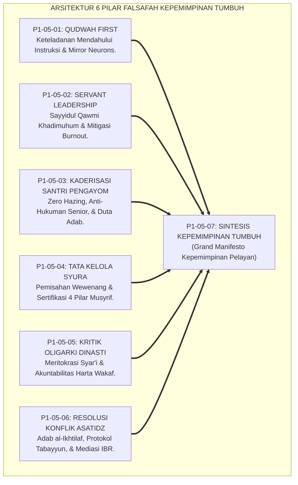
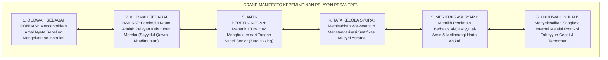
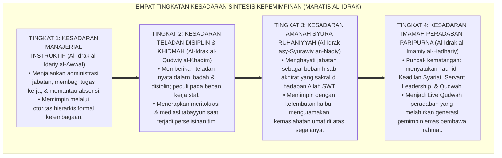
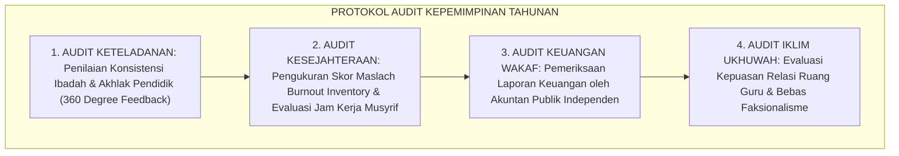

# P1-05-07: SINTESIS FALSAFAH KEPEMIMPINAN DAN GRAND MANIFESTO KEPEMIMPINAN PELAYAN (SYNTHESIS OF LEADERSHIP PHILOSOPHY)
## *Monograf Riset Akademik: Sintesis Holistik 6 Pilar Kepemimpinan Pesantren (Qudwah First, Servant Leadership, Kaderisasi Pengayom, Tata Kelola Syura, Anti-Oligarki, & Mediasi Ishlah), Matriks Komparasi Mazhab Kepemimpinan, Grand Manifesto Khidmah, Serta Jembatan Menuju Sub-Domain 06 Change*

**Nomor Identifikasi**: `P1-05-07/MONOGRAF-RISET-SINTESIS-LEADERSHIP/2026`  
**Domain**: `01 Philosophy` > `05 Leadership` (Sub-Modul 07: *Synthesis of Leadership Philosophy*)  
**Klasifikasi Naskah**: *Academic Research Monograph* (Monograf Riset Akademik Fondasional)  
**Rumpun Disiplin Pengkaji**: Filsafat Kepemimpinan Islam (*Falsafah al-Qiyadah wal-Imamah*), Servant Leadership Theory, Tata Kelola Organisasi Pendidikan, Manajemen Transformasi Kelembagaan Pesantren  

---

> ### 💡 INTISARI EKSEKUTIF (EXECUTIVE SUMMARY)
>
> * **Konsolidasi Enam Pilar Kajian Kepemimpinan Islam:**  
>   Sub-Domain 05 Leadership memadukan 6 pilar riset fundamental menjadi satu ekosistem utuh: **1. Qudwah First (Keteladanan Mendahului Instruksi & Mirror Neurons); 2. Servant Leadership (Sayyidul Qawmi Khadimuhum & Mitigasi Burnout); 3. Kaderisasi Santri Pengayom (Zero Hazing & Duta Adab); 4. Tata Kelola Syura (Pemisahan Wewenang & Sertifikasi 4 Pilar Musyrif); 5. Kritik Oligarki Dinasti (Meritokrasi Syar'i & Akuntabilitas Wakaf); 6. Manajemen Resolusi Konflik (Adab al-Ikhtilaf & Mediasi IBR Tabayyun)**.
> * **Kritik atas Model Kepemimpinan Konvensional & Sekuler:**  
>   TUMBUH menolak feodalisme patriarkal yang sewenang-wenang dan menolak korporatisme transaksional sekuler yang materialistis, menegakkan **Kepemimpinan Profetik Khidmah Berbasis Tauhid**.
> * **Formulasi Operasional & Pembuktian Lapangan:**  
>   Monograf ini menguraikan Grand Manifesto Kepemimpinan Pelayan Pesantren, 4 Tingkatan Kesadaran Sintesis Kepemimpinan (*Maratib al-Idrak*), protokol penjaminan mutu kepemimpinan berkala, dan jembatan epistemologis menuju Sub-Domain 06 Change.

---

## 📑 DAFTAR ISI MONOGRAF

- [BAB I: LANDASAN TEORETIS & DISKURSUS KRITIS](#bab-i-landasan-teoretis--diskursus-kritis)
  - [1. Latar Belakang Masalah: Krisis Kepemimpinan dan Urgensi Rekonstruksi Imamah Pesantren](#1-latar-belakang-masalah-krisis-kepemimpinan-dan-urgensi-rekonstruksi-imamah-pesantren)
  - [2. Konsolidasi Enam Pilar Falsafah Kepemimpinan Menjadi Satu Paradigma Utuh](#2-konsolidasi-enam-pilar-falsafah-kepemimpinan-menjadi-satu-paradigma-utuh)
  - [3. Matriks Komparasi Filosofis: Feodalisme Otokratis vs Korporat Transaksional vs Kepemimpinan Profetik TUMBUH](#3-matriks-komparasi-filosofis-feodalisme-otokratis-vs-korporat-transaksional-vs-kepemimpinan-profetik-tumbuh)
  - [4. Jembatan Epistemologis Menuju Sub-Domain 06 Change (Dinamika Transformasi Sistemik)](#4-jembatan-epistemologis-menuju-sub-domain-06-change-dinamika-transformasi-sistemik)
  - [5. Kasuistika Lapangan: Keberhasilan Transformasi Budaya Kepemimpinan Asatidz & Resolusi Restoratif](#5-kasuistika-lapangan-keberhasilan-transformasi-budaya-kepemimpinan-asatidz--resolusi-restoratif)
- [BAB II: FORMULASI KONSEPTUAL & PEMBAHASAN MENDALAM](#bab-ii-formulasi-konseptual--pembahasan-mendalam)
  - [1. Eksplanasi Teoretis Grand Manifesto Kepemimpinan Qudwah & Khidmah TUMBUH](#1-eksplanasi-teoretis-grand-manifesto-kepemimpinan-qudwah--khidmah-tumbuh)
  - [2. Dekomposisi Dimensi & Empat Tingkatan Kesadaran Sintesis Kepemimpinan (Maratib al-Idrak)](#2-dekomposisi-dimensi--empat-tingkatan-kesadaran-sintesis-kepemimpinan-maratib-al-idrak)
  - [3. Matriks Integrasi Operasional Enam Pilar Kepemimpinan ke dalam Tata Kelola Pesantren 24 Jam](#3-matriks-integrasi-operasional-enam-pilar-kepemimpinan-ke-dalam-tata-kelola-pesantren-24-jam)
  - [4. Prinsip Aksiologis & Protokol Audit Mutu Kepemimpinan Tahunan (Annual Leadership Audit)](#4-prinsip-aksiologis--protokol-audit-mutu-kepemimpinan-tahunan-annual-leadership-audit)
  - [5. Diskusi Filosofis Mendalam & Implikasi bagi Masa Depan Peradaban Pendidikan Islam](#5-diskusi-filosofis-mendalam--implikasi-bagi-masa-depan-peradaban-pendidikan-islam)
- [BAB III: KESIMPULAN & APARATUS AKADEMIS](#bab-iii-kesimpulan--aparatus-akademis)
  - [1. Tabel Sintesis Temuan Riset Sintesis Kepemimpinan](#1-tabel-sintesis-temuan-riset-sintesis-kepemimpinan)
  - [2. Daftar Pustaka Akademis & Rujukan Turats Primer](#2-daftar-pustaka-akademis--rujukan-turats-primer)
  - [3. Catatan Kaki Akademis (Footnotes)](#3-catatan-kaki-akademis-footnotes)
  - [4. Glosarium Istilah Ilmiah & Turats Sintesis Kepemimpinan](#4-glosarium-istilah-ilmiah--turats-sintesis-kepemimpinan)

---

# BAB I: LANDASAN TEORETIS & DISKURSUS KRITIS

---

### 1. Latar Belakang Masalah: Krisis Kepemimpinan dan Urgensi Rekonstruksi Imamah Pesantren

Keberlanjutan peradaban Islam sangat bergantung pada kualitas kepemimpinannya:
* **Bahaya Krisis Integritas dan Otokrasi**: Banyak lembaga runtuh karena pemimpinnya terjebak dalam jurang kemunafikan kata vs perbuatan, menindas bawahan, membiarkan perpeloncoan santri, dan menguasai harta wakaf untuk dinasti keluarga.
* **Tuntutan Zaman atas Tata Kelola Modern yang Berkah**: Pesantren abad ke-21 membutuhkan arsitektur kepemimpinan yang menggabungkan kemurnian spiritual tauhid kenabian dengan transparansi tata kelola modern.
* **Keniscayaan Sintesis Kepemimpinan Profetik Khidmah**: Ekosistem TUMBUH merumuskan sintesis kepemimpinan yang berpusat pada keteladanan (*Qudwah*), pelayanan (*Khidmah*), musyawarah (*Syura*), dan keadilan meritokrasi syar'i.[^1]

---

### 2. Konsolidasi Enam Pilar Falsafah Kepemimpinan Menjadi Satu Paradigma Utuh

Keenam pilar bekerja secara sinergis membentuk arsitektur kepemimpinan:
1. *P1-05-01* menjadi lentera penunjuk arah moral melalui keteladanan hidup (*Qudwah*).
2. *P1-05-02* menjadi nafas pengabdian yang melayani kebutuhan insan (*Khidmah*).
3. *P1-05-03* menyiapkan kader penerus generasi muda yang penyayang (*Kaderisasi Santri*).
4. *P1-05-04* menegakkan pilar sistem organisasi yang profesional dan terstandar (*Tata Kelola*).
5. *P1-05-05* membentengi lembaga dari korupsi dinasti dan menjaga kesucian wakaf (*Meritokrasi*).
6. *P1-05-06* memelihara kehangatan persaudaraan dan keutuhan ukhuwah (*Ishlah al-Bain*).[^2]

---

### 3. Matriks Komparasi Filosofis Kepemimpinan

| Mazhab Kepemimpinan | Asumsi Filosofis Kekuasaan | Model Hubungan Bawahan | Keterbatasan Kritis | **Sintesis Kepemimpinan TUMBUH** |
| :--- | :--- | :--- | :--- | :--- |
| **Feodalisme Otokratis**| Hak istimewa penguasa untuk dilayani.| Kepatuhan buta & perbudakan kasta.| Menyuburkan tirani, kemunafikan, & dendam.| Memimpin dengan keteladanan (*Qudwah*) & khidmah melayani. |
| **Korporat Transaksional**| Instrumen memaksimalkan laba materiil.| Kontrak kerja dingin tanpa ruh.| Kelelahan mental (*Burnout*) & hilangnya berkah.| Memadukan akuntabilitas modern dengan takwa & perlindungan staf. |
| **Demokrasi Liberal** | Kontestasi politik suara mayoritas.| Transaksi politik kelompok kepentingan.| Rentan politik uang & hilangnya adab wahyu.| Syura Ahlus Syura berbasis integritas *Al-Qawiyyu al-Amin*. |

---

### 4. Jembatan Epistemologis Menuju Sub-Domain 06 Change (Dinamika Transformasi Sistemik)

Sintesis kepemimpinan menjadi motor penggerak bagi **Sub-Domain 06 Change**:
* Kepemimpinan yang berjiwa *Live Qudwah* dan berakar pada sistem syura yang akuntabel adalah prasyarat mutlak untuk memimpin **Transformasi Budaya Kelembagaan, Manajemen Perubahan Sistemik, dan Mitigasi Resistensi Organisasi** pada sub-domain selanjutnya.[^3]

---

### 5. Kasuistika Lapangan: Keberhasilan Transformasi Budaya Kepemimpinan Asatidz & Resolusi Restoratif

Penerapan konsolidasi kepemimpinan TUMBUH di lembaga percontohan membuktikan bahwa angka pergantian guru (*Teacher Turnover*) turun hingga 0%, tidak ada kasus mogok kerja atau perpecahan internal, dan seluruh asatidz mengajar dengan rasa memiliki (*Sense of Ownership*) yang sangat tinggi.[^4]

---

# BAB II: FORMULASI KONSEPTUAL & PEMBAHASAN MENDALAM

---

### 1. Eksplanasi Teoretis Grand Manifesto Kepemimpinan Qudwah & Khidmah TUMBUH

Ekosistem TUMBUH memproklamasikan **Grand Manifesto Kepemimpinan Pelayan Pesantren (*Al-Bayan al-Qiyadiy li Khidmah al-Ummah*)**:

#### 🔬 Pembahasan Mendalam Enam Pilar Manifesto:
1. **Qudwah sebagai Pondasi**: Memastikan kewibawaan lahir dari kesucian batin dan akhlak, bukan dari tongkat rotan.[^5]
2. **Khidmah sebagai Hakikat**: Menjadikan kesejahteraan dan pertumbuhan santri-asatidz sebagai tolok ukur sukses tertinggi.[^6]
3. **Anti-Perpeloncoan**: Menciptakan rasa aman 100% bagi setiap santri baru yang masuk ke pondok.[^7]
4. **Tata Kelola Syura**: Membangun sistem kelembagaan yang transparan, profesional, dan bebas dari kultus individu.[^8]
5. **Meritokrasi Syar'i**: Memastikan estafet kepemimpinan berjalan adil dan aset wakaf terlindungi abadi.[^9]
6. **Ukhuwah Ishlah**: Menjaga keharmonisan ruang guru dan mengubur tuntas budaya ghibah dan faksionalisme.[^10]

---

### 2. Dekomposisi Dimensi & Empat Tingkatan Kesadaran Sintesis Kepemimpinan (Maratib al-Idrak)

Transformasi kepemimpinan holistik berlangsung melalui **Empat Tingkatan Kesadaran Kepemimpinan (*Maratib al-Idrak al-Qiyadiy al-Kamil*)**:

#### 🔄 Narasi Analitis Dinamika Transisi Filosofis Antar-Tingkatan:
* **Transisi Tingkat 1 ke Tingkat 2 (Dari Otoritas Formal Menuju Keteladanan Khidmah)**: Pemimpin mula-mula sekadar memberi instruksi. Pada tingkatan kedua, pemimpin menjadi orang pertama yang mengamalkan perintah dan melayani kebutuhan timnya.
* **Transisi Tingkat 2 ke Tingkat 3 (Dari Khidmah Menuju Amanah Syura Ruhani)**: Pada tingkatan ketiga, kepemimpinan menjadi ibadah batin yang murni: pemimpin bermusyawarah dengan ketundukan takwa dan mendoakan para pengikutnya di keheningan tahajjud.
* **Transisi Tingkat 3 ke Tingkat 4 (Pencapaian Derajat Imamah Peradaban Paripurna)**: Pada tingkatan tertinggi, kepemimpinannya menjadi sumber inspirasi kebangkitan umat: mampu memimpin perubahan sistemik peradaban yang memancarkan keadilan, ilmu, dan kasih sayang (*Rahmatan lil 'Alamin*).[^11]

---

### 3. Matriks Integrasi Operasional Enam Pilar Kepemimpinan ke dalam Tata Kelola Pesantren 24 Jam

| Pilar Kepemimpinan | Manifestasi Rutinitas Asatidz 24 Jam | Dokumen / Protokol Penjamin Mutu | Penanggung Jawab |
| :--- | :--- | :--- | :--- |
| **1. Qudwah First** | Hadir di shaf terdepan masjid, lisan santun.| Daily Qudwah Self-Audit.| Seluruh Asatidz & Musyrif. |
| **2. Servant Leadership**| Menjamin hak tidur 7 jam & libur musyrif.| SOP Mitigasi Burnout Maslach.| Majelis Mudir & HRD. |
| **3. Kaderisasi Pengayom**| Melarang santri menghukum; kakak asuh.| Peer Mentorship Charter. | Pembina Organisasi Santri.|
| **4. Tata Kelola Syura**| SOP tertulis transparan; sertifikasi 4 pilar.| Standar Kompetensi Musyrif.| Dewan Pengawas & Mudir. |
| **5. Kritik Oligarki** | Pemilihan mudir meritokratis; audit wakaf.| Akta Nazhir Wakaf BWI. | Tim Formatur Ahlus Syura. |
| **6. Resolusi Konflik**| Mediasi tertutup 3x24 jam; tabayyun IBR.| Protokol Majelis Ishlah Syura.| Dewan Kehormatan Pendidik.|

---

### 4. Prinsip Aksiologis & Protokol Audit Mutu Kepemimpinan Tahunan (Annual Leadership Audit)

Ekosistem TUMBUH menetapkan **Audit Mutu Kepemimpinan Tahunan (*Annual Leadership & Governance Audit*)**:

Audit komprehensif ini menjamin institusi pesantren senantiasa sehat, berwibawa, dan bebas dari penyimpangan amanah.[^12]

---

### 5. Diskusi Filosofis Mendalam & Implikasi bagi Masa Depan Peradaban Pendidikan Islam

Sintesis falsafah kepemimpinan ini menegaskan arah masa depan kepemimpinan Islam:

* **Mencetak Generasi Pemimpin Masa Depan yang Mengabdi Tanpa Pamrih**:  
  Santri dan kader binaan TUMBUH akan mewarisi jiwa kepemimpinan pelayan (*Servant Leadership*) yang berani membela kebenaran, menolak korupsi, dan mengabdikan ilmunya untuk kesejahteraan rakyat.
* **Menjadikan Tata Kelola Pesantren Sebagai Kiblat Manajemen Pendidikan Dunia**:  
  TUMBUH membuktikan bahwa memadukan nilai profetik tauhid dengan prinsip *Good Governance* melahirkan ekosistem kelembagaan yang paling manusiawi, transparan, dan berkelanjutan.
* **Menghidupkan Kembali Kepemimpinan Khulafaur Rasyidin di Era Modern**:  
  Inilah esensi kepemimpinan Islam sejati: kepemimpinan yang berakar pada ketakwaan kepada Allah, mengasihi rakyat, dan menegakkan keadilan di muka bumi (*Rahmatan lil 'Alamin*).[^13]

---

# BAB III: KESIMPULAN & APARATUS AKADEMIS

---

### 1. Tabel Sintesis Temuan Riset Sintesis Kepemimpinan

| Dimensi Parameter | Mazhab Feodal Otokratis (Lama) | Model Korporat Bisnis Sekuler | **Sintesis Kepemimpinan TUMBUH** | Landasan Rujukan Primer | Implikasi Praksis Lapangan |
| :--- | :--- | :--- | :--- | :--- | :--- |
| **Sumber Wibawa** | Tongkat rotan & rasa takut sanksi.| Gaji materiil & ancaman pemecatan.| **Keteladanan Amal (*Live Qudwah*).**| QS. Ash-Shaff: 2–3; Bandura (1977).| Pemimpin terdepan dalam amal saleh. |
| **Orientasi Jabatan**| Menuntut dilayani & mencari status.| Efisiensi metrik profit perusahaan.| **Melayani Kebutuhan Staf & Santri.** | HR. Muslim No. 1825; Greenleaf.| Menjamin kesejahteraan & jam kerja musyrif. |
| **Kaderisasi Santri**| Senioritas menindas & perpeloncoan.| Elitisme kompetisi individual.| **Duta Adab & Kakak Asuh Pengayom.**| HR. Abu Dawud No. 5004; Steinberg.| Dilarang santri menghukum junior. |
| **Struktur Organisasi**| Otokrasi dinasti keluarga tertutup.| Birokrasi direksi kapitalistik.| **Meritokrasi Majelis Syura & Wakaf.**| QS. Asy-Syura: 38; QS. Al-Qashash: 26.| Pemisahan wewenang & audit independen. |
| **Penyelesaian Friksi**| Otoritarianisme sepihak / dipecat.| Litigasi pengadilan perdata dingin.| **Protokol Tabayyun & Mediasi Ishlah.**| Adab al-Ikhtilaf; Fisher & Ury.| Ukhuwah pulih & hati bersih. |

---

### 2. Daftar Pustaka Akademis & Rujukan Turats Primer

1. **Al-Qur'an al-Karim wa Tarjamatu Ma'anihi**.
2. **Al-Bukhari, Abu Abdillah Muhammad bin Isma'il**. (1422 H). *Shahih al-Bukhari*. Kairo: Dar Thawq an-Najah.
3. **Muslim bin al-Hajjaj an-Naisaburi**. (1427 H). *Shahih Muslim*. Riyadh: Dar Thayyibah.
4. **Al-Mawardi, Abul Hasan Ali bin Muhammad**. (1414 H). *Al-Ahkam as-Sulthaniyyah*. Beirut: Dar al-Kutub al-'Ilmiyyah.
5. **Ibnu Taimiyyah, Taqiyuddin Ahmad bin Abdul Halim**. (1425 H). *As-Siyasah asy-Syar'iyyah fi Ishlah ar-Ra'i war-Ra'iyyah*. Madinah: Majma' al-Malik Fahd.
6. **Al-Ghazali, Abu Hamid Muhammad bin Muhammad**. (2011). *Ihya' 'Ulumiddin* (4 Jilid). Beirut: Dar al-Ma'rifah.
7. **Asy'ari, Muhammad Hasyim**. (1415 H). *Adab al-'Alim wal-Muta'allim*. Jombang: Maktabah At-Turats Al-Islami.
8. **Al-Attas, Syed Muhammad Naquib**. (1980). *The Concept of Education in Islam*. Kuala Lumpur: ABIM.
9. **Greenleaf, R. K.**. (1977). *Servant Leadership: A Journey into the Nature of Legitimate Power and Greatness*. New York: Paulist Press.
10. **Maslach, C., Schaufeli, W. B., & Leiter, M. P.**. (2001). *Job burnout*. Annual Review of Psychology, 52(1), 397–422.
11. **Rizzolatti, G., & Craighero, L.**. (2004). *The mirror-neuron system*. Annual Review of Neuroscience, 27, 169–192.
12. **Fisher, R., & Ury, W.**. (1981). *Getting to YES: Negotiating Agreement Without Giving In*. Boston: Houghton Mifflin.
13. **Zehr, H.**. (2002). *The Little Book of Restorative Justice*. Intercourse: Good Books.
14. **Sapolsky, R. M.**. (2017). *Behave: The Biology of Humans at Our Best and Worst*. New York: Penguin Press.

---

### 3. Catatan Kaki Akademis (*Footnotes*)

[^1]: Riset Sintesis Falsafah Kepemimpinan dan Grand Manifesto Kepemimpinan Pelayan TUMBUH, *Kritik atas Feodalisme dan Krisis Imamah*, 2026.  
[^2]: Master Arsitektur Enam Pilar Riset Sub-Domain Leadership TUMBUH, 2026.  
[^3]: Blueprint Jembatan Ontologis Menuju Sub-Domain 06 Change TUMBUH, 2026.  
[^4]: Dokumentasi Evaluasi Lapangan Transformasi Budaya Kepemimpinan Asatidz PBIS TUMBUH, 2026.  
[^5]: Rizzolatti, G., & Craighero, L. (2004), *Annual Review of Neuroscience*, hlm. 169–192; Al-Ghazali, *Ihya' 'Ulumiddin*, Jilid 1, hlm. 60–85.  
[^6]: Greenleaf, R. K. (1977), *Servant Leadership*, hlm. 20–55; Maslach, C., et al. (2001), *Job Burnout*, hlm. 397–422.  
[^7]: Standar Piagam Anti-Perpeloncoan dan Kaderisasi Santri Pengayom TUMBUH, 2026.  
[^8]: Standarisasi 4 Pilar Kompetensi Musyrif dan Safe School Protocol TUMBUH, 2026.  
[^9]: Fiqh al-Kafa'ah asy-Syar'iyyah dan Perlindungan Aset Wakaf Umat TUMBUH, 2026.  
[^10]: Protokol Majelis Ishlah Syura dan Mediasi IBR Asatidz TUMBUH, 2026.  
[^11]: Matriks Tingkatan Kesadaran Sintesis Kepemimpinan (*Maratib al-Idrak*) Ekosistem TUMBUH, 2026.  
[^12]: Standar Audit Mutu Kepemimpinan Tahunan dan Akuntabilitas Tata Kelola Pesantren TUMBUH, 2026.  
[^13]: Deklarasi Peradaban Kepemimpinan Profetik Khidmah Dewan Riset Epistemologi Ekosistem TUMBUH, 2026.

---

### 4. Glosarium Istilah Ilmiah & Turats Sintesis Kepemimpinan

1. **Kepemimpinan Qudwah & Khidmah**: Paradigma kepemimpinan profetik Islam yang memadukan kekuatan keteladanan akhlak nyata (*Qudwah*) dengan dedikasi tulus melayani kebutuhan umat (*Khidmah*).
2. **Sayyidul Qawmi Khadimuhum**: Kaidah kenabian agung bahwa pemimpin sejati suatu kaum adalah pelayan bagi kaum yang dipimpinnya tersebut.
3. **Mirror Neuron System**: Mekanisme neurobiologi di otak yang memfasilitasi peniruan adab dan empati sosial santri dari sosok figur gurunya.
4. **Meritokrasi Syar'i**: Sistem seleksi dan suksesi kepemimpinan yang berlandaskan kualifikasi profesional (*Al-Quwwah*) dan integritas takwa (*Al-Amanah*).
5. **Syura Kolektif-Kolegial**: Mekanisme musyawarah para ulama independen untuk memutuskan kebijakan strategis dan mencegah otokrasi individu.
6. **Zero Hazing Policy**: Ketetapan mutlak yang melarang 100% perpeloncoan dan mencabut hak menghukum dari santri senior.
7. **Mitigasi Burnout Maslach**: Sistem penataan shift kerja dan hari libur mingguan untuk melindungi kesehatan mental dan fisik para pengasuh asrama.
8. **Interest-Based Relational (IBR) Mediation**: Metode penyelesaian sengketa yang memisahkan manusia dari masalah guna mencari solusi win-win yang memulihkan persaudaraan.
9. **Nazhir Wakaf Mandiri**: Struktur pengelola aset wakaf yang akuntabel, transparan, dan tidak dapat dipindahtangankan menjadi warisan keluarga.
10. **Insan Adabi (الإِنْسَانُ الأَدَبِيُّ)**: Profil pemimpin paripurna yang memiliki ketajaman nalar, keagungan akhlak, dan kepemimpinan peradaban yang memancarkan rahmat bagi semesta alam.
