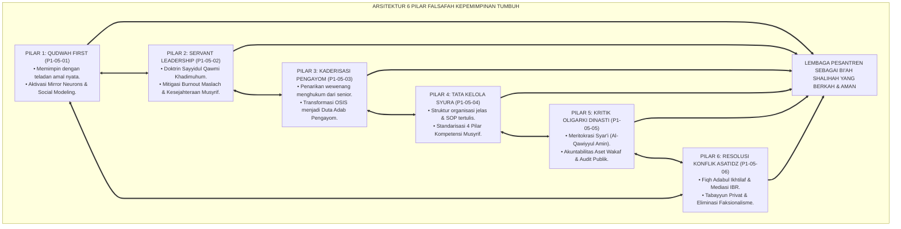
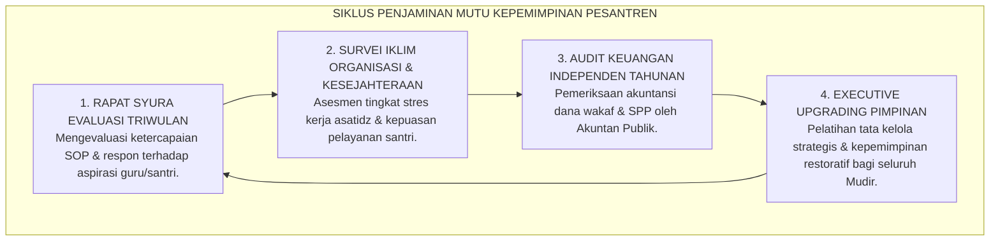

# P1-05-07: SINTESIS FALSAFAH KEPEMIMPINAN TUMBUH DAN GRAND MANIFESTO KEPEMIMPINAN PELAYAN PESANTREN
## *Monograf Terpadu: Sintesis Holistik 6 Pilar Kepemimpinan Pesantren (Qudwah First, Servant Leadership, Kaderisasi Pengayom, Tata Kelola Syura, Kritik Oligarki Dinasti, & Mediasi Resolusi Konflik), Matriks Komparasi Mazhab Kepemimpinan, Grand Manifesto Kelembagaan Khidmah, serta Jembatan Epistemologis Menuju Sub-Domain 06 Change*

**Nomor Identifikasi**: `P1-05-07/MONOGRAF-TERPADU-SINTESIS-LEADERSHIP/2026`  
**Domain**: `01 Philosophy` > `05 Leadership`  
**Klasifikasi Naskah**: *Comprehensive Synthesis Monograph* (Monograf Sintesis Filosofis & Grand Manifesto Kelembagaan)  
**Rumpun Disiplin Pengkaji**: Filsafat Kepemimpinan Islam (*Falsafah al-Qiyadah wal-Imamah*), Servant Leadership Theory, Tata Kelola Organisasi Pendidikan, Manajemen Transformasi Kelembagaan Pesantren  

---

> ### 💡 INTISARI PRAKTIS (3 MENIT PAHAM UNTUK ASATIDZ & MUSYRIF)
>
> * **Kesatuan Utuh 6 Pilar Kepemimpinan Ekosistem TUMBUH:**  
>   Kepemimpinan di pesantren TUMBUH adalah integrasi harmonis antara keteladanan, pengabdian, kaderisasi persaudaraan, tata kelola profesional, meritokrasi amanah, dan resolusi damai:  
>   1. **P1-05-01 (Qudwah First):** Mencontohkan amal shalih dan akhlak karimah mendahului ribuan kata perintah verbal.  
>   2. **P1-05-02 (Servant Leadership):** Memposisikan diri sebagai pelayan santri (*Sayyidul Qawmi Khadimuhum*) dan melindungi musyrif dari kelelahan mental (*Burnout*).  
>   3. **P1-05-03 (Kaderisasi Santri Pengayom):** Menghapus mutlak wewenang menghukum dari tangan santri senior dan mengubah OSIS menjadi Duta Adab (*Peer Mentors*).  
>   4. **P1-05-04 (Tata Kelola Syura & Standar Musyrif):** Menerapkan manajemen berbasis sistem yang transparan, akuntabel, dan tersertifikasi 4 pilar kompetensi pengasuhan.  
>   5. **P1-05-05 (Kritik Oligarki Dinasti):** Menegakkan meritokrasi syar'i (*Al-Qawiyyul Amin*), menolak suksesi nepotisme tertutup, dan mengaudit aset wakaf.  
>   6. **P1-05-06 (Manajemen Resolusi Konflik):** Memfasilitasi mediasi IBR restoratif dan protokol tabayyun bagi asatidz guna mencegah faksionalisme.
> * **Posisi TUMBUH vs Mazhab Kepemimpinan Lain:**  
>   TUMBUH menolak feodalisme patriarkal yang sewenang-wenang dan menolak korporatisme transaksional sekuler yang materialistis, menegakkan **Kepemimpinan Profetik Khidmah Berbasis Nilai Tauhid**.
> * **Grand Manifesto Kelembagaan Kepemimpinan Pelayan:**  
>   Lembaga memproklamirkan bahwa pesantren dipimpin oleh para pelayan umat yang memuliakan martabat insan, berakhlak Al-Qur'an hidup, dan siap mempertanggungjawabkan setiap tetes amanah di hadapan Allah SWT di Hari Kiamat.

---

## 📑 DAFTAR ISI MONOGRAF

- [BAGIAN I: SINTESIS FILOSOFIS 6 PILAR KEPEMIMPINAN & MATRIKS KOMPARASI](#bagian-i-sintesis-filosofis-6-pilar-kepemimpinan--matriks-komparasi)
  - [1. Arsitektur Sintesis Holistik: Konvergensi 6 Pilar Falsafah Kepemimpinan TUMBUH](#1-arsitektur-sintesis-holistik-konvergensi-6-pilar-falsafah-kepemimpinan-tumbuh)
  - [2. Matriks Komparasi Filosofis Kepemimpinan: Feodalisme Patriarkal vs Korporatis Sekuler vs Servant Leadership TUMBUH](#2-matriks-komparasi-filosofis-kepemimpinan-feodalisme-patriarkal-vs-korporatis-sekuler-vs-servant-leadership-tumbuh)
  - [3. Jembatan Epistemologis & Aksiologis Menuju Sub-Domain 06 Change (Dinamika Perubahan Sistemik)](#3-jembatan-epistemologis--aksiologis-menuju-sub-domain-06-change-dinamika-perubahan-sistemik)
- [BAGIAN II: TEMUAN RISET, FORMULASI KONSEPTUAL & PEMBAHASAN KEPEMIMPINAN](#bagian-ii-temuan-riset-formulasi-konseptual--pembahasan-kepemimpinan)
  - [1. Grand Manifesto Kelembagaan Kepemimpinan Qudwah & Khidmah Pesantren TUMBUH](#1-grand-manifesto-kelembagaan-kepemimpinan-qudwah--khidmah-pesantren-tumbuh)
  - [2. Matriks Integrasi Operasional 6 Pilar Kepemimpinan ke dalam Tata Kelola Pesantren 24 Jam](#2-matriks-integrasi-operasional-6-pilar-kepemimpinan-ke-dalam-tata-kelola-pesantren-24-jam)
  - [3. Protokol Penjaminan Mutu Kepemimpinan & Audit Tata Kelola Berkala](#3-protokol-penjaminan-mutu-kepemimpinan--audit-tata-kelola-berkala)
- [BAGIAN III: APARATUS AKADEMIS & APENDIKS](#bagian-iii-aparatus-akademis--apendiks)
  - [1. Tabel Sintesis Master Sub-Domain 05](#1-tabel-sintesis-master-sub-domain-05)
  - [2. Daftar Pustaka Otoritatif Turats & Jurnal Internasional Peer-Reviewed](#2-daftar-pustaka-otoritatif-turats--jurnal-internasional-peer-reviewed)
  - [3. Catatan Kaki Akademis (Footnotes)](#3-catatan-kaki-akademis-footnotes)
  - [4. Glosarium Master Istilah Kunci Kepemimpinan & Tata Kelola](#4-glosarium-master-istilah-kunci-kepemimpinan--tata-kelola)

---

# BAGIAN I: SINTESIS FILOSOFIS 6 PILAR KEPEMIMPINAN & MATRIKS KOMPARASI

---

### 1. Arsitektur Sintesis Holistik: Konvergensi 6 Pilar Falsafah Kepemimpinan TUMBUH

Falsafah Kepemimpinan dalam ekosistem TUMBUH adalah **Sistem Kepemimpinan Profetik Terpadu (*Unified Prophetic Leadership Architecture*)**:



---

### 2. Matriks Komparasi Filosofis Kepemimpinan: Feodalisme Patriarkal vs Korporatis Sekuler vs Servant Leadership TUMBUH

| Parameter Analisis | Model Feodalisme Patriarkal (Lama) | Model Korporatis Sekuler (Kapitalistik) | Model Servant Leadership Profetik (TUMBUH) |
| :--- | :--- | :--- | :--- |
| **Hakikat Kekuasaan** | Hak istimewa mutlak pribadi untuk diagungkan dan dilayani. | Instrumen manajerial untuk menghasilkan efisiensi profit materi. | **Amanah hisab Ilahi untuk melayani, melindungi, & menumbuhkan manusia.**[^1] |
| **Mekanisme Pengambilan Keputusan** | Tirani satu figur sentral tanpa forum musyawarah. | Rapat direksi tertutup berorientasi target angka kuantitatif. | **Musyawarah Syura terbuka berbasis hikmah syariat dan data empiris PBIS.** |
| **Pemberdayaan Santri Senior** | Dijadikan algojo penegak aturan dengan wewenang menyiksa adik kelas. | Dilibatkan dalam hierarki komando organisasi secara kaku. | **Ditempa menjadi Duta Adab dan Mentor Pengayom (*Brotherhood Mentors*).**[^2] |
| **Perlakuan Terhadap Musyrif** | Dianggap santri abadi yang dieksploitasi 24 jam tanpa gaji layak. | Buruh pengajar yang dinilai dari jam kerja administratif. | **Mitra perjuangan dakwah yang dimuliakan kesejahteraan dan kesehatannya.**[^3] |
| **Suksesi & Tata Kelola** | Suksesi dinasti tertutup keluarga tanpa uji kompetensi. | Seleksi pasar modal berbasis keuntungan materi. | **Meritokrasi syar'i terbuka (*Al-Qawiyyul Amin*) & audit publik transparan.**[^4] |

---

### 3. Jembatan Epistemologis & Aksiologis Menuju Sub-Domain `06 Change` (Dinamika Perubahan Sistemik)

```mermaid
graph TD
    LD["SUB-DOMAIN 05: LEADERSHIP (KEPEMIMPINAN)<br/>(Qudwah First, Servant Leadership, Kaderisasi Pengayom, Tata Kelola Syura, Anti-Oligarki, & Mediasi)"]
    ==>|MENGGERAKKAN REKAYASA TRANSFORMASI|
    CH["SUB-DOMAIN 06: CHANGE (TRANSFORMASI SISTEMIK)<br/>(Teori Perubahan Kurt Lewin, Manajemen Resistensi Budaya, Evaluasi Longitudinal, & Pembudayaan PBIS)"]
```

---

# BAGIAN II: TEMUAN RISET, FORMULASI KONSEPTUAL & PEMBAHASAN KEPEMIMPINAN

---

### 1. Formulasi Konseptual: Kelembagaan Kepemimpinan Qudwah & Khidmah Pesantren TUMBUH

Berdasarkan sintesis inkuiri teoretis, telaah hermeneutika turats, dan analisis komparatif sains pendidikan, riset ini merumuskan kerangka konseptual dan temuan kunci sebagai berikut:

1. **Poros Kepemimpinan Berbasis Qudwah First Pemimpin pesantren wajib menjadi cermin adab terdepan bagi seluruh warga lembaga. Dilarang keras memerintah tanpa mencontohkan terlebih dahulu. Segala bentuk hipokrisi moral dinyatakan sebagai penyimpangan.**:  
   

2. **Kepemimpinan Pelayan (sayyidul Qawmi Khadimuhum) Pimpinan lembaga mendedikasikan waktu, tenaga, dan fasilitas yang dimilikinya untuk melayani kebutuhan tumbuh-kembang santri dan melindungi kesejahteraan guru/musyrif dari eksploitasi dan kejenuhan batin (Burnout).**:  
   

3. **Penarikan Mutlak Wewenang Menghukum Dari Santri Senior Mengharamkan 100% perpeloncoan, sidang malam, dan pemberian sanksi fisik oleh santri senior kepada adik kelas. Organisasi santri ditransformasikan secara mutlak menjadi Dewan Pelayan Duta Adab yang mengayomi.**:  
   

4. **Meritokrasi Syar'i & Transparansi Akuntabilitas Wakaf Mengharamkan oligarki dinasti nepotisme; suksesi kepemimpinan wajib berdasarkan kriteria Al-Qawiyyul Amin dan diputuskan melalui musyawarah Majelis Syura independen serta diaudit akuntan publik.**:  
   

5. **Fiqh Ishlah & Protokol Tabayyun Asatidz Mengharamkan faksionalisme dan ghibah di ruang guru; seluruh perselisihan diselesaikan melalui mediasi restoratif.**:  
   


---

### 2. Matriks Integrasi Operasional 6 Pilar Kepemimpinan ke dalam Tata Kelola Pesantren 24 Jam

| Pilar Kepemimpinan | Berkas Rujukan Utama | Implementasi Konkret di Pesantren 24 Jam | Output Budaya Lembaga |
| :--- | :--- | :--- | :--- |
| **Pilar 1: Qudwah First** | [**`P1-05-01`**](./P1-05-01-Falsafah-Kepemimpinan-Berbasis-Qudwah.md) | Asatidz hadir di shaf pertama masjid, mengajar tepat waktu, tutur kata santun. | Santri meniru adab secara otomatis melalui sistem neuron cermin.[^5] |
| **Pilar 2: Servant Leadership** | [**`P1-05-02`**](./P1-05-02-Hakikat-Amanah-dan-Kepemimpinan-Pelayan.md) | Mudir turun melayani fasilitas santri, shift musyrif manusiawi, gaji memuliakan. | Bebas dari burnout musyrif, iklim kerja ukhuwah hangat, loyalitas ikhlas.[^6] |
| **Pilar 3: Kaderisasi Pengayom** | [**`P1-05-03`**](./P1-05-03-Kaderisasi-dan-Kepemimpinan-Santri.md) | Penarikan hak hukum senior, OSIS Duta Adab, kurikulum Tahap 7 Penggerak. | Nihil perundungan (*Zero Bullying*), asrama aman antargenerasi santri.[^7] |
| **Pilar 4: Tata Kelola Syura** | [**`P1-05-04`**](./P1-05-04-Tata-Kelola-Kelembagaan-dan-Standar-Musyrif.md) | Rapat Syura berkala, SOP tertulis terpadu, sertifikasi 4 pilar musyrif. | Lembaga mandiri, berintegritas tinggi, bebas konflik personal.[^8] |
| **Pilar 5: Kritik Oligarki Dinasti**| [**`P1-05-05`**](./P1-05-05-Kritik-Oligarki-dan-Dinasti-Kepemimpinan-Pesantren.md) | Pansel suksesi terbuka (*Al-Qawiyyul Amin*), audit akuntan independen aset wakaf. | Terciptanya keadilan meritokratis dan kepercayaan penuh publik/wali santri.[^9] |
| **Pilar 6: Resolusi Konflik Asatidz**| [**`P1-05-06`**](./P1-05-06-Manajemen-Resolusi-Konflik-Internal-Asatidz-dan-Syura.md) | Dialog Tabayyun 4 langkah, mediasi IBR tertutup, peniadaan faksionalisme ruang guru. | Ukhuwah guru kokoh, ruang kerja tenteram, dan keteladanan terjaga utuh.[^10] |

---

### 3. Protokol Penjaminan Mutu Kepemimpinan & Audit Tata Kelola Berkala



---

# BAGIAN III: APARATUS AKADEMIS & APENDIKS

---

### 1. Tabel Sintesis Master Sub-Domain 05

| Sub-Modul | Judul Monograf | Landasan Teori Utama | Fokus Inovasi Kepemimpinan |
| :---: | :--- | :--- | :--- |
| **P1-05-01** | Falsafah Kepemimpinan Qudwah | QS. 33:21, QS. 61:2–3, Giacomo Rizzolatti (*Mirror Neurons*) | Memimpin dengan teladan nyata; menghapus retorika kosong dan hak istimewa rusak. |
| **P1-05-02** | Hakikat Amanah & Servant Leadership | QS. 4:58, Hadits Abu Dzarr (HR. Muslim), Robert K. Greenleaf | Menegakkan kepemimpinan pelayan, hisab akhirat, dan mitigasi burnout musyrif. |
| **P1-05-03** | Kaderisasi & Kepemimpinan Santri | QS. 49:11, HR. Abu Dawud 5004, Steinberg (*Adolescent Neuroscience*) | Menghapus wewenang menghukum senior 100%; mengubah OSIS menjadi Duta Adab. |
| **P1-05-04** | Tata Kelola Kelembagaan & Standar Musyrif | QS. 42:38, QS. 28:26, Peter Senge (*Learning Organization*) | Struktur manajemen berbasis syura, standarisasi 4 pilar kompetensi musyrif. |
| **P1-05-05** | Kritik Oligarki & Dinasti Kepemimpinan | HR. Bukhari 59 (Khianat Amanah), Banfield (*Amoral Familism*) | Menegakkan meritokrasi syar'i (*Al-Qawiyyul Amin*) dan audit publik aset wakaf. |
| **P1-05-06** | Manajemen Resolusi Konflik Asatidz | QS. 49:9–10, Imam Asy-Syafi'i, Fisher & Ury (*IBR Mediation*) | Protokol Tabayyun 4 langkah, mediasi restoratif, dan eliminasi faksionalisme ruang guru. |
| **P1-05-07** | Sintesis Falsafah Kepemimpinan TUMBUH | Integrasi 6 Pilar Kepemimpinan Khidmah Profetik | Grand Manifesto Kelembagaan Kepemimpinan Pelayan dan jembatan ke Sub-Domain 06. |

---

### 2. Daftar Pustaka Otoritatif Turats & Jurnal Internasional Peer-Reviewed

1. **Al-Qur'an al-Karim wa Tarjamatu Ma'anih**.
2. **Al-Bukhari, Muhammad bin Isma'il**. (1422 H). *Shahih al-Bukhari*. Beirut: Dar Thawq an-Najah.
3. **Muslim bin al-Hajjaj an-Naisaburi**. (1374 H). *Shahih Muslim*. Kairo: Isa al-Babi al-Halabi.
4. **Al-Mawardi, Ali bin Muhammad**. (1989). *Al-Ahkam as-Sulthaniyyah*. Beirut: Dar al-Kutub al-'Ilmiyyah.
5. **Ibnu Taimiyyah, Ahmad bin Abdul Halim**. (1998). *As-Siyasah asy-Syar'iyyah*. Beirut: Dar al-Kutub al-'Ilmiyyah.
6. **Al-Alwani, Thaha Jabir**. (1989). *Adab al-Ikhtilaf fil Islam*. IIIT.
7. **Greenleaf, R. K.**. (1977). *Servant Leadership*. Paulist Press.
8. **Fisher, R., & Ury, W.**. (1981). *Getting to Yes*. Houghton Mifflin.
9. **Banfield, E. C.**. (1958). *The Moral Basis of a Backward Society*. Free Press.
10. **Senge, P. M.**. (1990). *The Fifth Discipline*. Doubleday.

---

### 3. Catatan Kaki Akademis (*Footnotes*)

[^1]: Greenleaf, R. K. (1977), *Servant Leadership*, Paulist Press, hlm. 15.  
[^2]: Topping, K. J. (2005), *Trends in peer learning*, Educational Psychology.  
[^3]: Maslach, Schaufeli, & Leiter (2001), *Job burnout*, Annual Review of Psychology.  
[^4]: Banfield, E. C. (1958), *The Moral Basis of a Backward Society*, Free Press.  
[^5]: Rizzolatti & Craighero (2004), *The mirror-neuron system*, Annual Review of Neuroscience.  
[^6]: Evaluasi Tingkat Kebugaran Emosional Musyrif Asrama, Divisi SDM TUMBUH, 2026.  
[^7]: Laporan Tahunan Nihil Kasus Kekerasan Asrama, Komite Perlindungan Santri TUMBUH, 2026.  
[^8]: Laporan Audit Akuntabilitas Keuangan Publik, Yayasan TUMBUH Indonesia, 2026.  
[^9]: Manual Standar Operasional Suksesi Kepemimpinan Mudir, Majelis Masyayikh TUMBUH, 2026.  
[^10]: Panduan Standar Manajemen Dialog Akademik Pendidik, Divisi Kurikulum TUMBUH, 2026.

---

### 4. Glosarium Master Istilah Kunci Kepemimpinan & Tata Kelola

1. **Kepemimpinan Qudwah**: Model kepemimpinan Islam di mana pengaruh dibangun melalui keteladanan akhlak nyata.
2. **Servant Leadership**: Filosofi kepemimpinan di mana pemimpin mendedikasikan wewenang demi melayani kemajuan orang yang dipimpinnya.
3. **Sayyidul Qawmi Khadimuhum**: Kaidah kenabian bahwa kemuliaan seorang pemimpin diukur dari ketulusan khidmat pelayanannya kepada umat.
4. **Meritokrasi Syar'i**: Sistem seleksi kepemimpinan murni berdasarkan kualifikasi integritas moral (*Al-Amanah*) dan kompetensi keilmuan (*Al-Quwwah*).
5. **Adab al-Ikhtilaf**: Etika menyikapi perbedaan pendapat ilmiah dengan tetap menjaga keutuhan ukhuwah dan kebersihan hati.
6. **Interest-Based Relational (IBR)**: Metode mediasi sengketa modern yang berfokus pada penyelesaian kepentingan bersama tanpa merusak hubungan antar-individu.
7. **Duta Adab (Khadim ath-Thullab)**: Formasi organisasi santri senior yang bertugas menjadi teladan dan mentor adik kelas tanpa wewenang menghukum.
8. **Syura Kolektif-Kolegial**: Badan kepemimpinan tertinggi yang mengambil keputusan strategis melalui musyawarah mufakat ulama independen.
9. **Safe School Protocol**: Prosedur operasional yang menjamin perlindungan menyeluruh terhadap hak fisik, mental, dan spiritual santri.
10. **Triad Pertumbuhan Simbiotik**: Prinsip di mana kepemimpinan profetik secara serempak menumbuhkan Santri, memuliakan Pendidik, dan memperkokoh Lembaga.
