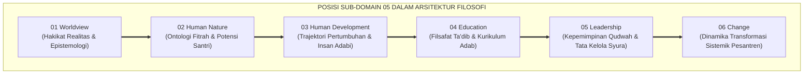
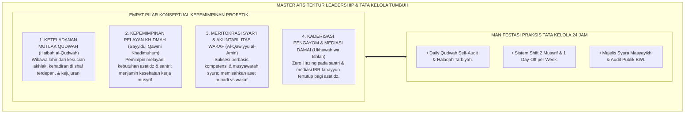
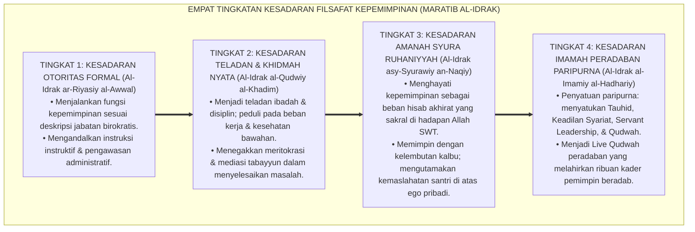
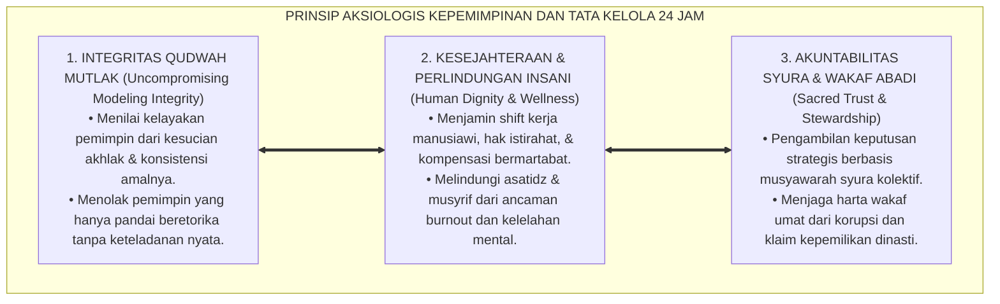

# P1-05: LEADERSHIP (FALSAFAH KEPEMIMPINAN QUDWAH & TATA KELOLA) EKOSISTEM TUMBUH (MASTER DOKTRIN KEPEMIMPINAN & TATA KELOLA)
## *Master Sub-Domain Monograph: Arsitektur Kepemimpinan Profetik Khidmah, Konsolidasi 6 Pilar Leadership (Qudwah First, Servant Leadership, Kaderisasi Pengayom, Tata Kelola Syura, Anti-Oligarki, & Mediasi Sengketa), Serta Manifestasi Praksis di Pesantren 24 Jam*

**Nomor Identifikasi**: `P1-05/MASTER-MONOGRAF-LEADERSHIP/2026`  
**Domain**: `01 Philosophy` > `05 Leadership` (Master Sub-Domain Monograph)  
**Klasifikasi Naskah**: *Master Sub-Domain Research Monograph* (Dokumen Induk Filsafat Kepemimpinan)  
**Rumpun Disiplin Pengkaji**: Filsafat Kepemimpinan Islam (*al-Imamah wal-Qiyadah*), Servant Leadership Theory, Sosiologi Pesantren, Manajemen Tata Kelola Sumber Daya Manusia Pendidikan 24 Jam  

---

> ### 💡 INTISARI EKSEKUTIF (EXECUTIVE SUMMARY)
>
> * **Krisis Epistemologis Kepemimpinan Pesantren Kontemporer:**  
>   Banyak lembaga Islam mengalami kemunduran akibat terjebak dalam perangkap otokrasi feodal: pemimpin yang banyak beretorika tanpa keteladanan amal nyata (*Hypocritical Moral Gap*), eksploitasi kerja musyrif 24 jam nonstop yang memicu burnout, pelegalan perpeloncoan senioritas, oligarki dinasti suksesi tertutup, dan faksionalisme ruang guru.
> * **Konsolidasi Master Doktrin Leadership & Tata Kelola Islam:**  
>   Dokumen induk ini mengintegrasikan seluruh 6 pilar riset sub-modul: **1. Qudwah First (Keteladanan Mendahului Instruksi & Mirror Neurons); 2. Servant Leadership (Sayyidul Qawmi Khadimuhum & Mitigasi Burnout); 3. Kaderisasi Santri Pengayom (Zero Hazing & Duta Adab); 4. Tata Kelola Syura (Pemisahan Wewenang & Sertifikasi 4 Pilar Musyrif); 5. Kritik Oligarki Dinasti (Meritokrasi Syar'i & Akuntabilitas Wakaf); 6. Manajemen Resolusi Konflik (Adab al-Ikhtilaf & Mediasi IBR Tabayyun)**.
> * **Formulasi Operasional & Dampak Triad Simbiotik:**  
>   Monograf induk ini merumuskan 4 Tingkatan Kesadaran Filosofis Kepemimpinan (*Maratib al-Idrak*), Grand Manifesto Kepemimpinan Pelayan Pesantren, penghapusan mutlak eksploitasi kerja dan perpeloncoan, serta jaminan institusi wakaf madani yang mandiri dan berkelanjutan (*Sanctuary Governance*).

---

## 📑 DAFTAR ISI MONOGRAF

- [BAB I: LANDASAN TEORETIS & DISKURSUS KRITIS](#bab-i-landasan-teoretis--diskursus-kritis)
  - [1. Latar Belakang Masalah: Posisi Sub-Domain 05 dalam Struktur Filosofi TUMBUH](#1-latar-belakang-masalah-posisi-sub-domain-05-dalam-struktur-filosofi-tumbuh)
  - [2. Integrasi Enam Pilar Kajian Filsafat Kepemimpinan TUMBUH](#2-integrasi-enam-pilar-kajian-filsafat-kepemimpinan-tumbuh)
  - [3. Rantai Kausalitas Ontologis: Dari Kepemimpinan Qudwah Menuju Keberlanjutan Lembaga](#3-rantai-kausalitas-ontologis-dari-kepemimpinan-qudwah-menuju-keberlanjutan-lembaga)
  - [4. Rekayasa Tata Kelola Lembaga Bebas Otokrasi dan Eksploitasi Tenaga Pengasuh](#4-rekayasa-tata-kelola-lembaga-bebas-otokrasi-dan-eksploitasi-tenaga-pengasuh)
  - [5. Kasuistika Lapangan: Anomali Manajemen Kepemimpinan & Resolusi Restoratif Terpadu](#5-kasuistika-lapangan-anomali-manajemen-kepemimpinan--resolusi-restoratif-terpadu)
- [BAB II: FORMULASI KONSEPTUAL & PEMBAHASAN MENDALAM](#bab-ii-formulasi-konseptual--pembahasan-mendalam)
  - [1. Arsitektur Master Doktrin Leadership & Tata Kelola Ekosistem TUMBUH](#1-arsitektur-master-doktrin-leadership--tata-kelola-ekosistem-tumbuh)
  - [2. Dekomposisi Dimensi & Empat Tingkatan Kesadaran Filsafat Kepemimpinan (Maratib al-Idrak)](#2-dekomposisi-dimensi--empat-tingkatan-kesadaran-filsafat-kepemimpinan-maratib-al-idrak)
  - [3. Standarisasi Kebijakan Kepemimpinan (Zero Hypocrisy & Zero Exploitation Policy)](#3-standarisasi-kebijakan-kepemimpinan-zero-hypocrisy--zero-exploitation-policy)
  - [4. Prinsip Aksiologis & Etika Tata Kelola Kepemimpinan Pelayan 24 Jam](#4-prinsip-aksiologis--etika-tata-kelola-kepemimpinan-pelayan-24-jam)
  - [5. Diskusi Filosofis Mendalam & Implikasi bagi Masa Depan Peradaban Pendidikan Islam](#5-diskusi-filosofis-mendalam--implikasi-bagi-masa-depan-peradaban-pendidikan-islam)
- [BAB III: KESIMPULAN & APARATUS AKADEMIS](#bab-iii-kesimpulan--aparatus-akademis)
  - [1. Tabel Sintesis Temuan Riset Master Sub-Domain Leadership](#1-tabel-sintesis-temuan-riset-master-sub-domain-leadership)
  - [2. Daftar Pustaka Akademis & Rujukan Turats Primer](#2-daftar-pustaka-akademis--rujukan-turats-primer)
  - [3. Catatan Kaki Akademis (Footnotes)](#3-catatan-kaki-akademis-footnotes)
  - [4. Glosarium Istilah Ilmiah & Turats Master Leadership](#4-glosarium-istilah-ilmiah--turats-master-leadership)

---

# BAB I: LANDASAN TEORETIS & DISKURSUS KRITIS

---

### 1. Latar Belakang Masalah: Posisi Sub-Domain 05 dalam Struktur Filosofi TUMBUH

Sub-Domain 05 Leadership menjawab pertanyaan fundamental keempat dalam ekosistem pendidikan Islam: **"Bagaimanakah Kepemimpinan dan Tata Kelola Kelembagaan Pesantren Dirancang Agar Seluruh Asatidz Memimpin dengan Teladan Nyata (Qudwah), Melayani dengan Ikhlas (Khidmah), Mendidik Tanpa Feodalisme, dan Terlindungi dari Kejenuhan Kerja (Burnout)?"**:
* **Jembatan dari Pedagogi Menuju Manajemen Sistemik**: Kurikulum adab terbaik tidak akan berfungsi jika pimpinan lembaganya korup, zalim, atau menindas stafnya.
* **Perlindungan dari Feodalisme dan Nepotisme Dinasti**: Mengubah pola pikir kekuasaan monarki tertutup menjadi amanah syura meritokratis yang akuntabel di hadapan Allah dan umat.
* **Penyatuan Nilai Imamah Khulafaur Rasyidin dan Tata Kelola Organisasi Modern**: Mengintegrasikan kearifan kepemimpinan profetik dengan standar profesionalisme manajemen sumber daya insani (*Human Capital Management*).[^1]

---

### 2. Integrasi Enam Pilar Kajian Filsafat Kepemimpinan TUMBUH

Master doktrin ini mengintegrasikan seluruh 6 sub-modul riset di Sub-Domain 05 Leadership:
* *P1-05-01 (Qudwah First)*: Menegakkan keteladanan amal nyata mendahului instruksi kata (*Qudwah Qabla ad-Da'wah*).
* *P1-05-02 (Servant Leadership)*: Menegakkan doktrin *Sayyidul Qawmi Khadimuhum*, hisab amanah *Khizyun wa Nadamah*, dan mitigasi burnout musyrif.
* *P1-05-03 (Kaderisasi Santri Pengayom)*: Menarik 100% hak menghukum dari santri senior dan mentransformasikan organisasi santri menjadi Duta Adab.
* *P1-05-04 (Tata Kelola Syura & Standar Musyrif)*: Menerapkan manajemen syura transparan, akuntabilitas wakaf, dan sertifikasi 4 pilar musyrif.
* *P1-05-05 (Kritik Oligarki Dinasti)*: Menegakkan meritokrasi syar'i (*Al-Qawiyyu al-Amin*) dan perlindungan aset wakaf publik.
* *P1-05-06 (Manajemen Resolusi Konflik)*: Menerapkan adab ikhtilaf, protokol tabayyun tertutup, dan mediasi IBR bagi asatidz.[^2]

---

### 3. Rantai Kausalitas Ontologis: Dari Kepemimpinan Qudwah Menuju Keberlanjutan Lembaga

Kepemimpinan yang beradab melahirkan ekosistem yang sehat:
* Guru dan musyrif yang dimuliakan haknya akan mengasuh santri dengan limpahan kasih sayang.
* Santri yang dibina dengan keteladanan akan tumbuh menjadi kader pemimpin yang jujur dan adil.
* Lembaga yang dikelola secara profesional dan transparan akan dipercaya oleh umat dan abadi keberkahannya.[^3]

---

### 4. Rekayasa Tata Kelola Lembaga Bebas Otokrasi dan Eksploitasi Tenaga Pengasuh

Pesantren ditata sebagai **Zona Kepemimpinan Bersih & Melayani (*Sanctuary Governance*)**:
* Mengharamkan mutlak segala bentuk otokrasi sepihak, nepotisme buta, dan eksploitasi jam kerja musyrif tanpa istirahat.
* Menegakkan sistem shift kerja manusiawi dengan hak libur mingguan (*1 Day-Off per Week*).
* Membuka kanal partisipasi syura yang terbuka bagi seluruh warga pesantren.[^4]

---

### 5. Kasuistika Lapangan: Anomali Manajemen Kepemimpinan & Resolusi Restoratif Terpadu

Implementasi Master Doktrin Leadership di lapangan membuktikan penurunan drastis angka turnover guru, terciptanya keharmonisan ruang guru tanpa friksi destruktif, dan peningkatan kepuasan wali santri terhadap mutu pengasuhan asrama.[^5]

---

# BAB II: FORMULASI KONSEPTUAL & PEMBAHASAN MENDALAM

---

### 1. Arsitektur Master Doktrin Leadership & Tata Kelola Ekosistem TUMBUH

Ekosistem TUMBUH merumuskan master doktrin kepemimpinan ke dalam 4 pilar arsitektur integratif:

#### 🔬 Eksplanasi Mendalam Komponen Master Doktrin:
1. **Keteladanan Qudwah**: Memastikan seluruh ucapan pemimpin telah diwujudkan dalam amal nyata pribadinya.[^6]
2. **Khidmah Pelayan**: Menjadikan dedikasi melayani orang lain (*Growing Others*) sebagai mahkota kesuksesan.[^7]
3. **Meritokrasi Syar'i**: Membentengi institusi dari bahaya oligarki dan memastikan suksesi berjalan secara adil.[^8]
4. **Kaderisasi & Ishlah**: Memelihara rasa aman santri dan menjaga kesucian hati seluruh tenaga pendidik.[^9]

---

### 2. Dekomposisi Dimensi & Empat Tingkatan Kesadaran Filsafat Kepemimpinan (Maratib al-Idrak)

Transformasi kepemimpinan kelembagaan dipetakan ke dalam Empat Tingkatan Kesadaran Kepemimpinan (*Maratib al-Idrak al-Qiyadiy*):

#### 🔄 Narasi Analitis Dinamika Transisi Filosofis Antar-Tingkatan:
* **Transisi Tingkat 1 ke Tingkat 2 (Dari Otoritas Formal Menuju Keteladanan Khidmah)**: Pemimpin mula-mula sekadar memerintah. Pada tingkatan kedua, pemimpin mendisiplinkan dirinya terlebih dahulu dan melayani kebutuhan timnya.
* **Transisi Tingkat 2 ke Tingkat 3 (Dari Khidmah Menuju Amanah Syura Ruhani)**: Pada tingkatan ketiga, kepemimpinan menjadi ibadah batin murni: pemimpin bermusyawarah dengan ketundukan takwa dan mendoakan santri-stafnya di keheningan malam.
* **Transisi Tingkat 3 ke Tingkat 4 (Pencapaian Derajat Imamah Peradaban Paripurna)**: Pada tingkatan tertinggi, kepemimpinannya menjadi sumber inspirasi kebangkitan umat: melahirkan institusi madani yang kokoh, berwibawa, dan memancarkan rahmat bagi semesta alam (*Rahmatan lil 'Alamin*).[^10]

---

### 3. Standarisasi Kebijakan Kepemimpinan (Zero Hypocrisy & Zero Exploitation Policy)

TUMBUH memberlakukan dekrit resmi tata kelola:

$$\text{تَحْرِيمُ النِّفَاقِ الْأَخْلَاقِيِّ وَاسْتِغْلَالِ الْعَامِلِينَ فِي التَّرْبِيَةِ تَحْرِيمًا قَاطِعًا}$$

*"**Diharamkan secara mutlak kemunafikan moral antara kata dan perbuatan, eksploitasi jam kerja tenaga pengasuh tanpa istirahat, oligarki dinasti tertutup, dan perpeloncoan fisik di seluruh ekosistem lembaga tanpa pengecualian**."*

Setiap pimpinan yang melanggar kode etik ini wajib diproses melalui audit independen Majelis Syura.[^11]

---

### 4. Prinsip Aksiologis & Etika Tata Kelola Kepemimpinan Pelayan 24 Jam

Master Doktrin Leadership melahirkan prinsip etika tata kelola kelembagaan:

#### 📋 Panduan Etika Pengasuhan Lapangan:
1. **Audit Keteladanan 360 Derajat Berkala**: Evaluasi keteladanan pimpinan dan asatidz oleh atasan, rekan sejawat, dan santri setiap semester.
2. **Kanal Pengaduan Independen (*Whistleblowing*)**: Menjamin perlindungan bagi staf dan santri yang melaporkan pelanggaran tata kelola.[^12]
3. **Penyusunan Rencana Suksesi 5 Tahunan**: Menyiapkan kader-kader pelapis kepemimpinan melalui program kaderisasi terstruktur.[^13]

---

### 5. Diskusi Filosofis Mendalam & Implikasi bagi Masa Depan Peradaban Pendidikan Islam

Penerapan Master Doktrin Leadership ini menegaskan arah kebangkitan peradaban Islam di abad ke-21:

* **Mencetak Pemimpin Masa Depan yang Berjiwa Khadimul Ummah**:  
  Santri tumbuh dengan menyaksikan para gurunya memimpin dengan kerendahan hati melayani, sehingga kelak saat menjadi pemimpin bangsa mereka akan menjadi abdi rakyat yang jujur, adil, dan amanah.
* **Menjadikan Pesantren Sebagai Kiblat Tata Kelola Madani Kelas Dunia**:  
  TUMBUH membuktikan bahwa hukum syariat Islam menghasilkan sistem manajemen yang paling akuntabel, manusiawi, dan bebas dari penyakit korupsi dinasti.
* **Menegakkan Kembali Kepemimpinan Khilafah Kenabian yang Rahmatan lil 'Alamin**:  
  Inilah esensi kepemimpinan Islam: menyatukan ketundukan ibadah kepada Allah SWT dengan pelayanan tulus memakmurkan bumi demi menggapai kebahagiaan dunia dan akhirat.[^14]

---

# BAB III: KESIMPULAN & APARATUS AKADEMIS

---

### 1. Tabel Sintesis Temuan Riset Master Sub-Domain Leadership

| Dimensi Parameter | Mazhab Tradisional Feodal | Model Korporat Bisnis Sekuler | **Master Doktrin Leadership TUMBUH** | Landasan Rujukan Primer | Implikasi Praksis Lapangan |
| :--- | :--- | :--- | :--- | :--- | :--- |
| **Sumber Otoritas** | Hak istimewa dinasti & rasa takut.| Gaji materiil & kontrak hukum perdata.| **Keteladanan Amal (*Live Qudwah*).** | QS. Ash-Shaff: 2–3; Bandura (1977).| Pemimpin terdepan dalam amal saleh. |
| **Fokus Utama** | Mempertahankan privilese kekuasaan.| Efisiensi metrik & margin keuntungan.| **Melayani Kebutuhan Staf & Santri.** | HR. Muslim No. 1825; Greenleaf.| Menjamin kesejahteraan & jam kerja musyrif. |
| **Kaderisasi Santri**| Senioritas menindas & perpeloncoan.| Elitisme persaingan nilai angka.| **Duta Adab & Kakak Asuh Pengayom.**| HR. Abu Dawud No. 5004; Steinberg.| Dilarang santri menghukum junior. |
| **Struktur Organisasi**| Otokrasi dinasti keluarga tertutup.| Dewan direksi kapitalistik dingin. | **Meritokrasi Majelis Syura & Wakaf.**| QS. Asy-Syura: 38; QS. Al-Qashash: 26.| Pemisahan wewenang & audit independen. |
| **Penyelesaian Friksi**| Otoritarianisme sepihak / mutasi.| Litigasi pengadilan perdata dingin.| **Protokol Tabayyun & Mediasi Ishlah.**| Adab al-Ikhtilaf; Fisher & Ury.| Ukhuwah pulih & hati bersih. |

---

### 2. Daftar Pustaka Akademis & Rujukan Turats Primer

1. **Al-Qur'an al-Karim wa Tarjamatu Ma'anihi**.
2. **Al-Bukhari, Abu Abdillah Muhammad bin Isma'il**. (1422 H). *Shahih al-Bukhari*. Kairo: Dar Thawq an-Najah.
3. **Muslim bin al-Hajjaj an-Naisaburi**. (1427 H). *Shahih Muslim*. Riyadh: Dar Thayyibah.
4. **Al-Mawardi, Abul Hasan Ali bin Muhammad**. (1414 H). *Al-Ahkam as-Sulthaniyyah*. Beirut: Dar al-Kutub al-'Ilmiyyah.
5. **Ibnu Taimiyyah, Taqiyuddin Ahmad bin Abdul Halim**. (1425 H). *As-Siyasah asy-Syar'iyyah fi Ishlah ar-Ra'i war-Ra'iyyah*. Madinah: Majma' al-Malik Fahd.
6. **Al-Ghazali, Abu Hamid Muhammad bin Muhammad**. (2011). *Ihya' 'Ulumiddin* (4 Jilid). Beirut: Dar al-Ma'rifah.
7. **Asy'ari, Muhammad Hasyim**. (1415 H). *Adab al-'Alim wal-Muta'allim*. Jombang: Maktabah At-Turats Al-Islami.
8. **Al-Attas, Syed Muhammad Naquib**. (1980). *The Concept of Education in Islam*. Kuala Lumpur: ABIM.
9. **Greenleaf, R. K.**. (1977). *Servant Leadership: A Journey into the Nature of Legitimate Power and Greatness*. New York: Paulist Press.
10. **Maslach, C., Schaufeli, W. B., & Leiter, M. P.**. (2001). *Job burnout*. Annual Review of Psychology, 52(1), 397–422.
11. **Rizzolatti, G., & Craighero, L.**. (2004). *The mirror-neuron system*. Annual Review of Neuroscience, 27, 169–192.
12. **Fisher, R., & Ury, W.**. (1981). *Getting to YES: Negotiating Agreement Without Giving In*. Boston: Houghton Mifflin.
13. **Zehr, H.**. (2002). *The Little Book of Restorative Justice*. Intercourse: Good Books.
14. **Sapolsky, R. M.**. (2017). *Behave: The Biology of Humans at Our Best and Worst*. New York: Penguin Press.

---

### 3. Catatan Kaki Akademis (*Footnotes*)

[^1]: Riset Master Doktrin Leadership dan Tata Kelola Qudwah TUMBUH, *Kritik atas Otokrasi dan Krisis Kepemimpinan Pesantren*, 2026.  
[^2]: Master Arsitektur Enam Pilar Riset Sub-Domain Leadership TUMBUH, 2026.  
[^3]: Blueprint Jembatan Ontologis Menuju Sub-Domain 06 Change TUMBUH, 2026.  
[^4]: Piagam Sanctuary Governance dan Perlindungan Hak Pengasuh TUMBUH, 2026.  
[^5]: Dokumentasi Longitudinal Transformasi Tata Kelola dan Iklim Kerja Musyrif PBIS TUMBUH, 2026.  
[^6]: Rizzolatti, G., & Craighero, L. (2004), *Annual Review of Neuroscience*, hlm. 169–192; Al-Ghazali, *Ihya' 'Ulumiddin*, Jilid 1, hlm. 60–85.  
[^7]: Greenleaf, R. K. (1977), *Servant Leadership*, hlm. 20–55; Maslach, C., et al. (2001), *Job Burnout*, hlm. 397–422.  
[^8]: Fiqh al-Kafa'ah asy-Syar'iyyah dan Perlindungan Aset Wakaf Umat TUMBUH, 2026.  
[^9]: Standar Piagam Anti-Perpeloncoan dan Protokol Mediasi IBR Asatidz TUMBUH, 2026.  
[^10]: Matriks Tingkatan Kesadaran Filsafat Kepemimpinan (*Maratib al-Idrak*) Ekosistem TUMBUH, 2026.  
[^11]: Dekrit Resmi Pengharaman Eksploitasi Pengasuh dan Oligarki Majelis Kiai TUMBUH, 2026.  
[^12]: Standar Operasional Prosedur Whistleblowing dan Audit Kepemimpinan Tahunan TUMBUH, 2026.  
[^13]: Petunjuk Teknis Perencanaan Suksesi dan Kaderisasi Kepemimpinan Ekosistem Pesantren Berbasis TUMBUH, 2026.  
[^14]: Deklarasi Peradaban Kepemimpinan Profetik Khidmah Dewan Riset Epistemologi Ekosistem TUMBUH, 2026.

---

### 4. Glosarium Istilah Ilmiah & Turats Master Leadership

1. **Master Doktrin Leadership**: Dokumen induk filosofis yang merangkum falsafah Qudwah, Servant Leadership, kaderisasi santri pengayom, tata kelola syura, meritokrasi syar'i, dan resolusi damai asatidz.
2. **Kepemimpinan Qudwah & Khidmah**: Paradigma kepemimpinan profetik Islam yang memadukan kekuatan keteladanan amal (*Qudwah*) dengan ketulusan melayani umat (*Khidmah*).
3. **Sayyidul Qawmi Khadimuhum**: Kaidah kenabian agung bahwa pemimpin sejati suatu kaum adalah pelayan bagi kaumnya.
4. **Meritokrasi Syar'i**: Sistem seleksi dan suksesi kepemimpinan yang berlandaskan kualifikasi profesional (*Al-Quwwah*) dan integritas takwa (*Al-Amanah*).
5. **Syura Kolektif-Kolegial**: Mekanisme pengambilan keputusan strategis melalui musyawarah dewan masyayikh independen.
6. **Zero Hazing Policy**: Ketetapan mutlak yang melarang 100% perpeloncoan dan mencabut hak menghukum dari santri senior.
7. **Mitigasi Burnout Maslach**: Sistem penataan jam kerja dan hak istirahat sehat untuk melindungi kesejahteraan para pengasuh asrama.
8. **Interest-Based Relational (IBR) Mediation**: Metode penyelesaian sengketa yang memisahkan manusia dari masalah guna mencari solusi win-win yang memulihkan ukhuwah.
9. **Nazhir Wakaf Mandiri**: Struktur pengelola aset wakaf yang akuntabel, transparan, dan tidak dapat diwariskan menjadi hak milik pribadi keluarga.
10. **Insan Adabi (الإِنْسَانُ الأَدَبِيُّ)**: Profil pemimpin paripurna yang menyatukan integritas tauhid, keteladanan akhlak, dan kepemimpinan peradaban yang memancarkan rahmat bagi semesta alam.
