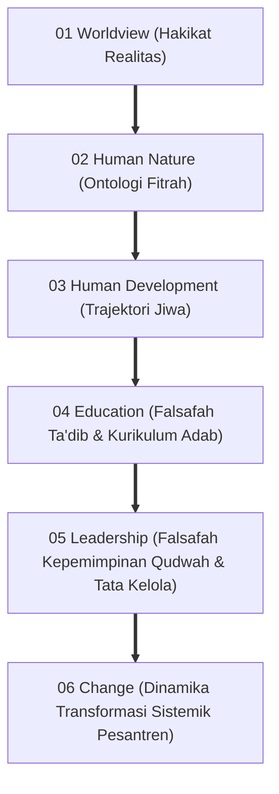
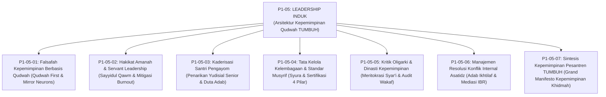
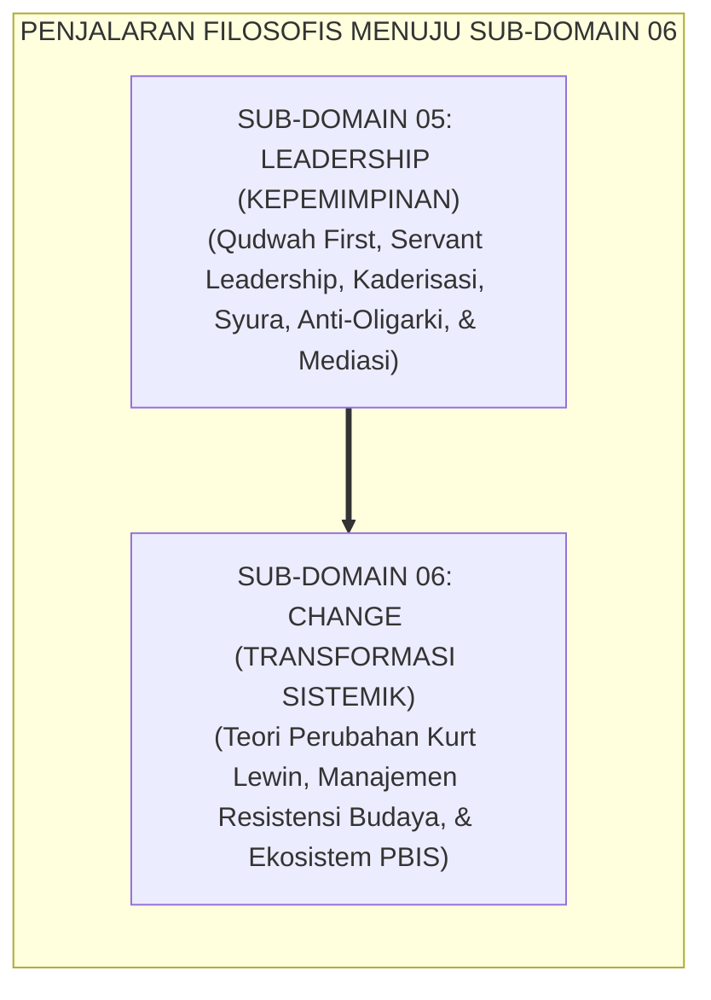

# P1-05: LEADERSHIP (FALSAFAH KEPEMIMPINAN QUDWAH & TATA KELOLA) EKOSISTEM TUMBUH
## *Monograf Induk Sub-Domain 05: Arsitektur Kepemimpinan Profetik Khidmah, Rekapitulasi 6 Pilar Leadership (Qudwah First, Servant Leadership, Kaderisasi Pengayom, Tata Kelola Syura, Anti-Oligarki, & Mediasi Sengketa), Matriks Standarisasi Musyrif, & Piagam Kelembagaan Kepemimpinan Pelayan Pesantren 24 Jam*

**Nomor Identifikasi**: `P1-05/MONOGRAF-INDUK-LEADERSHIP/2026`  
**Domain**: `01 Philosophy` > `05 Leadership`  
**Klasifikasi Naskah**: *Master Sub-Domain Monograph* (Monograf Induk Sub-Domain Filsafat Kepemimpinan & Tata Kelola)  
**Rumpun Disiplin Pengkaji**: Filsafat Kepemimpinan Islam (*al-Imamah wal-Qiyadah*), Servant Leadership Theory, Sosiologi Pesantren, Manajemen Tata Kelola Sumber Daya Manusia Pendidikan 24 Jam  

---

> ### 💡 INTISARI PRAKTIS (3 MENIT PAHAM UNTUK ASATIDZ & MUSYRIF)
>
> * **Posisi Sub-Domain 05 Leadership:**  
>   Menjawab pertanyaan mendasar keempat dalam ekosistem pendidikan Islam: *"Bagaimanakah kepemimpinan dan tata kelola kelembagaan pesantren dirancang agar seluruh asatidz memimpin dengan teladan nyata (Qudwah), melayani dengan ikhlas (Khidmah), mendidik santri tanpa kekerasan feodal, dan terlindungi dari kejenuhan kerja (Burnout)?"*
> * **Enam Pilar Kepemimpinan Ekosistem TUMBUH yang Terintegrasi:**  
>   1. **P1-05-01 (Qudwah First):** Menghapus kepemimpinan retorika kosong (*Kabura Maqtan*); memimpin dengan keteladanan amal shalih yang mengaktifkan sistem neuron cermin (*Mirror Neurons*) santri.  
>   2. **P1-05-02 (Servant Leadership):** Menegakkan doktrin kenabian *Sayyidul Qawmi Khadimuhum*, hisab amanah kepemimpinan akhirat (*Khizyun wa Nadamah*), dan mitigasi kelelahan emosional musyrif.  
>   3. **P1-05-03 (Kaderisasi Santri Pengayom):** Menarik 100% wewenang menghukum dari tangan santri senior, mentransformasikan OSIS menjadi Duta Adab (*Dewan Pelayan Santri*), dan kurikulum kaderisasi Tahap 7 Penggerak.  
>   4. **P1-05-04 (Tata Kelola Syura & Standar Musyrif):** Menerapkan manajemen berbasis syura yang transparan, standarisasi 4 pilar kompetensi musyrif, dan *Safe School Protocol*.  
>   5. **P1-05-05 (Kritik Oligarki Dinasti):** Menegakkan meritokrasi syar'i (*Al-Qawiyyul Amin*), menolak suksesi nepotisme tertutup, dan mengaudit aset wakaf.  
>   6. **P1-05-06 (Manajemen Resolusi Konflik):** Memfasilitasi mediasi IBR restoratif dan protokol tabayyun bagi asatidz guna mencegah faksionalisme.
> * **Komitmen Kelembagaan Anti-Feodalisme & Anti-Eksploitasi:**  
>   Dilarang keras menyalahgunakan kekuasaan untuk menindas bawahan, membebankan jam kerja 24 jam nonstop tanpa istirahat mingguan, atau melegalkan perpeloncoan fisik oleh senior.

---

## 📑 DAFTAR ISI MONOGRAF INDUK

- [BAGIAN I: ARSITEKTUR ONTOLOGIS & POHON HUBUNGAN SUB-DOMAIN 05](#bagian-i-arsitektur-ontologis--pohon-hubungan-sub-domain-05)
  - [1. Posisi Dokumen dalam Taksonomi 11 Domain TUMBUH](#1-posisi-dokumen-dalam-taksonomi-11-domain-tumbuh)
  - [2. Pohon Hubungan Antar-Monograf Sub-Domain 05 Leadership](#2-pohon-hubungan-antar-monograf-sub-domain-05-leadership)
  - [3. Rangkuman 6 Pilar Falsafah Kepemimpinan & Tata Kelola Ekosistem TUMBUH](#3-rangkuman-6-pilar-falsafah-kepemimpinan--tata-kelola-ekosistem-tumbuh)
  - [4. Matriks Komitmen Kelembagaan Kepemimpinan Qudwah (Zero Hypocrisy & Zero Exploitation Policy)](#4-matriks-komitmen-kelembagaan-kepemimpinan-qudwah-zero-hypocrisy--zero-exploitation-policy)
- [BAGIAN II: KODIFIKASI MATRIKS RESMI & DIREKTORI MONOGRAF TERPADU](#bagian-ii-kodifikasi-matriks-resmi--direktori-monograf-terpadu)
  - [1. Matriks Rujukan Lengkap 7 Berkas Monograf Sub-Domain 05](#1-matriks-rujukan-lengkap-7-berkas-monograf-sub-domain-05)
  - [2. Alur Penjalaran Filosofis Menuju Sub-Domain Lanjutan (P1-06 Change)](#2-alur-penjalaran-filosofis-menuju-sub-domain-lanjutan-p1-06-change)
- [BAGIAN III: APARATUS AKADEMIS & APENDIKS](#bagian-iii-aparatus-akademis--apendiks)
  - [1. Daftar Pustaka Otoritatif Turats & Sains Global](#1-daftar-pustaka-otoritatif-turats--sains-global)
  - [2. Catatan Kaki Akademis (Footnotes)](#2-catatan-kaki-akademis-footnotes)
  - [3. Glosarium Istilah Kunci Kepemimpinan Induk](#3-glosarium-istilah-kunci-kepemimpinan-induk)

---

# BAGIAN I: ARSITEKTUR ONTOLOGIS & POHON HUBUNGAN SUB-DOMAIN 05

---

### 1. Posisi Dokumen dalam Taksonomi 11 Domain TUMBUH

---

### 2. Pohon Hubungan Antar-Monograf Sub-Domain 05 Leadership

Sub-Domain `05 Leadership` memuat 1 Monograf Induk dan 7 Monograf Riset Khusus yang saling menopang secara utuh:

---

### 3. Rangkuman 6 Pilar Falsafah Kepemimpinan & Tata Kelola Ekosistem TUMBUH

1. **Pilar 1: Qudwah First & Keteladanan Otentik (P1-05-01)**:  
   Menegakkan kepemimpinan berbasis keteladanan nyata di garis depan. Pendidik mencontohkan ibadah di shaf pertama masjid, bertutur kata santun, dan menjaga kerapian sebelum menuntutnya dari santri. Mengaktifkan sistem neuron cermin (*Mirror Neurons*) biologis dan menghapus hipokrisi lisan (*Kabura Maqtan*).
2. **Pilar 2: Hakikat Amanah & Servant Leadership (P1-05-02)**:  
   Menghayati jabatan kepemimpinan sebagai beban amanah hisab akhirat (*Khizyun wa Nadamah*) yang dijalankan melalui pelayanan tulus (*Sayyidul Qawmi Khadimuhum*). Mengintegrasikan teori *Servant Leadership* Greenleaf dengan proteksi kesehatan mental musyrif asrama (*Mitigasi Burnout Maslach*) dan hak libur mingguan (*Mandatory Day-Off*).
3. **Pilar 3: Kaderisasi Santri Pengayom (P1-05-03)**:  
   Menarik mutlak 100% wewenang menghukum dan merazia fisik dari tangan santri senior. Mentransformasikan organisasi santri menjadi **Dewan Pelayan Duta Adab (*Khadim ath-Thullab*)** dan membekali santri senior Tahap 7 Penggerak dengan keterampilan mentoring sahabat sebaya (*Brotherhood Mentorship*).
4. **Pilar 4: Tata Kelola Kelembagaan Syura & Standar Musyrif (P1-05-04)**:  
   Mentransformasikan manajemen otokratis personal menjadi organisasi pembelajar berbasis sistem (*Syura & SOP*). Mewajibkan sertifikasi 4 pilar kompetensi musyrif asrama, menerapkan audit akuntabilitas keuangan wakaf secara independen, dan menegakkan protokol keselamatan santri (*Safe School Protocol*).
5. **Pilar 5: Meritokrasi Syar'i & Anti-Oligarki Dinasti (P1-05-05)**:  
   Membongkar praktik familisme amoral dan dinasti kepemimpinan tertutup. Menegakkan seleksi kepemimpinan terbuka berbasis kriteria *Al-Qawiyyul Amin* (QS. 28:26) dan memisahkan secara tegas antara aset wakaf umat dengan kekayaan pribadi pengurus.
6. **Pilar 6: Fiqh Ikhtilaf & Mediasi Resolusi Konflik Asatidz (P1-05-06)**:  
   Menerapkan etika perselisihan ilmiah (*Adabul Ikhtilaf* Imam Asy-Syafi'i), protokol Tabayyun 4 langkah, dan mediasi IBR restoratif guna mencegah faksionalisme dan permusuhan di ruang guru.[^1]

---

### 4. Matriks Komitmen Kelembagaan Kepemimpinan Qudwah (*Zero Hypocrisy & Zero Exploitation Policy*)

| Larangan Pelanggaran Tata Kelola | Praktik Konvensional yang Dihapus 100% | Alternatif Beradab dalam Ekosistem TUMBUH |
| :--- | :--- | :--- |
| **1. Hipokrisi Retorika Guru** | Guru melanggar aturan yang dibuatnya sendiri (merokok, telat shalat). | **Qudwah First**: Guru menjadi cermin teladan nomor satu dan meminta maaf jika khilaf.[^2] |
| **2. Otokrasi Manajemen Satu Figur** | Mengambil keputusan sepihak tanpa musyawarah dan tanpa SOP jelas. | **Tata Kelola Syura & SOP Baku**: Struktur organisasi transparan dan akuntabel. |
| **3. Eksploitasi Jam Kerja Musyrif** | Musyrif bertugas 24 jam nonstop tanpa libur dan digaji tidak layak. | **Sistem Shift & Hak Libur Mandatori**: Gaji standar memuliakan & mitigasi burnout.[^3] |
| **4. Delegasi Hukuman ke Senior** | Membiarkan santri senior menampar dan menyidang adik kelas di malam hari. | **Penarikan Wewenang Yudisial 100%**: Senior hanya bertindak sebagai Duta Adab & mentor.[^4] |
| **5. Suksesi Nepotisme Tertutup** | Menyerahkan jabatan mudir secara otomatis kepada anak/menantu tanpa kompetensi. | **Meritokrasi Syar'i (Al-Qawiyyul Amin)**: Seleksi terbuka berbasis ilmu & integritas. |

---

# BAGIAN II: KODIFIKASI MATRIKS RESMI & DIREKTORI MONOGRAF TERPADU

---

### 1. Matriks Rujukan Lengkap 7 Berkas Monograf Sub-Domain 05

| Kode Berkas | Judul Naskah Monograf | Dewan Keilmuan Pengkaji | Tautan Berkas Markdown |
| :---: | :--- | :--- | :---: |
| **P1-05-01** | **Falsafah Kepemimpinan Berbasis Qudwah** | `pakar-filosofi-tumbuh` `pakar-tata-kelola-qudwah` `pakar-neurosains-perkembangan` | [**`Buka Naskah P1-05-01`**](./P1-05-01-Falsafah-Kepemimpinan-Berbasis-Qudwah.md) |
| **P1-05-02** | **Hakikat Amanah dan Kepemimpinan Pelayan** | `pakar-tata-kelola-qudwah` `pakar-epistemologi-turats` `pakar-pengasuhan-asrama` | [**`Buka Naskah P1-05-02`**](./P1-05-02-Hakikat-Amanah-dan-Kepemimpinan-Pelayan.md) |
| **P1-05-03** | **Kaderisasi dan Kepemimpinan Santri Pengayom** | `pakar-psikologi-sosial-santri` `pakar-perlindungan-anak-dan-advokasi-santri` `pakar-arsitektur-pbis-restoratif` | [**`Buka Naskah P1-05-03`**](./P1-05-03-Kaderisasi-dan-Kepemimpinan-Santri.md) |
| **P1-05-04** | **Tata Kelola Kelembagaan dan Standar Musyrif** | `pakar-tata-kelola-qudwah` `pakar-metodologi-riset-tumbuh` `pakar-pengasuhan-asrama` | [**`Buka Naskah P1-05-04`**](./P1-05-04-Tata-Kelola-Kelembagaan-dan-Standar-Musyrif.md) |
| **P1-05-05** | **Kritik Oligarki & Dinasti Kepemimpinan** | `pakar-tata-kelola-qudwah` `pakar-epistemologi-turats` `pakar-kritikus-dan-auditor-kualitas` | [**`Buka Naskah P1-05-05`**](./P1-05-05-Kritik-Oligarki-dan-Dinasti-Kepemimpinan-Pesantren.md) |
| **P1-05-06** | **Manajemen Resolusi Konflik Asatidz** | `pakar-bimbingan-konseling` `pakar-kuratif-restoratif` `pakar-tata-kelola-qudwah` | [**`Buka Naskah P1-05-06`**](./P1-05-06-Manajemen-Resolusi-Konflik-Internal-Asatidz-dan-Syura.md) |
| **P1-05-07** | **Sintesis Falsafah Kepemimpinan TUMBUH** | `pakar-filosofi-tumbuh` `pakar-tata-kelola-qudwah` `pakar-metodologi-riset-tumbuh` | [**`Buka Naskah P1-05-07`**](./P1-05-07-Sintesis-Leadership-TUMBUH.md) |

---

### 2. Alur Penjalaran Filosofis Menuju Sub-Domain Lanjutan (`P1-06 Change`)

---

# BAGIAN III: APARATUS AKADEMIS & APENDIKS

---

### 1. Daftar Pustaka Otoritatif Turats & Sains Global

1. **Al-Qur'an al-Karim wa Tarjamatu Ma'anih**.
2. **Al-Bukhari, Muhammad bin Isma'il**. (1422 H). *Shahih al-Bukhari*. Beirut: Dar Thawq an-Najah.
3. **Muslim bin al-Hajjaj an-Naisaburi**. (1374 H). *Shahih Muslim*. Kairo: Isa al-Babi al-Halabi.
4. **Al-Mawardi, Ali bin Muhammad**. (1989). *Al-Ahkam as-Sulthaniyyah*. Beirut: Dar al-Kutub al-'Ilmiyyah.
5. **Ibnu Taimiyyah, Ahmad bin Abdul Halim**. (1998). *As-Siyasah asy-Syar'iyyah*. Beirut: Dar al-Kutub al-'Ilmiyyah.
6. **Al-Alwani, Thaha Jabir**. (1989). *Adab al-Ikhtilaf fil Islam*. IIIT.
7. **Greenleaf, R. K.**. (1977). *Servant Leadership*. New York: Paulist Press.
8. **Rizzolatti, G., & Craighero, L.**. (2004). *The mirror-neuron system*. Annual Review of Neuroscience, 27, 169–192.
9. **Maslach, C., Schaufeli, W. B., & Leiter, M. P.**. (2001). *Job burnout*. Annual Review of Psychology, 52(1), 397–422.
10. **Fisher, R., & Ury, W.**. (1981). *Getting to Yes*. Houghton Mifflin.

---

### 2. Catatan Kaki Akademis (*Footnotes*)

[^1]: Ibnu Taimiyyah, *As-Siyasah asy-Syar'iyyah*, hlm. 15–20.  
[^2]: Bandura, A. (1977), *Social Learning Theory*, Prentice-Hall.  
[^3]: Maslach & Leiter (2016), *Understanding the burnout experience*, World Psychiatry.  
[^4]: Steinberg, L. (2008), *A social neuroscience perspective on adolescent risk-taking*, Developmental Review.

---

### 3. Glosarium Istilah Kunci Kepemimpinan Induk

1. **Qudwah First**: Prinsip kepemimpinan di mana pemimpin wajib mempraktikkan amal adab pada dirinya sendiri sebelum menuntutnya dari orang lain.
2. **Servant Leadership**: Paradigma kepemimpinan pelayan di mana pemimpin mendedikasikan energinya untuk menumbuhkan orang yang dipimpinnya.
3. **Sayyidul Qawmi Khadimuhum**: Kaidah kenabian bahwa pemimpin kaum adalah pelayan sejati mereka.
4. **Meritokrasi Syar'i**: Sistem seleksi kepemimpinan terbuka berdasarkan kompetensi (*Al-Quwwah*) dan integritas (*Al-Amanah*).
5. **Adab al-Ikhtilaf**: Etika menyikapi perbedaan pendapat dengan tetap menjaga keutuhan ukhuwah dan kebersihan hati.
6. **Khadim ath-Thullab**: Formasi dewan pelayan santri yang menggantikan organisasi santri konvensional yang bercorak represif.
7. **Syura**: Musyawarah mufakat berbasis hikmah dan syariat dalam pengambilan keputusan strategis lembaga.
8. **Safe School Protocol**: Rangkaian regulasi yang menjamin perlindungan menyeluruh terhadap hak dan keselamatan santri di pesantren.
9. **Triad Pertumbuhan Simbiotik**: Maha-prinsip di mana kepemimpinan profetik secara serempak menumbuhkan Santri, memuliakan Pendidik, dan memperkokoh Lembaga.
