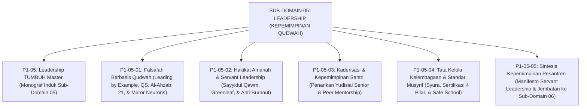

# SUB-DOMAIN 05: LEADERSHIP (KEPEMIMPINAN QUDWAH & TATA KELOLA)
## *Sitemap Induk & Navigasi Monograf Falsafah Keteladanan, Servant Leadership, Kaderisasi Pengayom, & Tata Kelola Kelembagaan Ekosistem TUMBUH*

**Nomor Identifikasi**: `P1-05/INDEX/2026`  
**Domain**: `01 Philosophy` > `05 Leadership`  
**Klasifikasi**: Folder Monograf Kepemimpinan Qudwah, Khidmah Pelayan, Peer Mentorship, & Tata Kelola Syura (6 Berkas Lengkap)

---

## 🏛️ SITEMAP & NAVIGASI SELURUH BERKAS SUB-DOMAIN 05

Sub-Domain `05 Leadership` membedah fondasi kepemimpinan berbasis keteladanan qudwah, pelayanan khidmah nabawi, transformasi organisasi santri menjadi pengayom, dan tata kelola kelembagaan pesantren yang akuntabel:

---

## 📑 DAFTAR LENGKAP 6 BERKAS MONOGRAF TERPADU SUB-DOMAIN 05

Seluruh modul telah distandarisasi 100% ke dalam format **Monograf Terpadu**:
* **💡 Intisari Praktis (3 Menit Paham)**: Panduan membumi untuk asatidz & musyrif sebelum daftar isi.
* **Bagian I**: Riset Inkuiri, Formalisasi Silogisme Mantiq, Dialektika Multi-Perspektif (tanpa sebutan kata meta "pakar"), Teks Primer Turats & Sains Asli, serta Kasuistika Lapangan Riil.
* **Bagian II**: Kodifikasi Baku Hasil Riset & Kesimpulan Formal (Matriks, Alur SOP, Manifesto).
* **Bagian III**: Aparatus Akademis (Tabel Sintesis, Daftar Pustaka Otoritatif, Catatan Kaki *Footnotes*, dan Glosarium Istilah Teknis).

| No | Berkas Monograf | Judul Berkas | Fokus Kajian & Rujukan Utama |
| :---: | :--- | :--- | :--- |
| **00** | [**`P1-05-Leadership-TUMBUH.md`**](./P1-05-Leadership-TUMBUH.md) | Monograf Induk Leadership TUMBUH | Master 4 Pilar Falsafah Kepemimpinan & Tata Kelola, Zero Hypocrisy & Zero Exploitation Policy, serta peta penjalaran menuju Sub-Domain [`06 Change`](../06%20Change/README.md). |
| **01** | [**`P1-05-01-Falsafah-Kepemimpinan-Berbasis-Qudwah.md`**](./P1-05-01-Falsafah-Kepemimpinan-Berbasis-Qudwah.md) | Falsafah Kepemimpinan Berbasis Qudwah | Prinsip *Qudwah First*, QS. Al-Ahzab: 21, QS. Ash-Shaff: 2–3, kecaman *Kabura Maqtan*, riset *Mirror Neuron System* Giacomo Rizzolatti, dan *Social Learning Theory* Albert Bandura (19 Catatan Kaki). |
| **02** | [**`P1-05-02-Hakikat-Amanah-dan-Kepemimpinan-Pelayan.md`**](./P1-05-02-Hakikat-Amanah-dan-Kepemimpinan-Pelayan.md) | Hakikat Amanah & Servant Leadership | Doktrin *Sayyidul Qawmi Khadimuhum*, hadits Abu Dzarr RA (*Khizyun wa Nadamah* HR. Muslim), teori *Servant Leadership* Robert K. Greenleaf (1977), & mitigasi kelelahan emosional *Burnout* Christina Maslach (19 Catatan Kaki). |
| **03** | [**`P1-05-03-Kaderisasi-dan-Kepemimpinan-Santri.md`**](./P1-05-03-Kaderisasi-dan-Kepemimpinan-Santri.md) | Kaderisasi & Kepemimpinan Santri Pengayom | Penarikan mutlak 100% hak menghukum senior, transformasi OSIS menjadi Duta Adab (*Khadim ath-Thullab*), kurikulum kaderisasi Tahap 7 Penggerak, & *Brotherhood Mentoring* (15 Catatan Kaki). |
| **04** | [**`P1-05-04-Tata-Kelola-Kelembagaan-dan-Standar-Musyrif.md`**](./P1-05-04-Tata-Kelola-Kelembagaan-dan-Standar-Musyrif.md) | Tata Kelola Kelembagaan & Standar Musyrif | Prinsip Syura (QS. Asy-Syura: 38), kriteria *Al-Quwwah wal-Amanah* (QS. Al-Qashash: 26), standarisasi 4 pilar kompetensi musyrif, transparansi audit keuangan wakaf, & *Safe School Protocol* (11 Catatan Kaki). |
| **05** | [**`P1-05-05-Sintesis-Leadership-TUMBUH.md`**](./P1-05-05-Sintesis-Leadership-TUMBUH.md) | Sintesis Kepemimpinan Pesantren TUMBUH | Matriks komparasi vs Feodalisme Patriarkal & Korporatis Sekuler, Manifesto Kelembagaan Kepemimpinan Khidmah Pesantren, & jembatan epistemologis menuju Sub-Domain `06 Change` (9 Catatan Kaki). |
