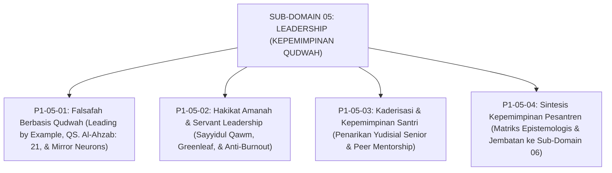

# SUB-DOMAIN 05: LEADERSHIP (KEPEMIMPINAN QUDWAH & TATA KELOLA)
## *Sitemap Induk & Navigasi Monograf Falsafah Keteladanan, Servant Leadership, & Kaderisasi Santri*

**Nomor Identifikasi**: `P1-05/INDEX/2026`  
**Domain**: `01 Philosophy` > `05 Leadership`  
**Klasifikasi**: Folder Monograf Kepemimpinan Qudwah, Khidmah Pelayan, & Peer Mentorship

---

## 🏛️ SITEMAP & NAVIGASI SELURUH BERKAS SUB-DOMAIN 05

Sub-Domain `05 Leadership` membedah fondasi kepemimpinan berbasis keteladanan qudwah, pelayanan khidmah nabawi, dan transformasi organisasi santri senior menjadi pengayom:

---

## 📑 DAFTAR BERKAS MODULAR SUB-DOMAIN 05

| No | Berkas Monograf | Judul Berkas | Fokus Kajian & Rujukan Utama |
| :---: | :--- | :--- | :--- |
| **01** | [**`P1-05-01-Falsafah-Kepemimpinan-Berbasis-Qudwah.md`**](./P1-05-01-Falsafah-Kepemimpinan-Berbasis-Qudwah.md) | Falsafah Kepemimpinan Berbasis Qudwah | Prinsip *Qudwah First*, QS. Al-Ahzab: 21, QS. Al-Baqarah: 44, hadits akhlak Al-Qur'an, dan riset *Mirror Neuron System* Giacomo Rizzolatti. |
| **02** | [**`P1-05-02-Hakikat-Amanah-dan-Kepemimpinan-Pelayan.md`**](./P1-05-02-Hakikat-Amanah-dan-Kepemimpinan-Pelayan.md) | Hakikat Amanah & Servant Leadership | Doktrin *Sayyidul Qawmi Khadimuhum*, hadits Abu Dzarr (HR. Muslim), teori *Servant Leadership* Robert K. Greenleaf, & mitigasi burnout musyrif. |
| **03** | [**`P1-05-03-Kaderisasi-dan-Kepemimpinan-Santri.md`**](./P1-05-03-Kaderisasi-dan-Kepemimpinan-Santri.md) | Kaderisasi & Kepemimpinan Santri Pengayom | Penarikan wewenang yudisial/hukuman senior, transformasi OSIS menjadi Duta Adab, kurikulum kaderisasi Tahap 7 Penggerak, & *Brotherhood Mentoring*. |
| **04** | [**`P1-05-04-Sintesis-Leadership-TUMBUH.md`**](./P1-05-04-Sintesis-Leadership-TUMBUH.md) | Sintesis Filosofis Kepemimpinan Pesantren | Matriks integrasi 3 pilar kepemimpinan, piagam kepemimpinan qudwah pesantren, dan jembatan menuju Sub-Domain `06 Change`. |
