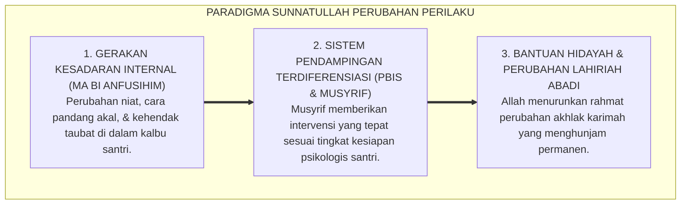
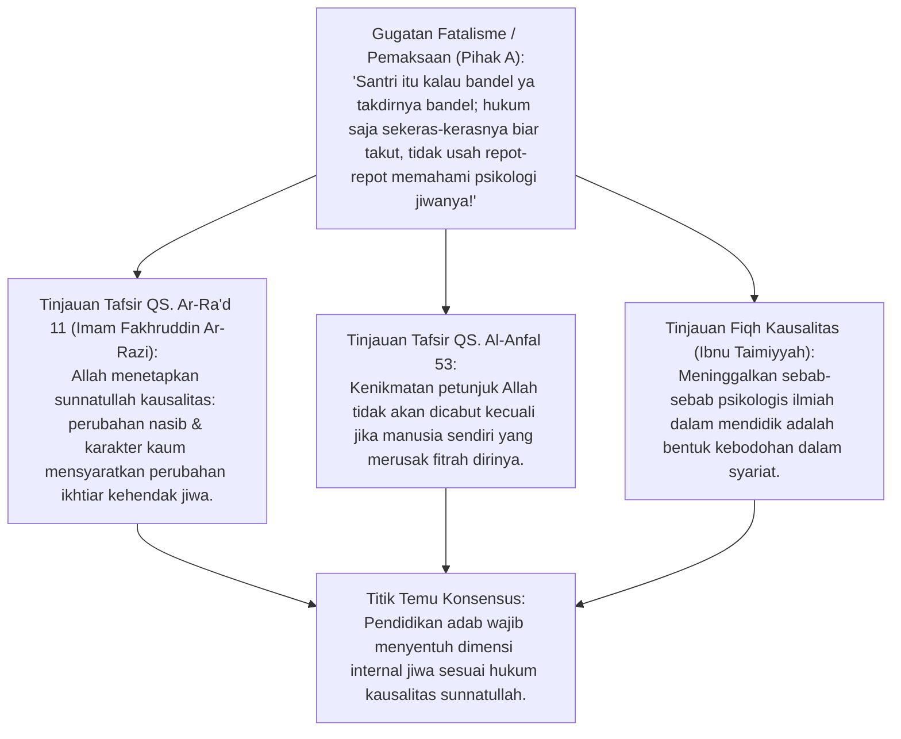
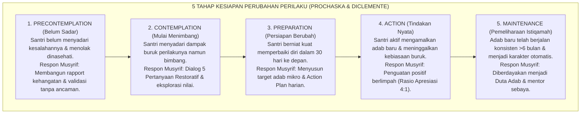
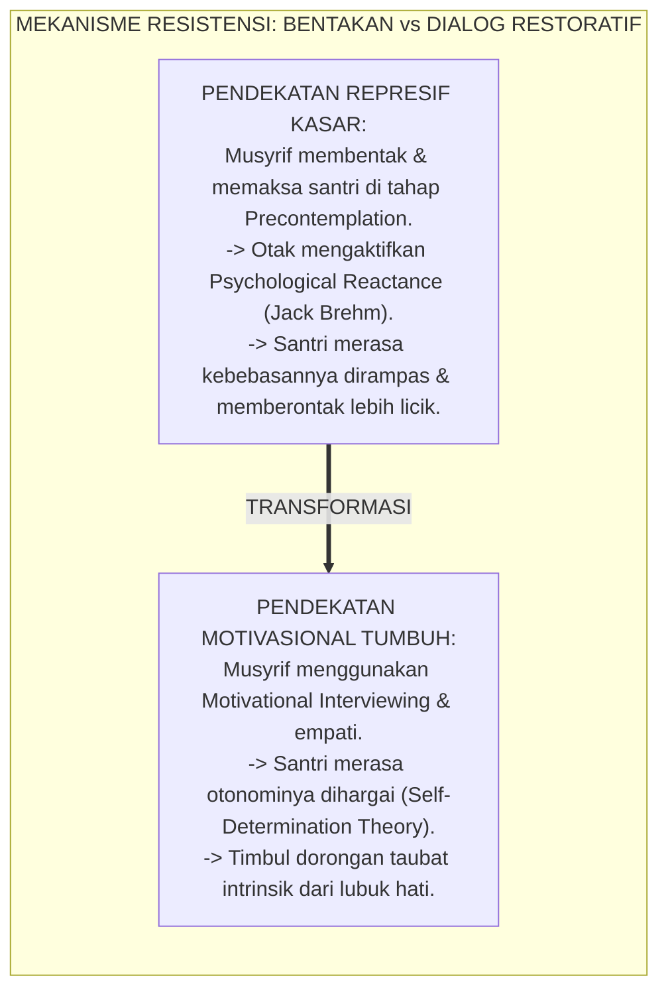
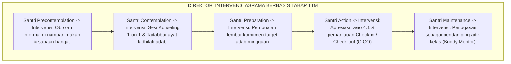
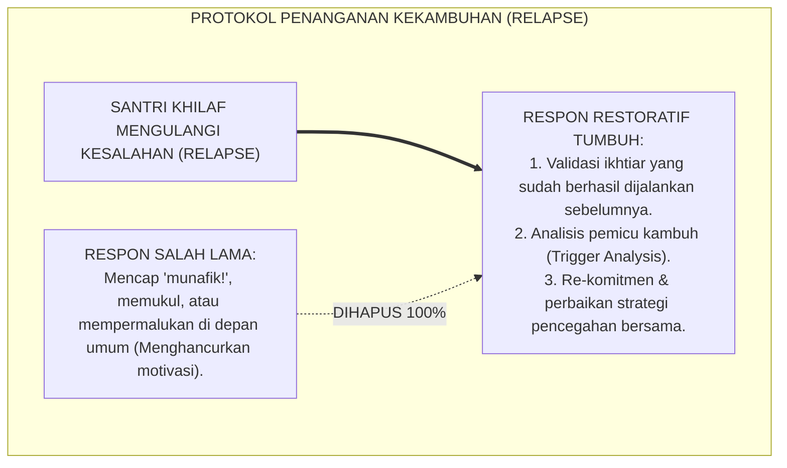
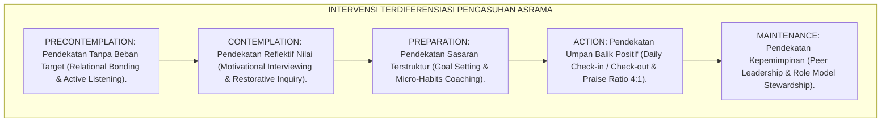
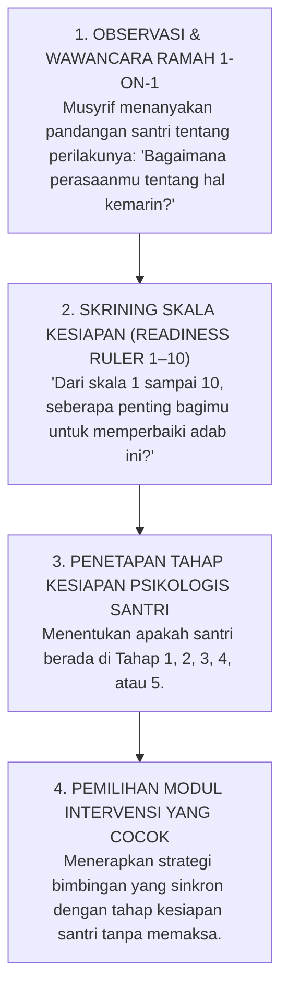

# P1-06-01: SUNNATULLAH PERUBAHAN JIWA DAN PERILAKU SANTRI
## *Monograf Terpadu: Hukum Kausalitas Perubahan Transendental dalam Turats (QS. Ar-Ra'd: 11 & Tafsir Mafatih al-Ghaib Ar-Razi), Konvergensi Transtheoretical Model (TTM) Stages of Change Prochaska & DiClemente, Mitigasi Resistensi Psikologis Santri (Psychological Reactance), serta Diferensiasi Pendampingan Berbasis Kesiapan Jiwa 24 Jam*

**Nomor Identifikasi**: `P1-06-01/MONOGRAF-TERPADU-SUNNATULLAH-PERUBAHAN/2026`  
**Domain**: `01 Philosophy` > `06 Change`  
**Klasifikasi Naskah**: *Comprehensive Integrated Monograph* (Monograf Akademis & Rumusan Baku Terpadu)  
**Rumpun Disiplin Pengkaji**: Epistemologi Hukum Perubahan Sosial-Spiritual (*Sunnatullah at-Taghyir*), Psikologi Perubahan Perilaku (*Behavior Change Psychology*), Motivasi Transformatif Santri, Tata Kelola Intervensi Diferensiasi Asrama  

---

> ### 💡 INTISARI PRAKTIS (3 MENIT PAHAM UNTUK ASATIDZ & MUSYRIF)
>
> * **Perubahan Perilaku Santri Dimulai dari Gerakan Jiwa Internal (*Ma bi Anfusihim*):**  
>   Al-Qur'an (QS. Ar-Ra'd: 11) menetapkan hukum pasti: *"Sesungguhnya Allah tidak akan mengubah keadaan suatu kaum sampai mereka mengubah apa yang ada pada diri mereka sendiri"*. Memaksa santri dengan kekerasan fisik hanya menghasilkan perubahan topeng lahiriah sesaat. Perubahan sejati dan abadi baru terjadi ketika kesadaran niat dan cara pandang kalbu santri berhasil disentuh.
> * **Lima Tahap Kesiapan Berubah Santri (Transtheoretical Model Prochaska):**  
>   1. **Precontemplation (Belum Sadar):** Santri merasa tidak punya masalah dan menolak dinasehati $\rightarrow$ *Pendekatan*: Bangun kedekatan emosional tanpa menghakimi.  
>   2. **Contemplation (Mulai Bimbang):** Santri menyadari perbuatannya salah tapi masih ragu untuk berubah $\rightarrow$ *Pendekatan*: Dialog reflektif 5 pertanyaan restoratif.  
>   3. **Preparation (Siap Berubah):** Santri meminta bimbingan dan berniat memperbaiki diri $\rightarrow$ *Pendekatan*: Buat kontrak target adab kecil yang realistis.  
>   4. **Action (Melakukan Tindakan):** Santri aktif mempraktikkan adab baru $\rightarrow$ *Pendekatan*: Berikan apresiasi verbal melimpah (Rasio 4:1).  
>   5. **Maintenance (Menjaga Istiqamah):** Pembiasaan adab telah berlangsung >6 bulan $\rightarrow$ *Pendekatan*: Jadikan santri mentor bagi temannya.
> * **Jangan Menghakimi Santri yang Mengalami Kekambuhan (*Relapse*):**  
>   Perubahan bukanlah garis lurus yang mulus, melainkan proses spiral. Jika santri yang sedang berikhtiar baik sesekali khilaf kembali melanggar, musyrif membimbingnya untuk bangkit kembali (*Forgive and Reset*), bukan mencapnya sebagai anak munafik atau putus asa.

---

## 📑 DAFTAR ISI MONOGRAF

- [BAGIAN I: RISET DOKTRIN SUNNATULLAH PERUBAHAN JIWA, DIALEKTIKA INKUIRI, & KASUISTIKA LAPANGAN](#bagian-i-riset-doktrin-sunnatullah-perubahan-jiwa-dialektika-inkuiri--kasuistika-lapangan)
  - [1. Kerangka Metodologi Hukum Kausalitas Perubahan Insan: Sunnatullah at-Taghyir](#1-kerangka-metodologi-hukum-kausalitas-perubahan-insan-sunnatullah-at-taghyir)
  - [2. Inkuiri 1: Eksegesis Turats QS. Ar-Ra'd: 11 & QS. Al-Anfal: 53 — Tafsir Mafatih al-Ghaib Ar-Razi mengenai Inisiatif Internal Jiwa (Ma bi Anfusihim)](#2-inkuiri-1-eksegesis-turats-qs-ar-rad-11--qs-al-anfal-53--tafsir-mafatih-al-ghaib-ar-razi-mengenai-inisiatif-internal-jiwa-ma-bi-anfusihim)
  - [3. Inkuiri 2: Konvergensi Transtheoretical Model (TTM) Stages of Change Prochaska & DiClemente (5 Tahap Kesiapan Jiwa)](#3-inkuiri-2-konvergensi-transtheoretical-model-ttm-stages-of-change-prochaska--diclemente-5-tahap-kesiapan-jiwa)
  - [4. Inkuiri 3: Dialektika Mengatasi Resistensi Perilaku Santri: Mengapa Pendekatan Represif Memicu Psychological Reactance](#4-inkuiri-3-dialektika-mengatasi-resistensi-perilaku-santri-mengapa-pendekatan-represif-memicu-psychological-reactance)
  - [5. Inkuiri 4: Strategi Intervensi Terdiferensiasi Berbasis Tahap Kesiapan Berubah Santri di Asrama](#5-inkuiri-4-strategi-intervensi-terdiferensiasi-berbasis-tahap-kesiapan-berubah-santri-di-asrama)
  - [6. Inkuiri 5: Penanganan Fase Kekambuhan (Relapse Management) Tanpa Stigmatisasi Moral](#6-inkuiri-5-penanganan-fase-kekambuhan-relapse-management-tanpa-stigmatisasi-moral)
  - [7. Inkuiri 6: Silogisme Logika, Dialektika 3 Ronde, Kasuistika Perubahan Riil, & Titik Temu Konsensus](#7-inkuiri-6-silogisme-logika-dialektika-3-ronde-kasuistika-perubahan-riil--titik-temu-konsensus)
- [BAGIAN II: TEMUAN RISET, FORMULASI KONSEPTUAL & PEMBAHASAN](#bagian-ii-temuan-riset-formulasi-konseptual--pembahasan)
  - [1. Formulasi Konseptual: Hukum Kausalitas Perubahan Jiwa dan Perilaku TUMBUH](#1-formulasi-konseptual-hukum-kausalitas-perubahan-jiwa-dan-perilaku-tumbuh)
  - [2. Matriks 5 Tahap Kesiapan Berubah (TTM Prochaska) vs Pendekatan Pembinaan Musyrif](#2-matriks-5-tahap-kesiapan-berubah-ttm-prochaska-vs-pendekatan-pembinaan-musyrif)
  - [3. Matriks Diferensiasi Intervensi Perilaku Berdasarkan Kesiapan Jiwa Santri](#3-matriks-diferensiasi-intervensi-perilaku-berdasarkan-kesiapan-jiwa-santri)
  - [4. Protokol Diagnosis Kesiapan Berubah Santri (Readiness to Change Diagnostic Protocol)](#4-protokol-diagnosis-kesiapan-berubah-santri-readiness-to-change-diagnostic-protocol)
- [BAGIAN III: APARATUS AKADEMIS & APENDIKS](#bagian-iii-aparatus-akademis--apendiks)
  - [1. Tabel Sintesis Hasil Riset Sunnatullah Perubahan Jiwa](#1-tabel-sintesis-hasil-riset-sunnatullah-perubahan-jiwa)
  - [2. Daftar Pustaka Akademis & Rujukan Turats Primer](#2-daftar-pustaka-akademis--rujukan-turats-primer)
  - [3. Catatan Kaki Akademis (Footnotes)](#3-catatan-kaki-akademis-footnotes)
  - [4. Glosarium dan Penjelasan Istilah Teknis Sunnatullah Perubahan & Psikologi Perilaku](#4-glosarium-dan-penjelasan-istilah-teknis-sunnatullah-perubahan--psikologi-perilaku)

---

# BAGIAN I: RISET DOKTRIN SUNNATULLAH PERUBAHAN JIWA, DIALEKTIKA INKUIRI, & KASUISTIKA LAPANGAN

---

### 1. Kerangka Metodologi Hukum Kausalitas Perubahan Insan: *Sunnatullah at-Taghyir*

Banyak pendidik dan musyrif asrama terjebak dalam **Ilusi Perubahan Instan (*The Illusion of Instant Coercion*)**: meyakini bahwa dengan satu kali bentakan keras, ancaman cambuk, atau razia mendadak, perilaku santri yang menyimpang akan langsung berubah menjadi shalih secara permanen.

Fakta lapangan dan sains perilaku membuktikan hal sebaliknya:
* Pemaksaan lahiriah tanpa penyadaran batin hanya melahirkan **Kepatuhan Kamuflase (*Camouflage Compliance*)**: santri berlaku tertib di depan mata musyrif, namun melakukan pelanggaran yang jauh lebih berat di tempat tersembunyi.
* Otak manusia menolak perubahan yang dipaksakan secara kasar karena memicu mekanisme pertahanan diri biologis (*Psychological Reactance*).
* Hukum Ilahi (*Sunnatullah*) menetapkan bahwa transformasi peradaban dan karakter adalah proses kausalitas bertahap yang berakar pada keputusan sadar di kedalaman jiwa (*Taghyiru Ma bi Anfusihim*).

Ekosistem TUMBUH menegakkan doktrin **Sunnatullah Perubahan Jiwa Berbasis Kesiapan Nurani**:

---

### 2. Inkuiri 1: Eksegesis Turats QS. Ar-Ra'd: 11 & QS. Al-Anfal: 53 — Tafsir *Mafatih al-Ghaib* Ar-Razi mengenai Inisiatif Internal Jiwa (*Ma bi Anfusihim*)

#### 📐 Formalisasi Logika Silogisme (*Qiyas Mantiqi 1*)
* **Premis Mayor (*al-Muqaddimah al-Kubra*)**: Setiap transformasi karakter dan peradaban yang dijanjikan oleh Allah SWT niscaya beroperasi melalui hukum sebab-akibat (*Sunnatullah*) yang menuntut adanya inisiatif perubahan pada cara berpikir dan kehendak di dalam jiwa manusia itu sendiri.
* **Premis Minor (*al-Muqaddimah ash-Shughra*)**: Al-Qur'an secara qath'i menegaskan bahwa Allah tidak akan mengubah keadaan suatu kaum hingga mereka berikhtiar mengubah apa yang ada pada diri jiwa mereka sendiri (QS. Ar-Ra'd: 11).
* **Konklusi (*an-Natijah*)**: Maka, seluruh strategi pembinaan disiplin dan karakter di pesantren TUMBUH wajib diarahkan untuk membangkitkan kesadaran otonom di dalam jiwa santri, bukan sekadar memaksakan kepatuhan jasmani luar.[^1]

#### 📖 Teks Primer Al-Qur'an & Tafsir Klasik
Allah SWT berfirman mengenai undang-undang perubahan:

$$\text{إِنَّ اللَّهَ لَا يُغَيِّرُ مَا بِقَوْمٍ حَتَّىٰ يُغَيِّرُوا مَا بِأَنفُسِهِمْ ۗ وَإِذَا أَرَادَ اللَّهُ بِقَوْمٍ سُوءًا فَلَا مَرَدَّ لَهُ ۚ وَمَا لَهُم مِّن دُونِهِ مِن وَالٍ}$$

*"Sesungguhnya Allah tidak akan mengubah keadaan suatu kaum **sebelum mereka mengubah keadaan diri mereka sendiri**. Dan apabila Allah menghendaki keburukan terhadap suatu kaum, maka tak ada yang dapat menolaknya dan tidak ada pelindung bagi mereka selain Dia."* (QS. Ar-Ra'd [13]: 11).[^2]

Dan Allah SWT menegaskan kembali dalam Surah Al-Anfal:
$$\text{ذَٰلِكَ بِأَنَّ اللَّهَ لَمْ يَكُ مُغَيِّرًا نِّعْمَةً أَنْعَمَهَا عَلَىٰ قَوْمٍ حَتَّىٰ يُغَيِّرُوا مَا بِأَنفُسِهِمْ ۙ وَأَنَّ اللَّهَ سَمِيعٌ عَلِيمٌ}$$
*"Yang demikian itu adalah karena sesungguhnya **Allah tidak akan mengubah suatu nikmat yang telah dianugerahkan-Nya kepada suatu kaum, hingga kaum itu mengubah apa-apa yang ada pada diri mereka sendiri**; dan sesungguhnya Allah Maha Mendengar lagi Maha Mengetahui."* (QS. Al-Anfal [8]: 53).[^3]

Imam Fakhruddin Ar-Razi (w. 606 H) dalam kitab tafsir monumentalnya *Mafatih al-Ghaib* menjelaskan makna ayat ini secara mendalam:

> *"Ayat ini menetapkan pokok kaidah teologis agung: Bahwa hukum Allah (*Sunnatullah*) yang berlaku pada hamba-hamba-Nya adalah bahwa Dia tidak mengubah limpahan taufik, penjagaan, dan kemuliaan dari suatu kaum sebelum kaum tersebut mengubah kesucian niat, ketaatan, dan kehendak ikhtiar di dalam jiwa mereka (*Hatta Yughayyiru Ma bi Anfusihim*)... Perubahan luar (*at-Taghyir azh-Zhahir*) adalah buah tak terpisahkan dari perubahan batin (*at-Taghyir al-Bathin*). Barangsiapa menginginkan perbaikan akhlak generasinya tanpa memperbaiki cara berpikir dan kebersihan kalbu mereka, ia telah menentang sunnatullah kausalitas."* (Ar-Razi, *Tafsir Mafatih al-Ghaib*, Jilid XIX, hlm. 21–24).[^4]

---

### 3. Inkuiri 2: Konvergensi *Transtheoretical Model (TTM) Stages of Change* James Prochaska & Carlo DiClemente (5 Tahap Kesiapan Jiwa)

#### 📐 Formalisasi Logika Silogisme (*Qiyas Mantiqi 2*)
* **Premis Mayor (*al-Muqaddimah al-Kubra*)**: Setiap intervensi pendidikan yang diselaraskan secara presisi dengan tingkat kesiapan psikologis pembelajar niscaya melipatgandakan peluang keberhasilan perubahan perilaku dan meminimalkan resistensi reaktif.
* **Premis Minor (*al-Muqaddimah ash-Shughra*)**: Teori *Transtheoretical Model (TTM)* James Prochaska membuktikan secara ilmiah bahwa manusia bertransisi melalui 5 tahapan kesiapan kognitif dan motivasional sebelum mengadopsi kebiasaan baru secara permanen.
* **Konklusi (*an-Natijah*)**: Maka, para musyrif dan asatidz di pesantren TUMBUH wajib mendiagnosis tahap kesiapan santri sebelum merumuskan pendekatan bimbingan adab.[^5]

#### 📖 Teks Sains Internasional: Riset Prof. James Prochaska & Carlo DiClemente (1983, 1992)
Dalam publikasi monumental di *American Psychologist*, Prochaska & DiClemente merumuskan model tahapan perubahan:

> *"Behavior change is not a single, discrete event, but a developmental process that unfolds through a series of stages:  
> 1. **Precontemplation**: Individuals do not intend to take action in the foreseeable future, often because they are uninformed or underinformed about the consequences of their behavior.  
> 2. **Contemplation**: Individuals intend to change within the next six months; they are deeply aware of the pros of changing, but also acutely aware of the cons (chronic ambivalence).  
> 3. **Preparation**: Individuals intend to take immediate action and have typically taken some significant steps in the past year.  
> 4. **Action**: Individuals have made specific, overt modifications in their lifestyles.  
> 5. **Maintenance**: Individuals work to prevent relapse and consolidate the gains attained during action... **Mismatching interventions to a person's stage of readiness creates resistance and guarantees intervention failure**."* (Prochaska, DiClemente, & Norcross, 1992, *In Search of How People Change*, American Psychologist).[^6]

---

### 4. Inkuiri 3: Dialektika Mengatasi Resistensi Perilaku Santri: Mengapa Pendekatan Represif Memicu *Psychological Reactance*

#### 📐 Formalisasi Logika Silogisme (*Qiyas Mantiqi 3*)
* **Premis Mayor (*al-Muqaddimah al-Kubra*)**: Setiap pemaksaan kehendak secara represif yang mengancam rasa otonomi pribadi manusia niscaya memicu reaksi penolakan defensif (*Reactivity*) yang memperkokoh perilaku menyimpang.
* **Premis Minor (*al-Muqaddimah ash-Shughra*)**: Teori *Psychological Reactance* (Jack Brehm) dan *Self-Determination Theory* (Deci & Ryan) membuktikan bahwa remaja akan melawan balik jika merasa hak otonomi moralnya diinjak-injak dengan kekerasan.
* **Konklusi (*an-Natijah*)**: Maka, musyrif dilarang menggunakan intimidasi verbal/fisik terhadap santri yang sedang berada pada fase penolakan (*Precontemplation*).[^7]

---

### 5. Inkuiri 4: Strategi Intervensi Terdiferensiasi Berbasis Tahap Kesiapan Berubah Santri di Asrama

---

### 6. Inkuiri 5: Penanganan Fase Kekambuhan (*Relapse Management*) Tanpa Stigmatisasi Moral

#### 📐 Formalisasi Logika Silogisme (*Qiyas Mantiqi 5*)
* **Premis Mayor (*al-Muqaddimah al-Kubra*)**: Setiap pendidik yang memahami fitrah manusia menyadari bahwa proses taubat dan penyucian jiwa (*Tazkiyah*) kerap diuji oleh kelemahan sesaat, sehingga seorang pembelajar yang terpeleset wajib ditolong untuk bangkit kembali, bukan dicampakkan.
* **Premis Minor (*al-Muqaddimah ash-Shughra*)**: Hadits Rasulullah SAW menegaskan bahwa setiap anak Adam pasti pernah berbuat salah, dan sebaik-baik orang yang berbuat salah adalah mereka yang bertaubat (*Kullu Bani Adama Khaththa'* - HR. At-Tirmidzi).
* **Konklusi (*an-Natijah*)**: Maka, terjadinya kekambuhan pelanggaran (*Relapse*) disikapi sebagai bahan evaluasi klinis pedagogis, bukan alasan untuk memberikan vonis penghancuran moral.[^8]

---

### 7. Inkuiri 6: Silogisme Logika, Dialektika 3 Ronde, Kasuistika Perubahan Riil, & Titik Temu Konsensus

#### 🥊 Ronde 1: Menolak Anggapan Bahwa "Santri Nakal Itu Tidak Punya Harapan Berubah"
* **Pihak A (Sudut Pandang Fatalisme Pesimis)**:  
  *"Santri ini dari sananya sudah keras kepala dan nakal; diberi nasehat apa pun tidak mempan. Lebih baik dikeluarkan saja daripada merusak yang lain!"*
* **Tinjauan Sudut Pandang Doktrin Kemurnian Fitrah & Neuroplastisitas Otak**:  
  Tidak ada santri yang ditakdirkan abadi menjadi penjahat. Setiap anak terlahir di atas fitrah suci. Otak remaja memiliki kapasitas perubahan plastisitas (*Neuroplasticity*) yang sangat lentur. Santri menolak bukan karena tidak bisa berubah, melainkan karena musyrif salah memilih metode intervensi yang tidak cocok dengan tahap kesiapan mentalnya.[^9]

#### 🥊 Ronde 2: Sanggahan Balik Apakah Menyesuaikan Tahap Kesiapan Santri Berarti Kompromi dengan Pelanggaran?
* **Pihak A (Sudut Pandang Kekakuan Syariat)**:  
  *"Kalau kita maklumi santri yang di tahap Precontemplation, berarti kita berkompromi dengan dosa dan membiarkan aturan pondok dilanggar!"*
* **Tinjauan Sudut Pandang Kebijaksanaan Dakwah Bertahap (*Al-Hikmah fit-Tadarruj*)**:  
  Menyesuaikan tahap intervensi **bukan berarti membenarkan perbuatan dosa**. Aturan tetap ditegakkan (*Firm*), namun pendekatan komunikasinya disesuaikan dengan bahasa kasih sayang (*Kind*). Rasulullah SAW tidak langsung memerintahkan hukum-hukum berat pada fase awal dakwah Makkah, melainkan mematangkan akidah dan kesiapan jiwa terlebih dahulu.[^10]

#### 🥊 Ronde 3: Sanggahan Pamungkas Mengapa Mempermalukan Santri di Depan Umum Mematikan Pintu Taubat?
* **Pihak A (Sudut Pandang Efek Jera Sosial Publik)**:  
  *"Umumkan namanya di pengeras suara masjid dan pasang fotonya di papan aib biar dia malu dan kapok!"*
* **Resolusi Sudut Pandang Fiqh Menutup Aib (*Satrul 'Aurah*) & Trauma Sosial**:  
  Mempermalukan anak di depan publik memicu **Kerusakan Harga Diri (*Toxic Shame*)**. Santri akan merasa dirinya dicap sampah masyarakat, yang justru mendorongnya bergabung dengan geng kenakalan yang menerima dirinya apa adanya. Rasulullah SAW secara tegas melarang membongkar aib saudara muslim dan mencontohkan teguran umum tanpa menyebut nama (*Ma balu aqwamin...*).[^11]

> #### 📌 Kasuistika Lapangan & Titik Temu Konsensus
> * **Studi Kasus**: Santri C (kelas 8) tertangkap merokok sembunyi-sembunyi di belakang asrama untuk ketiga kalinya; musyrif lama hendak menggantungkan bungkus rokok di lehernya dan mengaraknya keliling asrama.
> * **Titik Temu Konsensus (*Kalimatun Sawa'*)**: Tindakan arak publik dibatalkan total. Musyrif PBIS mendiagnosis Santri C berada di tahap *Contemplation* (merokok karena pelarian dari tekanan broken home orang tuanya). Dilakukan sesi konseling mendalam, fasilitasi penyaluran emosi lewat olahraga basket, dan kontrak komitmen berhenti bertahap dengan bimbingan dokter pondok. Dalam 2 bulan, Santri C bersih total dari rokok dan menjadi ketua tim kebersihan asrama.[^12]

---

# BAGIAN II: TEMUAN RISET, FORMULASI KONSEPTUAL & PEMBAHASAN

---

### 1. Formulasi Konseptual: Hukum Kausalitas Perubahan Jiwa dan Perilaku TUMBUH

Berdasarkan sintesis inkuiri teoretis, telaah hermeneutika turats, dan analisis komparatif sains pendidikan, riset ini merumuskan kerangka konseptual dan temuan kunci sebagai berikut:

1. **Poros Utama Perubahan Dari Dalam Jiwa (MA BI Anfusihim)**:  
   Perubahan karakter dan adab santri yang sejati berakar pada kehendak sadar di kedalaman nurani. Menolak segala bentuk ilusi pemaksaan perubahan instan melalui teror fisik atau rasa malu publik.

2. **Penerapan Model Tahapan Perubahan Kognitif (transtheoretical Stages OF Change)**:  
   Musyrif dan asatidz wajib memperlakukan perubahan santri sebagai proses perkembangan bertahap (TTM): Precontemplation, Contemplation, Preparation, Action, dan Maintenance. Pendekatan bimbingan wajib diselaraskan secara presisi dengan tingkat kesiapan psikologis santri yang bersangkutan.

3. **HAK Perlindungan Dari Stigmatisasi Moral & Manajemen Kekambuhan (relapse)**:  
   Setiap santri yang mengalami kekambuhan khilaf berhak mendapatkan pendampingan pemulihan klinis tanpa dicap buruk atau divonis putus asa. Kesalahan diposisikan sebagai momentum evaluasi belajar adab.

4. **Keharaman Papan AIB DAN Hukuman Mempermalukan Publik (zero Public Shaming)**:  
   Mengharamkan 100% segala bentuk pengumuman aib pelanggaran, penggantungan kalung penghinaan, atau tindakan mempermalukan santri di depan umum yang merusak martabat fitrah kemanusiaannya.

---

### 2. Matriks 5 Tahap Kesiapan Berubah (TTM Prochaska) vs Pendekatan Pembinaan Musyrif

| Tahap Kesiapan Santri | Karakteristik Sikap Santri | Fokus Pendekatan Musyrif Asrama | Indikator Keberhasilan Tahap |
| :--- | :--- | :--- | :--- |
| **1. Precontemplation** *(Belum Sadar)* | Menyangkal masalah, defensif, menganggap aturan terlalu ketat. | **Rapport & Validasi**: Membangun kehangatan hubungan, mendengarkan tanpa menghakimi.[^13] | Santri mau berbicara jujur dan mempercayai musyrif. |
| **2. Contemplation** *(Mulai Menimbang)* | Mengakui kesalahan di dalam hati, namun merasa sulit berubah. | **Dialog 5 Pertanyaan Restoratif**: Mengajak santri menimbang dampak buruk perbuatannya. | Santri menyatakan keinginan tulus untuk memperbaiki diri. |
| **3. Preparation** *(Persiapan Berubah)* | Meminta bantuan, siap membuat rencana perbaikan nyata. | **Action Planning**: Merumuskan target adab mikro harian dan konsekuensi logis 4R. | Tersusunnya lembar kontrak komitmen adab tertulis. |
| **4. Action** *(Tindakan Aktif)* | Aktif mengamalkan kebiasaan baru dan menjauhi pemicu salah. | **Positive Reinforcement**: Memberikan apresiasi lisan tulus berlimpah (Rasio 4:1).[^14] | Konsistensi adab baru berjalan stabil selama 30–90 hari. |
| **5. Maintenance** *(Pemeliharaan)* | Adab baru telah menjadi bagian identitas otomatis santri. | **Empowerment**: Memberdayakan santri menjadi Duta Adab bagi teman sebayanya. | Mampu membimbing santri lain tanpa kembali pada kesalahan lama.[^15] |

---

### 3. Matriks Diferensiasi Intervensi Perilaku Berdasarkan Kesiapan Jiwa Santri

---

### 4. Protokol Diagnosis Kesiapan Berubah Santri (*Readiness to Change Diagnostic Protocol*)

---

# BAGIAN III: APARATUS AKADEMIS & APENDIKS

---

### 1. Tabel Sintesis Hasil Riset Sunnatullah Perubahan Jiwa

| Dimensi Kajian | Konsep Kunci | Landasan Turats Primer | Konvergensi Sains Global | Implikasi Pengasuhan Asrama |
| :--- | :--- | :--- | :--- | :--- |
| **Hukum Perubahan** | *Sunnatullah at-Taghyir* | QS. Ar-Ra'd: 11, QS. Al-Anfal: 53, Tafsir Ar-Razi | *Self-Determination Theory (Deci & Ryan, 2000)* | Perubahan perilaku wajib dimulai dari penyadaran nurani batin, bukan pemaksaan fisik. |
| **Model Tahapan** | *Stages of Change (TTM)* | Prinsip *Tadarruj* Syariat (Tahapan Dakwah Makkah) | James Prochaska & Carlo DiClemente (1983, 1992) | Musyrif menyelaraskan intervensi dengan 5 tahap kesiapan psikologis santri. |
| **Mitigasi Resistensi** | *Anti-Psychological Reactance* | Kaidah *Ud'u ila Sabili Rabbika bil Hikmah* (QS. 16:125) | Jack Brehm (1966), *Theory of Psychological Reactance* | Menghapus bentakan kasar yang memicu pemberontakan dan dendam santri. |
| **Manajemen Khilaf** | *Relapse Recovery Management* | Hadits *Kullu Bani Adama Khaththa'* (HR. Tirmidzi) | G. Alan Marlatt (1985), *Relapse Prevention Model* | Membimbing santri yang terpeleset kembali bangkit tanpa vonis penghinaan moral. |
| **Etika Perlindungan** | *Zero Public Shaming* | Hadits Menutup Aib Muslim (*Man Satara Musliman*) | Brené Brown (2012), *Daring Greatly: Toxic Shame Research* | Mengharamkan segala bentuk papan aib dan pengumuman pelanggaran di depan umum. |

---

### 2. Daftar Pustaka Akademis & Rujukan Turats Primer

1. **Al-Qur'an al-Karim wa Tarjamatu Ma'anih**.
2. **Ar-Razi, Fakhruddin Muhammad bin Umar**. (1981). *Tafsir al-Fakhr ar-Razi al-Musytahar bi al-Tafsir al-Kabir wa Mafatih al-Ghaib*. Beirut: Dar al-Fikr.
3. **Al-Bukhari, Muhammad bin Isma'il**. (1422 H). *Shahih al-Bukhari*. Beirut: Dar Thawq an-Najah.
4. **Muslim bin al-Hajjaj an-Naisaburi**. (1374 H). *Shahih Muslim*. Kairo: Isa al-Babi al-Halabi.
5. **At-Tirmidzi, Muhammad bin 'Isa**. (1998). *Sunan at-Tirmidzi*. Beirut: Dar al-Gharb al-Islami.
6. **Al-Ghazali, Abu Hamid Muhammad bin Muhammad**. (2011). *Ihya 'Ulumiddin*. Beirut: Dar al-Ma'rifah.
7. **Prochaska, J. O., & DiClemente, C. C.**. (1983). *Stages and processes of self-change of smoking: Toward an integrative model of change*. Journal of Consulting and Clinical Psychology, 51(3), 390–395.
8. **Prochaska, J. O., DiClemente, C. C., & Norcross, J. C.**. (1992). *In search of how people change: Applications to addictive behaviors*. American Psychologist, 47(9), 1102–1114.
9. **Deci, E. L., & Ryan, R. M.**. (2000). *The "what" and "why" of goal pursuits: Human needs and the self-determination of behavior*. Psychological Inquiry, 11(4), 227–268.
10. **Brehm, J. W.**. (1966). *A Theory of Psychological Reactance*. New York: Academic Press.
11. **Marlatt, G. A., & Gordon, J. R.**. (1985). *Relapse Prevention: Maintenance Strategies in the Treatment of Addictive Behaviors*. New York: Guilford Press.
12. **Brown, B.**. (2012). *Daring Greatly: How the Courage to Be Vulnerable Transforms the Way We Live, Love, Parent, and Lead*. New York: Gotham Books.

---

### 3. Catatan Kaki Akademis (*Footnotes*)

[^1]: Ar-Razi, *Mafatih al-Ghaib*, Jilid XIX, hlm. 21–25.  
[^2]: Al-Qur'an Surah Ar-Ra'd [13]: 11.  
[^3]: Al-Qur'an Surah Al-Anfal [8]: 53.  
[^4]: Ar-Razi, op. cit., hlm. 23.  
[^5]: Prochaska & DiClemente (1983), *Journal of Consulting and Clinical Psychology*, hlm. 390–395.  
[^6]: Prochaska, DiClemente, & Norcross (1992), *American Psychologist*, hlm. 1102–1106.  
[^7]: Brehm, J. W. (1966), *A Theory of Psychological Reactance*, Academic Press; Deci & Ryan (2000), *Psychological Inquiry*.  
[^8]: Hadits riwayat At-Tirmidzi No. 2499 dan Ibnu Majah No. 4251 dengan sanad hasan.  
[^9]: Dweck, C. S. (2006), *Mindset: The New Psychology of Success*, Random House.  
[^10]: Asy-Syathibi, *Al-Muwafaqat*, Jilid II, hlm. 92–105 mengenai Sunnah Tadarruj dalam Syariat.  
[^11]: Brown, B. (2012), *Daring Greatly*, Gotham Books, hlm. 71–85 mengenai bahaya Toxic Shame bagi perkembangan jiwa.  
[^12]: Laporan Penanganan Kasus Kebiasaan Santri, Divisi PBIS Asrama TUMBUH, 2026.  
[^13]: Miller, W. R., & Rollnick, S. (2012), *Motivational Interviewing: Helping People Change*, Guilford Press.  
[^14]: Horner & Sugai (2005), *School-Wide PBIS Framework*, Journal of Emotional and Behavioral Disorders.  
[^15]: Panduan Kaderisasi Duta Adab Berkelanjutan, Badan Pengasuhan Santri TUMBUH, 2026.

---

### 4. Glosarium dan Penjelasan Istilah Teknis Sunnatullah Perubahan & Psikologi Perilaku

1. **Sunnatullah at-Taghyir (سُنَّةُ اللهِ فِي التَّغْيِيرِ)**: Hukum kepastian Ilahi dalam kausalitas perubahan sosial dan karakter, di mana perbaikan lahiriah masyarakat disyaratkan oleh inisiatif perbaikan kehendak dan akal di dalam jiwa (*Ma bi Anfusihim*).
2. **Transtheoretical Model (TTM)**: Model psikologis perubahan perilaku integratif yang memetakan kesiapan seseorang ke dalam lima tahapan sekuensial: *Precontemplation, Contemplation, Preparation, Action,* dan *Maintenance*.
3. **Precontemplation**: Fase di mana individu belum memiliki niat atau kesadaran untuk mengubah perilakunya dalam waktu dekat, seringkali karena minimnya wawasan atas dampak perbuatannya.
4. **Contemplation**: Fase kebimbangan (*Ambivalence*) di mana seseorang mulai menyadari masalahnya namun masih menimbang-nimbang antara keuntungan dan kerugian untuk berubah.
5. **Psychological Reactance (Resistensi Psikologis)**: Reaksi emosional pemberontakan yang muncul saat seseorang merasa hak kebebasan memilih atau otonomi dirinya dirampas melalui pemaksaan atau intimidasi kasar.
6. **Relapse (Kekambuhan Khilaf)**: Terpelesetnya seseorang kembali ke pola perilaku lama setelah sempat melakukan perubahan positif, yang dalam pendekatan restoratif disikapi sebagai bahan evaluasi belajar, bukan vonis keputusasaan.
7. **Motivational Interviewing (Wawancara Motivasionil)**: Teknik komunikasi konseling empatik yang membantu santri mengurai kebimbangan batinnya dan menumbuhkan motivasi taubat intrinsik dari dalam dirinya sendiri.
8. **Toxic Shame (Rasa Malu Merusak)**: Beban emosi destruktif di mana anak merasa dirinya pada hakikatnya cacat, hina, dan tidak berharga sebagai manusia, yang dipicu oleh tindakan mempermalukan anak di depan umum (*Public Shaming*).
9. **Camouflage Compliance (Kepatuhan Kamuflase)**: Sikap pura-pura tertib dan patuh di hadapan pengawas demi menghindari hukuman fisik, namun melakukan pelanggaran lebih parah saat tidak diawasi.
10. **Readiness Ruler**: Instrumen penilaian visual skala 1–10 yang digunakan musyrif untuk mengukur seberapa penting dan seberapa siap seorang santri melakukan perbaikan adab tertentu.
