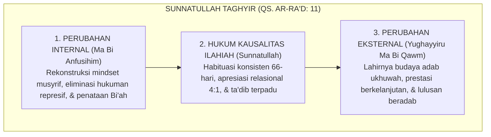
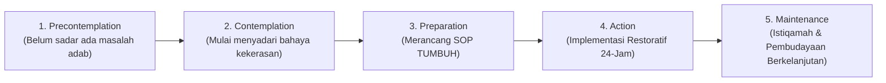

# P1-06-01: SUNNATULLAH PERUBAHAN JIWA DAN PERILAKU
## *Hukum Kausalitas Transformasi Sosial-Spiritual (QS. Ar-Ra'd: 11), Psikologi Perubahan Kognitif, dan Manajemen Resistensi Budaya*

**Nomor Identifikasi**: `P1-06-01/SUNNATULLAH-PERUBAHAN/2026`  
**Domain**: `01 Philosophy` > `06 Change`  
**Dewan Pakar**: `pakar-filosofi-tumbuh`, `pakar-epistemologi-turats`, `pakar-psikologi-sosial-santri`

---

## 📑 DAFTAR ISI ANALITIS

1. [1. Aksioma Perubahan: Kausalitas Ilahiah dalam Transformasi Jiwa](#1-aksioma-perubahan-kausalitas-ilahiah-dalam-transformasi-jiwa)
2. [2. Hermeneutika QS. Ar-Ra'd Ayat 11: Titik Temu Ikhtiar Insani & Pertolongan Ilahi](#2-hermeneutika-qs-arrad-ayat-11-titik-temu-ikhtiar-insani--pertolongan-ilahi)
3. [3. Konvergensi Teori Perubahan Perilaku (Transtheoretical Model Prochaska & DiClemente)](#3-konvergensi-teori-perubahan-perilaku-transtheoretical-model-prochaska--diclemente)
4. [4. Manajemen Resistensi Budaya Pesantren (*Navigating Resistance*)](#4-manajemen-resistensi-budaya-pesantren-navigating-resistance)
5. [5. Implikasi bagi Peta Jalan Transformasi Budaya TUMBUH](#5-implikasi-bagi-peta-jalan-transformasi-budaya-tumbuh)

---

### 1. Aksioma Perubahan: Kausalitas Ilahiah dalam Transformasi Jiwa

Perubahan budaya pesantren tidak dapat dicapai hanya dengan angan-angan kosong (*Tamanniy*) atau deklarasi administratif di atas kertas. Perubahan perilaku santri dan tata kelola asrama tunduk pada **Sunnatullah Taghyir (Hukum Kausalitas Transformasi)** yang pasti, objektif, dan terukur.

Pesantren yang ingin menghasilkan lulusan yang beradab luhur, berkarakter mandiri, dan berjiwa merdeka wajib terlebih dahulu mengubah **kondisi internal ekosistemnya (*ma bi anfusihim*)**: merekonstruksi cara pandang para musyrif, menghentikan normalisasi kekerasan fisik, dan membangun sistem pengasuhan berbasis data dan kasih sayang.

---

### 2. Hermeneutika QS. Ar-Ra'd Ayat 11

Allah SWT mendeklarasikan hukum universal transformasi sosial dan peradaban:

> $$\text{إِنَّ اللَّهَ لَا يُغَيِّرُ مَا بِقَوْمٍ حَتَّىٰ يُغَيِّرُوا مَا بِأَنفُسِهِمْ}$$
> 
> *"Sesungguhnya Allah tidak akan mengubah keadaan suatu kaum hingga mereka mengubah keadaan yang ada pada diri mereka sendiri."* (QS. Ar-Ra'd [13]: 11).

Imam Fakhruddin ar-Razi dalam *Mafatih al-Ghaib* menjelaskan bahwa ayat ini meletakkan **prinsip pertanggungjawaban ikhtiar insani**: pertolongan dan taufiq Allah (*Inayah Ilahiyyah*) untuk melahirkan pesantren yang barakah dan unggul selalu diawali oleh kemauan sungguh-sungguh dari para pimpinan dan pendidiknya untuk mengoreksi kesalahan sistemik masa lalu dan menempuh jalan perbaikan (*Ishlah*).

---

### 3. Konvergensi Transtheoretical Model (Stages of Change)

Kearifan sunnatullah perubahan ini selaras dengan teori psikologi perubahan perilaku **Transtheoretical Model (TTM)** yang dirumuskan oleh James O. Prochaska dan Carlo DiClemente (1983; 1994):

Sistem pembinaan tidak boleh menghakimi santri atau staf yang masih berada pada tahap *Contemplation*, melainkan mendampingi mereka melintasi setiap fase kesiapan mental hingga mencapai tahap pembudayaan (*Maintenance*).

---

### 4. Manajemen Resistensi Budaya Pesantren

Dalam menavigasi transformasi dari paradigma represif konvensional menuju Ekosistem TUMBUH, sering kali muncul resistensi budaya internal:
* *"Dari dulu pesantren kita memang keras pakai rotan, dan terbukti kiainya jadi orang hebat!"* (Bias survivorship historis).
* *"Kalau santri tidak dipukul, mereka akan manja dan menginjak-injak pengurus!"* (Ketakutan kehilangan kontrol otoriter).

Ekosistem TUMBUH menjawab resistensi ini melalui **Tiga Strategi De-eskalasi Budaya**:
1. **Dialog Turats Otentik**: Menunjukkan fakta kitab salaf (seperti wasiat Ibnu Khaldun dalam *Al-Muqaddimah* dan KH. Hasyim Asy'ari) yang sejak ratusan tahun lalu justru melarang keras kekerasan fisik kepada murid.
2. **Uji Coba Berbasis Bukti (*Pilot Project*)**: Menerapkan sistem PBIS Restoratif pada 1–2 kamar asrama percontohan untuk membuktikan bahwa tanpa pemukulan, kamar percontohan justru jauh lebih tertib, bersih, dan bahagia.
3. **Pelatihan Keterampilan Pengganti (*Alternative Skill Training*)**: Memberikan pelatihan teknik de-eskalasi emosi dan komunikasi restoratif kepada musyrif, sehingga musyrif tidak lagi merasa "kehilangan senjata" saat rotan ditarik.

---

### 5. Implikasi bagi Peta Jalan Transformasi Budaya TUMBUH

1. **Transformasi Bertahap 100 Hari**: Peta jalan implementasi dimulai dari sosialisasi filosofi, penyusunan SOP ramah anak, pelatihan musyrif, hingga peluncuran penuh *Logbook Digital*.
2. **Evaluasi Berbasis Data Kejadian Lapangan**: Menggunakan data logbook pelanggaran PBIS harian untuk melihat tren penurunan insiden konflik secara objektif.
3. **Penyelarasan Seluruh Sivitas Pesantren**: Mengintegrasikan visi perubahan mulai dari Kiai, Asatidz, Musyrif, Tenaga Kebersihan/Dapur, hingga Komite Orang Tua Santri.
