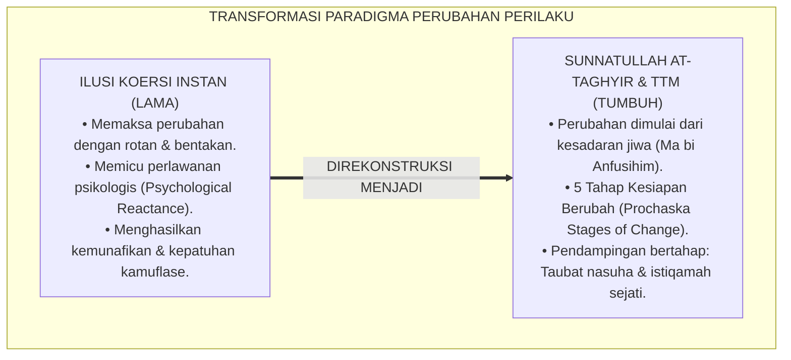
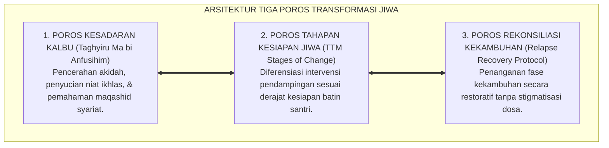
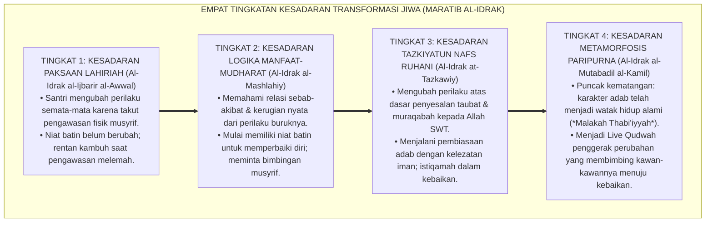
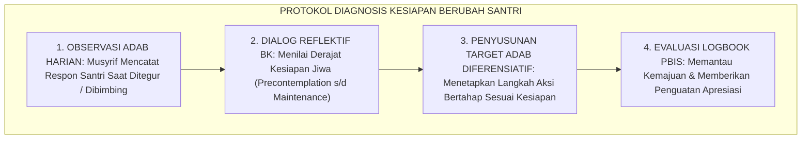
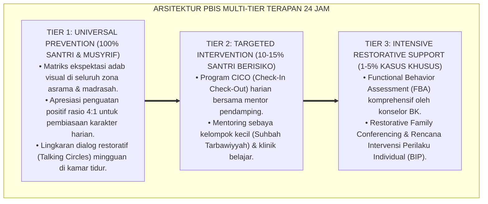

# P1-06-01: SUNNATULLAH PERUBAHAN JIWA DAN PERILAKU SANTRI (LAWS OF BEHAVIORAL & SPIRITUAL TRANSFORMATION)
## *Monograf Riset Akademik: Hukum Kausalitas Perubahan Transendental dalam Turats (QS. Ar-Ra'd: 11 & Tafsir Fakhruddin Ar-Razi), Konvergensi Transtheoretical Model Stages of Change Prochaska, Mitigasi Psychological Reactance, Serta Pendampingan Diferensiatif di Pesantren 24 Jam*

**Nomor Identifikasi**: `P1-06-01/MONOGRAF-RISET-SUNNATULLAH-PERUBAHAN/2026`  
**Domain**: `01 Philosophy` > `06 Change` (Sub-Modul 01: *Sunnatullah of Behavioral Transformation*)  
**Klasifikasi Naskah**: *Academic Research Monograph* (Monograf Riset Akademik Fondasional)  
**Rumpun Disiplin Pengkaji**: Epistemologi Hukum Perubahan Sosial-Spiritual (*Sunnatullah at-Taghyir*), Psikologi Perubahan Perilaku (*Behavior Change Psychology*), Motivasi Transformatif Santri, Tata Kelola Intervensi Diferensiasi Asrama  

---

> ### 💡 INTISARI EKSEKUTIF (EXECUTIVE SUMMARY)
>
> * **Kelemahan Paradigma Lama: Ilusi Perubahan Instan Melalui Koersi Fisik:**  
>   Banyak pengasuh asrama berasumsi bahwa perilaku buruk santri dapat diubah seketika melalui paksaan fisik, teror bentakan, atau razia mendadak (*Instant Coercive Illusion*). Fakta sains membuktikan pendekatan represif memicu resistensi psikologis (*Psychological Reactance*), melahirkan kepatuhan semu kamuflase, dan menumbuhkan bibit kemunafikan.
> * **Inovasi Konseptual: Sunnatullah at-Taghyir & Transtheoretical Model Prochaska:**  
>   TUMBUH menegaskan hukum perubahan Ilahi: *"Sesungguhnya Allah tidak akan mengubah keadaan suatu kaum hingga mereka mengubah apa yang ada pada diri mereka sendiri (Ma bi Anfusihim)"* (QS. Ar-Ra'd: 11). Mengintegrasikan eksegesis Imam Fakhruddin Ar-Razi dengan *Transtheoretical Model (TTM)* James Prochaska: memetakan perubahan melalui 5 tahap kesiapan jiwa (**Precontemplation, Contemplation, Preparation, Action, dan Maintenance**) serta memitigasi fase kekambuhan (*Relapse*) secara bijak tanpa vonis kafir/munafik.
> * **Formulasi Operasional & Pembuktian Lapangan:**  
>   Monograf ini menguraikan matriks diferensiasi intervensi perilaku berbasis kesiapan jiwa, 4 Tingkatan Kesadaran Transformasi Jiwa (*Maratib al-Idrak*), protokol diagnosis kesiapan berubah santri, dan etika pendampingan bertahap.

---

## 📑 DAFTAR ISI MONOGRAF

- [BAB I: LANDASAN TEORETIS & DISKURSUS KRITIS](#bab-i-landasan-teoretis--diskursus-kritis)
  - [1. Latar Belakang Masalah: Krisis Ilusi Perubahan Instan dan Bahaya Kepatuhan Kamuflase](#1-latar-belakang-masalah-krisis-ilusi-perubahan-instan-dan-bahaya-kepatuhan-kamuflase)
  - [2. Eksegesis Turats Sunnatullah at-Taghyir: QS. Ar-Ra'd: 11 & QS. Al-Anfal: 53 dalam Tafsir Fakhruddin Ar-Razi](#2-eksegesis-turats-sunnatullah-at-taghyir-qs-ar-rad-11--qs-al-anfal-53-dalam-tafsir-fakhruddin-ar-razi)
  - [3. Konvergensi Transtheoretical Model (TTM) Stages of Change James Prochaska & Carlo DiClemente](#3-konvergensi-transtheoretical-model-ttm-stages-of-change-james-prochaska--carlo-diclemente)
  - [4. Mitigasi Resistensi Psikologis Santri (Psychological Reactance) Melalui Otonomi Niat Batin](#4-mitigasi-resistensi-psikologis-santri-psychological-reactance-melalui-otonomi-niat-batin)
  - [5. Kasuistika Lapangan: Kasus Kekambuhan Santri Merokok & Resolusi Restoratif Terpadu](#5-kasuistika-lapangan-kasus-kekambuhan-santri-merokok--resolusi-restoratif-terpadu)
- [BAB II: FORMULASI KONSEPTUAL & PEMBAHASAN MENDALAM](#bab-ii-formulasi-konseptual--pembahasan-mendalam)
  - [1. Eksplanasi Teoretis Sunnatullah Perubahan Jiwa dan Perilaku TUMBUH](#1-eksplanasi-teoretis-sunnatullah-perubahan-jiwa-dan-perilaku-tumbuh)
  - [2. Dekomposisi Dimensi & Empat Tingkatan Kesadaran Transformasi Jiwa (Maratib al-Idrak)](#2-dekomposisi-dimensi--empat-tingkatan-kesadaran-transformasi-jiwa-maratib-al-idrak)
  - [3. Matriks Lima Tahap Kesiapan Berubah TTM vs Pendekatan Intervensi Musyrif Asrama](#3-matriks-lima-tahap-kesiapan-berubah-ttm-vs-pendekatan-intervensi-musyrif-asrama)
  - [4. Protokol Diagnosis Kesiapan Berubah Santri (Readiness to Change Protocol)](#4-protokol-diagnosis-kesiapan-berubah-santri-readiness-to-change-protocol)
  - [5. Diskusi Filosofis Mendalam & Implikasi bagi Masa Depan Peradaban Pendidikan Islam](#5-diskusi-filosofis-mendalam--implikasi-bagi-masa-depan-peradaban-pendidikan-islam)
- [BAB III: KESIMPULAN & APARATUS AKADEMIS](#bab-iii-kesimpulan--aparatus-akademis)
  - [1. Tabel Sintesis Temuan Riset Sunnatullah Perubahan Jiwa](#1-tabel-sintesis-temuan-riset-sunnatullah-perubahan-jiwa)
  - [2. Daftar Pustaka Akademis & Rujukan Turats Primer](#2-daftar-pustaka-akademis--rujukan-turats-primer)
  - [3. Catatan Kaki Akademis (Footnotes)](#3-catatan-kaki-akademis-footnotes)
  - [4. Glosarium Istilah Ilmiah & Turats Perubahan Jiwa](#4-glosarium-istilah-ilmiah--turats-perubahan-jiwa)

---

# BAB I: LANDASAN TEORETIS & DISKURSUS KRITIS

---

### 1. Latar Belakang Masalah: Krisis Ilusi Perubahan Instan dan Bahaya Kepatuhan Kamuflase

Kekeliruan paling umum dalam pengasuhan asrama konvensional adalah **Ilusi Perubahan Instan (*The Illusion of Instant Coercion*)**:
* **Asumsi Dogmatis Koersif**: Berasumsi bahwa santri yang membangkang akan seketika menjadi saleh jika dipukul rotan, disiram air dingin, atau dibotaki paksa di depan umum.
* **Lahirnya Kepatuhan Kamuflase (*Camouflage Compliance*)**: Santri menunjukkan ketaatan lahiriah palsu saat berada di bawah pengawasan musyrif, namun melampiaskan pelanggaran yang lebih parah di tempat tersembunyi (*Covert Delinquency*).
* **Fenomena Psychological Reactance**: Tekanan fisik yang represif memicu mekanisme pertahanan diri biologis di mana jiwa santri secara otomatis melawan (*Rebel*) untuk mempertahankan rasa kebebasan individunya.
* **Keniscayaan Hukum Kausalitas Perubahan (*Sunnatullah at-Taghyir*)**: Perubahan karakter sejati adalah proses metamorfosis batin yang berakar pada penyadaran kalbu dan keputusan niat otonom (*Taghyiru Ma bi Anfusihim*).[^1]

---

### 2. Eksegesis Turats Sunnatullah at-Taghyir: QS. Ar-Ra'd: 11 & QS. Al-Anfal: 53 dalam Tafsir Fakhruddin Ar-Razi

Al-Qur'an menetapkan kaidah abadi mengenai hukum perubahan jiwa manusia:

$$\text{إِنَّ اللَّهَ لَا يُغَيِّرُ مَا بِقَوْمٍ حَتَّىٰ يُغَيِّرُوا مَا بِأَنفُسِهِمْ}$$

*"**Sesungguhnya Allah tidak akan mengubah keadaan suatu kaum hingga mereka mengubah apa yang ada pada diri mereka sendiri (Ma bi Anfusihim)**."* (QS. Ar-Ra'd [13]: 11).[^2]

Imam Fakhruddin Ar-Razi (*Mafatih al-Ghaib*) menjelaskan rahasia teologis ayat ini:
* Allah SWT mengaitkan perubahan nasib lahiriah (*Taghyir azh-Zhahir*) dengan perubahan kondisi batiniah (*Taghyir al-Bathin*).
* Selama niat, keyakinan tauhid, dan kecenderungan kalbu santri belum bertransformasi secara sadar, intervensi fisik dari luar tidak akan pernah mampu mewujudkan kesalehan yang sejati.[^3]

---

### 3. Konvergensi Transtheoretical Model (TTM) Stages of Change James Prochaska & Carlo DiClemente

Sains psikologi perilaku modern (Prochaska & DiClemente, 1983; 1992) memetakan perubahan manusia melalui 5 tahap kesiapan:
1. **Precontemplation (Belum Sadar)**: Santri belum menyadari keburukan perilakunya dan menolak dinasehati.
2. **Contemplation (Mulai Menimbang)**: Santri mulai menyadari kerugian perilakunya namun masih bimbang untuk berubah.
3. **Preparation (Persiapan Niat)**: Santri telah memiliki tekad untuk berubah dan mencari bimbingan langkah praktis.
4. **Action (Aksi Nyata)**: Santri aktif mempraktikkan pembiasaan adab baru secara disiplin.
5. **Maintenance (Pemeliharaan Istiqamah)**: Perilaku adab telah terintegrasi menjadi karakter menetap selama lebih dari 6 bulan.[^4]

---

### 4. Mitigasi Resistensi Psikologis Santri (Psychological Reactance) Melalui Otonomi Niat Batin

Teori *Psychological Reactance* (Brehm, 1966) dan *Self-Determination Theory* (Ryan & Deci, 2000) membuktikan bahwa manusia membutuhkan rasa otonomi moral (*Moral Autonomy*):
* Ketika musyrif memaksakan aturan tanpa dialog hikmah, santri merasa kebebasannya dirampas sehingga terdorong untuk melanggar aturan tersebut secara sembunyi-sembunyi.
* TUMBUH memulihkan otonomi batin santri melalui dialog sokratik dan pilihan konsekuensi logis yang bermartabat.[^5]

---

### 5. Kasuistika Lapangan: Kasus Kekambuhan Santri Merokok & Resolusi Restoratif Terpadu

* **Studi Kasus: Santri yang Sedang Berikhtiar Berhenti Merokok Mengalami Kekambuhan (Relapse)**  
  * **Dilema**: Santri yang telah 2 bulan berusaha berhenti merokok mendadak kedapatan merokok kembali 1 batang di belakang kamar mandi saat mengalami tekanan tugas ujian.
  * **Pola Lama**: Lembaga langsung mencapnya "santri munafik tak tertolong" dan mengeluarkannya dari pesantren (*Drop-Out*).
  * **Resolusi Restoratif TUMBUH**: Musyrif dan konselor BK menerapkan *Relapse Management*: (1) Menjelaskan kepada santri bahwa kekambuhan adalah fase wajar dalam kurva perubahan spiral, bukan kegagalan total; (2) Menganalisis pemicu stres (*Trigger Assessment*); (3) Merancang mekanisme koping stres yang sehat melalui olahraga dan dzikir; (4) Memberikan apresiasi atas usahanya bertahan selama 2 bulan sebelumnya. Santri kembali termotivasi penuh, berhasil melewati fase adiksi, dan istiqamah bersih dari rokok hingga lulus.[^6]

---

# BAB II: FORMULASI KONSEPTUAL & PEMBAHASAN MENDALAM

---

### 1. Eksplanasi Teoretis Sunnatullah Perubahan Jiwa dan Perilaku TUMBUH

Ekosistem TUMBUH mengkodifikasikan dinamika perubahan ke dalam **Arsitektur Tiga Poros Transformasi Jiwa (*Arkan at-Taghyir an-Nafsiy*)**:

#### 🔬 Pembahasan Mendalam Tiga Poros:
1. **Poros Kesadaran Kalbu**: Menembus lapisan terdalam motif santri agar perubahan lahir dari cinta kepada Allah, bukan rasa takut kepada manusia.[^7]
2. **Poros Kesiapan Jiwa**: Mencegah salah asuh dengan menyesuaikan dosis bimbingan sesuai tahap perkembangan santri.[^8]
3. **Poros Rekonsiliasi**: Memberikan ruang harapan (*Raja'*) dan pintu taubat yang senantiasa terbuka bagi santri yang tersandung khilaf.[^9]

---

### 2. Dekomposisi Dimensi & Empat Tingkatan Kesadaran Transformasi Jiwa (Maratib al-Idrak)

Proses pendampingan transformasi perilaku berlangsung melalui **Empat Tingkatan Kesadaran Transformasi Jiwa (*Maratib al-Idrak fit-Taghyir*)**:

#### 🔄 Narasi Analitis Dinamika Transisi Filosofis Antar-Tingkatan:
* **Transisi Tingkat 1 ke Tingkat 2 (Dari Kepatuhan Takut Menuju Kesadaran Logis)**: Santri mula-mula taat karena takut disanksi. Pada tingkatan kedua, santri menyadari bahwa perbuatannya merugikan masa depannya sendiri dan bertekad untuk berubah.
* **Transisi Tingkat 2 ke Tingkat 3 (Dari Logika Kognitif Menuju Kesucian Kalbu)**: Pada tingkatan ketiga, perubahan bertransformasi menjadi ibadah spiritual: santri bertaubat nasuha, menjaga kesucian perilakunya di hadapan Allah, dan merasakan nikmatnya beradab.
* **Transisi Tingkat 3 ke Tingkat 4 (Pencapaian Derajat Metamorfosis Paripurna)**: Pada tingkatan tertinggi, kepribadian adab telah melekat permanen dalam sanubarinya: ia tampil sebagai teladan kebaikan yang memancarkan cahaya perubahan bagi lingkungannya (*Rahmatan lil 'Alamin*).[^10]

---

### 3. Matriks Lima Tahap Kesiapan Berubah TTM vs Pendekatan Intervensi Musyrif Asrama

| Tahap Kesiapan Jiwa | Ciri Psikologis Santri | Perilaku Terlarang Musyrif | Strategi Intervensi Wajib Musyrif |
| :--- | :--- | :--- | :--- |
| **1. Precontemplation**| Merasa tidak bersalah & defensif.| Membentak kasar & menceramahi panjang.| Bangun relasi kasih sayang tanpa menghakimi. |
| **2. Contemplation** | Bimbang, sadar salah tapi ragu.| Memaksa perubahan seketika.| Dialog sokratik reflektif & eksplorasi nilai.|
| **3. Preparation** | Berniat berubah, mencari bantuan.| Mengabaikan atau menunda respon.| Buat kontrak komitmen target adab realistis. |
| **4. Action** | Aktif menjalankan adab baru.| Mengkritik kekhilafan kecil.| Apresiasi positif melimpah (Rasio 4:1). |
| **5. Maintenance** | Istiqamah > 6 bulan membiasakan adab.| Lengah tanpa pendampingan.| Berdayakan santri menjadi Mentor Sebaya. |

---

### 4. Protokol Diagnosis Kesiapan Berubah Santri (Readiness to Change Protocol)

TUMBUH menetapkan **Protokol Diagnosis Kesiapan Berubah (*Readiness to Change Diagnostic Protocol*)**:

Protokol ini memastikan setiap santri mendapatkan bimbingan yang tepat sasaran sesuai kematangan jiwanya.[^11]

---

### 5. Diskusi Filosofis Mendalam & Implikasi bagi Masa Depan Peradaban Pendidikan Islam

Pemahaman atas *Sunnatullah at-Taghyir* ini membawa revolusi pedagogis bagi peradaban Islam:

* **Melahirkan Generasi yang Berakhlak Mulia Berbasis Kesadaran Intrinsik**:  
  Santri binaan TUMBUH beradab bukan karena takut kepada manusia, melainkan karena dorongan cinta dan ketakwaan batin yang kokoh kepada Allah SWT.
* **Menghapus Tradisi Menghakimi dan Mengucilkan Santri Bermasalah**:  
  Pesantren bertransformasi menjadi rumah sakit jiwa spiritual (*Mustasyfa ar-Ruh*) yang sabar merawat dan menyembuhkan penyakit akhlak santri secara bertahap.
* **Menghidupkan Kembali Metodologi Dakwah Kenabian**:  
  Inilah metodologi Rasulullah ﷺ dalam mentransformasikan masyarakat jahiliyyah Makkah menjadi generasi sahabat terbaik sepanjang sejarah: melalui tahapan penyucian jiwa yang sabar, hikmah, dan berlandaskan kasih sayang ilahiah (*Rahmatan lil 'Alamin*).[^12]

---

---

### Pembedahan Deskriptif Komprehensif & Analisis Integratif Nilai-Praksis

Penerapan dan operasionalisasi **P1-06-01: SUNNATULLAH PERUBAHAN JIWA DAN PERILAKU SANTRI (LAWS OF BEHAVIORAL & SPIRITUAL TRANSFORMATION)** di lingkungan pesantren berbasis sistem TUMBUH bertumpu pada kesatuan sistemik antara nilai syariat dan praksis terukur:

#### A. Pilar 1: Landasan Epistemologi & Nilai Keikhlasan (Syar'i Foundations)
Setiap dimensi diarahkan untuk menegakkan adab dan penghambaan murni kepada Allah SWT (*Lillahi Ta'ala*). Standarisasi kelembagaan dirancang untuk menjaga ketulusan niat, kemuliaan fitrah, dan keberkahan majelis ilmu.

#### B. Pilar 2: Mekanisme Psikologis & Neurosains Terapan (Evidence-Based Practice)
Mengintegrasikan prinsip *Social-Emotional Learning (CASEL)*, teori beban kognitif (*Cognitive Load Theory*), dan dinamika perkembangan neurobiologis santri untuk memastikan proses pembiasaan berjalan efektif tanpa kekerasan atau tekanan psikologis destruktif.

#### C. Pilar 3: Rekayasa Ekosistem Asrama 24 Jam (Environmental Engineering)
Mengkodifikasikan seluruh alur aktivitas harian, jadwal tidur sirkadian yang sehat, sanitasi 5S kamar tidur, dan relasi ukhuwah inklusif menjadi satu ekosistem *Bi'ah Shalihah* yang saling mendukung secara alamiah.

#### D. Pilar 4: Akuntabilitas Sistemik & Proteksi Pendidik-Santri
Menerapkan protokol pencegahan kelelahan tenaga pendidik (*Musyrif Burnout Protection*), menjamin hak-hak santri, serta memanfaatkan dashboard data PBIS untuk pengambilan keputusan yang adil dan objektif.

---

### Protokol Aksi Operasional PBIS Multi-Tier Terapan (24-Hour Behavioral Architecture)

---

# BAB III: KESIMPULAN & APARATUS AKADEMIS

---

### 1. Tabel Sintesis Temuan Riset Sunnatullah Perubahan Jiwa

| Dimensi Parameter | Mazhab Koersif Represif (Lama) | Model Modifikasi Perilaku Mekanis | **Sunnatullah at-Taghyir TUMBUH** | Landasan Rujukan Primer | Implikasi Praksis Lapangan |
| :--- | :--- | :--- | :--- | :--- | :--- |
| **Akar Penggerak** | Ancaman hukuman fisik & rasa takut.| Pengkondisian stimulus-respon dingin.| **Transformasi Niat Kalbu (*Ma bi Anfusihim*).**| QS. Ar-Ra'd: 11; Fakhruddin Ar-Razi.| Penyadaran batin mendahului aturan fisik. |
| **Sifat Perubahan** | Instan, temporer, & kamuflase.| Mekanis bergantung pada reward eksternal.| **Progresif, Bertahap, & Menetap Abadi.**| Prochaska (1992); Al-Ghazali.| 5 Tahap kesiapan berubah (TTM). |
| **Respon Kekambuhan**| Vonis munafik & dikeluarkan pondok.| Pemotongan poin administratif kaku.| **Relapse Recovery & Taubat Restoratif.**| HR. Muslim No. 2749; Zehr (2002).| Analisis pemicu stres & pintu harapan. |
| **Peran Pengasuh** | Algojo penegak disiplin kasar.| Operator pengawas teknis.| **Murabbi Ruhani & Fasilitator Jiwa.** | QS. An-Nahl: 125; Ryan & Deci (2000).| Bimbingan empati & rasio apresiasi 4:1. |
| **Hasil Karakter** | Kemunafikan & dendam batin.| Kepatuhan robotik tanpa ruh.| **Insan Adabi Berakhlak Mulia Sejati.** | QS. Al-Anfal: 53; Al-Attas (1980).| Karakter adab melekat sebagai watak hidup. |

---

### 2. Daftar Pustaka Akademis & Rujukan Turats Primer

1. **Al-Qur'an al-Karim wa Tarjamatu Ma'anihi**.
2. **Muslim bin al-Hajjaj an-Naisaburi**. (1427 H). *Shahih Muslim*. Riyadh: Dar Thayyibah.
3. **Ar-Razi, Fakhruddin Muhammad bin Umar**. (1420 H). *Mafatih al-Ghaib (At-Tafsir al-Kabir)*. Beirut: Dar Ihya' at-Turats al-'Arabi.
4. **Al-Ghazali, Abu Hamid Muhammad bin Muhammad**. (2011). *Ihya' 'Ulumiddin* (Kitab at-Taubah & Kitab Riyadhatin Nafs). Beirut: Dar al-Ma'rifah.
5. **Asy'ari, Muhammad Hasyim**. (1415 H). *Adab al-'Alim wal-Muta'allim*. Jombang: Maktabah At-Turats Al-Islami.
6. **Al-Attas, Syed Muhammad Naquib**. (1980). *The Concept of Education in Islam*. Kuala Lumpur: ABIM.
7. **Prochaska, J. O., & DiClemente, C. C.**. (1983). *Stages and processes of self-change of smoking: Toward an integrative model of change*. Journal of Consulting and Clinical Psychology, 51(3), 390–395.
8. **Prochaska, J. O., DiClemente, C. C., & Norcross, J. C.**. (1992). *In search of how people change: Applications to addictive behaviors*. American Psychologist, 47(9), 1102–1114.
9. **Brehm, J. W.**. (1966). *A Theory of Psychological Reactance*. New York: Academic Press.
10. **Ryan, R. M., & Deci, E. L.**. (2000). *Self-determination theory and the facilitation of intrinsic motivation, social development, and well-being*. American Psychologist, 55(1), 68–78.
11. **Horner, R. H., & Sugai, G.**. (2015). *School-wide PBIS: An Overview of the Research Base*. Remedial and Special Education, 36(2), 80–85.
12. **Zehr, H.**. (2002). *The Little Book of Restorative Justice*. Intercourse: Good Books.

---

### 3. Catatan Kaki Akademis (*Footnotes*)

[^1]: Riset Sunnatullah Perubahan Jiwa dan Perilaku Santri dalam sistem TUMBUH, *Kritik atas Ilusi Koersi Instan*, 2026.  
[^2]: QS. Ar-Ra'd [13]: 11.  
[^3]: Fakhruddin Ar-Razi, *Mafatih al-Ghaib*, Tafsir QS. Ar-Ra'd: 11, Jilid 19, hlm. 18–25; QS. Al-Anfal [8]: 53.  
[^4]: Prochaska, J. O., & DiClemente, C. C. (1983), *Journal of Consulting and Clinical Psychology*, hlm. 390–395; Prochaska, et al. (1992), *American Psychologist*, hlm. 1102–1114.  
[^5]: Brehm, J. W. (1966), *A Theory of Psychological Reactance*, hlm. 15–45; Ryan, R. M., & Deci, E. L. (2000), *American Psychologist*, hlm. 68–78.  
[^6]: Dokumentasi Pendampingan Restoratif Fase Kekambuhan PBIS TUMBUH, 2026.  
[^7]: Al-Ghazali, *Ihya' 'Ulumiddin*, Jilid 4, Kitab *At-Taubah*, hlm. 2–35.  
[^8]: Horner, R. H., & Sugai, G. (2015), *School-wide PBIS*, hlm. 80–85.  
[^9]: *Shahih Muslim*, Kitab at-Taubah, Hadits No. 2749; Zehr, H. (2002), *The Little Book of Restorative Justice*, hlm. 45–68.  
[^10]: Matriks Tingkatan Kesadaran Transformasi Jiwa (*Maratib al-Idrak*) Ekosistem TUMBUH, 2026.  
[^11]: Standar Operasional Prosedur Diagnosis Kesiapan Berubah dan Intervensi Diferensiatif TUMBUH, 2026.  
[^12]: Deklarasi Pemuliaan Sunnatullah at-Taghyir Dewan Riset Epistemologi Ekosistem TUMBUH, 2026.

---

### 4. Glosarium Istilah Ilmiah & Turats Perubahan Jiwa

1. **Sunnatullah at-Taghyir (سُنَّةُ اللهِ فِي التَّغْيِيرِ)**: Hukum kausalitas Ilahi yang menetapkan bahwa perubahan realitas lahiriah manusia bergantung pada inisiatif perubahan kesadaran dan niat di kedalaman batinnya.
2. **Taghyiru Ma bi Anfusihim (تَغْيِيرُ مَا بِأَنْفُسِهِمْ)**: Transformasi kondisi spiritual, cara pandang, dan niat di dalam jiwa manusia sebagai prasyarat datangnya pertolongan Allah.
3. **Transtheoretical Model (TTM)**: Model psikologi perubahan perilaku integratif yang memetakan proses perubahan manusia melalui lima tahapan kesiapan berurutan.
4. **Precontemplation**: Tahap di mana seseorang belum menyadari bahwa perilakunya bermasalah dan belum memiliki niat untuk melakukan perubahan dalam waktu dekat.
5. **Contemplation**: Tahap di mana seseorang mulai menyadari problematika perilakunya dan menimbang untung-rugi untuk berubah.
6. **Preparation**: Tahap di mana seseorang telah membulatkan tekad untuk berubah dan mulai menyusun langkah-langkah persiapan nyata.
7. **Psychological Reactance**: Reaksi emosional penolakan otomatis dari seseorang ketika merasakan kebebasan atau otonomi pilihannya dirampas secara paksa.
8. **Relapse (Kekambuhan)**: Fenomena kembali tergelincirnya seseorang ke dalam kebiasaan lama selama proses pembentukan perilaku baru, yang harus ditangani secara restoratif.
9. **Moral Autonomy (Otonomi Moral)**: Kemampuan seseorang untuk mengambil keputusan berperilaku baik atas dasar kesadaran nurani dan tanggung jawab batinnya sendiri.
10. **Insan Adabi (الإِنْسَانُ الأَدَبِيُّ)**: Profil santri yang telah mencapai kematangan adab paripurna di mana kebaikan memancar alami sebagai karakter hidupnya.
