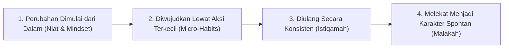

# P1-06-01-Sunnatullah-Perubahan-Jiwa-dan-Perilaku

## Tujuan
Merumuskan hukum-hukum sunnatullah mengenai proses perubahan perilaku manusia (*Behavioral & Character Change*) yang menghubungkan ketetapan wahyu dengan kaidah sains psikologi kebiasaan (*habit science*).

---

## Sunnatullah Perubahan dalam Al-Qur'an

Perubahan sosial dan karakter tidak terjadi secara acak atau magis, melainkan terikat dengan hukum sebab-akibat yang telah Allah tetapkan.

> *"Sesungguhnya Allah tidak akan mengubah keadaan suatu kaum sampai mereka mengubah apa yang ada pada diri mereka sendiri..."*  
> **(QS. Ar-Ra'd [13]: 11)**

> *"Dan orang-orang yang berjihad untuk (mencari keridhaan) Kami, benar-benar akan Kami tunjukkan kepada mereka jalan-jalan Kami. Dan sesungguhnya Allah benar-benar beserta orang-orang yang berbuat baik."*  
> **(QS. Al-'Ankabut [29]: 69)**

---

## Kaidah Perubahan Perilaku dalam TUMBUH

1. **Perubahan Adalah Proses Adaptasi Neurologis & Spiritual**:
   - Membentuk kebiasaan baru membutuhkan waktu bagi otak untuk membentuk jalur sinapsis baru dan bagi jiwa untuk menundukkan dorongan nafsu (*Mujahadatun Nafs*).
2. **Keteraturan Lingkungan Mendorong Keteraturan Jiwa**:
   - Manusia sangat dipengaruhi oleh isyarat lingkungan (*environmental cues*). Jika lingkungan asrama kacau dan kotor, maka pola pikir dan perilaku santri cenderung ikut kacau.
3. **Pencegahan Jauh Lebih Efektif daripada Pengobatan**:
   - Menghilangkan stimulus dan peluang pelanggaran jauh lebih mudah daripada memperbaiki perilaku setelah pelanggaran terjadi berulang kali (*Sadd adz-Dzari'ah / Tier 1 PBIS*).
