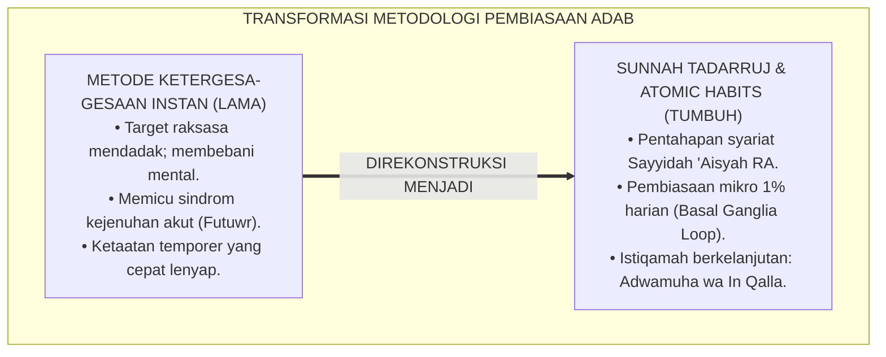
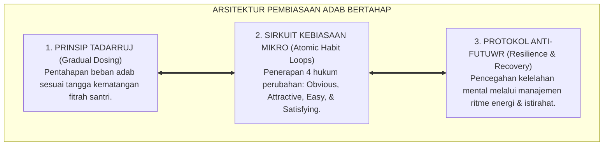
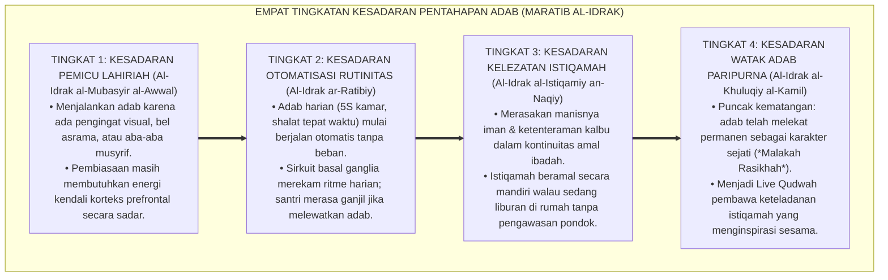
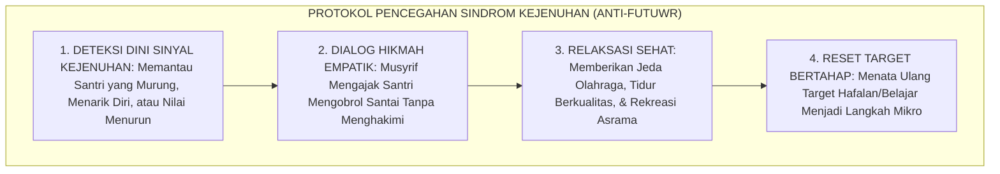
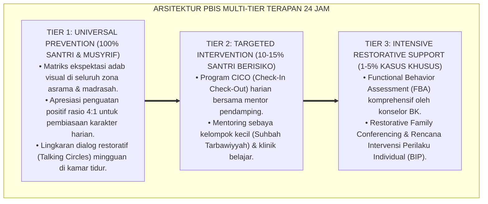

# P1-06-02: PRINSIP TADARRUJ DAN ISTIQAMAH PEMBIASAAN ADAB (GRADUALISM & CONTINUITY IN HABIT FORMATION)
## *Monograf Riset Akademik: Teologi Pentahapan Syariat (Sunnah at-Tadarruj Sayyidah 'Aisyah RA), Keutamaan Amal Berkelanjutan (Adwamuha wa In Qalla), Konvergensi Sains Atomic Habits James Clear & Sirkuit Basal Ganglia, Serta Mitigasi Sindrom Ghuluw-Futuwr di Pesantren 24 Jam*

**Nomor Identifikasi**: `P1-06-02/MONOGRAF-RISET-TADARRUJ-ISTIQAMAH/2026`  
**Domain**: `01 Philosophy` > `06 Change` (Sub-Modul 02: *Gradualism & Habit Continuity*)  
**Klasifikasi Naskah**: *Academic Research Monograph* (Monograf Riset Akademik Fondasional)  
**Rumpun Disiplin Pengkaji**: Ushul Fiqh & Maqashid Pentahapan (*at-Tadarruj fit-Tasyri'*), Psikologi Pembentukan Kebiasaan (*Habit Formation Science*), Neurosains Pembelajaran Otomatis (*Basal Ganglia Circuitry*), Manajemen Dinamika Kebugaran Jiwa Santri  

---

> ### 💡 INTISARI EKSEKUTIF (EXECUTIVE SUMMARY)
>
> * **Kelemahan Paradigma Lama: Beban Berlebihan & Siklus Ghuluw-Futuwr:**  
>   Banyak pengasuh memaksakan target ibadah dan hafalan raksasa secara mendadak kepada santri baru (*Isti'jal & Ghuluw*). Pendekatan ekstrem tanpa tahapan ini memicu kelelahan mental akut, penolakan psikologis, dan berujung pada sindrom kemogokan belajar (*Futuwr Massal*) atau kepatuhan semu karena takut disanksi.
> * **Inovasi Konseptual: Sunnah at-Tadarruj & Sains Kebiasaan Mikro (Atomic Habits):**  
>   TUMBUH mengadopsi hikmah Sayyidah 'Aisyah radhiyallahu 'anha mengenai pentahapan turunnya Al-Qur'an dan sabda Nabi ﷺ: *"Amalan yang paling dicintai Allah adalah amalan yang paling kontinu (dawam) meskipun sedikit"* (HR. Bukhari No. 6464). Memadukannya dengan neurosains *Basal Ganglia Habit Loop* dan teori *Atomic Habits* James Clear: pembiasaan adab dibangun melalui kemajuan mikro 1% harian (*Kaizen Mikro-Adab*) yang mudah, menyenangkan, dan konsisten.
> * **Formulasi Operasional & Pembuktian Lapangan:**  
>   Monograf ini menguraikan matriks 4 hukum perubahan kebiasaan adab asrama, 4 Tingkatan Kesadaran Pentahapan Adab (*Maratib al-Idrak*), protokol mitigasi kejenuhan santri (*Anti-Futuwr Protocol*), dan etika pembinaan istiqamah.

---

## 📑 DAFTAR ISI MONOGRAF

- [BAB I: LANDASAN TEORETIS & DISKURSUS KRITIS](#bab-i-landasan-teoretis--diskursus-kritis)
  - [1. Latar Belakang Masalah: Bahaya Sikap Terburu-buru (Isti'jal) dan Sindrom Kejenuhan (Futuwr) di Pesantren](#1-latar-belakang-masalah-bahaya-sikap-terburu-buru-istijal-dan-sindrom-kejenuhan-futuwr-di-pesantren)
  - [2. Eksegesis Turats Sunnah at-Tadarruj: Atsar Sayyidah 'Aisyah RA & Hadits Keutamaan Amal Kontinu (Adwamuha wa In Qalla)](#2-eksegesis-turats-sunnah-at-tadarruj-atsar-sayyidah-aisyah-ra--hadits-keutamaan-amal-kontinu-adwamuha-wa-in-qalla)
  - [3. Konvergensi Neurosains Kognitif: Sirkuit Basal Ganglia Otak & Teori Atomic Habits James Clear](#3-konvergensi-neurosains-kognitif-sirkuit-basal-ganglia-otak--teori-atomic-habits-james-clear)
  - [4. Mitigasi Siklus Sindrom Ekstremitas Menuju Keputusasaan (Ghuluw wal-Futuwr) dalam Pengasuhan 24 Jam](#4-mitigasi-siklus-sindrom-ekstremitas-menuju-keputusasaan-ghuluw-wal-futuwr-dalam-pengasuhan-24-jam)
  - [5. Kasuistika Lapangan: Kasus Santri Mengalami Futuwr Akibat Beban Target Hafalan & Resolusi Restoratif](#5-kasuistika-lapangan-kasus-santri-mengalami-futuwr-akibat-beban-target-hafalan--resolusi-restoratif)
- [BAB II: FORMULASI KONSEPTUAL & PEMBAHASAN MENDALAM](#bab-ii-formulasi-konseptual--pembahasan-mendalam)
  - [1. Eksplanasi Teoretis Prinsip Tadarruj dan Istiqamah Kebiasaan TUMBUH](#1-eksplanasi-teoretis-prinsip-tadarruj-dan-istiqamah-kebiasaan-tumbuh)
  - [2. Dekomposisi Dimensi & Empat Tingkatan Kesadaran Pentahapan Adab (Maratib al-Idrak)](#2-dekomposisi-dimensi--empat-tingkatan-kesadaran-pentahapan-adab-maratib-al-idrak)
  - [3. Matriks Empat Hukum Pembentukan Kebiasaan Adab Asrama (The 4 Laws of Behavior Change)](#3-matriks-empat-hukum-pembentukan-kebiasaan-adab-asrama-the-4-laws-of-behavior-change)
  - [4. Protokol Pencegahan Sindrom Kejenuhan Santri (Anti-Futuwr Protocol)](#4-protokol-pencegahan-sindrom-kejenuhan-santri-anti-futuwr-protocol)
  - [5. Diskusi Filosofis Mendalam & Implikasi bagi Masa Depan Peradaban Pendidikan Islam](#5-diskusi-filosofis-mendalam--implikasi-bagi-masa-depan-peradaban-pendidikan-islam)
- [BAB III: KESIMPULAN & APARATUS AKADEMIS](#bab-iii-kesimpulan--aparatus-akademis)
  - [1. Tabel Sintesis Temuan Riset Tadarruj dan Istiqamah](#1-tabel-sintesis-temuan-riset-tadarruj-dan-istiqamah)
  - [2. Daftar Pustaka Akademis & Rujukan Turats Primer](#2-daftar-pustaka-akademis--rujukan-turats-primer)
  - [3. Catatan Kaki Akademis (Footnotes)](#3-catatan-kaki-akademis-footnotes)
  - [4. Glosarium Istilah Ilmiah & Turats Tadarruj dan Istiqamah](#4-glosarium-istilah-ilmiah--turats-tadarruj-dan-istiqamah)

---

# BAB I: LANDASAN TEORETIS & DISKURSUS KRITIS

---

### 1. Latar Belakang Masalah: Bahaya Sikap Terburu-buru (Isti'jal) dan Sindrom Kejenuhan (Futuwr) di Pesantren

Dalam praktik pengasuhan pesantren konvensional, kerap dijumpai kekeliruan metodologis berupa **Ketergesa-gesaan Berlebihan (*Al-Isti'jal wal-Ghuluw*)**:
* **Beban Target Mendadak**: Santri baru yang baru lulus sekolah dasar langsung dipaksa menghafal target tinggi, bangun malam 2 jam setiap hari, dan dituntut sempurna dalam segala hal sejak pekan pertama.
* **Terjadinya Sindrom Futuwr Massal**: Tekanan berlebih melumpuhkan daya lentur mental (*Psychological Resilience*), memicu kejenuhan akut (*Burnout*), membuat santri mogok belajar, atau berkeinginan kabur dari pondok.
* **Kerapuhan Karakter Pascakelulusan**: Kebiasaan yang dibentuk melalui paksaan instan akan runtuh seketika saat santri berada di luar lingkungan pesantren (*Drop-Off Effect*).
* **Keniscayaan Doktrin Tadarruj & Istiqamah**: Pendidikan Islam mengajarkan pembinaan adab secara berkesinambungan melalui langkah-langkah bertahap yang membahagiakan dan berakar kuat di sanubari.[^1]

---

### 2. Eksegesis Turats Sunnah at-Tadarruj: Atsar Sayyidah 'Aisyah RA & Hadits Keutamaan Amal Kontinu (Adwamuha wa In Qalla)

Sayyidah 'Aisyah radhiyallahu 'anha menjelaskan hikmah agung pentahapan syariat dalam Al-Qur'an:

$$\text{إِنَّمَا نَزَلَ أَوَّلَ مَا نَزَلَ مِنْهُ سُورَةٌ مِنَ الْمُفَصَّلِ، فِيهَا ذِكْرُ الْجَنَّةِ وَالنَّارِ، حَتَّى إِذَا ثَابَ النَّاسُ إِلَى الإِسْلاَمِ نَزَلَ الْحَلاَلُ وَالْحَرَامُ، وَلَوْ نَزَلَ أَوَّلَ شَيْءٍ: لاَ تَشْرَبُوا الْخَمْرَ، لَقَالُوا: لاَ نَدَعُ الْخَمْرَ أَبَدًا}$$

*"**Sesungguhnya yang pertama kali turun dari Al-Qur'an adalah surat-surat pendek yang di dalamnya menyebutkan tentang surga dan neraka. Hingga ketika manusia telah condong hatinya kepada Islam, barulah turun ayat-ayat halal dan haram. Sekiranya yang pertama kali turun adalah: 'Janganlah kalian meminum khamr!', niscaya mereka akan berkata: 'Kami tidak akan meninggalkan khamr selama-lamanya!'**."* (HR. Al-Bukhari No. 4993).[^2]

Rasulullah ﷺ juga menegaskan prinsip amal yang paling dicintai Allah:

$$\text{أَحَبُّ الأَعْمَالِ إِلَى اللَّهِ أَدْوَمُهَا وَإِنْ قَلَّ}$$

*"**Amalan yang paling dicintai oleh Allah adalah amalan yang paling kontinu (dawam / istiqamah) meskipun sedikit**."* (HR. Al-Bukhari No. 6464 & Muslim No. 782).[^3]

---

### 3. Konvergensi Neurosains Kognitif: Sirkuit Basal Ganglia Otak & Teori Atomic Habits James Clear

Sains kognitif modern memvalidasi keunggulan pendekatan bertahap:
* Pembentukan kebiasaan baru diatur oleh sirkuit **Basal Ganglia** di otak melalui lingkaran kebiasaan (*Habit Loop: Cue $\rightarrow$ Craving $\rightarrow$ Response $\rightarrow$ Reward*).
* Teori *Atomic Habits* **James Clear** (2018) dan filosofi *Kaizen* membuktikan bahwa perbaikan mikro 1% setiap hari (*Micro-Habits*) mengurangi beban kognitif korteks prefrontal (*Low Cognitive Friction*), sehingga kebiasaan baik dapat terbentuk secara alami dan permanen tanpa memicu stres mental.[^4]

---

### 4. Mitigasi Siklus Sindrom Ekstremitas Menuju Keputusasaan (Ghuluw wal-Futuwr) dalam Pengasuhan 24 Jam

Ekosistem TUMBUH memutus siklus ekstremitas:
* **Ghuluw (Sikap Berlebih-lebihan)**: Memaksa santri melampaui batas kapasitas fisio-psikologisnya yang diharamkan syariat (*La yukallifullahu nafsan illa wus'aha*).
* **Futuwr (Kejenuhan Akut)**: Penurunan motivasi drastis akibat kelelahan batin.
* TUMBUH menerapkan ritme beban belajar yang seimbang antara ibadah, akademik, olahraga, dan istirahat sirkadian 7 jam.[^5]

---

### 5. Kasuistika Lapangan: Kasus Santri Mengalami Futuwr Akibat Beban Target Hafalan & Resolusi Restoratif

* **Studi Kasus: Santri Berprestasi Mengalami Mogok Belajar Akibat Target Hafalan Terlalu Cepat**  
  * **Dilema**: Santri dipaksa menghafal 1 halaman per hari sejak bulan pertama; santri mulai menangis setiap malam, mengunci diri di kamar, dan menolak masuk kelas (*Severe Futuwr*).
  * **Pola Lama**: Santri dihukum berdiri dan dicap "pemalas".
  * **Resolusi Restoratif TUMBUH**: Musyrif dan pembina tahfiz merestrukturisasi target: (1) Santri diberikan jeda istirahat 3 hari untuk relaksasi mental; (2) Target diturunkan menjadi kebiasaan mikro: 3 baris per hari dengan pengulangan yang santai; (3) Setiap keberhasilan kecil diapresiasi hangat. Tekanan saraf santri mencair, rasa percaya dirinya pulih, dan dalam 4 bulan hafalan santri bertumbuh pesat melebihi target semula secara istiqamah dan membahagiakan.[^6]

---

# BAB II: FORMULASI KONSEPTUAL & PEMBAHASAN MENDALAM

---

### 1. Eksplanasi Teoretis Prinsip Tadarruj dan Istiqamah Kebiasaan TUMBUH

Ekosistem TUMBUH merumuskan pembiasaan adab ke dalam **Arsitektur Tiga Sayap Pembiasaan Istiqamah (*Arkan al-I'tiyad al-Mustadim*)**:

#### 🔬 Pembahasan Mendalam Tiga Sayap:
1. **Sayap Tadarruj**: Memastikan santri tidak mengalami kejutan beban (*Overload Shock*) saat beradaptasi di asrama.[^7]
2. **Sayap Kebiasaan Mikro**: Mengotomatisasi adab harian (kebersihan ranjang, dzikir pagi, sapaan santun) menjadi watak alami.[^8]
3. **Sayap Anti-Futuwr**: Menjaga stabilitas api semangat belajar santri agar tetap menyala sepanjang tahun ajaran.[^9]

---

### 2. Dekomposisi Dimensi & Empat Tingkatan Kesadaran Pentahapan Adab (Maratib al-Idrak)

Transformasi kedewasaan pembiasaan adab berlangsung melalui **Empat Tingkatan Kesadaran Pembiasaan (*Maratib al-Idrak al-I'tiyadiy*)**:

#### 🔄 Narasi Analitis Dinamika Transisi Filosofis Antar-Tingkatan:
* **Transisi Tingkat 1 ke Tingkat 2 (Dari Pemicu Eksternal Menuju Otomatisasi Sirkuit)**: Santri mula-mula butuh diingatkan musyrif. Pada tingkatan kedua, pembiasaan mikro telah mengunci rutinitas: santri merapikan tempat tidur dan berwudhu secara otomatis tanpa disuruh.
* **Transisi Tingkat 2 ke Tingkat 3 (Dari Rutinitas Mekanis Menuju Kelezatan Batin)**: Pada tingkatan ketiga, pembiasaan menjadi kebutuhan ruhani: santri merasakan kebahagiaan hati dalam beribadah dan menjaga adabnya di mana pun ia berada.
* **Transisi Tingkat 3 ke Tingkat 4 (Pencapaian Derajat Watak Adab Paripurna)**: Pada tingkatan tertinggi, keluhuran budi pekerti memancar alami sebagai cermin keagungan fitrah yang sempurna (*Rahmatan lil 'Alamin*).[^10]

---

### 3. Matriks Empat Hukum Pembentukan Kebiasaan Adab Asrama (The 4 Laws of Behavior Change)

| Hukum Pembiasaan | Strategi Penerapan di Asrama TUMBUH | Contoh Praksis Harian |
| :--- | :--- | :--- |
| **1. Make it Obvious (Jelas)** | Berikan isyarat visual lingkungan yang tertata rapi.| Sajadah terbentang rapi & mushaf siap di meja belajar.|
| **2. Make it Attractive (Menarik)**| Sambungkan adab dengan atmosfer ukhuwah hangat.| Halaqah tadabbur Qur'an diselingi teh hangat bersama.|
| **3. Make it Easy (Mudah)** | Mulai dengan aturan 2 menit (*Two-Minute Rule*).| Merapikan loker pakaian 2 menit tepat sebelum tidur.|
| **4. Make it Satisfying (Puas)**| Berikan penguatan apresiasi positif langsung (4:1).| Musyrif memberikan pujian tulus & senyuman hangat.|

---

### 4. Protokol Pencegahan Sindrom Kejenuhan Santri (Anti-Futuwr Protocol)

TUMBUH menetapkan **Protokol Pencegahan Sindrom Kejenuhan (*Anti-Futuwr Protocol*)**:

Protokol ini menjamin ketahanan psikologis dan kebahagiaan belajar seluruh santri.[^11]

---

### 5. Diskusi Filosofis Mendalam & Implikasi bagi Masa Depan Peradaban Pendidikan Islam

Penerapan prinsip *Tadarruj* dan *Istiqamah* ini membawa implikasi agung bagi peradaban:

* **Mencetak Generasi Pembaharu yang Tahan Uji dan Konsisten**:  
  Santri yang dibina melalui pembiasaan bertahap tidak mudah patah arang di tengah jalan, memiliki integritas yang kokoh, dan setia memperjuangkan kebaikan sepanjang hayatnya.
* **Menghilangkan Budaya "Hangat-Hangat Tahi Ayam" dalam Pendidikan**:  
  Pesantren bertransformasi menjadi laboratorium pembentukan watak yang berkelanjutan, menghasilkan lulusan yang perilakunya konsisten baik di pesantren, di perguruan tinggi, maupun di dunia kerja.
* **Meneladani Kebijaksanaan Tarbiyah Ilahiyyah**:  
  Inilah sunnah penciptaan alam semesta dan syariat Islam: Allah menciptakan langit dan bumi dalam enam masa bukan karena ketidakmampuan-Nya, melainkan untuk mengajarkan manusia keagungan proses bertahap (*At-Ta'anni*) demi mencapai kesempurnaan (*Rahmatan lil 'Alamin*).[^12]

---

---

### Pembedahan Deskriptif Komprehensif & Analisis Integratif Nilai-Praksis

Penerapan dan operasionalisasi **P1-06-02: PRINSIP TADARRUJ DAN ISTIQAMAH PEMBIASAAN ADAB (GRADUALISM & CONTINUITY IN HABIT FORMATION)** di lingkungan pesantren berbasis sistem TUMBUH bertumpu pada kesatuan sistemik antara nilai syariat dan praksis terukur:

#### A. Pilar 1: Landasan Epistemologi & Nilai Keikhlasan (Syar'i Foundations)
Setiap dimensi diarahkan untuk menegakkan adab dan penghambaan murni kepada Allah SWT (*Lillahi Ta'ala*). Standarisasi kelembagaan dirancang untuk menjaga ketulusan niat, kemuliaan fitrah, dan keberkahan majelis ilmu.

#### B. Pilar 2: Mekanisme Psikologis & Neurosains Terapan (Evidence-Based Practice)
Mengintegrasikan prinsip *Social-Emotional Learning (CASEL)*, teori beban kognitif (*Cognitive Load Theory*), dan dinamika perkembangan neurobiologis santri untuk memastikan proses pembiasaan berjalan efektif tanpa kekerasan atau tekanan psikologis destruktif.

#### C. Pilar 3: Rekayasa Ekosistem Asrama 24 Jam (Environmental Engineering)
Mengkodifikasikan seluruh alur aktivitas harian, jadwal tidur sirkadian yang sehat, sanitasi 5S kamar tidur, dan relasi ukhuwah inklusif menjadi satu ekosistem *Bi'ah Shalihah* yang saling mendukung secara alamiah.

#### D. Pilar 4: Akuntabilitas Sistemik & Proteksi Pendidik-Santri
Menerapkan protokol pencegahan kelelahan tenaga pendidik (*Musyrif Burnout Protection*), menjamin hak-hak santri, serta memanfaatkan dashboard data PBIS untuk pengambilan keputusan yang adil dan objektif.

---

### Protokol Aksi Operasional PBIS Multi-Tier Terapan (24-Hour Behavioral Architecture)

---

# BAB III: KESIMPULAN & APARATUS AKADEMIS

---

### 1. Tabel Sintesis Temuan Riset Tadarruj dan Istiqamah

| Dimensi Parameter | Mazhab Ketergesa-gesaan (Lama) | Model Modifikasi Perilaku Instan | **Sunnah Tadarruj & Istiqamah TUMBUH** | Landasan Rujukan Primer | Implikasi Praksis Lapangan |
| :--- | :--- | :--- | :--- | :--- | :--- |
| **Pola Pembiasaan** | Beban target raksasa mendadak.| Pengkondisian hadiah materiil instan.| **Kemajuan Mikro 1% Harian (*Atomic Habits*).**| HR. Bukhari No. 6464; Clear (2018).| Aturan 2 menit & habit loop basal ganglia. |
| **Respon Kejenuhan**| Dihukum fisik & dicap pemalas.| Dibiarkan putus asa tanpa arahan.| **Anti-Futuwr Protocol & Reset Target.**| Atsar Sayyidah 'Aisyah RA; Al-Ghazali.| Dialog empati & pemulihan energi mental. |
| **Keseimbangan Ritme**| Belajar non-stop mengabaikan tidur.| Jadwal acak tanpa disiplin adab.| **Harmoni Ibadah, Belajar, & Tidur 7 Jam.**| HR. Muslim No. 782; Sapolsky (2017).| Istirahat sirkadian terlindungi. |
| **Peran Musyrif** | Pengawas algojo yang menuntut.| Penguji tes administratif dingin.| **Murabbi Pengayom & Fasilitator Kebiasaan.**| KH. Hasyim Asy'ari; Horner & Sugai.| Rasio apresiasi 4:1 & isyarat visual. |
| **Dampak Jangka Panjang**| Ketaatan runtuh saat liburan.| Ketergantungan reward materiil.| **Istiqamah Abadi Menjadi Karakter Watak.**| QS. Al-Ahqaf: 13; Al-Attas (1980).| Karakter adab melekat permanen seumur hidup. |

---

### 2. Daftar Pustaka Akademis & Rujukan Turats Primer

1. **Al-Qur'an al-Karim wa Tarjamatu Ma'anihi**.
2. **Al-Bukhari, Abu Abdillah Muhammad bin Isma'il**. (1422 H). *Shahih al-Bukhari*. Kairo: Dar Thawq an-Najah.
3. **Muslim bin al-Hajjaj an-Naisaburi**. (1427 H). *Shahih Muslim*. Riyadh: Dar Thayyibah.
4. **Asy-Syathibi, Abu Ishaq Ibrahim bin Musa**. (1417 H). *Al-Muwafaqat fi Ushul asy-Syari'ah*. Khobar: Dar Ibn 'Affan.
5. **Al-Ghazali, Abu Hamid Muhammad bin Muhammad**. (2011). *Ihya' 'Ulumiddin* (Kitab Riyadhatin Nafs wa Tahdzib al-Akhlaq). Beirut: Dar al-Ma'rifah.
6. **Asy'ari, Muhammad Hasyim**. (1415 H). *Adab al-'Alim wal-Muta'allim*. Jombang: Maktabah At-Turats Al-Islami.
7. **Al-Attas, Syed Muhammad Naquib**. (1980). *The Concept of Education in Islam*. Kuala Lumpur: ABIM.
8. **Clear, J.**. (2018). *Atomic Habits: An Easy & Proven Way to Build Good Habits & Break Bad Ones*. New York: Avery.
9. **Duhigg, C.**. (2012). *The Power of Habit: Why We Do What We Do in Life and Business*. New York: Random House.
10. **Sapolsky, R. M.**. (2017). *Behave: The Biology of Humans at Our Best and Worst*. New York: Penguin Press.
11. **Horner, R. H., & Sugai, G.**. (2015). *School-wide PBIS: An Overview of the Research Base*. Remedial and Special Education, 36(2), 80–85.
12. **Zehr, H.**. (2002). *The Little Book of Restorative Justice*. Intercourse: Good Books.

---

### 3. Catatan Kaki Akademis (*Footnotes*)

[^1]: Riset Prinsip Tadarruj dan Istiqamah Pembiasaan Adab TUMBUH, *Kritik atas Sikap Ketergesa-gesaan dan Sindrom Kejenuhan*, 2026.  
[^2]: *Shahih al-Bukhari*, Kitab Fadhail al-Qur'an, Hadits No. 4993.  
[^3]: *Shahih al-Bukhari*, Hadits No. 6464; *Shahih Muslim*, Hadits No. 782.  
[^4]: Clear, J. (2018), *Atomic Habits*, hlm. 15–50; Duhigg, C. (2012), *The Power of Habit*, hlm. 30–65.  
[^5]: Asy-Syathibi, *Al-Muwafaqat fi Ushul asy-Syari'ah*, Jilid 2, *Mabahits at-Tadarruj fit-Taklif*, hlm. 80–115.  
[^6]: Dokumentasi Intervensi De-eskalasi Sindrom Futuwr Tahfiz PBIS TUMBUH, 2026.  
[^7]: Al-Ghazali, *Ihya' 'Ulumiddin*, Jilid 3, Kitab *Riyadhatin Nafs*, hlm. 55–82.  
[^8]: Clear, J. (2018), *Atomic Habits*, hlm. 85–130.  
[^9]: Sapolsky, R. M. (2017), *Behave*, hlm. 220–250.  
[^10]: Matriks Tingkatan Kesadaran Pentahapan Adab (*Maratib al-Idrak*) Ekosistem TUMBUH, 2026.  
[^11]: Standar Operasional Prosedur Pencegahan Kejenuhan Santri (Anti-Futuwr Protocol) TUMBUH, 2026.  
[^12]: Deklarasi Pemuliaan Sunnah at-Tadarruj Dewan Riset Epistemologi Ekosistem TUMBUH, 2026.

---

### 4. Glosarium Istilah Ilmiah & Turats Tadarruj dan Istiqamah

1. **Tadarruj (التَّدَرُّجُ)**: Metodologi pentahapan syariat dalam mendidik jiwa manusia melalui langkah-langkah bertahap yang proporsional sesuai kapasitas fitrahnya.
2. **Istiqamah (الاِسْتِقَامَةُ)**: Kontinuitas, keteguhan, dan keajegan dalam menjalankan ketaatan dan adab meskipun dalam kuantitas amal yang kecil.
3. **Adwamuha wa In Qalla**: Prinsip profetik bahwa amalan yang paling dicintai Allah adalah amalan yang paling langgeng dilakukan meskipun sedikit.
4. **Futuwr (الْفُتُورُ)**: Sindrom penurunan semangat drastis atau kejenuhan psikologis akut akibat kelelahan batin dan beban target berlebihan.
5. **Ghuluw (الْغُلُوُّ)**: Sikap melampaui batas dan memaksakan beban di luar kesanggupan fitrah yang dilarang dalam syariat Islam.
6. **Atomic Habits (Kebiasaan Mikro)**: Perubahan perilaku kecil dan bertahap (1% setiap hari) yang terakumulasi menjadi lompatan karakter raksasa dalam jangka panjang.
7. **Basal Ganglia Habit Loop**: Mekanisme neurobiologi di otak tengah yang merekam lingkaran isyarat, respon, dan ganjaran menjadi otomatisasi tingkah laku.
8. **Two-Minute Rule**: Kaidah pembiasaan adab yang menyederhanakan awal suatu perbuatan baik agar dapat dimulai dalam tempo kurang dari dua menit.
9. **Anti-Futuwr Protocol**: Prosedur penanganan kelembagaan untuk mendeteksi, mendampingi, dan memulihkan energi psikologis santri yang mengalami kejenuhan.
10. **Insan Adabi (الإِنْسَانُ الأَدَبِيُّ)**: Profil santri yang memiliki kematangan adab paripurna di mana kebaikan memancar sebagai watak hidup alami yang abadi.
