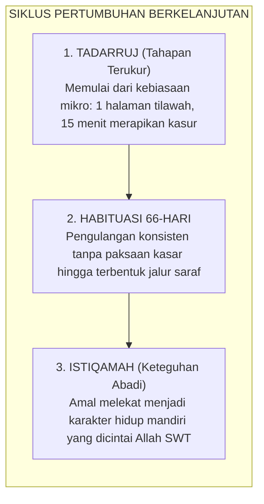
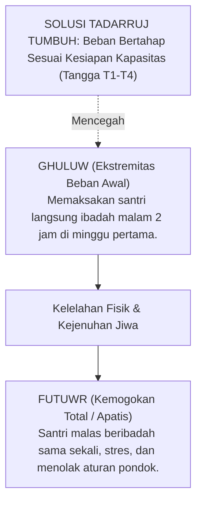

# P1-06-02: PRINSIP TADARRUJ (GRADUALISME) DAN ISTIQAMAH (KONSISTENSI)
## *Sunnatullah Tahapan Perubahan, Kaidah Ahabbul A'mali Ila Allah Adwamuha, dan Pembentukan Budaya Mutu Pesantren*

**Nomor Identifikasi**: `P1-06-02/TADARRUJ-ISTIQAMAH/2026`  
**Domain**: `01 Philosophy` > `06 Change`  
**Dewan Pakar**: `pakar-filosofi-tumbuh`, `pakar-epistemologi-turats`, `pakar-pedagogi-master-guru`

---

## 📑 DAFTAR ISI ANALITIS

1. [1. Dualitas Fundamental: Tadarruj dalam Memulai, Istiqamah dalam Memelihara](#1-dualitas-fundamental-tadarruj-dalam-memulai-istiqamah-dalam-memelihara)
2. [2. Khazanah Hadits: Keutamaan Amal Berkelanjutan (Adwamuha wa In Qalla)](#2-khazanah-hadits-keutamaan-amal-berkelanjutan-adwamuha-wa-in-qalla)
3. [3. Konvergensi Teori Atomic Habits (James Clear) & Kaizen Peradaban](#3-konvergensi-teori-atomic-habits-james-clear--kaizen-peradaban)
4. [4. Pencegahan Sindrom Ghuluw (Ekstremitas Awal) & Kehancuran Futuwr](#4-pencegahan-sindrom-ghuluw-ekstremitas-awal--kehancuran-futuwr)
5. [5. Implikasi bagi Standar Rutinitas Harian Santri TUMBUH](#5-implikasi-bagi-standar-rutinitas-harian-santri-tumbuh)

---

### 1. Dualitas Fundamental: Tadarruj dan Istiqamah

Dua pilar metodologis yang menjamin keberhasilan jangka panjang pendidikan karakter di pesantren adalah **Tadarruj (التَّدَرُّجُ - Bertahap secara Proporsional)** dan **Istiqamah (الِاسْتِقَامَةُ - Konsisten Berkelanjutan)**.

Banyak program kedisiplinan asrama gagal bukan karena idenya buruk, melainkan karena terjebak dalam jebakan **beban kejut (*shock load*)**: santri baru langsung dibebani ratusan aturan rumit dan target hafalan berat sejak hari pertama, yang memicu kelelahan mental (*burnout*), keputusasaan (*learned helplessness*), dan fenomena kabur massal dari pondok.

Ekosistem TUMBUH memadukan ketegasan prinsip dengan kelembutan pentahapan: melangkah dari target mikro yang realistis menuju pemantapan istiqamah seumur hidup.

---

### 2. Khazanah Hadits: Keutamaan Amal Berkelanjutan

Rasulullah SAW meletakkan standar nilai tertinggi dari sebuah amal perbuatan:

> $$\text{عَنْ عَائِشَةَ رَضِيَ اللَّهُ عَنْهَا أَنَّ رَسُولَ اللَّهِ صَلَّى اللَّهُ عَلَيْهِ وَسَلَّمَ قَالَ: سَدِّدُوا وَقَارِبُوا، وَاعْلَمُوا أَنْ لَنْ يُدْخِلَ أَحَدَكُمْ عَمَلُهُ الْجَنَّةَ، وَأَنَّ أَحَبَّ الْأَعْمَالِ إِلَى اللَّهِ أَدْوَمُهَا وَإِنْ قَلَّ}$$
> 
> *Dari Sayyidah Aisyah RA, Rasulullah SAW bersabda: "Luruskanlah (niatmu) dan dekatilah (kesempurnaan secara proporsional), dan ketahuilah bahwa amal seseorang tidak akan memasukkannya ke surga (tanpa rahmat Allah), dan **sesungguhnya amal yang paling dicintai oleh Allah adalah yang paling kontinu (*istiqamah*) dikerjakan meskipun sedikit!**"* (HR. Al-Bukhari no. 6464, Muslim no. 2818).

Hadits ini adalah pedoman emas bagi seluruh kurikulum pembiasaan santri: lebih mulia santri yang istiqamah membaca Al-Qur'an 1 lembar setiap selesai shalat daripada santri yang membaca 5 juz dalam sehari namun kemudian meninggalkannya selama berbulan-bulan.

---

### 3. Konvergensi Teori Atomic Habits & Kaizen Peradaban

Prinsip hadits nabawi ini menemukan pembenaran saintifik dalam psikologi perilaku kontemporer **Atomic Habits (James Clear, 2018)** dan filosofi manajemen mutu **Kaizen (1% Continuous Improvement)**:
* Perbaikan kecil sebesar 1% setiap hari (*marginal gains*) yang dilakukan secara konsisten selama 365 hari akan menghasilkan lompatan kualitas sebesar **37 kali lipat ($1.01^{365} = 37.78$)**.
* Sebaliknya, penurunan konsistensi sebesar 1% setiap hari akan menggerus karakter hingga mendekati angka nol ($0.99^{365} = 0.03$).

Ekosistem TUMBUH merancang rutinitas santri berbasis **Kemenangan Mikro (*Micro-Wins*)**: merayakan kemajuan-kemajuan kecil santri setiap hari untuk memicu pelepasan dopamin alami yang memperkuat sirkuit pembiasaan positif di otak.

---

### 4. Pencegahan Sindrom Ghuluw & Futuwr

Pendekatan bertahap TUMBUH dirancang secara presisi untuk memitigasi dua bahaya psikospiritual:

Rasulullah SAW bersabda: *"Sesungguhnya agama ini mudah, dan tidaklah seseorang memberat-beratkan agama melainkan ia akan dikalahkan olehnya"* (HR. Bukhari no. 39).

---

### 5. Implikasi bagi Standar Rutinitas Harian Santri TUMBUH

1. **Matriks Pentahapan Target Hafalan & Ibadah**: Santri baru di Tangga T1 memulai tahfizh dengan target terukur (misal: 0.5 halaman/hari) dengan fokus pada kefasihan makhraj, sebelum dinaikkan secara bertahap di Tangga T2 dan T3.
2. **Penguatan Logbook Istiqamah Digital**: Sistem mencatat konsistensi kehadiran shalat berjamaah dan tilawah santri, memberikan apresiasi atas *streak* (deretan hari konsisten) santri.
3. **Penyediaan Hari Pemulihan (*Rest & Reflection Day*)**: Menjamin adanya waktu luang berkualitas di akhir pekan untuk olahraga, mencuci pakaian santai, dan interaksi kekeluargaan bersama musyrif.
