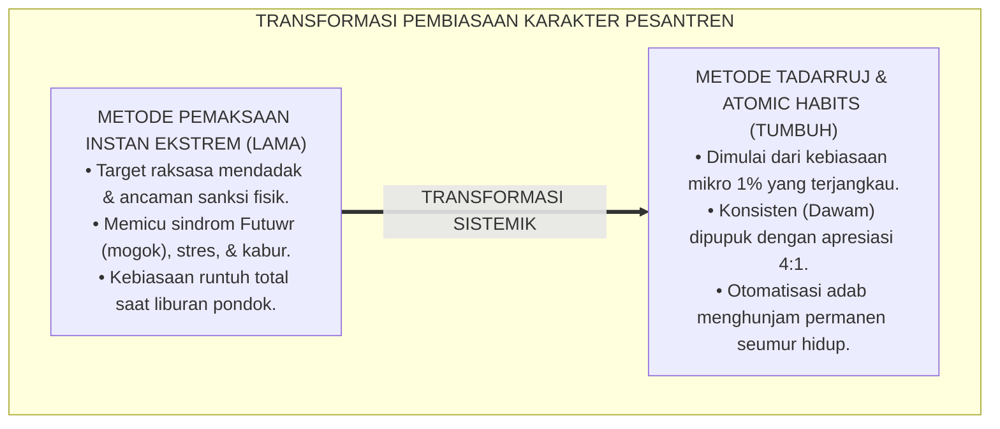
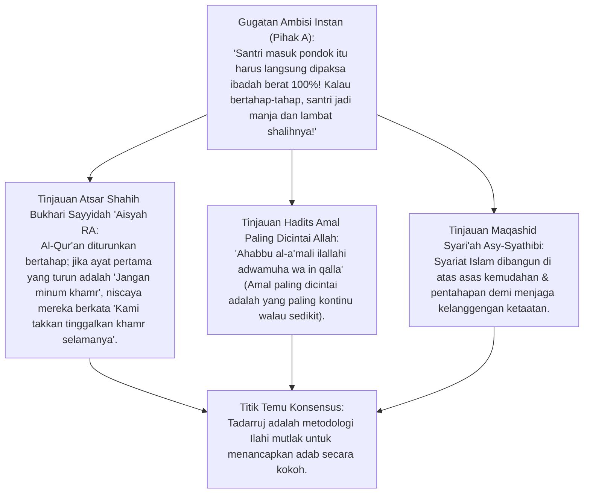
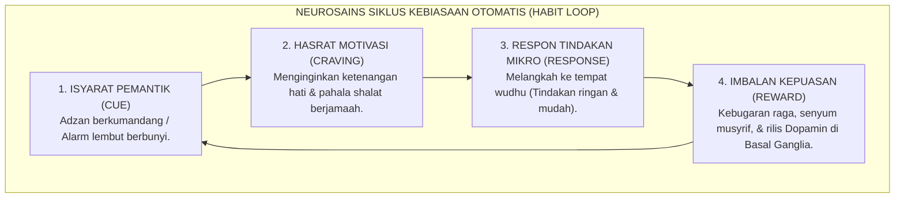
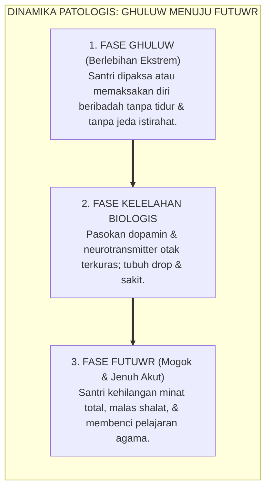
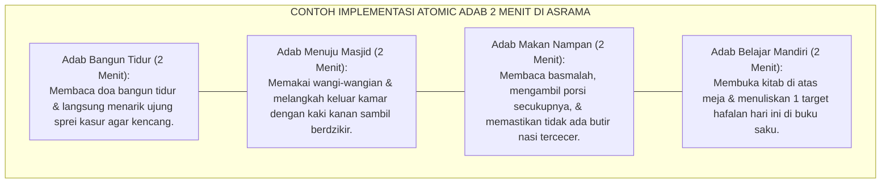
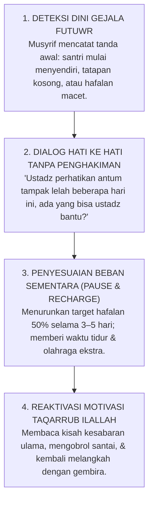

# P1-06-02: PRINSIP TADARRUJ DAN ISTIQAMAH PEMBIASAAN ADAB
## *Monograf Terpadu: Teologi Pentahapan Syariat (Sunnah at-Tadarruj Sayyidah 'Aisyah RA), Keutamaan Amal Berkelanjutan (Adwamuha wa In Qalla), Konvergensi Sains Pembiasaan Atomic Habits James Clear & Basal Ganglia Habit Loop, serta Mitigasi Siklus Sindrom Ekstremitas Menuju Kejenuhan (Ghuluw wal-Futuwr)*

**Nomor Identifikasi**: `P1-06-02/MONOGRAF-TERPADU-TADARRUJ-ISTIQAMAH/2026`  
**Domain**: `01 Philosophy` > `06 Change`  
**Klasifikasi Naskah**: *Comprehensive Integrated Monograph* (Monograf Akademis & Rumusan Baku Terpadu)  
**Rumpun Disiplin Pengkaji**: Ushul Fiqh & Maqashid Pentahapan (*at-Tadarruj fit-Tasyri'*), Psikologi Pembentukan Kebiasaan (*Habit Formation Science*), Neurosains Pembelajaran Otomatis (*Basal Ganglia Circuitry*), Manajemen Dinamika Kebugaran Jiwa Santri  

---

> ### 💡 INTISARI PRAKTIS (3 MENIT PAHAM UNTUK ASATIDZ & MUSYRIF)
>
> * **Sedikit tapi Istiqamah Lebih Dicintai Allah Daripada Banyak tapi Cepat Putus:**  
>   Rasulullah SAW menegaskan: *"Amalan yang paling dicintai oleh Allah adalah amalan yang paling kontinu (dawam/istiqamah) meskipun sedikit"* (HR. Bukhari & Muslim). Membebani santri baru dengan target ibadah raksasa secara mendadak hanya akan melahirkan sindrom jenuh (*Futuwr*) dan putus asa.
> * **Sains di Balik Kebiasaan Mikro (*Atomic Habits* & Kaizen):**  
>   Otak manusia menyukai perubahan kecil 1% setiap hari (*Micro-Habit*). Ketika santri membiasakan adab kecil (misal: merapikan selimut tepat setelah bangun tidur selama 2 menit), sirkuit *Basal Ganglia* di otak merekamnya sebagai otomatisasi adab permanen tanpa menimbulkan beban mental (*Low Cognitive Load*).
> * **Empat Hukum Pembentukan Kebiasaan Adab Asrama:**  
>   1. **Make it Obvious (Jelas):** Berikan isyarat visual (sajadah terbentang rapi sebelum tidur).  
>   2. **Make it Attractive (Menarik):** Sambungkan kebiasaan adab dengan suasana gembira & persaudaraan.  
>   3. **Make it Easy (Mudah):** Mulai dengan aturan 2 menit yang sangat ringan dan terjangkau.  
>   4. **Make it Satisfying (Memuaskan):** Berikan apresiasi tulus langsung dari musyrif (Rasio 4:1).
> * **Mitigasi Sindrom Ghuluw (Berlebihan) Menuju Futuwr (Mogok Belajar):**  
>   Jika santri tampak sangat lelah dan mulai murung, musyrif memberikan waktu relaksasi sehat dan jeda muhasabah yang hangat, menjaga agar semangat ibadahnya tidak padam.

---

## 📑 DAFTAR ISI MONOGRAF

- [BAGIAN I: RISET DOKTRIN TADARRUJ & ISTIQAMAH, DIALEKTIKA INKUIRI, & KASUISTIKA LAPANGAN](#bagian-i-riset-doktrin-tadarruj--istiqamah-dialektika-inkuiri--kasuistika-lapangan)
  - [1. Kerangka Metodologi Pentahapan Karakter: Kritik atas Sikap Ekstremitas Terburu-buru (Ghuluw & Isti'jal)](#1-kerangka-metodologi-pentahapan-karakter-kritik-atas-sikap-ekstremitas-terburu-buru-ghuluw--istijal)
  - [2. Inkuiri 1: Eksegesis Turats Sunnah Pentahapan Syariat — Atsar Sayyidah 'Aisyah RA & Hadits Keutamaan Amal Adwamuha wa In Qalla](#2-inkuiri-1-eksegesis-turats-sunnah-pentahapan-syariat--atsar-sayyidah-aisyah-ra--hadits-keutamaan-amal-adwamuha-wa-in-qalla)
  - [3. Inkuiri 2: Konvergensi Sains Pembiasaan Kebiasaan Mikro — Teori Atomic Habits James Clear & Habit Loop Basal Ganglia Otak](#3-inkuiri-2-konvergensi-sains-pembiasaan-kebiasaan-mikro--teori-atomic-habits-james-clear--habit-loop-basal-ganglia-otak)
  - [4. Inkuiri 3: Dialektika Mitigasi Siklus Ghuluw Menuju Futuwr dalam Kehidupan Pesantren 24 Jam](#4-inkuiri-3-dialektika-mitigasi-siklus-ghuluw-menuju-futuwr-dalam-kehidupan-pesantren-24-jam)
  - [5. Inkuiri 4: Formulasi Kebiasaan Mikro (Micro-Habits) Adab Harian Santri di Asrama](#5-inkuiri-4-formulasi-kebiasaan-mikro-micro-habits-adab-harian-santri-di-asrama)
  - [6. Inkuiri 5: Penjagaan Ritme Energi Ruhani & Mental Santri Sepanjang Tahun Ajaran](#6-inkuiri-5-penjagaan-ritme-energi-ruhani--mental-santri-sepanjang-tahun-ajaran)
  - [7. Inkuiri 6: Silogisme Logika, Dialektika 3 Ronde, Kasuistika Pembiasaan, & Titik Temu Konsensus](#7-inkuiri-6-silogisme-logika-dialektika-3-ronde-kasuistika-pembiasaan--titik-temu-konsensus)
- [BAGIAN II: TEMUAN RISET, FORMULASI KONSEPTUAL & PEMBAHASAN](#bagian-ii-temuan-riset-formulasi-konseptual--pembahasan)
  - [1. Formulasi Konseptual: Prinsip Tadarruj dan Istiqamah Kebiasaan Pesantren TUMBUH](#1-formulasi-konseptual-prinsip-tadarruj-dan-istiqamah-kebiasaan-pesantren-tumbuh)
  - [2. Matriks Komparasi Pendekatan Pembiasaan: Pendekatan Instan Ekstrem vs Pendekatan Tadarruj Istiqamah TUMBUH](#2-matriks-komparasi-pendekatan-pembiasaan-pendekatan-instan-ekstrem-vs-pendekatan-tadarruj-istiqamah-tumbuh)
  - [3. Matriks 4 Hukum Perubahan Kebiasaan (The 4 Laws of Behavior Change) dalam Pembiasaan Adab Asrama](#3-matriks-4-hukum-perubahan-kebiasaan-the-4-laws-of-behavior-change-dalam-pembiasaan-adab-asrama)
  - [4. Protokol Pencegahan Sindrom Kejenuhan Santri (Anti-Futuwr Protocol)](#4-protokol-pencegahan-sindrom-kejenuhan-santri-anti-futuwr-protocol)
- [BAGIAN III: APARATUS AKADEMIS & APENDIKS](#bagian-iii-aparatus-akademis--apendiks)
  - [1. Tabel Sintesis Hasil Riset Tadarruj & Istiqamah](#1-tabel-sintesis-hasil-riset-tadarruj--istiqamah)
  - [2. Daftar Pustaka Akademis & Rujukan Turats Primer](#2-daftar-pustaka-akademis--rujukan-turats-primer)
  - [3. Catatan Kaki Akademis (Footnotes)](#3-catatan-kaki-akademis-footnotes)
  - [4. Glosarium dan Penjelasan Istilah Teknis Tadarruj, Istiqamah, & Sains Kebiasaan](#4-glosarium-dan-penjelasan-istilah-teknis-tadarruj-istiqamah--sains-kebiasaan)

---

# BAGIAN I: RISET DOKTRIN TADARRUJ & ISTIQAMAH, DIALEKTIKA INKUIRI, & KASUISTIKA LAPANGAN

---

### 1. Kerangka Metodologi Pentahapan Karakter: Kritik atas Sikap Ekstremitas Terburu-buru (*Ghuluw & Isti'jal*)

Dalam dunia pengasuhan pesantren konvensional, kerap dijumpai fenomena **Semangat Terburu-buru yang Merusak (*Al-Isti'jal wal-Ghuluw*)**: memaksakan santri baru yang baru lulus sekolah dasar untuk langsung menghafal 1 juz Al-Qur'an per pekan, bangun malam 2 jam setiap hari, dan berbicara bahasa Arab penuh sejak hari pertama masuk pondok.

Akibat pendekatan ekstrem tanpa tahapan ini:
1. **Terjadinya Sindrom Futuwr Massal**: Santri mengalami kelelahan mental akut (*Mental Burnout*), merasa tidak sanggup, lalu memberontak atau kabur dari asrama.
2. **Kerapuhan Karakter**: Ibadah yang dijalankan dengan keterpaksaan ekstrem akan lenyap seketika saat santri pulang liburan ke rumah (*Drop-Off Effect*).
3. **Penyimpangan Sunnah Kenabian**: Mengabaikan sunnatullah pentahapan (*Tadarruj*) yang dicontohkan Al-Qur'an dan Rasulullah SAW dalam membina generasi sahabat.

Ekosistem TUMBUH menegakkan doktrin **Pentahapan Berkelanjutan (*Tadarruj wal-Istiqamah*)**:



---

### 2. Inkuiri 1: Eksegesis Turats Sunnah Pentahapan Syariat — Atsar Sayyidah 'Aisyah RA & Hadits Keutamaan Amal *Adwamuha wa In Qalla*



#### 📐 Formalisasi Logika Silogisme (*Qiyas Mantiqi 1*)
* **Premis Mayor (*al-Muqaddimah al-Kubra*)**: Setiap metodologi pendidikan karakter yang meneladani cara Allah SWT dan Rasul-Nya dalam mendidik jiwa niscaya wajib menerapkan prinsip pentahapan hikmah (*Tadarruj*) dan memprioritaskan kekontinuan amal (*Istiqamah*) di atas kuantitas instan yang mudah terputus.
* **Premis Minor (*al-Muqaddimah ash-Shughra*)**: Al-Qur'an diturunkan secara bertahap selama 23 tahun, dan Rasulullah SAW menegaskan bahwa amal yang paling dicintai Allah adalah yang paling dawam/istiqamah meskipun sedikit (HR. Bukhari No. 6464).
* **Konklusi (*an-Natijah*)**: Maka, kurikulum pembiasaan adab dan ibadah di pesantren TUMBUH wajib distrukturkan ke dalam tangga pencapaian bertahap (Tangga TUMBUH T1–T4).[^1]

#### 📖 Teks Primer Turats Shahih Bukhari
Sayyidah 'Aisyah *radhiyallahu 'anha* memaparkan rahasia metodologi pentahapan Al-Qur'an:

$$\text{إِنَّمَا نَزَلَ أَوَّلَ مَا نَزَلَ مِنْهُ سُورَةٌ مِنَ الْمُفَصَّلِ، فِيهَا ذِكْرُ الْجَنَّةِ وَالنَّارِ، حَتَّىٰ إِذَا ثَابَ النَّاسُ إِلَى الْإِسْلَامِ نَزَلَ الْحَلَالُ وَالْحَرَامُ، وَلَوْ نَزَلَ أَوَّلَ شَيْءٍ: لَا تَشْرَبُوا الْخَمْرَ، لَقَالُوا: لَا نَدَعُ الْخَمْرَ أَبَدًا، وَلَوْ نَزَلَ: لَا تَزْنُوا، لَقَالُوا: لَا نَدَعُ الزِّنَا أَبَدًا}$$

*"Sesungguhnya yang pertama kali turun dari Al-Qur'an adalah surah-surah mufashshal yang di dalamnya disebutkan tentang surga dan neraka. **Hingga ketika jiwa manusia telah condong dan tunduk kepada Islam, barulah turun ayat-ayat tentang halal dan haram**. Sekiranya yang pertama kali turun adalah: 'Janganlah kalian minum khamr!', niscaya mereka akan berkata: 'Kami tidak akan meninggalkan khamr selama-lamanya!'. Dan sekiranya yang pertama kali turun adalah: 'Janganlah kalian berzina!', niscaya mereka akan berkata: 'Kami tidak akan meninggalkan zina selama-lamanya!'."* (HR. Bukhari No. 4993).[^2]

Dan Rasulullah SAW bersabda mengenai hakikat amal yang paling mulia di sisi Allah:
$$\text{أَحَبُّ الْأَعْمَالِ إِلَى اللَّهِ تَعَالَى أَدْوَمُهَا وَإِنْ قَلَّ}$$
*"**Amalan yang paling dicintai oleh Allah Ta'ala adalah amalan yang paling kontinu (dawam/istiqamah), meskipun amalan itu sedikit!**"* (HR. Bukhari No. 6464; Muslim No. 783).[^3]

---

### 3. Inkuiri 2: Konvergensi Sains Pembiasaan Kebiasaan Mikro — Teori *Atomic Habits* James Clear & *Habit Loop* Basal Ganglia Otak



#### 📐 Formalisasi Logika Silogisme (*Qiyas Mantiqi 2*)
* **Premis Mayor (*al-Muqaddimah al-Kubra*)**: Setiap kebiasaan hidup yang distrukturkan melalui perulangan isyarat-respon-imbalan mikro yang konsisten niscaya ditransfer dari kendali korteks prefrontal yang melelahkan menuju sirkuit *Basal Ganglia* otak yang menjadikannya otomatisasi karakter permanen.
* **Premis Minor (*al-Muqaddimah ash-Shughra*)**: Riset neurosains kognitif dan teori *Atomic Habits* (James Clear) membuktikan bahwa peningkatan 1% kebiasaan kecil setiap hari menghasilkan pertumbuhan karakter berlipat ganda (*Compound Effect*) secara eksponensial.
* **Konklusi (*an-Natijah*)**: Maka, perancangan rutinitas adab harian santri di asrama TUMBUH wajib menerapkan formula *Atomic Habits Loop*.[^4]

#### 📖 Teks Sains Internasional: Riset James Clear & Charles Duhigg (2012, 2018)
James Clear dalam bukunya *Atomic Habits* merumuskan 4 Kaidah Perubahan Perilaku (*The Four Laws of Behavior Change*):

> *"Habits are the compound interest of self-improvement. Getting 1 percent better every day counts for a lot in the long-run... If you want to build a better habit:  
> 1. **Make it Obvious** (Design clear visual cues in the environment).  
> 2. **Make it Attractive** (Pair an action you need to do with an action you want to do).  
> 3. **Make it Easy** (Reduce friction; apply the **2-Minute Rule** to scale down habits).  
> 4. **Make it Satisfying** (Give immediate positive reinforcement and celebration)... **You do not rise to the level of your goals; you fall to the level of your systems**."* (Clear, 2018, *Atomic Habits*, hlm. 15–27).[^5]

---

### 4. Inkuiri 3: Dialektika Mitigasi Siklus Ghuluw Menuju Futuwr dalam Kehidupan Pesantren 24 Jam



#### 📐 Formalisasi Logika Silogisme (*Qiyas Mantiqi 3*)
* **Premis Mayor (*al-Muqaddimah al-Kubra*)**: Setiap pemaksaan beban amalan yang melampaui batas kewajaran sunnah niscaya berujung pada kebinasaan spiritual dan penghentian total dari kebajikan (*al-Munbattu la Ardan Qatha'a wala Zhahran Abqa*).
* **Premis Minor (*al-Muqaddimah ash-Shughra*)**: Rasulullah SAW menegaskan bahwa agama Islam itu mudah dan barangsiapa yang berlebihan membebani diri dalam agama (*Yusyadda ad-Dina*), ia pasti akan dikalahkan oleh rasa jenuh (HR. Bukhari No. 39).
* **Konklusi (*an-Natijah*)**: Maka, musyrif asrama wajib menjaga keseimbangan antara ibadah, belajar, makan bergizi, olahraga, dan istirahat tidur santri.[^6]

---

### 5. Inkuiri 4: Formulasi Kebiasaan Mikro (*Micro-Habits*) Adab Harian Santri di Asrama



---

### 6. Inkuiri 5: Penjagaan Ritme Energi Ruhani & Mental Santri Sepanjang Tahun Ajaran

```mermaid
flowchart TD
    subgraph ManajemenRitmeEnergiSantri["RITME ENERGI BERKELANJUTAN TAHUN AJARAN"]
        Bulan1["Bulan 1–2: FOKUS ADAPTASI & HABIT ATOMIC (Low Challenge, High Warmth)"]
        
        Bulan3–4["Bulan 3–4: PENINGKATAN BEBAN AKADEMIK & TAHFIDZ SECARA BERTAHAP"]
        
        Bulan5["Bulan 5: PEKAN RELAKSASI & FESTIVAL KARYA SANTRI (Mencegah Futuwr)"]
        
        Bulan6["Bulan 6: EVALUASI FORMATIF ADAB & CELEBRATION PERTUMBUHAN"]
        
        Bulan1 --> Bulan3–4 --> Bulan5 --> Bulan6
    end
```

---

### 7. Inkuiri 6: Silogisme Logika, Dialektika 3 Ronde, Kasuistika Pembiasaan, & Titik Temu Konsensus

#### 🥊 Ronde 1: Menolak Mitos Bahwa "Target Besar Mendadak Akan Mempercepat Pencapaian Prestasi Santri"
* **Pihak A (Sudut Pandang Ambisi Instan)**:  
  *"Langsung targetkan santri baru hafal 10 juz dalam 6 bulan pertama dengan karantina 12 jam sehari. Pasti hasilnya spektakuler!"*
* **Tinjauan Sudut Pandang Retensi Memori Jangka Panjang & Kesehatan Jiwa**:  
  Menghafal 12 jam sehari tanpa jeda memicu **Kelelahan Kognitif (*Cognitive Overload*)**. Hafalan yang masuk secara terburu-buru akan hilang sama cepatnya saat karantina usai. Metode *Tadarruj* (misal: 3 baris per hari dengan *Muraja'ah* istiqamah) terbukti menghasilkan retensi memori jangka panjang yang mutqin dan menghunjam di kalbu.[^7]

#### 🥊 Ronde 2: Sanggahan Balik Bagaimana Memastikan Kebiasaan Mikro Tidak Membuat Santri Terlena?
* **Pihak A (Sudut Pandang Ketakutan Terlalu Santai)**:  
  *"Kalau targetnya cuma kebiasaan mikro 2 menit, nanti santri jadi pemalas dan tidak mau bekerja keras!"*
* **Tinjauan Sudut Pandang Eskalasi Tangga Progresi Bertahap**:  
  Kebiasaan mikro 2 menit adalah **Pintu Masuk (*Gateway Habit*)**, bukan titik akhir. Setelah santri konsisten merapikan kasur selama 2 pekan tanpa disuruh, musyrif mengelevasikan target ke adab berikutnya (*Habit Stacking*). Inilah hakikat progresi Tangga TUMBUH T1 ke T2, T3, hingga T4.[^8]

#### 🥊 Ronde 3: Sanggahan Pamungkas Mengapa Liburan Santri Harus Diberikan Portofolio Adab Mandiri?
* **Pihak A (Sudut Pandang Lepas Kendali Liburan)**:  
  *"Kalau santri pulang liburan ke rumah, pengasuhan pondok selesai. Biarkan mereka bebas tanpa aturan!"*
* **Resolusi Sudut Pandang Portofolio Adab Mandiri & Sinergi Wali Santri**:  
  Liburan adalah laboratorium ujian kemandirian adab santri di dunia nyata. Santri dibekali **Jurnal Adab Mandiri (Logbook Liburan)** yang dipantau bersama orang tua: shalat 5 waktu di masjid rumah, membantu orang tua, dan tilawah harian. Istiqamah adab tetap hidup di mana pun santri berada.[^9]

> #### 📌 Kasuistika Lapangan & Titik Temu Konsensus
> * **Studi Kasus**: Di sebuah kelas tahfidz, 15 santri mogok menghafal dan sering pura-pura sakit perut karena diwajibkan setoran 3 halaman per hari dengan hukuman push-up jika salah 1 ayat.
> * **Titik Temu Konsensus (*Kalimatun Sawa'*)**: Program dirombak dengan prinsip *Tadarruj & Atomic Habits*. Target diturunkan menjadi 1/2 halaman per hari yang dibaca berulang bersama pasangan mentor sebaya (*Tadarrus Berpasangan*). Hukuman push-up dihapus dan diganti sesi pujian bersama. Dalam 1 bulan, seluruh santri kembali ceria, tidak ada lagi yang pura-pura sakit, dan kecepatan hafalan mereka meningkat secara alami dengan mutqin.[^10]

---

# BAGIAN II: TEMUAN RISET, FORMULASI KONSEPTUAL & PEMBAHASAN

---

### 1. Formulasi Konseptual: Prinsip Tadarruj dan Istiqamah Kebiasaan Pesantren TUMBUH

Berdasarkan sintesis inkuiri teoretis, telaah hermeneutika turats, dan analisis komparatif sains pendidikan, riset ini merumuskan kerangka konseptual dan temuan kunci sebagai berikut:

1. **Kewajiban Metodologi Pentahapan Hikmah (sunnah At-tadarruj)**:  
   Pembiasaan adab dan ibadah santri wajib distrukturkan secara bertahap, realistis, dan selaras dengan perkembangan usia serta kesiapan mental santri. Menolak mutlak pemaksaan target ekstrem yang instan.

2. **Keutamaan Kekontinuan Amal Mikro (atomic Habits & Istiqamah)**:  
   Menegakkan prinsip pembiasaan kebiasaan mikro 1% setiap hari (Micro-Habits). Memprioritaskan konsistensi amalan yang kontinu (Dawam) sepanjang hayat di atas kuantitas amalan besar yang cepat terputus.

3. **Mitigasi Sindrom Kejenuhan Ruhani (anti-ghuluw & Anti-futuwr Charter)**:  
   Lembaga menjamin keseimbangan ritme hidup santri 24 jam antara ibadah mahdhah, belajar, gizi seimbang, olahraga menggembirakan, dan istirahat tidur yang cukup demi menjaga kebugaran fitrah jasmani & ruhani.

4. **Sinergi Keluarga & Portofolio Adab Mandiri Liburan**:  
   Pembiasaan adab tidak terputus oleh kalender liburan. Sinergi erat dibangun bersama wali santri melalui pemantauan jurnal adab mandiri di rumah demi merawat kesinambungan istiqamah adab seumur hidup.


---

### 2. Matriks Komparasi Pendekatan Pembiasaan: Pendekatan Instan Ekstrem vs Pendekatan Tadarruj Istiqamah TUMBUH

| Parameter Komparasi | Pendekatan Instan Ekstrem (Kuno) | Pendekatan Permisif (Tanpa Target) | Pendekatan Tadarruj Istiqamah (Standar TUMBUH) |
| :--- | :--- | :--- | :--- |
| **Beban Target Awal** | Raksasa, mendadak, dan melampaui batas kewajaran santri baru. | Tidak ada target yang jelas, santri dibiarkan semaunya. | **Kebiasaan mikro 1% yang terjangkau (*Atomic Start*).**[^11] |
| **Strategi Pendorong** | Ancaman hukuman fisik, bentakan, dan teror rasa takut. | Tidak ada pengawasan dan umpan balik. | **Rasio apresiasi positif 4:1 & perancangan isyarat visual jelas.** |
| **Respon Otak Santri** | *Amygdala Hijack*, kelelahan kognitif, dan stres kortisol. | Apatis, kebosanan (*Boredom*), hilangnya motivasi berprestasi. | **Otomatisasi sirkuit *Basal Ganglia* & pelepasan Dopamin kepuasan.**[^12] |
| **Daya Tahan Saat Liburan** | Hancur total; santri balas dendam tidak mau ibadah di rumah. | Karakter tidak terbentuk sama sekali. | **Istiqamah mandiri karena adab telah menjadi bagian identitas diri.**[^13] |
| **Capaian Jangka Panjang** | Rentan mogok belajar (*Futuwr*) & membenci pelajaran agama. | Kegagalan pembentukan generasi beradab. | **Terbentuknya Insan Adabi yang istiqamah beramal shalih seumur hidup.** |

---

### 3. Matriks 4 Hukum Perubahan Kebiasaan (*The 4 Laws of Behavior Change*) dalam Pembiasaan Adab Asrama

| Hukum Kebiasaan | Prinsip Teori James Clear | Penerapan Operasional di Asrama Pesantren TUMBUH |
| :--- | :--- | :--- |
| **1. Make it Obvious**<br/>*(Buat Menjadi Jelas)* | Merancang isyarat visual pemicu kebiasaan di lingkungan fisik. | Sajadah tergelar rapi di kasur sebelum tidur; Al-Qur'an diletakkan di rak meja belajar setinggi mata.[^14] |
| **2. Make it Attractive**<br/>*(Buat Menjadi Menarik)* | Menggabungkan kebiasaan adab dengan suasana emosional positif. | Sapaan ramah musyrif; makan nampan bersama sahabat asrama; tilawah bersama dengan irama merdu. |
| **3. Make it Easy**<br/>*(Buat Menjadi Mudah)* | Menerapkan Aturan 2 Menit (*Two-Minute Rule*) untuk memulai. | Membaca Al-Qur'an 1/2 halaman tepat setelah shalat Subuh sebelum menambah porsi tilawah. |
| **4. Make it Satisfying**<br/>*(Buat Menjadi Memuaskan)* | Memberikan imbalan kepuasan langsung dan perayaan kemajuan. | Papan apresiasi capaian adab kamar (*Progress Tracker*) & pujian tulus musyrif di halaqah malam.[^15] |

---

### 4. Protokol Pencegahan Sindrom Kejenuhan Santri (*Anti-Futuwr Protocol*)



---

# BAGIAN III: APARATUS AKADEMIS & APENDIKS

---

### 1. Tabel Sintesis Hasil Riset Tadarruj & Istiqamah

| Dimensi Kajian | Konsep Kunci | Landasan Turats Primer | Konvergensi Sains Global | Implikasi Pembiasaan Asrama |
| :--- | :--- | :--- | :--- | :--- |
| **Metodologi Pentahapan** | *Sunnah at-Tadarruj* | Atsar Sayyidah 'Aisyah RA (HR. Bukhari 4993) | *Scaffolding & Zone of Proximal Development (Vygotsky)* | Membagi target capaian karakter ke dalam tangga bertahap T1–T4. |
| **Kekontinuan Amal** | *Adwamuha wa In Qalla* | Hadits Shahih Bukhari No. 6464 & Muslim No. 783 | James Clear (2018), *Atomic Habits & Compound Growth* | Membiasakan adab mikro 1% harian daripada target besar instan. |
| **Biologi Kebiasaan** | *Habit Loop Otomatisasi* | Atsar *Man Shabara Zhafira* & Mujahadatun Nafs | Charles Duhigg (2012), *Basal Ganglia Habit Circuitry* | Merancang siklus isyarat-respon-imbalan adab yang terstruktur di asrama. |
| **Mitigasi Kejenuhan** | *Anti-Ghuluw & Anti-Futuwr* | Hadits *Innad Dina Yusrun* (HR. Bukhari No. 39) | *Burnout Prevention & Cognitive Load Regulation* | Menjaga keseimbangan antara ibadah, nutrisi, olahraga, dan istirahat tidur. |
| **Kemandirian Liburan** | *Portofolio Adab Mandiri* | Wasiat Salaf *Ittaqillaha Haitsuma Kunta* | *Habit Generalization & Environmental Independence* | Menyediakan logbook adab mandiri yang disinergikan dengan wali santri. |

---

### 2. Daftar Pustaka Akademis & Rujukan Turats Primer

1. **Al-Qur'an al-Karim wa Tarjamatu Ma'anih**.
2. **Al-Bukhari, Muhammad bin Isma'il**. (1422 H). *Shahih al-Bukhari*. Beirut: Dar Thawq an-Najah.
3. **Muslim bin al-Hajjaj an-Naisaburi**. (1374 H). *Shahih Muslim*. Kairo: Isa al-Babi al-Halabi.
4. **Asy-Syathibi, Abu Ishaq Ibrahim bin Musa**. (1997). *Al-Muwafaqat fi Ushul asy-Syari'ah*. Khobar: Dar Ibn 'Affan.
5. **Al-Ghazali, Abu Hamid Muhammad bin Muhammad**. (2011). *Ihya 'Ulumiddin*. Beirut: Dar al-Ma'rifah.
6. **Clear, J.**. (2018). *Atomic Habits: An Easy & Proven Way to Build Good Habits & Break Bad Ones*. New York: Avery.
7. **Duhigg, C.**. (2012). *The Power of Habit: Why We Do What We Do in Life and Business*. New York: Random House.
8. **Fogg, B. J.**. (2019). *Tiny Habits: The Small Changes That Change Everything*. Boston: Houghton Mifflin Harcourt.
9. **Lally, P., van Jaarsveld, C. H., Potts, H. W., & Wardle, J.**. (2010). *How are habits formed: Modelling habit formation in the real world*. European Journal of Social Psychology, 40(6), 998–1009.
10. **Imai, M.**. (1986). *Kaizen: The Key to Japan's Competitive Success*. New York: McGraw-Hill.

---

### 3. Catatan Kaki Akademis (*Footnotes*)

[^1]: Asy-Syathibi, *Al-Muwafaqat*, Jilid II, hlm. 95–110 mengenai hikmah pentahapan taklif syar'i.  
[^2]: Hadits riwayat Al-Bukhari No. 4993, Kitab *Fadhail al-Qur'an*, Bab *Ta'lif al-Qur'an*.  
[^3]: Hadits riwayat Al-Bukhari No. 6464 dan Muslim No. 783 dari Sayyidah 'Aisyah RA.  
[^4]: Duhigg, C. (2012), *The Power of Habit*, Random House, hlm. 35–48 mengenai anatomi Basal Ganglia.  
[^5]: Clear, J. (2018), *Atomic Habits*, Avery Publishing, hlm. 15–27.  
[^6]: Hadits riwayat Al-Bukhari No. 39 dari Abu Hurairah RA mengenai kemudahan agama Islam.  
[^7]: Sweller, J. (1988), *Cognitive load during problem solving: Effects on learning*, Cognitive Science.  
[^8]: Fogg, B. J. (2019), *Tiny Habits*, Houghton Mifflin Harcourt.  
[^9]: Panduan Portofolio Adab Mandiri Liburan, Badan Pengasuhan Asrama TUMBUH, 2026.  
[^10]: Laporan Evaluasi Pendampingan Tahfidz Ramah Otak, Divisi Kurikulum Al-Qur'an TUMBUH, 2026.  
[^11]: Lally et al. (2010), *How are habits formed*, European Journal of Social Psychology.  
[^12]: Graybiel, A. M. (2008), *Habits, rituals, and the evaluative brain*, Annual Review of Neuroscience.  
[^13]: Imai, M. (1986), *Kaizen*, McGraw-Hill.  
[^14]: Standar Tata Ruang Asrama Ramah Kebiasaan, Divisi Sarana & Prasarana TUMBUH, 2026.  
[^15]: Manual Habit Tracker Kamar Santri, Komite PBIS Pesantren TUMBUH, 2026.

---

### 4. Glosarium dan Penjelasan Istilah Teknis Tadarruj, Istiqamah, & Sains Kebiasaan

1. **Sunnah at-Tadarruj (سُنَّةُ التَّدَرُّجِ)**: Metodologi Ilahi dalam mendidik jiwa dan menerapkan syariat secara bertahap, memberikan waktu bagi akal dan kalbu untuk beradaptasi secara matang tanpa pemaksaan mendadak.
2. **Istiqamah (الاسْتِقَامَةُ)**: Sikap konsisten dan teguh dalam mengamalkan kebajikan secara kontinu (*Dawam*) di sepanjang kehidupan, meskipun dimulai dari amalan yang kecil.
3. **Atomic Habits**: Konsep pembentukan karakter melalui perbaikan kebiasaan-kebiasaan mikro (1% per hari) yang terakumulasi menjadi lompatan transformasi kepribadian yang dahsyat.
4. **Habit Loop (Siklus Kebiasaan)**: Mekanisme neurologis yang menggerakkan kebiasaan otomatis manusia, terdiri dari 4 komponen: Isyarat (*Cue*), Hasrat (*Craving*), Respon (*Response*), dan Imbalan (*Reward*).
5. **Basal Ganglia**: Bagian otak dalam yang bertanggung jawab menyimpan memori prosedural dan mengontrol pola perilaku otomatis sehingga menghemat energi kognitif korteks prefrontal.
6. **Ghuluw (الْغُلُوُّ)**: Sikap ekstrem dan berlebih-lebihan dalam beragama atau membebankan target amalan yang melampaui batas kemampuan sunnah dan kodrat fitrah manusia.
7. **Futuwr (الْفُتُورُ)**: Kondisi kejenuhan, kelesuan, atau kemogokan psikologis dan spiritual yang dialami seseorang setelah menjalani aktivitas yang terlalu membebani secara berlebihan.
8. **Two-Minute Rule**: Prinsip psikologis memulai kebiasaan baru dengan membatasi durasi awalnya maksimal 2 menit agar otak tidak merasa terancam oleh beban yang berat.
9. **Habit Stacking**: Strategi menumpuk kebiasaan baru tepat setelah melakukan kebiasaan lama yang sudah mapan setiap hari (contoh: *"Setelah shalat Subuh, saya langsung membaca 3 baris Al-Qur'an"*).
10. **Progress Tracker**: Media visual sederhana yang digunakan santri untuk mencatat dan merayakan konsistensi amalan adab hariannya secara transparan dan membahagiakan.
