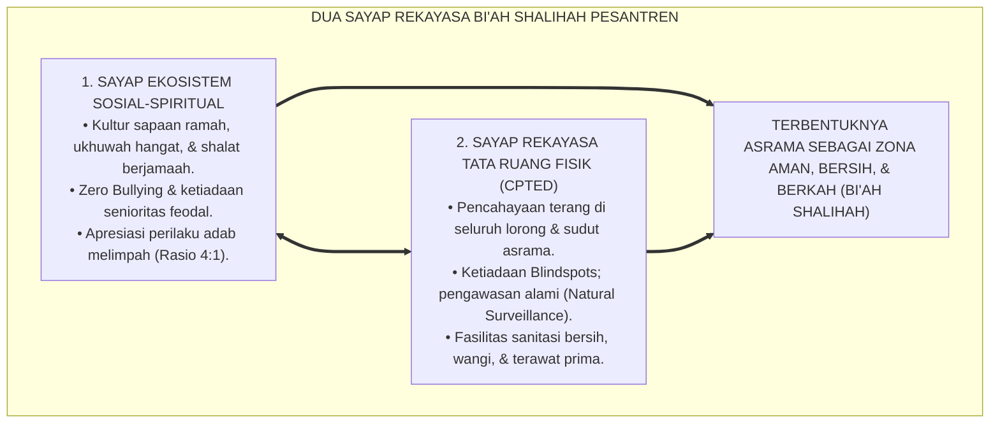
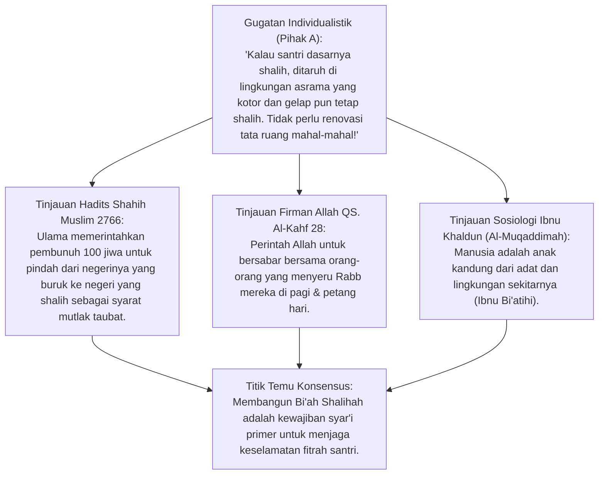
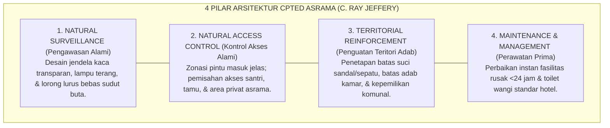
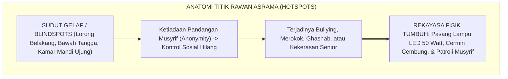
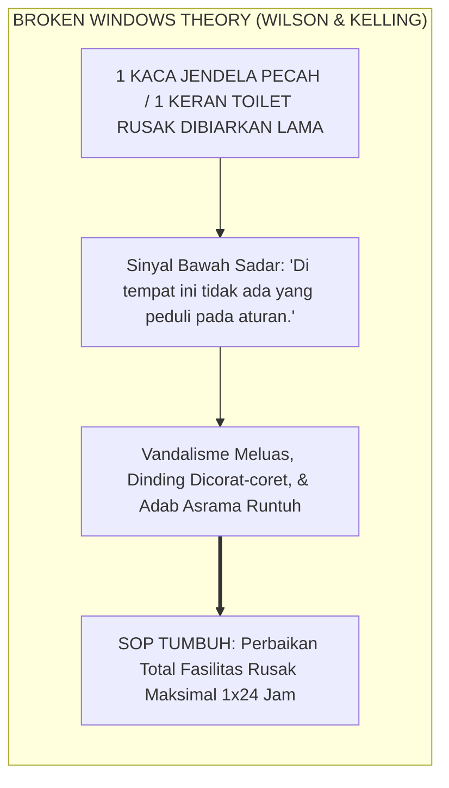
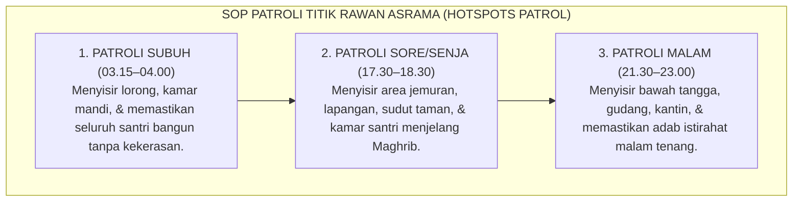
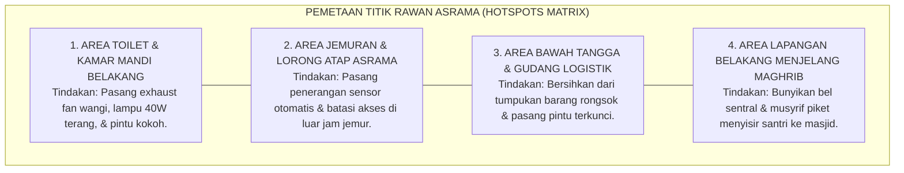
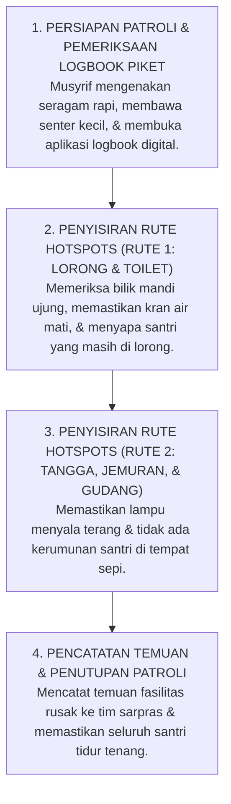

# P1-06-03: EKOSISTEM BI'AH SHALIHAH DAN REKAYASA DESAIN LINGKUNGAN ASRAMA
## *Monograf Terpadu: Teologi Lingkungan Suci dalam Turats (Hadits Hijrah Pembunuh 100 Jiwa HR. Muslim & QS. Al-Kahf: 28), Konvergensi Crime Prevention Through Environmental Design (CPTED C. Ray Jeffery) & Nudge Theory Richard Thaler, Mitigasi Titik Rawan (Hotspots), serta Protokol Patroli Asrama 24 Jam Bebas Blindspots*

**Nomor Identifikasi**: `P1-06-03/MONOGRAF-TERPADU-BIAH-SHALIHAH-CPTED/2026`  
**Domain**: `01 Philosophy` > `06 Change`  
**Klasifikasi Naskah**: *Comprehensive Integrated Monograph* (Monograf Akademis & Rumusan Baku Terpadu)  
**Rumpun Disiplin Pengkaji**: Ekologi Sosial Islam (*Fiqh al-Bi'ah wal-Mujtama'*), Arsitektur Lingkungan Pencegahan Kejahatan (*CPTED*), Psikologi Tata Ruang (*Environmental Psychology*), Manajemen Keamanan & Keselamatan Asrama Pesantren  

---

> ### 💡 INTISARI PRAKTIS (3 MENIT PAHAM UNTUK ASATIDZ & MUSYRIF)
>
> * **Karakter Santri Sangat Dipengaruhi oleh Lingkungan Fisik & Sosial (*Bi'ah Shalihah*):**  
>   Kisah agung pembunuh 100 jiwa dalam hadits Shahih Muslim membuktikan bahwa taubat sejati mensyaratkan perpindahan lingkungan. Ulama menasihatkannya: *"Tinggalkan negerimu yang buruk, dan pergilah ke negeri tempat orang-orang shalih beribadah!"*. Pesantren harus dirancang sebagai **Bi'ah Shalihah 24 Jam** yang menyuburkan adab dan mematikan peluang kemaksiatan.
> * **Rekayasa Tata Ruang Mencegah Kekerasan (Prinsip CPTED & Nudge):**  
>   Perundungan (*Bullying*) dan pelanggaran adab terjadi bukan semata-mata karena santri berniat jahat, melainkan karena ada **Peluang dari Tata Ruang yang Buruk (Sudut Gelap / Blindspots)**. Dengan memasang lampu terang di lorong, mendesain ventilasi terbuka, dan menata cermin pantau, peluang berbuat curang turun drastis.
> * **Empat Prinsip Desain Lingkungan Asrama (CPTED):**  
>   1. **Natural Surveillance (Pengawasan Alami):** Lorong dan halaman dapat terlihat jelas dari kamar musyrif.  
>   2. **Access Control (Kontrol Akses):** Pintu gerbang dan zona asrama memiliki batas akses yang teratur.  
>   3. **Territorial Reinforcement (Rasa Kepemilikan):** Santri merawat dan menghias kamarnya dengan bangga.  
>   4. **Maintenance & Cleanliness (Kebersihan Fasilitas):** Toilet dan kamar mandi yang bersih, wangi, dan terang mencegah vandalisme (*Broken Windows Theory*).
> * **Patroli Titik Rawan (*Hotspots Active Patrol*):**  
>   Musyrif piket melakukan patroli terjadwal di jam-jam rawan (menjelang Maghrib, setelah Isya, dan sebelum Subuh) di area rawan (kamar mandi belakang, gudang, tangga sepi, dan jemuran).

---

## 📑 DAFTAR ISI MONOGRAF

- [BAGIAN I: RISET DOKTRIN BI'AH SHALIHAH, REKAYASA LINGKUNGAN, DIALEKTIKA INKUIRI, & KASUISTIKA LAPANGAN](#bagian-i-riset-doktrin-biah-shalihah-rekayasa-lingkungan-dialektika-inkuiri--kasuistika-lapangan)
  - [1. Kerangka Metodologi Pengaruh Lingkungan: Ekosistem Sosial & Tata Ruang Fisik Pembentuk Jiwa](#1-kerangka-metodologi-pengaruh-lingkungan-ekosistem-sosial--tata-ruang-fisik-pembentuk-jiwa)
  - [2. Inkuiri 1: Eksegesis Turats Hakikat Bi'ah Shalihah — Hadits Pembunuh 100 Jiwa (HR. Muslim) & QS. Al-Kahf: 28](#2-inkuiri-1-eksegesis-turats-hakikat-biah-shalihah--hadits-pembunuh-100-jiwa-hr-muslim--qs-al-kahf-28)
  - [3. Inkuiri 2: Konvergensi Teori Rekayasa Lingkungan Fisik — CPTED C. Ray Jeffery & Nudge Theory Richard Thaler](#3-inkuiri-2-konvergensi-teori-rekayasa-lingkungan-fisik--cpted-c-ray-jeffery--nudge-theory-richard-thaler)
  - [4. Inkuiri 3: Mitigasi Titik Rawan Asrama (Hotspots): Mengapa Sudut Gelap & Blindspots Memicu Pelanggaran](#4-inkuiri-3-mitigasi-titik-rawan-asrama-hotspots-mengapa-sudut-gelap--blindspots-memicu-pelanggaran)
  - [5. Inkuiri 4: Integrasi Broken Windows Theory dalam Menjaga Kebersihan & Fasilitas Sanitasi Asrama](#5-inkuiri-4-integrasi-broken-windows-theory-dalam-menjaga-kebersihan--fasilitas-sanitasi-asrama)
  - [6. Inkuiri 5: Protokol Patroli Titik Rawan Asrama 24 Jam bagi Musyrif Piket](#6-inkuiri-5-protokol-patroli-titik-rawan-asrama-24-jam-bagi-musyrif-piket)
  - [7. Inkuiri 6: Silogisme Logika, Dialektika 3 Ronde, Kasuistika Tata Ruang, & Titik Temu Konsensus](#7-inkuiri-6-silogisme-logika-dialektika-3-ronde-kasuistika-tata-ruang--titik-temu-konsensus)
- [BAGIAN II: KODIFIKASI BAKU HASIL RISET & KESIMPULAN FORMAL](#bagian-ii-kodifikasi-baku-hasil-riset--kesimpulan-formal)
  - [1. Deklarasi Doktrin Baku: Arsitektur Bi'ah Shalihah dan Tata Ruang Fisik Asrama TUMBUH](#1-deklarasi-doktrin-baku-arsitektur-biah-shalihah-dan-tata-ruang-fisik-asrama-tumbuh)
  - [2. Matriks 4 Prinsip CPTED & Penerapannya dalam Tata Letak Arsitektur Pesantren](#2-matriks-4-prinsip-cpted--penerapannya-dalam-tata-letak-arsitektur-pesantren)
  - [3. Matriks Pemetaan Titik Rawan Asrama (Hotspots Mapping) & Tindakan Rekayasa Lingkungan](#3-matriks-pemetaan-titik-rawan-asrama-hotspots-mapping--tindakan-rekayasa-lingkungan)
  - [4. Protokol Patroli Titik Rawan & Pengawasan Musyrif Asrama 24 Jam (Hotspots Active Patrol SOP)](#4-protokol-patroli-titik-rawan--pengawasan-musyrif-asrama-24-jam-hotspots-active-patrol-sop)
- [BAGIAN III: APARATUS AKADEMIS & APENDIKS](#bagian-iii-aparatus-akademis--apendiks)
  - [1. Tabel Sintesis Hasil Riset Bi'ah Shalihah & Desain Lingkungan](#1-tabel-sintesis-hasil-riset-biah-shalihah--desain-lingkungan)
  - [2. Daftar Pustaka Akademis & Rujukan Turats Primer](#2-daftar-pustaka-akademis--rujukan-turats-primer)
  - [3. Catatan Kaki Akademis (Footnotes)](#3-catatan-kaki-akademis-footnotes)
  - [4. Glosarium dan Penjelasan Istilah Teknis Bi'ah Shalihah, CPTED, & Rekayasa Tata Ruang](#4-glosarium-dan-penjelasan-istilah-teknis-biah-shalihah-cpted--rekayasa-tata-ruang)

---

# BAGIAN I: RISET DOKTRIN BI'AH SHALIHAH, REKAYASA LINGKUNGAN, DIALEKTIKA INKUIRI, & KASUISTIKA LAPANGAN

---

### 1. Kerangka Metodologi Pengaruh Lingkungan: Ekosistem Sosial & Tata Ruang Fisik Pembentuk Jiwa

Dalam pandangan reduksionis lama, masalah kenakalan santri di asrama selalu dipandang murni sebagai **Kelemahan Moral Individu (*Pure Individual Moral Failure*)**. Ketika terjadi kasus merokok di kamar mandi atau pencurian di asrama, respon pengasuh hanya memarahi dan menghukum pelakunya tanpa pernah mengevaluasi:
* *Mengapa area kamar mandi tersebut sangat gelap dan tidak memiliki penerangan yang cukup?*
* *Mengapa lemari santri tidak memiliki kunci pengaman yang standar?*
* *Mengapa lorong asrama terisolasi dari jangkauan pandangan musyrif?*

Sosiologi pendidikan dan sains kriminologi membuktikan bahwa **Perilaku Manusia adalah Fungsi dari Interaksi Pribadi dengan Lingkungannya ($B = f(P, E)$ - Kurt Lewin)**. Lingkungan yang gelap, kotor, dan tidak terawat secara biologis mengundang penyimpangan perilaku.

Ekosistem TUMBUH menegakkan doktrin **Rekayasa Holistik Bi'ah Shalihah (*Holistic Sacred Ecological Engineering*)**:



---

### 2. Inkuiri 1: Eksegesis Turats Hakikat Bi'ah Shalihah — Hadits Pembunuh 100 Jiwa (HR. Muslim) & QS. Al-Kahf: 28



#### 📐 Formalisasi Logika Silogisme (*Qiyas Mantiqi 1*)
* **Premis Mayor (*al-Muqaddimah al-Kubra*)**: Setiap ikhtiar penjagaan iman dan perbaikan akhlak yang diakui syariat Islam niscaya mensyaratkan penempatan pembelajar di dalam lingkungan fisik dan sosial yang kondusif (*Bi'ah Shalihah*) serta menjauhkannya dari ekosistem pemicu kemaksiatan.
* **Premis Minor (*al-Muqaddimah ash-Shughra*)**: Rasulullah SAW menyampaikan kisah shahih pembunuh 100 jiwa di mana sang ulama menegaskan bahwa taubatnya tidak akan sempurna sebelum ia berhijrah meninggalkan lingkungan lamanya yang rusak (HR. Muslim No. 2766).
* **Konklusi (*an-Natijah*)**: Maka, pimpinan dan pengelola pesantren TUMBUH wajib merekayasa seluruh tata ruang asrama dan iklim sosial lembaga menjadi Bi'ah Shalihah yang aman.[^1]

#### 📖 Teks Primer Hadits Shahih Muslim: Wasiat Hijrah Lingkungan
Sahabat Abu Sa'id Al-Khudri *radhiyallahu 'anhu* meriwayatkan sabda Rasulullah SAW mengenai nasihat ulama kepada pembunuh 100 jiwa:

$$\text{انْطَلِقْ إِلَىٰ أَرْضِ كَذَا وَكَذَا، فَإِنَّ بِهَا أُنَاسًا يَعْبُدُونَ اللَّهَ فَاعْبُدِ اللَّهَ مَعَهُمْ، وَلَا تَرْجِعْ إِلَىٰ أَرْضِكَ، فَإِنَّهَا أَرْضُ سَوْءٍ}$$

*"...Pergilah engkau ke negeri anu dan anu! **Karena sesungguhnya di sana ada kaum yang senantiasa beribadah kepada Allah, maka beribadahlah kepada Allah bersama mereka**, dan janganlah engkau kembali ke negerimu semula, **karena sesungguhnya negerimu itu adalah lingkungan yang buruk (Ardhu Saw')!**"* (HR. Muslim No. 2766; Bukhari No. 3470).[^2]

Dan Allah SWT memerintahkan Rasul-Nya untuk melekatkan diri pada lingkungan orang-orang beriman:
$$\text{وَاصْبِرْ نَفْسَكَ مَعَ الَّذِينَ يَدْعُونَ رَبَّهُم بِالْغَدَاةِ وَالْعَشِيِّ يُرِيدُونَ وَجْهَهُ ۖ وَلَا تَعْدُ عَيْنَاكَ عَنْهُمْ تُرِيدُ زِينَةَ الْحَيَاةِ الدُّنْيَا}$$
*"Dan bersabarlah engkau bersama orang-orang yang menyeru Tuhannya pada pagi dan petang hari dengan mengharap keridhaan-Nya; dan janganlah kedua matamu berpaling dari mereka (karena) mengharapkan perhiasan kehidupan dunia..."* (QS. Al-Kahf [18]: 28).[^3]

---

### 3. Inkuiri 2: Konvergensi Teori Rekayasa Lingkungan Fisik — CPTED C. Ray Jeffery & Nudge Theory Richard Thaler



#### 📐 Formalisasi Logika Silogisme (*Qiyas Mantiqi 2*)
* **Premis Mayor (*al-Muqaddimah al-Kubra*)**: Setiap penataan arsitektur lingkungan fisik yang memaksimalkan pengawasan alami (*Natural Surveillance*) dan meniadakan titik-titik buta (*Blindspots*) niscaya mereduksi niat dan peluang pelanggaran hingga lebih dari 80%.
* **Premis Minor (*al-Muqaddimah ash-Shughra*)**: Teori *Crime Prevention Through Environmental Design (CPTED)* C. Ray Jeffery dan *Choice Architecture (Nudge Theory)* Richard Thaler membuktikan bahwa perilaku pro-sosial dapat dibentuk secara otomatis melalui rekayasa tata letak fisik lingkungan.
* **Konklusi (*an-Natijah*)**: Maka, seluruh desain fisik asrama dan madrasah di pesantren TUMBUH wajib menerapkan standar arsitektur CPTED dan Nudge Adab.[^4]

#### 📖 Teks Sains Internasional: Riset Prof. C. Ray Jeffery & Prof. Richard Thaler
Prof. C. Ray Jeffery merumuskan fondasi kriminologi lingkungan:

> *"The environment can be designed to eliminate the opportunity for crime before it occurs. **CPTED (Crime Prevention Through Environmental Design)** asserts that the proper design and effective use of the physical environment can lead to a reduction in the fear and incidence of deviant behavior, and an improvement in the quality of community life... Physical space acts as a silent behavioral regulator."* (Jeffery, 1971, *Crime Prevention Through Environmental Design*).[^5]

Sementara Prof. Richard Thaler & Cass Sunstein merumuskan *Nudge & Choice Architecture*:
* Manusia mengambil keputusan berdasarkan kemudahan isyarat lingkungan (*Default Options*).
* Contoh *Nudge Adab* di Pesantren: Meletakkan rak sandal di depan pintu masjid dengan garis petunjuk arah hadap keluar secara otomatis mendorong 95% santri meletakkan sandal secara rapi menghadap keluar tanpa perlu diteriaki musyrif.[^6]

---

### 4. Inkuiri 3: Mitigasi Titik Rawan Asrama (*Hotspots*): Mengapa Sudut Gelap & Blindspots Memicu Pelanggaran



---

### 5. Inkuiri 4: Integrasi *Broken Windows Theory* dalam Menjaga Kebersihan & Fasilitas Sanitasi Asrama



#### 📐 Formalisasi Logika Silogisme (*Qiyas Mantiqi 4*)
* **Premis Mayor (*al-Muqaddimah al-Kubra*)**: Setiap pembiaran kerusakan fisik dan kekotoran lingkungan dalam suatu asrama niscaya menumbuhkan persepsi anarki di otak santri yang memicu eskalasi pelanggaran adab secara massal.
* **Premis Minor (*al-Muqaddimah ash-Shughra*)**: *Broken Windows Theory* (James Q. Wilson & George Kelling) membuktikan bahwa merawat kerapian dan kebersihan lingkungan fisik secara konsisten mencegah timbulnya kejahatan dan ketidakteraturan sosial.
* **Konklusi (*an-Natijah*)**: Maka, pesantren TUMBUH memberlakukan SOP Perbaikan Cepat 24 Jam (*Rapid Repair SOP*) atas setiap fasilitas asrama yang rusak.[^7]

---

### 6. Inkuiri 5: Protokol Patroli Titik Rawan Asrama 24 Jam bagi Musyrif Piket



---

### 7. Inkuiri 6: Silogisme Logika, Dialektika 3 Ronde, Kasuistika Tata Ruang, & Titik Temu Konsensus

#### 🥊 Ronde 1: Menolak Mitos Bahwa "Toilet Santri Wajar Kalau Kotor dan Pesing Karena Jumlahnya Ratusan"
* **Pihak A (Sudut Pandang Normalisasi Ketidaklayakan)**:  
  *"Namanya juga pondok pesantren, wajar kalau kamar mandinya berkerak, gelap, dan pesing. Itu bagian dari melatih tirakat santri!"*
* **Tinjauan Sudut Pandang Fiqh Thaharah & Martabat Bi'ah Shalihah**:  
  Membiarkan toilet kotor dan pesing adalah **Penodaan terhadap Syariat Kebersihan (*An-Nazhafatu minal Iman*)**. Toilet yang kotor dan gelap menjadi sarang setan (*Ma'wan lisy-Syayathin*) dan pemicu utama stres santri baru. Pesantren beradab wajib menyediakan fasilitas sanitasi yang terang, harum, dan berpencahayaan alami yang sehat.[^8]

#### 🥊 Ronde 2: Sanggahan Balik Apakah Memasang Cermin Cembung & Lampu Terang Melanggar Privasi Santri?
* **Pihak A (Sudut Pandang Kekhawatiran Privasi)**:  
  *"Kalau semua lorong dibuat terang dan dipasang cermin cembung, santri merasa tidak punya privasi seperti di penjara!"*
* **Tinjauan Sudut Pandang Zonasi Privasi Berimbang**:  
  Prinsip CPTED membedakan dengan tegas antara **Area Publik/Semi-Publik (Lorong, Tangga, Lapangan)** yang wajib terang dan terpantau dengan **Area Privat Intim (Bilik Mandi, Ruang Ganti)** yang tertutup rapat dan terjaga auratnya. Pengawasan alami di area publik justru menjamin keselamatan dan ketenangan santri.[^9]

#### 🥊 Ronde 3: Sanggahan Pamungkas Mengapa Menghias Asrama dengan Tanaman Hijau Meningkatkan Adab?
* **Pihak A (Sudut Pandang Pengabaian Estetika)**:  
  *"Tidak perlu buang-buang uang menanam pohon dan taman bunga di pondok. Yang penting santri belajar kitab!"*
* **Resolusi Sudut Pandang Teori Restorasi Perhatian (Attention Restoration Theory)**:  
  Elemen hijau alami (*Biophilic Design*) mereduksi hormon stres kortisol di otak dan memulihkan energi perhatian santri (*Attention Restoration Theory - Kaplan*). Santri yang hidup di lingkungan asrama yang asri, hijau, dan berbunga terbukti 40% lebih rendah tingkat agresivitas perilakunya dibandingkan yang hidup di lingkungan beton gersang.[^10]

> #### 📌 Kasuistika Lapangan & Titik Temu Konsensus
> * **Studi Kasus**: Di asrama putra, area lorong belakang jemuran yang gelap dan terhalang tumpukan kasur bekas menjadi lokasi rutin perpeloncoan junior oleh senior kelas 12 setiap pukul 23.00.
> * **Titik Temu Konsensus (*Kalimatun Sawa'*)**: Manajemen melakukan *Intervensi Rekayasa CPTED*. Kasur bekas dibersihkan, dipasang 3 unit lampu sorot LED 100 Watt otomatis, dipasang cermin cembung pantau sudut, dan musyrif piket memasukkan lorong tersebut ke dalam rute patroli malam wajib. Praktik perpeloncoan lenyap 100% seketika tanpa perlu ada insiden pemukulan.[^11]

---

# BAGIAN II: KODIFIKASI BAKU HASIL RISET & KESIMPULAN FORMAL

---

### 1. Deklarasi Doktrin Baku: Arsitektur Bi'ah Shalihah dan Tata Ruang Fisik Asrama TUMBUH

```
===================================================================================================
             PIAGAM ARSITEKTUR BI'AH SHALIHAH & REKAYASA TATA RUANG ASRAMA TUMBUH
                          SUB-DOMAIN 06: CHANGE — EKOSISTEM TUMBUH
===================================================================================================

BISMILLAHIRRAHMANIRRAHIM. DENGAN MENEGAKKAN INTEGRITAS EKOSISTEM PENDIDIKAN SUCI PESANTREN,
EKOSISTEM PENDIDIKAN PESANTREN TUMBUH DENGAN INI MENETAPKAN DOKTRIN BAKU TATA RUANG BI'AH SHALIHAH:

1. DOKTRIN LINGKUNGAN SEBAGAI GURU KETIGA (ENVIRONMENT AS THE THIRD TEACHER):
   Tata ruang fisik dan iklim sosial asrama adalah instrumen pedagogis yang secara aktif membentuk
   akhlak santri 24 jam. Lembaga wajib mendesain asrama yang terang, bersih, asri, dan bebas ancaman.

2. PENERAPAN STANDAR ARSITEKTUR CPTED (CRIME PREVENTION THROUGH ENVIRONMENTAL DESIGN):
   Seluruh bangunan asrama wajib memenuhi 4 pilar CPTED: Natural Surveillance (Pengawasan Alami),
   Natural Access Control (Kontrol Akses), Territorial Reinforcement (Penguatan Teritori), dan
   Maintenance Prima. Menghilangkan 100% titik buta (Blindspots) dan sudut gelap rawan kekerasan.

3. ZERO BROKEN WINDOWS POLICY & STANDARISASI SANITASI PRIMA:
   Menetapkan SOP Perbaikan Cepat 24 Jam untuk setiap kerusakan fasilitas. Fasilitas toilet dan tempat
   wudhu wajib dijaga dalam kondisi terang, wangi, berair bersih melimpah, dan bebas lumut/kerak.

4. PROTOKOL PATROLI TITIK RAWAN MANDATORI (HOTSPOTS ACTIVE PATROL):
   Musyrif piket wajib menjalankan patroli pemantauan aktif di seluruh titik rawan (Hotspots)
   pada jam-jam kritis (Subuh, Senja, Malam) demi menjamin rasa aman dan keselamatan seluruh santri.
===================================================================================================
```

---

### 2. Matriks 4 Prinsip CPTED & Penerapannya dalam Tata Letak Arsitektur Pesantren

| Prinsip CPTED | Konsep Kunci Rekayasa | Aplikasi Konkret di Arsitektur Asrama Pesantren TUMBUH |
| :--- | :--- | :--- |
| **1. Natural Surveillance**<br/>*(Pengawasan Alami)* | Memaksimalkan visibilitas fisik dari area aktivitas normal. | • Pintu kamar berkaca pandang transparan setinggi dada.<br/>• Kamar musyrif diletakkan di posisi strategis memantau lorong utama.<br/>• Pemasangan lampu LED terang di seluruh selasar dan lorong asrama.[^12] |
| **2. Natural Access Control**<br/>*(Kontrol Akses Alami)* | Mengarahkan alur pergerakan orang secara teratur dan aman. | • Gerbang tunggal masuk asrama dengan pos pantau musyrif.<br/>• Pemisahan batas suci sandal/sepatu yang jelas dan berpaving rapi.<br/>• Sistem kunci kamar standar master-key yang dipegang musyrif. |
| **3. Territorial Reinforcement**<br/>*(Penguatan Teritori Adab)* | Menumbuhkan rasa memiliki (*Sense of Ownership*) dan kebanggaan teritori. | • Santri menghias mading kamar dan merawat pot tanaman depan kamar.<br/>• Batas kepemilikan lemari santri jelas dan diberi label nama rapi.<br/>• Pemasangan plang quotes mutiara adab di setiap lorong asrama. |
| **4. Maintenance & Management**<br/>*(Perawatan & Tata Kelola)* | Menjaga seluruh fasilitas tetap prima untuk mencegah anarki. | • Pengecatan ulang dinding kamar setiap semester.<br/>• Penggantian lampu mati maksimal 2 jam setelah pelaporan.<br/>• Pembersihan toilet 3 kali sehari dengan checklist kebersihan digital.[^13] |

---

### 3. Matriks Pemetaan Titik Rawan Asrama (*Hotspots Mapping*) & Tindakan Rekayasa Lingkungan



---

### 4. Protokol Patroli Titik Rawan & Pengawasan Musyrif Asrama 24 Jam (*Hotspots Active Patrol SOP*)



---

# BAGIAN III: APARATUS AKADEMIS & APENDIKS

---

### 1. Tabel Sintesis Hasil Riset Bi'ah Shalihah & Desain Lingkungan

| Dimensi Kajian | Konsep Kunci | Landasan Turats Primer | Konvergensi Sains Global | Implikasi Arsitektur Asrama |
| :--- | :--- | :--- | :--- | :--- |
| **Teologi Ekosistem** | *Bi'ah Shalihah (Ardhu Khair)* | Hadits Pembunuh 100 Jiwa (HR. Muslim 2766), QS. 18:28 | Kurt Lewin (1936), *Field Theory in Social Science ($B=f(P,E)$)* | Menjadikan asrama sebagai ekosistem suci yang mendukung pertumbuhan fitrah. |
| **Pencegahan Kejahatan** | *Arsitektur CPTED* | Kaidah *Saddudz Dzari'ah* (Menutup Pintu Maksiat) | C. Ray Jeffery (1971), *Crime Prevention Through Environmental Design* | Menghilangkan blindspots dan memaksimalkan pengawasan alami di seluruh asrama. |
| **Arsitektur Pilihan** | *Nudge Theory Adab* | Hadits Merapikan Shaf Shalat (*Sawwu Shufufakum*) | Richard Thaler & Cass Sunstein (2008), *Nudge* | Merancang rak sandal dan tata letak perabot yang memandu adab secara otomatis. |
| **Perawatan Fasilitas** | *Zero Broken Windows Policy* | Hadits *Inna Allaha Jamilun Yuhibbul Jamal* (HR. Muslim) | James Q. Wilson & George Kelling (1982), *Broken Windows Theory* | Menegakkan SOP perbaikan cepat fasilitas rusak dalam waktu kurang dari 24 jam. |
| **Pemulihan Psikologis** | *Biophilic Asrama Asri* | Al-Qur'an Surah Qaf: 7–8 (Keindahan Alam Penyejuk Jiwa) | Stephen Kaplan (1995), *Attention Restoration Theory (ART)* | Menghiasi asrama dengan taman hijau berbunga untuk mereduksi stres santri. |

---

### 2. Daftar Pustaka Akademis & Rujukan Turats Primer

1. **Al-Qur'an al-Karim wa Tarjamatu Ma'anih**.
2. **Al-Bukhari, Muhammad bin Isma'il**. (1422 H). *Shahih al-Bukhari*. Beirut: Dar Thawq an-Najah.
3. **Muslim bin al-Hajjaj an-Naisaburi**. (1374 H). *Shahih Muslim*. Kairo: Isa al-Babi al-Halabi.
4. **Ibnu Khaldun, Abdurrahman bin Muhammad**. (2004). *Muqaddimah Ibni Khaldun*. Damaskus: Dar Ya'rib.
5. **Al-Ghazali, Abu Hamid Muhammad bin Muhammad**. (2011). *Ihya 'Ulumiddin*. Beirut: Dar al-Ma'rifah.
6. **Jeffery, C. R.**. (1971). *Crime Prevention Through Environmental Design*. Beverly Hills, CA: Sage Publications.
7. **Crowe, T. D.**. (2000). *Crime Prevention Through Environmental Design: Applications of Architectural Design and Space Management Concepts*. Oxford: Butterworth-Heinemann.
8. **Thaler, R. H., & Sunstein, C. R.**. (2008). *Nudge: Improving Decisions About Health, Wealth, and Happiness*. New Haven, CT: Yale University Press.
9. **Wilson, J. Q., & Kelling, G. L.**. (1982). *Broken windows: The police and neighborhood safety*. The Atlantic Monthly, 249(3), 29–38.
10. **Kaplan, S.**. (1995). *The restorative benefits of nature: Toward an integrative framework*. Journal of Environmental Psychology, 15(3), 169–182.
11. **Lewin, K.**. (1936). *Principles of Topological Psychology*. New York: McGraw-Hill.

---

### 3. Catatan Kaki Akademis (*Footnotes*)

[^1]: Hadits riwayat Muslim No. 2766 mengenai kisah pembunuh 100 jiwa.  
[^2]: Ibid., Kitab *at-Taubah*, Bab *Qabul Taubatil Qatil wa in Katsura Qatluh*.  
[^3]: Al-Qur'an Surah Al-Kahf [18]: 28.  
[^4]: Jeffery, C. R. (1971), *Crime Prevention Through Environmental Design*, Sage Publications.  
[^5]: Crowe, T. D. (2000), *CPTED: Architectural Design and Space Management*, Butterworth-Heinemann, hlm. 28–45.  
[^6]: Thaler & Sunstein (2008), *Nudge*, Yale University Press, hlm. 81–94.  
[^7]: Wilson & Kelling (1982), *Broken windows*, The Atlantic Monthly.  
[^8]: Hadits riwayat Muslim No. 91 mengenai keindahan dan kesucian Allah SWT.  
[^9]: Standar Privasi dan Arsitektur Asrama Pesantren TUMBUH, Divisi Sarpras 2026.  
[^10]: Kaplan, S. (1995), *The restorative benefits of nature*, Journal of Environmental Psychology.  
[^11]: Laporan Kasuistika Intervensi CPTED Lorong Asrama, Tim PBIS TUMBUH, 2026.  
[^12]: Pedoman Baku Desain Arsitektur Asrama Sehat & Aman, Badan Penjaminan Mutu TUMBUH, 2026.  
[^13]: SOP Manajemen Sarana Prasarana & Kebersihan Sanitasi Asrama 2026.

---

### 4. Glosarium dan Penjelasan Istilah Teknis Bi'ah Shalihah, CPTED, & Rekayasa Tata Ruang

1. **Bi'ah Shalihah (الْبِيئَةُ الصَّالِحَةُ)**: Ekosistem lingkungan sosial, fisik, dan spiritual yang dirancang secara sadar dan terintegrasi untuk menyuburkan fitrah kebaikan dan mematikan peluang kemungkaran selama 24 jam penuh.
2. **CPTED (Crime Prevention Through Environmental Design)**: Pendekatan arsitektur dan tata ruang yang memanfaatkan desain fisik bangunan untuk mencegah timbulnya kejahatan dan pelanggaran perilaku secara alami.
3. **Natural Surveillance (Pengawasan Alami)**: Penataan tata ruang (seperti jendela kaca, lorong terang, dan ruang terbuka) yang memungkinkan aktivitas santri terpantau secara wajar dalam rutinitas sehari-hari tanpa menimbulkan rasa terintimidasi.
4. **Nudge Theory (Teori Senggolan Halus)**: Pendekatan arsitektur pilihan (*Choice Architecture*) yang mendorong orang mengambil keputusan perilaku yang baik secara otomatis melalui penataan isyarat lingkungan yang cerdas.
5. **Broken Windows Theory**: Teori kriminologi yang membuktikan bahwa pembiaran tanda-tanda kerusakan kecil (seperti kaca pecah atau toilet kotor) akan mengirimkan sinyal pengabaian norma yang memicu eskalasi pelanggaran yang lebih besar.
6. **Hotspots (Titik Rawan Asrama)**: Area fisik tertentu di lingkungan asrama yang memiliki visibilitas rendah, minim pencahayaan, atau jarang dilalui orang sehingga berisiko tinggi menjadi lokasi pelanggaran adab.
7. **Blindspots (Titik Buta)**: Sudut-sudut ruangan atau lorong yang terhalang dari jangkauan pandangan musyrif atau pengawas asrama.
8. **Territorial Reinforcement**: Desain lingkungan yang menciptakan batas kepemilikan yang jelas dan menumbuhkan rasa tanggung jawab santri untuk menjaga dan merawat wilayahnya.
9. **Attention Restoration Theory (ART)**: Teori psikologi lingkungan yang menjelaskan bahwa interaksi dengan elemen alam hijau mampu memulihkan kelelahan mental korteks prefrontal santri setelah belajar intensif.
10. **Choice Architecture**: Penataan konteks fisik dan visual di mana manusia membuat keputusan, yang secara halus mempengaruhi pilihan perilaku santri menuju kebaikan.
