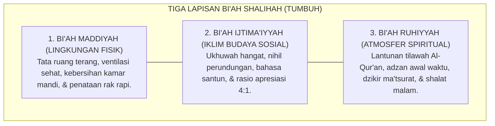
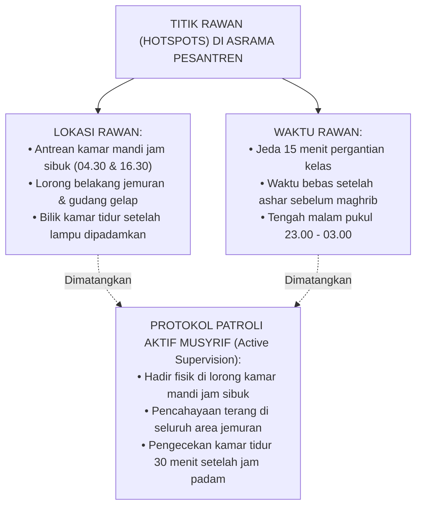

# P1-06-03: EKOSISTEM BI'AH SHALIHAH DAN REKAYASA TATA RUANG LINGKUNGAN
## *Environmental Engineering, Nudge Theory di Asrama, Mitigasi Titik Rawan (Hotspots), dan Ekologi Ruhiyah 24-Jam*

**Nomor Identifikasi**: `P1-06-03/BIAH-SHALIHAH/2026`  
**Domain**: `01 Philosophy` > `06 Change`  
**Dewan Pakar**: `pakar-intervensi-preventif`, `pakar-pengasuhan-asrama`, `pakar-filosofi-tumbuh`

---

## 📑 DAFTAR ISI ANALITIS

1. [1. Konsep Bi'ah Shalihah: Ekologi Lingkungan Penentu Karakter](#1-konsep-biah-shalihah-ekologi-lingkungan-penentu-karakter)
2. [2. Khazanah Hadits: Kisah Pembunuh 100 Nyawa dan Perintah Hijrah Lingkungan](#2-khazanah-hadits-kisah-pembunuh-100-nyawa-dan-perintah-hijrah-lingkungan)
3. [3. Rekayasa Lingkungan Modern: Environmental Design & Nudge Theory](#3-rekayasa-lingkungan-modern-environmental-design--nudge-theory)
4. [4. Mitigasi Titik Rawan Asrama (*Hotspots Patrol Protocol*)](#4-mitigasi-titik-rawan-asrama-hotspots-patrol-protocol)
5. [5. Implikasi Tata Ruang Fisik & Sosial Pesantren TUMBUH](#5-implikasi-tata-ruang-fisik--sosial-pesantren-tumbuh)

---

### 1. Konsep Bi'ah Shalihah: Ekologi Lingkungan Penentu Karakter

Karakter manusia tidak pernah tumbuh di ruang hampa yang terisolasi dari lingkungannya. Sebagaimana tanaman yang membutuhkan tanah yang gembur, air yang jernih, dan sinar matahari yang cukup untuk tumbuh subur, fitrah santri membutuhkan **Bi'ah Shalihah (Lingkungan Sosial-Spiritual yang Kondusif)** untuk mekar sempurna.

Jika lingkungan asrama dipenuhi oleh kekerasan, lorong-lorong gelap tanpa pengawasan, fasilitas mandi yang kotor dan berebut, serta bahasa makian yang dinormalisasi, maka sistem pembinaan yang secanggih apapun akan gagal. 

Ekosistem TUMBUH memandang penataan lingkungan (*Environmental Engineering*) sebagai **intervensi preventif tingkat pertama (Tier 1 Universal)** yang menentukan 80% keberhasilan penanaman adab.

---

### 2. Khazanah Hadits: Kisah Pembunuh 100 Nyawa

Pentingnya rekayasa lingkungan ditegaskan oleh Rasulullah SAW dalam kisah masyhur tentang seorang lelaki Bani Israil yang membunuh 99 orang lalu menggenapkannya menjadi 100 orang. Ketika ia bertanya kepada seorang ulama yang bijak tentang pintu taubat, sang ulama tidak hanya menyuruhnya beristighfar, melainkan memerintahkannya untuk **segera berpindah lingkungan (*Hijrah Bi'ah*)**:

> $$\text{انْطَلِقْ إِلَى أَرْضِ كَذَا وَكَذَا، فَإِنَّ بِهَا أُنَاسًا يَعْبُدُونَ اللَّهَ فَاعْبُدِ اللَّهَ مَعَهُمْ، وَلَا تَرْجِعْ إِلَى أَرْضِكَ فَإِنَّهَا أَرْضُ سُوءٍ}$$
> 
> *"Pergilah engkau ke negeri anu dan anu! Karena sesungguhnya di sana terdapat kaum yang senantiasa beribadah kepada Allah, maka beribadahlah kepada Allah bersama mereka; **dan janganlah engkau sekali-kali kembali ke negerimu yang lama, karena sesungguhnya negerimu itu adalah lingkungan yang buruk!**"* (HR. Muslim no. 2766).

Hadits ini adalah landasan metodologis fundamental: **taubat dan perbaikan karakter mustahil bertahan jika seseorang tetap tinggal di lingkungan yang merangsang kemaksiatan**. Pesantren didirikan untuk menjadi tanah hijrah (*Ardh Thaybah*) yang melindungi santri dari polusi moral dunia luar.

---

### 3. Rekayasa Lingkungan Modern: Environmental Design & Nudge Theory

Kearifan Islam ini bersinergi dengan teori rekayasa perilaku modern:
* **Crime Prevention Through Environmental Design (CPTED oleh C. Ray Jeffery, 1971)**: Menata lingkungan fisik sedemikian rupa sehingga menghilangkan kesempatan terjadinya perilaku menyimpang melalui pencahayaan yang cukup, pengawasan visual alami (*natural surveillance*), dan pembatasan akses area tersembunyi.
* **Nudge Theory (Richard Thaler & Cass Sunstein, 2008)**: Mendorong perilaku positif tanpa paksaan melalui desain arsitektur pilihan (*choice architecture*). Contoh: meletakkan rak sandal tepat di depan pintu masuk wudhu dengan tanda visual garis hijau secara otomatis mendorong santri menata sandal dengan rapi tanpa perlu dibentak.

---

### 4. Mitigasi Titik Rawan Asrama (*Hotspots Patrol Protocol*)

Berdasarkan analisis data PBIS, 85% insiden perundungan dan pelanggaran adab di pesantren terjadi pada **titik rawan waktu dan lokasi (*Hotspots*)**:

---

### 5. Implikasi Tata Ruang Fisik & Sosial Pesantren TUMBUH

1. **Standar Tata Cahaya & Sirkulasi Udara**: Seluruh bilik kamar dan lorong asrama wajib memiliki ventilasi silang yang sehat dan pencahayaan terang benderang (*Zero Dark Corridors*).
2. **Rekayasa Visual Adab**: Memasang infografis adab harian berdesain estetis di titik-titik strategis (adab makan di kantin, adab wudhu di kran, adab tidur di bilik).
3. **Pengawasan Aktif Bersahabat (*Friendly Active Supervision*)**: Musyrif berpatroli dengan senyuman dan sapaan hangat di area-area berkumpul santri, menghadirkan rasa aman yang nyata bagi seluruh santri baru.
