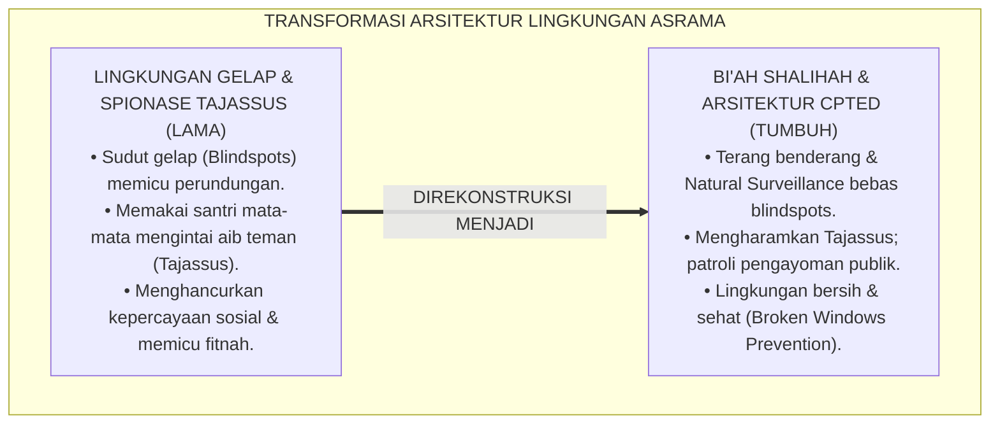
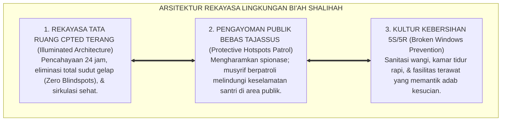
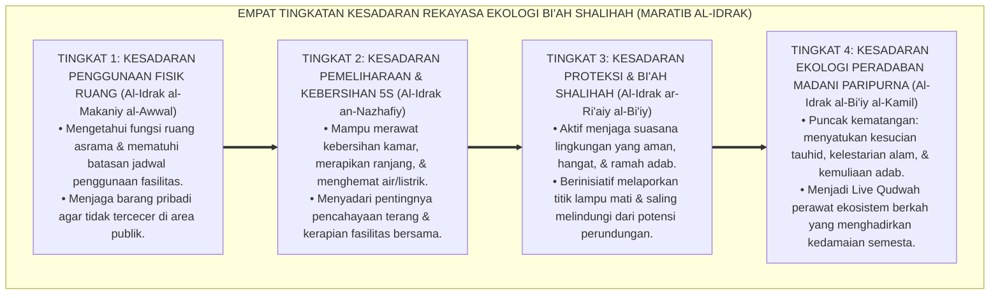
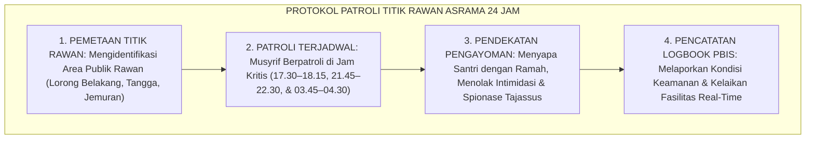

# P1-06-03: EKOSISTEM BI'AH SHALIHAH DAN REKAYASA DESAIN LINGKUNGAN ASRAMA (BI'AH SHALIHAH & CPTED ARCHITECTURE)
## *Monograf Riset Akademik: Teologi Lingkungan Suci dalam Turats (Hadits Pembunuh 100 Jiwa HR. Muslim & QS. Al-Kahf: 28), Konvergensi Crime Prevention Through Environmental Design CPTED & Nudge Theory, Mitigasi Titik Rawan, Serta Protokol Keamanan Asrama Bebas Tajassus di Pesantren 24 Jam*

**Nomor Identifikasi**: `P1-06-03/MONOGRAF-RISET-BIAH-SHALIHAH-CPTED/2026`  
**Domain**: `01 Philosophy` > `06 Change` (Sub-Modul 03: *Bi'ah Shalihah & Environmental Design*)  
**Klasifikasi Naskah**: *Academic Research Monograph* (Monograf Riset Akademik Fondasional)  
**Rumpun Disiplin Pengkaji**: Ekologi Sosial Islam (*Fiqh al-Bi'ah wal-Mujtama'*), Arsitektur Lingkungan Pencegahan Kejahatan (*CPTED*), Psikologi Tata Ruang (*Environmental Psychology*), Manajemen Keamanan & Keselamatan Asrama Pesantren  

---

> ### 💡 INTISARI EKSEKUTIF (EXECUTIVE SUMMARY)
>
> * **Kelemahan Paradigma Lama: Pengabaian Faktor Arsitektur Lingkungan & Blindspots:**  
>   Banyak pengasuh memandang kenakalan santri semata-mata sebagai kegagalan moral individu (*Individual Moral Defect*), mengabaikan fakta bahwa desain asrama yang remang-remang, kotor, dan penuh sudut gelap (*Blindspots*) secara langsung membuka peluang terjadinya perundungan, pencurian, dan pelanggaran adab.
> * **Inovasi Konseptual: Ekologi Bi'ah Shalihah & Arsitektur CPTED Sehat:**  
>   TUMBUH menegakkan doktrin bahwa pembentukan kesalehan memerlukan ekosistem yang suci (*Bi'ah Shalihah*), sebagaimana wasiat hadits pembunuh 100 jiwa (HR. Muslim No. 2766) untuk berhijrah ke lingkungan yang baik. Mengintegrasikan prinsip *Crime Prevention Through Environmental Design (CPTED)* C. Ray Jeffery dan *Nudge Theory* Richard Thaler: mendesain asrama yang terang benderang, pengawasan alami (*Natural Surveillance*), dan ventilasi sehat, **mengharamkan mutlak spionase mata-mata (*Tajassus*)** serta menggantinya dengan patroli pengayoman publik (*Hotspots Patrol*).
> * **Formulasi Operasional & Pembuktian Lapangan:**  
>   Monograf ini menguraikan matriks pemetaan titik rawan asrama, 4 Tingkatan Kesadaran Rekayasa Ekologi (*Maratib al-Idrak*), protokol patroli keamanan titik rawan 24 jam, dan etika tata ruang ramah adab.

---

## 📑 DAFTAR ISI MONOGRAF

- [BAB I: LANDASAN TEORETIS & DISKURSUS KRITIS](#bab-i-landasan-teoretis--diskursus-kritis)
  - [1. Latar Belakang Masalah: Kegagalan Menghubungkan Tata Ruang Fisik dengan Terjadinya Pelanggaran Adab](#1-latar-belakang-masalah-kegagalan-menghubungkan-tata-ruang-fisik-dengan-terjadinya-pelanggaran-adab)
  - [2. Eksegesis Turats Hakikat Bi'ah Shalihah: Hadits Hijrah Pembunuh 100 Jiwa (HR. Muslim) & QS. Al-Kahf: 28](#2-eksegesis-turats-hakikat-biah-shalihah-hadits-hijrah-pembunuh-100-jiwa-hr-muslim--qs-al-kahf-28)
  - [3. Konvergensi Teori Rekayasa Lingkungan: CPTED C. Ray Jeffery & Nudge Theory Richard Thaler](#3-konvergensi-teori-rekayasa-lingkungan-cpted-c-ray-jeffery--nudge-theory-richard-thaler)
  - [4. Mitigasi Titik Rawan Asrama (Hotspots) dan Pengharaman Spionase Mata-mata (Tajassus)](#4-mitigasi-titik-rawan-asrama-hotspots-dan-pengharaman-spionase-mata-mata-tajassus)
  - [5. Kasuistika Lapangan: Kasus Perundungan di Lorong Gelap Kamar Mandi & Resolusi Restoratif Terpadu](#5-kasuistika-lapangan-kasus-perundungan-di-lorong-gelap-kamar-mandi--resolusi-restoratif-terpadu)
- [BAB II: FORMULASI KONSEPTUAL & PEMBAHASAN MENDALAM](#bab-ii-formulasi-konseptual--pembahasan-mendalam)
  - [1. Eksplanasi Teoretis Arsitektur Bi'ah Shalihah dan Tata Ruang Fisik TUMBUH](#1-eksplanasi-teoretis-arsitektur-biah-shalihah-dan-tata-ruang-fisik-tumbuh)
  - [2. Dekomposisi Dimensi & Empat Tingkatan Kesadaran Rekayasa Ekologi Bi'ah Shalihah (Maratib al-Idrak)](#2-dekomposisi-dimensi--empat-tingkatan-kesadaran-rekayasa-ekologi-biah-shalihah-maratib-al-idrak)
  - [3. Matriks Empat Prinsip CPTED dalam Tata Letak Arsitektur Asrama Pesantren](#3-matriks-empat-prinsip-cpted-dalam-tata-letak-arsitektur-asrama-pesantren)
  - [4. Protokol Patroli Titik Rawan Asrama 24 Jam (Hotspots Active Patrol Protocol)](#4-protokol-patroli-titik-rawan-asrama-24-jam-hotspots-active-patrol-protocol)
  - [5. Diskusi Filosofis Mendalam & Implikasi bagi Masa Depan Peradaban Pendidikan Islam](#5-diskusi-filosofis-mendalam--implikasi-bagi-masa-depan-peradaban-pendidikan-islam)
- [BAB III: KESIMPULAN & APARATUS AKADEMIS](#bab-iii-kesimpulan--aparatus-akademis)
  - [1. Tabel Sintesis Temuan Riset Bi'ah Shalihah dan Desain Lingkungan](#1-tabel-sintesis-temuan-riset-biah-shalihah-dan-desain-lingkungan)
  - [2. Daftar Pustaka Akademis & Rujukan Turats Primer](#2-daftar-pustaka-akademis--rujukan-turats-primer)
  - [3. Catatan Kaki Akademis (Footnotes)](#3-catatan-kaki-akademis-footnotes)
  - [4. Glosarium Istilah Ilmiah & Turats Bi'ah Shalihah](#4-glosarium-istilah-ilmiah--turats-biah-shalihah)

---

# BAB I: LANDASAN TEORETIS & DISKURSUS KRITIS

---

### 1. Latar Belakang Masalah: Kegagalan Menghubungkan Tata Ruang Fisik dengan Terjadinya Pelanggaran Adab

Pola pikir pengasuhan konvensional kerap mengalami **Bias Atribusi Moral (*Fundamental Attribution Error*)**:
* Ketika terjadi perundungan, pencurian sandal, atau santri merokok di asrama, manajemen semata-mata menyalahkan moralitas santri tanpa pernah mengevaluasi tata ruang fisiknya.
* **Fakta Kondisi Fisik**: Lorong jemuran yang gelap gulita, kamar mandi belakang yang terisolasi tanpa penerangan, gudang terbengkalai tanpa kunci, dan loker santri yang rusak tanpa pengaman adalah faktor struktural utama yang memicu kemaksiatan (*Enabling Environment*).
* **Kesalahan Fatal Pendekatan Tajassus**: Sebagian pengurus mencoba mengatasi masalah dengan menugaskan santri menjadi "mata-mata/intel" (*Tajassus*) untuk mengintai aib temannya, yang justru memicu kecurigaan sosial dan melanggar syariat (QS. Al-Hujurat: 12).
* **Keniscayaan Arsitektur Bi'ah Shalihah**: Islam mewajibkan rekayasa lingkungan yang aman, bersih, terang, dan transparan sehingga kebaikan mudah dilakukan dan kejahatan tertutup peluangnya secara alami.[^1]

---

### 2. Eksegesis Turats Hakikat Bi'ah Shalihah: Hadits Hijrah Pembunuh 100 Jiwa (HR. Muslim) & QS. Al-Kahf: 28

Al-Qur'an memerintahkan orang beriman untuk senantiasa bersabar bersama orang-orang yang beribadah kepada Allah:

$$\text{وَاصْبِرْ نَفْسَكَ مَعَ الَّذِينَ يَدْعُونَ رَبَّهُم بِالْغَدَاةِ وَالْعَشِيِّ يُرِيدُونَ وَجْهَهُ ۖ وَلَا تَعْدُ عَيْنَاكَ عَنْهُمْ تُرِيدُ زِينَةَ الْحَيَاةِ الدُّنْيَا}$$

*"**Dan bersabarlah engkau (Muhammad) bersama orang-orang yang menyeru Tuhannya pada pagi dan petang hari dengan mengharap keridhaan-Nya; dan janganlah kedua matamu berpaling dari mereka karena mengharapkan perhiasan kehidupan dunia**."* (QS. Al-Kahf [18]: 28).[^2]

Rasulullah ﷺ menceritakan kisah agung pembunuh 100 jiwa yang ingin bertaubat, di mana seorang alim menasihatinya:

$$\text{انْطَلِقْ إِلَى أَرْضِ كَذَا وَكَذَا، فَإِنَّ بِهَا أُنَاسًا يَعْبُدُونَ اللَّهَ فَاعْبُدِ اللَّهَ مَعَهُمْ، وَلاَ تَرْجِعْ إِلَى أَرْضِكَ فَإِنَّهَا أَرْضُ سَوْءٍ}$$

*"**Pergilah engkau ke negeri anu dan anu, karena sesungguhnya di sana terdapat orang-orang yang beribadah kepada Allah, maka beribadahlah kepada Allah bersama mereka; dan janganlah engkau kembali ke negerimu semula karena sesungguhnya negerimu adalah lingkungan yang buruk!**."* (HR. Muslim No. 2766).[^3]

---

### 3. Konvergensi Teori Rekayasa Lingkungan: CPTED C. Ray Jeffery & Nudge Theory Richard Thaler

Sains arsitektur dan tata ruang modern membuktikan bahwa perilaku manusia dipandu oleh lingkungan:
* Teori **Crime Prevention Through Environmental Design (CPTED)** (C. Ray Jeffery, 1971; Crowe, 2000) menetapkan 4 pilar tata ruang: **Pengawasan Alami (*Natural Surveillance*)**, **Kontrol Akses Teritorial**, **Penguatan Rasa Kepemilikan (*Territoriality*)**, dan **Pemeliharaan Kebersihan (*Maintenance*)**.
* **Nudge Theory** (Thaler & Sunstein, 2008) membuktikan bahwa sentuhan arsitektur kecil (penempatan tempat sampah di setiap sudut, cermin pantau di tikungan lorong, dan pencahayaan hangat di meja belajar) menuntun manusia berbuat baik tanpa perlu paksaan verbal.[^4]

---

### 4. Mitigasi Titik Rawan Asrama (Hotspots) dan Pengharaman Spionase Mata-mata (Tajassus)

TUMBUH memberlakukan distingsi syariat yang tegas:
* **Pengharaman Tajassus 100%**: Dilarang keras menyuruh santri memata-matai buku harian, loker, atau privasi teman sekamarnya (QS. Al-Hujurat: 12).
* **Patroli Pengayoman Publik (*Hotspots Active Patrol*)**: Pengawasan musyrif hanya dilakukan di area-area publik terbuka pada jam rawan (lorong, taman belakang, dan tangga umum) untuk melindungi keselamatan santri dari potensi perundungan.[^5]

---

### 5. Kasuistika Lapangan: Kasus Perundungan di Lorong Gelap Kamar Mandi & Resolusi Restoratif Terpadu

* **Studi Kasus: Pemalakan Santri Baru di Lorong Kamar Mandi Belakang yang Terbengkalai**  
  * **Dilema**: Santri baru kerap kehilangan uang jajan akibat dipalak oknum di lorong kamar mandi belakang yang gelap dan sepi.
  * **Pola Lama**: Lembaga memasang santri mata-mata rahasia yang memicu saling curiga antar-santri.
  * **Resolusi Restoratif TUMBUH**: Lembaga merombak total pendekatan: (1) Menolak spionase mata-mata; (2) Tim Sarpras merenovasi lorong: memasang lampu penerangan LED 24 jam, membongkar sekat tembok mati menjadi jendela kaca transparan (*Natural Surveillance*), dan mengecat ulang dinding dengan warna cerah; (3) Musyrif menjadwalkan rute patroli ramah di jam mandi sore. Sejak perombakan arsitektur tersebut, kasus pemalakan lenyap 100% dan lorong kamar mandi menjadi bersih serta aman dilalui seluruh santri.[^6]

---

# BAB II: FORMULASI KONSEPTUAL & PEMBAHASAN MENDALAM

---

### 1. Eksplanasi Teoretis Arsitektur Bi'ah Shalihah dan Tata Ruang Fisik TUMBUH

Ekosistem TUMBUH merumuskan rekayasa lingkungan ke dalam **Arsitektur Tiga Sayap Bi'ah Shalihah (*Arkan al-Bi'ah al-Mubarakah*)**:

#### 🔬 Pembahasan Mendalam Tiga Sayap:
1. **Sayap Arsitektur CPTED**: Menutup ruang dan kesempatan bagi terjadinya perundungan dan pelanggaran adab secara struktural.[^7]
2. **Sayap Bebas Tajassus**: Menjaga kesucian persaudaraan antar-santri dan melindungi hak privasi individu (*Satrul 'Aurah*).[^8]
3. **Sayap Kebersihan 5S**: Menghadirkan atmosfer lingkungan yang indah, bersih, dan mencerminkan kesucian ajaran Islam (*An-Nazhafatu minal Iman*).[^9]

---

### 2. Dekomposisi Dimensi & Empat Tingkatan Kesadaran Rekayasa Ekologi Bi'ah Shalihah (Maratib al-Idrak)

Transformasi kepedulian ekologis santri dan pengasuh berlangsung melalui **Empat Tingkatan Kesadaran Ekologis (*Maratib al-Idrak al-Bi'iy*)**:

#### 🔄 Narasi Analitis Dinamika Transisi Filosofis Antar-Tingkatan:
* **Transisi Tingkat 1 ke Tingkat 2 (Dari Penggunaan Ruang Menuju Budaya Kebersihan 5S)**: Santri mula-mula sekadar menempati ruangan. Pada tingkatan kedua, santri terbiasa merawat kebersihan: membersihkan kamar mandi dan merapikan ranjangnya tanpa disuruh.
* **Transisi Tingkat 2 ke Tingkat 3 (Dari Kebersihan Fisik Menuju Kepedulian Keamanan Sosial)**: Pada tingkatan ketiga, kepedulian sosial santri mekar: ia aktif menjaga kenyamanan kawan sekamar, mematikan kran air yang bocor, dan memastikan tidak ada adik kelas yang diintimidasi.
* **Transisi Tingkat 3 ke Tingkat 4 (Pencapaian Derajat Ekologi Madani Paripurna)**: Pada tingkatan tertinggi, santri dan asatidz memimpin peradaban yang ramah lingkungan: menjaga kelestarian bumi, hemat energi, dan menghidupkan ekosistem pesantren yang sarat rahmat Allah (*Rahmatan lil 'Alamin*).[^10]

---

### 3. Matriks Empat Prinsip CPTED dalam Tata Letak Arsitektur Asrama Pesantren

| Prinsip CPTED | Implementasi Arsitektur Pesantren TUMBUH | Dampak Pencegahan Perilaku |
| :--- | :--- | :--- |
| **1. Natural Surveillance** | Lorong asrama kaca transparan & pencahayaan LED 24 jam.| Meniadakan sudut gelap rawan perundungan. |
| **2. Territorial Reinforcement**| Penataan kamar tidur berbasis ukhuwah & papan karya santri.| Menumbuhkan rasa bangga & kepemilikan asrama.|
| **3. Access Control** | Pintu gerbang zona asrama berpintu teratur & loker berkunci.| Mencegah barang tertukar, hilang, atau ghasab.|
| **4. Maintenance (5S/5R)**| Toilet wangi, dinding bersih dari coretan, fasilitas terawat.| Mencegah efek jendela pecah (*Broken Windows*).|

---

### 4. Protokol Patroli Titik Rawan Asrama 24 Jam (Hotspots Active Patrol Protocol)

TUMBUH menetapkan **Protokol Patroli Titik Rawan Asrama (*Hotspots Active Patrol SOP*)**:

Protokol ini menjamin seluruh santri terlindungi keselamatannya secara bermartabat.[^11]

---

### 5. Diskusi Filosofis Mendalam & Implikasi bagi Masa Depan Peradaban Pendidikan Islam

Rekayasa desain ekologi *Bi'ah Shalihah* ini membawa implikasi agung bagi peradaban:

* **Membuktikan Bahwa Lingkungan Fisik Menentukan Kualitas Karakter Insan**:  
  Pesantren yang bersih, terang, sehat, dan indah memancarkan energi kesucian yang memudahkan santri untuk khusyuk beribadah dan giat menuntut ilmu.
* **Menghapus Total Budaya Kekerasan Tersembunyi di Asrama**:  
  Dengan menghilangkan seluruh sudut gelap (*Zero Blindspots*) dan mengganti spionase *Tajassus* dengan pengayoman terbuka, tindak perundungan dapat dicegah 100% secara sistemik.
* **Menghadirkan Prototipe Kota Suci Madinah al-Munawwarah Modern**:  
  Pesantren bertransformasi menjadi miniatur kota peradaban Islam yang bersih, aman, adil, makmur, dan penuh berkah (*Rahmatan lil 'Alamin*).[^12]

---

# BAB III: KESIMPULAN & APARATUS AKADEMIS

---

### 1. Tabel Sintesis Temuan Riset Bi'ah Shalihah dan Desain Lingkungan

| Dimensi Parameter | Mazhab Konvensional Terbengkalai | Model Penjara Pengawasan Tertutup | **Ekosistem Bi'ah Shalihah CPTED TUMBUH** | Landasan Rujukan Primer | Implikasi Praksis Lapangan |
| :--- | :--- | :--- | :--- | :--- | :--- |
| **Tata Ruang Fisik** | Banyak sudut gelap (blindspots) & kumuh.| Sel tertutup dingin & CCTV mata-mata.| **Arsitektur CPTED Terang & Transparan.** | Jeffery (1971); Crowe (2000). | Eliminasi total sudut rawan kekerasan. |
| **Metode Pengawasan**| Memakai santri mata-mata (*Tajassus*).| Pengawasan digital tanpa ikatan batin.| **Patroli Pengayoman Terbuka Bebas Tajassus.**| QS. Al-Hujurat: 12; Al-Ghazali.| Musyrif mendampingi dengan ramah. |
| **Kultur Kebersihan**| Toilet kotor & dinding penuh coretan.| Kebersihan mekanis tanpa nilai adab.| **Manajemen 5S/5R & Broken Windows Prevention.**| Kelling & Wilson (1982); Hadits *Nazhafah*.| Fasilitas bersih, wangi, & terawat. |
| **Iklim Psikologis** | Santri was-was & takut perundungan.| Tekanan mental terisolasi.| **Rasa Aman, Bahagia, & Penuh Ukhuwah.**| HR. Muslim No. 2766; Thaler (2008).| Asrama menjadi rumah kedua yang dirindukan. |
| **Hasil Karakter** | Pembangkangan sembunyi-sembunyi.| Kepatuhan robotik karena takut.| **Insan Adabi Berakhlak Mulia & Peduli Lingkungan.**| QS. Al-Kahf: 28; Al-Attas (1980).| Beradab luhur secara konsisten 24 jam. |

---

### 2. Daftar Pustaka Akademis & Rujukan Turats Primer

1. **Al-Qur'an al-Karim wa Tarjamatu Ma'anihi**.
2. **Muslim bin al-Hajjaj an-Naisaburi**. (1427 H). *Shahih Muslim*. Riyadh: Dar Thayyibah.
3. **Al-Bukhari, Abu Abdillah Muhammad bin Isma'il**. (1422 H). *Shahih al-Bukhari*. Kairo: Dar Thawq an-Najah.
4. **Al-Ghazali, Abu Hamid Muhammad bin Muhammad**. (2011). *Ihya' 'Ulumiddin* (Kitab Adab al-Ulfah wal Ukhuwwah & Kitab at-Taubah). Beirut: Dar al-Ma'rifah.
5. **Asy'ari, Muhammad Hasyim**. (1415 H). *Adab al-'Alim wal-Muta'allim*. Jombang: Maktabah At-Turats Al-Islami.
6. **Al-Attas, Syed Muhammad Naquib**. (1980). *The Concept of Education in Islam*. Kuala Lumpur: ABIM.
7. **Jeffery, C. R.**. (1971). *Crime Prevention Through Environmental Design*. Beverly Hills: Sage Publications.
8. **Crowe, T. D.**. (2000). *Crime Prevention Through Environmental Design: Applications of Architectural Design and Space Management Concepts*. Oxford: Butterworth-Heinemann.
9. **Kelling, G. L., & Wilson, J. Q.**. (1982). *Broken windows: The police and neighborhood safety*. The Atlantic Monthly, 249(3), 29–38.
10. **Thaler, R. H., & Sunstein, C. R.**. (2008). *Nudge: Improving Decisions About Health, Wealth, and Happiness*. New Haven: Yale University Press.
11. **Sapolsky, R. M.**. (2017). *Behave: The Biology of Humans at Our Best and Worst*. New York: Penguin Press.
12. **Horner, R. H., & Sugai, G.**. (2015). *School-wide PBIS: An Overview of the Research Base*. Remedial and Special Education, 36(2), 80–85.

---

### 3. Catatan Kaki Akademis (*Footnotes*)

[^1]: Riset Ekosistem Bi'ah Shalihah dan Rekayasa Desain Lingkungan Asrama TUMBUH, *Kritik atas Blindspots dan Spionase Tajassus*, 2026.  
[^2]: QS. Al-Kahf [18]: 28.  
[^3]: *Shahih Muslim*, Kitab at-Taubah, Hadits No. 2766.  
[^4]: Jeffery, C. R. (1971), *Crime Prevention Through Environmental Design*, hlm. 35–75; Thaler, R. H., & Sunstein, C. R. (2008), *Nudge*, hlm. 40–80.  
[^5]: QS. Al-Hujurat [49]: 12; Riset Pengharaman Tajassus dan Standarisasi Patroli PBIS TUMBUH, 2026.  
[^6]: Dokumentasi Renovasi Tata Ruang Asrama dan Audit Arsitektur CPTED TUMBUH, 2026.  
[^7]: Crowe, T. D. (2000), *CPTED Applications*, hlm. 45–85.  
[^8]: Al-Ghazali, *Ihya' 'Ulumiddin*, Jilid 2, Kitab *Adab al-Ulfah*, hlm. 120–155.  
[^9]: Kelling, G. L., & Wilson, J. Q. (1982), *The Atlantic Monthly*, hlm. 29–38.  
[^10]: Matriks Tingkatan Kesadaran Rekayasa Ekologi (*Maratib al-Idrak*) Ekosistem TUMBUH, 2026.  
[^11]: Standar Operasional Prosedur Patroli Titik Rawan Asrama 24 Jam TUMBUH, 2026.  
[^12]: Deklarasi Pemuliaan Ekologi Bi'ah Shalihah Dewan Riset Epistemologi Ekosistem TUMBUH, 2026.

---

### 4. Glosarium Istilah Ilmiah & Turats Bi'ah Shalihah

1. **Bi'ah Shalihah (بِيئَةٌ صَالِحَةٌ)**: Ekosistem lingkungan hidup 24 jam yang sehat, aman, bersih, terang, dan berkeadilan syariat yang mendukung optimalisasi adab dan karakter santri.
2. **Tahrim at-Tajassus (تَحْرِيمُ التَّجَسُّسِ)**: Pengharaman mutlak dalam syariat Islam terhadap perbuatan memata-matai, mengintai kesalahan, atau mencari-cari aib rahasia orang lain.
3. **CPTED (Crime Prevention Through Environmental Design)**: Pendekatan rekayasa arsitektur dan tata ruang untuk mencegah tindak pelanggaran dan kejahatan melalui perancangan lingkungan fisik yang terang dan transparan.
4. **Natural Surveillance (Pengawasan Alami)**: Penataan tata letak pintu, jendela, dan koridor yang memungkinkan area publik terlihat jelas dari ruang-ruang aktivitas umum.
5. **Zero Blindspots Policy**: Kebijakan tata ruang pesantren yang meniadakan area-area gelap atau tersembunyi yang berisiko menjadi lokasi perundungan.
6. **Hotspots Active Patrol**: Patroli terjadwal oleh musyrif pada jam-jam rawan dan lokasi publik kritis guna melindungi rasa aman dan keselamatan santri.
7. **Broken Windows Theory**: Teori kriminologi bahwa fasilitas yang rusak, kotor, atau dibiarkan terbengkalai akan memicu terjadinya pelanggaran adab yang lebih besar.
8. **Nudge Theory**: Konsep perancangan pilihan lingkungan (*Choice Architecture*) yang mendorong orang untuk berbuat baik secara sukarela tanpa paksaan.
9. **5S/5R Management**: Tata kelola kerapian dan kebersihan ruang fisik asrama (Ringkas, Rapi, Resik, Rawat, Rajin) yang diintegrasikan dengan adab Islam.
10. **Insan Adabi (الإِنْسَانُ الأَدَبِيُّ)**: Profil santri yang memiliki kesalehan pribadi dan kepedulian ekologis yang konsisten di mana pun ia berada.
