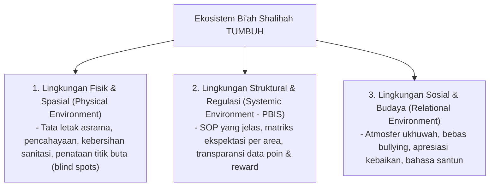

# P1-06-03-Ekosistem-Biah-Shalihah-dan-Desain-Lingkungan

## Tujuan
Membahas pentingnya **Bi'ah Shalihah** (Lingkungan yang Kondusif & Shalih) dan desain arsitektur lingkungan (selaras dengan prinsip PBIS) sebagai faktor determinan pembentuk perilaku santri di pondok pesantren.

---

## Falsafah Bi'ah Shalihah dalam Khazanah Islam

Kisah legendaris pembunuh 100 nyawa dalam Hadis Shahih (*HR. Bukhari & Muslim*) menegaskan nasihat seorang alim:  
> *"Pergilah engkau ke negeri fulan, karena di sana ada orang-orang yang beribadah kepada Allah... dan jangan kembali ke negerimu karena negerimu adalah negeri yang buruk."*

Pesan fundamentalnya: **Perubahan akhlak mustahil bertahan jika seseorang tetap berada dalam lingkungan yang toksik dan memicu kemaksiatan.**

## Landasan Sains Global: Behavioral Architecture & Habit Science

Konsep **Bi'ah Shalihah** selaras dengan konsensus sains perilaku modern:
* **Habit Cues & Contextual Determinism (Wendy Wood & David Neal, 2009; James Clear, 2018)**: Lebih dari 40% perilaku harian manusia dikendalikan oleh isyarat lingkungan (*environmental cues*), bukan sekadar niat sadar (*willpower*). Mendesain lingkungan asrama yang minim godaan dan kaya pemicu kebaikan adalah kunci utama keberhasilan karakter.
* **Nudge Theory & Choice Architecture (Richard Thaler & Cass Sunstein, 2008)**: Mempermudah akses terhadap pilihan baik (contoh: meletakkan Al-Qur'an dan buku di tempat yang mudah dijangkau di kamar) dan mempersulit akses terhadap penyimpangan.
* **The Magic Ratio of Positive Reinforcement (John Gottman & Robert Levenson, 1992)**: Iklim sosial yang sehat membutuhkan rasio interaksi positif minimal **4:1 hingga 5:1** (4-5 kali apresiasi/validasi positif untuk setiap 1 teguran korektif).

---

## 3 Lapisan Desain Lingkungan Pesantren TUMBUH

---

## Implementasi Desain Lingkungan Berbasis Bukti (Evidence-Based)

1. **Eliminasi Titik Rawan (*Hotspots Reduction*)**:
   - Berdasarkan data PBIS, mayoritas pelanggaran (merokok, bullying, penggunaan gawai ilegal) terjadi pada jam dan lokasi tertentu yang minim pengawasan.
   - Solusi: Musyrif hadir dan melakukan patroli di titik rawan pada jam-jam krusial (misal: jeda waktu antar KBM dan maghrib, atau setelah isya).
2. **Ketersediaan Fasilitas Penunjang Kebiasaan Baik**:
   - Jika ingin santri rapi, sediakan gantungan baju, rak sepatu, dan loker yang memadai.
   - Jika ingin santri tertib sholat, pastikan tempat wudhu dan sarana masjid bersih dan lancar airnya.
3. **Membangun Kultur Pengakuan Positif (*Positive Culture*)**:
   - Memastikan rasio interaksi positif berbanding koreksi minimal **4:1** (setiap 1 koreksi kesalahan diimbangi dengan minimal 4 pengakuan atau apresiasi atas perbuatan baik santri).
